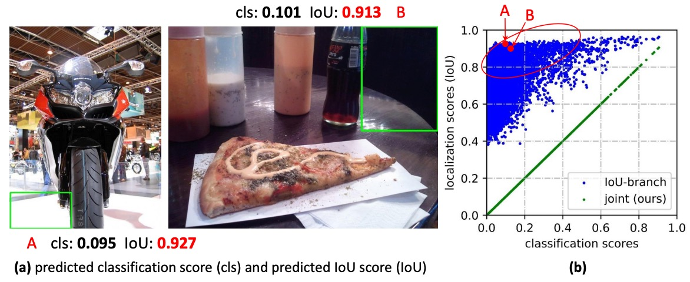
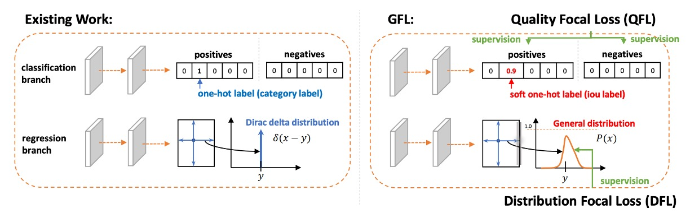
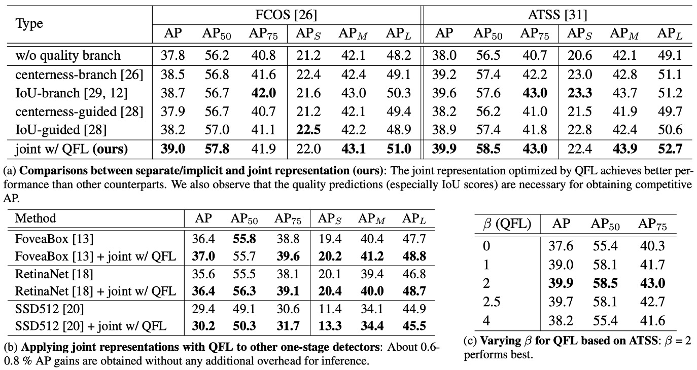

## 融合的焦點

[**Generalized Focal Loss: Learning Qualified and Distributed Bounding Boxes for Dense Object Detection**](https://arxiv.org/abs/2006.04388)

---

這個方法反覆出現在近年的物件偵測系統中，我們把握時間來看一下它的核心概念。

## 定義問題

在物件偵測裡，我們始終在追兩個分數：

- **分類分數**：這個框裡「是什麼」？
- **定位品質**：這個框「準不準」？

主流的一階偵測器（dense / one-stage）習慣把兩件事**分開學**：分類一個分支、品質（例如 IoU 或 centerness）再一個分支。

等到推論階段，就把所有候選框拿去做 NMS 排序，我們**把兩個分數直接相乘**來當最終得分，用它來決定誰可以留下來，作為最後的預測結果。

<figure style={{ "width": "90%"}}>

</figure>

為什麼要「乘」？

因為直覺上，我們希望「要不就分類高、要不就定位高，最好兩個都高」。

乘法在 0 ～ 1 的分數空間裡，能把任一邊的低分快速拉低總分，看起來很合理吧！

但這裡埋了兩個結構性問題：

1. **訓練與推論的不一致**：

   訓練時，分類與品質分支彼此獨立，**模型從未被明確要求「兩者的乘積要好」**；到了推論，卻突然用乘積來排序。 如果模型有知，肯定會大聲嚷一句：這跟講好的不一樣啊？

2. **負樣本的干擾**：

   品質分支通常只對**正樣本**監督，背景或負樣本沒有明確約束。

   結果導致有時候背景框的品質分數**會莫名其妙地很高**：

   - 即便分類分數偏低，只要品質分數偶爾飆高，乘積後的最終分數仍可能擠進前列，**把正樣本排擠掉**。
   - 在密集錨點/位置全面採樣的情境下，這種「排序錯位」會被放大，直接傷到 NMS 的最終決策。

    

    <figure style={{ "width": "90%"}}>
    
    </figure>
    

---

問題還不僅這些，我們對**邊界框本身的表示**也有疑慮。

長年以來，大家把框當成「確定座標」，但現實世界卻充滿不確定性：邊界模糊、遮擋、標註者差異等，用單一點去描述，顯得過於死板。

之前有人引入 **高斯分佈**，讓模型學一個平均值加一個方差，至少能表達「不確定度」。但高斯分布天生對稱、形狀單一，碰到真實資料裡**偏斜、長尾、甚至多峰**的情形，就顯得力有未逮。

於是我們又卡住了：

- **分數層面**：分類與定位品質**各說各話**，訓練目標與推論排序**對不上**，還時不時被負樣本亂入干擾。
- **框的表示**：不是**過度確定**，就是**過度簡化**，很難忠實反映資料裡真正的分布形狀。

我們能不能讓「分類」與「品質」說同一種語言，從一開始就對齊訓練與推論？

能不能不預設框分布長什麼樣，而是讓模型直接學到「更通用、更靈活」的分布表示？

## 解決問題

在開始說明本論文的方法之前，我們先複習一下小時候學過的 Focal Loss。

:::tip
想看 Focal Loss 的細節，可以參考我們之前的筆記：

- [**[17.08] RetinaNet: Focal Loss 才是本體**](../1708-retinanet/index.md)
  :::

### Focal Loss

在一階物件偵測中，分類器面對的第一個挑戰就是**樣本極端不平衡**。

大多數的候選框都是背景（negative），真正的前景（positive）反而極少。這會導致傳統交叉熵傾向被「一大堆很容易分的背景樣本」主導，模型雖然能很快把背景判對，但卻無法好好學會那些真正困難的前景樣本。

Focal Loss 的設計目標就是：

> **抑制容易樣本的貢獻、凸顯困難樣本的影響。**

它透過在損失函數前加上一個「動態縮放因子」$(1-p_t)^{\gamma}$，讓「被模型高度自信判對」的樣本貢獻接近於零，反之「模型不確定／容易出錯」的樣本，才會被強化。

形式為：

$$
\mathrm{FL}(p) \;=\; - (1 - p_t)^{\gamma}\,\log p_t,\qquad
p_t \;=\;
\begin{cases}
p, & y=1 \\
1-p, & y=0
\end{cases}
$$

其中：

- $p \in [0,1]$：模型預測屬於正類的機率。
- $y \in {0,1}$：真實標籤。
- $\gamma \ge 0$：控制「容易樣本」被壓制的強度。

這套機制的關鍵，在於它不是僅僅處理二元的 $y \in {0,1}$，而是為後續的**擴展到連續標籤**（$y \in [0,1]$）奠定基礎。換言之，當我們不再把樣本分成單純的「對 / 錯」，而是考慮更細緻的定位品質時，Focal Loss 的「聚焦難例」精神依然能被完整保留下來。

### Quality Focal Loss

<figure style={{ "width": "90%"}}>

</figure>

在理解了 Focal Loss 的聚焦機制之後，我們可以進一步思考：

> 在物件偵測中，輸出一個框除了要回答「這是什麼類別？」之外，還要回答「這個框畫得有多準？」。

傳統的做法是**把分類分數與定位品質分數分開學習，最後在推論時再相乘**。

然而我們剛才也說過了，這種「事後硬湊」的方法，訓練與推論之間存在著不一致：訓練時學的是分類，推論時卻要用分類死與品質的組合，兩者的分工並沒有真正協同。

為了解決這個問題，作者提出了 **Quality Focal Loss (QFL)**。

其設計理念是：**從一開始就讓模型學會「分類 × 品質」這個合成分數，而不是事後再拼湊。**

---

方法上，作者首先引入連續標籤。

- 在真實類別 $c^*$ 的那一維上，**標籤不再是單純的 $0$ 或 $1$**，而是候選框與 GT 的 **IoU 值**，即 $y \in [0,1]$。

  - $y=0$：表示不是該類別或品質為零。
  - $y=1$：表示完全正確且高品質。
  - 介於其間：代表該框部分正確、品質有限。

- 負樣本的所有類別標籤仍然是 $0$（品質 = 0）。
- 模型的輸出是對應類別的 **sigmoid 機率** $\sigma \in [0,1]$。

---

損失函數形式上，QFL 透過兩個步驟來達成目標：

將原本的二元交叉熵（BCE）拓展為完整 BCE，並將 Focal 的調制因子替換成「與標籤距離的連續版本」：

$$
\mathrm{QFL}(\sigma) \;=\; -\,|y-\sigma|^{\beta}\;\big[(1-y)\log(1-\sigma) + y\log\sigma\big], \qquad \beta \ge 0
$$

特性：

- 當 $\sigma = y$ 時，$\mathrm{QFL}$ 取到**全域最小**。
- $|y-\sigma|^{\beta}$ 為「連續版聚焦因子」：輸出與標籤偏差越大，懲罰越重。
- 若 $y \in {0,1}$ 且選擇合適的 $\beta$，則會**退化回原始 Focal Loss** 的型態。

QFL 方法在模型輸出的 $\sigma$ **已經同時包含分類與品質的融合訊號**，因此在推論中，排序與 NMS 可以**直接使用 $\sigma$**，大幅減少不一致性。

:::tip
我們來看個例子吧：

假設我們在訓練一個「狗」的偵測器，對應類別是 _dog_。

現在有一張圖裡，候選框（proposal）和真實框（GT）的 IoU 不同：

1. **候選框 A**：IoU = 0.9（幾乎完美，品質非常高）
2. **候選框 B**：IoU = 0.4（大致對，但位置偏差比較明顯）
3. **候選框 C**：IoU = 0.0（完全沒對上，是背景）

---

- **傳統 Focal Loss (FL)**

  在 FL 裡，標籤 $y$ 只能是二元：

  - A → $y=1$
  - B → $y=1$（雖然 IoU 只有 0.4，但仍算「正樣本」）
  - C → $y=0$

  模型只學到：**A 和 B 都一樣是正類，C 是負類**。
  也就是說，模型並不知道「A 比 B 好太多」，因為訓練訊號沒有這個資訊。

  ***

- **Quality Focal Loss (QFL)**

  在 QFL 裡，標籤 $y$ 不再是 ${0,1}$，而是候選框對應的 **IoU** 值：

  - A → $y=0.9$
  - B → $y=0.4$
  - C → $y=0.0$

  這時候，模型輸出 $\sigma$ 會直接被訓練成「接近 IoU」的數字：

  - A 應該學到 $\sigma \approx 0.9$
  - B 應該學到 $\sigma \approx 0.4$
  - C 應該學到 $\sigma \approx 0.0$

  換句話說，模型輸出的「分類分數」**同時包含了「是不是狗」和「畫得有多好」**。

---

損失函數的作用以候選框 B 為例：

- 真實標籤 $y=0.4$
- 模型第一次預測 $\sigma=0.7$

此時：

$$
\mathrm{QFL}(0.7) = -\,|0.4-0.7|^\beta \big[(1-0.4)\log(1-0.7) + 0.4 \log(0.7)\big]
$$

- $|0.4-0.7|^\beta$ 這個聚焦因子會提醒模型：
  **「你跟真實值還差 0.3，要修正」**。
- 而括號內就是 BCE，負責把 $\sigma$ 拉向 $0.4$。

所以最終 $\sigma$ 會慢慢收斂到 **真實 IoU 值**，而不是只學「有狗/沒狗」。
:::

### Distribution Focal Loss

到這裡，我們已經讓分類與品質在 QFL 裡合而為一。

接下來，剩下的另一個問題是：**框的位置回歸**。

傳統做法裡，每一個邊（左、右、上、下）的偏移量，都是直接回歸成一個數字。

這樣等於在告訴模型：

> 「正確答案只有一個點，你必須命中它。」

這聽起來很合理，但其實**太苛刻**。

因為在真實世界裡，框的位置不會只有單一的絕對答案，數據標註可能有誤差，模型的預測也有不確定性。如果只用單一數字回歸，就像是要求射手「只能正中紅心」，一點偏差都不能接受。

有人想到用 Gaussian（高斯分布）來代替單點，讓模型能表達不確定性。這雖然比 delta 好，但 Gaussian 是**對稱的、固定形狀的**，仍然無法靈活表達「我比較偏向左邊一點」這種情況。

作者認為：與其強迫模型「直接報答案」，不如讓模型「說出自己心中的分布」：

- 先把可回歸的範圍離散化成一格一格（$y_0, y_1, \dots, y_n$）。
- 然後，讓模型對這些格子輸出一個 **softmax 機率分布**。
- 最後，用分布的期望值當作回歸結果：

$$
\hat{y} = \sum_{i=0}^n S_i \, y_i
$$

這樣模型就不用死盯著某一個數字，而是能表達「我覺得答案大概在這附近」。

可是這種做法會導致分布有無限種形狀，都能給出同一個期望，模型無法高效學習。

<figure style={{ "width": "90%"}}>

</figure>

因此，作者這裡的設計很巧妙：只監督**最靠近真值的兩個格子**。

假設真值 $y$ 介於 $y_i$ 和 $y_{i+1}$ 之間，那就把它拆成比例：

- 離 $y_i$ 越近，就給 $y_i$ 權重越大。
- 離 $y_{i+1}$ 越近，就給 $y_{i+1}$ 權重越大。

數學上就是：

$$
w_{\text{left}} = \frac{y_{i+1}-y}{y_{i+1}-y_i}, \qquad
w_{\text{right}} = \frac{y-y_i}{y_{i+1}-y_i}
$$

損失函數也很簡單，直接用交叉熵：

$$
\mathrm{DFL} = - \Big[ w_{\text{left}} \log S_i + w_{\text{right}} \log S_{i+1} \Big]
$$

當模型學到 $S_i = w_{\text{left}}$、$S_{i+1} = w_{\text{right}}$ 的時候，期望值就能**精確還原真實的 $y$**。

:::tip
回到剛才偵測狗的例子：框的位置怎麼辦？

剛才在 QFL 的例子裡，我們關心的是「這個框裡是不是狗、而且畫得有多準」。
現在換個角度想：**假設候選框 B 的 IoU=0.4，是因為框的右邊界畫得太外面**。那我們該怎麼訓練模型把右邊界拉回來？

- **傳統回歸**：直接告訴模型「右邊界要往左移 7.3 個像素」。

  - 問題是，標註本身可能有點誤差，真的非得是 7.3 嗎？

- **DFL 的做法**：
  把「7.3」這個真值拆成 7 和 8 兩個節點，然後告訴模型：

  > 「這個邊界在 7 的機率是 0.7，在 8 的機率是 0.3。」

這樣，模型輸出的分布會集中在真值附近（7 和 8 之間），最終期望值 $\hat y = 0.7 \times 7 + 0.3 \times 8 = 7.3$，剛好對齊標籤。
:::

### Generalized Focal Loss

把上面兩條線（QFL 與 DFL）拉到同一個座標系來看，我們其實一直在做同一件事：

> **在相鄰的兩個標籤值之間，用機率做線性插值，並用「距離真值有多近」來決定要不要放大懲罰。**

先定義最小的局部座標系：

1. 取兩個相鄰的連續標籤值 $y_l < y_r$
2. 模型只需要預測它們的機率 $p_l, p_r \ge 0$（且 $p_l + p_r = 1$）
3. 最終的連續預測就由線性組合得到：

   $$
   \hat y \;=\; y_l\,p_l \;+\; y_r\,p_r, \qquad y \in [y_l,\,y_r].
   $$

接著，把「**聚焦難例**」這個精神用連續化的方式寫進損失函數：

如果 $\hat y$ 離真值 $y$：

- 越遠，就放大懲罰。
- 越近，就衰減懲罰。

於是我們得到 **Generalized Focal Loss（GFL）**：

$$
\mathrm{GFL}(p_l,p_r)
\;=\;
-\;\big|\,y - (y_l p_l + y_r p_r)\,\big|^{\beta}
\;\Big[\,(y_r - y)\,\log p_l \;+\; (y - y_l)\,\log p_r\,\Big]
$$

這個式子同時包含了兩個關鍵：

- **軟標籤的交叉熵**（中括號；權重由 $y$ 在 $[y_l,y_r]$ 的相對位置決定）；
- **連續版的聚焦因子** $\big|y-\hat y\big|^{\beta}$（絕對距離越大，懲罰越強；$\beta$ 控制強度）。

在這個數學式中，全域最小值出現在

$$
p_l^* \;=\; \frac{y_r - y}{\,y_r - y_l\,}, \qquad
p_r^* \;=\; \frac{y - y_l}{\,y_r - y_l\,},
$$

此時 $\hat y = y_l p_l^* + y_r p_r^* = y$，也就是**預測恰好回到連續真值**。

當 $\beta$ 增大，對「偏得遠」的例子懲罰更重；$\beta=0$ 則退成純軟標籤交叉熵。

---

到這裡，GFL 給了我們一個乾淨的視角：

> 用「兩點之間的插值」來描述連續標籤，用「與真值的距離」來決定聚焦強度。

分類與品質終於**說同一種語言**，框的位置也從**單點**進化到**分布**；

而這兩件事，最後都能被一個簡潔的公式統一起來。

這篇論文，我們就這樣看完了。

可喜可賀。

## 討論

本篇論文用 **COCO** 做完整評估，遵循常見設定：

- 訓練用 **trainval35k (115K)**。
- 驗證用 **minival (5K)** 做消融實驗。
- 最終到 **test-dev (20K)** 回報主結果。

實作基於 **mmdetection** 預設超參數；除非另述，消融都用 **ResNet-50**、**1× schedule（12 epochs）**、**不做 multi-scale**。速度在 **RTX 2080Ti、batch=1** 測量。

### QFL 是否有用？

<figure style={{ "width": "90%"}}>

</figure>

實驗結果如上表：

- **表 (a) 對照設計：聯合表示（QFL）優於分離或隱式方案。**

  在相同訓練設定與骨幹下，將分類分數與定位品質改為單一聯合分數（由 QFL 直接監督）能穩定超過：

  - 以 IoU 分支或 centerness 分支形式的「分離式品質估計」，以及在分類損失中對樣本做隱式加權的方法。

  這表示用一個分數同時承載「是什麼」與「畫得多準」比事後相乘更有效；同時，若仍採分離式品質估計，IoU 指標普遍優於 centerness 作為品質量測。

- **表 (b) 跨架構泛化：換頭即用，增益一致。**

  將 QFL 作為分類頭的訓練目標，替換多種一階偵測器的原分類損失，可見一致的準確率提升；顯示 QFL 的效益不依賴特定錨點設計或匹配策略（如上表 (b)）。

  實務上可直接把「推論時的相乘」移除，以 QFL 的輸出作為 NMS 排序分數。

- **表 (c) 參數敏感度：$\beta=2$ 是穩健選擇。**

  QFL 的聚焦因子使用 $|y-\sigma|^{\beta}$；消融顯示 $\beta=2$ 在整體上最穩健、能有效聚焦偏離較大的難例，同時不過度壓制易例（如上表 (c)）。

### DFL 是否有用？

<figure style={{ "width": "90%"}}>

</figure>

實驗結果如上表：

- **表 (a) 分布化回歸的優勢：General 分布勝過 Gaussian 與 Dirac。**

  將框回歸從單點（Dirac）改為 General 分布，並加入 DFL 損失，能在各種 IoU 門檻下穩定提升 AP，特別是在高 IoU 門檻（如 0.75）下，提升更為顯著。

  定性結果顯示，在**邊界模糊、遮擋嚴重**的情形下，General 分布能更準確貼住物體邊界，優於 Gaussian 與 Dirac；四方向的分布形狀亦能如實反映不確定性。

- **表 (b) 與 (c) 超參數的穩健性：$n$ 不敏感、$\Delta$ 取小更好。**

  柱狀圖分析顯示回歸標的的落點分布，據此選擇的離散粒度在 **ATSS** 上以 **$n \approx 14\sim16$** 表現穩健；**間距 $\Delta$ 建議取小（如 $\Delta=1$）**，可維持細緻的量化與更準確的期望還原。整體而言，$n$ 的敏感度低，調整空間大。

- **學習效率：把機率質量「壓向真值附近」**

  DFL 透過兩鄰近節點的軟標籤交叉熵，**明確鼓勵機率集中在 $y$ 的左右兩側**，避免為了同一期望值而出現形狀各異、學習低效的分布。此機制直接改善**高 IoU 門檻下的定位嚴謹度**，並在總體 AP 上帶來穩定收益。

DFL 讓框回歸從「猜一個數」升級為「說出分布，期望還原」；在此框架下，模型能對**不確定性與遮擋**給出更合理的幾何預測，並以**可忽略的開銷**換取**穩定的 AP 提升**。

實務建議是：**$n=14\sim16$、$\Delta=1$** 作為預設設定，並與 QFL/幾何損失共同使用。

## 結論

GFL **把分類與定位品質合成同一個可監督的分數（QFL）**，以及**把框從「單點」改為可學習的分布（DFL）**。

前者修補了訓練與推論不一致的老問題；後者讓模型能以期望值精確還原連續位置，同時對「不確定性」說得更誠實。這兩個設計合在一起，也就是本文的 **Generalized Focal Loss** 框架，當年在 COCO 上把一階偵測器的準確—速度邊界又往外推了一步。

GFL 把「分數對齊」與「分布回歸」變成了**可複用的設計語言**：

- 你可以在一階密集偵測上**直接換上 QFL+DFL**，立刻得到更可靠的排序與更穩健的幾何；
- 你也可以把它當作「品質即分數」「框即分布」的觀念來源，與 TAL、VFL、甚至 E2E 的對齊方法並行比較。

它不是終點，但它改變了大家寫偵測器時的**預設想像**，而這點，到 2025 年仍然清晰可見。

---

:::info

**後續演進（2021–2023）**

社群沿著同一條主軸繼續前進：如何讓「分類分數」更可靠地反映「定位品質」。

**GFLv2** 直接利用「學到的框分布」統計來估計品質，使品質預測更可依賴；而 **VarifocalNet（VFL）** 走的是「IoU-aware 分類分數」路線，直接把 IoU 融進分類標籤設計，兩者都把「分數對齊」做得更徹底。

這段時間也出現 **TOOD / TAL**，從「指派與損失」兩頭同時對齊分類與回歸的最佳樣本，讓 alignment 成為一階偵測器的標配觀念。

**在 2025 年，它還在哪裡？**

- **DFL 幾乎成為 YOLO 系列的常態做法**：YOLOv8 開始廣泛採用 DFL 做框回歸，Ultralytics 的訓練介面也把 `dfl` 當成顯式權重；後續 YOLOv11 的說明與第三方評估同樣把 DFL 列為損失組成之一。
- **QFL/IoU-aware 分類的概念滲透到更多體系**：即便是以 Transformer 為主的 DETR 家族，近年的對齊化研究也會把 **QFL / VFL** 這一類 IoU-aware 的分類設計拿來與對齊損失一起評估。
- **框分布／聯合分數已成為主流工具箱的一部分**：像 MMDetection 長期維護 GFL head，提供 QFL+DFL 的標準化實作，方便在 ATSS/FCOS 等一階基線上直接替換。

2024–2025 年的 **YOLOv10** 把焦點放在 **NMS-free 的一體化訓練**與一致性指派，代表「分數對齊」之外的另一條主線；但在這條主線裡，定位回歸仍常見 DFL 或其變體。

**它的侷限與使用情境**

- **QFL 不是萬靈丹**：它假設 IoU 是品質的良好代理，這在多數資料集成立，但在極端小物體、嚴重遮擋或標註偏差明顯時，IoU 仍是「粗顆粒」的指標，因此後續才會有 GFLv2 這種直接從框分布統計估品質的改良。
- **DFL 帶來的離散化超參數**：需要選 bin 數與間距；雖然文獻顯示對 **$n\approx14\sim16$、$\Delta=1$** 不太敏感、成本也小，但在超高解析度或極端長尾場景，仍可能需要額外調整以避免量化誤差累積。
- **與新式 E2E 設計的關係**：在 DETR/Align 類的「一對一匹配」體系裡，分類—品質對齊更多交由匹配與專用損失處理；GFL 的價值在於**一階密集偵測**這條線，作為穩健、易落地的替換件仍然實用。
  :::
