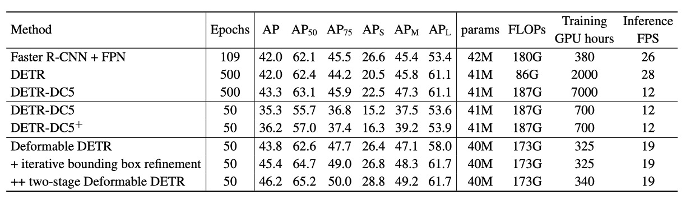

## 可變形的注意力機制

[**Deformable DETR: Deformable Transformers for End-to-End Object Detection**](https://arxiv.org/abs/2010.04159)

---

DETR 留給研究者們一個很好發揮的空間。

- [**[20.05] DETR： 跨領域的奠基者**](../2005-detr/index.md)

在 DETR 中，只有用最基本的 Transformer 架構，做最樸素的物件偵測。裡面也沒有用到什麼提點的技巧，只是單純的把圖片丟進去，然後就可以得到物件的位置和類別。

多麽美好的論文！

往後的研究者們只要基於這個思路改進模型，論文還不是刷刷刷一大把？

## 定義問題

和目前的物件偵測器相比，DETR 實在是太慢了。比時下最流行的 Faster-RCNN 比起來，推論速度慢了 2 倍，看起來好像也不是什麼大問題？

但訓練收斂速度慢了 20 倍！

原本只需要 1 天的訓練時間，現在變成需要 20 天，這是多麽可怕的事情？韶光易逝，年華易老。等待模型收斂，等到頭髮都白了。

這不行，肯定要改。

## 解決問題

作者認為問題出在 Transformer 的注意力機制上。在圖片上使用 Transformer，每個像素都要對所有的像素做注意力，這表示大部分的算力都浪費在無效的地方。

所以這裡不能再使用原本的 Transformer 注意力機制，而是借鑒了可變形卷積的思路，將原本的注意力機制改成一種「可變形的注意力機制」。

:::tip
這個時候 ViT 尚未發表，因此操作的時候都是基於每個像素點，而不是每個切分影像區塊。
:::

### 可變形注意力

在圖像特徵圖中，給定每個查詢元素（Query Element），作者會選擇一個參考點作為基準，並且在其周圍的一些重要採樣點進行注意力操作。這與傳統 Transformer 不同，傳統方法會對整個空間上的所有點計算注意力。

假設輸入的特徵圖為：

$$
x
\in \mathbb{R}^{C \times H \times W}
$$

其中 $C$ 表示通道數，$H$ 和 $W$ 分別是特徵圖的高度和寬度。

查詢元素 $q$ 包含一個內容特徵 $z_q$ 和一個 2D 參考點 $p_q$，可變形注意力特徵的計算公式如下：

$$
\text{DeformAttn}(z_q, p_q, x) = \sum_{m=1}^{M} W_m \sum_{k=1}^{K} A_{mqk} \cdot W_m^{\prime} x(p_q + \Delta p_{mqk})
$$

其中：

- $M$ 表示注意力頭（Attention Head）的數量。
- $K$ 表示每個查詢點所選擇的採樣點數量，這些點從參考點附近的一小區域中選取。
- $A_{mqk}$ 是第 $m$ 個注意力頭中第 $k$ 個採樣點的注意力權重，範圍在 $[0, 1]$ 之間，並且滿足歸一化條件：

  $$
  \sum_{k=1}^{K} A_{mqk} = 1
  $$

- $\Delta p_{mqk}$ 是第 $m$ 個注意力頭中第 $k$ 個採樣點的偏移量，這些偏移量可以是任意的實數。
- $W_m$ 和 $W_m^{\prime}$ 是可學習的權重矩陣，負責將輸入特徵進行線性變換。
- $x(p_q + \Delta p_{mqk})$ 表示在位置 $p_q + \Delta p_{mqk}$ 處的特徵值，因為該位置是分數值（即非整數點），因此使用雙線性插值來計算。

查詢特徵 $z_q$ 經過一個線性投影操作，該操作會輸出一個 $3mk$ 通道的張量：

- 前 $2mk$ 個通道用來編碼每個採樣點的偏移量 $\Delta p_{mqk}$。
- 剩餘的 $mk$ 個通道會經過 softmax 操作，計算出對應的注意力權重 $A_{mqk}$。

這樣設計可以保證偏移量與注意力權重都是從查詢元素的特徵中學習得到的，而不是基於固定的規則。

### 多尺度計算

現代物件偵測框架通常會使用多尺度特徵圖來進行物件偵測。可變形注意力模組也可以自然地擴展為多尺度版本，允許同時在多個特徵圖層上進行採樣和操作。

假設輸入的多尺度特徵圖為 $\{x_l\}_{l=1}^L$，每個特徵圖 $x_l \in \mathbb{R}^{C \times H_l \times W_l}$。查詢元素的參考點用正規化坐標 $\hat{p}_q \in [0, 1]^2$ 表示，則多尺度可變形注意力模組的計算公式為：

$$
\text{MSDeformAttn}(z_q, \hat{p}_q, \{x_l\}_{l=1}^L) =
$$

$$
\sum_{m=1}^{M} W_m \sum_{l=1}^{L} \sum_{k=1}^{K} A_{mlqk} \cdot W_m^{\prime} x_l(\phi_l(\hat{p}_q) + \Delta p_{mlqk})
$$

- $L$ 表示輸入的特徵圖層數量。
- $\phi_l(\hat{p}_q)$ 是一個縮放函數，用來將正規化坐標轉換到第 $l$ 層特徵圖上的實際坐標。
- 其他符號的意義與單尺度的情況類似。

### 模型架構

如上圖，當我們解決了可變形注意力的問題之後，把原本 DETR 架構中的 Transformer 模組全部抽換掉。

這樣就得到了 Deformable DETR。

:::info
如果理論知識你不感興趣，也可以直接到官方的 Github 上取得他們的實作。

- [**fundamentalvision/Deformable-DETR**](https://github.com/fundamentalvision/Deformable-DETR)

:::

### 訓練策略

作者在 **COCO 2017** 資料集上進行實驗。

首先 Backbone 使用 **ResNet-50**，並且在 **ImageNet** 上進行預訓練。Neck 的部分直接從多尺度特徵圖中提取特徵，並且沒有使用 FPN。

可變形注意力設定：

- 注意力頭的數量：**M = 8**
- 每個查詢所選擇的採樣點數量：**K = 4**

可變形變換器編碼器中的參數在不同的特徵層之間共享。

超參數和訓練策略主要遵循 DETR 的設置，除了以下幾點：

- 邊界框分類採用 Focal Loss，損失權重設為 2。
- 將物件查詢數量從 100 增加至 300。

模型預設訓練 50 個 epoch，第 40 個 epoch 時學習率會降低為原來的 0.1 倍。使用 Adam 優化器來進行訓練，基本學習率為 $2 \times 10^{-4}$，且 $\beta_1 = 0.9$，$\beta_2 = 0.999$，權重衰減為 $10^{-4}$。

預測物件查詢參考點與採樣偏移量的線性投影的學習率會額外乘以 0.1 的縮放因子。

## 討論

### 與 DETR 的比較

根據上表，與 Faster R-CNN + FPN 相比，DETR 需要更多的訓練 epoch 才能收斂，且在小物體檢測上的表現較差。與 DETR 相比，Deformable DETR 在只需和 Faster R-CNN 相近的訓練 epoch，能夠達到更好的性能，特別是在小物體檢測方面。

詳細的收斂曲線見下圖：

通過迭代的邊界框優化和兩階段機制，該方法進一步提升了檢測準確性。

Deformable DETR 的 FLOPs 與 Faster R-CNN + FPN 和 DETR-DC5 相當，但運行速度比 DETR-DC5 快 1.6 倍，僅比 Faster R-CNN + FPN 慢 25%。

DETR-DC5 速度較慢的原因主要在於 Transformer 注意力機制中大量的記憶體存取，而 Deformable Attention 可以緩解此問題，但代價是無序的記憶體存取，仍稍慢於傳統卷積。

### 消融實驗

上表展示了變形注意力模組中不同設計選項的消融研究。

使用多尺度輸入代替單尺度輸入能有效提升檢測準確性，平均準確度（AP）提高 1.7%，尤其是小物體檢測（APS）提高 2.9%。增加取樣點數 $K$ 可進一步提升 0.9% 的 AP。

使用多尺度變形注意力使得不同尺度層級間的信息可以交換，能額外帶來 1.5% 的 AP 提升。由於已經採用了跨層級特徵交換，加入 FPNs 並不會進一步提升性能。當未使用多尺度注意力且 $K=1$ 時，變形注意力模組退化為變形卷積，且其準確性明顯下降。

### SoTA 比較

在上表中，Deformable DETR 均使用了迭代邊界框優化與兩階段機制。

使用 ResNet-101 和 ResNeXt-101 時，該方法分別達到 48.7 AP 和 49.0 AP，且無需額外優化技術。使用帶有 DCN 的 ResNeXt-101 時，準確度提升至 50.1 AP。

在加入測試時增強（test-time augmentations）後，該方法達到 52.3 AP。

:::info
TTA (Test-Time Augmentations) 是一種在測試時對圖像進行多次增強，然後將多次預測的結果進行平均的技術。這樣可以提高模型的穩健性，並且提高模型的準確性。
:::

## 結論

Deformable DETR 相較於傳統的 DETR，大幅縮短了訓練所需的時間。在小物體檢測的表現上，比 DETR 展現更明顯的優勢。

雖然 Deformable DETR 引入了可變形注意力以提升運行速度，但由於無序記憶體存取的特性，仍略微慢於傳統的卷積神經網路架構（如 Faster R-CNN）。因此，對於某些即時性要求高的應用，速度仍是需要考量的問題。

Deformable DETR 的設計為探索更高效、更實用的端對端物體偵測器變體開闢了新的方向，並具有廣泛的研究與應用潛力。
