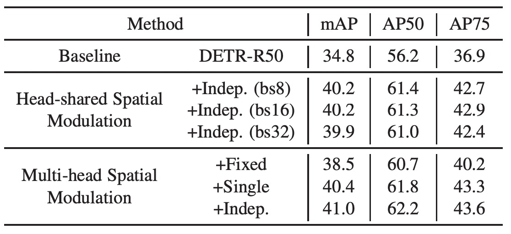
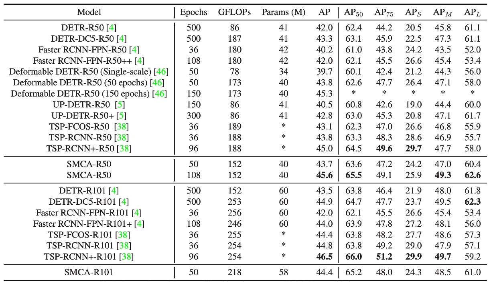

# [21.01] Fast DETR

## 摻點高斯吧！

[**Fast Convergence of DETR with Spatially Modulated Co-Attention**](https://arxiv.org/abs/2101.07448)

---

我們繼續 DETR 的討論。

DETR 做的事情，相信讀者都已經很熟悉了。

## 定義問題

作者看完 DETR 之後，發出了跟前面作品 Deformable DETR 一樣的嘆息：

- **DETR 的收斂速度太慢了。**

而問題的根源在於 DETR 的跨注意力機制並不考慮預測的邊界框，因此需要多次迭代才能為每個物件查詢生成適當的注意力圖。

基於這個思路，或許只要我們改進跨注意力機制，就能提高 DETR 的收斂速度。

:::tip
在 Deformable DETR 中，作者改掉了最底層的注意力運作方式。

而這篇論文則是在跨注意力機制上加入了一些先驗知識。
:::

## 解決問題

### 空間調製共注意力

空間調製共注意力機制，（Spatially Modulated Co-Attention, SMCA）的核心思想是：

**將可學習的跨注意力圖與手工設計的查詢空間先驗資訊相結合。**

SMCA 動態預測與每個物件查詢對應的框的初始中心和比例，以產生 2D 空間類高斯權重圖。權重圖按元素與物件查詢和圖像特徵的共同關注特徵圖相乘，以更有效地聚合來自視覺特徵圖的查詢相關資訊。

:::tip
簡單來說，原本的 DETR 沒有先驗知識，收斂很慢。

既然如此，我們給他一些先驗知識，讓他收斂得更快。
:::

### 初步預測

每個物件查詢首先動態預測其責任物件的中心和比例，物件查詢 $O_q$ 的預測中心和尺度可分別表示為：

$$
c^{\text{norm}}_h, c^{\text{norm}}_w = \text{sigmoid(MLP}(O_q)),
$$

$$
s_h, s_w = \text{FC}(O_q)
$$

其中，通過兩層 MLP 和 sigmoid 函數將物件查詢 $O_q$ 投影為在 $[0, 1] \times [0, 1]$ 範圍內的歸一化中心預測，再經過逆向操作以得到圖像中的真實中心座標。

物件查詢 $O_q$ 還會預測物件的寬高比例來生成 2D 高斯分布權重圖，並重新加權跨注意力圖，強調物件預測位置附近的特徵。

### 高斯權重圖

在預測物體中心 $c_w, c_h$ 及尺度 $s_w, s_h$ 之後，SMCA 生成 2D 高斯權重圖 $G$，其表達式為：

$$
G(i, j) = \exp \left( - \frac{(i - c_w)^2}{\beta s_w^2} - \frac{(j - c_h)^2}{\beta s_h^2} \right)
$$

其中 $(i, j) \in [0, W] \times [0, H]$ 是空間索引，$\beta$ 是一個超參數，用來調整高斯分布的寬度。

$G$ 會對靠近中心的空間位置賦予較高的權重，而對遠離中心的位置賦予較低的權重。

利用生成的空間先驗 $G$，SMCA 將跨注意力圖 $C_i$ 進行調制。對每個通過點積注意力生成的跨注意力圖 $C_i$，調整方式如下：

$$
C_i = \text{softmax} \left( \frac{K_i^T Q_i}{\sqrt{d}} + \log G \right) V_i
$$

其中，SMCA 將空間權重圖 $G$ 的對數與點積跨注意力加和，並對所有空間位置進行 softmax 正規化，從而增加預測邊界框附近的權重，限制跨注意力的空間模式搜索範圍，並加快模型的收斂速度。

:::tip
和原本的注意力機制相比，這裡就只是多了一個 $log G$ 的項。
:::

### 多頭 SMCA

在 SMCA 的多頭調制版本中，不同的跨注意力頭會根據各自的空間權重圖進行特定的特徵調制。

每個注意力頭從共享的中心位置 $[c_w, c_h]$ 開始，並預測一個頭特定的偏移量 $[\Delta c_{w,i}, \Delta c_{h,i}]$ 以及頭特定的尺度 $s_{w,i}, s_{h,i}$。

由此可以基於頭特定的中心 $[c_w + \Delta c_{w,i}, c_h + \Delta c_{h,i}]$ 和尺度生成高斯分布空間權重圖 $G_i$。

多頭跨注意力特徵圖可表示為：

$$
C_i = \text{softmax} \left( \frac{K_i^T Q_i}{\sqrt{d}} + \log G_i \right) V_i
$$

為了提升物體檢測效能，SMCA 整合了多尺度特徵。CNN 提取多尺度視覺特徵 $f_{16}, f_{32}, f_{64}$，對應的下採樣率為 16、32 和 64。為了降低計算成本，這些特徵直接從 CNN 骨幹網路中提取，**並未使用 Feature Pyramid Network (FPN)**。

為了自動選擇最適合的尺度，每個物體查詢會生成尺度選擇注意力權重：

$$
\alpha_{16}, \alpha_{32}, \alpha_{64} = \text{Softmax}(\text{FC}(O_q))
$$

不同尺度的跨注意力計算公式為：

$$
C_{i,j} = \text{Softmax} \left( \frac{K_{i,j}^T Q_i}{\sqrt{d}} + \log G_i \right) V_{i,j} \odot \alpha_j
$$

$$
C_i = \sum_j C_{i,j}, \quad j \in \{16, 32, 64\}
$$

這樣的機制允許每個物體查詢動態選擇最相關的尺度，抑制與其無關的尺度特徵。

在進行跨注意力計算後，更新的物體查詢特徵 $D \in \mathbb{R}^{N \times C}$ 被用於預測邊界框及分類分數：

$$
\text{Box} = \text{Sigmoid}(\text{MLP}(D))
$$

$$
\text{Score} = \text{FC}(D)
$$

邊界框預測還會結合初始的空間先驗，進一步調整預測的中心位置：

$$
\text{Box}[:2] = \text{Box}[:2] + [d c_{\text{norm}_h}, c_{\text{norm}_w}]
$$

這樣可以確保邊界框預測與 SMCA 中高亮的跨注意力區域密切相關。

### 訓練策略

1. **資料集：**

   - 實驗使用 COCO 2017 資料集進行驗證。訓練集包含 118,000 張圖像，驗證集包含 5,000 張圖像。性能評估使用 mAP（Mean Average Precision），與之前的研究一致。

2. **實驗實現細節：**

   - 實驗遵循原始 DETR 的設置。特徵提取使用 ResNet-50，標註為 SMCA-R50。
   - 與 DETR 不同的是，SMCA 使用 300 個物體查詢（而非 100 個），並將原始的交叉熵分類損失替換為 focal loss，這有助於解決前景/背景分類中的正負樣本不平衡問題。focal loss 的初始概率設置為 0.01 以穩定訓練過程。

3. **訓練設置：**

   - 模型訓練 50 個 epoch，第 40 個 epoch 時學習率減少至原來的 1/10。
   - Transformer 編碼器的初始學習率設為 $10^{-4}$，而預訓練的 ResNet 骨幹網路學習率設為 $10^{-5}$，並使用 AdamW 優化器進行優化。
   - 多尺度特徵編碼的預設下採樣率為 16、32、64。

4. **損失函數與匹配：**

   - 雙邊匹配過程中的分類損失、L1 距離損失和 GIoU 損失的係數分別設為 2、5、2。
   - 在經過雙邊匹配後，模型最小化分類損失、邊界框 L1 損失和 GIoU 損失來進行訓練，損失的係數與前述相同。

5. **其他實驗細節：**
   - Transformer 層使用 post-norm 設置，與之前的研究一致。
   - 資料增強過程中使用隨機裁剪，裁剪後的最大寬度或高度設定為 1333。
   - 所有模型均在 8 張 V100 GPU 上進行訓練，每張 GPU 負責 1 張圖像。

## 討論

### 和 DETR 的比較

<figure style={{ "width": "60%"}}>

</figure>

SMCA 與 DETR 共享相同的架構，唯獨在解碼器中引入了新的共注意力調制機制，並加入了一個額外的線性網路來生成空間調制先驗資訊。SMCA 的計算成本與每個 epoch 的訓練時間增量很小。

使用單尺度特徵時，SMCA 的自注意力維度設定為 256，前饋網路 (FFN) 的中間維度為 2048。使用多尺度特徵時，FFN 的中間維度設為 1024，並且在編碼器中使用 5 層的內部尺度與多尺度自注意力層，以保證與 DETR 相似的參數量，進行公平比較。

如上表所示，"SMCA w/o multi-scale" 在 50 個 epoch 訓練下，使用單尺度特徵時的 mAP 為 41.0，使用多尺度特徵時的 mAP 則達到 43.7。延長訓練時間後，單尺度特徵的 SMCA mAP 從 41.0 提升至 42.7，多尺度特徵的 SMCA 則從 43.7 提升至 45.6。

SMCA 的收斂速度比基於 DETR 的方法快 10 倍。SMCA 使用較薄的 Transformer 層以及 ResNet 骨幹網路中不帶擴張的卷積操作，在效率上與原始的擴張卷積 DETR 模型表現相當。

### 消融實驗

作者為了驗證 SMCA 各個組件的重要性，進行了一系列消融實驗。

### Head-shared SMCA

<figure style={{ "width": "60%"}}>

</figure>

作者在基線 DETR 上添加頭共享的空間調制機制，並保持學習率、訓練計劃、自注意力參數等與基線模型相同。

結果顯示，該方法使 mAP 從 34.8 提升至 40.2，證明了 SMCA 的有效性，其不僅加快了 DETR 的收斂速度，還大幅提升了性能。另外不同批次大小的測試結果表明，SMCA 對批次大小不敏感。

使用多頭機制進行空間調制，將 Transformer 的每個頭調制為不同的空間權重圖。所有頭從相同的物體中心開始，並預測相對於共同中心的偏移量和頭特定的尺度。結果顯示，多頭空間調制的 mAP 為 41.0，相比頭共享的調制有進一步提升（從 40.2 提升至 41.0）。

作者還測試了固定尺度、高度與寬度共享或獨立預測的空間權重圖。當固定高斯分布尺度時（固定為 1），mAP 為 38.5（比基線提升了 3.7），證明了預測物體中心在空間調制中的作用。

### Multi-head SMCA

<figure style={{ "width": "60%"}}>

</figure>

將多尺度特徵編碼引入編碼器中，使用 2 層內部尺度自注意力、1 層多尺度自注意力和再 2 層內部尺度自注意力（標記為“SMCA (2Intra-Multi-2Intra)”）。這一設計使性能從 41.0 提升至 43.7。若移除 SSA 後性能下降至 42.6。

將 2Intra-Multi-2Intra 設計替換為單純堆疊 5 層內部尺度自注意力層，性能下降至 43.3，這是因為缺乏跨尺度信息交換。雖然 5 層的內部尺度自注意力編碼器表現優於 3 層，但引入多尺度信息交換（3 層多尺度自注意力編碼器）的模型性能更佳。

作者最後選擇 2Intra-Multi-2Intra 組合設計，該設計在參數較少的情況下達到了 43.7 mAP，並且共享 Transformer 和 FFN 的權重進一步增強了模型的泛化能力。

### 對比其他 SoTA 架構

在上表中，作者將 SMCA 與其他物體檢測框架在 COCO 2017 驗證集上的性能進行比較。

1. **與 DETR 的比較：**

   - DETR 使用端到端的 Transformer 進行物體檢測，DETR-R50 和 DETR-DC5-R50 分別指的是基於 ResNet-50 和擴張 ResNet-50 的 DETR 版本。相較於 DETR，SMCA 在小、中、大物體的檢測性能上具有更快的收斂速度和更好的性能。

2. **與 Faster RCNN 的比較：**

   - Faster RCNN 與 FPN（特徵金字塔網路）結合，是一個兩階段的物體檢測方法。在 109 個 epoch 的訓練下，SMCA 的 mAP (45.6) 超過 Faster RCNN-FPN-R50 (42.0)。
   - Faster RCNN 在檢測小物體上具有優勢（小物體 mAP 為 26.6 vs SMCA 的 25.9），但 SMCA 在大物體的定位上更強（大物體 mAP 為 62.6 vs 53.4），這是因為 SMCA 的多尺度自注意力機制能夠在所有尺度和位置之間傳播信息。

3. **與 Deformable DETR 的比較：**

   - Deformable DETR 將原始的 DETR 自注意力替換為局部可變形注意力，在編碼器和解碼器中使用。這使其比原始 DETR 具有更快的收斂速度，但在大物體檢測的性能有所下降。
   - Deformable DETR 的大物體 mAP 從 DETR 的 61.1 降至 58.0。相比之下，SMCA 採用空間調制共注意力，通過約束共注意力在動態估計的物體位置附近進行搜索，從而加快收斂速度並提升大物體的檢測性能（SMCA 的大物體 mAP 為 60.4，Deformable DETR 為 59.0）。
   - SMCA 在 50 個 epoch 時的 mAP (43.7) 與 Deformable DETR (43.8) 相當，但 SMCA 更擅長檢測大物體，而 Deformable DETR 在小物體檢測上更有優勢。

4. **與 UP-DETR 的比較：**

   - UP-DETR 探索了無監督學習來加快 DETR 的收斂速度。相比之下，SMCA 的收斂速度和性能優於 UP-DETR，在 108 個 epoch 時，SMCA 的 mAP 為 45.6，而 UP-DETR 在 300 個 epoch 時的 mAP 為 42.8。

5. **與 TSP-FCOS 和 TSP-RCNN 的比較：**

   - TSP-FCOS 和 TSP-RCNN 結合了 DETR 的匈牙利匹配方法和 FCOS 以及 RCNN 檢測器，具有比 DETR 更快的收斂速度和更好的性能。
   - 與 Deformable DETR 和 Faster RCNN-FPN 類似，TSP-FCOS 和 TSP-RCNN 在檢測小物體方面具有優勢，但在大物體檢測上稍遜。
   - 在短期訓練（38 個 epoch）中，SMCA-R50 的 mAP (43.7) 與 TSP-RCNN (43.8) 相當，均優於 TSP-FCOS (43.1)。在長期訓練中，SMCA 在 108 個 epoch 時達到 45.6 的 mAP，超過了 TSP-RCNN 在 96 個 epoch 時的 45.0。

6. **更換 ResNet-101 Backbone 的比較：**
   - 將 ResNet-50 替換為 ResNet-101 骨幹網路後，性能提升的趨勢與使用 ResNet-50 的情況相似。

## 結論

在這篇論文中，作者成功將空間調制共注意力機制（SMCA）融入到 DETR 框架中，實現了顯著的性能提升。

原本需要 500 個 epoch 的訓練過程縮短至 108 個 epoch，同時 mAP 從 43.4 提升至 45.6，這表明 SMCA 能夠在保持較低推理成本的情況下提高檢測精度。通過探索全域特徵資訊，SMCA 展示了在物體檢測中提高效率和性能的潛力。

後續還有幾篇持續改進 DETR 的論文，讓我們繼續看下去。
