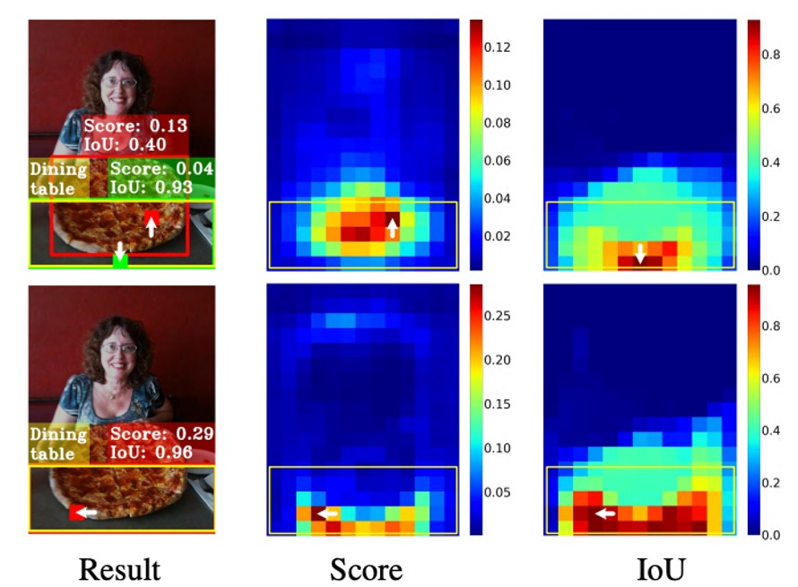
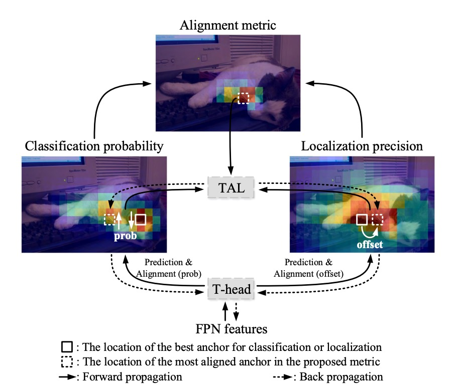
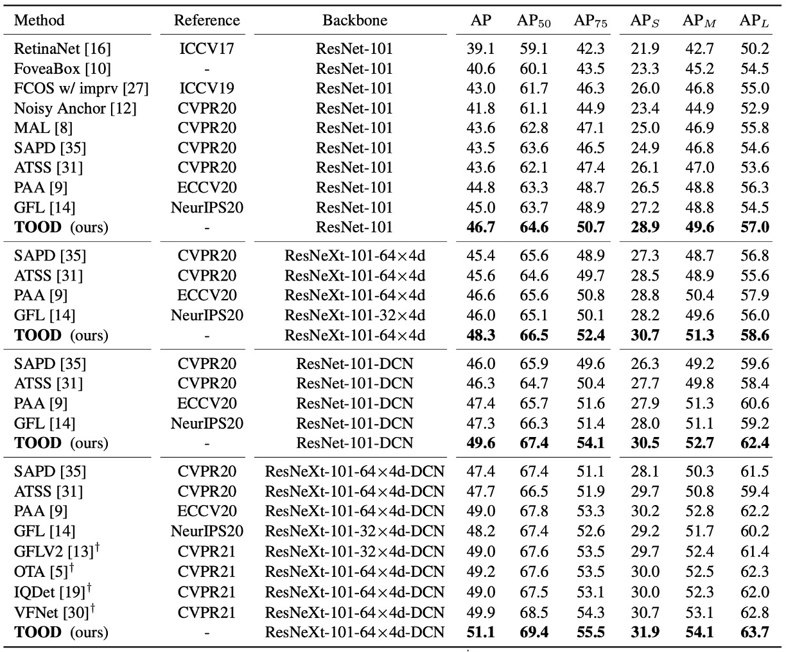

## 錯位的終結

[**TOOD: Task-aligned One-stage Object Detection**](https://arxiv.org/abs/2108.07755)

---

延續 ATSS 的思路，我們繼續探索後續的研究。

:::tip
如果你還沒看過 ATSS，可以參考我們之前的筆記：

- [**[19.12] ATSS: 錨點之死**](../1912-atss/index.md)
  :::

## 定義問題

物件偵測是什麼？相信大家也可以朗朗上口。

它分為兩個子任務：

- **分類 (Classification)**：找出物件最具辨識度的部分，回答「這是什麼」。
- **定位 (Localization)**：精準描繪整個邊界，回答「它在哪裡」。

問題在於，這兩個任務天生帶有矛盾：分類偏重局部顯著特徵，而定位需要整體輪廓。當模型同時優化兩者時，所學到的特徵分佈往往並不一致，導致預測時容易「各說各話」。

近年單階段偵測器（one-stage detectors）嘗試用「中心假設」來統一兩者。

- **FCOS、ATSS**：透過 centerness 分支，讓中心附近的 anchor 分數更高，定位損失權重更大。
- **FoveaBox**：乾脆將中心區域定義為正樣本。

這些設計確實提升了效果，但依然留下兩個核心隱憂：

1. **任務獨立**：

   現有方法大多維持「雙分支架構」：一個分支管分類，另一個分支管定位。

   結果是兩個任務之間缺乏交流，可能出現這樣的情況：

   - 分類分支說「這是一張餐桌」!
   - 定位分支卻更準確地框出了一個披薩。

   兩者各自正確，但組合起來卻錯了。

2. **樣本分配失靈**：

   傳統 anchor-based 用 IoU 門檻決定正負樣本；anchor-free 則依據幾何規則（如中心區域）。

   這些策略都隱含一個假設：

   > **分類與定位能共用同一組樣本。**

   但事實上，最適合分類的點與最適合定位的點往往不重疊。

   以下圖為例：

    

    <figure style={{ "width": "70%"}}>
    
    </figure>
    

   看起來最佳的定位框（綠色 patch），但是並不在物件中心，最後反而被一個分類分數較高但框得不準的 anchor（紅色 patch）壓下，在 NMS 過程中遭到淘汰。

換句話說：**分類與定位這兩個任務，不僅學習方向不同，就連「應該依賴哪些樣本」也不同。**

這讓我們不得不問：

- 既然兩者天生不一致，是否還能讓它們真正協調？
- 在同一個 anchor 上，能否同時得到「最準的分數」與「最準的框」？

還是說，我們一直以來的設計，其實從根本上就錯了？

## 解決問題

<figure style={{ "width": "70%"}}>

</figure>

TOOD 的架構我們跟著作者提供的示意圖走一次。

在傳統做法中，FPN 輸出後直接分成兩條支流，各自預測分類與定位。結果就是，我們常常得到一個分數很高卻框不準的預測，或是一個框很準但分數不夠高、在 NMS 裡被淹沒的預測。

這裡作者的想法很直接：**在預測端顯式地把這兩個分支進行「對齊」**。

### 任務互動特徵

<figure style={{ "width": "90%"}}>

</figure>

設 FPN 特徵為 $X^{fpn}\in\mathbb{R}^{H\times W\times C}$。

TOOD 不再一開始就切分支，而是先用一條「**共享幹道**」把特徵表示進行轉換。

我們連續疊上 $N$ 個卷積層（每層後接 ReLU），得到一疊多尺度的**任務互動特徵** $\{X^{inter}_k\}_{k=1}^N$：

$$
X^{inter}_k=
\begin{cases}
\delta\!\big(\mathrm{conv}_k(X^{fpn})\big), & k=1\\\\
\delta\!\big(\mathrm{conv}_k(X^{inter}_{k-1})\big), & k>1
\end{cases}
$$

這一步的目的只有一個：**讓分類與定位先看到同一個區域的特徵、同一組上下文、同一組有效感受野**，而不是各自為政。

### TAP 的層級注意力

但是共享會帶來摩擦：分類與定位偏好的層次其實不同。

於是我們在共享之後，用 **Task-Aligned Predictor（TAP）** 做一個「分工」。

做法是從 $\{X^{inter}_k\}$ 裡學一個**層級注意力** $w\in\mathbb{R}^N$，去決定「對某個任務而言，哪幾層更該被強調」。

先把 $\{X^{inter}_k\}$ 串接後做全域平均池化得到 $x^{inter}$，再經兩層全連接與 Sigmoid：

$$
w=\sigma\!\Big(\mathrm{fc}_2\big(\delta(\mathrm{fc}_1(x^{inter}))\big)\Big)\, .
$$

對於「分類」或「定位」其中一個任務，對第 $k$ 層特徵做元素級縮放：

$$
X^{task}_k = w_k \cdot X^{inter}_k \quad (k=1,\dots,N)\, ,
$$

把所有 $X^{task}_k$ 串接成 $X^{task}$，再經 $1\!\times\!1$ 降維與卷積得到該任務的預測張量：

$$
Z^{task}=\mathrm{conv}_2\!\big(\delta(\mathrm{conv}_1(X^{task}))\big)\, .
$$

由此，我們取得**分類機率圖** $P\in\mathbb{R}^{H\times W\times C_{\text{cls}}}$（Sigmoid 後）與**邊界回歸** $B\in\mathbb{R}^{H\times W\times 4}$。

這裡的 $B$ 採 FCOS/ATSS 的「到邊界距離」表示 $(l,t,r,b)$。

若特徵點（經步長換算）對應到影像座標 $(x,y)$，則重建方框為：$(x-l,\;y-t,\;x+r,\;y+b)$。

到這裡，分類與定位還在同一條特徵上彼此分享資訊，但也各自拿到了自己偏好的層次。

### 顯式對齊：$M$ 與 $O$

只共享還不夠，作者要在輸出端把兩個任務**真正扣在一起**。

**首先，對齊分類。**

從共享的 $X^{inter}$ 再學一張空間機率圖 $M\in\mathbb{R}^{H\times W\times 1}$：

$$
M=\sigma\!\big(\mathrm{conv}_2(\delta(\mathrm{conv}_1(X^{inter})))\big)\, .
$$

把它和分類機率 $P$ 做**幾何平均**，得到對齊後的分類輸出：

$$
P^{align}=\sqrt{P\times M}\, .
$$

直覺是：$M$ 代表「這個位置同時有利於兩個任務」的置信度。

用幾何平均而不是加權相加，能避免一方（例如極端高的 $P$ 或 $M$）單獨主導。

---

**其二，對齊定位。**

定位更直接：我們讓每條邊都去「借」附近**最準的預測點**。

從 $X^{inter}$ 學一組位移圖 $O\in\mathbb{R}^{H\times W\times 8}$，對四條邊各給一對 $(\Delta i,\Delta j)$ 位移，然後在 $B$ 上做雙線性取樣：

$$
B^{align}(i,j,c)=B\!\big(i+O(i,j,2c),\;j+O(i,j,2c+1),\;c\big),\quad c\in\{0,1,2,3\}\, .
$$

意思是：上、下、左、右四個邊，**各自**可以從「離自己最近、也最準」的 anchor 取值；四條邊不必勉強用同一個點。這一步同時做到兩件事：**提升回歸本身的精度**，也**縮短分類與定位的空間距離**。

最後，還差最後一個部分：怎麼讓模型**習慣**這種對齊？

TOOD 設計了一把簡單的「刻度尺」 $t$，量測同一個 anchor 的**分類分數** $s$ 與**定位品質（IoU）** $u$ 是否同時優秀：

$$
t = s^{\alpha} \, u^{\beta}\, .
$$

$\alpha,\beta$ 控制兩任務的相對重要性。

這把刻度尺有個關鍵特性：**只要其中一邊不好，$t$ 就上不去**。

作者把它放進兩個地方：**樣本指派**與**損失加權**。

### 任務對齊的樣本指派

對每個真值物件，計算所有候選 anchor 的 $t$，取 **前 $m$ 大**作為**正樣本**，其餘為負樣本。

這一步把「兩任務一致」直接寫進了**誰能當正樣本**的規則裡。

從此以後，模型主要從那些「分高且框準」的例子學，學習方向自然被拉向對齊。

### 損失設計

直接把 $t$ 當軟標籤會有數值穩定問題（$\alpha,\beta$ 大時 $t$ 會很小）。

因此，作者在論文中採**實例級正規化**：把同一個物件內的 $t$ 縮放到一個合理的範圍，且保留不同物件之間「定位誰更準」的相對關係。

做法是令同一實例內的最大 $\hat t$ 等於該實例的最大 IoU：

$$
\hat t_i \;=\; t_i \cdot \frac{u_{\max}}{t_{\max}+\varepsilon}\, ,\qquad
u_{\max}=\max_k u_k,\ \ t_{\max}=\max_k t_k\, .
$$

這樣「困難物件」（整體 $t$ 都偏小）不會被系統性忽略，同時又不會讓大 $\alpha,\beta$ 把學習推入飢餓狀態。

- **分類損失**

  把正樣本的 BCE 標籤由 1 換成 $\hat t_i$，並加入類似 Focal 的難例調節（$\gamma$ 為指數）：

  $$
  L_{cls}
  =\sum_{i=1}^{N_{pos}} \big|\hat t_i - s_i\big|^{\gamma}\,\mathrm{BCE}(s_i,\hat t_i)
  \;+\;
  \sum_{j=1}^{N_{neg}} s_j^{\gamma}\,\mathrm{BCE}(s_j,0)\, .
  $$

  **當正樣本裡越不對齊（$|\hat t_i-s_i|$ 大）者權重越高**；負樣本裡分數低者被抑制，把焦點放在難負例。

- **定位損失**

  對正樣本，用 $\hat t_i$ 當權重聚焦在高品質的框上，以下以 GIoU 為例：

  $$
  L_{reg}=\sum_{i=1}^{N_{pos}} \hat t_i \, \mathrm{L}_{GIoU}\!\big(b_i,\bar b_i\big)\, .
  $$

  總損失為兩者相加（可依實作加入係數）：

  $$
  L = L_{cls} + L_{reg}\,
  $$

這套指派、加權機制，就是 **Task Alignment Learning（TAL）**。

## 討論

以下所有結果都在 **MS COCO 2017** 上做：

在 **trainval135k（115K）** 訓練、**minival（5K）** 做消融，最後在 **test-dev** 報主結果；度量是 **COCO AP**。

模型架構一律是 **Backbone → FPN → Head**，用 **單一 anchor/位置**（和 ATSS 一樣），預訓練主幹包含 **ResNet-50/101、ResNeXt-101-64×4d**。T-head 的互動層數設為 **$N=6$**，分類的焦點參數 **$\gamma=2$**。

### T-head 值不值得換？

<figure style={{ "width": "90%"}}>

</figure>

作者先把 **傳統平行雙頭** 換成 **T-head**，其他條件不變，在多個一階段底座上做 A/B test。

結果很明顯：**T-head 在更少參數與 FLOPs 下，帶來約 +0.7 到 +1.9 AP 的穩定提升**。

這一張表要讀到兩層意思：

- 單用 **互動共享 → 層級分工 → 輸出端對齊** 的頭部設計，本身就夠很不錯。
- 提升是**一致**而非偶發，顯示這個「先互動、再對齊」的方法具有可遷移性。

### TAL 效果測試

<figure style={{ "width": "60%"}}>

</figure>

接著是樣本指派的部分，作者測試**固定式**（幾何/IoU 規則）與 **自適應式**（學習式）方法。

**TAL** 的做法是用：$t=s^{\alpha}u^{\beta}$。

這把刻度同時決定 **正負指派（Top-$m$**）與 **正樣本權重 $\hat t$**。

實驗結果顯示：**TAL 系列在同級條件下拿到更高 AP**；而且當你在 TAL 內加入我們的 **TAP**（相當於多了「會分工的頭」），表現再往上疊到 **42.5 AP**（上表的 “+TAP” 行）。

### 完整體 TOOD

<figure style={{ "width": "60%"}}>

</figure>

當 **T-head + TAL** 一起上場，作者同時驗證 **anchor-free** 與 **anchor-based** 兩個版本：**42.5 AP vs. 42.4 AP**，幾乎一樣好。

和 **ATSS** 相比，**整體約 +3.2 AP**；而在更嚴格的 **AP$_{75}$** 指標上，提升約 **+3.8**，這個訊號直接對應到方法論裡強調的：

- **當分數對齊定位，框的品質會更好**。

此外，TOOD 的總提升（+3.3 AP）大於「T-head + ATSS」（+1.9）與「Parallel head + TAL」（+1.1）兩者的相加。換句話說，**頭的互動/對齊** 和 **TAL 的學習規則** 是**互補**的：只有兩者一起，對齊才會徹底。

### 和 SOTA 比較

<figure style={{ "width": "90%"}}>

</figure>

在 **test-dev**、**單模型單尺度測試**、**2× schedule（24 epochs）、scale jitter 480–800** 的共同規格下：

- **ResNet-101**：**46.7 AP**；**ResNeXt-101-64×4d**：**48.3 AP**。
- 相比 **ATSS**，大約 **+3 AP**；相比 **GFL**，約 **+2 AP**。

更有意思的是論文把 **DCN 放在 head 塔的前兩層**，TOOD 的提升是 **$48.3 \rightarrow 51.1$（+2.8 AP）**，而 **ATSS** 是 **$45.6 \rightarrow 47.7$（+2.1 AP）**。

這表示 TOOD 的對齊設計，讓 DCN 的自由形變能被更有效利用。

### 「對齊」真的發生了嗎？

<figure style={{ "width": "90%"}}>

</figure>

作者做了兩個量化觀察：

1. **不做 NMS** 的情況下，針對每個實例取 **前 50 個分類最有信心的預測**，分別對「分類排名」與「定位排名」計算 **PCC（皮爾森相關係數）**，同時計算 **前 10 名的 IoU 均值**。

   實驗結果顯示：**加了 T-head 與 TAL 之後，PCC 與 IoU 都上升**，代表「**分高**」與「**框準**」變得更**同步**。

2. **做了 NMS** 後統計 **正確框（IoU≥0.5）/ 冗餘框（IoU≥0.5）/ 錯誤框（0.1\<IoU\<0.5）** 的數量：**正確框增加、冗餘/錯誤顯著下降**。

最後把這些「對齊度」的指標和 AP 放在一起看，總增益 **約 +3.3 AP**。

### 錯位如何被改善？

<figure style={{ "width": "90%"}}>

</figure>

最後，作者給了一組可視化例子：傳統方法裡，中心附近常有高分卻不準的框，真正準的框被壓掉；**TOOD** 之後，**高分與準確框重合**，多餘的框消失。這其實就是在方法論裡的兩張地圖在發揮作用：**$M$** 把不一致的位置降溫，**$O$** 讓每條邊往最準的鄰居挪半步，最後 NMS 的決策自然乾淨。

## 結論

TOOD 把長久存在的分類與定位的錯位問題，以一條乾淨俐落的路徑加以解決：

先在 T-head 中讓兩個任務共享視野，再透過層級注意力完成分工。最後以 $M$（分類對齊）與 $O$（定位對齊）將輸出緊密扣合，並藉由 $t=s^{\alpha}u^{\beta}$ 將「樣本指派」與「損失設計」統合起來，迫使模型養成「分數高＝框要準」的習慣。

這樣的設計不僅在 COCO 上達到 51.1 AP（DCN 設定），更在 AP$_{75}$ 等嚴苛指標上展現顯著提升，印證了本文的主張：

- **對齊，會換來更準的框。**

然而，它也帶來一些代價：分支與雙線性取樣讓實作稍顯複雜，超參數雖具語意卻仍需依資料分佈調整，而在小物件密集或高噪環境下，Top-$m$ 的指派也可能陷入局部最優。此外，當任務擴展至 segmentation 或 pose 時，如何在「共享與分工」間保持平衡，仍是需要進一步思考的挑戰。

在影響層面上，TOOD 與同時期的 OTA/SimOTA 一起，把「分數 × 定位品質」奠定為正樣本指派的主流語法，並推動品質感知分類在一階段檢測器中成為標配。它提出的「先共享、後分工」設計也被不少框架吸收，與 DCN、可學位移結合的設計，在 TOOD 之後找到了更精準的應用場景。

現在（2025 年），它依然在產線與開源框架裡作為基礎設施存在，Task-Aligned 的指派與加權已經是許多模型不可或缺的選項，而其設計哲學更滲透進各式 YOLO 與一階段器的演進中。即便在 DETR 類的集合匹配逐漸成熟的今天，TOOD 的對齊思路依舊是高效且穩健的工程解法。
