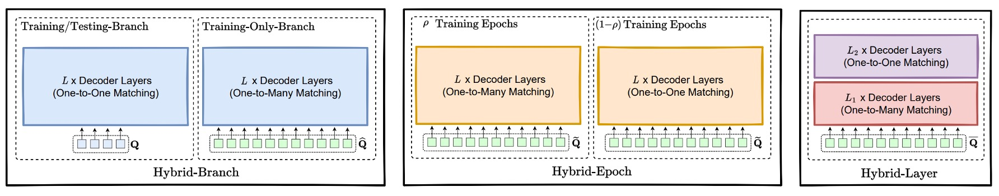
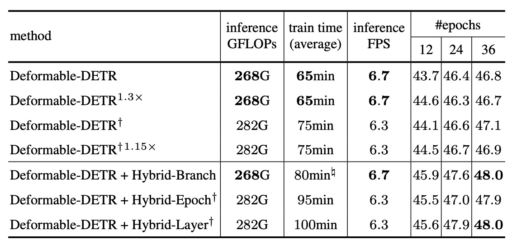

## 靜默查詢的反叛

[**DETRs with Hybrid Matching**](https://arxiv.org/abs/2207.13080)

---

在 DETR 的世界裡，大多數查詢被分派去分類，被命令沉默。

哪怕它們也靠近了真相......很抱歉，真相只有一個，其他的不算。

## 定義問題

自從 DETR 開啟將 Transformer 引入目標偵測的先河後，DETR 架構便迅速成為視覺領域中一個具指標性的標準結構，如下圖所示：

<figure style={{ "width": "80%"}}>

</figure>

其中，最核心的貢獻，在於摒棄 anchor、proposal、NMS 等手工設計的組件，將目標偵測問題重新表述為一個「查詢對應目標」的匹配任務。

這種設計方式不僅簡化流程，也提升了整體架構的可遷移性與泛化性，進而延伸出一整套對應的生態系，在 2D 偵測、3D 感知、姿態估計、視覺追蹤、分割任務等各種任務中獲得廣泛應用。

這條路線的發展，也促使研究者持續優化其各項模組：有的重新設計 Transformer 結構，如 Deformable-DETR 引入可變形注意力解決小物件偵測與收斂速度問題；有的探索更高效的 query 表示，如 DAB-DETR 與 DINO 系列以 denoising query 改善匹配穩定性。

但無論是哪一類架構，其學習機制多數仍建立在 DETR 所奠定的「一對一匹配」基礎上：每一個 ground truth 只能被分配給唯一的查詢，這也是其去除 NMS 的關鍵條件之一。

然而，這種一對一分配策略在訓練過程中也帶來不容忽視的瓶頸。

以常見的 COCO 資料集為例，單張圖像平均僅有不到 30 個標註框，但模型往往會產生 100 到 300 個查詢。在這樣的分配制度下，絕大多數查詢最終只能被當作「背景」，接受分類損失的監督，而無法參與到 bounding box 的回歸學習。

這意味著模型訓練期間的大部分查詢，其學習信號是極其有限的。儘管在推論時，這些查詢可能仍有機會輸出預測，但它們在訓練階段的學習空間早已被約束。

更進一步來看，這種分配限制也壓抑了模型探索潛在正樣本的能力。

即便某些查詢與某個物件具有良好的位置對齊，也因為已被其他查詢「佔用」，而被排除於回歸學習之外。這不僅降低了訓練樣本的使用效率，也限制了查詢對空間特徵的學習能力，導致訓練速度慢、正樣本擬合差、資源利用率低等一系列問題。

儘管現有的改進方法如 DN-DETR 或 DINO-DETR，試圖透過「加入噪聲查詢」的方式補強正樣本監督，但其核心目的在於匹配穩定性，而非訓練效率，且多數需額外設計 noising scheme 或調整查詢格式，擴展到其他任務時亦不夠通用。

所以，問題來了：

> **我們能不能在保有 DETR 匹配優點的同時，釋放閒置查詢的潛能、擴大正樣本監督範圍？**

---

## 解決問題

在 DETR 的原始設計中，每張圖片會產生一組「查詢（query）」向量，這些查詢經過解碼器處理後，分別輸出一組預測框與對應的分類機率。最後，這些預測會與 ground truth 做一對一的匹配，選出「最適合描述某個物件的查詢」，再根據這些匹配來計算損失。

H-DETR 所提出的改動，並不是打破這個一對一機制，而是額外補上一條「旁支」，讓更多查詢也能參與學習過程。

具體做法是讓模型同時訓練兩組查詢：一組維持原本的一對一監督邏輯；另一組則採用「一對多」的監督方式，也就是每個 ground truth 可以對應多個查詢。這樣，原本那些「被浪費」的查詢，也能在訓練時靠近標註框、學習如何擬合正樣本。

### 主要分支：一對一監督

首先，對第一組查詢 $Q = {q_1, q_2, ..., q_n}$，我們使用標準的 DETR 訓練流程：

1. 查詢經過 $L$ 層解碼器後，分別得到 $L$ 組預測 ${P^1, P^2, ..., P^L}$。
2. 每一層的預測都與 ground truth 進行 Hungarian Matching，選出最佳對應關係。
3. 損失函數如下：

$$
\mathcal{L}_{\text{one2one}} = \sum_{l=1}^{L} \mathcal{L}_{\text{Hungarian}}(P^l, G)
$$

其中 $\mathcal{L}_{\text{Hungarian}}$ 為標準的 DETR 損失，包括三部分：

- 分類損失（Classification Loss）
- 邊界框的 $L_1$ 回歸損失（Localization $L_1$ Loss）
- GIoU 損失（Generalized IoU Loss）

這一條分支，就是維持原本 DETR 精簡推論流程的核心。

---

### 輔助分支：一對多監督

另一條分支則是創造更多「可以靠近真實目標的機會」，透過以下操作：

1. 再產生一組查詢 $Q_b = {q_b^1, q_b^2, ..., q_b^T}$，用於進行一對多學習。
2. 我們將 ground truth $G = {g_1, ..., g_m}$ 重複 $K$ 次，得到增強後的目標集：

$$
G_b = \{G, G, ..., G\} \quad (K \text{ times})
$$

3. 對於每一層預測 ${P_b^1, ..., P_b^L}$，都與 $G_b$ 執行匹配，得到損失：

$$
\mathcal{L}_{\text{one2many}} = \sum_{l=1}^{L} \mathcal{L}_{\text{Hungarian}}(P_b^l, G_b)
$$

這條分支不會干涉主幹查詢的推論，純粹用來提升訓練效率與學習強度。

---

### 總損失與實作細節

整體訓練損失為：

$$
\mathcal{L} = \mathcal{L}_{\text{one2one}} + \lambda \cdot \mathcal{L}_{\text{one2many}}
$$

其中 $\lambda$ 為權重係數，用來平衡兩條分支的重要性。

為了讓兩組查詢在計算圖中能夠並行處理，H-DETR 採用 masked multi-head attention，避免查詢之間互相干擾。這讓輔助分支幾乎不產生額外訓練成本。

最後，在推論階段，H-DETR 會完全忽略一對多分支，只保留主幹分支的預測輸出。這表示 H-DETR 維持了 DETR 架構原有的簡潔性：無需使用 NMS，僅用查詢輸出即完成偵測。

### 更多形式的混合監督

除了「雙分支」的訓練架構外，H-DETR 還提出兩個進一步的變體，分別在訓練的「時間維度」與「層級維度」上實現監督策略的動態切換。

- **Hybrid Epoch Scheme：隱性的階段切換**

  這個版本不像分支方案需要兩組查詢，而是只使用一組查詢 $Q_e = {q_1, ..., q_M}$，但根據訓練的「階段」決定匹配方式的不同。

  - **前期（ρ 百分比的訓練 epoch）**：使用「一對多」匹配，也就是讓每個 ground truth 重複 $K$ 次，形成增強後的標註集合 $G_e$，並與查詢預測 ${P_e^1, ..., P_e^L}$ 進行配對。對應損失為：

  $$
  \mathcal{L}_{\text{one2many}} = \sum_{l=1}^{L} \mathcal{L}_{\text{Hungarian}}(P_e^l, G_e)
  $$

  - **後期（剩下的 (1−ρ) 百分比 epoch）**：切回「一對一」監督，改以原始標註 $G$ 進行匹配，損失為：

  $$
  \mathcal{L}_{\text{one2one}} = \sum_{l=1}^{L} \mathcal{L}_{\text{Hungarian}}(P_e^l, G)
  $$

  這種設計背後的想法，是在訓練初期透過大量監督信號幫助查詢快速貼近標註框，等模型學會基礎定位能力後，再收斂到原本一對一機制所要求的「查詢獨佔性」。

  在推論階段，這個方法仍僅保留一對一的查詢輸出，因此延續 DETR 架構的簡潔性。

---

- **Hybrid Layer Scheme：層級內部的監督切分**

  這個版本同樣使用單一查詢集合 $Q = {q_1, ..., q_N}$，但不是根據 epoch，而是根據 decoder 的「層數」來切換監督機制。

  - **前 $L_1$ 層 decoder**：採用「一對多」監督，將每層的預測 ${P^1, ..., P^{L_1}}$ 對應到重複過的標註集合 $G$：

  $$
  \mathcal{L}_{\text{one2many}} = \sum_{l=1}^{L_1} \mathcal{L}_{\text{Hungarian}}(P^l, G)
  $$

  - **後 $L_2$ 層 decoder**：切回「一對一」監督，損失如下：

  $$
  \mathcal{L}_{\text{one2one}} = \sum_{l=L_1+1}^{L_1+L_2} \mathcal{L}_{\text{Hungarian}}(P^l, G)
  $$

  這種設計的直覺很清楚：前半段層級先「暖身」，幫助查詢透過密集監督與目標接近；後半段則回歸一對一，強化獨立預測能力與推論一致性。

  整體訓練損失為兩者相加：

  $$
  \mathcal{L} = \mathcal{L}_{\text{one2many}} + \mathcal{L}_{\text{one2one}}
  $$

  這也讓模型能在「層級深度」上取得監督密度與推論一致性的折衷。

---

這兩種策略相比原始的雙分支架構，實作上更加簡單、不需額外查詢參數，但仍能提供額外正樣本監督。H-DETR 的設計核心正是在於：在不破壞 DETR 推論簡潔性的前提下，提供模型更多訓練資訊，以提高收斂速度和模型穩定性。

## 討論

作者首先聚焦於檢驗 H-DETR 是否能有效提升既有 DETR 架構的偵測能力。

以 COCO 和 LVIS 兩大資料集為基礎，評估改良後的 H-Deformable-DETR 模型在不同 backbone 與訓練長度下的表現。

### COCO Benchmark

<figure style={{ "width": "70%"}}>

</figure>

根據實驗結果，H-Deformable-DETR 在 COCO 驗證集上，針對不同規模的 backbone（包括 ResNet-50、Swin-T、Swin-L）與訓練週期數（12 或 36 epoch），均展現出一致性的性能提升。

以 Swin-T 為例：

- 在 12 個訓練 epoch 下，則從 49.3% 提升至 50.6%。
- 在 36 個訓練 epoch 下，AP 從 51.8% 提升至 53.2%。

這樣的結果顯示：即使不改動推論架構、僅調整訓練期間的監督策略，也能為 Deformable-DETR 帶來可觀增益，且不依賴特定 backbone 規模或訓練長度，泛化性良好。

### LVIS Benchmark

<figure style={{ "width": "70%"}}>

</figure>

接著來看 LVIS 的實驗結果，這是一個包含數千類別、極度長尾分布的資料集，用以驗證 H-DETR 在大規模與低頻類別上的泛化能力。

儘管 LVIS 的任務難度遠高於 COCO，H-DETR 在這裡仍維持了平均 **+0.8 \~ +1.0%** 的提升幅度，顯示其一對多監督策略對於提升「少數樣本」的學習效果仍具實質助益。

### SOTA Benchmark

作者亦將 H-Deformable-DETR 與近期代表性 SOTA 方法進行系統級比較，結果如上表。

所有模型皆採用單尺度（single-scale）推論，並選擇參數規模相近的 Swin-L 作為 backbone，以確保公平性。

在整體比較中，H-Deformable-DETR 在 COCO 驗證集上達到 59.4% AP，超越了包含 DINO-DETR 在內的多個強大基線方法。

這項結果顯示：H-DETR 提出的混合匹配策略，即便在加入其他增強技巧後，仍可與當前最強架構抗衡，甚至取得領先。在保持 DETR 架構簡潔、無需後處理的前提下，取得此等表現，強調了訓練監督機制本身對於學習效率與最終性能的重要性。

### 消融實驗

<figure style={{ "width": "70%"}}>

</figure>

我們看一下不同混合架構的表現，其他實驗請讀者自行翻閱原始論文。

這組實驗設計時，作者特別做了以下兩項設定來確保公平性：

1. 三種策略皆導入與 baseline 相比 **6 倍的正樣本數**。
2. 三種策略皆使用 **總計 1800 個查詢**。

此外，表格中亦標註了不同額外註記的數據來源：

- **† 記號**：該方法在 **訓練與推論階段皆使用 1800 個查詢**。
- **# 記號**：該時間是在使用 **優化後實作（如 GPU 上匹配）** 的情況下測得，細節見 supplementary。

以下是幾個關鍵觀察：

- **Hybrid Branch** 在整體表現上最為均衡：

  - 擁有**最佳的準確率提升**。
  - 訓練時間相對可控（約僅比 baseline 多 7%）。
  - 在推論 FPS、FLOPs、記憶體成本上亦表現穩健。

- **Hybrid Epoch** 因為要在不同階段切換訓練策略，導致訓練過程較長，儘管準確率仍有顯著提升，但**訓練時間偏高**，對於應用端而言成本較大。

- **Hybrid Layer** 在效能與準確率間取得某種平衡，但整體來說略低於 Hybrid Branch。

## 結論

DETR 的關鍵創新在於將物件偵測轉化為查詢匹配問題，雖簡化了推論流程，卻也導致訓練效率低落。

H-DETR 精準地針對這個問題提出修補：透過訓練端引入多對一監督，提升學習效率，同時保留一對一推論的語意一致性與架構簡潔性。這種設計具備三大工程優勢：推論零改動、成本可控、模組化易整合，對任何使用查詢機制的任務都有高度遷移潛力。

---

:::info
相關資訊可以參考 H-DETR 的 Github 主頁，有興趣的讀者可以試試看：

- [**DETRs with Hybrid Matching, CVPR 2023**](https://github.com/HDETR)
  :::
