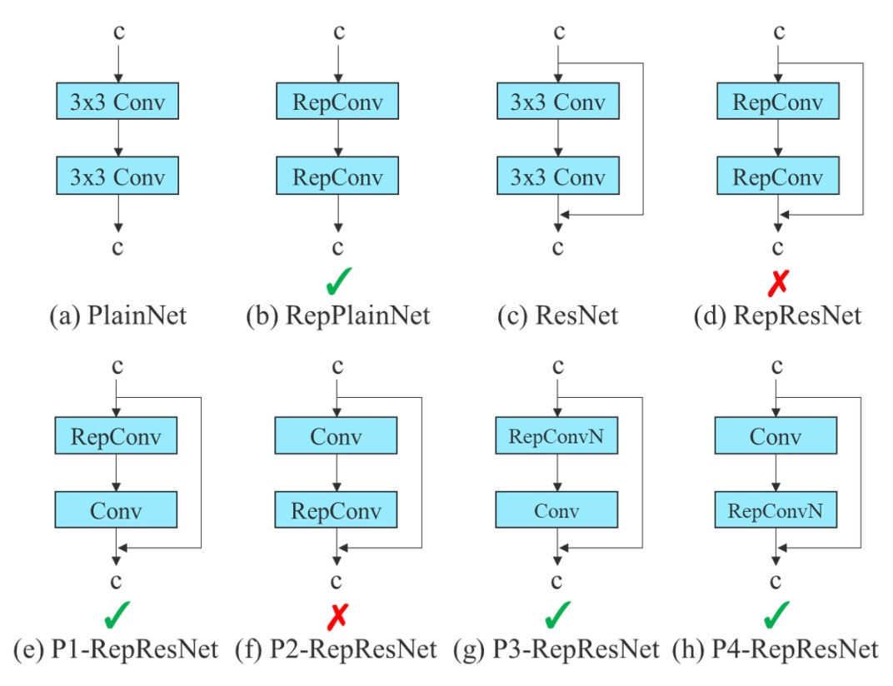
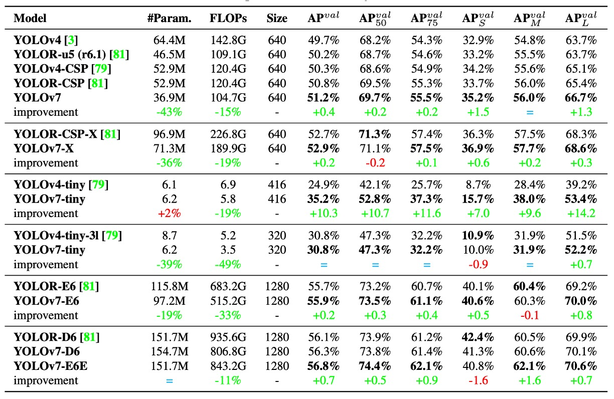
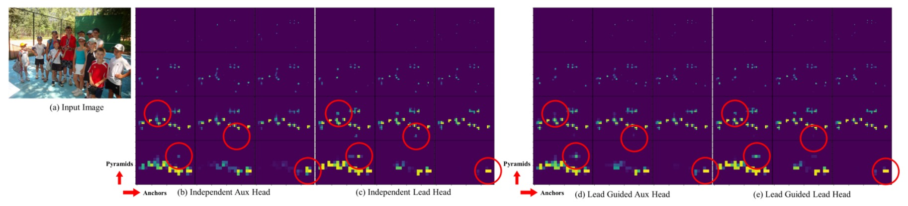
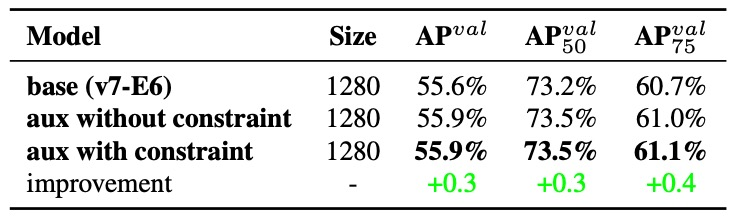

## 配角的逆襲

[**YOLOv7: Trainable bag-of-freebies sets new state-of-the-art for real-time object detectors**](https://arxiv.org/abs/2207.02696)

---

YOLOv7 這篇論文的作者團隊來自臺灣中研院。

等等，為什麼 v7 會比 v6 還要早兩個月發布？這是因為全世界有很多團隊都想要成為原初 YOLO 的正統繼承者，歡迎來到群星薈萃的 YOLO 宇宙！

## 定義問題

即時物件偵測這個領域，一直都在平衡四件事：**速度、準確率、參數量、可部署性**。

這些平衡在不同場景裡會被重新排序：在自駕車裡，我們會在意延遲；在嵌入式裝置裡，我們則在意功耗；而在醫療影像裡，精度高於一切。

過去幾年，即時偵測器的設計大致走向兩條主路線：

第一條是追求「**極限輕量化**」：針對微處理器和邊緣 CPU 設計，像是 MCUNet、NanoDet；另一條則在「**高效架構上壓榨效能**」：例如 YOLOX、YOLOR，藉由 backbone 改造、Neck 優化、特徵融合設計等方式，提高推論速度與準確率。

這些方法的共同點是：

- **它們幾乎都從推論架構下手，試圖用更快的路徑跑出更準的答案。**

但 YOLOv7 選擇了一條逆向的路。

作者在這篇論文提出了一個相對少被關注的切入點：

> **如果我們不改模型架構，而是重新設計訓練流程，可好？**

這個出發點促成了 YOLOv7 的核心理念：**trainable bag-of-freebies**。

所謂 bag-of-freebies，指的是那些只會增加訓練成本、但不會增加推論成本的技術。

YOLOv7 的創新之處在於，將這些技巧升級為「可訓練」的組件，進一步提升模型性能，而不動到任何推論結構。

這樣的設計雖然聽起來簡潔，卻馬上引出兩個結構層級的棘手問題：

1. **模組的重參數化該如何設計，才能同時利於訓練與推論？**
2. **當使用動態標籤分配技術時，如何處理多層輸出之間的分配對齊問題？**

這兩個問題過去常被當成「訓練細節」略過，但在 YOLOv7 的路線裡，這些**訓練過程中的非顯性瓶頸反而成為設計的主戰場**。

這一次，YOLOv7 把焦點從「推論表現」移到「訓練效能」。

思維順序在此刻已經悄然反轉。

## 解決問題

### Extended-ELAN

YOLOv7 引入的第一個設計關鍵，是名為 **E-ELAN（Extended Efficient Layer Aggregation Networks）** 的 backbone 架構。

它的前身是 YOLOX 使用的 ELAN 架構，而 E-ELAN 的核心設計理念是：

> **在不改變 gradient path 長度的前提下，提升參數利用率與特徵表達多樣性。**

從上圖中可以清楚看出，E-ELAN 完全保留了原始 ELAN 的 gradient 傳遞路徑。

我們都知道，神經網路中有效的梯度路徑會直接影響訓練效率與收斂能力。

E-ELAN 在維持這條主幹不變的同時，做了幾個關鍵改造：

- **擴張（expand）**：透過 group convolution 擴展 channel 與 cardinality。
- **重組（shuffle）**：對 feature map 進行分組重排。
- **合併（merge）**：將分組後的特徵進行融合，以促進跨群學習。

這些操作讓每個 block 學到的特徵更加多樣，同時也讓網路的記憶體與計算密度達到更高的效率，而不破壞原本 ELAN 架構的穩定性。

整體來說，E-ELAN 是一種針對 backbone 進行「計算密度與學習多樣性」雙優化的技術。

### 串接式架構的縮放

第二個設計重點，是 **針對串接式架構提出的複合縮放策略（Compound Model Scaling）**。

過去我們在 EfficientNet 中看到過 model scaling 的概念，也就是對網路的 **寬度（width）、深度（depth）、解析度（resolution）** 同時進行縮放。

但這種 scaling 方法大多針對的是像 ResNet、PlainNet 等「單一路徑」架構。

然而，YOLO 系列是典型的「多分支、層間串接」架構，當你單獨放大某個 block 的深度，會改變 transition layer 的輸入 channel；一旦前後 channel 不對稱，就會出現運算資源浪費、記憶體碎片化的問題。

:::tip
GPU/TPU 在做卷積時，是根據固定的輸入通道數與張量形狀排程。一旦我們讓某些 layer 通道數爆炸，但接下來的運算又沒有好好使用這些通道，會造成「冗餘計算」，與此同時還會讓某些核心模組運行效率下降。

現代深度學習系統（如 PyTorch、TensorRT）會試圖預先配置記憶體。若張量的尺寸變化頻繁（例如某些 block channel 變 128、某些變 256），會導致 memory allocator 產生不規則區塊，最終可能導致 GPU 記憶體無法有效打包利用，出現浪費或失敗。
:::

因此，作者在此提出了解法：

> **縮放深度的同時，應連帶調整寬度，讓通道比例保持穩定。**

這種策略避免了不對稱的 layer scaling 導致的資源浪費，也維持了模型在原始設計下的硬體友善特性。

具體做法是：

1. 先進行 depth scaling，增加 block 中的堆疊層數；
2. 根據擴張後的輸出通道變化，對應地對 transition layer 做寬度縮放；
3. 維持整體通道配比不變，避免模型在硬體上出現非對齊記憶體分配或計算瓶頸。

這是一種「耦合式的縮放方法」，將不同層級的參數變化一起考慮，才能在保有高效計算的前提下擴大模型規模。

### Trainable BoF

YOLOv7 所提出的 **trainable bag-of-freebies**，並不僅僅是使用現有技巧的堆疊，而是進一步讓訓練流程成為模型優化的主場。

我們仔細看一下三項關鍵創新。

1. **Planned Re-parameterized Convolution**

    

    <figure style={{ "width": "80%"}}>
    
    </figure>
    

   重參數化卷積（RepConv） 是一種訓練/推論分離的結構設計：

   - 在訓練階段，它包含三個分支：一個 3×3 卷積、一個 1×1 卷積、再加上一條 identity shortcut（直接傳遞輸入）；
   - 在推論階段，這三個路徑會合併為單一路徑，達到零額外成本的效果。

   這個設計在一些平鋪結構（例如 VGG）上表現很好，能夠加速收斂、提升準確率。

   但作者發現：

   > **當你把原始 RepConv 用在 ResNet 或 DenseNet 這類已經有 shortcut 或 feature concatenation 的網路中，準確率會明顯下降。**

   這是因為 ResNet 的設計已經內建一條 residual shortcut，再加上 RepConv 的 identity 分支，會導致梯度在多條 identity path 中重疊、產生干擾。

   如果是 DenseNet 的情況下，該架構的特性是將多層輸出透過 concatenation 串接起來，如果每層都額外插入 identity 分支，會破壞特徵多樣性的學習路徑，導致各分支間學不到不同的特徵。

   於是作者提出了解法：

   > **根據網路內部的結構特性（是否已有 residual/concat），決定是否使用不含 identity 分支的 RepConvN。**

   這個做法被稱為 Planned Re-parameterized Convolution，目的是「依據模型結構，做有計畫的替換與配置」。舉例來說：

   - 如果在一個 PlainNet（沒有殘差的基礎網路）上使用 RepConv，那完整的 3×3、1×1、identity 三路結構是有幫助的；
   - 但如果是 ResNet 或 DenseNet，則應使用 RepConvN（只保留 3×3 + 1×1，移除 identity 分支），才能避免梯度傳遞混亂。

---

2. **Coarse-to-Fine 標籤設計**

   

   在訓練多層偵測頭時，作者導入了一種創新的監督機制：

   - **Coarse-to-Fine Label Assignment**。

   這個機制包含兩個重要角色：

   - **Lead Head**：主輸出頭，負責最終偵測任務；
   - **Auxiliary Head**：輔助輸出頭，協助淺層學習收斂。

   傳統的深度監督會對每一個 head 單獨進行標籤分配，但在這裡作者不這麼做，而是提出了一個嶄新觀點：

   > **讓 Lead Head 的預測結果反過來作為整體訓練的領導者。**

   操作上分為兩種設計策略：

   - **Lead Head Guided Label Assigner**：以 Lead Head 預測結果 + ground truth 為基礎產生 soft label，套用於所有 head；
   - **Coarse-to-Fine Label Assigner**：產生兩種 soft label，分別為粗略（coarse）與精細（fine），用於 Auxiliary Head 與 Lead Head，提升前者的 recall、後者的 precision。

   這種策略背後的邏輯是：

   - **Lead Head 學習力強，適合做為指標；**
   - **Auxiliary Head 學習力弱，需放寬正樣本條件以提升召回率；**
   - **以 residual learning 的精神，讓 Lead Head 聚焦於尚未被學到的部分。**

   為避免 coarse label 產生不良的先驗知識，作者在 decoder 中進一步加以限制，使其在訓練中逐步收斂，形成動態調節的監督機制。

---

3. **其他可訓練 Freebies**

   最後，作者也整合了數項過去被視為「訓練技巧」的作法，並提升為 **可訓練的設計單元**：

   - **BN 與卷積層融合**：將 BatchNorm 的均值與方差併入卷積權重與 bias，以利推論階段的運算精簡。
   - **YOLOR 式隱式知識注入**：將隱式向量結合於卷積層，可於推論階段預先計算並簡化為固定向量權重。
   - **EMA（Exponential Moving Average）模型**：使用移動平均方式對訓練參數進行平滑，並以 EMA 模型作為最終推論模型，提升穩定性與泛化能力。

   這些技巧雖然不新，但在 YOLOv7 裡，它們的角色被重新定義為 **模型訓練性能的加速器**，而不再是僅供調參的黑盒工具。

### 實驗配置

YOLOv7 全部的實驗皆在 **Microsoft COCO 2017** 資料集上進行，並強調以下幾點：

- **從頭訓練（train from scratch）**，不使用任何 ImageNet 預訓練權重；
- 使用 `train2017` 做為訓練集，`val2017` 做為驗證與超參數調整，`test2017` 做為最終評估。

此外，為了對應不同應用場景，YOLOv7 系列模型分為以下幾類：

| 模型名稱  | 設計目標    | 縮放技術                       | 備註           |
| --------- | ----------- | ------------------------------ | -------------- |
| v7-tiny   | 邊緣裝置    | 輕量化設計                     | 使用 LeakyReLU |
| v7        | 一般 GPU    | Neck 擴張 + compound scaling   | 使用 SiLU      |
| v7-W6     | 高效能 GPU  | compound scaling + W6 設計     |                |
| v7-E6/E6E | E-ELAN 結構 | 深化與通道擴張 + group shuffle | E6E 為強化版本 |
| v7-D6/X   | 雲端模型    | -                              | -              |

所有縮放策略皆使用前面介紹的複合式模型縮放法，避免因通道不匹配導致運算資源浪費。

## 討論

### 與舊版 YOLO 的對比

<figure style={{ "width": "90%"}}>

</figure>

首先來看與過去 YOLO 系列與 YOLOR 相比的結果，如上表。

這裡可以看出，YOLOv7 在幾乎所有對比項目中都實現了「**更小、更快、精度更高**」的目標，尤其在小模型（tiny）與中階模型（W6）上表現亮眼。

### 與最新 SOTA 模型對比

<figure style={{ "width": "90%"}}>

</figure>

在速度與準確率權衡方面：

- **YOLOv7-tiny-SiLU** vs **YOLOv5-N (r6.1)**：多出 **127 fps**，準確率提升 **10.7% AP**
- **YOLOv7**：在 161 fps 下達成 **51.4% AP**，而 PPYOLOE-L 達到同樣精度時，僅有 **78 fps**

如果和高階模型對比，結果如下：

- **YOLOv7-X** vs **YOLOv5-L (r6.1)**：推論速度快了 **15 fps**，準確率高出 **3.9%**
- **YOLOv7-X** vs **YOLOv5-X (r6.1)**：推論速度快 **31 fps**，參數減少 **22%**，計算量減少 **8%**，但 AP 還提升 **2.2%**

最後是巨量模型對比：

- **YOLOv7-E6** vs **YOLOv5-X6 (r6.1)**：提升 **0.9% AP**，**參數 -45%、計算量 -63%、速度快 47%**
- **YOLOv7-D6** vs **YOLOR-E6**：速度相當，AP 提升 **0.8%**
- **YOLOv7-E6E** vs **YOLOR-D6**：速度相當，AP 提升 **0.3%**

從這些比較可歸納出幾項關鍵觀察：

1. **從輕量到大型模型，YOLOv7 都能維持高效率表現**；
2. 即便在不使用預訓練模型的前提下，YOLOv7 仍能擊敗大多數 SOTA 模型；
3. 模型縮放策略與模組訓練設計（如 RepConvN、Coarse-to-Fine Label Assigner）直接轉化為實際效能提升。

YOLOv7 不只是訓練技巧的展示，而是一次全面考量實務部署需求的架構設計範本。

### 消融實驗：模型縮放

傳統的模型縮放常見三種做法：

- **只放大寬度（width）**：增加每層的通道數；
- **只放大深度（depth）**：增加層數或 block 數量；
- **複合縮放**（如 EfficientNet）：同時調整 depth、width、resolution。

作者採用的是一種針對 **concatenation-based 架構特化** 的做法：

> **將 computational block 的深度擴張 1.5 倍，並同步將 transition block 的寬度擴張 1.25 倍。**

這種設計背後的邏輯，是要保持幾個重要參數：

- block 的輸出 feature map 結構穩定；
- 各層之間的 channel 對齊；
- 降低 memory fragmentation，提升硬體計算效率。

效果如下表：

<figure style={{ "width": "70%"}}>

</figure>

從數據中可以看到：

- **單獨放大寬度**：雖然簡單，但效率最低，參數增多卻沒帶來明顯的精度提升；
- **單獨放大深度**：能帶來些微精度提升，但會導致 block 輸出不對齊，計算使用率下降；
- **複合式縮放策略**：能在「更少的參數與計算成本」下達成 **最多的 AP 提升（+0.5%）**。

複合式模型縮放不只是 scale 的問題，而是一種針對特定網路架構（如 ELAN、YOLO-style）所設計的幾何穩定縮放法。

### 標籤指派策略

在以往的多頭偵測器中，**Auxiliary Head** 常常只是單純加上一個中層監督點，讓梯度更快穿透模型、加速收斂。

但 YOLOv7 的設計進一步提出：

> **為何不讓輔助頭的學習內容也由主輸出（Lead Head）來主導？**

這正是 **Assistant Loss for Auxiliary Head** 的設計核心，透過 Lead Head 的預測，來建立更有語意層次感的監督結構。

1. **實驗一：三種標籤指派策略策略比較**

   

   <figure style={{ "width": "70%"}}>
   
   </figure>
   

   從實驗的結果可以看到：

   - **只要加上輔助損失（assistant loss）就能提升效能**；
   - 而 **由 Lead Head 引導的 soft label（Lead-guided Assigner）** 更勝傳統的監督方式；
   - 最好的結果來自 **Coarse-to-Fine 引導策略**，對 lead 給精細標籤，對 auxiliary 給較寬鬆、recall-oriented 的標籤，達成 supervision 的層次分工。

   作者進一步在下圖中展示不同策略下的 **Objectness Map**：

   

   在傳統方法下，Auxiliary Head 常會學到不一致的特徵，但使用 Lead-guided soft label 後，輔助頭學到的特徵與主頭更一致，甚至有助於主頭學習剩餘資訊（residual information）。

   這種從中層往高層的引導式資訊傳遞，構成一種特殊的「殘差式學習架構」，提升整體網路的學習分工與效率。

---

2. **實驗二：Decoder 的上界限制效果**

   

   <figure style={{ "width": "70%"}}>
   
   </figure>
   

   為了避免 Coarse Label 對最終輸出產生負面影響，作者在 decoder 中加了一項限制條件：**限制 coarse label 的 objectness 分數上限，根據目標中心距離做衰減。**

   上表的結果顯示，這項設計不僅讓 Coarse Label 更具容錯空間，也讓模型更聚焦於「應該讓 auxiliary head 學到什麼」，而非讓它誤學到不必要的雜訊。

---

3. **實驗三：Partial Auxiliary Head 的設計**

   

   <figure style={{ "width": "70%"}}>
   
   </figure>
   

   在 YOLOv7 中，作者還提出了一種新的設計：

   > **將輔助頭連接在 E-ELAN 中間層的 pyramid（特徵金字塔）上，而非最終輸出處。**

   這麼做有兩個目的：

   1. **避免 Assistant Loss 直接干擾最終 feature 的更新權重**；
   2. **讓不同尺寸的物件在不同層中被學習，保持 pyramid 對小中大目標的學習分布。**

   結果如上表所示：**Partial Coarse-to-Fine 策略表現最好**，能維持各層學習目標的清晰邊界。

由 Lead Head 主導 supervision，不只是資訊再利用，更是讓整個網路形成一種語意一致、梯度互補的訓練路徑。

## 結論

YOLOv7 是一套以 **訓練流程為主體、推論結構為背景** 的物件偵測設計理念。

從模型縮放、模組替換到標籤分配，作者將那些被視為「訓練細節」的部分，重新拉到設計舞台的正中央，展現出訓練本身就是優化模型的關鍵因素。

對實務開發者來說，YOLOv7 最大的啟發在於，我們應該要認識到 **memory alignment、channel matching、gradient flow** 等硬體導向設計對實際部署有多重要，此外模組替換（如 RepConv）時不能只看參數，而要考慮資訊路徑與架構邏輯。

這是工程與研究交會的路口，有太多觀念值得我們學習。
