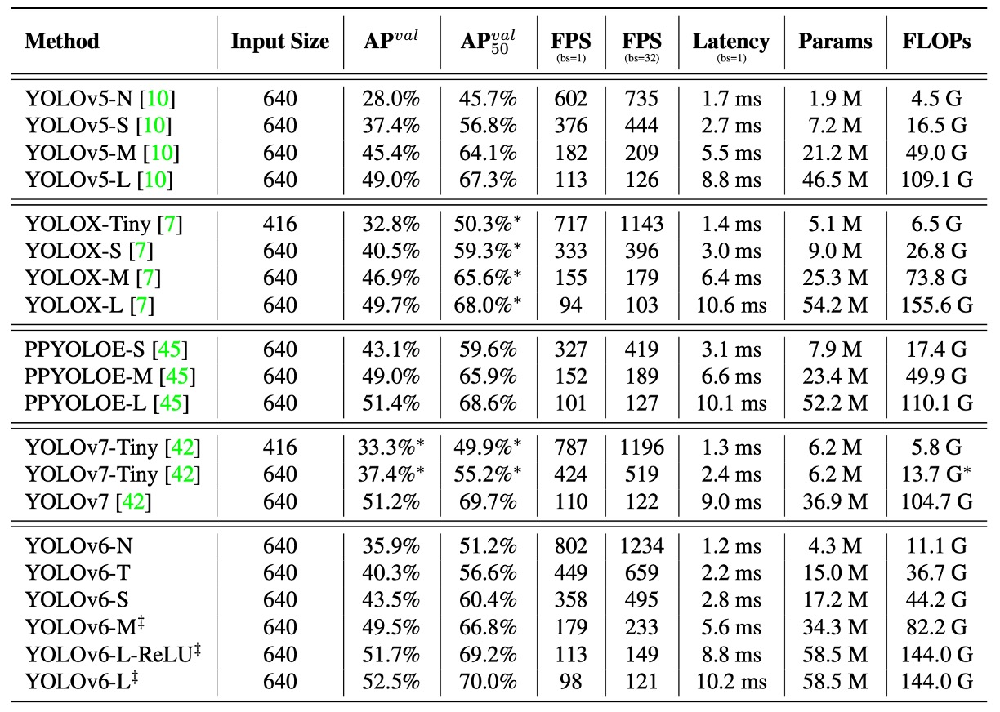

## 重參數化的路口

[**YOLOv6: A Single-Stage Object Detection Framework for Industrial Applications**](https://arxiv.org/abs/2209.02976)

---

由於 YOLOv5 沒有發表論文，所以我們直接往下看 v6。

YOLOv6 是由中國生活服務平台 Meituan 的計算機視覺團隊主導開發。

## 定義問題

YOLO 系列在工業應用中一直有極高的普及率。

原因無他，就是簡單、快速、夠準。

但隨著任務類型的擴張與部署場景的複雜化，原本那些被視為「夠用就好」的基礎假設，開始逐漸支撐不住。

例如架構一致性的迷思，讓小型模型與大型模型在效能擴展上開始出現斷層；量化推論的不穩定性，讓重參數化模型在實際部署上反而出現反作用。

此外，現有的速度報告普遍依賴高階 GPU，導致實際部署時的延遲表現與預期落差極大；而標籤分配、損失設計、知識蒸餾等進階訓練策略，也往往停留在理論或局部實驗階段，難以構成完整的訓練流程。

更核心的問題是：

> **當我們說一個模型夠快夠準的時後，我們真正指的是什麼？**

是在 A100 上的 benchmark 成績，還是在 T4 上的即時回應？是在訓練精度的曲線終點，還是能否在工業場景裡穩定跑上一個月？

這些問題堆疊起來，不只是技術的細節，還有設計觀點的分歧。

當我們回過頭檢視 YOLO 架構時，會發現過去的演進路線偏重模組堆疊、特徵融合與資料增強技術，然而在進入工業部署的門檻前，**模型的可量化性、模組可重參數化性、訓練策略與硬體友善性**才是需要重新思考的核心。

## 解決問題

YOLOv6 將設計思維拆分為六個策略面向，對應六個長期未解的工程瓶頸：

1. **網路設計（Network Design）**
2. **標籤分配（Label Assignment）**
3. **損失函數（Loss Function）**
4. **訓練強化（Industry-handy Improvements）**
5. **量化與部署（Quantization and Deployment）**
6. **自我蒸餾（Self-distillation）**

:::tip
YOLO 系列從這篇論文開始引入重參數的架構，這個想法在 2021 的 RepVGG 論文後開始流行。還沒讀過 RepVGG 的讀者，可以參考我們之前的筆記：

- [**[21.01] RepVGG: 讓 VGG 再次偉大**](../../reparameterization/2101-repvgg/index.md)

:::

### 網路設計

物件偵測模型，基本上可以拆解為三個核心模組：

- **Backbone、Neck 還有 Head**。

這個部分大家應該都可以朗朗上口。

Backbone 主導特徵提取，決定了模型的語意表徵能力與大部分的運算成本；Neck 負責整合不同層級的特徵圖，建立多尺度的金字塔結構；Head 則根據這些特徵圖進行分類與框選的預測。

YOLOv6 對這三者都重新設計，依照不同模型規模做出差異化調整，核心理念是：

> **針對不同模型大小設計不同架構。**

對於小模型，YOLOv6 採用 **RepBlock** 的可重參數化模組作為 Backbone 主體，這種轉換機制來自 RepVGG 的設計思想：**訓練為學習而設計，推論為部署而優化。**

<figure style={{ "width": "90%"}}>

</figure>

RepBlock 模組如上圖 (a)，在訓練時包含多分支結構，有利於特徵表徵學習；在推論階段則會被轉換為單一路徑、堆疊 3×3 卷積的形式，能極大化硬體的計算密度與並行效率，尤其在主流 GPU/CPU 上表現良好。

然而，當模型規模放大，單一路徑的架構將導致參數與計算量指數成長，於是 YOLOv6 為中大型模型引入了新的設計：**CSPStackRep Block**，如上圖 (c) 所示。這是一種融合 **CSP 結構** 與 **RepBlock 重參數化機制** 的混合模組。

其內部由三個 1×1 卷積與一組堆疊的 RepBlocks 組成，並加入跨階段殘差（CSP）以維持表現穩定性，同時減少重複計算。這種結構在準確率與速度之間取得更良好的折衷，尤其適合中大型模型。

---

接著來看 Neck 的部分。

YOLOv6 延續了 v4/v5 使用的 **PAN（Path Aggregation Network）** 架構作為頸部主體。不同之處在於小模型使用 RepBlock，大模型則使用 CSPStackRep Block，替換 v5 原有的 CSPBlock。

這樣的架構被作者命名為 **Rep-PAN**，寬度與深度則根據模型尺度動態調整，使特徵在不同層次與空間尺度上能夠有效流動，並兼顧推理效率。

整體架構如下圖所示：

<figure style={{ "width": "90%"}}>

</figure>

---

最後是 Head 的設計優化。

相較於 v5 的耦合式設計，或 YOLOX 引入額外兩層 3×3 卷積的解耦式 Head，YOLOv6 採用解耦式設計，**Efficient Decoupled Head**，僅保留一層中間卷積層，並根據 Backbone 與 Neck 的寬度調整整體通道數。

此外，YOLOv6 採用 **anchor-free** 的方式，選擇基於 anchor point 的策略。模型不再預設一組錨點框，而是直接預測各點到目標邊界的距離。這種方法的好處是解碼簡單、泛化能力強、後處理成本低，也是近年 anchor-free 偵測器（如 FCOS、YOLOX）的主流設計路線之一。

### 標籤分配

標籤分配（Label Assignment）是物件偵測訓練流程中的關鍵環節。

它負責在訓練階段，將每個 ground-truth object 對應到一組預設 anchor 或預測點上。這個過程不僅決定了正負樣本的分佈，也直接影響了分類與回歸兩條分支的學習動能。

早期的方法大多基於幾何條件進行，例如 IoU-based 策略或 bounding box 內部法，這些方法邏輯直觀，但對多尺度物件與不均勻背景常顯不足。

近年則出現一系列將標籤分配視為優化問題或任務對齊問題的進階方法。

1. **SimOTA：理想的傳輸問題，不理想的收斂表現**

   YOLOv6 的早期版本曾採用 **SimOTA** 作為標籤分配策略。

   該方法源自 OTA（Optimal Transport Assignment），將標籤分配建模為一個全局傳輸問題，並透過損失函數作為距離度量，在分類與回歸結果之間達成整體最佳的分配策略。

   SimOTA 是 OTA 的簡化版本，保留了核心思想，同時降低了超參數的複雜度。然而在實務上，作者觀察到幾個問題：

   - 引入 SimOTA 會**顯著拉長訓練時間**；
   - 模型在早期階段容易出現 **不穩定震盪**，且對初始化與學習率更為敏感。

   這些觀察促使他們開始尋找一個更穩定且訓練友善的替代方案。

2. **TAL：從幾何到語意的任務對齊**

   最終作者採用了 **Task Alignment Learning（TAL）**。

   該方法由 TOOD 提出，與 SimOTA 不同，它**不再單純依賴幾何指標（如 IoU）作為分配準則**，而是建立一個同時考慮分類得分與預測框品質的統一指標，讓分類與回歸這兩個任務的分支在標籤分配過程中同步對齊。

   這種設計有兩個明顯好處：

   1. **緩解了分類與回歸之間的任務錯位**，提升模型整體一致性；
   2. **在訓練初期即展現出穩定性與加速收斂的效果**，較不依賴超參數調整。

   TOOD 原始架構中也引入了 T-head 與 TAP（Task-Aligned Predictor）模組，後續 PP-YOLOE 將其輕量化為 ET-head。

   但作者發現在 YOLOv6 上引入 ET-head 並無明顯精度提升，反而拖慢了推論速度，因此他們選擇保留自己的 Efficient Decoupled Head 設計，僅採用 TAL 作為標籤分配策略。

---

實驗證實，TAL 不僅在精度上優於 SimOTA，更重要的是**顯著穩定了訓練過程**，最終成為 YOLOv6 預設的標籤分配機制。

### 損失函數

物件偵測任務本質上可以拆分為兩個子任務：**分類** 與 **定位**，分別對應到分類損失與框選損失兩種學習訊號。這兩條損失路徑不僅分別影響預測準確度，也共同影響模型整體收斂的速度與穩定性。

在 YOLOv6 中，作者針對這兩個子任務的損失設計進行了大量實驗，最終挑選出一組最平衡的組合策略。

1. **分類損失：平衡正負樣本的訊號強度**

   在分類分支上，傳統的交叉熵損失在正負樣本不平衡時，往往會導致模型過度學習簡單樣本，忽略少數困難樣本。為了解決這個問題，Focal Loss 被提出，透過下調易分類樣本的損失權重，讓模型專注於困難樣本。

   後續又有進一步延伸：

   - **Quality Focal Loss (QFL)** 將分類得分與預測框品質結合，用於分類 supervision；
   - **Poly Loss** 則將損失函數以多項式形式展開，試圖提升泛化性；
   - **VariFocal Loss (VFL)** 以非對稱方式處理正負樣本，對正樣本給予更高信號強度，進一步平衡訊號分布。

   經實驗比較，**YOLOv6 最終選擇 VFL 作為分類損失函數**，其對困難樣本的高靈敏度與訓練穩定性是主要原因。

---

2. **框選損失：從 IoU 到機率分布**

   定位損失的設計核心在於讓預測框盡可能貼近 ground truth。早期方法多使用 L1 或 L2 損失，但後來發現與評估指標（如 IoU）不一致，導致學習方向偏差。

   因此 IoU 系列損失被提出，包括：

   - **GIoU、DIoU、CIoU**：分別加入外接框面積、中心距與長寬比等幾何資訊；
   - **SIoU**：更進一步考慮對角方向與角度方向的收斂行為。

   YOLOv6 採用以下策略：

   - 小模型（YOLOv6-N/T）使用 **SIoU**；
   - 中大型模型則採用 **GIoU**，在穩定性與效能之間取得平衡。

   另外，YOLOv6 也在中大型模型中引入 **DFL（Distribution Focal Loss）**。這是一種將 box regression 視為機率分布估計的損失設計，能更好處理目標邊界模糊或不確定的場景。不過考量到其計算開銷，**僅在 YOLOv6-M/L 中使用**，小模型則不採納。

---

3. **物件存在損失：不帶來提升的項目**

   作者也嘗試在 YOLOv6 中加入 **objectness loss**，類似 FCOS 與 YOLOX 中的設計，用以抑制低品質預測框的得分。然而實驗結果顯示，在 YOLOv6 的 anchor-free 架構下，**這項設計未帶來顯著效益**，因此最終未納入模型主幹。

---

整體來看，YOLOv6 在損失設計上採取**任務對齊 + 訊號強化**的策略：

- 分類分支強調訊號不對稱性，以 VFL 穩定模型判別力；
- 回歸分支則在小模型強調穩定與快速學習，在大模型中允許引入複雜但準確的 DFL；
- 所有設計都以「提升整體學習品質，不犧牲推論效率」為原則。

### 量化與部署

在工業應用中，就是要「快」。

因此，**如何在不嚴重損失性能的前提下加速推論**，成為模型設計與訓練之外另一個現實問題。

量化（Quantization）正是這一問題的主要解法。

然而，對於像 YOLOv6 這類大量使用重參數化模組（re-parameterization blocks）的架構而言，傳統的量化流程並不適用。

如果使用「後訓練量化（PTQ）」的話，會發現準確率掉得特別嚴重；如果改成「量化感知訓練（QAT）」，又會在訓練與推論階段出現量化模擬器不匹配的問題。

:::info
讀到這邊，先暫停一下。

其實在這篇論文發表後不久，就有另外一篇針對重參數架構的量化問題探討的經典論文：QARepVGG。

該論文指出導致量化問題的原因在於 BatchNorm 在重參數的過程中會因為一些統計參數的問題而崩潰，感興趣的讀者可以去看看我們之前的論文筆記：

- [**[22.12] QARepVGG: 讓 RepVGG 再次偉大**](../../reparameterization/2212-qarepvgg/index.md)
  :::

而此時此刻，YOLOv6 的做法是拆開來逐一處理。

1. **RepOptimizer：從優化器層面解決重參數化的量化問題**

   YOLOv6 使用 **RepOptimizer** 作為訓練優化器，這是一種針對重參數化結構設計的梯度優化策略。核心做法是：在每一次梯度更新時即進行結構層級的重參數化，從源頭對齊訓練與部署階段的行為差異。

   實驗顯示如下圖，這樣訓練出來的模型具有更窄的特徵分布範圍，更適合直接進行 PTQ。模型在無需額外大規模標註資料的前提下，即可產出推論穩定的量化版本。

   

   <figure style={{ "width": "70%"}}>
   
   </figure>
   

---

2. **敏感度分析：用 float 保護模型的薄弱點**

   即便使用 RepOptimizer 訓練，整體模型在量化後仍可能在部分 layer 上出現顯著準確率下降。因此，YOLOv6 採用 **sensitivity analysis（敏感度分析）**，逐層評估量化對特徵圖的影響，找出影響最大的 layer。

   使用的評估指標包括：

   - **MSE（均方誤差）**
   - **SNR（訊雜比）**
   - **Cosine Similarity**

   作者對 YOLOv6-S 模型進行完整分析後，選擇影響最敏感的前六層維持 float 計算，而其餘部分則可安全量化，這種混合精度部署策略在不引入額外複雜度的情況下有效提升穩定性。

---

3. **QAT + Channel-wise 蒸餾**

   

   <figure style={{ "width": "80%"}}>
   
   </figure>
   

   在某些部署場景中，即便使用 RepOptimizer 與混合精度仍不夠，這時就需進一步引入 QAT。YOLOv6 在此基礎上進行兩項改良：

   1. QAT 必須基於 RepOptimizer 架構之上建構，以解決 fake quantizer 不一致的問題；
   2. 結合 Channel-wise Distillation，也就是將自己在 FP32 模式下的輸出作為教師，引導量化訓練過程。

   這種自蒸餾設計能進一步改善通道層級的分佈學習，補償量化過程中失去的細節資訊。

### 實作細節

YOLOv6 的訓練流程基本沿用了 YOLOv5 的設定，包含以下幾項訓練技巧與策略：

- 優化器：使用帶動量的隨機梯度下降（SGD with momentum）；
- 學習率調整：採用餘弦衰減（cosine decay）；
- 其他技巧：warm-up 初始化、分組式 weight decay、與指數移動平均（EMA）。

在資料增強部分，作者採用兩種被廣泛驗證有效的強增強方法：**Mosaic** 和 **Mixup**，同樣延續自 YOLOv4/YOLOv5 的實作慣例。

訓練資料來自 COCO 2017 訓練集，驗證則使用 COCO 2017 驗證集。

所有模型均於 8 張 NVIDIA A100 GPU 上訓練完成，除非另有說明，否則速度測試都是統一在 Tesla T4 上以 TensorRT 7.2 測得。

## 討論

這篇論文中有些篇幅在於自蒸餾的規劃和實驗，不過我們受限於篇幅，這裡只挑出幾個重要結果進行討論。對於自蒸餾技術感興趣的讀者，請自行翻閱原始論文。

### 和其他架構比較

<figure style={{ "width": "90%"}}>

</figure>

<figure style={{ "width": "70%"}}>

</figure>

由於 YOLOv6 的核心目標是為工業部署打造高效偵測器，因此作者關注的重點並非 FLOPs 或參數量，而是實際部署後的推論效率，包括：

- **Throughput（FPS）**：batch size 為 1 與 32 時的推論幀率；
- **Latency（延遲時間）**：單張圖像的平均處理延遲。

實驗將 YOLOv6 系列與其他同類 YOLO 架構進行比較，包括：

- YOLOv5
- YOLOX
- PP-YOLOE
- YOLOv7

:::tip
**等等，為什麼 v6 可以跟 v7 比較？**

因為 v7 比 v6 更早提出來！歡迎來到亂七八糟的 YOLO 世界！😱
:::

所有模型的測試條件一致，皆為 **FP16 精度 + TensorRT 部署 + Tesla T4 GPU**。

YOLOv7-Tiny 的成績則根據其開源模型與官方權重，於 416 與 640 的輸入尺寸下重新測試。

實驗結果如上表所示，歸納結果如下：

- **YOLOv6-N** 在輸入尺寸為 416 的條件下，AP 分別比 YOLOv5-N / YOLOv7-Tiny 提升 **7.9% / 2.6%**，且在 throughput 與 latency 兩項指標上皆為最佳。
- **YOLOv6-S** 相比 YOLOX-S / PPYOLOE-S，分別提升 **3.0% / 0.4%** 的 AP，同時具備更快推論速度。
- 在輸入為 640 的設定下，**YOLOv6-T** 相比 YOLOv5-S / YOLOv7-Tiny，準確率提升 **2.9%**，並在 batch size = 1 時，推論速度快上 **73 / 25 FPS**。
- **YOLOv6-M** 相比 YOLOv5-M 提升 **4.2% AP**，並比 YOLOX-M / PPYOLOE-M 提高 **2.7% / 0.6%** 準確率，速度仍保持優勢。
- 在大型模型比較中，**YOLOv6-L** 分別比 YOLOX-L / PPYOLOE-L 提升 **2.8% / 1.1% AP**，並維持相同的延遲條件下仍具領先性。

作者也提供一個速度更快的變體：**YOLOv6-L-ReLU**，將 SiLU 激活函數替換為 ReLU。

在不增加延遲的情況下達成 **51.7% AP，延遲僅為 8.8ms**，**同時在準確率與速度上超越 YOLOX-L、PPYOLOE-L 與 YOLOv7**。

### 消融實驗

為驗證 YOLOv6 的設計選擇是否確實影響最終性能，作者進行了系統性消融實驗，涵蓋三個面向：**網路架構、標籤分配、損失函數**。所有實驗主要基於 YOLOv6-N/S/M 模型展開，並在一致的訓練與測試設定下進行比對。

首先比較單路徑結構與多分支結構（CSPStackRep Block）在不同模型規模下的效能。

<figure style={{ "width": "70%"}}>

</figure>

實驗結果顯示：

- 在 YOLOv6-N 上，**單路徑結構**在準確率與推論速度上皆優於多分支架構。雖然 FLOPs 與參數量較高，但因記憶體佔用低、並行性佳，實際上運行更快。
- YOLOv6-S 上兩種結構表現相近。
- 對於 YOLOv6-M/L，**多分支架構**表現更好，最終作者選用 channel coefficient 為 2/3（M）與 1/2（L）的 CSPStackRep 結構。

接著分析 YOLOv6-L 的 Neck 寬深配置，結果顯示窄而深比寬而淺的設計在速度近似情況下多出 0.2% 的 AP，故採用窄深結構，這個結果符合預期。一般來說，較深的架構會有比較大的感受野，因此更適合物件偵測的任務。

後續的分析比較瑣碎，我們直接看結論：

- Conv + SiLU 擁有最佳準確率。
- RepConv + ReLU 則在速度與準確率之間取得較佳平衡。
- 加入解耦 Head（DH）提升 1.4% AP，僅增加 5% 計算成本。
- Anchor-free 結構相較 anchor-based，推論速度提升 51%，主要因輸出維度壓縮。
- Backbone 與 Neck 的統一改造（EB+RN）提升 3.6% AP，速度提升 21%。
- Hybrid channel 的解耦 Head（HC）帶來額外 0.2% 準確率與 6.8% FPS 提升。

標籤分配策略上，實驗結果顯示 **TAL** 為最佳策略，其在 YOLOv6-N 上達到 **35.0% AP**，較 SimOTA 高 0.5%，且訓練更穩定。

損失函數設計的部分作者在 VFL、QFL、Focal Loss 與 Poly Loss 之間進行比較，結果是 VFL 在 YOLOv6-N/S/M 上分別帶來 0.2% / 0.3% / 0.1% 的 AP 提升，最終選為預設分類損失。

針對 IoU 系列損失與機率分布損失進行測試：

- **SIoU** 在 YOLOv6-N 與 YOLOv6-T 表現最佳；
- **CIoU** 則在 YOLOv6-M 上更優；
- 引入 DFL 帶來 0.2%\~0.1% 的增益，但對小模型影響推論速度，因此僅在 YOLOv6-M/L 中採用 DFL。

物件存在損失的部分，實驗顯示在 YOLOv6-N/S/M 上引入物件存在損失反而導致最大 1.1% AP 下滑。

作者認為這來自 TAL 策略中分類與回歸的任務對齊邏輯，在加入 object 分支後從兩任務對齊變為三任務，干擾了整體損失優化方向，因此最終選擇「不使用物件存在損失」。

### 量化結果

為了驗證 YOLOv6 的量化設計能否真正落實於部署場景，作者以 **YOLOv6-S** 為主體，進行完整的 PTQ 與 QAT 實驗，分別針對 v1.0 與 v2.0 的模型版本進行測試。所有模型預設訓練 300 個 epoch。

:::tip
v2.0 最大的改進就是移除了量化敏感層，例如某些組合型 activation、shortcut 結構、非對齊的卷積模組等。
:::

1.  **後訓練量化（PTQ）**

    首先比較在未使用與使用 **RepOptimizer** 條件下的 PTQ 效果，結果如下表所示：

      

      <figure style={{ "width": "70%"}}>
      
      </figure>
      

    引入 RepOptimizer 並不影響 FP32 準確率，但**明顯改善了 INT8 量化後的精度**，特別是在 v1.0 中，從 35.0% 提升至 40.9%。這證明其對特徵分布的收斂能力，有助於模型更適應量化誤差。

---

2. **量化感知訓練（QAT）**

   針對 YOLOv6 v1.0，作者針對非敏感層，進行 **Partial QAT**。同時比較 Full QAT 與 Channel-wise Distillation（CW Distill）搭配使用時的差異：

   

   <figure style={{ "width": "70%"}}>
   
   </figure>
   

   Partial QAT 整體表現**優於 Full QAT**，在略微降低吞吐量的同時，提升準確率 7.3%。這一結果也再次印證：適當選擇量化區塊可有效減少不必要的精度損失。

   針對 v2.0，因已重新設計移除了量化敏感層，QAT 可直接在整體網路上進行。搭配圖優化與量化模組精簡，進一步推升了準確率與推論速度。

   作者將此版本與 PaddleSlim 中提供的各種量化模型做對比：

   

   <figure style={{ "width": "70%"}}>
   
   </figure>
   

   結果顯示，本論文的量化方法在準確率與速度上**均優於其他已公開的量化模型**，即便與 YOLOv6 FP16 模型相比，仍有更高推論速度，且準確率僅差 0.1%。

---

這些結果證明，透過 **RepOptimizer + 精選 QAT 策略 + 圖優化 + 通道蒸餾** 組合，YOLOv6 不僅能量化，**還能高效量化，真正達成部署所需的速度與精度雙平衡**。

## 結論

YOLOv6 主要貢獻包括：

- 依模型規模差異，設計出可重參數化的小模型架構與高效多分支的大模型架構；
- 採用 TAL 分配與 VFL + SIoU/CIoU + DFL 的損失設計，在穩定與精度之間取得平衡；
- 加入多項工程技巧，例如延長訓練、自蒸餾、灰邊處理與 Mosaic 等，強化效果；
- 搭配 RepOptimizer + 混合精度 PTQ/QAT 策略，成功打造能夠直接部署的量化偵測器。

YOLOv6 在準確率與速度上均超越現有同級模型，並在量化後仍維持良好表現，為工業即時應用提供更實用的解法。
