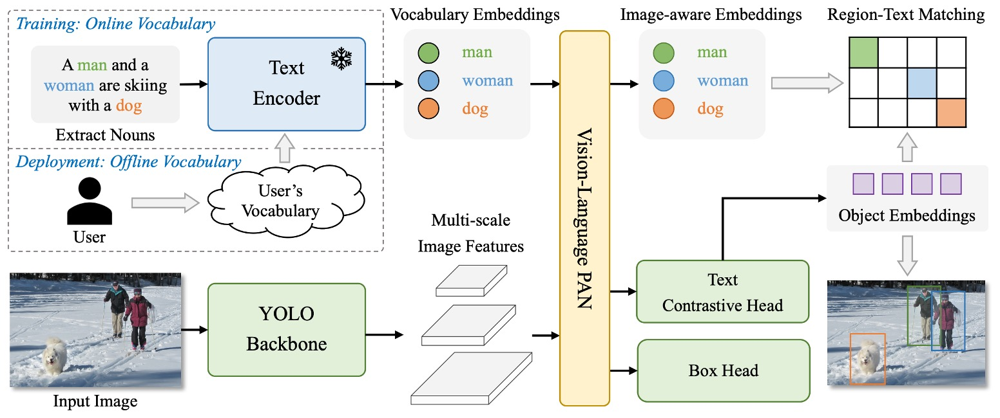
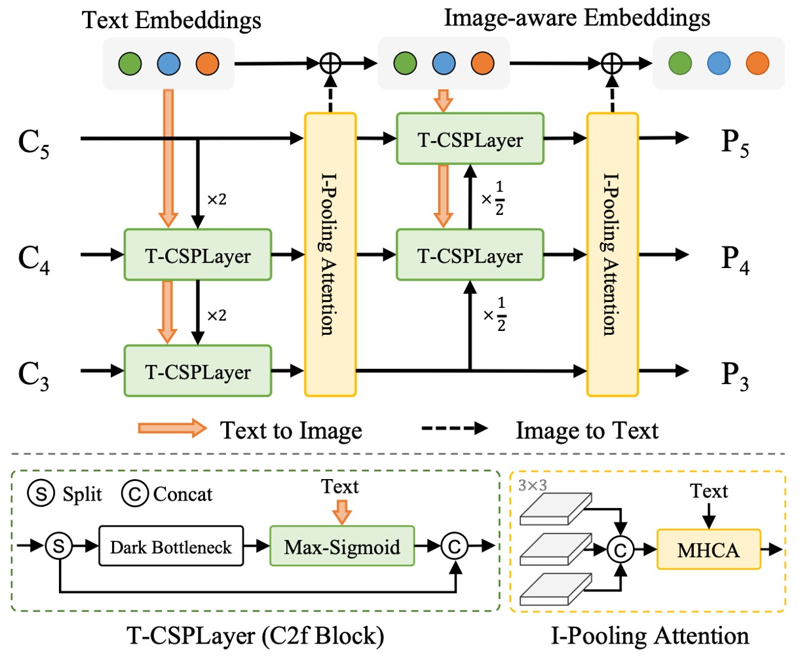
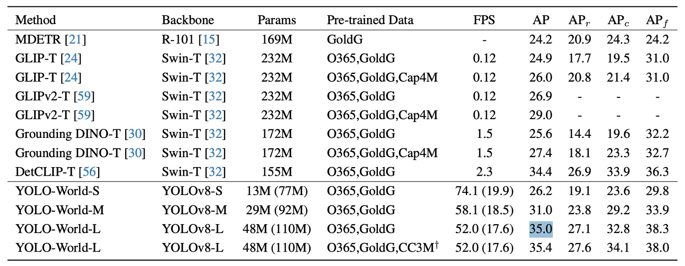

## 名詞的追逐者

[**YOLO-World: Real-Time Open-Vocabulary Object Detection**](https://arxiv.org/abs/2401.17270)

---

在這個以 YOLO 為代表的目標偵測時代裡，速度與效率早已不是什麼新議題。

真正棘手的，是類別的封閉性。

## 定義問題

在過去的十年間，物件偵測的進展可謂翻天覆地。

我們看見 R-CNN 系列逐步建構出二階段偵測的規則世界，看見 SSD 與 RetinaNet 簡化流程、以像素為基礎對每一個 anchor 詢問目標；也看見 DETR 引入 query 設計與 Transformer，讓「偵測」這件事變得不再只是定位，而開始與語意對話。

而在所有這些架構之中，YOLO 系列始終是一個特立獨行的存在。

它不斷壓縮運算成本，以極簡架構挑戰即時推論的極限： **要快！要更快！要非常快！**

然而，在這些技術輪替之下，有一件事卻鮮少被撼動：

> **幾乎所有主流偵測模型，都仍活在「固定詞彙」的世界中。**

訓練資料定義了模型能說的語言；資料集裡沒有「風箏」，模型也就不會學會辨識風箏的樣貌。COCO 裡有 80 類、Objects365 有 365 類，但現實世界有更多更多的物體，在資料集中還沒有名字。

我們如何讓模型擁有一種「打開詞典」的能力，而不是只會回答已知選項中的那幾個？

**Open-Vocabulary Object Detection** （以下簡稱 OVD）正是為了解決這個瓶頸而誕生。它期望物件偵測能跨越固定類別的邊界，學會理解「語意」，而非單純記憶圖像與標籤之間的對應。

但是每次 OVD 的嘗試，都代價不菲。

## 解決問題

<figure style={{ "width": "90%"}}>

</figure>

YOLO-World 的架構如上圖所示。

它保留了 YOLO 系列慣有的整體設計：影像經 backbone 編碼後，傳入多尺度特徵融合模組，最終輸出預測框與物件表示。但不同於過往封閉類別的設定，YOLO-World 在其中引入了語言編碼器與跨模態融合模組，使整體架構得以處理開放詞彙的偵測任務。

整體流程如下：

1. 使用者輸入的 prompt（可能是一段描述、一組名詞、或一份類別清單）會先透過 CLIP 的文字編碼器轉換為語意向量。
2. 圖像經由 YOLOv8 的影像編碼器處理後，擷取多尺度影像特徵。
3. 接著透過新提出的 RepVL-PAN，將語言與圖像特徵進行對齊與融合。
4. 最終由 decoupled head 同時輸出 bounding box 與物件語意表示，與輸入詞彙進行比對。

這樣的設計讓 YOLO-World 不再依賴固定的類別分類器，而是透過語意匹配，找出圖像中與輸入 prompt 最相符的區域。也因此，它可以在推論階段靈活切換詞彙，甚至處理訓練集中從未出現過的物體。

在這樣的結構下，物件偵測這件事，開始從「預測是哪一類」轉變為「這裡是不是某個詞所描述的東西」。

接著我們仔細看一下 RepVL-PAN 的設計方式。

### RepVL-PAN

<figure style={{ "width": "70%"}}>

</figure>

如上圖所示，YOLO-World 所提出的 RepVL-PAN（Re-parameterizable Vision-Language Path Aggregation Network）是一個強化圖文交互的模組，作用在 YOLO 的多尺度特徵融合階段。

傳統的 PAN 僅處理影像特徵之間的上下傳遞與融合，但在 open-vocabulary 偵測任務中，僅靠視覺訊號並不足以完成語意比對。RepVL-PAN 因此在原本的影像特徵流程中，注入了語言資訊，使語意得以滲透進特徵圖的生成過程中。

整體包含兩個關鍵組件：

1. **Text-guided CSPLayer**

   在 YOLO 架構中，CSPLayer 是一種改良過的殘差堆疊模組，負責維持特徵的穩定性與通道表達力。而在 YOLO-World 中，作者設計了文字引導版本的 CSPLayer（Text-guided CSPLayer），讓每層特徵能根據詞彙語意進行調整。

   具體來說，對於某一尺度的影像特徵 $X_l \in \mathbb{R}^{H \times W \times D}$，以及來自文字編碼器的詞嵌入向量集合 $W = \{w_j\}_{j=1}^C$，我們計算每個位置與語意的相似程度，並使用 sigmoid 函數形成注意力權重：

   $$
   X_l' = X_l \cdot \delta\left( \max_{j \in \{1..C\}} (X_l W_j^\top) \right)^\top
   $$

   其中 $\delta(\cdot)$ 為 sigmoid 函數，用以抑制極端值。這樣的設計讓每個位置的影像特徵能依照語意線索進行加權，進而產生一個更能對應語詞的特徵圖 $X_l'$。

   這些強化後的影像特徵，會與原本的 CSPLayer 輸出進行串接，再送入下一層 PAN 網路中，逐步建立語意敏感的金字塔表示。

2. **Image-Pooling Attention**

   除了讓語言影響圖像，YOLO-World 也設計了反向路徑，目的是為了讓圖像資訊回饋語言表示。這是透過 Image-Pooling Attention 實現的。

   具體來說，我們將各層尺度的影像特徵進行 pooling，壓縮為數個區域向量（例如 $3 \times 3$ patch token，共 27 個），並將這些 patch token $\tilde{X} \in \mathbb{R}^{27 \times D}$ 作為 Key 和 Value，對原始文字嵌入進行多頭注意力更新：

   $$
   W' = W + \text{MultiHeadAttention}(W, \tilde{X}, \tilde{X})
   $$

   這樣一來，文字嵌入不再只是靜態語意向量，而是帶有當前圖像上下文的語義表示，強化語詞與圖像內容的對應能力。

---

這兩個設計，一個讓語言滲入影像，一個讓影像潤飾語言，形成一個對稱的語意回路。

最終，這些更新後的語言特徵與圖像特徵將共同參與到物件偵測的過程中，使模型在不依賴固定類別分類器的前提下，仍能進行穩定的語意匹配。

而這整套機制的關鍵之一，在於它支援 **重參數化（re-parameterization）**，也就是推論階段可將離線詞彙直接轉為模型權重，移除 CLIP 編碼器，大幅降低計算量。

### 預訓練策略

語言與圖像雖是不同模態，但如果想讓模型理解「語詞所指為何」，最終還是得落實為一件事：

> **語詞與影像區域的對應關係**。

YOLO-World 採用的是一種 region-text 對比學習策略，試圖讓模型學會分辨：**「這裡是狗」，而不是「這裡像狗」。**

為了訓練這樣的能力，作者重新構築了訓練資料的形式，將每個註解樣本表示為：

$$
\Omega = \{(B_i, t_i)\}_{i=1}^N
$$

其中 $B_i$ 是影像中第 $i$ 個區域的框，$t_i$ 則是與其對應的語詞。

這個語詞可以是類別名詞，也可以是由描述中抽取的名詞片語（noun phrase）。

### 對比學習

在 forward 階段，YOLO-World 對每張訓練圖像預測 $K$ 個物件區域，每個區域都有一組表示向量 $e_k$。同時，文字編碼器也會為輸入詞彙集合 $T$ 產出對應的詞向量 $\{w_j\}$。

為了讓這些向量之間的相似度有意義，模型透過以下公式計算它們的相似度：

$$
s_{k,j} = \alpha \cdot \text{L2Norm}(e_k) \cdot \text{L2Norm}(w_j)^\top + \beta
$$

其中 $\alpha, \beta$ 為可訓練的尺度與偏移參數，用於穩定訓練；L2 正規化則讓相似度主要反映方向（語意），而非尺度大小。

透過這個相似度矩陣，模型便能將語詞分類任務轉化為一種語意比對任務，進一步計算 **region-text contrastive loss**：

$$
\mathcal{L}_{\text{con}} = \text{CrossEntropy}(s_{k,j}, y_{k})
$$

### 任務分離

在整體訓練流程中，YOLO-World 不只用來自標註資料集（如 COCO）的資料，也會使用來自 grounding 任務或 image-text 配對資料集的樣本。

考慮到資料品質的差異，作者使用一個指示變數 $\lambda_I$ 來控制是否使用框回歸的損失：

- 當圖像 $I$ 來自 detection 或 grounding 資料時，計算 IoU loss 與 distributed focal loss。
- 當圖像 $I$ 來自 image-text 資料（如 CC3M）時，僅計算語意比對的 contrastive loss。

總體 loss 如下：

$$
\mathcal{L}(I) = \mathcal{L}_{\text{con}} + \lambda_I \cdot (\mathcal{L}_{\text{iou}} + \mathcal{L}_{\text{dfl}})
$$

這樣的設計使得 YOLO-World 能靈活處理不同品質、不同來源的資料，既保持泛化力，也維持框回歸的精準度。

### 自動標註

但真正讓 YOLO-World 得以進行大規模預訓練的關鍵，是 **pseudo-labeling** 策略。

畢竟，像 CC3M 這樣的大型 image-text 資料集，雖然有豐富描述，但缺乏標註框；若要依賴人工標註，不切實際。

因此，YOLO-World 採取了一個三階段的自動標註流程：

1. **抽詞**：從描述中擷取名詞片語（例如 "a dog running in the park" → "dog", "park"）。
2. **標框**：使用預訓練的 GLIP 模型，根據這些詞語在圖像中產生預測框。
3. **過濾**：利用 CLIP 評估詞語與區域圖像的相似度，刪除不可信的 pseudo pair，並透過 NMS 去除冗餘框。

最終，作者從 CC3M 中整理出 246k 張圖片，共生成 82 萬筆 pseudo region-text 標註，成為訓練 YOLO-World 的重要資料來源之一。

## 討論

論文的實驗設計涵蓋 zero-shot、fine-tuning 與 open-vocabulary segmentation 三個層面，分別驗證 YOLO-World 的泛化能力、實用價值與延展性。

我們挑幾項關鍵結果，詳細內容請讀者參考原始論文。

### 小模型的泛化能力

<figure style={{ "width": "90%"}}>

</figure>

作者在 LVIS 上進行 zero-shot 評估，結果如上圖所示。其中的括號數據為重參數化前的模型尺寸，代表模型推論時已移除文字編碼器，進一步減少延遲與計算負擔。

在不進行任何 fine-tuning 的情況下，YOLO-World-L 在 LVIS minival 上達成 **35.4 AP / 52 FPS**，不僅在精度上超越大多數大型架構（如 GLIP、Grounding DINO），同時在速度上實現實質領先。

更重要的是，這項結果是在未使用 TensorRT 或 FP16 加速的純 V100 設定下測得，代表模型推論流程本身已具備極高效率。

這樣的結果帶來幾項值得關注的觀察：

- 模型不需依賴大型語言模型 prompt、特殊提示工法，亦無需後處理技巧，便能對「超過千類詞彙」進行穩定偵測，顯示語詞對齊與語意表徵品質已具一定完整性。
- YOLO-World-S 作為最小版本，僅有 **13M 參數**，仍可達 **26.2 AP**，表現接近其他中型架構，證明方法具備良好的結構可縮放性與輕量應用潛力。

以往 open-vocabulary 偵測模型往往因龐大模型規模與語言模組相依性，難以實用化部署。

而這項結果首次展現出在不犧牲泛化能力的前提下，open-vocabulary 偵測也可以被拉進「邊緣即時運算」的設計邊界中。

### 模組消融實驗

<figure style={{ "width": "70%"}}>

</figure>

為驗證 YOLO-World 中 RepVL-PAN 模組的實際貢獻，作者設計了針對兩個核心模組的消融實驗：**Text-guided CSPLayer（T→I）** 與 **Image-Pooling Attention（I→T）**，分別對應語言影響圖像與圖像回饋語言這兩條路徑。

上表列出了五種設定下在 LVIS 的 zero-shot 偵測表現，其中：

- 「T→I」代表啟用 Text-guided CSPLayer；
- 「I→T」代表啟用 Image-Pooling Attention；
- 「GQA」代表是否在預訓練階段引入語言豐富的 GQA 資料集。

實驗可分為兩個部分：

首先是未使用 GQA 預訓練：

- **無任何語言模組（baseline）** 時，AP 僅為 **22.4**，在 rare 類別（$AP_r$）上的表現為 **14.5**。
- 啟用 **T→I** 模組後，AP 提升至 **23.2**，$AP_r$ 小幅上升至 **15.2**。
- 當同時啟用 **T→I 與 I→T**（雙向語言融合），AP 進一步提升至 **23.5**，而 $AP_r$ 明顯上升至 **16.2**，顯示雙模組聯合作用在處理低頻詞彙上更具幫助。

這顯示即便預訓練資料中缺乏豐富語詞標註，語言模組本身仍能為 YOLO 提供穩定的語意對齊能力。

接著是加入 GQA 預訓練之後：

- 當僅加入 GQA 而不啟用語言模組時，模型即獲得 **29.7 AP / 21.0 $AP_r$** 的明顯進步，顯示 GQA 的語詞資訊有助於提升語意辨識能力。
- 當同時啟用兩個語言模組與 GQA，模型達到本實驗中的最高分：**31.9 AP / 22.5 $AP_r$**，而在 frequent 與 common 類別上（$AP_c$, $AP_f$）亦分別達到 **29.9 / 35.4**。

整體而言：

- **T→I 提供的是 early fusion 的語詞導向能力**，讓圖像特徵從一開始就與語意對齊；
- **I→T 則補足 contextual feedback**，使詞向量嵌入更貼近影像語境；
- 當預訓練資料本身語意密度夠高時（如 GQA），這兩個模組的效果會被進一步放大。

這些結果說明 YOLO-World 並非仰賴 backbone 的堆疊，而是在 PAN 結構中建立了可雙向導流的語言融合路徑，讓模型能對開放詞彙產生穩定而細緻的語意對齊能力。

### 編碼器的微調策略

<figure style={{ "width": "70%"}}>

</figure>

在語詞嵌入的生成上，YOLO-World 採用了 CLIP-base 與 BERT-base 兩種不同特性的文字編碼器，並分別比較其在 frozen 與 fine-tuned 狀態下的表現。

觀察結果顯示：

- 當 encoder 保持 frozen，不進行微調時，**CLIP-base 遠優於 BERT-base**，在 LVIS 的 rare 類別上差距高達 **+11.1 AP**（14.5 vs. 3.4），整體 AP 也從 **14.6** 提升至 **22.4**。
- 若將 BERT-base 納入訓練、進行微調，其表現明顯改善，AP 提升至 **18.3**，rare 類別亦達 **6.6 AP**，但仍低於 frozen CLIP 的水平。
- 相對地，**對 CLIP 進行微調反而導致退步**：AP 從 **22.4** 降至 **19.3**，$AP_r$ 更從 **14.5** 大幅降至 **8.6**。

這組結果展示出幾個有意思的訊號：

- CLIP 作為預訓練於大規模圖文資料（image-text pairs）之上的 encoder，其語意表示更具視覺語境敏感度，因此在 zero-shot 任務下即使不調整參數，依然展現極強泛化能力。
- 相對地，BERT 雖在語言理解上表現穩定，但未曾與圖像共同訓練，語意映射傾向抽象概念而非視覺實體，因此需要經由 fine-tuning 才能拉近與任務的語意距離。
- 然而，CLIP 若在類別數有限（如 O365）且語言分布受限的資料上進行微調，反而可能損害其原有的語意廣度，使其難以維持 open-vocabulary 偵測所需的語詞泛化能力。

這提醒我們，在設計 open-vocabulary 偵測模型時，**語言模組的「語意廣度」往往比「局部擬合」更為關鍵**。過度調整語詞空間，可能讓模型學會在特定資料上擬合標籤，而忘記如何在未知語彙間游移。

### 下游任務延展性

<figure style={{ "width": "90%"}}>

</figure>

YOLO-World 並未將任務範圍侷限於偵測，而是進一步延伸到 **Open-Vocabulary Instance Segmentation（OVIS）** 的場景。這代表模型不只要框出「是什麼」，還得畫出「它的輪廓」。

作者將實驗設計分為兩種設定：

1. **COCO → LVIS**：在 COCO（80 類）進行預訓練，再測試對 1203 類別的遷移能力。
2. **LVIS-base → LVIS**：在包含 866 類的 LVIS-base 上訓練，測試其對全類別（含 337 個 rare 類別）的泛化。

針對訓練策略，也設計了兩種：

- **僅微調 segmentation head**：保留偵測 backbone，延續預訓練的語詞泛化能力。
- **微調所有模組（All）**：允許模型更完整學習分割任務語境，但可能犧牲原本的 zero-shot 彈性。

在僅微調 segmentation head 的條件下：

- 若以 COCO 作為訓練來源，YOLO-World-L 可達 **16.2 AP / 12.4 $AP_r$**；
- 若換用語意更密集、註解更細緻的 LVIS-base 訓練集，表現提升至 **19.1 AP / 14.2 $AP_r$**。

這顯示 segmentation head 本身就能吸收來自語意預訓練的知識，並將其延伸至細緻分割任務，且無需修改 backbone，也能維持不錯的 open-vocabulary 表現。

若允許整個模型一同微調（包含 PAN、語言模組與 detection head）：

- LVIS-base 訓練下，YOLO-World-L 可達到 **28.7 AP**，相比僅微調 segmentation head 提升明顯。
- 不過，$AP_r$ 僅從 14.2 提升至 15.0，**box $AP_r$ 甚至略降 0.6**，顯示語詞對 rare 類別的泛化能力有所折損。

這樣的結果指出一個典型的 open-vocabulary 問題：

> **愈專注於特定任務學習，愈可能犧牲跨語境遷移的能力。**

若任務重點在於整體精度，微調全模型可帶來明顯收益；但若目標是維持對未知類別的穩定語意對應，保留預訓練語意結構反而更有利。

在多模態系統中，**精度與泛化是一組動態平衡，而非可以無限共存的目標**。不同場景下，如何調整這個權重，也許才是未來模型設計中更重要的選擇權。

## 結論

RepVL-PAN 的雙向融合機制，讓語詞不再只是附著在預測結果上的標籤，而是深度參與了特徵建構的過程。這種設計思維，不是語言模型為輔、也不是圖像模型為主，而是一種對等的互助結構。

對於我們開發者而言，YOLO-World 提供了幾個方向：

- **語言與視覺的融合，不必等到大型多模態模型才開始嘗試。**

  如果設計合理、架構精煉，即便在一個以速度為主的 YOLO 框架下，也能建構出可泛化的語意對齊能力。

- **open-vocabulary 任務，不再只能留給 offline pipeline。**

  隨著像 RepVL-PAN 這種模組的出現，我們可以開始思考在低資源場景中實際部署能辨識「語詞定義」的偵測模型，而非只能用固定類別分類器應對變動場景。

- **重參數化的語言模組架構，是一種具備實用價值的 trade-off 設計。**

  它允許我們保留語意泛化的優勢，同時將推論成本控制在可以接受的邊界內，這對需要量產、部署到邊緣端的系統來說，特別關鍵。

這篇論文所做的貢獻，並不只是將 CLIP 套進 YOLO，而是從特徵路徑的層級重新思考語言與視覺的交會方式，並透過可重參數化的設計，讓語意對齊不再是部署上的負擔。

語詞與視覺的接合，已經不再是高成本架構的特權。
