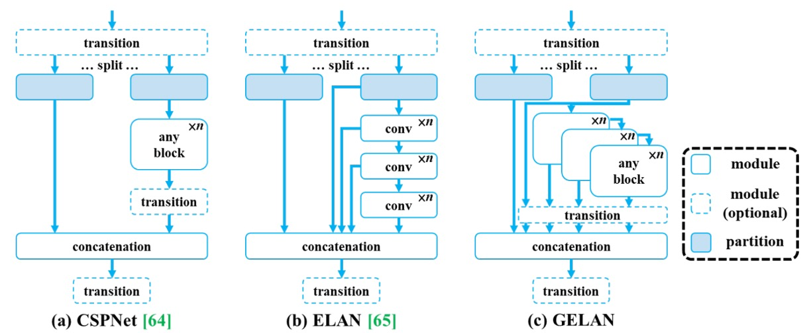
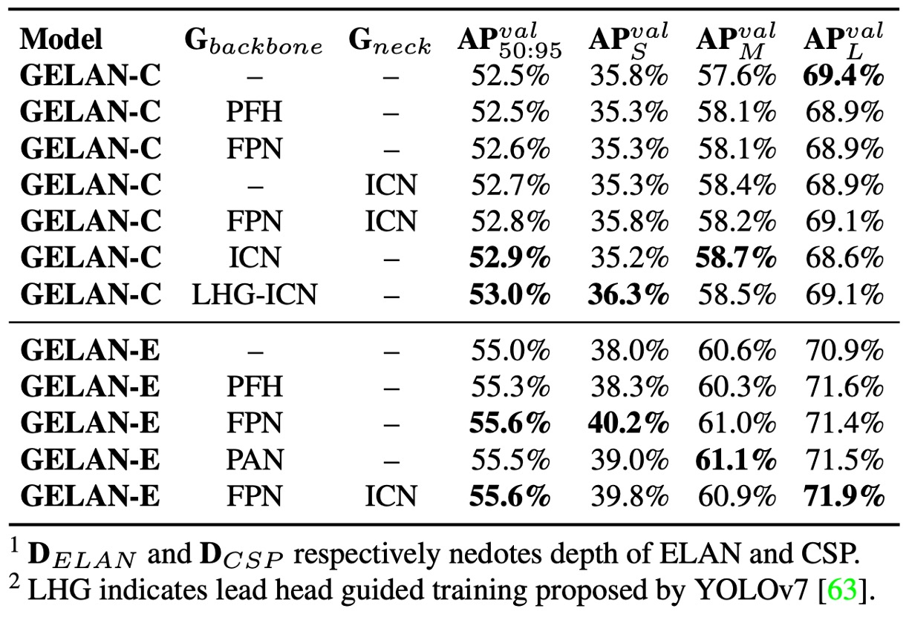

## 可控的梯度流

[**YOLOv9: Learning What You Want to Learn Using Programmable Gradient Information**](https://arxiv.org/abs/2402.13616)

---

YOLOv8 也沒有發表論文？

既然如此，我們繼續閱讀 YOLOv9 的論文吧，這篇也是臺灣中研院發表的作品。

## 定義問題

近年來，YOLO 系列已成為即時物件偵測領域的事實標準，從 YOLOv3 到 YOLOv7，其不斷進化的架構設計，在準確率與推論速度之間取得良好平衡，廣泛應用於監控、交通、AR/VR 等多種場景。

這些模型大多採用 CSPNet 或 ELAN 為主幹模組，輔以 PAN/FPN 做特徵融合，並搭配 YOLO head 或 FCOS head 進行多尺度預測。即便是如 RT-DETR 等新興 Transformer 架構，也尚未能在效率與部署面真正超越 YOLO 系列。

然而，隨著模型日益複雜，研究者逐漸發現：影響收斂品質的問題並非僅來自架構設計或損失函數選擇，更深層的瓶頸其實藏在資訊傳遞路徑中。

> **現代深度神經網路的真正挑戰，在於訓練過程中的資訊流失（Information Bottleneck）。**

當輸入資料逐層通過深層網路時，原始語意訊息經多次壓縮與變換，往往早在中間層便已被稀釋甚至遺失。這種語意退化現象導致模型後段所獲得的特徵難以與目標建立正確關聯，進一步產生不可靠的梯度，造成收斂緩慢、精度低落，甚至無法有效訓練。

雖然業界已嘗試提出三大技術路徑來應對此問題：

- **可逆式架構**：透過設計反向還原函數，使每層操作後仍能保有輸入的完整資訊。代表作如 RevNet 或 Res2Net，理論上可避免訊息遺失，但其複雜的結構與額外計算成本，限制了推論效率。
- **遮罩建模（Masked Modeling）**：如 MAE 或 BERT 所採用的策略，讓模型透過重建遮罩區域來學會關鍵語意。但這類方法多半設計於大型 Transformer 架構中，當應用於輕量模型時，常因參數不足而無法穩定還原語意。
- **深層監督（Deep Supervision）**：於中間層插入輔助監督信號，引導模型維持語意一致性。此策略可提升學習穩定度，但也容易導致錯誤訊息的層層累積，且實際上僅對極深網路有效，對小模型反而傷害更大。

上述技術雖各有所長，但皆無法同時滿足「資訊保留」與「輕量高效」的需求，尤其對參數受限的即時應用模型而言，資訊瓶頸仍是一大障礙。

:::tip
**什麼是「可逆式架構」？**

可逆式架構（Reversible Architecture）是一種在設計神經網路時，保證前向傳遞過程不會遺失資訊的架構。也就是說，如果你知道某一層的輸出，你可以完全還原出它的輸入。

詳細設計理念可以參考這篇論文：

- [**[22.12] Reversible Column Networks**](https://arxiv.org/abs/2212.11696)
  :::

### 語意資訊為何遺失？

傳統上，人們將模型收斂困難歸因於「梯度消失」或「梯度飽和」，但這些問題已隨著 BatchNorm、ReLU 等技術大幅緩解。真正的問題，是「生成梯度所依據的語意訊息本身已不再存在」。

根據 **資訊瓶頸原理**，資料在每層網路中轉換後，其與目標任務的互資訊會遞減：

$$
I(X, X) \geq I(Y, X) \geq I(Y, f_θ(X)) \geq \dots \geq I(Y, \hat{Y})
$$

其中，$I(Y, X)$ 表示輸入資料中與目標任務相關的語意訊息。

若該段資訊在前向傳遞過程中遭到稀釋，即使總體訊息損失不多，模型也將無法學到真正有用的目標映射。這現象在**輕量模型中特別明顯**，因為其參數本就不足以支撐完整特徵表示，讓語意信號更容易被壓縮抹除。

雖可嘗試擴大模型容量以改善，但這種「以寬代深」的方式僅能緩解症狀，卻無法根治語意損失與梯度品質惡化的問題。

### 可逆函數的可能性

可逆函數提供一種理論解法。

若某個轉換函數 $r_ψ$ 存在反函數 $v_ζ$，且滿足：

$$
X = v_ζ(r_ψ(X)),\quad I(X, X) = I(X, r_ψ(X)) = I(X, v_ζ(r_ψ(X)))
$$

則代表該轉換過程未遺失任何資訊，可用來保證語意信號完整流通。

但在實作上，多數可逆架構仍面臨複雜性高、學習不穩定、無法泛用等問題，難以真正部署於即時任務中。

因此，我們需要一種嶄新的方式，不僅能保留關鍵語意、提升梯度可靠性，還要具備：

- **適用於輕量化架構**
- **無需額外推論成本**
- **可彈性搭配任務損失與結構模組**

綜合以上需求，本文作者提出了一個嶄新的概念來解決資訊瓶頸問題：

> **Programmable Gradient Information（PGI）**。

我們接著看下去。

## 解決問題

<figure style={{ "width": "90%"}}>

</figure>

在解決資訊瓶頸與梯度品質退化問題上，作者提出一種嶄新的訓練架構：**可編程梯度資訊（Programmable Gradient Information, PGI）**。

如上圖所示，這個架構從多個過去方法中吸取經驗（如 PAN、RevCol、Deep Supervision），進而設計出一套能夠在**訓練階段補足語意遺失、在推論階段零成本部署**的訓練策略。

### 設計理念

PGI 由三個關鍵元件構成：

1. **主幹分支（Main Branch）**

   - 原始模型架構，負責推論。
   - 實際部署時只保留這一部分，維持推論效能不變。

2. **可逆輔助分支（Auxiliary Reversible Branch）**

   - 在訓練階段提供額外梯度，彌補主幹經資訊瓶頸後所失落的語意特徵。

3. **多層次語意整合（Multi-level Auxiliary Information）**
   - 將來自不同尺度預測頭的監督訊號進行整合與重組，使主幹學習具備全局語意的一致梯度。

在上圖 (b) 中，像 RevCol 這樣的可逆架構雖能保留資訊完整性，但會顯著增加推論延遲。作者觀察到：**與其讓主幹變可逆，不如在訓練階段引入可逆輔助分支即可**。

上圖 (d) 就展示了這種設計。

在訓練階段，這條輔助分支會模擬輸入資料的完整語意路徑，為主幹提供清晰可靠的梯度訊號。即便主幹特徵已被壓縮或稀釋，仍能從輔助分支中獲得正確修正。

### 多層次語意整合

傳統的深層監督，如上圖 (c)，會將每層特徵分配到不同任務（如小物件、大物件偵測），這會導致語意矛盾。例如：某層為小物件而忽略大物件，會讓主幹特徵錯誤視重要區域為背景，訓練訊號因此失真。

為了解決這個問題，PGI 提出 **多層次語意整合模組（Multi-level Auxiliary Information）**，在預測分支回傳梯度前，先由一個語意融合網路進行整合，再統一傳給主幹。

這樣設計的好處是：

- 各層特徵都能學習完整語意，而非只對應某單一物件尺度。
- 消除不同預測頭之間的監督衝突。
- 可自訂融合架構，彈性調整語意深度與範圍。

PGI 讓「深層監督」不再是簡單的多點損失，而是**多語意一致性的融合訓練策略**。

### Generalized ELAN

<figure style={{ "width": "90%"}}>

</figure>

為了充分發揮 PGI 框架潛力，YOLOv9 同步推出全新主幹架構：

- **Generalized ELAN（GELAN）**。

如上圖所示，其靈感來自 CSPNet 與 ELAN，其中：

- **CSPNet** 提供分支式梯度控制，提升特徵再利用率；
- **ELAN** 則透過深層卷積堆疊進行有效聚合。

GELAN 進一步**泛化 ELAN 的運算單元設計**，支援任意計算模組（如普通卷積、深度卷積、注意力模組等），可依不同平台條件進行最佳化。

其優勢包含：

- **模組化設計**：適配手機端、嵌入式設備或伺服器推論。
- **穩定梯度路徑**：結構上即內建訊號導通機制，與 PGI 高度協同。
- **輕量但高效**：即便不使用 DWConv，也能達成更高的參數利用效率。

GELAN 作為主幹網路，不僅讓 PGI 更容易發揮作用，也奠定高效、可擴展的基礎。

## 討論

為驗證所提出的 **PGI 訓練機制** 與 **GELAN 架構** 的實用性與泛化能力，作者在 MS COCO 2017 資料集上進行完整實驗，並與多項當前最佳的即時物件偵測模型進行比較。

本研究遵循 YOLOv7 的訓練規則，並採用 MS COCO 2017 的標準資料集切分。所有模型皆從零開始訓練，訓練總計 **500 個 epoch**，其中前 3 個 epoch 採用 **linear warm-up**，後續學習率則根據模型規模設計對應的衰減策略。

為穩定最終學習，在最後 15 個 epoch 停用 **Mosaic 資料增強技術**。

YOLOv9 的實作分為兩個版本：

- **YOLOv9-C / YOLOv9-E**：分別基於 YOLOv7 與 Dynamic YOLOv7 構建。
- 將原本 YOLOv7 使用的 **ELAN 模組** 替換為所提出的 **GELAN**，並在其中使用 **RepConv 與 CSPNet block** 作為計算單元。
- Downsampling 模組進行簡化、Anchor-Free 預測頭也進一步優化。
- PGI 的輔助 supervision 設定則完整沿用 YOLOv7 的架構，保留其多分支特徵學習設計。

### 與現有方法比較

實驗結果如上表，YOLOv9 在多項任務條件下，均超越了現有同級即時物件偵測模型，無論是在參數量、計算成本，或是最終準確率方面皆具優勢：

- **針對輕量模型**（如 YOLO MS-S），YOLOv9 能在維持相同準確度的情況下，**參數量減少約 10%**，**計算成本也下降 5–15%**，顯示其在邊緣運算場景的實用性。

- **針對中階模型**（YOLO MS），YOLOv9 仍保有成本優勢，並進一步在準確率上 **提升 0.4 至 0.6 個百分點的 AP**，即便總體規模更小，仍展現出更優模型效能比。

- **與主流模型 YOLOv7 AF** 相比，YOLOv9-C 所需的參數量 **減少了 42%**，計算量亦下降了 **22%**，但最終仍能達到相同的 AP（53%），突顯 PGI 對訓練品質的有效提升。

- **對比大型模型 YOLOv8-X**，YOLOv9-E 在 **參數量減少 16%**、**計算量下降 27%** 的情況下，反而**提升了 1.7% 的 AP**，充分展現高效率設計與語意導向訓練的協同效益。

這些結果顯示，YOLOv9 在**不仰賴任何預訓練模型或外部資料集的前提下**，即可在各類即時物件偵測應用中達到極具競爭力的表現，證實了 PGI 訓練機制與 GELAN 架構的實用性與推廣潛力。

### GELAN 架構分析

<figure style={{ "width": "70%"}}>

</figure>

首先，作者探討 GELAN 中計算模組的可替換性，實驗比較了三種替代模組：

- **ResNet Block**
- **DarkNet Block**
- **CSP Block**

結果顯示，即使將 ELAN 原本的卷積單元替換為這些模組，整體效能仍維持穩定，代表 GELAN 結構本身具備高度彈性與移植性。其中可以看到 **CSP Block 表現最佳**，在提升準確率 **0.7% AP** 的同時，還能降低參數與計算量。

因此，YOLOv9 最終選擇 **CSP** 作為 GELAN 的核心單元，兼顧效能與輕量化。

進一步，作者針對不同模型規模下，測試 **ELAN 模組深度**與 **CSP 堆疊深度** 對性能的影響。

<figure style={{ "width": "70%"}}>

</figure>

實驗結果如上表所示：

- 當 ELAN 深度從 1 提升至 2，模型準確率明顯提升。
- 但當深度 ≥ 2，無論是增加 ELAN 還是 CSP 的堆疊層數，效能增益與參數、計算量呈線性關係，無額外爆發性收益。

換言之，**GELAN 不需過度微調即可達穩定性能**，適合根據設備或任務靈活設計。

實作中，YOLOv9 各版本使用以下深度配置：

- YOLOv9-S：ELAN depth: 2, CSP depth: 3
- YOLOv9-M / C：ELAN depth: 2, CSP depth: 1

### PGI 訓練策略分析

<figure style={{ "width": "70%"}}>

</figure>

PGI 由兩大元件組成：可逆輔助分支與多層次語意整合。

作者針對這兩者進行獨立與聯合消融實驗，發現：

- **可逆輔助分支（ICN）** 使用 **DHLC linkage** 設計，可提供多層次的可逆資訊，能穩定提升模型表現。
- **多層次語意整合** 採用 FPN 與 PAN 進行測試，其中 PAN 類似傳統 Deep Supervision（PFH）結構，但效果僅在極深模型上明顯。
- **PGI 在所有模型大小上皆有貢獻**，且搭配 ICN 效果最穩定，顯示其設計確實能補足資訊瓶頸問題。

此外，作者也將 YOLOv7 的 **Lead-Head Guided Assignment 技術** 套用至 PGI 的輔助監督路徑中，進一步提升監督品質，最終帶來更好的學習效果。

### 模型規模比較

<figure style={{ "width": "70%"}}>

</figure>

作者將 PGI 與傳統 Deep Supervision 套用於不同模型規模，實驗發現：

- **深層監督在淺層模型中反而降低準確率**，這與過度監督導致特徵誤導有關。

在一般模型中，深層監督表現不穩，可能導致過擬合。 PGI 則可**跨規模穩定提升準確率**，特別在輕量模型上展現出顯著優勢。

這也驗證了 PGI 的兩大貢獻：

1. **將輔助監督機制成功應用於輕量／淺層模型**
2. **為深層模型訓練注入更可靠的語意梯度，提高學習效率與收斂品質**

### 整體組件整合

<figure style={{ "width": "70%"}}>

</figure>

最後，作者呈現了從 **YOLOv7 基線模型** 到 **YOLOv9-E 完整版本** 的元件疊加實驗。

逐步加入 GELAN 與 PGI 後，模型在準確率、效能與計算成本方面均有明確優化，證明這兩大設計為 YOLOv9 帶來全面性的突破。

## 結論

YOLOv9 的關鍵創新，在於將「梯度流」轉化為一種**可編程的訊息傳遞機制**。

透過 PGI，訓練不再只是被動反向傳播，而是主動規劃：

- 語意該如何流動？
- 梯度該從哪裡來？
- 目標該在哪一層學？

配合主幹架構 GELAN，YOLOv9 同時達成了高準確率、低參數量與部署彈性的三大目標。
