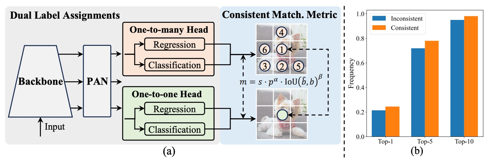
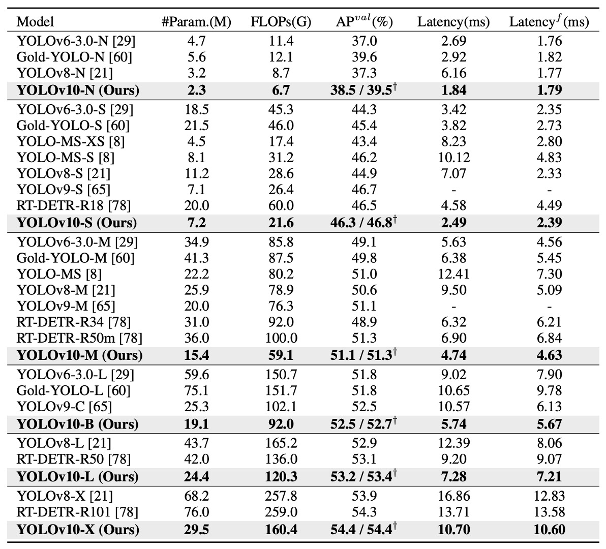
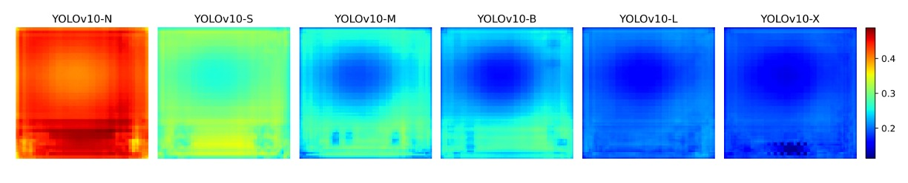

## NMS，再見

[**YOLOv10: Real-Time End-to-End Object Detection**](https://arxiv.org/abs/2405.14458)

---

我們一路看 YOLOv1 到 YOLOv9。

到了 YOLOv10，我們終於可以擺脫 NMS 的束縛了，可喜可賀。

## 定義問題

在電腦視覺領域，即時物件偵測一直扮演著不可或缺的角色。

從自駕車、工業機器人、AR/VR，到邊緣端部署的即時分析系統，幾乎所有應用都要求在極低延遲下，同時達成高準確率的目標分類與定位。為了滿足這樣的需求，研究社群持續推陳出新，各種高效偵測器如雨後春筍般湧現。

自 YOLOv1 開始，其一體化的架構將 backbone、neck、head 合而為一，顛覆了過去偵測器繁雜的設計路線。

後續版本如 YOLOv3、YOLOv4 到 YOLOv9，則透過引入 **CSPNet**、**PAN**、**ELAN**、**GD** 等模組，持續優化特徵抽取與融合能力。更有如 **YOLOv6 的 SimCSPSPPF**、**YOLOv7 的 E-ELAN**、**YOLOv9 的 GELAN + PGI** 等新技術，試圖在保持速度的前提下突破準確率瓶頸。

但不論怎麼革新，大多 YOLO 模型仍受制於後處理階段的非極大值抑制（NMS）機制。

這是由於其訓練階段採用 one-to-many 的標註方式，造成推論時須仰賴 NMS 篩選最佳候選框。這不僅拉高了延遲，也引入超參數敏感性，難以實現真正的 end-to-end 推論流程。

為了擺脫 NMS 的限制，以 DETR 為首的 End-to-End 架構開始流行。

DETR 透過 Transformer 與 Hungarian Matching 完成 one-to-one label assignment，不再依賴後處理步驟；而 Deformable-DETR、DINO、RT-DETR 等變體，也逐步優化收斂速度與運行效率。RT-DETR 更是首個成功將 DETR 推向即時應用的代表，提供了一條可能的道路。

不過，這些基於 Transformer 的設計真的能取代 CNN 嗎？

實際上，儘管 DETR 架構省略了 NMS，其前向傳遞的延遲依然明顯高於傳統 CNN 架構，尤其在邊緣設備上難以落地。另一方面，也有研究試圖讓 CNN 模型本身支援一對一對應，像是 OneNet、DeFCN、FCOSpss 等提出各自的 sample selector 或 matching 機制，期望達成 end-to-end 偵測，但成效仍未完全令人滿意。

**那麼，有沒有可能跳脫這個二元選擇？**

既不是盲目追隨 Transformer，也不侷限於舊有的 YOLO 設計，而是重新思考「訓練標註策略」與「架構效率瓶頸」這兩個關鍵？又或者，我們是否可以在保有 CNN 優勢的同時，設計出一種一致、輕量、快速又準確的新架構？

這篇論文的作者試著從根本上解決 YOLO 系列在即時物件偵測中面臨的挑戰。

## 解決問題

YOLOv10 的技術核心可分為兩條主線：

- 其一，讓 YOLO 擺脫 NMS 的束縛，邁向真正的 end-to-end 推論；
- 其二，重新衡量網路各部件的效率與精度，從結構本身重構運算分佈。

### 雙重標註架構

<figure style={{ "width": "90%"}}>

</figure>

如上圖所示，YOLOv10 維持傳統 YOLO 架構的 encoder-decoder 設計，僅於 decoder 端（即 detection head）增設一個 **one-to-one head**，與原本的 **one-to-many head** 並行運作。兩者共享相同的 backbone 與 neck，在結構上幾乎對稱。

訓練時，one-to-many head 採用 TAL（Task-Aligned Label Assignment）進行傳統的多樣本標註，對每個 ground truth 分配多個正樣本，藉此提升監督密度；one-to-one head 則僅為每個 ground truth 配對一個預測框，學習更精準的樣本對應。

這樣的設計讓模型在訓練期間同時享有密集與簡潔的監督訊號，最終於推論階段只保留 one-to-one head，捨棄 one-to-many 分支，實現真正「無需 NMS」的輸出流程。

:::tip
**等等，怎麼這個部分看了這麼眼熟？**

這不就是 H-DETR 在做的事情嗎？

- [**[22.07] H-DETR: 靜默查詢的反叛**](../2207-h-detr/index.md)

在 H-DETR 中，為了改善 DETR 基於 one-to-one 的標註方式，作者引入了 one-to-many head，讓模型能夠學習多樣化的樣本分佈。

現在看來，YOLO 和 DETR 系列從不同的方向出發，最終還是走到了一起。 🤣
:::

然而，雙重標註也衍生出一個潛在問題：兩顆 head 若採用不同的樣本匹配邏輯，所學得的監督訊號將出現偏差，導致訓練方向分歧。

為解決這個問題，作者提出了一個簡潔有效的對策：

- **一致匹配準則（Consistent Matching Metric）**。

由於兩種標註策略的本質差異來自匹配分數的定義。

YOLOv10 將這個分數統一為以下形式：

$$
m(\alpha, \beta) = s \cdot p^\alpha \cdot \text{IoU}^\beta
$$

其中：

- $p$ 為預測的分類分數；
- $\text{IoU}$ 為預測框與 ground truth 的交集比；
- $s$ 為空間先驗（spatial prior），指預測點是否落在 ground truth 內部；
- $\alpha$、$\beta$ 為超參數，用以調節分類與定位資訊的權重。

若 two heads 使用不同的 $\alpha$、$\beta$ 值，那麼同一筆樣本在兩個分支眼中會有不同的排序分數，進而產生「監督方向不一致」的問題。

作者的策略是，讓 two heads 採用相同的匹配參數，使兩邊產生的監督訊號一致。在實作上，預設設定為 $\alpha = 0.5$、$\beta = 6$。

到這邊，下一個問題就是：

> **這項調整是否真的讓兩個 head 看齊了呢？**

上圖 (b) 給出了實驗佐證。

該圖統計了 YOLOv8-S 模型中，one-to-one head 所選樣本是否也名列於 one-to-many head 的 Top-1、Top-5、Top-10 排名前段。

對比顏色代表不同設定：

- 橘色為「不一致匹配」設定：$\alpha = 0.5$、$\beta = 2$；
- 藍色為「一致匹配」設定：$\alpha = 0.5$、$\beta = 6$。

結果清楚顯示，在一致設定下，two heads 所選樣本的重疊比例顯著提高，尤其在 Top-1 對齊度上提升最為明顯，意味著 one-to-one head 能更精準地學習與 one-to-many head 相同的高品質監督訊號。

### 效率與精度優化

過去 YOLO 系列固然歷經多次模組革新，但對於整體架構的設計邏輯，仍缺乏一套系統性的檢視方法。因此，作者從全局視角出發，試圖同時優化效率與精度，讓每一單位的計算成本都能發揮其最大價值。

YOLO 架構主要可分為四個部分：

- Stem（初始卷積層）；
- Downsampling（下採樣層）；
- Stage 模組堆疊；
- Detection Head。

考量到 Stem 本身開銷極小，作者將優化重點聚焦在後三者。

1. **分類頭和回歸頭**

   分類頭與回歸頭在 YOLO 架構中通常共用相同設計，但實際分析後發現兩者成本差異巨大。以 YOLOv8-S 為例，分類頭的 FLOPs 達到 5.95G，參數量為 1.51M，是回歸頭的 2.5× 計算與 2.4× 參數。

   但根據作者的誤差敏感性分析，**分類誤差對總體 mAP 的影響遠低於回歸誤差**。因此作者將分類頭重構為兩層 3×3 的 DW 卷積，再接一層 1×1 卷積，保留基本分類能力之餘，大幅減少計算負擔。

2. **空間與通道解耦下採樣**

   傳統下採樣做法是使用 stride=2 的 3×3 卷積，這同時會進行空間降維與通道數增長。

   這看似簡潔，實則開銷不小，其計算成本為：

   $$
   \mathcal{O}\left(\tfrac{9}{2}HWC^2\right)
   $$

   參數量則為：

   $$
   \mathcal{O}(18C^2)
   $$

   作者採用一種分離式設計：先用 pointwise（1×1）卷積調整通道數，再用 depthwise（3×3）卷積執行下採樣。

   這樣的改動能將計算成本壓低至：

   $$
    \mathcal{O}\left(2HWC^2 + \tfrac{9}{2}HWC\right)
   $$

   參數量則降為：

   $$
   \mathcal{O}(2C^2 + 18C)
   $$

   並同時保留更多特徵資訊，使模型在保有精度的同時實現更快的前向傳播。

- **Rank-Guided Block 設計**

    

    <figure style={{ "width": "90%"}}>
    
    </figure>
    

  YOLOv10 是首個系統性分析 YOLO 模型內部結構冗餘程度的工作。

  作者針對每個 stage 最末卷積層的權重矩陣計算其 **數值秩（numerical rank）**，並將其正規化為 $\tfrac{r}{C_\text{out}}$，其中 $C_\text{out}$ 為該層輸出通道數，秩閾值則取最大奇異值 $\lambda_{\text{max}}$ 的一半作為門檻。

  上圖 (a) 顯示：**模型越深，冗餘越高；模型越大，秩越低**。

  這代表後段模組的參數使用效率極差，強化了「不應一體適用相同結構」的直覺。

  因此，作者引入一種新的模組設計方案：**Compact Inverted Block（CIB）**，如上圖 (b) 所示，利用 depthwise 卷積做空間混合，並用 pointwise 卷積處理通道融合，同時大幅降低計算成本。

  接著作者採用 rank-guided 的逐步替換策略：從秩最低的 stage 開始逐一替換為 CIB，若性能未下降則繼續替換下一層，否則終止。如此一來，模型可依不同規模自動調整結構深淺，達到最佳效率/精度平衡。

### 精度導向強化

除了精簡，YOLOv10 也同步強化高層語義建模和大範圍感受野上的辨識能力。

- **大卷積核：只給對位置放大感受野**

  大卷積核對於捕捉遠距訊號與結構化背景資訊相當有效，特別是在深層階段可安全使用。然而，若全模型套用大卷積核，會破壞小物件紋理，高解析層也會嚴重被拖累。

  因此，作者僅於深層的 CIB 中調整第二個 depthwise 卷積核為 7×7，並搭配重參數化技術新增一個 3×3 分支，用以解決優化不穩問題，同時於推論階段將其融合回主支路，不產生額外負擔。

  需要注意的是，作者僅於小模型（如 YOLOv10-S/N）中使用大卷積核。因為隨著模型變大，其本身感受野也會隨之擴大，大卷積核的邊際效益會遞減。

- **PSA 模組：不是所有注意力都該注意**

  自注意力雖具有強大的全局建模能力，但其計算複雜度為 $\mathcal{O}(HW^2)$，對即時模型極不友善。 為此，作者設計了 **Partial Self-Attention（PSA）** 模組。

  該模組會將特徵通道分為兩半，一半通過多頭自注意力（MHSA）與 FFN，另一半不變，最後再 concat 起來用 1×1 conv 融合。為進一步提升速度，作者採用了：

  - 半維度 Q/K；
  - 將 LayerNorm 換成 BatchNorm；
  - 僅在解析度最低的 Stage 4 後方插入。

  這種 selective self-attention 的設計，讓 YOLOv10 能以最小成本引入全局資訊，並顯著提升分類精度與語義一致性。

### 實作細節

本研究以 YOLOv8 為主要基準模型，理由有二：其一是目前已具備不錯的速度與準確率平衡，作為比較對象具代表性；其二是它公開支援多種模型尺寸，便於構建公平比較基準。

YOLOv10 承襲 YOLOv8 的尺寸劃分，包括 N / S / M / L / X 五種變體，並額外增設一個 **YOLOv10-B** 版本，其為 YOLOv10-M 的寬度擴展版，用來填補中階模型精度與容量之間的斷層。

所有模型皆在 **COCO 資料集**上進行訓練與評估，並遵循與 YOLOv8、YOLOv9 相同的 **從頭訓練設定（training from scratch）**。

推論效能則統一在 **NVIDIA T4 GPU + TensorRT FP16 模式**下進行測量，以確保延遲數據具備公允性與可比較性。

本研究所有 YOLOv10 模型皆採用 **一致雙重標註訓練策略**與**結構優化版本**，並非僅單點改動。

## 討論

### 與 SOTA 方法比較

YOLOv10 在多個層級的模型上，皆展現出顯著優勢。

如上表所示，與原始 YOLOv8 相比，在五個常見尺寸（N / S / M / L / X）下：

- AP 提升達 0.3%～ 1.4%；
- 參數數量減少 28%～ 57%；
- 計算量下降 23%～ 38%；
- 推論延遲最高降低 70%。

也就是說，在同樣甚至更少的資源條件下，YOLOv10 提供更快的速度與更高的準確率，且這個趨勢隨著模型放大仍能成立。這表示，其所採取的效率設計（如 Rank-Guided Block、PSA）不僅適用於輕量模型，在大型模型中同樣有效。

在跨模型比較方面：

- **YOLOv10-N / S** 大幅超越 YOLOv6-3.0-N / S，AP 提升 1.5 / 2.0，同時參數與運算量分別減少 50% 以上；
- **YOLOv10-B / M** 面對 YOLOv9-C 與 YOLO-MS，在維持甚至提升精度的情況下，延遲下降 46% / 62%，特別適合部署於延遲敏感環境；
- **YOLOv10-L** 相較於 Gold-YOLO-L，雖體積更小（參數少 68%、延遲低 32%），但 AP 卻還多出 1.4%。

這些結果顯示：不論是面對舊有的 YOLOv 系列，還是新一代的高效 YOLO 衍生架構，YOLOv10 都能取得更佳的效能與資源利用率。

如果我們將 YOLOv10 與非 YOLO 系列的 real-time detector 比較，表現依然亮眼。以知名的 end-to-end 架構 RT-DETR 為例：

- **YOLOv10-S** 比 RT-DETR-R18 快上 1.8 倍；
- **YOLOv10-X** 也比 RT-DETR-R101 快 1.3 倍；
- 且準確率仍能維持在相同甚至更高水平。

### 消融實驗

<figure style={{ "width": "90%"}}>

</figure>

為進一步驗證各模組的獨立貢獻，作者針對 YOLOv10-S 與 YOLOv10-M 進行完整的消融實驗，結果如上表所示。實驗依序累加三項核心設計，觀察其對延遲、參數量、計算量以及準確率的影響。

首先，在 YOLOv10-S 上，單純導入 **NMS-free 訓練機制**（即一致雙重標註策略）就可顯著**降低 4.63ms 的端到端延遲**，同時仍能保持 **44.3% AP** 的穩定準確率，證明此訓練策略在效能與精度之間取得良好平衡。

接著，進一步導入 **效率導向的架構優化策略**，在 YOLOv10-M 模型中大幅削減 **11.8M 參數與 20.8 GFLOPs**，推論延遲也同步下降 **0.65ms**。這顯示 Rank-Guided Block 與解耦式下採樣等設計確實有效減少計算冗餘。

最後，針對精度導向的模組（包括 large-kernel 卷積與 PSA 模組），其貢獻也非常明確。在 YOLOv10-S 上提升 **1.8 AP**，在 YOLOv10-M 上提升 **0.7 AP**，而對延遲的影響極小，僅增加 **0.18ms / 0.17ms**，顯示這些模組具備極高的「性能增益／成本」比。

### NMS-free 真的能完全取代傳統做法嗎？

雖然 YOLOv10 在 NMS-free 訓練下展現出優異的整體性能與極低延遲，但作者也誠實地指出：與傳統標註搭配 NMS 的訓練策略相比，目前仍存在一定程度的準確率落差。

不過，這個落差並非一成不變。

觀察發現，模型越大，兩種訓練策略之間的 AP 差距越小。在 YOLOv10-X 這種大型模型上，幾乎不存在明顯差距；但對於資源較小的 YOLOv10-N 模型來說，NMS-free 訓練下的 AP 仍比傳統訓練低約 1.0%。

那麼，這個落差是從哪裡來的？

關鍵在於 one-to-one 標註比 one-to-many 更依賴強判別性的特徵。由於每個 ground truth 僅對應一個預測樣本，模型若無法產生清晰分離的特徵 embedding，就容易在 matching 過程中選錯樣本，導致監督訊號不穩、準確率下降。

為了進一步驗證這個推論，作者繪製了下圖：

<figure style={{ "width": "90%"}}>

</figure>

分析 COCO 驗證集上每個 anchor 的特徵與其他 anchor 的平均餘弦相似度。

結果顯示：模型規模越大，anchor 特徵間的相似度越低，代表特徵空間中的分佈越分散、越具判別性，這正是 one-to-one matching 成功的基礎。

這也讓我們得出一個合理推論：

小模型因容量受限，無法學出足夠分離的特徵空間，因此較難應付 one-to-one 訓練的精確要求；而大模型特徵較具區辨性，自然能拉近與 one-to-many 訓練的性能差距。

### 為什麼精簡不會拖垮效能？

YOLOv10 的效率導向設計包含三項關鍵調整：輕量化分類頭、空間與通道解耦的下採樣、以及秩導引的模組分配策略。

實驗結果顯示，這些改動在降低參數量與計算量的同時，幾乎不會犧牲準確率。

具體來說，分類頭的簡化並未影響整體 AP，因為誤差分析發現模型的性能瓶頸主要來自回歸誤差，而非分類錯誤。下採樣方式的改進則避免了不必要的特徵流失，帶來 0.7% 的 AP 提升。至於 CIB 與 rank-guided 設計，能有效避開關鍵模組的性能損失，僅在冗餘高的 stage 替換為更輕量的結構，實現更好的資源利用。

### 精度提升，延遲卻幾乎不變？

在效率優化之後，YOLOv10 進一步導入了兩項精度導向設計：**大卷積核（large-kernel convolution）** 與 **部分自注意力（PSA）**。這些模組專為提升模型感受野與語義建模能力設計，但其引入的延遲極低，對小型模型尤為有效。

以 YOLOv10-S 為例，加入 7×7 的 large-kernel 卷積與 PSA 模組後，分別提升了 **0.4%** 和 **1.4% AP**，但延遲僅增加 **0.03ms** 和 **0.15ms**。

由於大型模型本身感受野已經足夠寬廣，large-kernel 效益有限，因此僅應用於小模型（如 YOLOv10-N / S）。

PSA 模組則比傳統 Transformer 更輕量，在 YOLOv10-S 上甚至 **比完整 MHSA 還快 0.05ms**，同時準確率還多出 0.3%。這歸功於 PSA 僅針對部分通道進行注意力建模，減少冗餘與優化難度。在注意力模塊數量設定為 1 的情況下，即可在效率與精度之間取得最佳平衡。

## 結論

YOLOv10 透過  NMS‑free  訓練流程與整體架構精簡，為即時物件偵測帶來更乾淨的推論管線與更優秀的速度與準確率折衷結果。

對開發者而言，最大的價值是**部署簡化**：少了一步 NMS、算子種類集中，模型在 TensorRT、ONNX Runtime 等主流推論框架中較易維護與優化。

不過從業界實際反饋來看，則是呈現兩種面向：

- 在雲端 GPU 或高階 Jetson Orin 上，YOLOv10‑M/B 往往能在保持 YOLOv8 同等  AP  的前提下節省 30–40 % 計算資源，適合多路串流或高並發場景；
- 在 NPU 或行動裝置上，延遲優勢視硬體對 depth‑wise 與大核卷積、PSA 等算子支援度而定，有時推論速度反而不如 YOLOv8 或 YOLOv9。

目前 NMS‑free 訓練在最小模型上仍有約 1 % AP 的差距，顯示小模型特徵判別力仍是下一步優化重點。

整體來看，考慮部署平台對於運算子的支援度，使用之前，別忘了先測試一下！
