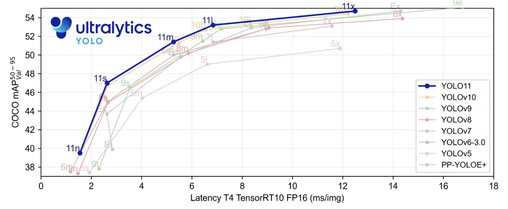

## 工程優化版

[**YOLOv11: An Overview of the Key Architectural Enhancements**](https://arxiv.org/abs/2410.17725)

---

難得 Ultralytics 發布新架構的時候會有論文。

不論如何，都應該鼓勵一下。

## 定義問題

物件偵測的舞台上，**YOLO** 這個名字已經喊了十年。

2015 年，Redmon 拿出一句口號：「**You Only Look Once**」。然後直接屏棄二階段的主流偵測架構，大刀闊斧地把偵測當成 **回歸問題**，一次性完成分類與定位。

自此之後，每一代 YOLO 都扮演著「即時偵測」的代名詞。

但是，隨著 YOLO 家族的演進，有兩個核心問題早已浮上檯面：

1. **效能與速度的兩難**： 小模型跑得快，但不準；大模型準，但跑不快。
2. **多任務的整合**：偵測、分割、姿態、旋轉框，這些需求在實務應用中同時存在，但過去的版本總是沒有辦法一起整合。

於是 Ultralytics 團隊試著把 YOLO 推進到一個 **全能型視覺系統**。

哦？有這種好事？我們一起來看看。

## 解決問題

<div align="center">
<figure style={{ "width": "90%"}}>

</figure>
</div>

YOLOv11 延續了 YOLOv9 與 YOLOv10 的設計基礎，整體架構仍然維持典型的三段式：

- **Backbone → Neck → Head**

其中，沒有徹底翻新的地方，但透過幾個局部改動，試圖在效能與效率上取得更穩定的表現。

### Backbone：小幅度的替換

- **C2f → C3k2**

  舊版常用的 C2f block 被新的 **C3k2 block** 取代。

  這個改動的目的是單純追求「**更快、更省**」：把大卷積拆成小卷積，用較小的 kernel 做運算，以減少計算量與參數量。效果上，C3k2 在不犧牲太多準確度的情況下，帶來了更好的延遲－精度比。

  :::tip
  我們把架構畫出來看看，大致上是一樣的。

  就是把堆疊的部分從原本的 Bottleneck 抽換成 C3k 模組。

    <div style={{display:'flex', gap:'2rem', flexWrap:'wrap'}}>

        <div>
            <h4 style={{textAlign:'center'}}> C2f</h4>

            ```mermaid
            %%{init: {'theme':'base','themeVariables':{
            'fontFamily':'ui-sans-serif, system-ui, -apple-system, Segoe UI, Roboto, Noto Sans, Helvetica, Arial',
            'primaryColor':'#EEF2FF','primaryTextColor':'#0f172a','primaryBorderColor':'#4338ca',
            'lineColor':'#64748b','tertiaryColor':'#F1F5F9'
            }}}%%
            %% -------- C2f：Fast Dual-Conv Bottleneck --------
            flowchart TD
                X["x<br/>C_in × H × W"]
                C1["1×1 Conv<br/>BN + Act<br/>C_in → 2h"]
                SPLIT{{split<br/>2h → h,h}}
                Y0["y0<br/>h × H × W"]
                Y1["y1<br/>h × H × W"]

                subgraph STACK["Bottleneck_f × n"]
                    direction LR
                    Z1["z₁"] --> Z2["z₂"] --> Zn["zₙ"]
                end

                CAT["Concat<br/>y0, y1, z₁…zₙ<br/>(2+n)·h"]
                C2["1×1 Conv<br/>BN + Act<br/>(2+n)·h → C_out"]
                OUT["out<br/>C_out × H × W"]

                X --> C1 --> SPLIT
                SPLIT -->|skip| Y0 --> CAT
                SPLIT -->|stack| Y1 --> Z1
                Zn --> CAT
                CAT --> C2 --> OUT

                classDef tensor fill:#ffffff,stroke:#64748b,stroke-width:1px,rx:6,ry:6;
                classDef op     fill:#eef2ff,stroke:#4338ca,stroke-width:1px,rx:6,ry:6;
                classDef fuse   fill:#ecfccb,stroke:#65a30d,stroke-width:1px,rx:6,ry:6;
                class X,Y0,Y1,Z1,Z2,Zn tensor
                class C1,SPLIT,STACK,C2 op
                class CAT fuse
            ```
        </div>

        <div>
            <h4 style={{textAlign:'center'}}> C3k2</h4>

            ```mermaid
            %%{init: {'theme':'base','themeVariables':{
            'fontFamily':'ui-sans-serif, system-ui, -apple-system, Segoe UI, Roboto, Noto Sans, Helvetica, Arial',
            'primaryColor':'#EEF2FF','primaryTextColor':'#0f172a','primaryBorderColor':'#4338ca',
            'lineColor':'#64748b','tertiaryColor':'#F1F5F9'
            }}}%%
            %% -------- C3k2：C2f 骨架 + C3k 作為內部堆疊單元 --------
            flowchart TD
                X["x<br/>C_in × H × W"]
                C1["1×1 Conv<br/>BN + Act<br/>C_in → 2h"]
                SPLIT{{split<br/>2h → h,h}}
                Y0["y0<br/>h × H × W"]
                Y1["y1<br/>h × H × W"]

                subgraph STACK["C3k × n"]
                    direction LR
                    Z1["z₁"] --> Z2["z₂"] --> Zn["zₙ"]
                end

                CAT["Concat<br/>y0, y1, z₁…zₙ<br/>(2+n)·h"]
                C2["1×1 Conv<br/>BN + Act<br/>(2+n)·h → C_out"]
                OUT["out<br/>C_out × H × W"]

                X --> C1 --> SPLIT
                SPLIT -->|skip| Y0 --> CAT
                SPLIT -->|stack| Y1 --> Z1
                Zn --> CAT
                CAT --> C2 --> OUT

                classDef tensor fill:#ffffff,stroke:#64748b,stroke-width:1px,rx:6,ry:6;
                classDef op     fill:#eef2ff,stroke:#4338ca,stroke-width:1px,rx:6,ry:6;
                classDef fuse   fill:#ecfccb,stroke:#65a30d,stroke-width:1px,rx:6,ry:6;
                class X,Y0,Y1,Z1,Z2,Zn tensor
                class C1,SPLIT,STACK,C2 op
                class CAT fuse
            ```

        </div>

    </div>
    :::

- **SPPF + C2PSA**

  在 SPPF 模組之後，多了一個 **C2PSA（Cross Stage Partial with Spatial Attention）**。

  它讓模型能稍微更關注影像的關鍵區域，對於小物件或被遮擋的物體有幫助。

  不過，這樣的注意力設計並不算新穎，更多是一種「跟進潮流」的選擇。

  ***

  :::tip
  照例，這個新的 C2PSA 模組，我們也畫個圖來看一下。

    <div style={{display:'flex', gap:'2rem', flexWrap:'wrap'}}>

    <div>
        <h4 style={{textAlign:'center'}}> C2‑PSA</h4>

        ```mermaid
        %%{init: {'theme':'base','themeVariables':{
        'fontFamily':'ui-sans-serif, system-ui, -apple-system, Segoe UI, Roboto, Noto Sans, Helvetica, Arial',
        'primaryColor':'#EEF2FF','primaryTextColor':'#0f172a','primaryBorderColor':'#4338ca',
        'lineColor':'#64748b','tertiaryColor':'#F1F5F9'
        }}}%%
        %% -------- C2‑PSA：1×1 投影 → split → PSA×n → concat → 1×1 fuse --------
        flowchart TD
            X["x<br/>C × H × W"]
            C1["1×1 Conv<br/>BN + Act<br/>C → 2h"]
            SPLIT{{split<br/>2h → h, h}}
            Y0["y0<br/>h × H × W"]
            Y1["y1<br/>h × H × W"]

            subgraph STACK["PSA × n"]
                direction LR
                P1["PSA₁"] --> P2["PSA₂"] --> Pn["PSAₙ"]
            end

            CAT["Concat<br/>2h"]
            C2["1×1 Conv<br/>BN + Act<br/>2h → C"]
            OUT["out<br/>C × H × W"]

            X --> C1 --> SPLIT
            SPLIT -->|skip| Y0 --> CAT
            SPLIT -->|stack| Y1 --> P1
            Pn --> CAT
            CAT --> C2 --> OUT

            classDef tensor fill:#ffffff,stroke:#64748b,stroke-width:1px,rx:6,ry:6;
            classDef op     fill:#eef2ff,stroke:#4338ca,stroke-width:1px,rx:6,ry:6;
            classDef fuse   fill:#ecfccb,stroke:#65a30d,stroke-width:1px,rx:6,ry:6;
            class X,Y0,Y1,P1,P2,Pn tensor
            class C1,SPLIT,STACK,C2 op
            class CAT fuse
        ```

    </div>

    <div>
        <h4 style={{textAlign:'center'}}> PSA（Position‑Sensitive Attention）</h4>

        ```mermaid
        %%{init: {'theme':'base','themeVariables':{
        'fontFamily':'ui-sans-serif, system-ui, -apple-system, Segoe UI, Roboto, Noto Sans, Helvetica, Arial',
        'primaryColor':'#EEF2FF','primaryTextColor':'#0f172a','primaryBorderColor':'#4338ca',
        'lineColor':'#64748b','tertiaryColor':'#F1F5F9'
        }}}%%
        %% -------- PSA：MHSA → Add(res, 可選) → FFN → Add(res, 可選) --------
        flowchart TD
            U["u<br/>h × H × W"]
            MHSA["MHSA（ConvAttention）<br/>QKV → Attn → PE → Proj"]
            ADD1["Add"]
            FFN["FFN<br/>1×1 Conv + Act → 1×1 Conv (no Act)"]
            ADD2["Add"]
            Z["z（輸出）<br/>h × H × W"]

            U --> MHSA --> ADD1 --> FFN --> ADD2 --> Z
            U -->|skip| ADD1
            ADD1 -->|skip| ADD2

            classDef tensor fill:#ffffff,stroke:#64748b,stroke-width:1px,rx:6,ry:6;
            classDef op     fill:#eef2ff,stroke:#4338ca,stroke-width:1px,rx:6,ry:6;
            classDef fuse   fill:#ecfccb,stroke:#65a30d,stroke-width:1px,rx:6,ry:6;
            class U,Z tensor
            class MHSA,FFN op
            class ADD1,ADD2 fuse
        ```

    </div>

    <div>
        <h4 style={{textAlign:'center'}}> ConvAttention（PSA 內部 MHSA 細節）</h4>

        ```mermaid
        %%{init: {'theme':'base','themeVariables':{
        'fontFamily':'ui-sans-serif, system-ui, -apple-system, Segoe UI, Roboto, Noto Sans, Helvetica, Arial',
        'primaryColor':'#EEF2FF','primaryTextColor':'#0f172a','primaryBorderColor':'#4338ca',
        'lineColor':'#64748b','tertiaryColor':'#F1F5F9'
        }}}%%
        %% -------- ConvAttention：QKV 投影 → 注意力 → 位置編碼 → 輸出投影 --------
        flowchart TD
            X2["x<br/>C x H x W"]
            QKV["1x1 Conv (QKV proj)<br/>no Act"]
            SPLITQKV{{split<br/>Q: H*d_k<br/>K: H*d_k<br/>V: H*d_v}}
            ATTN["Scaled Dot-Product<br/>softmax( transpose(Q) * K / sqrt(d_k) )"]
            WSUM["Weighted Sum<br/>V * Attn^T"]
            RESHAPE["Reshape<br/>B x C x H x W"]
            PE["3x3 Depth-wise Conv<br/>Positional Enc. (no Act)"]
            ADDPE["Add<br/>positional enc."]
            PROJ["1x1 Conv (output proj)<br/>no Act"]
            Y2["y<br/>C x H x W"]

            X2 --> QKV --> SPLITQKV
            SPLITQKV -->|Q| ATTN
            SPLITQKV -->|K| ATTN
            SPLITQKV -->|V| WSUM
            ATTN --> WSUM --> RESHAPE --> ADDPE --> PROJ --> Y2
            SPLITQKV -->|V| PE --> ADDPE

            classDef tensor fill:#ffffff,stroke:#64748b,stroke-width:1px,rx:6,ry:6;
            classDef op     fill:#eef2ff,stroke:#4338ca,stroke-width:1px,rx:6,ry:6;
            classDef fuse   fill:#ecfccb,stroke:#65a30d,stroke-width:1px,rx:6,ry:6;
            class X2,Y2 tensor
            class QKV,ATTN,WSUM,RESHAPE,PE,PROJ op
            class SPLITQKV op
            class ADDPE fuse
        ```

    </div>

    </div>
    :::

### Neck：特徵融合的小修正

Neck 的任務仍然是把不同解析度的特徵拉到一起。

這裡 YOLOv11 同樣換上 **C3k2 block**，同時搭配 C2PSA，讓融合過程在效率上稍微優化。

整體來說，這部分的改動讓 YOLOv11 在 **速度－準確度曲線** 上比 v8、v9 更好看一些。

### Head：輸出層的延伸

在 Head 部分，YOLOv11 沒有大改結構，只是持續套用 **C3k2 block** 與 **CBS（Conv-BN-SiLU）**，最後輸出邊界框、物件性分數與分類結果。

### 多任務的整合

YOLOv11 相較於過去版本，最明顯的改變並不是在偵測架構本身，而是它被正式定位為一個「多任務框架」。

如下表所示：

<div align="center">
<figure style={{ "width": "90%"}}>

</figure>
</div>

除了標準的物件偵測之外，Ultralytics 將 分割（segmentation）、姿態估計（pose）、旋轉框（OBB）、分類（classification） 都納入同一套系統，並提供相同的推論、驗證、訓練與匯出介面。

在實際應用上，這樣的整合具有一定意義。對於研究人員或產業開發者而言，過去往往需要依賴不同的工具鏈或分散的實作來處理偵測、分割、姿態等任務，如今可以透過 YOLOv11 的統一版本完成。

不過要注意的地方是 YOLOv11 並非在每個任務上都有領先的精度，更多時候是維持「可用且一致」的水準。

換句話說，它的優勢並不是單一任務的尖端性能，而是把多種電腦視覺需求收斂到同一個入口，形成一個相對穩定的多任務生態。這樣的定位也符合 Ultralytics 的產品策略，也讓 YOLO 系列在實務端可以覆蓋到更廣的應用場景。

## 討論

<div align="center">
<figure style={{ "width": "90%"}}>

</figure>
</div>

從官方的 benchmark 來看，YOLOv11 在速度與精度曲線上確實比前幾代更整齊一些。

不同尺寸的模型（n、s、m、x）在 COCO 上都取得了比 YOLOv8、YOLOv9、YOLOv10 略高的 mAP，同時維持相對較低的延遲。尤其是 YOLOv11m，在精度接近 YOLOv8l 的情況下，參數量與運算量都更低，顯示出這一代在「效率優化」上確實下了一些功夫。

在高延遲區間，大模型如 YOLOv11x 可以達到約 54.5% mAP@50–95，推理時間維持在 13ms 左右；而在低延遲區間，小模型如 YOLOv11s 能在 2–6ms 的範圍內仍維持約 47% mAP。這種分布讓 YOLOv11 在即時應用的不同需求下，都能找到合適的規模版本，算是一種實用上的便利。

### 結論

看完這篇論文，我們認為 YOLOv11 的貢獻更多體現在工程層面的微調，而非方法論上的突破。

它在 backbone、neck 與 head 全面換上 C3k2 模組，確實帶來了更好的參數效率與推理速度，也在低延遲場景下取得了不錯的表現。但這樣的改動並沒有改變 YOLO 的基本範式，就只是對現有設計的優化。

照理講，這種提升的幅度並不足以支撐「下一代架構」的定位......

不過誰知道呢，反正它是發版了，我們就接受了吧。
