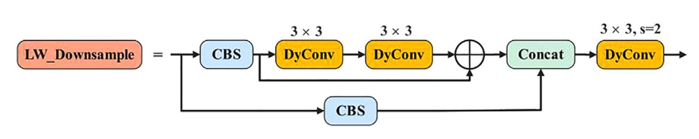
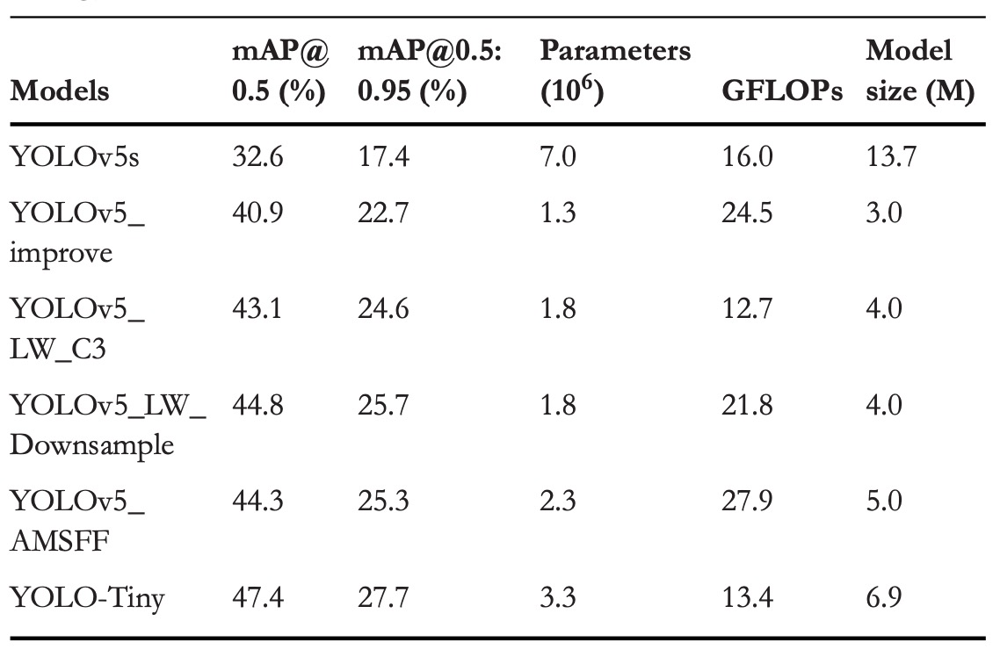
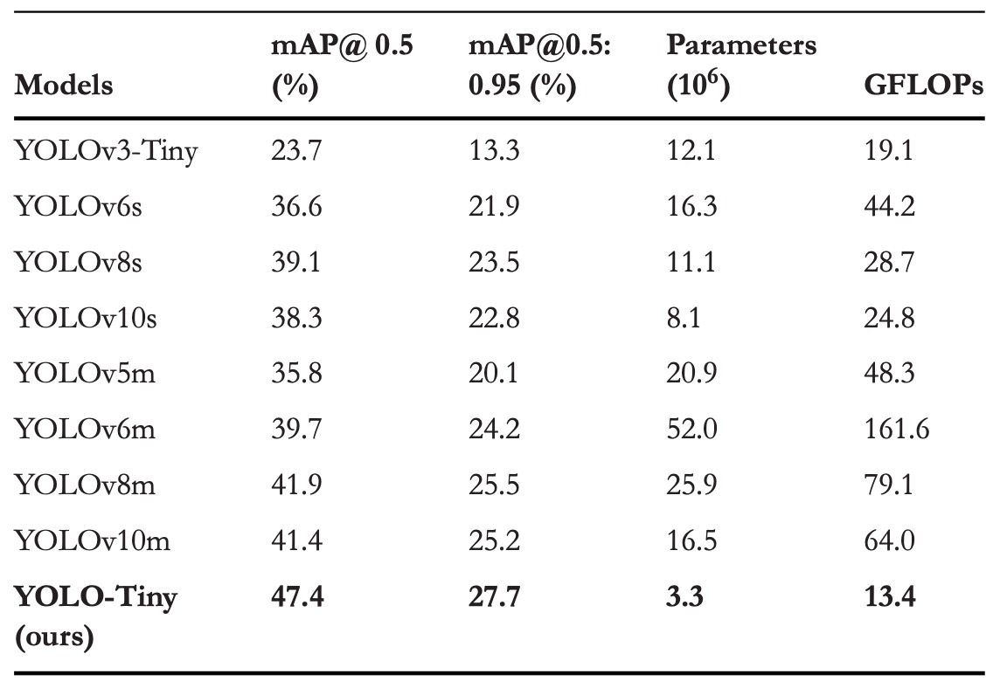

## 我是一隻小小鳥

[**YOLO-Tiny: A lightweight small object detection algorithm for UAV aerial imagery**](https://ietresearch.onlinelibrary.wiley.com/doi/pdfdirect/10.1049/ipr2.13314)

---

無人機已悄然飛入我們生活的各個縫隙。

但對於物件偵測的演算法來說，這個機器帶來的問題真是煩死人了。

## 定義問題

無人機已經深入日常場景的每一個空隙，從空拍巡檢到災害偵測，它所帶來的大量影像也對物件偵測演算法提出了新的挑戰。

對模型而言，無人機所拍攝的「天空視角」充滿了不友善的條件：畫面中目標尺寸極小、比例不一，還常常被背景干擾或部分遮蔽，進一步壓縮了有效特徵的辨識空間。同時，部署場景通常伴隨極端的資源限制，讓高效能模型即使準確也難以實際運作。

當前主流的目標偵測方法雖然在性能上已趨成熟，尤其以 YOLO 系列為代表的單階段演算法，更因其速度優勢成為實時應用首選，但原始架構仍難以直接應對高空拍攝與小物體偵測的雙重需求。

在過去的改良中，有人試圖透過更換卷積模組、添加金字塔結構、引入注意力機制或進行跨層融合，來提升小物體辨識的效果；也有人將目光轉向資料增強、候選框預設與尺度調整等訓練環節。

但大多方法仍無法解決一個根本問題：要在小算力的終端設備上，做到即時、準確、穩定地辨識畫面中那一點點微小的可疑目標，並不只是「壓縮模型」這麼簡單。

這篇論文正是針對這個問題出發，以 YOLOv5s 為基礎，提出一套針對 UAV 空拍任務所設計的輕量化小物體偵測架構。

## 解決問題

### 回顧 YOLOv5

在 YOLOv5 的骨幹結構中，輸入影像經過五次下採樣後，會產生五組不同解析度的特徵圖（P1 至 P5），尺寸依序為 320、160、80、40、20。這種金字塔式的特徵圖設計，使得模型能夠針對不同大小的物體，對應到不同層級進行預測。

其中，YOLOv5 的標準偵測結構是從 P3（80×80）到 P5（20×20）進行多尺度融合，主要鎖定 8×8 像素以上的物體。

但對無人機來說，這個尺寸下的門檻顯然過高。

VisDrone2019 資料集的統計圖給出了關鍵觀察：

<figure style={{ "width": "70%"}}>

</figure>

- 上圖 (a) 表示：目標數量嚴重失衡，
- 上圖 (b) 表示：多數目標落在極小尺寸範圍，
- 上圖 (c) 表示：邊框長寬比例高度集中，
- 上圖 (d) 表示：中下區域為標註密集熱區。

換句話說，這是一個「**高度偏向小物體的空拍任務**」，而 YOLOv5 現行設計在此條件下存在結構性偏差：預測層主要聚焦在 P3–P5，正是對極小目標最不友善的位置。

過去已有研究嘗試於 YOLOv5 增設 P2 偵測頭（即 160×160 特徵圖）以捕捉更細微的訊號，雖然偵測力有所提升，卻也讓參數量與運算量同步飆升，對於資源有限的終端裝置而言，代價太高。

有另外一部分研究者選擇另一條路：移除 P5 層，將關注焦點回收至中小型物體。但這樣的簡化策略，準確率改善有限，未能真正突破瓶頸。

在這篇論文中，作者延續這條結構調整線，進一步**移除 P4 層**，將原先的三重偵測結構，壓縮為 P2 與 P3 的雙層架構，集中火力於更早期、更高解析的特徵圖。

但這同時也帶來另一個風險：

> **P4 + P5 層加總佔了 YOLOv5s 模型總參數的 92.1%。**

一旦這部分被移除，整體模型參數將近乎腰斬，偵測能力也會隨之下降。

為了避免這種「輕量化過頭」的問題，作者採用一種抵換策略：

- **在保留 P2 與 P3 的前提下，適度增加模型的深度與寬度**

讓特徵抽取與融合能力維持在可接受水平。

在實際權衡後，作者選擇了 **depth = 0.67, width = 0.75** 的配置，作為兼顧參數量與運算成本的折衷解。這樣的選擇不僅讓模型保有足夠的表達能力，也將 GFLOPs 控制在資源限制內，為後續模組輕量化鋪下基礎。

### 模組輕量化

在模型設計中，參數數量、計算成本（GFLOPs）與表達能力三者之間存在明顯張力，這種張力尤其在無人機這類邊緣裝置中顯得劇烈，我們既又希望表達得夠強，又不能參數太多。

先前在結構調整中，作者透過刪減 P4 與 P5 偵測頭，使參數量下降了 **82.05%**，使模型的「表達空間」也隨之萎縮。

為了補回這段損失，作者適度增加了深度與寬度，使參數略微回升、表達力得以恢復，但也導致 GFLOPs 從 **16.0 增長至 24.2**，成長了 **53.13%**。如果再繼續擴增，計算成本將呈指數式上升，明顯不適用於資源受限的場域。

為了解決這個矛盾，作者引入一種高效率的架構單元：

- **動態卷積（Dynamic Convolution）**。

YOLOv5 中最核心的特徵擷取模組之一，是 C3 結構，內含大量的殘差路徑與卷積堆疊。

作者將其全面替換為新設計的 **LW_C3**，其關鍵變化如下：

- **LW_C3**：將所有殘差支路中的 **3×3 常規卷積**替換為**3×3 動態卷積**，保留結構深度，同時降低靜態運算負擔。

    

    <figure style={{ "width": "90%"}}>
    
    </figure>
    

- **LW_Downsample**：針對原先採用 1×1 卷積進行通道壓縮與下採樣的模組，也全面改用 stride=2 的動態卷積，強化表達力與感受野控制。

    

    <figure style={{ "width": "90%"}}>
    
    </figure>
    

動態卷積的核心精神，與動態感知機（Dynamic Perceptron）類似：

> **根據每個輸入 **x**，在一組基底函數中動態選擇最合適的權重組合。**

如下示意圖：

<figure style={{ "width": "70%"}}>

</figure>

數學上，它可以寫作：

$$
y = g(W̃(x)^T x + b̃(x))
$$

其中

$$
W̃(x) = \sum_{k=1}^K \pi_k(x) W̃_k,\quad
b̃(x) = \sum_{k=1}^K \pi_k(x) b̃_k
$$

並滿足

$$
0 \leq \pi_k(x) \leq 1,\quad \sum_k \pi_k(x) = 1
$$

這裡的 $\pi_k(x)$ 就是每個輸入對第 $k$ 個卷積核的**注意力權重**。

本質上，我們不是學一組權重，而是學一個「選擇」的機制，讓模型根據輸入內容，自行決定該偏向哪一種特徵擷取策略。

為了實現這套選擇機制，作者採用常見的 SE 技術生成注意力權重，步驟如下：

1. **Global Average Pooling** 壓縮空間資訊
2. 經過全連接層 + Sigmoid，生成 k 維權重向量 $\pi(x)$
3. 權重套用在 k 組預定義的卷積核上，完成動態加權卷積

對於輸入通道 $C_{\text{in}}$、輸出通道 $C_{\text{out}}$、核大小 $D_k \times D_k$、kernel 數量 k，該模組的計算量為：

$$
O_{\text{dynamic}} = KC_{\text{in}}C_{\text{out}}D_k^2 + KC_{\text{out}}
$$

相較於標準卷積的

$$
O_{\text{static}} = HWC_{\text{in}}C_{\text{out}}D_k^2
$$

其運算量大幅下降，尤其當圖像解析度 H×W 較大時，差距更為明顯。

引入動態卷積後，模型得以在參數數量提升的同時，將 GFLOPs 成本控制在局部可接受範圍。

更重要的是，這種設計讓每個特徵點的感知方式**不再統一**，而是根據輸入語境作出微調，這也讓 YOLOv5 的特徵提取模組首次具備了語意適應性，這種微調的能力，在小物體偵測上更為關鍵。

### 多尺度自適應融合

在目標偵測中，**多尺度特徵融合**已是提升模型辨識力的基本操作，淺層網路擅長保留紋理與位置信息，深層網路則著重語意抽象與目標判斷。

理論上，將二者融合，應能兼顧「看清楚」與「看懂了」。但這種融合並不容易：尺度差異帶來語意斷層，簡單的拼接或加權，往往無法真正「整合」，只能「堆疊」。

為此，作者提出的 **AMSFF（Adaptive Multi-Scale Spatial Feature Fusion）模組**，即是為了解決這種融合失效問題所設計。

參考下圖架構：

<figure style={{ "width": "90%"}}>

</figure>

AMSFF 模組的運作邏輯如下，以 neck 部分的 **L2**（較淺層）與 **L3**（較深層）特徵為例：

1.  **對齊尺度**：L2 特徵先經下採樣，使空間解析度與 L3 一致。
2.  **通道調整**：接著透過 1×1 卷積，使 L2 的通道數與 L3 對齊，確保後續可進行逐元素操作。
3.  **初步融合**：將調整過的 L2 與 L3 進行串接（concat），形成基礎融合張量。
4.  **權重學習**：經 1×1 卷積，計算出兩組權重參數 $\alpha_{i,j}$ 與 $\beta_{i,j}$，作為兩層特徵的空間適應性權重，並通過 Softmax 保證其和為 1，且值落在 \[0, 1] 之間。
5.  **加權融合**：以這兩組空間對應權重進行加權求和，計算公式如下：

        $$
        y^l_{i,j} = \alpha^l_{i,j} \cdot x^{(1 \to l)}_{i,j} + \beta^l_{i,j} \cdot x^{(2 \to l)}_{i,j}
        $$

        其中 $x^{(n \to l)}_{i,j}$ 表示第 n 層經過尺度對齊後對應到第 l 層位置 $(i,j)$ 的特徵向量，$y^l_{i,j}$ 為融合後的新特徵圖。

6.  **語意擴展**：為了擴展感受野，AMSFF 採用兩個 3×3 動態卷積，dilation rate 分別為 1 與 2，強化不同語境下的尺度適應能力。
7.  **整合輸出**：最後透過一層 1×1 CBS 模組，完成融合結構的封裝與輸出，作為後續偵測頭的輸入。

與過去的融合方法（如 FPN、PAN、BiFPN）相比，AMSFF 的差異不只是加入了注意力機制，而是將融合本身視為一種「動態關係建構」。

### 實驗設計

本研究使用的實驗資料集為 **VisDrone2019**，由天津大學機器學習與資料挖掘實驗室釋出。

該資料集由無人機於各種天氣與光照條件下所拍攝，涵蓋城市、郊區、停車場與道路等多樣場景，特別適用於測試模型在小物體和複雜背景條件下的辨識能力。

VisDrone2019 共有十個目標類別，總計 **10,209 張影像**，其中：

- 訓練集：6,471 張
- 驗證集：548 張
- 測試集：3,190 張

資料分佈具有以下特徵：

- **場景多樣性高**：從靜態擺拍到運動追蹤皆有涵蓋；
- **物體尺寸偏小**：大多數標註框面積低於 32×32；
- **遮擋與光線變化明顯**：對模型泛化能力構成挑戰。

下圖顯示了來自四種不同場景的樣本影像與標註框：

實驗採用標準 YOLO 訓練流程，環境設定與超參數配置如下表所列：

<figure style={{ "width": "70%"}}>

</figure>

## 討論

### 網路架構調整對比實驗

<figure style={{ "width": "60%"}}>

</figure>

為評估各層偵測頭對小物體辨識的影響，本研究設計了 **六組不同架構組合**，並在相同訓練條件下進行對比實驗。具體結構變化如上表所示，對應的性能結果如下表：

<figure style={{ "width": "70%"}}>

</figure>

實驗結果可以看出幾個關鍵現象：

1. **加入 P2 偵測頭**

   在原本的 YOLOv5s 架構上**新增 P2 層（解析度為 160×160）**，模型在 VisDrone2019 資料集上的表現明顯提升：

   - **mAP\@0.5 提升 +5.5%**
   - **mAP\@0.5:0.95 提升 +4.1%**

   這代表模型獲得了更高解析度的特徵對應能力，能夠更早期地注意到畫面中的微小目標。雖然參數量與 GFLOPs 略有增加，但整體成本仍可接受。

2. **移除 P5 偵測頭**

   另一組實驗為**移除 P5（20×20）層**，目的是削減與大型物體相關的參數與運算，集中資源於中小尺度的辨識：

   - mAP\@0.5 微幅增加 **+0.5%**
   - mAP\@0.5:0.95 輕微下降 **−0.1%**

   此舉雖大幅降低參數量，卻也顯示出「單純移除深層特徵，提升幅度有限」，甚至可能在泛化能力上略為受損。

3. **同步移除 P4 + P5，並放大模型寬深度**

   最終版本則同時移除了 **P5 與 P4**，並將模型深度從 0.33 增至 0.67、寬度由 0.5 擴張至 0.75，以彌補過度裁剪所導致的表達能力削弱。

   這一版本的結果最為顯著：

   - **mAP\@0.5 總提升 +8.3%**
   - **mAP\@0.5:0.95 提升 +5.3%**

   這說明 P4 與 P5 雖為深層語意路徑，但對小物體偵測貢獻極少，反而因下採樣率過高（16×、32×）導致訊號嚴重流失。此外，適度增加網路容量（而非單純壓縮），可維持語意抽取的完整性，**讓模型以更適合的「語境解析力」回應微小目標。**

這組對比實驗說明，面對空拍小物體的辨識任務，關鍵不在於「更多的路徑」或「更深的特徵」，而是找出那些能真正看見小東西的節點，並給它足夠的容量去發揮作用。

### 消融實驗

<figure style={{ "width": "60%"}}>

</figure>

為驗證三項優化策略在不同組合下的獨立與整體貢獻，作者設計了一組消融實驗，於 VisDrone2019 上進行測試。

具體的優化組合如上表所示，性能結果彙整於下表：

<figure style={{ "width": "70%"}}>

</figure>

這些結果可以看出每個模組的貢獻：

1. **結構優化**

   - mAP\@0.5 +8.3%
   - mAP\@0.5:0.95 +5.3%
   - 參數數量比原 YOLOv5s 減少 81.4%
   - GFLOPs 上升 53.1%

   將 P4 與 P5 兩層（共佔 92.1% 模型參數）移除，讓模型從淺層特徵（P2, P3）直接進行偵測。省略不必要的深層特徵，讓模型的關注點從宏觀語意，轉向微觀細節。

   為避免參數不足導致模型退化，作者同步提高網路深度（0.33→0.67）與寬度（0.5→0.75），保留一定的抽象能力。

2. **模組輕量化**

   - LW_C3：

     - mAP\@0.5 +2.2%
     - mAP\@0.5:0.95 +1.9%
     - GFLOPs 降低 48.2%

   - LW_Downsample：

     - mAP\@0.5 +3.9%
     - mAP\@0.5:0.95 +3.0%
     - GFLOPs 降低 11.0%

   這兩個模組雖然都增加了約 **38.5% 參數**，但 GFLOPs 明顯下降。這是因為動態卷積能夠提升表達能力的同時壓縮靜態運算量。

3. **AMSFF**

   - mAP\@0.5 +3.4%
   - mAP\@0.5:0.95 +2.6%

   AMSFF 解決的是模型在多尺度特徵間的「對話失衡」問題，透過空間自適應權重學習，使淺層的細節與深層的語意得以合理分工。這對於小物體偵測特別關鍵，因為其語意信號本就微弱，若融合出錯，即會被放大為預測失誤。

### 和其他 YOLO 比較

<figure style={{ "width": "70%"}}>

</figure>

YOLO 系列一直是目標偵測領域的代名詞，它以端到端、極速推論的特性受到廣泛關注，從 YOLOv3 的多尺度預測與 Darknet-53 架構開始，到 YOLOv8 將梯度訊流導入特徵分支、YOLOv10 甚至直接拿掉非極大值抑制（NMS），每一代都有對準確率與效率的追求。

作者這裡針對目前主流 YOLO 模型中較小的版本進行對比，實驗結果顯示 YOLO-Tiny 這個模型在參數量與計算量大幅下降的前提下，卻依然交出了亮眼的準確率成績。

在 mAP\@0.5 上分別比 YOLOv3-Tiny、YOLOv6s、YOLOv8s、YOLOv10s 提升了 23.7%、10.8%、8.3%、9.1%；mAP\@0.5:0.95 的提升則為 14.4%、5.8%、4.2%、4.9%。同時，它也節省了 60% 到 80% 不等的參數量，與 30% 到 70% 的 GFLOPs。

### 可視化展示

最左邊是原圖，中間是 YOLOv5s，最右邊是 YOLO-Tiny。

## 結論

面對無人機空拍下的極小目標與終端算力受限的部署條件，YOLO-Tiny 所提出的結構調整與模組設計，提供了一種具體可行的技術思路。

在過去的輕量化架構中，模型往往需要在速度與精度之間做出明確犧牲，特別是在 VisDrone 這類場景中，小物件特徵容易被多層下採樣稀釋，造成偵測準確率遲滯難升。

本研究透過刪減 P5、P4 等大物件偵測層，將網路焦點重置於 P3、P2 的小尺度範圍，搭配動態卷積與 AMSFF 模組進行訊號壓縮與特徵融合，企圖在不增加運算負擔的前提下，提升對小物件的辨識能力。

從實驗結果來看，這樣的策略確實在 VisDrone2019 上帶來顯著的 mAP 提升，並在模型參數與 GFLOPs 上保持優勢，說明其對小物件結構的設計具有一定針對性。

不過考慮到目前發表時間尚新，作者沒有公開訓練模組，相關模型尚未經歷公開實務部署與社群驗證，其實際效能與可泛化性仍有待後續觀察。
