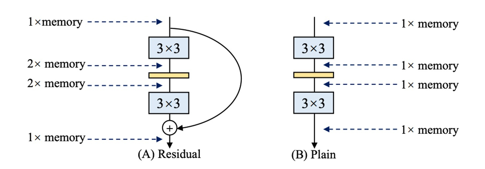
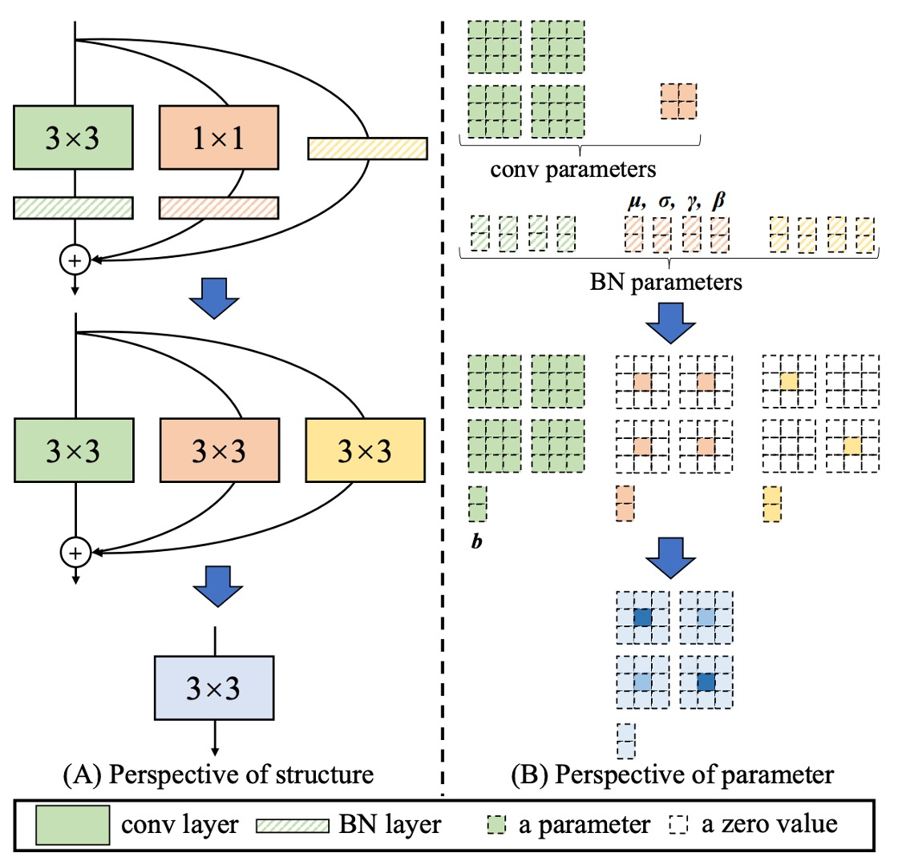
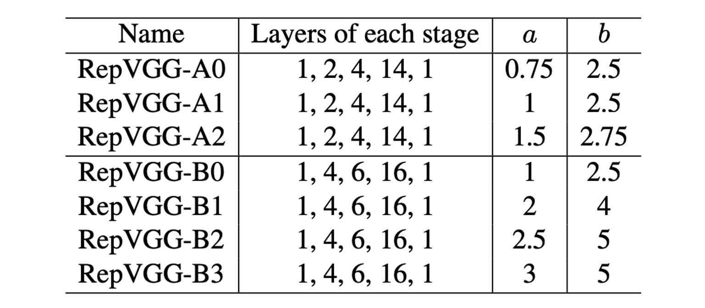
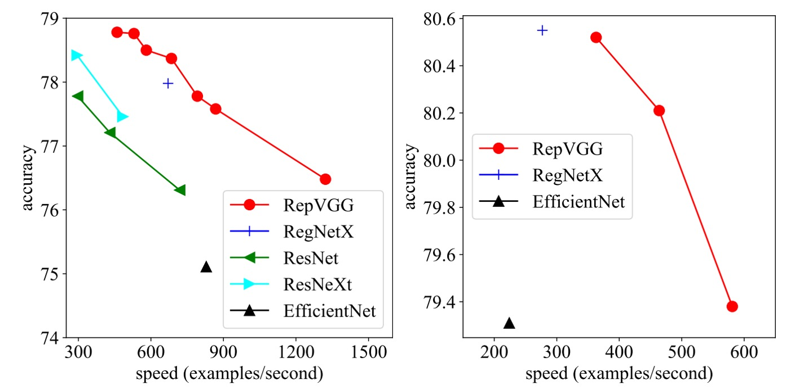
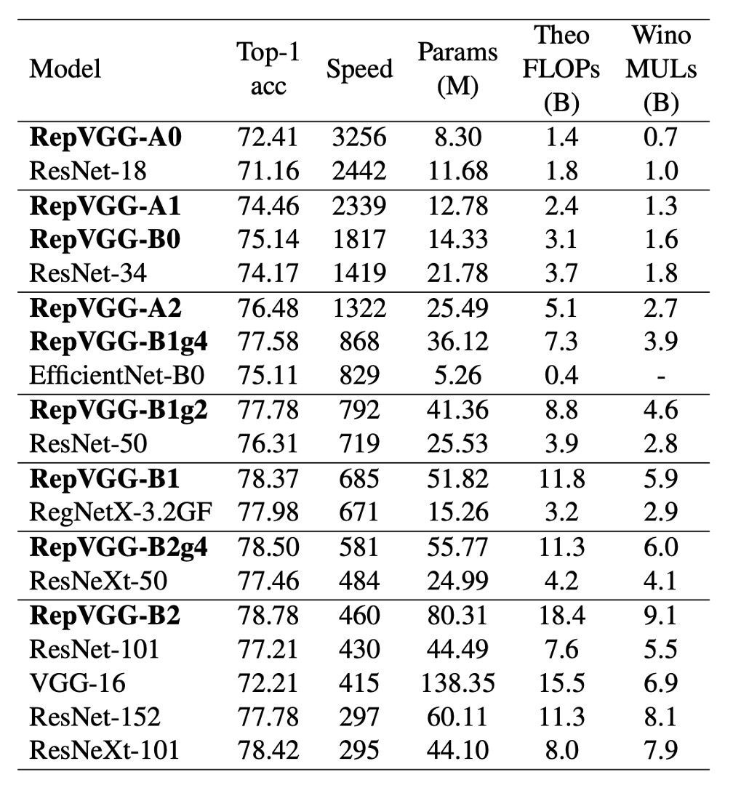

# [21.01] RepVGG

## 讓 VGG 再次偉大

[**RepVGG: Making VGG-style ConvNets Great Again**](https://arxiv.org/abs/2101.03697)

---

**試問：模型參數量愈少，速度愈快，對嗎？**

這個問題你可能知道答案是：「不對」！

因為必須考慮計算量，通常我們會參考模型的計算量 FLOPs（浮點運算次數）。

那我們接著問： 「**模型的 FLOPs 愈少，速度愈快，對嗎？**」

這個問題的答案，還是「不對」！

## 定義問題

因為影響推論速度的因素還有很多！

很多研究論文都想方設法地要降低模型的 FLOPs，但是當我們在工程端拿來使用時，發現推論速度並沒有變快，甚至有時候還變慢了。

這可是典型的產學落差，身為工程師的我們可不能被計算量的數據給蒙蔽了。

### 大量記憶體佔用

隨著 Inception，ResNet 和 DenseNet 的出現，許多研究興趣轉移到了精心設計的架構上，使得模型變得越來越複雜。除此之外，還有些架構基於 NAS 自動搜索，或是使用複合縮放策略。

雖然這些網路架構有更高的精度，但是複雜得分支會導致記憶體佔用量增加，如上圖。

在殘差結構中，由於分支的存在，因此在推論時候會需要多一份記憶體來存儲分支的結果，如果你有多個分支（對就是在說你，Inception！），那麼記憶體佔用量就會變得更大。

### 推論速度慢

有一些操作缺乏硬體的支援，例如 MobileNets 的深度卷積，這個方法雖然參數量比一般卷積大概減少 80%，但是速度更慢：

還有像是 ShuffleNet 內的通道洗牌，這個操作看起來不占計算量，但也會降低推論速度：

### 可是...

多分支結構真的很好啊！

**多分支架構可以讓模型成為許多淺層模型的隱式集合。**

- [**[16.05] Residual networks behave like ensembles of relatively shallow networks**](https://arxiv.org/abs/1605.06431)

  

因為殘差連結提供了一個捷徑，以 ResNet 為例：理論上來說對於 N 個區塊，模型可以解釋成 2N 個模型的集合，因為每個區塊可以分為兩條路徑可以選擇。

此外，捷徑可以提供更好的梯度流動，緩解梯度消失導致的難以訓練的困難。

ResNet 的成功已經證實了殘差連接的有效性，怎麼能說放棄就放棄呢？

## 解決問題

### 模型架構

為了解決上述的問題，這篇論文首先修改了 ResNet 的殘差結構。

作者重新定義了 RegVGG 單元，由於訓練時，我們需要多分支架構來提升模型表現，因此結構如上圖 (b)：

1. 一個 3x3 卷積
2. 一個 1x1 卷積
3. 一個 Identity 連接

但在推論時我們需要把所以分支移除，如上圖 (c)。

會把訓練結構定義成這樣，是為了在滿足多分支訓練架構的同時，也可以滿足模型推論時的需求：

- 對模型進行：**重新參數化**。

### 重新參數化

移除分支不是直接刪除，在過去許多模型裁減研究已經告訴我們直接刪除分支會導致性能下降。

作者提出了一個新的方法：**重新參數化**。

在 RepVGG 的單元中，每個卷積運算都帶有 Batch Normalization，這樣的結構可以被重新參數化成一個等效的卷積運算。

整個過程如上圖：

1. 將 3x3 卷積和 BatchNorm 合併成一個等效的卷積運算。
2. 將 1x1 卷積用 Zero-padding 拓展成一個等效的 3x3 卷積，然後再和 BatchNorm 合併成一個等效的卷積運算。
3. 將 Identity 連接拓展成一個等效的 3x3 卷積，然後再和 BatchNorm 合併成一個等效的卷積運算。
4. 最後將三個分支相加合併成一個等效的卷積運算。

---

雖然你可能不喜歡這個，不過我們還是描述一下論文內提供的具體過程：

- 用 $W^{(3)} \in \mathbb{R}^{C_2 \times C_1 \times 3 \times 3}$ 表示具有 $C_1$ 個輸入通道和 $C_2$ 個輸出通道的 $3 \times 3$ 卷積層的核
- 用 $W^{(1)} \in \mathbb{R}^{C_2 \times C_1}$ 表示具有 $C_1$ 個輸入通道和 $C_2$ 個輸出通道的 $1 \times 1$ 卷積層的核
- $\mu^{(3)}, \sigma^{(3)}, \gamma^{(3)}, \beta^{(3)}$ 表示 $3 \times 3$ 卷積層之後的 BN 層的均值、標準差和可學習的縮放因子與誤差
- $\mu^{(1)}, \sigma^{(1)}, \gamma^{(1)}, \beta^{(1)}$ 表示 $1 \times 1$ 卷積層之後的 BN 層的均值、標準差和可學習的縮放因子與誤差
- $\mu^{(0)}, \sigma^{(0)}, \gamma^{(0)}, \beta^{(0)}$ 則表示 Identity 分支。

令 $M^{(1)} \in \mathbb{R}^{N \times C_1 \times H_1 \times W_1}$ 和 $M^{(2)} \in \mathbb{R}^{N \times C_2 \times H_2 \times W_2}$ 分別表示輸入和輸出，並用 $\ast$ 表示卷積運算。

如果 $C_1 = C_2, H_1 = H_2, W_1 = W_2$ 則：

$$
M^{(2)} = \text{bn}(M^{(1)} \ast W^{(3)}, \mu^{(3)}, \sigma^{(3)}, \gamma^{(3)}, \beta^{(3)})
$$

$$
+ \text{bn}(M^{(1)} \ast W^{(1)}, \mu^{(1)}, \sigma^{(1)}, \gamma^{(1)}, \beta^{(1)})
$$

$$
+ \text{bn}(M^{(1)}, \mu^{(0)}, \sigma^{(0)}, \gamma^{(0)}, \beta^{(0)})
$$

需要注意的是，這種轉換的等效性要求 3x3 和 1x1 層具有相同的 stride，並且後者的填充配置應比前者少一個像素。例如， 3x3 卷積層的 padding 為 1，1x1 卷積層的 padding 為 0。

:::tip
和這篇類似概念的論文是：

- [**[17.06] Diracnets: Training very deep neural networks without skip-connections**](https://arxiv.org/abs/1706.00388)

他們是用另一種的卷積結構的數學表達式來讓模型更容易優化，但 RepVGG 在訓練時是真正的多分支模型，而 DiracNets 不是。
:::

### 參數配置

最後是 RepVGG 的參數配置，作者提供了幾個不同的配置，在上表中，`Layers of each stage` 表示了不同解析度特徵圖的層數。

上表中可以看到第一個 Stage 只有一層，因為這裡圖像尺寸大，佔用非常多計算量。大多數的計算都集中在第四個 Stage，大多堆疊 14 層或 16 層。

參數 a 和 b 用來控制通道數量，具體配置如下表：

## 討論

### ImageNet 性能

在這篇研究中，作者將 RepVGG 與 ImageNet-1K 數據集上的一些經典和最先進模型進行了比較。

這些模型包括 VGG-16、ResNet、ResNeXt、EfficientNet 和 RegNet，數據集包含 128 萬張訓練圖片和 5 萬張驗證圖片。

在訓練過程中，輕量級和中量級模型使用簡單的資料增強技術，如隨機裁剪和左右翻轉，而重量級模型則加入了預熱、餘弦學習率退火、標籤平滑、mixup 和 Autoaugment 技術。

作者在 8 個 GPU 上進行訓練，使用了標準的 SGD 優化器和餘弦退火學習率策略。

速度測試結果顯示，RepVGG 在精度和速度上均優於許多經典模型。例如，RepVGG-A0 比 ResNet-18 在精度和速度上分別提高了 1.25% 和 33%，RepVGG-A1 比 ResNet-34 提高了 0.29% 和 64%。

甚至在與更大的模型如 ResNet-101 和 ResNet-152 的比較中，具有交錯分組層的 RepVGG 模型也展現了顯著的優勢。

在參數效率方面，RepVGG 同樣表現出色。與 VGG-16 相比，RepVGG-B2 的參數減少了 42%，運行速度提高了 10%，且準確率增加了 6.57%。這顯示出 RepVGG 在保持較低參數數量的同時，能夠提供更高的性能。

最後，RepVGG 與最先進的基線模型相比也展示了良好的性能。例如，RepVGG-A2 比 EfficientNetB0 在準確率上高出 1.37%，運行速度快 59%。RepVGG-B1 比 RegNetX3.2GF 性能高 0.39%，速度略快。

### 消融實驗

這裡作者為了驗證了結構重新參數化技術的重要性，進行了詳細的實驗和消融研究，以探討其對模型性能的影響。

所有模型均在相同的簡單訓練設置下從頭開始訓練 120 個周期。

首先，作者透過從 RepVGG-B0 的每個區塊中刪分支來進行消融研究。結果顯示，刪除兩個分支後，模型的準確率僅達到 72.39%。當保留 1 × 1 分支時，準確率提升至 73.15%；保留 Identity 分支時，準確率提升至 74.79%。而全功能的 RepVGG-B0 則達到了 75.14% 的準確率。

從訓練時模型的推理速度來看，透過結構重新參數化去除恆等和 1×1 分支帶來了顯著的加速。

---

為了進一步比較，作者建立了一系列變體和基線模型，在 RepVGG-B0 上進行比較，如上表。

這些變體包括：

- **Identity w/o BN**：刪除身份分支中的 BN。
- **Post-addition BN**：刪除三個分支中的 BN 層，並在相加後追加一個 BN 層。
- **分支中的+ReLU**：在每個分支中插入 ReLU。
- **DiracNet**：採用了精心設計的卷積核重新參數化。
- **Trivial Re-param**：直接向 3 × 3 核心添加恆等核心。
- **不對稱卷積塊（ACB）**：另一種形式的結構重新參數化。
- **Residual Reorg**：透過類似 ResNet 的方式重新組織每個階段。

作者認為，結構重新參數化相對於 DiracNet 和 Trivial Re-param 的優越性在於，前者依賴於透過具有非線性行為（BN）的具體結構的實際資料流，而後者僅使用卷積核的另一種數學表達式。

與 ACB 的比較表明，RepVGG 的成功不僅僅是因為過度參數化。RepVGG 區塊可以等效地轉換為單一卷積進行推理，但這並不意味著訓練時間也等價。與 Residual Reorg 的比較顯示，RepVGG 的性能優於 0.58%，這得益於其更多的分支，使得 RepVGG 的模型集更為龐大。

這些實驗結果表明，結構重新參數化技術在訓練和推理過程中對模型性能具有重要影響，並且是訓練強大普通 ConvNet 的關鍵方法。

## 結論

結構重新參數化是 RepVGG 成功的關鍵技術之一。

這種方法允許模型在訓練期間保持高度靈活性，而在推理期間則轉換為更加高效的單一卷積層。這樣的設計使得 RepVGG 能夠在保持高精度的同時顯著提升推理速度。

實驗結果顯示，RepVGG 在速度與精度的權衡方面優於多個最先進的模型，這使其成為高效能計算和實時應用的理想選擇。

RepVGG 代表了一種新的卷積神經網路設計思路，作者展示了如何在簡化設計的同時不犧牲性能，其簡單高效的結構和強大的性能使為卷積神經網路的發展開辟了新的道路。
