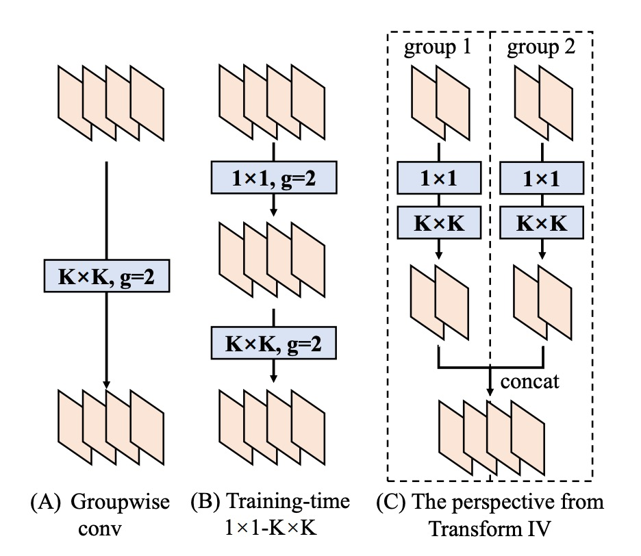
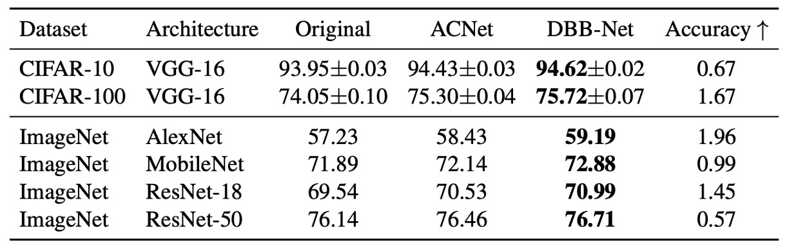

## 六個門徒

[**Diverse Branch Block: Building a Convolution as an Inception-like Unit**](https://arxiv.org/abs/2103.13425)

---

之前看完這篇論文，一直沒有找到時間整理一下。

這次就來談談這篇論文的內容。

## 定義問題

還記得 RepVGG 嗎？

簡單回顧一下，所謂「重參數化」（re-parameterization），指的是在訓練階段先使用較複雜的結構或多條分支來學習多樣的特徵表示，待模型訓練完之後，再把這些複雜結構的參數整合、合併到一個簡化的模型中，從而在推論時保有接近「單一路徑卷積」的推論效率。

RepVGG 便是此概念的一個代表，整體概念如下圖所示：

<figure style={{"width": "70%"}}>

</figure>

訓練時引入額外的 1×1 卷積、identity 分支等，最後將它們全部「濃縮」到純粹的 3×3 卷積層，使推論結構就像經典的 VGG 一樣輕量又高效

:::tip
如果你對重參數化（re-parameterization）的概念一無所知，那我們建議你要先讀過 RepVGG 的論文：

- [**[21.01] RepVGG: 讓 VGG 再次偉大**](../2101-repvgg/index.md)
  :::

看完 RepVGG 之後，你可能會覺得這個分支設計是不是可以再更多元一點？

本篇論文的作者也是這麼想的，或許我們能到找到更多元的設計方式，讓模型在訓練時能夠學習到更多樣的特徵：

- **反正只要能夠在推論階段把合成一支，就能夠列入考慮！**

基於上述目標，作者最後提出了「六個」解決方案。

## 解決問題

<figure style={{"width": "90%"}}>

</figure>

### 第一型：Conv-BN

常見的卷積層都會接一個 Batch Normalization (BN)，即「conv → BN」。

在推論時，BN 可視為「對同一輸出通道做線性變換」：先減去通道平均值 $\mu_j$、除以標準差 $\sigma_j$，再乘上學習到的係數 $\gamma_j$、加上偏置 $\beta_j$。

我們可利用「齊次性與可加性」把 BN 與前面的卷積合併到一個新的卷積核與偏置中，合併公式如下：

$$
F'_j \;\leftarrow\; \frac{\gamma_j}{\sigma_j} \, F_j,\quad
b'_j \;\leftarrow\; -\,\frac{\mu_j \,\gamma_j}{\sigma_j} \;+\; \beta_j.
$$

這樣就不需要在推論時顯式分開「卷積 + BN」，而是直接用新卷積核 $F'_j$ 和新偏置 $b'_j$。

### 第二型：Branch Add

分支相加指的是把兩個同配置的卷積 (如同大小核、同通道數) 的輸出相加。

由可加性可知，兩個卷積分別經過「第一型」後，若它們卷積核為 $F^{(1)}, F^{(2)}$；偏置為 $b^{(1)}, b^{(2)}$，則合併結果是：

$$
F^{(0)} \;\leftarrow\; F^{(1)} + F^{(2)},\quad
b^{(0)} \;\leftarrow\; b^{(1)} + b^{(2)}
$$

所以只要是平行分支，且空間對齊，就能最終加總到同一個卷積核。

### 第三型：Sequential Conv

如果是序列式的卷積層，如「1 × 1 conv → BN → K × K conv → BN」，也能合併成一個等效的 K × K 卷積，合併的過程如下：

1. 先把前面 1 × 1 conv + BN 合併為一個等效的 1 × 1 卷積（得到 $F^{(1)}, b^{(1)}$）。
2. 再把後面 K × K conv + BN 合併為另一個等效的 K × K 卷積（得到 $F^{(2)}, b^{(2)}$）。
3. 最後把這兩層合起來。

由於 1 × 1 conv 不會改變空間維度，但會改變通道的線性組合；我們可用「轉置」的概念，把它們合到 K × K 卷積核上。同時，前一層的偏置在經過後一層的捲積時，等效會「累積」成一個常數項。

整理之後，就能得到一個新的 K × K 卷積 $F^{(0)}, b^{(0)}$，完成序列層的合併。

:::tip
**Padding 問題**

若我們同時在兩層都做 zero padding，理論上空間會多出一圈 0，導致前一層輸出的結果與後一層的滑動視窗對不上。論文中，作者提出兩種解法：

1. 只對第一層卷積做 padding，第二層不做；
2. 透過「pad by $b^{(1)}$」的方式，來保持一致性。

這部分是細節層面的實做問題，但原理就是要確保空間對齊。
:::

### 第四型：Depth Concat

<figure style={{"width": "50%"}}>

</figure>

Inception 類結構常用「深度串接」來把多個分支的輸出在通道維度上連接。

若這些分支都只是「一個卷積」，且空間對齊相同，那麼直接把它們的卷積核在輸出的維度上串接即可：

$$
F^{(0)} \;\leftarrow\; \mathrm{CONCAT}\bigl(F^{(1)}, F^{(2)}\bigr),
\quad
b^{(0)} \;\leftarrow\; \mathrm{CONCAT}\bigl(b^{(1)}, b^{(2)}\bigr).
$$

如此就等效於「原先的所有輸出通道」合成到同一個大卷積裡。對於分組卷積也能類比此做法，只是在通道上要進行對應的拆分、合併即可。

### 第五型：Average Pooling

平均池化其實可以視為一種特殊的卷積。

如果我們有一個大小為 $K \times K$ 的 pooling kernel，其實跟「同樣大小的卷積核，中間是常數 $1/K^2$，其他位置是 0」等效，即：

$$
F_{d,c,:,:} =
\begin{cases}
1/K^2, & \text{if } d=c,\\
0, & \text{otherwise}.
\end{cases}
$$

當 stride = 1 時，就只是平滑；若 stride > 1，則會產生降採樣。

因此，如果在一個分支裡用到了平均池化，也能直接把它換算成一個固定參數的卷積核，再用前面那些 Transform (如可加性) 與其他分支合併。

### 第六型：Multi-scale Conv

<figure style={{"width": "70%"}}>

</figure>

若網路中有不同大小的卷積核 (例如 $1 \times 1$、$1 \times K$、$K \times 1$、$k_h \times k_w$ 等)，都可以視為在一個 $K \times K$ 大小的卷積核中「部分位置為零」(zero-padding) 的情況。

如此一來，所有不同尺寸 (只要不大於 $K \times K$) 都能被「拓展」到同樣大小的 $K \times K$ 卷積核維度，保持對齊，並最終可加性合併。

### 實驗參數配置

上表總結了實驗配置。

作者在 CIFAR-10/100 上採用標準資料增強，包括將圖像擴邊至 40×40、隨機裁剪與左右翻轉。為了快速驗證可行性，選擇 VGG-16，並依據 ACNet，將原本的兩個 FC 層替換為全域平均池化，再接單層 512 神經元的 FC。為公平比較，VGG 的每個卷積層均加入 BN。

ImageNet-1K 包含 128 萬張訓練圖與 5 萬張驗證圖。小型模型（AlexNet、MobileNet）採用標準增強（隨機裁剪、翻轉），ResNet-18/50 則額外加入顏色抖動與光照變化。AlexNet 設計與 ACNet 相同，不含局部響應歸一化（LRN），且每層卷積後加入 BN。CIFAR 與 ImageNet 的學習率調整均採餘弦退火（初始值 0.1）。

COCO 檢測使用 CenterNet，共訓練 126k 次迭代，初始學習率 0.02，並在 81k 和 108k 迭代時衰減 0.1 倍。Cityscapes 語義分割則採 PSPNet 官方設定，使用 poly 學習率策略（基準 0.01，指數 0.9），總計 200 epoch。

在所有架構中，作者將 K×K（1 < K < 7）卷積及其後 BN 替換為 DBB，形成 DBB-Net。較大卷積核（如 ResNet 和 AlexNet 的 7×7、11×11）未納入實驗，因其在模型設計中較少使用。所有模型均於相同配置下訓練，最終將 DBB-Net 轉換回原始結構進行測試。所有實驗均於 PyTorch 完成。

## 討論

### 與其他方法的比較

<figure style={{"width": "70%"}}>

</figure>

實驗結果如上表，加入 DBB-Net 之後，CIFAR 與 ImageNet 上都展現了明顯且一致的性能提升：

- VGG-16 在 CIFAR-10 與 CIFAR-100 上分別提升了 0.67% 與 1.67%，
- AlexNet 在 ImageNet 上提升了 1.96%
- MobileNet 提升了 0.99%
- ResNet-18/50 則分別提升了 1.45%/0.57%。

其中 ACNet 在理論上是 DBB 的特例，在實驗中 DBB 的效果優於 ACNet，說明了融合類似 Inception 的不同複雜度路徑，可能比僅依靠多尺度卷積所產生的特徵聚合更能受益。

### 消融實驗

<figure style={{"width": "90%"}}>

</figure>

作者基於 ResNet-18 進行了一系列消融實驗，以驗證多樣化分支（diverse connections）與訓練期非線性的重要性。

實驗結果顯示，移除 DBB 的任何一條分支都會導致性能下降，說明這些分支在提升表現上缺一不可。此外，即使僅使用三條分支，也能使準確率達到 70% 以上，顯示多樣化結構的有效性。在資源有限的情況下，僅使用 1×1 和 1×1−AVG 分支可構建輕量化 DBB，雖然準確率略有下降，但換取了更高的訓練效率。

進一步比較 DBB 與重複分支（duplicate blocks）後發現，即便總參數量相同，DBB 仍優於僅含重複卷積的結構。例如，(K×K + 1×1) 組合的準確率（70.15%）高於 double K×K（69.81%），顯示一個較弱的組件加上一個較強的組件，比兩個相同的強組件更具優勢。

同樣地，包含 (K×K + 1×1 + 1×1−AVG) 的 DBB（70.40%）也優於 triple K×K（70.29%），即便後者的訓練期參數量是前者的 2.3 倍，進一步證明連結的多樣性比單純增加參數量更重要。

為確認這些提升並非單純來自不同的初始化，作者構建了「baseline + init」對照組，先用完整的 DBB-Net 初始化 ResNet-18，再以相同設定進行訓練。最終準確率（69.67%）與標準初始化的基線相當，說明模型表現的提升並非來自初始化策略。

最後，作者也分析了 BN 在訓練期非線性中的影響。

當 BN 被移至所有分支相加之後，使該區塊在訓練期變為純線性時，性能提升顯著減少。例如，(K×K + 1×1) DBB 在這種情況下的準確率僅 69.83%，低於原始 DBB（70.15%）。這表明，即便不考慮訓練期非線性，多樣化分支仍能提升模型效能，但帶有 BN 的非線性結構能進一步增強學習能力。

實驗同時考察了訓練與推論速度，結果顯示增加訓練期參數量並未顯著影響訓練速度。

## 結論

本研究提出了一種全新的卷積神經網路構建模塊：**DBB（Diverse Branch Block）**，透過單一卷積實現多樣化分支的融合。

實驗證明，DBB 能夠在不增加推論成本的情況下，有效提升現有架構的性能。其中，多樣化連結與訓練期非線性是 DBB 優於普通卷積層的關鍵因素。這項研究為未來的網路設計提供了新方向，展示了更靈活且高效的卷積計算方式。
