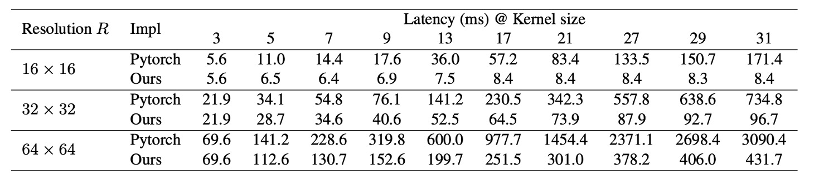
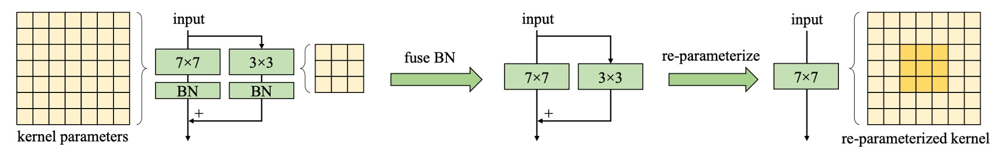
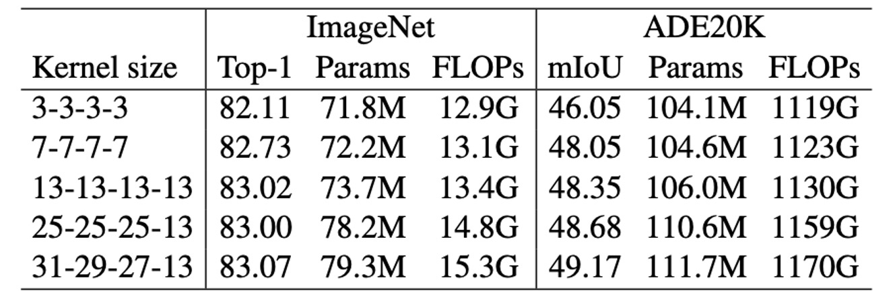
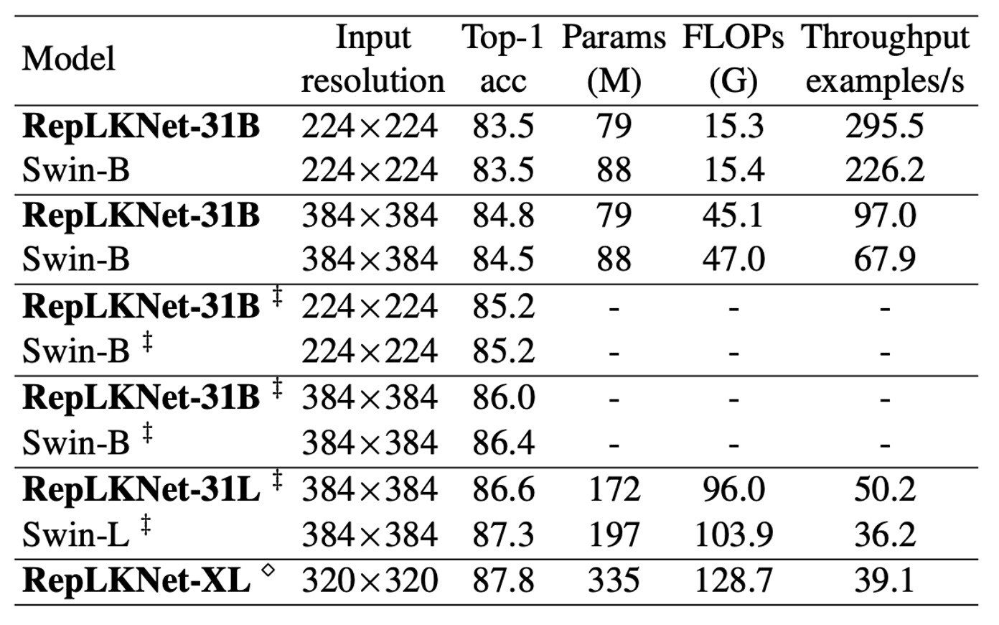

## 巨無霸卷積核

[**Scaling Up Your Kernels to 31x31: Revisiting Large Kernel Design in CNNs**](https://arxiv.org/abs/2203.06717)

---

近年來，CNN 架構受到 ViT 挑戰，地位顯得搖搖欲墜。

有人說，ViT 這麼強，是因為多頭注意力機制的加持，多頭注意力更靈活，更少歸納偏差，對扭曲更穩健等。

但是又有一派人把「多頭注意力」去除後，發現性能也相去不遠，於是把性能歸功於「架構」。

這篇論文跟他們都不同，它主要專注於一個觀點：大卷積核的設計。

## 定義問題

除了一些老式模型如 Inceptions 之外，大核模型在 VGG 之後不再流行。

VGG 已經得到了堆疊小核就能達到同樣效果的「感受野」，因此大核的設計逐漸乏人問津。

雖然近年也有一些對於大核的研究，但是這些研究沒有回答一個關鍵問題：

- **為什麼傳統 CNN 性能不如 ViT？建立大感受野的方式是縮小 CNN 和 ViT 表現差距的關鍵嗎？**

## 大核卷積使用說明書

為了回答這個問題，作者有系統地探索了 CNN 的大核心設計，並總結了五個經驗指南。

### 深度大核卷積仍然高效

我們總會認為大核卷積的計算成本很高，因為核心大小會成倍增加 FLOPs 數量。

但是你只要改成深度卷積的形式，就可以大大克服這個缺點。

另一方面，由於現代 GPU 等平行運算裝置對於深度卷積的支援性不足，記憶體存取成本增加。

現成的深度學習工具對於深度卷積的支援也不夠，如下表所示，可以看到 PyTorch 的實作方式的推論延遲非常高。

為了解決這個問題，作者重新發佈了高效的 PyTorch 實作，在這個實作中深度卷積的延遲次 49.5% 減少到 12.3%，大概上與 FLOPs 佔用成正比：

- [**RepLKNet-pytorch**](https://github.com/DingXiaoH/RepLKNet-pytorch)

### 大核卷積十分依賴殘差連接

作者使用 MobileNet-V2 進行基準測試，因為它大量使用 DW 層並且有兩個已發布的變體（有或沒有殘差連接）。對於大內核對應部分，只需將所有 DW 3×3 層替換為 13×13 層。

上表顯示大核心將使用捷徑的 MobileNet-V2 的準確率提高了 0.77%。然而，如果沒有捷徑，大核心會將準確率降低到只有 53.98%。

:::tip
一如我們之前看過的論文，捷徑使模型成為由具有不同感受野的眾多模型組成的隱式集合，因此它可以從更大的最大感受野中受益，同時又不失去捕獲小規模模式的能力。
:::

### 大核卷積需要重新參數化

上表顯示直接將核心大小從 9 增加到 13 會降低準確性，而重新參數化可以解決此問題。

眾所周知，ViT 在小資料集上存在最佳化問題。一個常見的解決方法是引入卷積先驗，例如，在每個自注意力區塊中添加一個 DW 3×3 卷積，這與我們的類似。這些策略在網路之前引入了額外的平移等方差和局部性，使得在小資料集上更容易優化而不失通用性。

同樣與 ViT 的行為類似，作者也發現當預訓練資料集增加到 7,300 萬張影像時，可以省略重新參數化而不會降低效能。

### 大核卷積明顯提升下游任務性能

上表顯示，將 MobileNet V2 的核心大小從 3×3 增加到 9×9 將 ImageNet 精度提高了 1.33%，但 Cityscapes mIoU 提高了 3.99%。

另外一個實驗野顯示了類似的趨勢：隨著核心大小從 [3, 3, 3, 3] 增加到 [31, 29, 27, 13]，ImageNet 精度僅提高了 0.96%，而 ADE20K 上的 mIoU 提高了 3.12%。這種現象表明，相似 ImageNet 分數的模型在下游任務中可能具有非常不同的能力。

作者造成這種現象的原因有二：

1. 大內核設計顯著增加了有效感受野（ERF）。許多工作已經證明「上下文」資訊（這意味著大型 ERF）對於許多下游任務（例如物件檢測和語義分割）十分重要。
2. 大內核設計為網路帶來了更多的形狀偏差。簡而言之，ImageNet 圖片可以根據紋理或形狀進行正確分類。然而，人類主要根據形狀線索而不是紋理來辨識物體，因此具有更強形狀偏差的模型可能會更好地轉移到下游任務。

此外，最近的研究指出 ViT 具有強烈的形狀偏差，這部分解釋了為什麼 ViT 在遷移任務中超級強大。相較之下，在 ImageNet 上訓練的傳統 CNN 往往偏向紋理。

- [**[21.05] Are convolutional neural networks or transformers more like human vision?**](https://arxiv.org/abs/2105.07197)

### 大核卷積對於小特徵圖的效果依然很好

作者將 MobileNet V2 最後階段的 DW 卷積放大到 7×7 或 13×13，因此核心大小等於甚至大於特徵圖大小（預設為 7×7）。從上表可以看出，雖然大核卷積在 ImageNet 上的性能沒有提升，但對於下游任務的幫助仍然很大，在 Cityscapes 上提高了 mIoU 至 74.62%。

其中原因，作者認為當內核尺寸變大時，CNN 的平移等變性並不嚴格成立，相鄰空間位置的兩個輸出僅共享核心權重的一部分，即透過不同的映射進行變換，如下圖，這種機制可能就是大核卷積對於小特徵圖的效果依然很好的原因。

## 解決問題

### 網路架構

基於上述的總結，作者提出了一個新的網路架構，RepLKNet。

首先，RepLKNet 的架構設計在初始階段就注重捕捉更多細節。這是通過多個卷積層來實現的。在第一個 3×3 和降採樣後，安排了一個 3×3 深度可分離卷積（DW）層來捕捉低階模式，接著是 1×1 卷積層，然後再使用另一個 DW 3×3 層進行降採樣。這樣的設計確保了初始階段能夠充分提取圖像中的細節信息。

其次，在每個階段（1-4）中，RepLKNet 包含多個 RepLK 區塊。這些區塊利用捷徑和 DW 大核心卷積來提升性能。每個 DW 卷積層使用 5×5 內核進行重新參數化，以捕捉更多細節。

:::tip
這個部分在上圖中沒有畫出來，但對性能提升很重要。這些區塊的設計使得網路能夠在不同階段保持高效的特徵提取和處理能力。
:::

此外，為了增強非線性和跨通道的資訊通信，RepLKNet 引入了 ConvFFN 區塊。這些區塊由捷徑、Batch Normalization（BN）、兩個 1×1 卷積層和 GELU 啟動函數組成，類似於 Transformer 和 MLP 中的前饋網路（FFN）。

相比於經典 FFN 使用 Layer Normalization 的做法，BN 可以更有效地融合到卷積操作中，提升推理效率。這一設計靈感來自於 Transformer 和 MLP 網路，並在卷積神經網路中得到成功應用。

在不同階段之間，RepLKNet 使用 Transition Blocks 來調整通道尺寸和進行降採樣。這些塊首先透過 1×1 卷積增加通道尺寸，然後使用 DW 3×3 卷積進行降採樣，確保特徵的充分提取和轉換。這些過渡塊的設計使得網路在不同階段之間能夠平滑地過渡，保持信息的一致性和完整性。

## 討論

### 大核卷積評估

為了評估大內核對 RepLKNet 的影響，作者在固定一些超參數的情況下，改變內核大小，觀察其在分類和語意分割上的效能。

結果顯示，在 ImageNet 上，內核大小從 3 增加到 13 可以提高準確性，但進一步增大內核並未帶來顯著提升。然而，在 ADE20K 上，將內核從 13 擴展到 31 帶來了更高的 mIoU，凸顯了大內核在下游任務中的優勢。

這表明，雖然大內核對部分任務的提升有限，但在特定應用中仍然具有重要價值。

### ImageNet 上的性能

由於 RepLKNet 與 Swin 模型架構相似，作者進行了詳細比較。

在 ImageNet-1K 上，作者將 RepLKNet-31B 的訓練計劃擴展至 300 個 epoch，以確保公平比較。隨後，作者在 384×384 的輸入解析度下進行了 30 個 epoch 的微調，這樣的訓練成本遠低於從頭開始使用 384×384 訓練的 Swin-B 模型。

此外，作者在 ImageNet-22K 上預訓練了 RepLKNet-B 和 RepLKNet-L 模型，並在 ImageNet-1K 上進行微調。RepLKNet-XL 則在作者的私人半監督資料集 MegData73M 上進行預訓練。

作者還在相同的 2080Ti GPU 上，以批次大小 64 測試了模型的吞吐量。

---

結果顯示，雖然非常大的內核不適用於 ImageNet 分類，但 RepLKNet 模型在準確性和效率之間取得了良好的平衡。例如，RepLKNet-31B 在僅使用 ImageNet-1K 訓練的情況下，達到了 84.8% 的準確率，比 Swin-B 高 0.3%，且運行速度快 43%。儘管 RepLKNet-XL 的 FLOPs 比 Swin-L 更高，但運行速度更快，這強調了大內核設計在效率上的優勢。

### 大核 CNN 比深度小核模型有更大的 ERF

作者已經證明，大型核心設計可以顯著提升 CNN 的性能。雖然大內核可以通過一系列小卷積來表示，例如，7×7 卷積可以分解為三個 3×3 內核的堆疊。鑑於此，自然會出現一個問題：

- **為什麼包含數十或數百個小卷積層（例如 ResNets）的傳統 CNN 的表現仍然不如大內核網路？**

作者認為，單一大內核在獲得大感受野（ERF）方面比許多小內核更有效。根據有效感受野（ERF）理論，ERF 與 $O(K\sqrt{L})$ 成正比，其中 K 是核大小，L 是深度，即層數。

換句話說，**ERF 主要受內核大小影響，其次才是深度**。

---

此外，深度的增加會帶來最佳化難度。

人們總以為 ResNets 克服了這一困境，但是沒有。一些研究表明，ResNets 的行為類似於淺層網路的集合，即使深度增加，ResNets 的 ERF 仍然非常有限。

口說無憑，作者對此做了一個實驗：

為了視覺化 ERF，作者使用了一種簡單而有效的方法。

簡單來說，作者產生了一個聚合貢獻得分矩陣 $A (1024×1024)$，並測量輸入影像上對應像素對最後一層產生的特徵圖中心點的貢獻。

意思就是：**特徵圖中心點的貢獻，是由輸入影像上的哪些像素決定的。**

實驗結果顯示，在 ResNet 上，ERF 非常有限，就算深度增加也一樣。反觀在 RepLKNet 上，高貢獻像素分佈更均勻，ERF 更大。

### 形狀偏差

作者指出，大內核設計帶來了更強的形狀偏差，這對於下游任務非常重要。

作者獲取在 ImageNet-1K 或 22K 上預先訓練的 RepLKNet-31B 和 Swin-B 的形狀偏差（例如，基於形狀而不是紋理進行的預測的比例），以及兩個小內核基線 RepLKNet-3 和 ResNet-152。

從上圖中可以看出 RepLKNet-31B 的形狀偏差比 Swin Transformer 和小核心 CNN 高得多。作者認為形狀偏差與有效感受野密切相關，而不是與自注意力，同時這也解釋了：

1. ViT 的高形狀偏差，因為採用全局注意力
2. Swin Transformer 的低形狀偏差，因為採用局部視窗內的注意力

### 限制

儘管大核心設計顯著提升了 CNN 在 ImageNet 和下游任務上的效能，但隨著資料和模型規模的增加，RepLKNet 開始在某些方面落後於 Swin Transformers。

作者目前尚不清楚這種差距是由次優的超參數調整造成的，還是由於數據和模型規模擴大時 CNN 的一些基本缺陷所致。

這裡留給後續的研究。

## 結論

在本研究中，作者重新審視了在設計 CNN 架構時長期被忽視的大型卷積核。

通過實驗，作者證明了使用幾個大核心而不是許多小核心，可以更有效地獲得更大的有效感受野，從而大幅提高 CNN 的性能，這一發現有助於縮小 CNN 和 ViT 之間的性能差距。

對於 CNN 社群，研究結果表明應該特別關注 ERF，這可能是獲得高性能的關鍵。對於 ViT 社群，研究表明大卷積核可以取代具有類似行為的多頭自注意力機制，這可能有助於理解自注意力的內在機制。

作者希望這項工作能夠促進兩個社群之間的互相理解和進步，並激發更多的研究，以探索和優化深度學習模型的架構設計。
