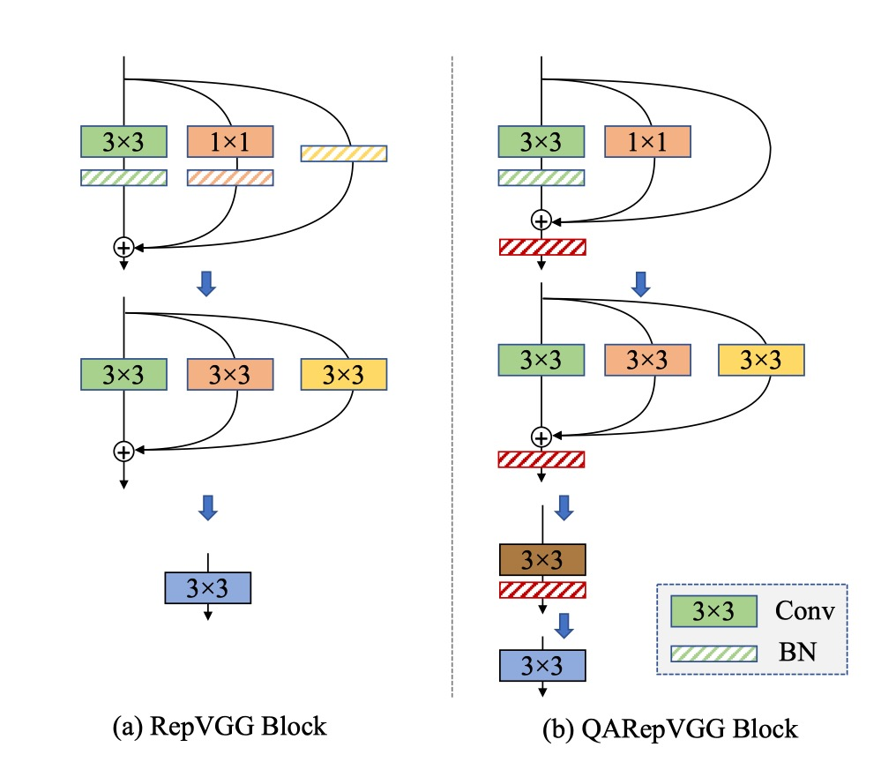

# [22.12] QARepVGG

## 讓 RepVGG 再次偉大

[**Make RepVGG Greater Again: A Quantization-Aware Approach**](https://ojs.aaai.org/index.php/AAAI/article/view/29045)

---

RepVGG 在訓練階段利用多個分支形式的過度參數化網路，並在推理過程中將分支相同地融合為一個，稱為「重新參數化」。

- [**RepVGG: 讓 VGG 再次偉大**](../2101-repvgg/index.md)

## 定義問題

這種「重新參數化」設計在許多場景中作為基本組件被廣泛使用，涵蓋低階和高階視覺任務。

近年流行的目標檢測方法，如 YOLOv6 和 YOLOv7 都是基於這樣的組件構建的。

- [**[22.07] YOLOv7**](https://arxiv.org/abs/2207.02696)
- [**[22.09] YOLOv6**](https://arxiv.org/abs/2209.02976)

但是...

### RepVGG，它不能量化！

量化是一種有效的模型壓縮方法，它將網路權重和輸入資料映射到較低的精度（通常 INT8）以進行快速計算，這極大地提高了計算效率。

- 訓練後量化（PTQ）是最常見的方案，因為它只需要幾批影像來校準量化參數，並且不需要額外的訓練。
- 量化感知訓練（QAT）方法也被提出來提高量化精度，由於 QAT 通常涉及對訓練代碼的侵入並且需要額外的成本，通常只在訓練代碼手頭並且 PTQ 無法產生令人滿意的結果時才使用它。

有得必有失，不管是什麼量化方式，通常伴隨著精度下降，因此只要能在「不影響太多」性能的情況下，用於在部署作業上。

- **但是 RepVGG 量化之後，精度降了 20%！**

這完全沒有實用價值！

### 首先，為什麼？

---

作者首先使用官方發布的代碼評估幾個 RepVGG 模型的性能，如上表，RepVGG-A0 在標準的 PTQ（後訓練量化）後，在 ImageNet 驗證數據集上的 Top-1 準確率從 72.4% 大幅下降到 52.2%，總共下降 20.2% ！

對於張量 $X$ 的量化操作通常表示為：

$$
Q(X) = Clip(Round(X/\Delta x ))
$$

其中 $Round$ 使用天花板取整將浮點值四捨五入為整數，$Clip$ 則截斷超出量化域範圍的值。$\Delta x$ 是一個比例因子，用於將張量映射到給定範圍內，定義為:

$$
\Delta x = \frac{(x_{max} - x_{min})}{2^{b}-1}
$$

其中 $x_{max}$ 和 $x_{min}$ 是一對邊界值，選擇它們是為了更好地表示$X$的值分佈。量化誤差的方差計算為 $\sigma^2 = (\Delta x)^2/12$。因此，問題變成如何減少 $x_{max}$ 和 $x_{min}$ 之間的範圍。

在實踐中，它們是以各種方式選擇的。有時最大值和最小值會被直接使用，例如權重量化；有時它們是通過優化量化誤差的 MSE 或熵來選擇的，這通常用於量化啟動值。選擇的質量取決於許多因素，例如張量的方差、是否存在一些異常值等。

對於神經網路來說，有兩個主要組成部分需要量化並可能導致準確度下降，即權重和啟動。啟動還作為下一層的輸入，因此誤差會逐層累積和增加。因此，神經網路的良好量化性能主要需要兩個基本條件：

- $C1$：權重分佈對量化友好且範圍可行，
- $C2$：啟動分佈（即模型對輸入特徵的響應）對量化也友好。

經驗上，我們將具有小方差和少量異常值的權重或啟動分佈定義為對量化友好，違反上述任何一個條件都會導致較差的量化性能。

作者接著展示 RepVGG-A0 模型的權重分佈：

上圖是每一層的權重分佈，和對應的標準差。

觀察發現，這些權重均勻分佈在零附近，沒有特別的異常值，滿足了 C1 的條件。這促使作者進一步驗證 C2，檢查是否是啟動函數大大惡化了量化效果。不幸的是，啟動函數是依賴於輸入且與學習到的權重耦合在一起的。

因此，作者不對權重或啟動函數的分佈做任何假設，並分析每個分支的偏差。

### 正則化擴大啟動方差

在進一步討論之前，我們先來介紹典型 RepVGG 區塊中的計算操作。

這裡作者使用與 RepVGG 相同的命名約定，以便更好地理解。

這裡用 $W^{(k)} \in \mathbb{R}^{C_2 \times C_1 \times k \times k}$ 表示 $k \times k$ 卷積的核，其中 $C_1$ 和 $C_2$ 分別是輸入和輸出通道的數量。對於 RepVGG 來說，$k \in \{1, 3\}$，至於 $k \times k$ 卷積後的 BN 層，我們用 $\mu^{(k)} \in \mathbb{R}^{C_2}$, $\sigma^{(k)} \in \mathbb{R}^{C_2}$, $\gamma^{(k)} \in \mathbb{R}^{C_2}$, $\beta^{(k)} \in \mathbb{R}^{C_2}$ 作為均值、標準差、縮放因子和偏差。對於 Identity 分支中的 BN，使用 $\mu^{(0)}$, $\sigma^{(0)}$, $\gamma^{(0)}$, $\beta^{(0)}$。

設 $M^{(1)} \in \mathbb{R}^{N \times C_1 \times H_1 \times W_1}$, $M^{(2)} \in \mathbb{R}^{N \times C_2 \times H_2 \times W_2}$ 分別表示輸入和輸出，$\ast$ 表示卷積運算。

設 $Y^{(0)}$, $Y^{(1)}$ 和 $Y^{(3)}$ 分別是 Identity、$1 \times 1$ 和 $3 \times 3$ 分支的輸出。

在不失一般性的情況下，我們假設 $C_1 = C_2$, $H_1 = H_2$, $W_1 = W_2$。

那麼我們可以將輸出 $M^{(2)}$ 寫成：

$$
M^{(2)} = BN(M^{(1)} \ast W^{(3)}, \mu^{(3)}, \sigma^{(3)}, \gamma^{(3)}, \beta^{(3)})
$$

$$
+ BN(M^{(1)} \ast W^{(1)}, \mu^{(1)}, \sigma^{(1)}, \gamma^{(1)}, \beta^{(1)})
$$

$$
+ BN(M^{(1)}, \mu^{(0)}, \sigma^{(0)}, \gamma^{(0)}, \beta^{(0)})
$$

接著，$3 \times 3$ 分支的 BN 操作可以寫成：

$$
Y^{(3)} = \gamma^{(3)} \odot \frac{M^{(1)} \ast W^{(3)} - \mu^{(3)}}{\sqrt{\sigma^{(3)} \odot \sigma^{(3)} + \epsilon}} + \beta^{(3)}
$$

其中 $\odot$ 表示逐元素相乘，$\epsilon$ 是一個小值（默認為$10^{-5}$）以確保數值穩定性。這意味著 BN 在改變其輸入的統計量（均值和方差）方面起到了作用。

上式中，$\mu$ 的變化不會影響量化誤差，但方差的變化會直接影響量化準確性。從概率的角度來看，給定隨機變量 $X$ 和標量 $\lambda$，$\lambda X$ 的方差，即 $D(\lambda X)$ 等於 $\lambda^2 D(X)$。

設 $X^{(3)} = M^{(1)} \ast W^{(3)}$，那麼我們有：

$$
D(Y^{(3)}) = \frac{\gamma^{(3)} \odot \gamma^{(3)}}{\sigma^{(3)} \odot \sigma^{(3)} + \epsilon} \odot D(X^{(3)})
$$

其中，$\frac{\gamma^{(3)} \odot \gamma^{(3)}}{\sigma^{(3)} \odot \sigma^{(3)} + \epsilon}$ 的值控制了$X^{(3)}$方差的擴大或縮小，從而分別導致更好的或更差的量化性能。

:::tip
對於 $1 \times 1$ 和 Identity 分支，我們可以得出類似的結論，因此不再重複。
:::

基於上述分析，作者深入探討 RepVGG 的細節：

有一個關鍵但容易被忽視的組件，即一種稱為自定義 $L_2$ 的特殊設計的權重衰減，這個組件提高了準確性並促進了量化，這種特殊設計正則化了多分支權重，就像正則化其等效融合的卷積核一樣，這可能使得融合的權重具有量化友好的分佈，這個自定義$L_2$損失本質上是：

$$
L_{2,\text{custom}} = \frac{\|W_{\text{eq}}\|_2^2}{\frac{\|\gamma^{(3)}\|_2^2}{\sqrt{\sigma^{(3)} \odot \sigma^{(3)} + \epsilon}} + \frac{\|\gamma^{(1)}\|_2^2}{\sqrt{\sigma^{(1)} \odot \sigma^{(1)} + \epsilon}}}
$$

這裡的優化器被鼓勵通過放大分母來最小化這個損失，這會放大啟動的方差並帶來量化困難。即自定義 $L_2$ 有助於使學習的權重量化友好，但代價是啟動量化不友好。

為了解決方差擴大的問題，一個簡單直接的方法是從上述公式中移除分母，我們得到：

$$
L_{2,\text{custom}}' = \|W_{\text{eq}}\|_2^2
$$

結果如下表：

移除了分母項，FP32 的準確率是 71.5%，比基線低 0.7%，令人驚訝的是量化性能大幅提升至 61.2%。

不過這種方法仍然需要不方便的等效轉換，另一個考慮方向是直接應用普通的 $L_2$。使用之後的結果顯示除了簡單性之外，$L_2$ 達到了略微優於上式的結果。

因此，最後作者選擇這種方法作為默認實現方式(M1)。

### 不可控的異常權重

雖然 FP32 準確率比基線低 0.5%，但其 INT8 準確率比基線高 11.3%。然而，這種設計由於沒有明確的正則化器來擴大啟動方差，仍然無法滿足應用需求。因此檢查權重的分佈是直接的方法。

首先，我們可以給出融合後的權重為：

$$
W = \hat{W}^{(3)} + \hat{W}^{(1)} + \hat{W}^{(0)}
$$

$$
= \frac{\gamma^{(3)}}{\sqrt{\sigma^{2}_{(3)} + \epsilon}} \odot W^{(3)}
$$

$$
+ \frac{\gamma^{(1)}}{\sqrt{\sigma^{2}_{(1)} + \epsilon}} \odot Padding(W^{(1)})
$$

$$
+ \frac{\gamma^{(0)}}{\sqrt{\sigma^{2}_{(0)} + \epsilon}} \odot Padding(W^{(0)})
$$

其中，$Padding()$ 用於匹配 $3 \times 3$ 卷積核的形狀。

在這個架構中，$W^{(3)}$ 和 $W^{(1)}$ 是可訓練的參數，而 $W^{(0)}$ 是一個固定的單位矩陣，在訓練過程中不會衰減。標量 $\frac{\gamma^{(3)}}{\sqrt{\sigma^{2}_{(3)} + \epsilon}}$ 和 $\frac{\gamma^{(1)}}{\sqrt{\sigma^{2}_{(1)} + \epsilon}}$ 分別依賴於 $3 \times 3$ 和 $1 \times 1$ 分支的卷積層輸出。

**然而，$\frac{\gamma^{(0)}}{\sqrt{\sigma^{2}_{0} + \epsilon}}$ 直接依賴於最後一層的輸出，Identity 分支是特別的，因為啟動在進入 BatchNorm 層之前會通過 ReLU 層。**

這個操作非常危險，因為如果某個通道完全未啟動（即僅包含零），這會生成一個非常小的 $\sigma$ 和一個奇異值 $\frac{1}{\sqrt{\sigma^{2}_{(0)} + \epsilon}}$。這個問題在廣泛使用 ReLU 的網路中很常見。

**如果出現這種情況，奇異值將主導融合卷積核的分佈，並顯著影響它們的量化偏好。**

這解釋了為什麼量化性能不好：因為違反 C1 導致不可修復的錯誤。

---

作者進一步展示了三個分支的 $\frac{\gamma}{\sqrt{\sigma^2 + \epsilon}}$，如下圖。

Layer 5 和 6 中來自 Identity 分支的 $\frac{\gamma}{\sqrt{\sigma^2 + \epsilon}}$ 的最大值分別為 692.1107 和 1477.3732。

作者重複了三次實驗，這種現象一再發生。

:::tip
在不同實驗中最大值隨機出現在不同層，簡單地跳過這些層無法解決量化問題。

根據作者分析，RepVGG 的量化誤差是由所有層累積的，因此部分解決方案無法緩解崩潰，這促使作者必須通過設計量化友好的重新參數化結構來解決這個問題。
:::

## 解決問題

基於普通的 $L_2$ 損失，作者通過改變重新參數化結構來解決上述問題。

作者從 identity 和 $1 \times 1$ 分支中移除 BN，並在三個分支相加後附加一個額外的 BN。移除 Identity 分支中的 BN（M2）消除了異常的不可控權重，以滿足 C1。

作者將此設置命名為 S2，並在下表的第三行顯示結果。

對權重量化的誤差分析表明，這種設計確實滿足了 C1 的要求。該模型的 FP32 準確率較低為 70.7%，INT8 準確率為 62.5%，仍然不可行。這促使作者驗證它是否違反了 C2。如果 $3 \times 3 $和 $1 \times 1$ 分支具有相同的均值，它們的求和容易擴大方差。

在 RepVGG 的設計中這種現象經常發生。由於 ReLU 是 RepVGG 中的啟動函數。一方面，如果大多數輸入都低於零（死亡神經元），這是有害的。另一方面，如果所有輸入都高於零，由於失去非線性，也是不可取的。經驗上，許多現代高性能 CNN 模型在 ReLU 之前通常具有零均值。

如果我們採取這個假設，我們可以得到：

$$
E(M^{(2)}) = E(Y^{(1)} + Y^{(3)} + Y^{(0)}) = 0
$$

如果 $3 \times 3$ 和 $1 \times 1$ 分支具有相同的均值，我們得到

$$
\beta^{(3)} = \beta^{(1)} = -2E(Y^{(0)})
$$

注意 $E(Y^{(0)}) \ge 0$，添加三個分支往往會擴大方差（如下圖所示），遺憾的是 RepVGG 的原始設計不可避免地會遇到這個問題。

---

為了更好地控制方差，有幾種簡單的方法可以考慮，如下表所示：

這種設計移除 $1 \times 1$分支中的 BN（M3），因為它具有最佳性能，此設置命名為 S3。這種設計在 ImageNet 上達到 70.1% 的 Top-1 FP32 準確率和 69.5% 的 INT8 準確率，大大提高了量化性能。

然而，它的 FP32 準確率仍然較低。

由於三個分支的相加引入了協變轉移問題，作者在三個分支相加後附加了一個額外的批量正規化（M4）來穩定訓練過程，並將此設置命名為 S4。

後置 BN 不影響部署時的等效卷積核融合。這進一步將我們的 A0 模型在 ImageNet 上的 FP32 準確率從 70.1%提升到 72.2%。此外，其 INT8 準確率提升至 70.4%。

總結，結合上述四個修改（從 M1 到 M4）最終組成了 QARepVGG，其 FP32 準確率與 RepVGG 相當，而 INT8 性能則大大超過 RepVGG。

## 討論

### ImageNet 上的性能

研究結果顯示，RepVGG 的 INT8 精度受到嚴重影響，遠低於 FP32。

例如，RepVGG-B0 的 top-1 準確率從 75.1% 驟降至 40.2%。相較之下，本論文的方法在 INT8 性能上表現優異，準確率下降幅度在 2% 以內。特別是具有組卷積的 RepVGG 表現不佳。經過 PTQ 後，RepVGG-B2g4 的準確率從 78.5% 驟降至 13.7%，下降了 64.8%。相反，QARepVGG-B2g4 的準確度僅下降了 0.7%，展示出其對不同尺度和變異的穩健性。

在與 RepOpt-VGG 的比較中，RepOpt-VGG 使用梯度重新參數化技術，其量化精度對於尺度的搜尋質量非常敏感。由於僅有部分預訓練模型發布，作者重新訓練了 RepOpt-VGG-A0/B0 模型。

結果顯示，RepOpt-VGG-A0 在 ImageNet 上的準確率為 70.3%，比 RepVGG 低了 2.1%。儘管 RepOpt-VGG 表現有所提升，但其 PTQ 準確度仍然過低。相比之下，作者的方法明顯優於 RepOpt-VGG，且無需敏感的超參數或額外的訓練成本。

最後，作者使用 NVIDIA 量化工具包中的 QAT 在 RepVGG 上進行了比較。結果顯示，配備 QAT 的 QARepVGG 的性能顯著優於 RepVGG+QAT。所有模型均訓練了 10 個 epoch，初始學習率為 0.01，進一步證實了該方法在量化後性能上的顯著優勢。

## 結論

透過理論和定量分析，本研究深入剖析了著名的基於重參數化結構 RepVGG 在量化過程中的失敗原因。研究發現，其結構缺陷不可避免地放大量化誤差，並累積產生較差的結果。為了解決這一問題，研究團隊重新設計了該結構，推出了 QARepVGG。這一改進設計產生了有利於量化的權重和活化分佈。

QARepVGG 在保持 RepVGG 優秀的 FP32 性能的同時，極大地簡化了最終部署的量化過程。這項研究強調了在架構設計中應更注重量化意識，以提高模型的整體性能。通過這一設計，QARepVGG 展示了其在量化過程中的優越性，為未來的模型設計提供了寶貴的參考。

:::tip
耐心看完這篇論文，頓時覺得自己偉大了起來...

雖然整篇論文的數學式很多，但是其實還算好懂。

我們推薦讀者可以通過閱讀原文來更深入地了解 QARepVGG 的設計和性能。
:::
