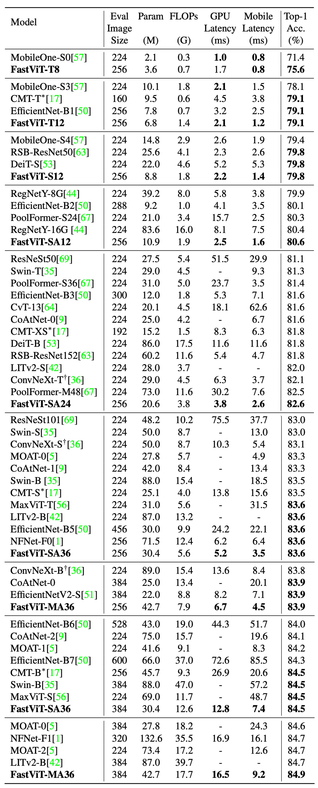
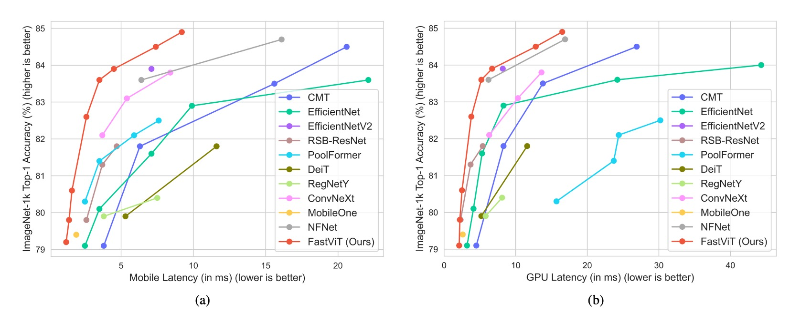

# [23.03] FastViT

## 重新參數化的 ViT 試驗

[**FastViT: A Fast Hybrid Vision Transformer using Structural Reparameterization**](https://arxiv.org/abs/2303.14189)

---

蘋果公司在稍早提出了 MobileOne 之後，繼續探索模型重參數的更多可能性。

上次是對 MobileNet 架構動手，這次輪到 ViT 了。

:::tip
**模型重新參數化（Reparameterization）**：

拆分訓練和推論架構，將原本的模型參數轉換為新的參數，以數學等價的方式將訓練架構轉換為推論架構，從而提升模型速度和性能。

這一串模型重參數的研究是從 RepVGG 提出後開始流行起來，如果你是第一次閱讀這個概念，我們強烈建議你先從 RepVGG 開始閱讀。先理解重參數的概念，後續的幾篇論文都很簡單，不然的話你可能會在這裡看了個寂寞。

- [**RepVGG: 讓 VGG 再次偉大**](../2101-repvgg/index.md)
  :::

## 定義問題

對於電腦視覺領域中的 Transformer 模型，已經在過去幾年間定調了幾個設計方向。

首先我們會分層幾個層級，對應視覺任務的多尺度的解析度需求，這個概念來自於 PVT 和 Swin Transformer：

- [**[21.02] PVT: 空間縮減注意力機制**](../../transformers/vision/2102-pvt/index.md)
- [**[21.03] Swin Transformer: 舞會開始**](../../transformers/vision/2103-swin-transformer/index.md)

接著我們會設計一個 Token Mixer 區塊搭配一個 FFN 區塊，組成一個基本模組，這個概念來自於 MetaFormer：

- [**[21.11] PoolFormer: 你需要的是框架**](../../transformers/vision/2111-poolformer/index.md)
- [**[22.10] CaFormer: MetaFormer 使用說明書**](../../transformers/vision/2210-caformer/index.md)

本篇論文的作者在提出 MobileOne 之後，把目光轉向了這個際設架構。

- [**[22.06] MobileOne: 一毫秒攻防**](../2206-mobileone/index.md)

有沒有機會也把這個 Vision Transformer 系列的模型也重新參數化呢？

## 解決問題

### 模型架構

FastViT 架構包含四個不同的階段，每個階段在不同的尺度上運行。

- **RepMixer**

  RepMixer 基於 ConvMixer 引入的卷積混合概念，其混合塊定義如下：

  - [**[22.01] ConvMixer**](https://arxiv.org/abs/2201.09792)

  $$Y = \text{BN}(\sigma(\text{DWConv}(X))) + X$$

  其中$\sigma$ 代表非線性激活函數，BN 表示批次正規化（Batch Normalization），DWConv 為深度卷積層。FastViT 通過重新排列操作並移除非線性函數進行簡化：

  $$Y = \text{DWConv}(\text{BN}(X)) + X$$

  這樣的設計主要好處是在推論時可以重新參數化為單一深度卷積層：

  $$Y = \text{DWConv}(X)$$

  這種重新參數化顯著降低了記憶體存取成本和計算複雜度，相比於 PoolFormer 中的 PoolMixer，RepMixer 有更好的推論性能。

  

- **位置編碼**

  FastViT 採用條件位置編碼（參考文獻如下列），這些編碼根據輸入 token 的局部鄰域動態生成。這些編碼通過深度卷積運算產生，並添加到 patch 嵌入中。由於該過程中缺乏非線性操作，這個區塊可以有效地進行重新參數化。

  - [**[21.02] Conditional positional encodings for vision transformers**](https://arxiv.org/abs/2102.10882)
  - [**[21.04] Twins: Revisiting the design of spatial attention in vision transformers**](https://arxiv.org/abs/2104.13840)

- **深度可分離卷積**

  延續 MobileOne 的設計理念，，FastViT 將密集$k \times k$ 卷積替換為深度可分離卷積，即$k \times k$ 深度卷積和$1 \times 1$ 點卷積，並搭配重新參數化的訓練策略。

  這種方法在不顯著增加訓練時間的情況下提升了模型容量。例如，FastViT-SA12 和 FastViT-SA36 的訓練時間僅分別增加了 6.7% 和 4.4%。

- **大核卷積**

  

  為了解決 RepMixer 相對於自注意力 Token Mixer 的局部感受野限制，FastViT 在 FFN 和 patch 嵌入層中整合了深度大核卷積。

  實驗結果顯示如上表，整合大核卷積顯著提升了模型性能和穩健性，這一策略在不顯著增加計算成本的情況下增強了感受野。

### 模型配置

FastViT 提供了多種變體，以滿足不同的計算需求和應用場景，如上表。這些變體在嵌入維度、MLP 擴展比率和包含的模塊類型上有所不同。

具體細節如下：

- 嵌入維度較小的模型，例如 [64, 128, 256, 512]，前綴為“S”。
- 包含自注意力（Self-Attention）層的模型，前綴為“SA”。
- 嵌入維度較大的模型，例如 [76, 152, 304, 608]，前綴為“M”。
- MLP 擴展比率小於 4 的模型，前綴為“T”。

表中的數字表示總共的 FastViT 模塊數量，FLOP 計數是通過 fvcore 庫計算的。

### 訓練與評估策略

作者使用 ImageNet-1K 資料集進行實驗，該資料集包含約 130 萬張訓練影像和 5 萬張驗證影像。

這個模型的訓練方法，具體如下：

- **優化器**：AdamW
- **訓練時期**：300 個
- **權重衰減**：0.05
- **峰值學習率**：$10^{-3}$
- **總批次大小**：1024
- **預熱時期**：5
- **學習率衰減**：餘弦退火策略
- **實作工具**：timm 函式庫
- **訓練硬體**：8 個 NVIDIA A100 GPU

對於 384×384 的輸入大小，則進行了 30 個時期的微調，具體設定如下：

- **權重衰減**：$10^{-8}$
- **學習率**：$5 \times 10^{-5}$
- **批次大小**：512

作者將 FastViT 與其他在 ImageNet-1K 資料集上最新的模型進行了比較，為了公平比較，作者對官方實現的 ConvNeXt 進行了修改，避免昂貴的重塑操作。此外，由於兩個庫對可變形卷積的支持較差，在這份論文中無法可靠地導出 LITv2。

## 討論

### ImageNet 上的性能

完整的比較結果如上表：

- **FastViT-MA36**：

  - Top-1 精度達到 84.9%
  - 比 LITv2-B 小 49.3%
  - 消耗的 FLOPs 少 55.4%

- **FastViT-S12**：

  - 在 iPhone 12 Pro 上比 MobileOne-S4 快 26.3%
  - 在 GPU 上快 26.9%

- **FastViT-MA36**：

  - Top-1 精度為 83.9%
  - 比 iPhone 12 Pro 上優化的 ConvNeXt-B 模型快 1.9 倍
  - 在 GPU 上快 2.0 倍

- **FastViT-MA36**：
  - Top-1 精度為 84.9%
  - 在 GPU 上與 NFNet-F1 同樣快
  - 尺寸縮小 66.7%
  - 使用的 FLOPs 減少 50.1%
  - 在行動裝置上的速度提高了 42.8%

:::tip
這只是基於 iphone 12 上的實驗結果，在後續的研究中，發現 FastViT 在多數設備上的推論速度上不如預期，這可能是因為 FastViT 的某些運算子在其他設備上沒有獲得加速優化。因此，我們建議在使用 FastViT 時，應該根據具體的應用場景和設備特性進行選擇。
:::

## 結論

FastViT 通過結構重新參數化和其他改進措施，實現了高效能和低延遲的平衡，且各種應用場景中均展現出穩健的性能。

:::tip
這篇論文沒有比較 CAFormer 的結果，從我們自己對比中，在同等計算量的情況下，CAFormer 的性能要優於 FastViT。

例如：

- CAFormer-S18, MACs 4.1G；FastViT-SA24, MACs 3.8G。
- CAFormer-S18 的 Top-1 精度為 83.6%，而 FastViT-SA24 的 Top-1 精度為 82.6%。

不過在 CAFormer 中沒有重新參數化，因此可以預期速度會慢得多。此外，CAFormer 最小的模型還是很大，不適合部署在行動設備上。FastViT 在這方面佔有優勢，其最小模型的尺寸大約 3.6M 的參數量。
:::
