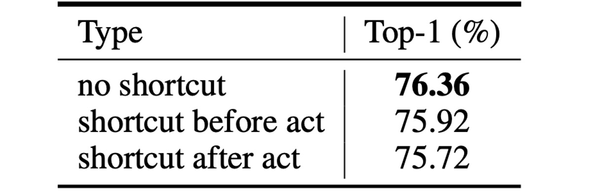

## 香草極簡風

[**VanillaNet: the Power of Minimalism in Deep Learning**](https://arxiv.org/abs/2305.12972)

---

在深度卷積網路流行了十年後，居然還能看見這麼極簡風格的作品。

## 定義問題

在過去幾年間，電腦視覺領域的研究突飛猛進。從一開始的 AlexNet 到現在最新進的 CNN 與 Transformer 的 Hybrid 架構，讓人目不暇給。

為了刷 ImageNet 的榜，研究者們不斷地提高模型複雜度，相對的計算成本和資源需求也急劇上升。不僅如此，複雜的架構也讓部署流程帶來挑戰，像是 ResNet 在操作時會消耗大量的額外記憶體，或是 Swin Transformer 中的移位視窗機制，需要複雜的工程實現，包含了重寫 CUDA 程式碼等。

### 為什麼無殘差的卷積架構不再受到重視？

說的就是 AlexNet 和 VGG。

原因是什麼大家也都懂：因為深度網路結構中存在梯度消失和網路退化的問題。而當年正式 ResNet 提出的殘差結構則有效地解決這個問題。也因此無殘差的網路架構，在準確度方面就是比不過別人，這是無可避免的事實。

簡單架構的網路設計一時之間彷彿走入死胡同，乏人問津。

隨著 AI 晶片的不斷發展，現代 GPU 可以經鬆地進行平行運算，神經網路的推論速度瓶頸已經不再是 FLOPs 或參數量。相比之下，模型得複雜設計和大深度，反而成為速度的阻礙。

直到這時人們愕然發現，原來最後的瓶頸早在出發前就已經悄然注定。

## 解決問題

### 模型架構


本論文的作者提出了一個普通的神經網路架構，稱為 VanillaNet，如上圖。

看到這個架構，時間彷彿回到十年前：

- AlexNet！你怎麼在這裡？

---

和現在的深度網路不同，這裡每個降採樣階段都只有「一層」。

在 Stem 階段，作者使用 stride 為 4 的 $4 \times 4 \times 3 \times C$ 的卷積層，將圖像映射到 $C$ 維的特徵空間。

在第 1 ~ 3 階段，使用 stride 為 2 的 MaxPool 來縮小特徵圖尺寸，並且將通道數增加兩倍。

最後一層是全連接層，用來輸出分類結果。每個卷積層的尺寸都是 $1 \times 1$，最大程度地減少參數量。每個卷積層後面都套用啟動函數，並且使用 BatchNorm 來穩定訓練過程。

這裡沒有殘差連接，也沒有注意力機制，更沒有移位視窗，只有最基本的卷積和池化。

### 這不 Work 啊？

這麼樸實無華的架構，怎麼可能有好的表現？

作者指出，這種設計缺少了關鍵的屬性：「非線性層」。

我們都知道神經網路的強大之處在於它的非線性，這是它能夠擬合複雜函數的關鍵，如何提升這個網路的非線性能力？這個部分後面再看，先繼續看一下另外一個問題：「深度」。

### 深度訓練策略

在卷積神經網路中，卷積層和啟動函數的組合是網路能夠捕捉數據非線性特徵的關鍵。

在訓練的初始階段，作者使用兩個帶有啟動函數的卷積層。這樣設計的目的是讓網路在初始階段具有強非線性能力，從而能夠更好地學習數據的特徵。隨著訓練的進行，逐漸減弱啟動函數的非線性，最終將其轉變為一個恒等映射。

整個啟動函數的變化，可以用以下公式來描述：

$$
A'(x) = (1 - \lambda)A(x) + \lambda x,
$$

其中，$\lambda$是一個隨訓練次數而變化的超參數。在訓練開始時，$\lambda = 0$，此時$A'(x) = A(x)$，表示啟動函數處於全強度狀態；隨著訓練進行，$\lambda$逐漸增大，直到訓練結束時，$\lambda = 1$，此時$A'(x) = x$，啟動函數變為恒等映射。

在訓練結束時，由於啟動函數已經變為恒等映射，兩個卷積層可以合併為一個卷積層，這樣可以減少推理時間，提升模型的運行效率。合併的部分就回到我們熟悉的重新參數化的過程：

- **BatchNorm 的合併**：

  首先將每個 BatchNorm 層與其前面的卷積層合併。

  設卷積層的權重和偏置矩陣分別為 $W \in \mathbb{R}^{C_{out} \times C_{in} \times k \times k}$ 和 $B \in \mathbb{R}^{C_{out}}$，批量歸一化的參數（縮放、平移、均值和方差）分別為$\gamma, \beta, \mu, \sigma \in \mathbb{R}^{C_{out}}$。

  合併後的權重和偏置矩陣為：

  $$
  W'_i = \frac{\gamma_i}{\sigma_i} W_i, \quad B'_i = \frac{(B_i - \mu_i) \gamma_i}{\sigma_i} + \beta_i,
  $$

  其中下標$i$表示第$i$個輸出通道的值。

- **兩個 $1 \times 1$ 卷積層的合併**：

  合併批量歸一化層後，我們進行兩個$1 \times 1$卷積層的合併。

  設 $x \in \mathbb{R}^{C_{in} \times H \times W}$ 和 $y \in \mathbb{R}^{C_{out} \times H' \times W'}$ 為輸入和輸出特徵，卷積可以表示為：

  $$
  y = W * x = W \cdot \text{im2col}(x) = W \cdot X,
  $$

  其中 $*$ 表示卷積操作，$\cdot$ 表示矩陣乘法，$X$ 由 im2col 操作生成，將輸入轉換為與卷積核形狀相應的矩陣。對於 $1 \times 1$ 卷積，我們發現 im2col 操作變為簡單的重塑操作，因此，兩個卷積層的權重矩陣 $W_1$ 和 $W_2$ 可以合併為一個矩陣：

  $$
  y = W1 * (W2 * x) = W1 \cdot W2 \cdot \text{im2col}(x) = (W1 \cdot W2) * X,
  $$

  因此，兩個$1 \times 1$卷積層可以在不增加推理速度的情況下合併。

這種深度訓練策略有以下幾個優勢：

1. **提高模型的非線性能力**：在訓練初期，使用強非線性啟動函數有助於模型捕捉數據中的複雜模式，從而提高模型的表現。
2. **逐漸過渡到簡化模型**：隨著訓練的進行，啟動函數逐漸變為恒等映射，使得最終的模型結構簡化，有助於提升推理速度。
3. **方便的層合併操作**：在訓練結束時，可以輕鬆地將兩個卷積層合併為一個，減少了計算成本，提高了模型的運行效率。

:::tip
整個重新參數化的過程和我們看過的 RepVGG 的概念上是一樣的。

- [**RepVGG: 讓 VGG 再次偉大**](../2101-repvgg/index.md)
  :::

### 序列知曉（Series Informed）啟動函數

根據現有研究的理論證明，簡單和淺層網路的能力有限主要是由於其「**非線性不足**」所致，這與深度和複雜網路不同，因此尚未得到充分研究。

事實上，有兩種方法可以提高神經網路的非線性：

1. **堆疊非線性啟動層**
2. **增加每個啟動層的非線性**

現有網路趨勢選擇前者，但這在平行計算能力過剩時會導致高延遲。

---

一種提高啟動層非線性的直接想法是堆疊，啟動函數的「串行」堆疊是深層網路的核心思想。

相比之下，在這篇論文中，作者選擇「並行」堆疊啟動函數。

設神經網路中對輸入 $x$ 的單個啟動函數為 $A(x)$，可以是常用的 ReLU 或 Tanh 等函數。

啟動函數的並行堆疊可以表示為：

$$
A_s(x) = \sum_{i=1}^{n} a_i A(x + b_i)
$$

其中 $n$ 表示堆疊的啟動函數數量，$a_i$ 和 $b_i$ 是每個啟動函數的縮放和偏移。通過並行堆疊可以大幅增強啟動函數的非線性，上式在數學上可視為一個級數，即「加和」多個數量的操作。

為了進一步增強級數的近似能力，作者使「**基於級數的函數能夠通過變化其鄰域的輸入來學習全局信息**」，這與 BNET 的理念相似。

- [**[23.01] BNET: Batch normalization with enhanced linear transformation**](https://ieeexplore.ieee.org/document/10012548)

給定輸入特徵 $x \in \mathbb{R}^{H \times W \times C}$，其中 $H$、$W$ 和 $C$ 分別是其高度、寬度和通道數，啟動函數表示為：

$$
A_s(x_{h,w,c}) = \sum_{i,j \in \{-n, n\}} a_{i,j,c} A(x_{i+h,j+w,c} + b_c)
$$

其中 $h \in \{1, 2, ..., H\}$，$w \in \{1, 2, ..., W\}$ 和 $c \in \{1, 2, ..., C\}$。

可以看出，當 $n = 0$ 時，基於級數的啟動函數 $A_s(x)$ 退化為普通啟動函數 $A(x)$，這意味著該方法可以被視為對現有啟動函數的通用擴展。在論文中，作者使用 ReLU 作為基本啟動函數來構建級數，因為它在 GPU 上的推理效率很高。

:::tip
在這裡暫停一下，看論文時，你可能會覺得這段敘述有點抽象。

簡單來說，在常見的網路設計中，假設我們有一個 $3 \times 3$ 的卷積層，然後接一個 ReLU，這時候 ReLU 的感受野是 $3 \times 3$；再來是下一層的 $3 \times 3$ 卷積層，再接一個 ReLU，這時候 ReLU 的感受野是 $5 \times 5$，就這樣一路向更深層「串行」下去。

那論文中提到的「並行」堆疊啟動函數是什麼意思呢？

就是我們直接「加大」卷積核的尺寸，讓它的感受野變大。堆疊一層就等價於使用 $3 \times 3$ 的卷積；堆疊兩層就等價於使用 $5 \times 5$ 的卷積；堆疊三層就等價於使用 $7 \times 7$ 的卷積，以此類推。

這裡我們可以直接看一下實作，可以清楚理解這個概念：

```python
# Ref: VanillaNet
#     https://github.com/huawei-noah/VanillaNet/blob/main/models/vanillanet.py
import torch
import torch.nn as nn

class activation(nn.ReLU):

    def __init__(self, dim, act_num=3, deploy=False):
        super(activation, self).__init__()
        self.act_num = act_num
        self.deploy = deploy
        self.dim = dim
        self.weight = nn.Parameter(torch.randn(dim, 1, act_num*2 + 1, act_num*2 + 1))
        if deploy:
            self.bias = nn.Parameter(torch.zeros(dim))
        else:
            self.bias = None
            self.bn = nn.BatchNorm2d(dim, eps=1e-6)
        weight_init.trunc_normal_(self.weight, std=.02)

    def forward(self, x):
        if self.deploy:
            return nn.functional.conv2d(
                super(activation, self).forward(x),
                self.weight, self.bias, padding=self.act_num, groups=self.dim)
        else:
            return self.bn(nn.functional.conv2d(
                super(activation, self).forward(x),
                self.weight, padding=self.act_num, groups=self.dim))
```

你直接看 `def forward(self, x):` 的部分，這裡先對輸入使用 ReLU 啟動函數，然後再使用 `nn.functional.conv2d` 進行卷積操作，這個卷積操作的卷積核是 `self.weight`，這個卷積核的尺寸是 `act_num*2 + 1`，意思就是堆疊了 `act_num` 層的啟動函數。

最後，這些操作都是逐通道進行的，你可以看到上面的 `groups=self.dim` 參數，這是 PyTorch 中的 `groups` 參數，表示對每個通道進行獨立的卷積操作。

:::

## 討論

剛才提到的淺層網路的能力有限主要是由於其「非線性不足」，現在加入了並行堆疊的啟動函數，這樣的設計是否能夠提高模型的性能呢？

### 消融實驗 - 啟動函數


上表顯示了 VanillaNet 使用不同數量的 n 的效能。

原始的網路結構在 ImageNet 資料集上只能達到 60.53% 精度，這是無法在實際應用中使用的。

當 n = 1 時，精度提高到 74.53%，這裡出現了一個巨大的進步；當 n = 3 時，精度和推論速度達到一個最好的權衡點。

### 消融實驗 - 深度訓練策略


由於 VanillaNet 結構非常淺層，作者提出增加訓練中的非線性來提升其性能。

上表分析了所提出的深度訓練技術的有效性，結果顯示：原始的 VanillaNet 達到了 75.23% 的 top-1 準確率，這是基準值。通過使用深度訓練技術，所提出的 VanillaNet 可以達到 76.36%的準確率。這些結果表明，所提出的深度訓練技術對淺層網路是有用的。

此外，作者進一步將深度訓練和序列啟動函數應用到其他網路中，以展示這兩種技術的泛化能力。

上表報告了在 ImageNet 數據集上，兩個經典深度神經網路 AlexNet 和 ResNet-50 的結果。原始的 AlexNet 僅能達到 57.52% 的準確率（12 層結構）。

通過應用所提出的深度訓練和序列啟動函數，AlexNet 的性能可以大幅提升約 6%，這表明所提出的技術對淺層網路非常有效。

對於結構相對複雜的 ResNet-50，性能提升較小。這一結果表明，深度和複雜的網路已經具有足夠的非線性，不需要額外的技術來提升。

### 消融實驗 - 殘差連接



最後，一般網路結構所流行的殘差連接的效果如何呢？

作者透過實驗證明，在淺層的網路結構中，使用殘差連接並不能提高性能，反而會降低模型的準確率。

一個比較直觀的解釋是淺層網路的瓶頸不是恆等映射，而是「弱非線性」。因此捷徑對於提高非線性沒有用處，因為殘差連接會跳過啟動函數來減少深度，從而導致性能降低。

### ImageNet 上的性能


為了說明所提出方法的有效性，作者在 ImageNet 資料集上進行了實驗。

這個資料集由 224 × 224 像素的 RGB 彩色影像組成，包含 128 萬張訓練影像和 5 萬張驗證影像，涵蓋 1000 個類別。他們利用強正則化，因為所提出的 VanillaNet 每層都有大量參數，可以從非線性有限的影像中捕捉有用的信息。

延遲測試在 Nvidia A100 GPU 上進行，並且作者提出了具有不同層數的 VanillaNet 架構。為了驗證這些架構的性能，他們以 batch size 為 1 進行測試，這意味著 AI 晶片有足夠的運算能力來處理每個網路。

在這種情況下，研究發現推理速度與 FLOPs 數量和參數的關係不大。例如：雖然 MobileNetV3-Large 的 FLOPs 非常低（0.22B），但其 GPU 延遲為 7.83ms，甚至比具有 11.9B FLOPs 的 VanillaNet-13 還要高。

研究顯示，在這種設置下，推理速度與網路的複雜度和層數高度相關。例如，ShuffleNetV2x1.5 和 ShuffleNetV2x2 的推理速度差異不大（7.23ms 和 7.84ms），儘管它們的參數數量和 FLOPs 相差很大（0.3B vs 0.6B），這是因為它們的差異僅在於通道數量。

研究還發現，包括 ResNet、VGGNet 和 VanillaNet 在內的簡單架構，無需額外的分支和複雜區塊（如擠壓和激勵區塊或密集連接）就能實現最高的推理速度。


## 結論

VanillaNet 憑藉在效率和準確性方面的複雜架構超越了當代網路，凸顯了深度學習中極簡方法的潛力。

這項研究挑戰了基礎模型的既定規範，並為精細和有效的模型架構建立了新的軌跡。
