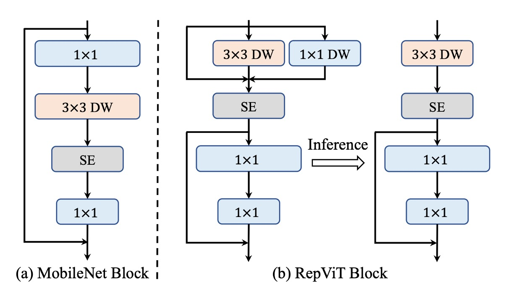
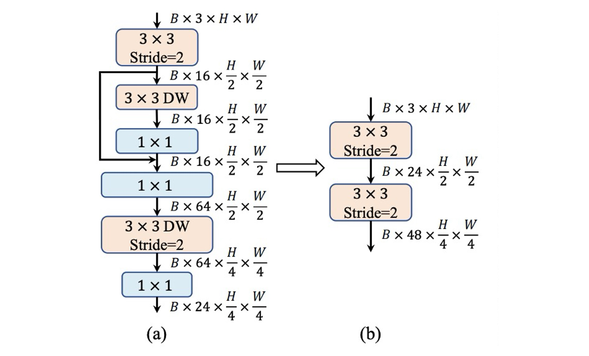
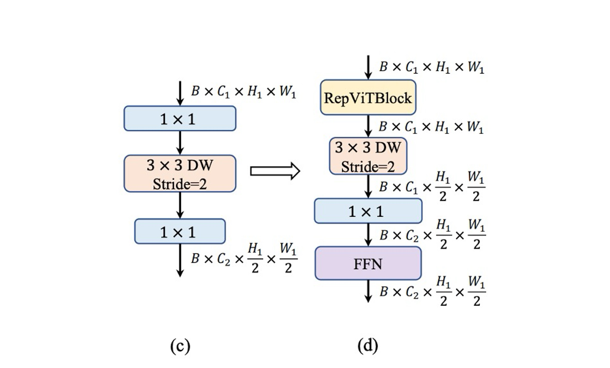

# [23.07] RepViT

## 參考 ViT 的觀點

[**RepViT: Revisiting Mobile CNN From ViT Perspective**](https://arxiv.org/abs/2307.09283)

---

重新參數化的研究如火如荼，逐漸蔓延到不同的模型架構。

本篇論文的目標是將 MobileNet-V3 重新參數化，和過去幾篇論文不一樣的地方是：

- 我們這次是從 ViT 的觀點開始看起。

## 定義問題

輕量視覺模型的研究主要分為兩個派系：

1. **基於 CNN 的研究**：這裡的代表作品是 MobileNet 系列，透過深度可分離卷積來減少參數量，利用倒置殘差瓶頸結構來增加模型的表達能力。
2. **基於 ViT 的研究**：這裡的代表作品是 MobileViT、Mobileformer 和 FastViT 等，主要透過 MetaFormer 架構來保持模型的表達能力。

:::tip
沒看過 MetaFormer 的讀者可以參考：

- [**[21.11] PoolFormer: 你需要的是框架！**](../../vision-transformers/2111-poolformer/index.md)
- [**[22.10] CAFormer: MetaFormer 使用說明書**](../../vision-transformers/2210-caformer/index.md)
  :::

---

兩種派系之間彷彿有個不可逾越的鴻溝？

本篇論文的目標就是要跨越這個鴻溝，將 MobileNet-V3 重新設計，並從 ViT 的角度重新思考。

## 解決問題

### 重新設計架構

首先，我們就拋開所有參數量和 FLOPs 的限制，因為這裡主要的目標就是 Latency！

要快，要更快，要非常快！

---

一切從 MobileNet-V3 開始，參考最近輕量級的 ViT，他們大多採用 DeiT 的訓練方法。

這裡採用的訓練方式為：

- 使用 AdamW 優化器
- 使用 Cosine 學習率衰減，訓練 300 epochs
- 使用 RegNetY16GF 網路進行知識蒸餾
- 影像增強方式採用：Mixup、RandAugment 和 Random Erasing

所以接著所有模型都用這種訓練方式，統一標準。

:::tip
沒看過 DeiT 的讀者可以參考：

- [**[20.12] DeiT: 蒸餾後更香醇**](../../vision-transformers/2012-deit/index.md)
  :::

### 重新參數化結構

接著調整 MobileNet-V3 的結構。

在 MetaFormer 中，我們知道 Transformer 的成功原因是把資訊交換分成兩個部分：

1. Token 之間的資訊交換，在影像中，對應的是圖像的全局資訊交換。
2. 特徵之間的資訊交換，在影像中，對應的是圖像的通道資訊交換。

但是在 MobileNet 的結構中，這兩件事情被耦合在一起，如上圖左邊：

- 首先用 $1x1$ 的卷積，這裡是「通道」資訊交換
- 接著用 $3x3$ 的深度卷積，這裡是「全局」資訊交換
- 接著經過一個 $SE$ 層，這裡是「全局與通道」資訊交換
- 最後是 $1x1$ 的卷積，這裡是「通道」資訊交換

於是作者先將他們分開，改成上圖右邊的結構：

- 首先是「全局」資訊交換，這裡用 $3x3$ 的深度卷積。另外，為了提升推論速度，這裡換成重新參數化的結構。
- 接著是使用 $SE$ 層，這裡是「全局與通道」資訊交換
- 最後是 $1x1$ 的卷積，這裡是「通道」資訊交換

這樣就成功分開了「全局」和「通道」資訊交換，並且提升了 20% 的推論速度。

---

速度快了，精度也掉了。

接著要想辦法補救。

### 降低膨脹比並增加寬度

在普通 ViT 中，通道混合器中的擴展比通常設定為 4，使得前饋網路 (FFN) 模組的隱藏維度比輸入維度寬 4 倍；在 MobileNet-V3 中還達到了 6 倍。因此，它消耗了很大一部分計算資源，從而大大增加了整體推理時間。

而過去許多研究也指出 FFN 中存在大量的冗餘資訊，實際上我們不需要這麼高的膨脹比。

- [**[21.04] LeViT: a Vision Transformer in ConvNet's Clothing for Faster Inference**](https://arxiv.org/abs/2104.01136)
- [**[21.04] All Tokens Matter: Token Labeling for Training Better Vision Transformers**](https://arxiv.org/abs/2104.10858)
- [**[22.12] SAViT: Structure-Aware Vision Transformer Pruning via Collaborative Optimization**](https://proceedings.neurips.cc/paper_files/paper/2022/hash/3b11c5cc84b6da2838db348b37dbd1a2-Abstract-Conference.html)
- [**[23.10] NViT: Vision Transformer Compression and Parameter Redistribution**](https://openreview.net/forum?id=LzBBxCg-xpa)

作者在這裡決定採用 2 倍的膨脹比，並且同時增加模型的寬度，以保持模型的表達能力。

---

經過這個操作，精度回來了，還超越了原始的 MobileNet-V3，達到 73.5%。

### Stem 結構調整

ViT 通常使用 patchify 操作作為主幹，將輸入影像劃分為不重疊的 Patch，這些簡單的 Stem 結構通常是一個大核 $16x16$ 卷積。在分層 ViT 中，也是用 patchify 的操作，不過用的是 $4x4$ 的卷積。

相比之下， MobileNet-V3 的 Stem 結構非常複雜，包含了 $3x3$ 的卷積、深度可分離卷積和倒置殘差瓶頸結構，如上圖 (a) 所示。

由於 Stem 結構會以最高解析度處理輸入圖像，因此複雜結構會在行動裝置上遇到嚴重的速度瓶頸，作為權衡，MobileNet-V3 的 Stem 結構被給予相當少的濾波器（只有 16 個通道），這又反過來限制了 Stem 結構的表示能力。

為了解決這個問題，作者採用早期卷積的方式，配置兩個 $3x3$ 的卷積，且設定 stride 為 2，這樣可以減少計算量。同時增加濾波器的通道數量，以提升模型的表達能力，如上圖 (b) 所示。

### 降採樣結構調整

MobileNet-V3 只透過一個 stride 為 2 的深度分離卷積來進行降採樣，這樣的結構在速度上有優勢，但是這種設計可能缺乏足夠的網路深度，導致資訊遺失並對模型效能產生負面影響，如上圖 (c) 所示。

為了解決這個問題，作者採用了更複雜的降採樣結構，如上圖 (d) 所示。這個結構包含了 stride 為 2 的深度分離卷積執行下採樣和調整通道維度，接著在前面加一個 RepViT 模塊，最後把 FFN 模組放在 $1x1$ 卷積之後，以記住更多的潛在資訊。

### 簡單分類器

在輕量級的 ViT 中，分類器通常由全域平均池化和一個線性層組成，這種架構在行動裝置上的速度很快。

相較之下，MobileNet-V3 的分類器包含了一個 $1x1$ 的卷積和一個額外的線性層，將特徵拓展到更高維的空間，如上圖 (e) 所示，這個設計對 MobileNet-V3 而言非常重要，但是在行動裝置上會增加推理時間。

作者在這裡放棄 MobileNet-V3 的設計，改用一個簡單全域平均池化和一個線性層組成最後的架構。

---

這個設計又讓速度回到 0.77 ms，但是精度又掉了！

### 階段比例調整

在過去的研究中，大家都遵循著 1:1:3:1 的階段比例，這樣的設計在模型的表達能力和速度之間取得了一個平衡。

- [**[19.05] On network design spaces for visual recognition**](https://arxiv.org/abs/1905.13214)
- [**[20.03] Designing network design spaces**](https://arxiv.org/abs/2003.13678)

在近幾年的研究指出：更激進的比例對小模型來說可能更有利，像是 Conv2Former-T 和 Conv2Former-S 就分別採用了 1:1:4:1 和 1:1:8:1 的比例。

- [**[22.11] Conv2Former: A Simple Transformer-Style ConvNet for Visual Recognition**](https://arxiv.org/abs/2211.11943)

作者這裡採用了 1:1:7:1 的比例，深度增加到 2:2:14:2，實現更深的網路佈局。

這個操作終於成功挽回了損失的精度，達到了 76.9%。

### 內核大小的選擇

在過去研究中，在小型網路中採用大核卷積（例如 $5x5$ 或 $7x7$），可以有效地提升模型的表達能力。

但是在行動裝置上，大核卷積沒辦法享受到加速的好處，一般硬體不會對大核卷積進行優化。

為了確保在行動裝置上的推理效率，作者在所有模組中優先考慮 $3x3$ 卷積。

這個操作不會掉精度，同時可以將推理時間降到 0.89 ms。

### Sqeeze-and-Excitation 的抉擇

在過去的研究中，SE 模塊被廣泛應用在各種網路架構中，可以有效地提升模型的表達能力。

- **但是 SE 模塊真的很慢！**

既然想要享受到 SE 模塊的好處，又不想要影響速度，作者採用折衷的方式：

- **將 SE 模塊放「一點點」，只在每個階段的第 1、3、5...區塊中使用。**

## 討論

### ImageNet-1K 上的性能

實驗使用了標準的 224×224 像素影像尺寸來進行訓練和測試，並且測試了多種模型的表現，包括使用了不同訓練週期數的模型（300 或 450 週期）。

這裡的主要實驗結果可以分為以下幾個要點：

1. **模型性能比較**：

   - RepViT 模型在各種尺寸下均表現出色，與其他最先進的模型相比具有明顯的優勢。例如，在相似延遲條件下，RepViT-M0.9 的 top-1 準確率分別比 EfficientFormerV2-S0 和 FastViT-T8 高出 3.0% 和 2.0%。此外，RepViT-M1.1 也比 EfficientFormerV2-S1 高出 1.7%。

2. **延遲與準確率**：

   - RepViT-M1.0 在 iPhone 12 上以 1.0 毫秒的延遲實現了超過 80% 的 top-1 準確率，這是輕量級模型的一項創新突破。
   - 我們的最大模型 RepViT-M2.3 則在僅有 2.3 毫秒延遲的情況下，達到了 83.7% 的準確率，展示了優秀的性能和高效的延遲控制。

3. **知識蒸餾的影響**：

   即使在沒有使用知識蒸餾的情況下（下表），RepViT 模型仍然在不同延遲水平下顯示了顯著的性能優勢。例如，在 1.0 毫秒的延遲下，RepViT-M1.0 的準確率比 MobileOne-S1 高出 2.7%。對於更大的模型，RepViT-M2.3 比 PoolFormer-S36 的準確率高出 1.1%，並且延遲減少了 34.3%（從 3.5 毫秒減少至 2.3 毫秒）。

   

### 消融實驗 - 重新參數化的結構

為了驗證 RepViT 區塊中重新參數化的結構的有效性，作者在訓練時刪除 SR 的多分支拓撲來對 ImageNet-1K 進行消融研究。

如上表所示，如果沒有重新參數化的結構，RepViT 的不同變體都會遭受一致的性能下降。

### 消融實驗 - SE 層的影響

為了驗證在所有階段以跨區塊方式利用 SE 層的優勢，作者透過刪除所有 SE 層（即「w/o SE」）並在每個區塊中採用 SE 層（即，「每個區塊」）。

如上表所示，在區塊中交替採用 SE 層顯示了準確性和延遲之間更有利的權衡。

## 結論

這個架構是第一個在 iPhone12 上，可以基於 1ms 內的推論速度下，在 ImageNet 1K 上精度達到 80% 以上的架構，非常有看點。

在這篇文章中，作者們對輕量級 CNN 的高效設計進行了深入的探索，並結合了輕量級 ViT 的創新架構，推出了全新的 RepViT 系列。

這款針對資源受限行動裝置設計的輕量級 CNN 模型，顯示出在各種視覺任務中的優越性能。RepViT 不僅在準確率上超越了當前最先進的輕量級 ViT 和 CNN，還在延遲方面展現了卓越的表現。

作者們期望 RepViT 成為輕量級模型設計的堅實基線，並激勵更多對於輕量級模型的研究和創新，推動該領域的進一步發展。

:::tip
RepViT 在使用上比較讓人卻步的地方是參數量偏大，但其實現在行動裝置的容量都很充裕，無奈仍然有大量的客戶非常在意模型的大小，這也是我們不敢貿然使用這個架構的原因。

因此如果你的開發場景中不受模型大小的限制，只在乎精度和推論時間的話，RepViT 將是一個非常好的選擇。
:::
