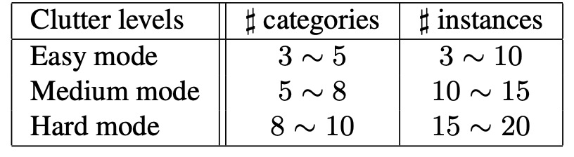
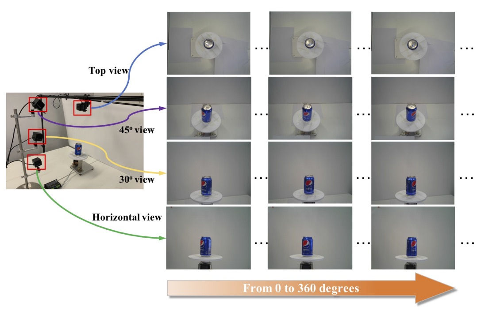
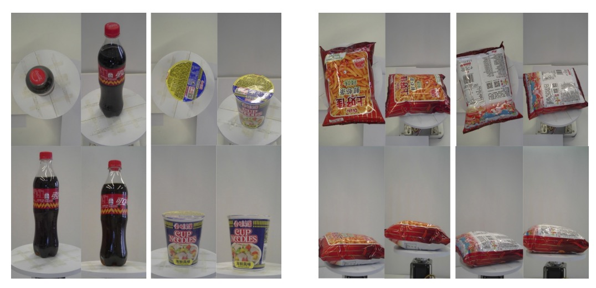

## 老闆，買單！

[**RPC: A Large-Scale Retail Product Checkout Dataset**](https://arxiv.org/abs/1901.07249)

---

這篇論文做一個新的資料集，叫做 RPC（Retail Product Checkout）。

我們發現很多和相關論文都會用到這個資料集。不僅如此，從這篇論文出發查找文獻，能更快速地找到最新的研究成果。

這麼重要的節點，你肯定也不能錯過。

:::info
**資料集下載**：[**https://rpc-dataset.github.io/**](https://rpc-dataset.github.io/)

**排行榜**：[**RPC-Leaderboard**](https://github.com/RPC-Dataset/RPC-Leaderboard?tab=readme-ov-file)
:::

## 定義問題

在傳統零售業中，「辨識商品」這件事佔據了大量人力成本。隨著電腦視覺技術逐漸成熟，自動結帳（Automatic Check-Out, ACO）這個應用場景開始受到關注。它的目標是：**從顧客購買商品的影像中，自動生成對應的購物清單**，取代人工掃描、提升效率並降低成本。

但是，這不是一個單純的分類或偵測任務，ACO 同時具備以下幾個挑戰特性：

- **大規模（large-scale）**：商品類別數量龐大，超市中常見的 SKU 往往超過上千種；
- **細粒度（fine-grained）**：許多商品外觀極為相似，差異可能僅在小標籤或包裝細節；
- **少樣本（few-shot）**：大多數商品只能蒐集到極少的訓練樣本；
- **跨域（cross-domain）**：訓練資料通常為展示用的乾淨單品照，測試場景則來自真實結帳畫面，背景混亂、商品堆疊、光線不穩、遮擋嚴重，產生明顯 domain gap。

這些因素在電腦視覺中本就分別構成重大難題，而 ACO 的挑戰在於：**這些問題同時存在！**

過去也有一些資料集嘗試處理其中部分問題，例如：

- **SOIL-47** 測試光照與視角變化的影響；
- **Supermarket Produce Dataset** 聚焦於水果與蔬菜分類；
- **Grozi-120 / Grocery Products / Freiburg Dataset** 收錄網路圖與店鋪實景圖；
- **MVTec D2S** 提供 pixel-level 分割標註，用於工業物件語意分割。

但這些資料集通常類別數量有限，或是拍攝場景過於簡化，與真實結帳流程相去甚遠。它們多半只解決單一子任務，無法同時測試「堆疊、多類、遮擋」等真實難題。

資料量不足也讓學習模型更為困難。雖然傳統 data augmentation 方法（翻轉、平移、色彩擾動等）能略為擴充資料分佈，但無法真正模擬測試場景的雜訊與語意組合。

所以，最根本的問題在於：

> **我們能不能建立一個足夠大、足夠多樣化的資料集，能同時涵蓋上述所有挑戰？**

---

## 資料集設計理念

<figure style={{"width": "70%"}}>

</figure>

在現實零售場景中，顧客將商品放上結帳台時，ACO 系統的理想目標是：

> **一眼就能辨識出商品的種類與數量，並自動產出購物清單**。

與其說這是「分類」或「偵測」，不如說它更接近一種「**多物件計數與辨識的組合任務**」。

從定義上來看，ACO 的輸入是一張拍攝於結帳場景的影像，其中可能包含任意數量、任意組合的商品。而我們擁有的訓練資料，卻往往只有單品照。

:::tip
**什麼是單品照？**

單品照，原文為 **single-product exemplar image**，指的是專門拍攝單一商品的圖像。這些圖像通常用於電商平台或商品目錄中，目的是清楚展示商品外觀與細節。
:::

真正困難的地方在於：商品庫存清單持續更新，要蒐集涵蓋所有商品組合的結帳影像幾乎不可能。因此，一種更實際的做法，是利用這些單品資料進行訓練，**在完全未見過商品堆疊的情況下，讓模型學會在混亂中辨識出多物件、多種類、多數量。**

這樣的問題可被形式化為：

- 給定一組商品類別集合 $P = \{p_i\}$，與一張測試影像 $I_t$。
- 目標即：預測所有在該影像中出現過的商品 $p$ 的出現次數 $\text{count}(p)$。
- 如果某商品未出現，則 $\text{count}(p) = 0$。

可使用的訓練資源包含：

- 一組單品影像資料集 $S = \{(I_s, y_s)\}$，每張圖對應一項商品類別；
- 一組可選的結帳影像資料集 $C = \{(I_c, Y_c)\}$，其中 $Y_c$ 可能包含不同程度的標註資訊。

這樣的設定極具挑戰性，也提供了探討「分類、計數、偵測、弱監督、domain shift」等任務交集的空間。

---

## 資料集設計

針對上述挑戰，作者設計了 RPC（Retail Product Checkout）資料集，有六大關鍵特色：

1. **大規模商品種類與樣本數**

   - 共收錄 **200 種商品類別（SKU）**，每類約 4 件實體商品，共取得 **83,739 張圖像**。
   - 其中包含 53,739 張單品 exemplar 圖，以及 30,000 張結帳影像，規模遠大於既有公開資料集。

        

        <figure style={{"width": "70%"}}>
        
        </figure>
        

        

        <figure style={{"width": "70%"}}>
        
        </figure>
        

2. **雙類型影像：單品圖與堆疊圖**

   - 單品 exemplar 圖：多角度拍攝的商品清楚圖，模擬電商網頁商品圖。
   - 結帳影像：在模擬結帳台上拍攝，包含多個商品、視角固定、堆疊與真實遮擋情況。

3. **場景擬真**

   - 商品在結帳圖中為隨機挑選、隨機數量、任意擺放；
   - 含有大量遮擋、旋轉、多物件重疊，模擬實際零售流程的複雜性。

4. **層級式商品分類結構**

   - 所有商品共分為 **17 個上位類別（meta-categories）**，如瓶狀、盒狀、袋狀等。
   - 有助於模型學習類別間語意結構，亦可作為輔助監督訊號，或階層分類的研究方向。

5. **雜亂程度標註**

    

    <figure style={{"width": "60%"}}>
    
    </figure>
    

   - 根據每張結帳圖中的商品種類與數量，將其劃分為三種 clutter level，有助於分析模型在不同複雜度場景下的表現穩定性。

6. **三種監督強度**

    

    <figure style={{"width": "90%"}}>
    
    </figure>
    

   - **弱監督**：購物清單（僅提供商品種類與數量）；
   - **中監督**：點位標註（標示每個商品的中心點與類別）；
   - **強監督**：邊界框（完整標示每個商品的 bounding box 與類別）。

這些設計讓 RPC 成為一個高度可擴充的 benchmark，不僅能評估模型辨識與計數能力，更能延伸至弱監督偵測、domain adaptation、多尺度分類等多種研究路徑。

## 資料建構流程

本資料集共收錄 **200 個零售商品類別（SKU）**，依照外觀與功能分為 **17 個上位類別（meta-categories）**，涵蓋從食品到生活用品的多元型態：

> puffed food、dried fruit、dried food、instant drink、instant noodles、dessert、drink、alcohol、milk、canned food、chocolate、gum、candy、seasoner、personal hygiene、tissue、stationery。

這些類別對應的外觀結構多樣，從瓶狀、盒狀、罐狀到袋狀都有涵蓋。

同一 meta-category 下的 SKU 通常具有高度外觀相似性，例如同樣是「果汁」，可能只差一條文字或標籤顏色，這正是 ACO 任務中最棘手的「細粒度辨識」難題之一。

---

### 單品 exemplar 圖像

<figure style={{"width": "90%"}}>

</figure>

為了獲得每個商品在多視角下的外觀資訊，作者設計了一套自動化拍攝流程：

- 使用 **四台固定視角攝影機**，分別對應：上視角（top view）、水平視角（side view）、30° 與 45° 斜視角；
- 每個商品被放置於可旋轉的 **360 度轉盤** 上，每 9 度拍攝一次，共取得 40 張圖像；
- 每台攝影機各拍攝 40 張 → 每個 SKU 共產生 **160 張視角圖像**；
- 若商品具有上下外觀差異（如盒狀、袋狀），則會進行「翻面後再重拍一次」，以補齊底部特徵。

最終，這一階段共拍攝 **53,739 張 exemplar 圖像**，全部為**乾淨背景、多視角、單一商品**的樣貌，對應於訓練階段常見的 source domain 圖像。

<figure style={{"width": "70%"}}>

</figure>

---

### 結帳影像的構建流程

<figure style={{"width": "80%"}}>

</figure>

與 exemplar 不同，結帳圖像的目標是模擬真實結帳情境，因此設計上刻意導入混亂與遮擋：

- 拍攝背景為一張 **80cm × 80cm 白板**，攝影機從正上方拍攝，解析度為 1800 × 1800；
- 每張圖中放置的商品種類與數量均為隨機組合，但依據預設的「雜亂程度」進行控制；
- 商品會隨機擺放、角度任意、不進行人工對齊，進一步模擬多件商品堆疊的真實情境。

根據遮擋與密度程度，資料集將結帳圖像分為三種雜亂等級：

| 雜亂等級 | 商品種類數         | 商品實例總數 | 特徵                     |
| -------- | ------------------ | ------------ | ------------------------ |
| Easy     | 少（例如 3–5 種）  | 總數低       | 幾乎無遮擋，間距大       |
| Medium   | 中（例如 6–10 種） | 總數中等     | 偶有遮擋，有一定密度     |
| Hard     | 多（超過 10 種）   | 總數高       | 高度堆疊與遮擋，難以辨識 |

每個雜亂等級都各收錄 10,000 張圖像，總計構成 **30,000 張結帳圖像**。

## 評估指標

自動結帳任務的目標是：**正確預測一張影像中所有商品的種類與數量**。

為了量化模型在這類任務上的表現，RPC 資料集提出了一套針對 ACO 任務設計的專屬評估指標，從單張影像準確性、數量誤差、類別層次表現到語意一致性皆有考量。

以下是主要的四個核心指標。

### Checkout Accuracy（cAcc）

cAcc 代表整體準確率。

ACO 系統的最終目的是在**一張影像中，完整預測出購物清單**，因此最核心的指標是：

> **若模型預測的所有商品種類與數量皆與 GT 完全一致，則該張影像判定為「正確」。**

這項指標的公式如下：

$$
cAcc = \frac{1}{N} \sum_{i=1}^{N} \delta \left( \sum_{k=1}^{K} |P_{i,k} - GT_{i,k}|, 0 \right)
$$

- $P_{i,k}$：模型對第 $i$ 張影像中第 $k$ 類商品的預測數量；
- $GT_{i,k}$：該類商品的真實數量；
- $\delta(\cdot)$：若預測完全正確（所有類別皆 0 誤差）則回傳 1，否則為 0。

這是一個極為嚴格的指標，只要預測錯一件商品，就會判定該張影像不通過。

### Average Counting Distance（ACD）

ACD 表示平均數量誤差。

若不要求「完全正確」，而是評估模型平均犯錯幾次，可採用 ACD：

> **衡量每張影像中，模型對所有類別的總體預測誤差（L1 距離）。**

公式如下：

$$
ACD = \frac{1}{N} \sum_{i=1}^{N} \sum_{k=1}^{K} |P_{i,k} - GT_{i,k}|
$$

這項指標適合用於比較模型在數量預測上的精度，與分類準確無關，只在意「錯了幾件」。

---

### Mean Category Counting Distance（mCCD）

mCCD 表示類別平均誤差比率，其將注意力放在各商品類別的辨識難度上：

> **衡量模型在每個類別上，預測誤差與實際數量的比例，平均所有類別。**

公式如下：

$$
mCCD = \frac{1}{K} \sum_{k=1}^{K} \frac{ \sum_{i=1}^{N} |P_{i,k} - GT_{i,k}| }{ \sum_{i=1}^{N} GT_{i,k} }
$$

這項指標反映了模型是否在某些類別（如細粒度商品）上容易高估或低估，可用來評估類別不平衡問題與長尾分布下的預測穩定性。

---

### Mean Category IoU（mCIoU）

mCIoU 表示購物清單相似度。

最後，作者定義了一個類似 IoU（Intersection over Union）的指標，用來衡量預測與實際購物清單在語意層次上的接近程度：

$$
mCIoU = \frac{1}{K} \sum_{k=1}^{K} \frac{ \sum_{i=1}^{N} \min(P_{i,k}, GT_{i,k}) }{ \sum_{i=1}^{N} \max(P_{i,k}, GT_{i,k}) }
$$

- 若某類商品預測數量與實際數量越接近，該項在分子與分母中比值越高；
- 若預測為 0 或實際為 0，IoU 值會趨近於 0。

mCIoU 是一項**語意導向、可容忍小誤差**的指標，特別適合用來分析「即便不完全正確，模型是否能抓對主體內容」。

## 基準方法實驗

由於自動結帳問題本身是跨域、少樣本、細粒度的複合型任務，目前尚無統一的解法架構。

為建立 RPC 資料集上的 benchmark，作者嘗試將 ACO 問題視為一種 **cross-domain detection task**，並提出四種逐步遞進的基線方法，全部僅使用 exemplar 單品圖進行訓練，不依賴結帳圖的標註。

---

### Single

這個方法是直接用 exemplar 訓練 FPN。

最直覺的策略，是直接將單品 exemplar 圖作為監督資料，訓練一個物件偵測模型。作者選用 **Feature Pyramid Network (FPN)** 作為 backbone。

然而這個 baseline 幾乎無法泛化到結帳圖，因為 exemplar 是單物件、無遮擋的乾淨圖，而測試資料卻是多物件、堆疊遮擋、光影混亂的 domain。這個 domain gap 使得模型即使在 easy 模式下也表現極差，成為最弱的 baseline。

---

### Syn

這個策略是合成結帳場景圖進行訓練。

為了縮小這個 domain gap，第二種方法將 exemplar 商品圖「剪下貼上」，**合成出模擬結帳的圖像**。具體步驟如下：

- 使用顯著區域分割與 CRF（條件隨機場）後處理取得商品 mask；
- 將多個商品隨機貼到空白背景上，建立多物件堆疊場景；
- 依據不同 clutter 等級規則，合成出 **10 萬張**訓練用的合成結帳圖。

這種策略讓訓練資料更接近測試場景，cAcc 提升明顯，尤其在 easy clutter 模式下提升約 **18%**，但在 medium 與 hard 模式仍表現有限，說明純合成圖仍不足以填補風格與雜訊的 domain gap。

---

### Render

<figure style={{"width": "50%"}}>

</figure>

這個方法採用 Cycle-GAN 跨域風格轉換。

如上圖所示，左邊是簡單拼貼的合成結帳圖，右邊是經過 Cycle-GAN 風格轉換後的圖像，看起來更自然、更接近真實結帳場景，整體流程為：

- 對合成圖進行 Cycle-GAN 翻譯，使其風格更接近真實結帳圖；
- 使用翻譯後圖像訓練 FPN 偵測器。

這種 **domain translation** 策略顯著提升泛化能力，在各 clutter 模式下皆有穩定成長，證明 Cycle-GAN 能有效填補視覺風格落差，強化 cross-domain detection 能力。

---

### Syn+Render

最後一種策略是混合資料訓練，提升樣本多樣性。

作者嘗試將 **render 後的資料**與**原始 synthetic 合成圖**混合訓練，期望透過樣本多樣性進一步提升模型泛化能力，結果顯示比單獨使用 Syn 或 Render 效果更佳。

這說明資料風格的一致性（render）與樣本組合的多樣性（syn）兩者可互補，有助於模型學習更穩健的判斷邊界。

---

### 詳細評估表格

<figure style={{"width": "90%"}}>

</figure>

實驗同時採用：

- ACO 任務指標（cAcc、ACD、mCCD、mCIoU）；
- 標準偵測指標（mAP\@50, mmAP）。

訓練設定如下：

- 輸入圖像縮放最短邊為 800px；
- 使用同步 SGD，兩張圖/卡 × 2 GPU；
- 每張圖最多採樣 512 個 RoI；
- 起始學習率 0.02，60K iter 後降為 0.002；
- 各 clutter 模式中，使用 2,000 張圖作驗證集，8,000 張作測試集。

實驗結果顯示：即使是最佳 「Syn+Render」，在 medium 與 hard 模式下的表現仍未達實用水準。這表示 ACO 的難度不僅來自 domain shift，還包含堆疊遮擋、細粒度辨識與長尾分布。

儘管在 mAP 指標下表現良好（如 hard 模式下達到 **72.72% mmAP**），但從 cAcc 角度看仍遠遠不足，**正確辨識整張圖的完整購物清單**仍是一項極嚴格的任務要求。

失敗案例分析指出主要錯誤來源包含：

1. 漏檢（missed detection）；
2. 密集排列造成遮擋；
3. 細粒度商品誤辨；
4. 誤判（false positives）。

這些挑戰也為後續研究指出明確方向：**弱監督、多視角融合、語意對齊、樣本生成多樣性**皆是未來可挖掘的切入點。

:::tip
這篇論文提到所使用的架構是 FPN，但沒有說明是用 ResNet-50 還是 ResNet-101。

在另外一篇 DPNet 論文中有提到在比較中使用的架構是 ResNet-101，所以這裡我們假設是 ResNet-101。

參考文獻如下：[**[19.04] Data Priming Network for Automatic Check-Out**](https://arxiv.org/abs/1904.04978)
:::

## 未來研究方向

雖然本文以 cross-domain detection 為切入點建立了 RPC 的 baseline，但 ACO 任務的本質遠比單一解法更為開放與多元。RPC 資料集提供了可彈性擴展的結構與標註方式，因此也啟發了許多值得探索的潛在研究路線：

- **線上學習與動態擴充**：

  現實情境中，商品清單並非固定不變，新品持續上架意味著系統需要**具備即時學習與增量更新的能力**。如何不重訓整個模型，快速將新商品納入辨識範圍，構成一個典型的 online learning 問題。特別是 ACO 的跨域與細粒度特性讓這項任務更加困難，可能需要全新的架構與策略設計。

- **跳過偵測的清單預測模型**：

  一種不同的方向，是**不透過 bounding box 或偵測流程**，而直接從結帳影像預測購物清單，將問題轉化為一種多類別多實例的**物件計數（object counting）任務**。

  但與傳統 counting 任務不同，ACO 涉及數百種物件、極少樣本、外觀高度相似，因此可視為一種全新形式的跨類別計數問題。

- **混合監督的學習架構**：

  RPC 提供了三種監督強度的 checkout 標註（list-level, point-level, bbox-level），但如何有效結合這些異質標註資源，設計一個**具適應性與抽象能力的混合監督學習框架**，仍是一個尚未解決的開放問題，尤其在數據收集成本極高的場域下格外重要。

- **延伸至其他電腦視覺任務的應用場景**：

  儘管 RPC 是為自動結帳而生，其影像與標註架構也可支援其他電腦視覺研究方向，如：

  - **物件檢索（object retrieval）**
  - **少樣本學習（few-shot detection）**
  - **弱監督學習（weakly-supervised detection）**
  - **全監督偵測（fully-supervised detection）**

  特別是結帳圖中提供了完整 bounding box 與 SKU 類別標註，使其具備訓練與評估偵測模型的條件，可作為通用物件偵測任務的補充資料集之一。

## 結論

本篇論文發表於 2019 年，而我們回顧它的時刻已經是 2025 年。

在這幾年間，大型視覺語言模型快速發展，對圖像中商品的辨識與推理能力已有初步展現，不少人開始探索其應用於自動結帳場景的可能性。

不過目前似乎還沒有看到可行的進展，原因可能在於 ACO 問題中的細粒度辨識、遮擋處理與跨域穩定性到問題依然沒辦法被完全解決。

這也顯示出 RPC 資料集的價值：它不僅是過去的里程碑，更是未來研究的基石。希望未來能有更多研究者在此基礎上，提出創新的方法與解決方案，推動自動結帳技術的實用化。
