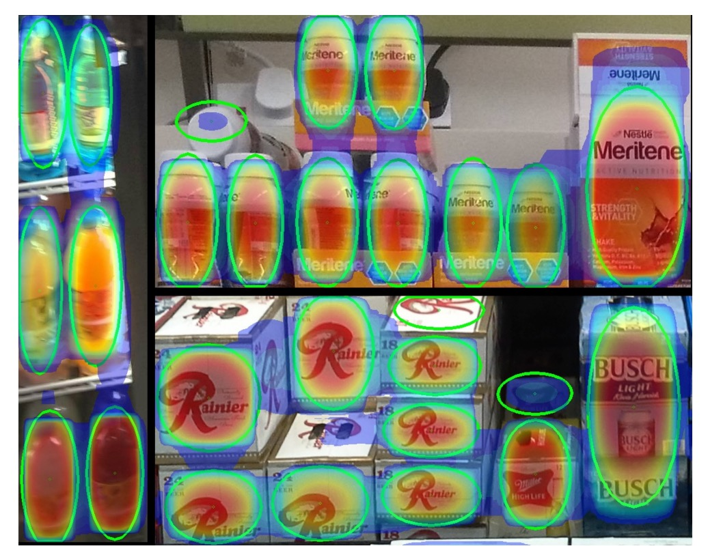
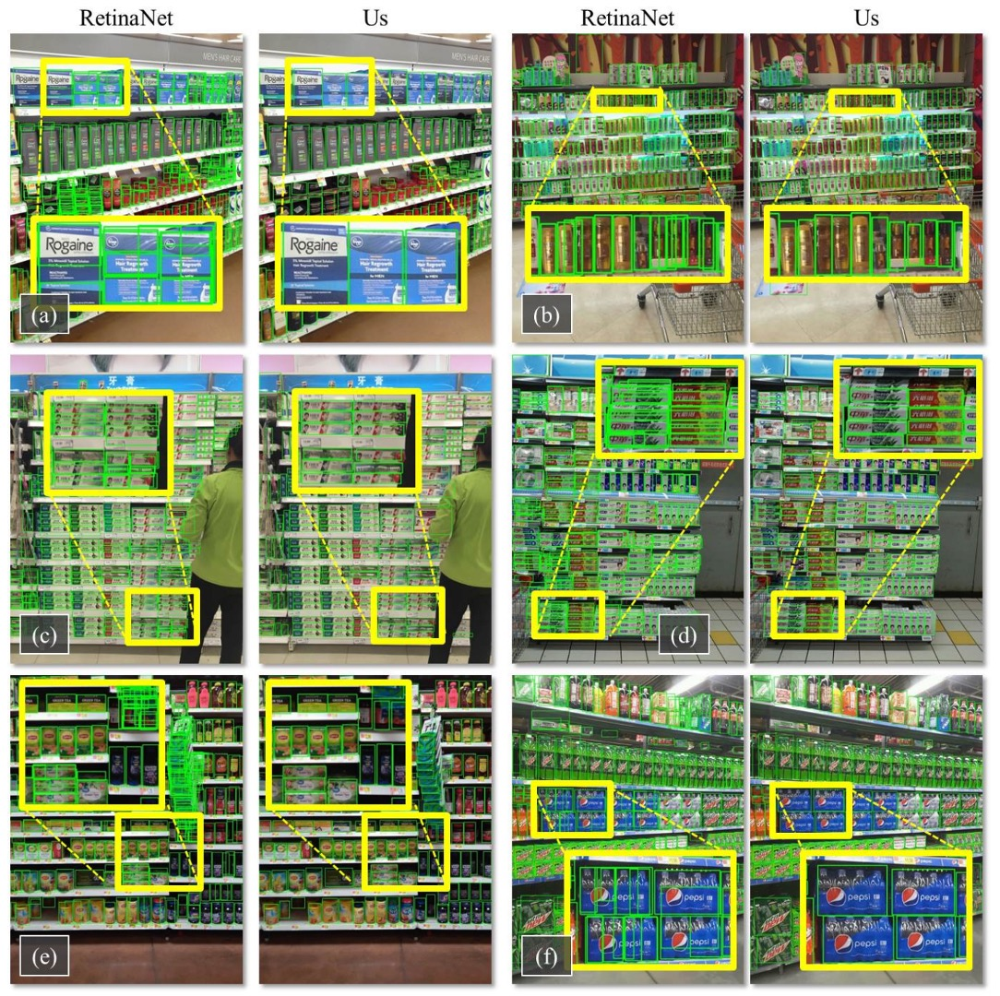

## 擁擠的貨架

[**Precise Detection in Densely Packed Scenes**](https://arxiv.org/pdf/1904.00853)

---

這篇也是比較早期的文獻。

不過這篇論文留下的 Benchmark 仍然是目前最常用的零售商品檢測資料集之一。

## 定義問題

現今的物件偵測技術已在自然場景中展現極高準確率與速度，但當面對密集排列、物件相似且相互緊鄰的情境時，主流方法卻顯得力不從心。

這類「高密度場景」實際上極為常見，例如：零售通路中的貨架陳列、都市交通監控畫面或是室內倉儲或堆疊環境都是如此。

這些場景通常具有幾個顯著特徵：

1. **物件數量極多，排列緊密，甚至相互遮蔽。**
2. **外觀高度相似，難以區分邊界。**

傳統物件偵測方法，如 Faster R-CNN、YOLO、RetinaNet 等架構，在自然場景中表現優異，但多數仍依賴後處理階段的 **NMS（Non-Maximum Suppression）** 去消除重疊框，這種硬式抑制策略在密集場景下表現出明顯瓶頸。例如：同一個實體物件可能會被切成數個小框，反之也可能多個相鄰物件被誤判為單一實體。

雖然過去已有研究提出各種替代方案，如 Mean-Shift、Agglomerative clustering 或是可學習的 NMS 層（如 GossipNet），但多數方法不是計算量過高，就是難以真正取代傳統 NMS，尤其在高密度、外觀相近的物件情境中仍容易失效。

此外，目前主流資料集（如 COCO、VOC、Open Images）主要收錄自然場景，對於這類「密集、相似、重疊」的特殊場景缺乏良好標準。即便是強調人群或車輛擁擠的 CARPK、PUCPR+，在品項密度與分類難度上都遠不及實際零售環境。

那麼，當面對這些「擠在一起、長得一樣、數量又多」的場景時，深度學習模型該如何才能準確地分辨每一個個體，並且同時保持高效與穩定？

我們能否找到一種方式，**讓模型「知道自己框得有多準」？**

本篇論文的作者認為：不如我們先從 Soft-IoU 開始吧。

## 解決問題

這篇論文主要的對標對象是 RetinaNet，因為它在密集場景下的表現已經相當不錯，但仍有改進空間。作者在標準的偵測架構上進行兩項擴充：

1. **導入 Soft-IoU 預測層**：讓模型知道「這個框和真實框重疊多少」；
2. **提出 EM-Merger 推論單元**：將多個偵測框轉換為高斯分布，透過機率聚類消解重疊。

這兩個設計協同作用，最終產出密集場景下更穩定、非重疊的偵測結果。

### 基礎架構

作者以 ResNet-50 為骨幹，構建一個具備三層上採樣的 FPN，產生多尺度特徵圖。

每個 RPN 具有三個全卷積輸出頭：

- **偵測頭**：回歸 bounding box 的中心與寬高：$(x, y, h, w)$
- **分類頭**：預測物件存在的信心值 $c \in [0, 1]$
- **Soft-IoU 頭**：預測該框與真實物件的重疊程度 $c_{\text{iou}}$

為避免訓練 Soft-IoU 時引入太多雜訊，分類分數低於 0.1 的候選框會被過濾。

### Soft-IoU

在非擁擠場景中，只靠 objectness score + NMS 通常已足夠。但在密集場景下，多個高信心框可能對應不同物件，也可能只是遮蔽造成的誤檢，因此我們需要更細緻的「重疊品質指標」。

Soft-IoU 就是為此而設計的，它預測每個框與 ground truth 框的 IoU 分數。對於每個偵測框 $b_i$，我們先找出與它最近的標註框 $\hat{b}_i$，然後計算：

$$
\text{IoU}_i = \frac{\text{Intersection}(\hat{b}_i, b_i)}{\text{Union}(\hat{b}_i, b_i)}
$$

若兩框無交集則 IoU 設為 0。

這個值作為 ground truth 來訓練 Soft-IoU 預測層，其損失函數為 binary cross-entropy：

$$
\mathcal{L}_{\text{sIoU}} = -\frac{1}{n} \sum_{i=1}^n \left[ \text{IoU}_i \log(c_{\text{iou},i}) + (1 - \text{IoU}_i) \log(1 - c_{\text{iou},i}) \right]
$$

總體 loss 定義為三者加總：

$$
\mathcal{L} = \mathcal{L}_{\text{cls}} + \mathcal{L}_{\text{reg}} + \mathcal{L}_{\text{sIoU}}
$$

其中前兩者為常見的分類與回歸損失。

比較特別的地方是 **objectness** 預測的是「有沒有物件」，而 **Soft-IoU** 預測的是「這個框有多準」。因此，即使某框只有部分覆蓋物件，也可能有高 objectness 分數，但其 Soft-IoU 應該較低。這兩者呈現互補訊號。

### EM-Merger

<figure style={{"width": "70%"}}>

</figure>

透過 Soft-IoU，每個偵測框都有兩個信心值：

- $c$：是否有物件
- $c_{\text{iou}}$：有多準確

問題來了，這些框可能彼此重疊、聚集成簇。

我們該如何從這些重疊的候選中，精準找出每一個物件？

作者的解法是將每個偵測框視為一個**2D 高斯分布**：

$$
f_i(p) = \mathcal{N}(p; \mu_i, \Sigma_i)
$$

其中：

- 均值 $\mu_i = (x_i, y_i)$：框中心；
- 共變異數 $\Sigma_i = \text{diag}\left[\left(\frac{h_i}{4}\right)^2, \left(\frac{w_i}{4}\right)^2\right]$：反映框的尺寸。

然後這些高斯會組成一個混合模型（MoG）：

$$
f(p) = \sum_{i=1}^N \alpha_i f_i(p), \quad \alpha_i = \frac{c_{\text{iou},i}}{\sum_k c_{\text{iou},k}}
$$

這表示在每個像素位置 $p$，我們可以根據 Soft-IoU 權重評估其為物件中心的可能性。

接著只要將這個 MoG 縮減為較少的、高信心的 $K \ll N$ 個高斯 $g_j$，作為真正的物件偵測結果。目標是讓新的高斯混合 $g(p)$ 能夠逼近原始分布 $f(p)$，並最小化下式：

$$
d(f, g) = \sum_{i=1}^N \alpha_i \min_{j=1,...,K} \text{KL}(f_i || g_j)
$$

其中 KL 表示 Kullback–Leibler divergence。

這個最小化問題透過 Expectation-Maximization（EM）解決：

- **E 步驟**：將每個偵測框指派給最近的群（以 KL divergence 判定）

  $$
  \pi(i) = \arg\min_j \text{KL}(f_i || g_j)
  $$

- **M 步驟**：重新估計每個群的參數

  $$
  \beta_j = \sum_{i \in \pi^{-1}(j)} \alpha_i
  $$

  $$
  \mu'_j = \frac{1}{\beta_j} \sum_{i \in \pi^{-1}(j)} \alpha_i \mu_i
  $$

  $$
  \Sigma'_j = \frac{1}{\beta_j} \sum_{i \in \pi^{-1}(j)} \alpha_i \left[\Sigma_i + (\mu_i - \mu'_j)(\mu_i - \mu'_j)^T\right]
  $$

重複進行直到收斂（通常 10 次內），即完成密集物件的聚類解析。

最後，對每個聚類中心套上兩倍標準差的橢圓，尋找落在其內的原始偵測框集合，並取其中寬高的中位數作為最後的偵測框。

這就是整體系統的推論流程：**Soft-IoU 做為品質預測 → MoG 表達空間機率 → EM 聚類出清晰框組 → 避免誤殺真實物件，也不會產生重疊偵測。**

## SKU-110K 資料集與基準建構

密集偵測之所以缺乏突破，部分原因來自缺乏針對此任務設計的高品質資料集。

為此，作者打造了全新資料集 **SKU-110K**，專門針對零售通路中的貨架環境，從設計動機到標註品質，皆針對高密度場景所需特性進行規劃。

資料集圖像蒐集自美國、歐洲、東亞等數千家實體門市，由數十位拍攝人員以個人手機攝影，確保圖像呈現自然、非刻意安排的真實陳列狀態。

- 每張原始圖像解析度至少為 **5MP**，後壓縮至 **1MP JPEG**；
- 未規範拍攝設備與角度，保留自然光線、模糊、遮蔽等現實干擾；
- 標註作業由**熟練專職人員**執行，非透過群眾外包，進一步提升標註的精確度與一致性；
- 所有圖像與標註經人工複檢，過濾明顯誤標錯框。

### 資料集統計與分割

SKU-110K 共含三個子集，並保證來自同一店家的貨架不會同時出現在多個子集中：

| 資料集 | 圖像數 |      框數 | 比例 |
| ------ | -----: | --------: | ---: |
| 訓練集 |  8,233 | 1,210,431 |  70% |
| 驗證集 |    588 |    90,968 |   5% |
| 測試集 |  2,941 |   432,312 |  25% |

相較於 MS COCO、OpenImages 等資料集，每張圖含有的物件數量提升一至三個數量級，是「真正高密度場景的挑戰」。

### 評估指標與準則

主要評估準則依循 COCO 標準，包括：

- **AP@[.50:.95]**：主挑戰指標；
- **AP\@.75**：嚴格定位準確率；
- **AR\@300**：限制 300 預測數量下的平均召回率；
- **PR\@0.5 (IoU=0.75)**：在 50% recall 時的精確率樣本點。

此外，為兼顧「偵測」與「計數」任務的表現，作者引入如下誤差衡量指標：

- **MAE（Mean Absolute Error）**

  $$
  \text{MAE} = \frac{1}{n} \sum_{i=1}^n |K_i' - t_i|
  $$

- **RMSE（Root Mean Squared Error）**

  $$
  \text{RMSE} = \sqrt{ \frac{1}{n} \sum_{i=1}^n (K_i' - t_i)^2 }
  $$

其中 $K_i'$ 為模型預測該圖像內的物件數，$t_i$ 為實際標註值。

這個資料集設計上兼顧了高密度、多類別、精細差異與真實干擾，是少數可針對擁擠場景進行嚴謹評估的 benchmark。

## 討論

### 推論速度分析

<figure style={{"width": "60%"}}>

</figure>

為檢驗模型的部署可行性，作者於相同硬體（Intel i7-5930K + GTX Titan X）上測量平均推論效能，指標為：

- **FPS（Frame per Second）**：每秒可處理的圖像張數；
- **DPS（Detection per Second）**：每秒可偵測的物件數量。

實驗結果如上表所示：

- **Base Detector（RetinaNet 同構）**：推論速度為基準；
- **加入 Soft-IoU Layer**：不影響速度，因其為純卷積結構；
- **EM-Merger**：速度下降顯著，主因為 CPU 與 GPU 間頻繁資料交換；

雖然 EM-Merger 在現階段較慢，但準確率大幅提升，顯示其效能值得部署端優化努力。作者指出若移至 GPU 實作，速度應可顯著改善。

### 偵測與計數實驗

作者設計數種比較與消融組合，如下：

- **Monkey**：隨機擲點模擬，作為 lower bound；
- **Base & NMS**：基本架構 + 傳統 NMS；
- **Soft-IoU & NMS**：以 Soft-IoU 分數作為 NMS 準則；
- **Base & EM-Merger**：保留原始 objectness，僅使用 EM 聚類；
- **Full System（本論文方法）**：Soft-IoU + EM-Merger。

偵測表現如下表：

<figure style={{"width": "70%"}}>

</figure>

- **Monkey** 幾乎無效，證明僅靠密度不夠；
- **Faster R-CNN / YOLO9000opt** 難以處理 50+ 物件的場景，表現不佳；
- **RetinaNet** 表現相對穩定，並且略優於作者的 Base 架構；

本論文提出的方法在所有指標（AP\@.5–.95、AP\@.75、AR\@300）上均顯著超越所有 baseline。

針對計數準確度的部分（看上圖表的 MAE 和 RMSE），將每張圖像預測物件數 $K_0$ 與真實值 $t$ 相比，雖然 RetinaNet 偵測 AP 接近，但其 NMS 導致**重複框與漏偵嚴重**，造成計數誤差遠高於本方法。

這表示 Soft-IoU 提供更好的候選評估標準，而 EM-Merger 可有效分離擁擠區域，兩者合力使得計數穩定性大幅提升。

下圖是本論文的方法和 RetinaNet 在 SKU-110K 測試集上的偵測結果，相比之下，本方法成功消除重疊，幾乎每個物件只產生一個檢測框。

<figure style={{"width": "90%"}}>

</figure>

### 在 CARPK 與 PUCPR+ 上的泛化實驗

<figure style={{"width": "60%"}}>

</figure>

為了驗證本方法的泛化能力，作者將其應用於兩個車輛計數資料集：CARPK 與 PUCPR+。

實驗結果顯示，就算本方法並非專為車輛計數設計，仍能在這兩個資料集上達到優異表現，在 MAE 與 RMSE 上均優於其他方法。

## 結論

本研究提出的 Soft-IoU 層與 EM-Merger 模組，針對密集場景下的重疊框問題提供了具體工程解法。前者補足了 objectness 無法衡量邊界精度的盲點，後者則以機率聚類取代傳統 NMS，提升定位清晰度與去重效果。

在 SKU-110K 上，本方法在偵測與計數兩項指標皆優於同時期的主流架構，顯示其設計確實有效。然而，從現今角度回看，其主要限制包括：

- **未支援多類別偵測**，難以直接應用於複雜場景；
- **EM-Merger 難以部署於即時系統**，推論速度仍有優化空間；
- **未結合語義資訊**，對細粒度外觀變異仍易混淆。

儘管本方法已發表多年，其在「密集物件偵測」這一領域的貢獻至今仍具參考價值。尤其 SKU-110K 所代表的極端擁擠場景，在今日許多場域（如自助結帳、智慧倉儲、交通監控）中依然常見，仍可作為評測模型泛化能力的良好基準。
