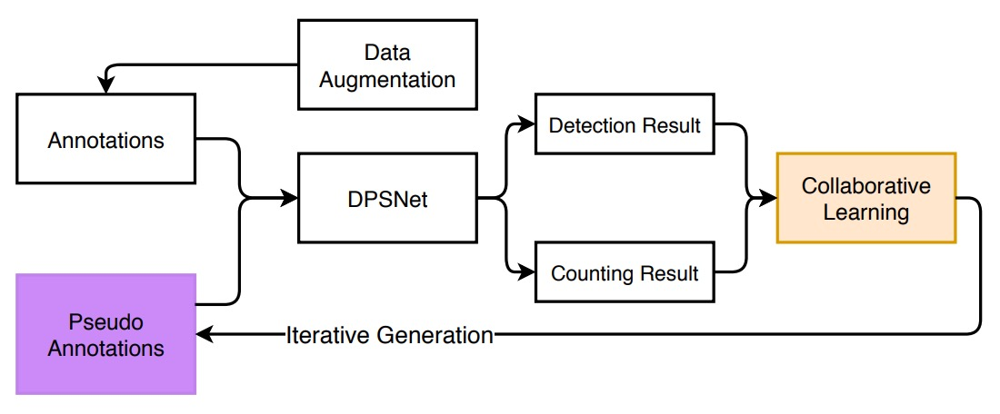
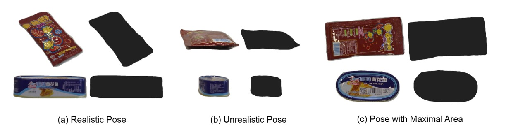
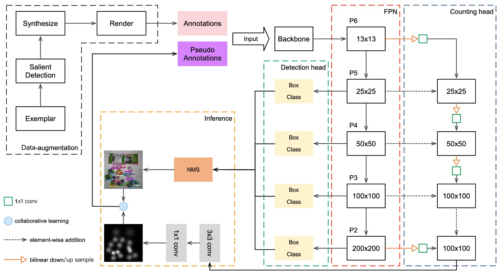
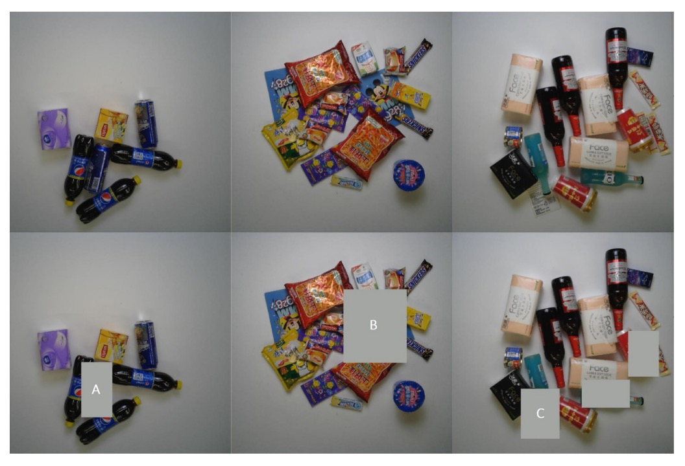
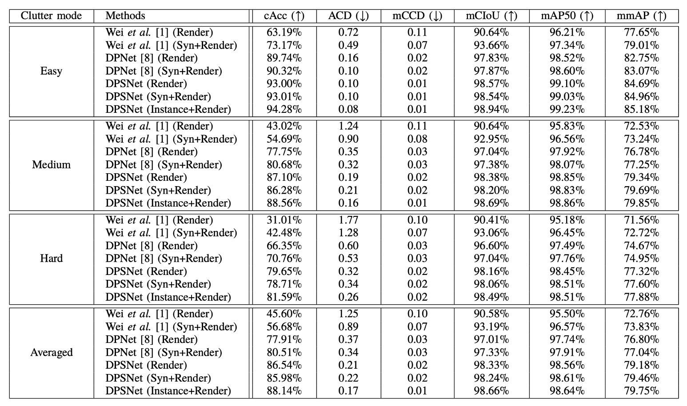
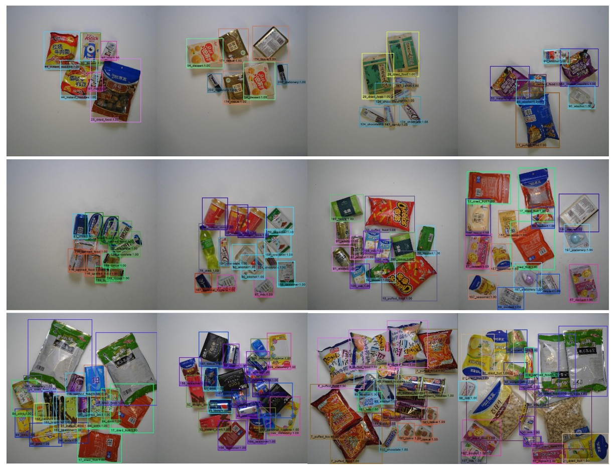
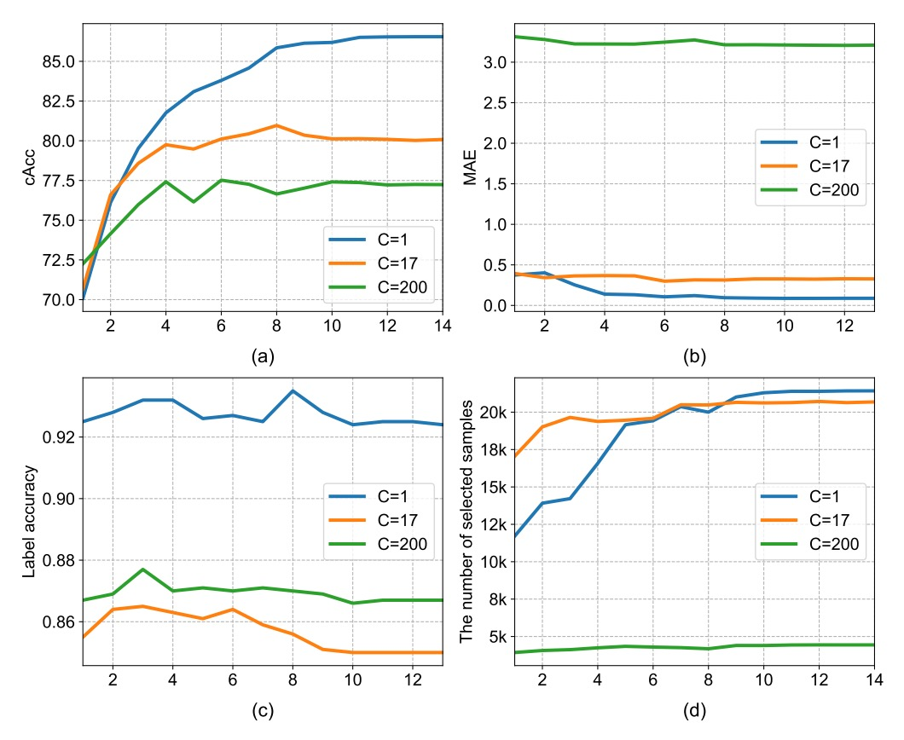

## 結帳桌上的蒸餾

[**Iterative Knowledge Distillation for Automatic Check-Out**](https://www.researchgate.net/profile/Libo-Zhang-6/publication/346079983_Iterative_Knowledge_Distillation_for_Automatic_Check-Out/links/5fba301da6fdcc6cc65a658b/Iterative-Knowledge-Distillation-for-Automatic-Check-Out.pdf)

---

零售商品這個領域下也分了幾個分支，其中一個就是自動結帳。

自動結帳的全名是 Automatic Check-Out（簡稱 ACO），我們來看看相關的論文。

## 定義問題

隨著零售業逐步數位轉型，系統化地辨識顧客購買的商品種類與數量，成為提升顧客體驗與降低人力成本的關鍵。不過 ACO 和典型的物件偵測任務不同，這裡的的問題結構與數據特性都和一般的物件偵測有顯著差異。

以目前規模最大的 RPC 資料集為例，訓練資料由轉盤拍攝而來，每張影像包含一件單品，從不同視角取得，背景乾淨、光照穩定；而測試資料則模擬實際結帳場景，將多件商品堆疊在白板上，由固定俯視視角拍攝，背景雜亂、遮擋嚴重、光影不一。

- **這種從「單品展示」到「堆疊場景」的 domain shift 是 ACO 任務最常遇到的問題。**

除了 domain shift，ACO 的另外一個困難是資料標註資源的不對稱。

在實務應用中，模型訓練時只能依賴人工標註的圖片，而測試階段的場景複雜度卻遠高於訓練資料。即使如 RPC 資料集已提供多層次的標註，但在現實場景中，測試影像往往是「不標註」或「僅提供弱標註」的，這限制了監督學習在 ACO 領域的延展性。

有些研究嘗試使用合成數據，像是 Cycle-GAN 這類的技術來減少 domain gap 的問題，但其實效果有限，訓練資料本身仍可能存在品質問題。

資料分佈嚴重錯位、監督訊號不對等、測試場景高度遮擋且重疊密集。

本篇論文的作者，想在這些困難中，試圖找一個有效的訓練流程。

---

## 解決問題

<figure style={{"width": "80%"}}>

</figure>

整體模型訓練架構如上圖，面對 source domain（單品圖）與 target domain（結帳場景）間龐大的落差，作者首先提出一套「資料增強」策略，目的在於模擬真實場景、練習適應混亂。

### 資料增強

這個增強過程可以拆成三個階段：**背景去除 → 姿態篩選 → 合成影像生成**。

1. **背景去除（Background Removal）**

   RPC 資料集中，訓練圖像都是放在轉盤上拍攝的，雖然已提供邊界框，但依然保留不少背景雜訊。若直接合成這些圖片，會讓模型學到「錯誤背景」。

   因此，作者使用一種粗到細（coarse-to-fine）的影像處理方法來去背：

   

   <figure style={{"width": "90%"}}>
   
   </figure>
   

   具體步驟如下：

   - **邊緣偵測**：使用邊緣檢測器找到物體輪廓，濾除信心度低的區塊。
   - **形態學處理**：使用膨脹與侵蝕操作消除雜訊、填補破碎區域。
   - **邊緣平滑**：以中值濾波器進一步清除鋸齒感。
   - **視覺顯著模型**：最後利用 saliency detection 網路（在 MSRA-B 上預訓練，並以粗遮罩微調）生成乾淨物體遮罩。

   這樣一來，原本含有背景與轉盤的影像就變成乾淨的商品圖像，可用來後續生成訓練樣本。

---

2. **姿態篩選（Pose Pruning）**

   不是所有單品姿態都適合放進 checkout 場景。例如：一個寶特瓶如果是「由下往上拍」的視角，那在結帳畫面中是非常不自然的。

   

   <figure style={{"width": "90%"}}>
   
   </figure>
   

   為了自動挑選「合理姿態」，作者設計了一個簡單但實用的指標：

   $$
   R_{k,v} = \frac{A_{k,v}}{\max_v A_{k,v}}
   $$

   - $A_{k,v}$：第 $k$ 類商品在第 $v$ 個視角下的遮罩面積。
   - 若某視角下的遮罩面積太小，代表該姿態與自然放置角度落差大 → 剔除。

   只有通過此門檻（大於某閾值 θₘ）的姿態，才會被留下來參與合成。

   ***

3. **結帳場景合成（Checkout Image Synthesis）**

   當我們手上已有乾淨遮罩 + 合理姿態，接下來就是合成模擬場景。

   操作方式如下：

   - **隨機放置多個商品**：從經過篩選的商品中選出數個，以隨機角度（0–360°）與隨機縮放（0.4–0.7）貼到乾淨背景上。
   - **避免過度遮擋**：每個商品最多被遮蔽 50%。
   - **光影處理**：雖然合成圖位置合理，但仍缺乏真實世界中的光影變化。因此，最後使用 CycleGAN 技術對圖像進行風格轉換，使其更接近實際測試畫面。

   下圖展示了整個轉換過程：

   

   <figure style={{"width": "90%"}}>
   
   </figure>
   

### DPSNet

前面透過資料增強，模型獲得了初步模擬真實結帳畫面的能力，但這仍不足以彌補與真實測試影像間的語意落差。作者提出一種名為 **DPSNet（Dual Pyramid Scale Network）** 的模型架構，試圖從**兩種不同觀點**中學習共通特徵表示：

- **物件偵測（Detection）**
- **物件計數（Counting）**

<figure style={{"width": "90%"}}>

</figure>

首先是 Detection View，目標是找出物件在哪裡。偵測視角輸出的是一組物件框，形式為 (c, x, y, w, h)，其中：

- c：物件類別
- x, y：物件中心點座標
- w, h：物件寬高

這是典型的物件偵測任務輸出，提供物件的空間定位與分類。

另外 Counting View 的目標就是計算物件有幾個，輸出的是一張**密度圖**，每個位置 $(i, j)$ 會對應一個大小為 $C$ 的向量，表示該位置屬於每一類的機率密度。這類輸出形式對遮蔽嚴重或疊放商品的情境特別有利。

為了讓兩個視角都能利用不同層級的特徵，DPSNet 採用 **FPN（Feature Pyramid Network）** 為 backbone，取得多層次特徵圖 $P_2 \sim P_6$。

特徵融合方式如下：

- **低層特徵上採樣，與高層融合**（為偵測保留空間細節）
- **高層特徵下採樣，與低層融合**（為計數導入語意強度）

融合後的特徵圖經過 1×1 與 3×3 卷積層，各自進入 detection head 與 counting head，分別輸出偵測框與密度圖。

---

### 逐步知識蒸餾

模型雖已經具備預測能力，但仍無法保證它在 target domain 上表現穩定。

作者為了將測試資料集也納入訓練流程，設計了一套 **漸進式的自我蒸餾訓練策略**，如下圖所示：

<figure style={{"width": "90%"}}>

</figure>

整體流程如下：

- **一致性檢查（Consistency Check）**

  對於每張無標註的測試圖像，DPSNet 會執行：

  - 偵測視角 D：預測出物件位置與類別
  - 計數視角 C：產生密度圖，估計每類商品的總數

  接著，比較兩者是否「一致」：

  - 若某類別 c，偵測出來的高信心物件數量等於密度圖估計的數量，則視為「一致」
  - 將這些「一致樣本」加入訓練資料，並生成 pseudo labels

---

- **反覆蒸餾（Iterative Distillation）**

  在每次訓練週期中，DPSNet 都會：

  1. 使用目前模型預測測試集
  2. 執行一致性檢查 → 挑選可信樣本 → 加入訓練
  3. 用這批新 pseudo labels 再訓練一輪
  4. 重複此流程數次

---

- **實例級修補（Instance-Level Refinement）**

  最後，在完成數輪蒸餾後，作者額外加入一個修補步驟：

  - 對於那些「整張圖被捨棄」的影像，如果其中有些物件信心值高，就保留這些物件框，丟棄低信心部分。
  - 再利用這些修補後的「半可信」圖像進行 fine-tuning。

  下圖展示了三種常見被捨棄的例子：

    

    <figure style={{"width": "90%"}}>
    
    </figure>
    

  每列依序為：原始結帳影像、移除低信心物件後的影像。A/B/C 分別代表三類常見的無效預測：A 類為外觀相近的重複物件、B 類為被遮擋的物件、C 類為非商品項目。

透過「一致性 → 蒸餾 → 修補」的連續迭代，知識自 source domain 滲透至 target domain，同時在影像級與實例級均獲得漸進式強化，最終提升模型在實測場景的表現穩定度。

### 損失函數

為了讓 DPSNet 能穩定學習來自不同 domain 的資訊，在迭代訓練的過程中，作者為兩個視角分別設計了損失函數，並加總為整體訓練目標。

損失函數總覽如下：

$$
\mathcal{L} = \sum_{i=1}^{N} \sum_{\ell} \left| \hat{\Theta}(\ell; x_i) - \Theta(\ell; x_i) \right|^2 +
$$

$$
\sum_{d} \left( \mathcal{L}_{cls}(\hat{p}_d, p_d; x_i) + \mathbf{1}(p_d > 0) \cdot \mathcal{L}_{reg}(\hat{t}_d, t_d; x_i) \right)
$$

計數視角的目標是學出一張密度圖 $\hat{\Theta}$，對應每一類商品在圖中每個位置出現的可能性。

- **損失類型**：平方歐式距離（L2 Loss）
- **直覺意義**：預測的密度圖越接近實際密度分布，模型越能正確推估每一類商品的數量。

密度圖的 ground-truth 建立方式為：

- 先以每個物件的中心點位置建立高斯核（Gaussian Kernel）
- 每一類商品的高斯分布獨立相加，產生對應的類別密度圖
- 所有類別合成為最終密度圖（尺寸為輸入圖的 1/8，例如 100×100）

偵測視角的目標是為每一個物件預測其類別與邊界框位置：

- **分類損失**（Cross-Entropy）：預測類別 $\hat{p}_d$ 與標註類別 $p_d$ 間的誤差。
- **回歸損失**（Smooth L1）：只對真正物件（即 $p_d > 0$）計算邊界框位置的誤差。

用到的條件指標函數 $\mathbf{1}(p_d > 0)$ 意味著：

- **物件（foreground）**：有標註類別，需同時計算分類與回歸誤差。
- **背景（background）**：不進行回歸，僅考慮是否被錯判為某類商品。

此處使用的回歸向量 $t_d$、$\hat{t}_d$ 代表邊界框的參數化座標（例如中心點與寬高），而 Smooth L1 損失能在小誤差下保有穩定梯度，提升訓練穩定性。

## 討論

### RPC dataset benchmark

<figure style={{"width": "90%"}}>

</figure>

DPSNet 的實驗結果被詳細整理於上表，並與兩個基線方法比較：參考文獻【1】是提出的原始結帳偵測系統的論文；參考文獻【8】是後續改進的 DPNet。

:::tip
這篇論文也沒有說明是他們是用 ResNet-50 還是 ResNet-101。

在另外一篇 DPNet 論文中有提到在比較中使用的架構是 ResNet-101，所以這裡我們假設他們也是用 ResNet-101。

參考文獻如下：[**[19.04] Data Priming Network for Automatic Check-Out**](https://arxiv.org/abs/1904.04978)
:::

每個方法都經歷了兩個版本的訓練資料：僅使用 CycleGAN 處理過的 Render 圖像，或額外加入 Copy-Paste 合成圖像構成的 Syn+Render 訓練集。DPSNet 額外補充了 Instance+Render 設定，用以驗證實例級 pseudo-label 在訓練中的影響力。

我們從核心指標 **Checkout Accuracy（cAcc）** 講起，這是一項極具現實意義的衡量準則：

- **只有當整張結帳影像中的所有商品類別與數量完全正確時，才會被視為一次「完全成功的預測」。換言之，它對錯誤極度敏感，能有效揭示模型在真實場景中的可靠性。**

原始的 Render 設定只使用 CycleGAN 處理後的合成影像作為訓練來源，其 cAcc 僅有 45.60%。即使有風格轉換輔助，仍難彌合模擬與真實場景間的語意差距。

加入更多 Copy-and-Paste 合成圖像之後，Syn+Render 設定使 cAcc 提升至 56.68%。這代表訓練資料的數量與分佈豐富化，確實對模型泛化有所助益。然而，這樣的合成影像也可能引入新的雜訊，例如錯誤遮蔽、非自然姿態，甚至背景不一致問題，可能會導致「表面上更多樣，實際上更混亂」的反效果。

DPNet 的貢獻在於率先引入了 detection 與 counting 雙視角學習，並嘗試從測試資料中選取可信 pseudo-label 進行訓練。這讓它即使只用 Render 訓練，也可將 cAcc 一舉拉高至 77.91%，幾乎突破了 baseline 的天花板。

Syn+Render 設定下的 DPNet 更上層樓，達到 80.51%。可以說，這是首次證明：測試資料本身可以反過來成為知識來源，前提是你有一套挑選它們的機制。

DPSNet 相較 DPNet 有兩大進化：

1. **在架構上**：引入了 pyramid-scale 表示融合機制，讓偵測與計數兩視角在多層特徵上同步運作，不再只是粗略堆疊。
2. **在訓練上**：導入 iterative knowledge distillation，不僅逐步選出可信測試影像，更進一步在實例層級做濾除與修補。

這讓「DPSNet (Render)」的 cAcc 飆升至 **86.54%**，而 Syn+Render 版本雖然稍低，但差距極小。這也呼應前文所提，Copy-Paste 合成資料未必總是正向貢獻，反而可能帶來輕微的負遷移。

除了 cAcc，DPSNet 在其他衡量指標上也展現出全方位優勢：

- **ACD（平均誤差數）**：衡量每張圖預測錯幾件商品，DPSNet 顯著低於其他方法，表示整體計數穩定。
- **mCIoU（類別交集聯集）**：反映模型在類別預測的廣度與準確性，DPSNet 較 DPNet 提升約 5%。
- **mmAP（IoU=0.50\~0.95 全範圍平均精度）**：即使是在檢測層級嚴格標準下，DPSNet 仍勝過所有 baseline，代表不僅「有預測」，更「預測得準」。

這些指標彼此互補，描繪出 DPSNet 在 detection 與 counting 雙任務之間的整體協調與精度提升。

一個有趣的觀察是：DPSNet 在僅使用 Render 訓練時，表現甚至略優於 Syn+Render（86.54% > 85.98%）。這可能代表其 iterative pseudo-label 策略本身已能有效捕捉並內化來自真實測試場景的訊號，使得合成圖像的幫助反而邊際遞減。

這讓我們重新思考一個問題：

> 「真正有價值的訓練訊號，來自於大量模擬，還是來自於真實分佈的理解與篩選？」

DPSNet 的答案顯然是後者。

下圖是基於 RPC dataset 的推論結果，從上而下依序為簡單，中間與困難樣本。

<figure style={{"width": "90%"}}>

</figure>

### 消融實驗

1. **密度圖維度設計**

   

   <figure style={{"width": "70%"}}>
   
   </figure>
   

   在計數視角中，密度圖的第三個維度 $C$ 可視為「要同時估算幾種類別的數量」。

   作者比較了以下三種設定：

   

   | Density Category (C) | 說明                 | cAcc   |
   | -------------------- | -------------------- | ------ |
   | C = 1                | 所有商品視為同一類別 | 86.54% |
   | C = 17               | 使用 17 個超類別     | 80.05% |
   | C = 200              | 完整細分類別         | 77.22% |

   

   結果顯示：**C 設定越細，模型越難收斂**。

   這是因為密度圖的 supervision 信號會隨著類別數增加而變稀疏，造成訓練不穩。反之，C=1 雖無法提供類別區分，但在計數與一致性檢查階段反而更穩定，因此本文最終採用 C = 1。

- **特徵表示法的影響**

    

    <figure style={{"width": "90%"}}>
    
    </figure>
    

  從上表可見，若僅使用 pyramid-scale 架構（無協同學習），其表現甚至低於 DPNet（70.08% < 70.80%）。這反映出：架構的進步若無對應的訓練策略支援，可能無法轉化為效果提升。

  當搭配協同學習後，DPSNet 的表現才開始超越 baseline，cAcc 提升至 79.35%。這說明 pyramid-scale 設計的潛力必須透過雙視角互動學習才得以釋放。

  不論是偵測（物件定位）或計數（密度估計），若各自為政，容易陷入 local optimum。例如某個商品雖被準確框住，但密度預測誤判；或反之。

  將這兩者放入共享 backbone 並協同訓練，會促使兩條路徑互相修正，產生更穩健的中間特徵表示。這使得 cAcc 從 70.80% 躍升至 79.35%，證實協同學習機制的實質效益。

  上表中最顯著的提升來自 iterative learning：從 79.35% 一舉提升至 86.54%。

  這套流程的核心精神在於：模型不再仰賴 external label，而是透過內部一致性機制，從自身預測中提煉可信訊號，並以此反覆訓練自己。

## 結論

DPSNet 從 Pyramid-Scale 特徵表示、多視角協同學習，到可選的知識蒸餾與 iterative self-training，層層回應了 ACO 任務中「跨域分佈不一致」與「標註資料稀缺」這兩大核心問題。

本研究提醒我們，在缺乏大量標註的現實中，測試資料本身便是潛在訊號來源。透過穩定的 pseudo-label 策略，可逐步轉化為學習資源。此外，相較於風格轉換，跨域遷移更關鍵的是語意與結構的一致性學習；而單一任務難以覆蓋的場景，也可透過多任務設計互補實現。

從工程實作角度來看，雖然計數任務無法細緻區分語意，卻能在訓練過程中提供額外監督，有效提升整體性能，實務上值得納入考量。
