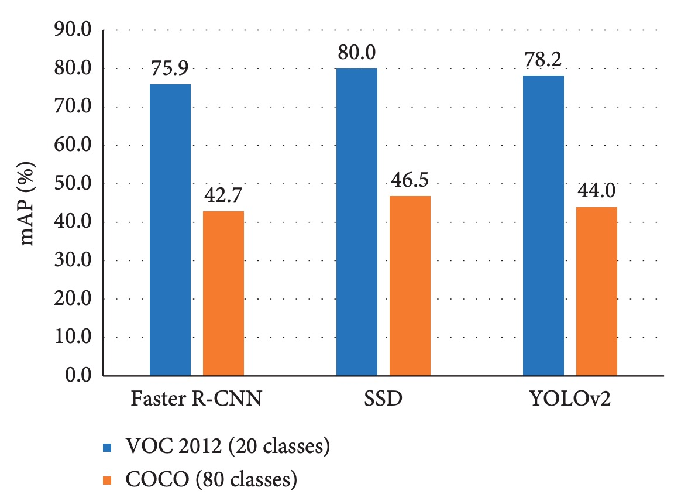
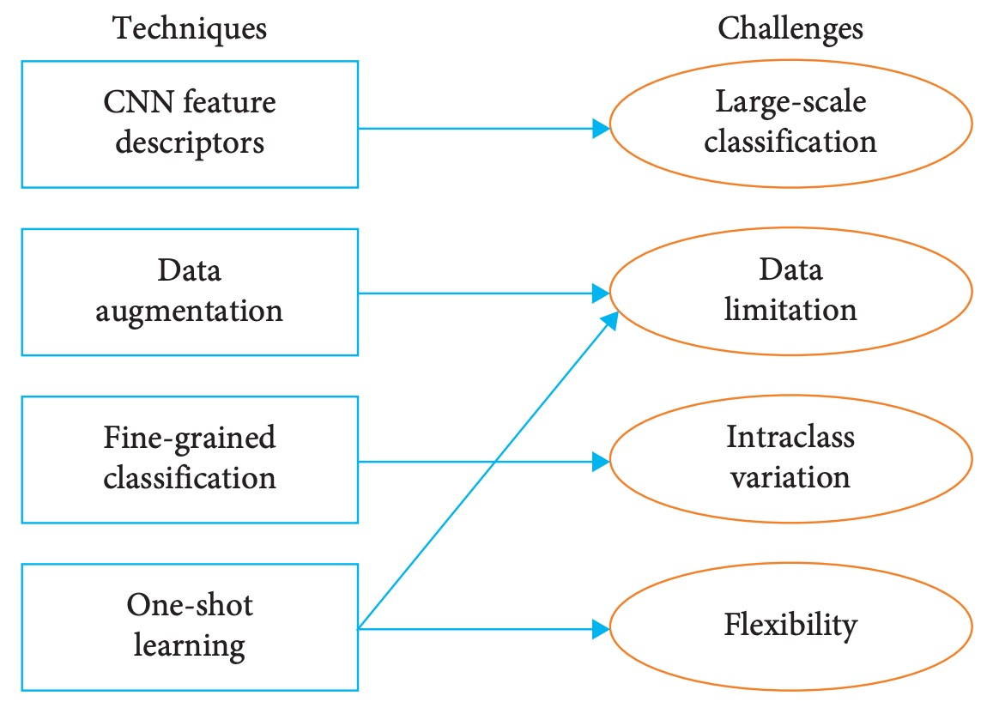
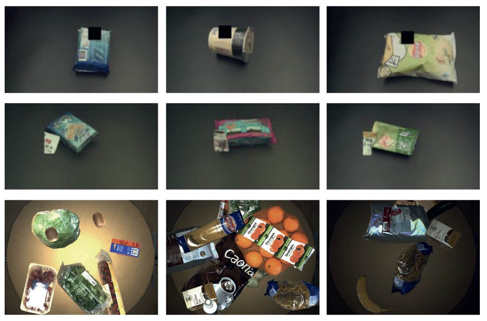
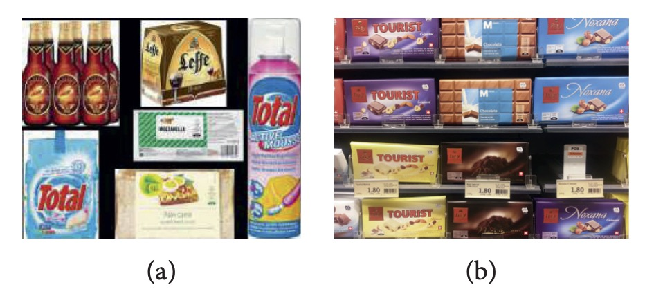
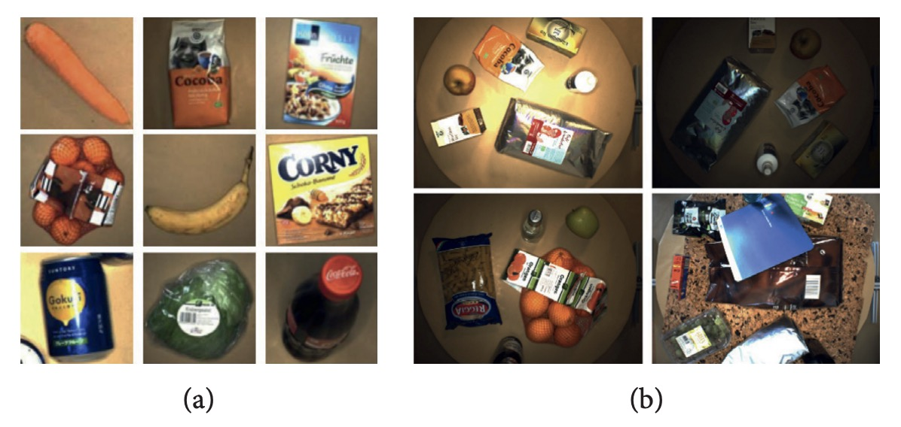
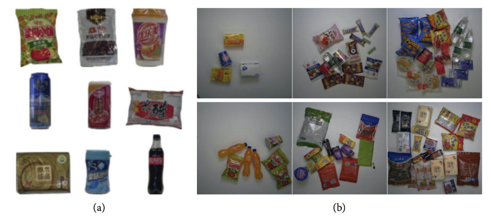

## 零售商品辨識

[**Deep Learning for Retail Product Recognition: Challenges and Techniques**](https://onlinelibrary.wiley.com/doi/pdf/10.1155/2020/8875910)

---

最近回頭整理自動結帳（Automatic Check-Out, ACO）領域的參考文獻。

我們先從一些彙整式的論文來快速認識一下這個領域的樣貌。

## 定義問題

零售商品辨識技術（Retail Product Recognition）的主要目標，在於協助零售業者進行有效的商品管理，並提升顧客的購物體驗。過去最廣泛應用的技術為條碼辨識，透過掃描商品包裝上的條碼，達成商品資訊的自動擷取。

但條碼印刷位置不固定，實際操作時經常需要人工旋轉商品來配合掃描器，導致流程延遲。

根據 Digimarc 調查，約 45% 的顧客反映條碼掃描並不方便。

:::tip
Digimarc Corporation 是一家總部位於美國奧勒岡州 Beaverton 的公開發行公司，專注於開發數位隱形水印與序列化 QR 條碼等辨識技術，用以強化產品真偽認證、供應鏈追蹤與回收分選等應用。
:::

在這個情境下，RFID 技術或許可以被視為可能的替代方案。其透過無線電波進行資料傳輸，可不依賴視線掃描完成辨識作業，具備理論上的效率優勢。每件商品綁定獨立標籤，可遠距讀取，不需逐一對齊。

缺點就是貴。

在零售業這個錙銖必較的行業中，每件商品都要消耗一枚 RFID，日積月累下也是一筆可觀的收入。此外，RFID 在多件商品同時辨識時，訊號可能因遮蔽或干擾而出錯，對於大量銷售產品而言，不利於成本控制。

隨著零售產業快速數位化，企業逐漸尋求以人工智慧技術提升營運效率與顧客體驗。

根據 Juniper Research 報告，全球零售業者於 AI 相關服務的支出預計將從 2019 年的 36 億美元成長至 2023 年的 120 億美元，顯示對此類技術的高度投入。另一方面，超市陳列商品數量日益龐大，人工管理成本顯著上升，亦驅使業者尋求更高自動化程度的辨識方案。

數位攝影設備的普及促成大量商品圖像資料的產生，成為發展電腦視覺辨識系統的重要基礎。

商品辨識任務可視為結合圖像分類與物件偵測的綜合問題，核心目標為透過圖像自動辨識商品類別與位置。此一技術可應用於多種場景：

1. **貨架管理**：自動偵測缺貨商品，提醒店員補貨，根據研究指出，完整執行貨架計畫可提升 7.8% 的銷售額與 8.1% 的毛利。
2. **自助結帳系統**：透過商品圖像辨識縮短結帳時間，提升顧客滿意度；SCO 系統裝置在 2014 至 2019 年間持續成長，已被廣泛部署以降低人力成本。
3. **視障者輔助**：協助視覺障礙者辨識商品資訊（如價格、品牌、保存期限），降低購物門檻，提升自主性與社會參與度。

技術層面而言，相較於傳統人工特徵方法，深度學習能直接從圖像中自動學習特徵，具備更高辨識能力與泛化性。其多層結構亦能萃取更細緻的語義資訊，適用於複雜與多類別商品的場景。

目前，已有研究團隊將深度學習應用於零售領域，並在多項任務中取得具體成果。業界也已經出現 Amazon Go、Walmart Intelligent Retail Lab 等應用實例。

儘管近年相關研究成果漸多，但針對「深度學習於商品辨識任務」的系統性總覽仍相當有限。過往僅有兩篇針對零售貨架商品偵測的 survey 發表，皆未涵蓋結帳場景，也未聚焦於深度學習方法。

本篇論文的作者透過回顧超過百篇文獻，涵蓋 CVPR、ICCV、AAAI 等主流會議與期刊，試圖整合現有技術、挑戰與資源，並希望本篇論文可以作為此領域研究者與工程師的入門指引，協助快速掌握核心問題與現有成果。

:::tip
我們最喜歡這種熱心的作者，感激不盡。
:::

## 傳統方法

商品圖像辨識的核心，在於從包裝影像中萃取出具備代表性的特徵，進而完成分類與辨識任務。

早期的電腦視覺研究多採用模組化處理流程，將整個辨識系統拆解為數個主要步驟：

1. **影像擷取**：透過攝影機或手機等裝置收集商品影像。
2. **前處理**：針對輸入影像進行雜訊消除與資訊簡化，包括影像分割、幾何變換與對比增強等。
3. **特徵擷取**：分析影像區塊中不隨位置或尺寸改變的穩定特徵。
4. **特徵分類**：將擷取到的特徵映射至向量空間後，透過特定分類演算法進行預測。
5. **辨識輸出**：由預訓練分類器產出商品類別結果。

上述架構中的關鍵步驟是「特徵擷取」，其準確性直接影響最終辨識效果。在深度學習普及之前，研究者廣泛依賴手工設計的特徵來捕捉圖像的視覺特性。

其中，兩項經典方法為：

- **SIFT（Scale-Invariant Feature Transform）**：由 David Lowe 於 1999 年提出，透過圖像金字塔架構擷取多尺度區域的局部特徵，具備旋轉、平移與尺度不變性，在物件匹配與分類任務中被廣泛使用。
- **SURF（Speeded Up Robust Features）**：2006 年在 SIFT 基礎上發展而來，針對計算效率進行優化，適用於即時性要求較高的應用場景。

然而，這些方法的特徵由人工設計，受限於開發者的經驗與假設，無法涵蓋影像中所有潛在重要資訊。此外，當商品種類龐大、包裝設計變異顯著或拍攝條件多變（如角度、光照），手工特徵難以維持辨識的穩定性與可擴展性。這促使研究社群逐漸轉向以資料驅動的深度學習方法，透過端對端訓練直接從影像中學習最具判別力的特徵表示。

## 深度學習方法

深度學習作為機器學習的子領域，其核心目標是從資料中自動學習多層次的表示，進而捕捉高階語義結構。這種方法避免了手動設計特徵的限制，特別適合用於圖像、語音、文字等高維資料。

圖像辨識任務中，深度學習的優勢因 GPU 運算能力提升而進一步放大，逐漸取代傳統方法，成為主流解法。目前在零售商品辨識的應用中，深度學習主要涵蓋兩大任務：

1. **圖像分類（Image Classification）** 將輸入影像歸類至預定類別，當訓練資料充足時，模型分類精度已超越人類水準。
2. **物件偵測（Object Detection）** 不僅分類，亦需回傳物件在圖像中的位置（以 bounding box 表示）。此任務對模型設計與計算效率提出更高要求，是商品辨識中不可或缺的模組。

深度學習在圖像領域的突破，主要來自卷積神經網路。此架構靈感源自貓視覺皮質的生理研究，LeCun 等人於 1988 年首次提出用 CNN 模型進行圖像分類，並成功應用於手寫數字與支票辨識任務。

2010 年以後，ImageNet 挑戰賽的推動促使 CNN 結構迅速演進，形成多種主流架構：

- **AlexNet (2012)**：引入 ReLU 與 Dropout，打破傳統圖像辨識瓶頸，推動深度學習熱潮；
- **GoogLeNet (2014)**：採用 Inception 模組以減少參數數量，同時提升模型深度；
- **VGG (2014)**：強調統一的 3x3 卷積核設計，便於架構組合與重用；
- **ResNet (2015)**：提出殘差連接，解決深層網路退化問題，允許訓練百層以上模型。

近期亦有研究延伸 CNN 應用至 3D 結構辨識，發展出多視角 CNN（Multiview CNN），可同時輸入多角度影像以進行更精確分類，適用於立體商品辨識等進階任務。

綜上，深度學習的兩大驅動力為：**大規模資料與更深層網路結構**。這兩者相互加乘，促使模型在視覺辨識任務上持續進化，也為商品辨識系統奠定技術基礎。

回過頭來講一下物件偵測任務。

在深度學習技術中，物件偵測任務的核心目標為：

> **自圖像中自動辨識出目標物的類別與位置（以 bounding box 表示）。**

在早期未使用深度學習之前，物件偵測多仰賴滑動視窗策略，透過在整張圖像上移動固定大小的視窗，逐區塊分類判斷是否為目標物。但此方法在大尺寸圖像或多物件場景中極度耗時，計算量高，效率低落。

深度學習導入後，物件偵測演算法可大致分為兩類：

- **Two-stage 方法（區域提議為先）**
  以 R-CNN 系列為代表，流程包含兩階段：第一階段使用區域提議演算法（如 Selective Search）生成可能物件區域，再於第二階段透過 CNN 對這些區域分類與回歸位置。

  - R-CNN：每個候選區域皆單獨輸入 CNN 處理，雖提升準確度但速度緩慢。
  - Fast R-CNN：將整張圖像先經 CNN 處理，再對特徵圖進行 ROI pooling，大幅減少重複運算。
  - Faster R-CNN：導入 RPN（Region Proposal Network），由深度網路自動學習區域建議，並與分類器共享特徵，成為目前準確率較高之主流技術。

- **One-stage 方法（端對端回歸）**
  直接從圖像中回歸出物件的位置與類別，省略區域提議階段，速度較快但早期精度稍低。

  - 代表模型包含 YOLO（You Only Look Once）與 SSD（Single Shot MultiBox Detector），在追求即時性應用（如即時結帳、視覺導航）上具備明顯優勢。

兩類方法各具特性：Two-stage 模型在複雜背景下具有較高辨識穩定性，而 One-stage 模型適合延遲要求低的部署環境。實際應用上須視場域需求（準確率 vs. 時效性）進行取捨。

<figure style={{"width": "90%"}}>

</figure>

商品辨識任務在技術面上可被視為物件偵測任務的特殊應用，典型作法如上圖所示：

1. **商品偵測**：使用物件偵測模型產生多個 bounding box，標示商品區域。
2. **區域裁切**：將每個預測區域裁切為單一商品圖像。
3. **圖像分類**：將裁切圖像輸入分類模型，推斷商品類別。

近年已有多家企業導入深度學習技術於零售場域：

- **Amazon Go（2018）**：使用數十台攝影機取得顧客動線，結合 CNN 模型辨識購物行為與商品。為彌補純圖像辨識之不足，系統輔以藍牙與重量感測器，以提升總體辨識精度。
- **Walmart IRL（2019）**：聚焦於貨架即時監控，透過攝影機與深度學習模型自動偵測缺貨狀況，並提醒補貨人員。
- **中國業者（DeepBlue Technology、Malong Technologies）**：推出整合式自動販賣機、智慧秤重系統與商品辨識模組，結合商品圖像分析、即時結帳與分類推薦等功能。Malong 的 AI Fresh 系統特別針對生鮮商品設計，以處理非結構化視覺特徵（如蔬果外觀變異）為目標。

從現況來看，雖然目前已有初步商業部署，但基於深度學習的商品辨識技術還有許多挑戰：

- 精度 vs. 推論速度間的取捨；
- 不同商品間視覺相似度高，易誤判；
- 多類別資料不均衡、長尾分布明顯；
- 部署成本與多裝置穩定性尚需評估；
- 真實環境中如遮擋、反光、手部干擾等非理想因子尚難全面處理。

基於以上觀察，深度學習雖為商品辨識任務中最具潛力之方法，但其技術應用仍需透過更多實證研究與大規模場域部署來完善與優化。

## 商品辨識的挑戰

商品辨識雖屬於物件偵測任務的一種應用變形，但實際需求環境與一般物件偵測存在顯著差異，導致現有模型難以直接遷移。

在本章節中，作者整理出零售商品辨識面臨的四大挑戰，以下為其中四個核心問題：

### 問題一：類別規模過大

與一般物件偵測任務相比，商品辨識最大特徵在於「**類別數量遠高於標準資料集**」。

中型超市商品數量常達數千個庫存單位（Stock Keeping Unit, SKU），遠超過常見資料集。相對之下，零售實務場景中，單張圖像常含十數類商品，每類商品間細節差異細微（如同品牌不同規格），造成辨識難度遠高於一般偵測任務。

此外，現有主流模型如 Faster R-CNN、YOLO、SSD 等，雖可於標準資料集上達到不錯表現，但其分類頭多假設類別數固定，當類別數擴增至數千時，精度與召回率皆大幅下降。

論文中實驗如下圖所示：

<figure style={{"width": "60%"}}>

</figure>

不論模型架構，**當類別數從 20 擴增至 80 時，整體精度顯著下降**。

因此，在面對商品辨識場景時，僅仰賴傳統物件偵測架構，將面臨分類維度過高所帶來的學習瓶頸與推論不穩定問題。這不僅是模型架構的挑戰，更牽涉到資料分布、類別間差異表徵與分類策略設計等多層議題。

### 問題二：資料分布落差

深度學習模型高度仰賴大量標註資料進行訓練，然而在商品辨識領域中，資料取得面臨以下三項主要限制：

1. **標註成本高昂**：
   商品辨識所需的 bounding box 或 segmentation 標註多需人工完成，建立數萬張具標註的訓練資料需耗費大量人力與時間。即便已有如 LabelImg、LabelMe 等工具協助標註流程，整體製作成本仍難以大規模擴展。

   

2. **訓練資料與實際場景存在域偏移（domain gap）**：
   現有商品資料多由固定角度拍攝、背景簡單，屬於理想化條件（如旋轉平台拍攝）。但測試或部署場景往往在複雜背景、光線多變、遮擋頻繁的環境下進行，導致模型訓練與實際表現間產生落差。

  

  <figure style={{"width": "80%"}}>
  
  </figure>
  

3. **資料類型不均衡、長尾分布明顯**：
   商品資料集常呈現「少樣本、多類別」特徵，相較 VOC 或 COCO 等強調均衡類別分布的資料集，零售商品資料集的樣本密度遠低。根據文中比較，商品辨識資料集往往「圖片數少但類別數多」，造成模型學習困難。

    

    <figure style={{"width": "80%"}}>
    
    </figure>
    

綜合以上，資料不足不僅限制模型表現，更阻礙了泛化能力的提升與新商品的快速遷移學習能力。除非有系統性解決資料不足與實務分布落差問題，否則即使模型架構先進，實際部署時仍難達標。

### 問題三：類內變異問題

商品辨識任務中的一大難題，在於如何正確區分「類內異質性高的產品」，也可稱為「次類別辨識」或「細粒度分類（fine-grained classification）」。

此類問題具備以下三項特性：

1. **視覺差異極細微**：同一品牌不同口味的餅乾、不同尺寸的包裝，其外觀差異可能僅在顏色飽和度或文字位置，甚至肉眼亦難辨識。
2. **多樣化的外觀變異**：同一產品在不同角度、縮放比例下可能有明顯差異，模型需具有尺度與視角不變性。
3. **環境因素干擾大**：照明、背景與遮擋對辨識影響顯著，對模型判別邊界造成挑戰。

細粒度分類在其他領域（如鳥種辨識、車款分類）已有專門技術發展，通常仰賴額外標註（如關鍵點、部位對齊資訊）輔助模型學習微差異。然而，應用至零售場域時，挑戰反而更加明顯：

- 商品之間的視覺相似度不僅限於外形，連包裝結構、色彩與字型都高度重複。
- 缺乏專屬的細粒度商品資料集，現有資料多僅標註整體類別，缺乏「次類別層級」的清楚定義。
- 若無額外標記資料或專業知識輔助，模型將難以學習有效區分策略，導致誤判或混淆率上升。

舉例來說，下圖 (a) 展示兩種口味不同的相似產品：

<figure style={{"width": "80%"}}>

</figure>

其差異僅存在於包裝文字顏色與位置微調；圖 (b) 則顯示同品牌不同容量之包裝，尺寸差異難以從單張影像中辨識。這些皆顯示商品辨識在實務上需具備細緻表徵能力，方能應對真實場域中的「極度相似但非相同」的辨識需求。

### 問題四：系統靈活性不足

零售業商品汰換頻繁，新品持續上架、包裝常有改版。以商品圖像辨識系統而言，若每次遇到新產品就需全面重訓模型，不僅耗時耗力，也降低實用性。

理想的系統應具備：

- **快速擴充能力**：可在極少數新樣本下加入新類別（few-shot 或 zero-shot learning）。
- **持續學習能力**：能在不遺忘舊類別知識下學習新產品（continual learning / lifelong learning）。

然而，CNN 架構普遍面臨「災難性遺忘」問題：當模型在新類別上進行微調時，原有類別的辨識能力會明顯下降。

例如下圖所示：

<figure style={{"width": "80%"}}>

</figure>

模型原可偵測 orange，但當僅以 banana 類別進行更新訓練後，模型便失去對 orange 的辨識能力。

目前主流做法仍須仰賴完整資料重新訓練整體模型，這在實務中具備顯著的部署成本與效率瓶頸。未來若能開發支援下列特性的辨識架構，將對產業應用具備實質助益：

- 模型具備長期記憶能力；
- 可支援類別增量訓練；
- 整合基於樣本記憶庫的 replay 策略或 regularization 技術抑制遺忘。

商品辨識系統的「靈活性」將決定其在快速變動市場中的可用性與生命週期。

## 技術概觀

本章節針對剛才所列出的四大挑戰，彙整現有文獻中已提出之應對技術，著重於深度學習為核心的辨識架構，並輔以可與其結合的輔助方法。

<figure style={{"width": "60%"}}>

</figure>

透過此分類整理，讀者可更快速掌握商品辨識任務的解題輪廓與研究動向。

:::info
本篇筆記後續將以【xx】表示文獻編號，對應原始論文的參考文獻；欲查詳情，請讀者根據該序號逕行檢索原始論文。
:::

### 基於卷積網路

零售商品分類任務的核心難點之一，即在於如何處理龐大的類別數量。在此背景下，CNN 模型被廣泛應用於圖像特徵擷取階段，作為特徵描述子生成可辨識的嵌入向量，用以進行分類或相似度檢索。

早期如 SIFT、SURF 等手工特徵雖具備旋轉與尺度不變性，仍因其缺乏語義層級的表示能力，無法支援大型類別辨識需求，因此逐漸被 CNN 所取代。

以下是幾篇經典的作品，相關文獻請有興趣的讀者自行根據文獻編號翻閱論文。

<figure style={{"width": "80%"}}>

</figure>

雖多數方法能支援數百至一千類商品分類，但對於中大型超市而言，類別數常遠超此範圍，因此仍有提升空間。近期有兩篇具代表性的工作進一步挑戰千級以上類別分類任務：

1. **Tonioni et al.【20】**: 使用 VGG 作為 backbone，搭配 MAC（Maximum Activations of Convolutions）特徵建構全圖嵌入。共處理 3,288 類商品，Precision = 57.07%，mAP = 36.02%。
2. **Karlinsky et al.【21】**: 採用 fine-tuned VGG-F（前 2–15 層固定），支援 3,235 類商品辨識，最終達成 mAP = 52.16%。

上述研究顯示，CNN 雖具備擴展至千級類別的潛力，但實際辨識效能（尤其在 recall、細粒度區辨能力）仍有顯著進步空間。

另外，YOLO9000 提出可同時辨識 9,000 類別的檢測架構，使用改良後的 Darknet 實作。其關鍵在於多資料集聯合訓練與語義嵌入（如 WordTree）策略。然而，其訓練需求極高（需數百萬標註圖像），不易應用於商品資料取得昂貴、標註不易的零售場景。

總結來說，CNN 為大型類別商品分類提供了可行基礎，但如何提升其在「類別規模爆炸」下的可擴展性、資料效率與辨識精度，仍為關鍵技術挑戰。

### 資料擴增

深度學習方法對於訓練資料的依賴極高，而在零售商品辨識任務中，獲取大量標註資料既費時又昂貴。因此，資料擴增成為應對資料稀缺問題的重要手段。

常見的資料擴增技術分為兩大類，相關文獻如下表：

<figure style={{"width": "70%"}}>

</figure>

- **傳統影像變換方法（common synthesis methods）**
- **生成模型（generative models）**

傳統資料合成方法主要透過幾何與光學變換擴展原始圖像，如下圖所示：

<figure style={{"width": "70%"}}>

</figure>

常見影像增強工具像是 [**Albumentations**](https://github.com/albumentations-team/albumentations) ，它提供完整 API 支援像是平移、旋轉、縮放、鏡射、隨機遮擋、隨機雜訊加入、顏色增強、亮度對比調整等。目前已廣泛應用於商品偵測任務中。

儘管合成方法操作簡便，仍難以模擬真實場景中的高複雜性條件，如光影變化、背景干擾、自然遮擋等。因此，研究者轉向使用生成模型以提升資料真實性。

生成模型提供更高擬真度的圖像合成方式，主要包含兩種架構：

- **VAE（Variational Autoencoder）**
  利用編碼器–解碼器架構生成樣本，適合進行特徵學習與屬性控制，但目前仍難以支援影像轉換任務。
- **GAN（Generative Adversarial Networks）**
  藉由生成器與判別器對抗學習，生成視覺上更逼真的樣本，支援圖像到圖像的風格轉換與合成。

相關文獻如下表：

<figure style={{"width": "70%"}}>

</figure>

VAE 架構由編碼器與解碼器組成，透過學習潛在空間分布，能夠生成與原始資料相似的樣本。雖然目前尚無專門將 VAE 應用於商品辨識領域的實例，但已有研究在其他領域展示其潛力。

例如在人臉與鳥類圖像生成任務中，VAE 可透過屬性控制產生樣本，並在 Wild 與 CUB 資料集上分別達到 0.9057 的餘弦相似度與合理的均方誤差【101】。另有研究使用 conditional VAE 處理 zero-shot 學習問題，於 AwA、CUB、SUN 與 ImageNet 等標準資料集上取得優異表現【112】。

這些成功案例顯示，VAE 在增強資料多樣性與屬性控制方面具潛力，未來可望延伸至商品辨識任務中。

相較之下，GAN 技術近年在圖像生成領域取得更為實質的突破。

自 2014 年提出以來，其透過生成器與判別器的對抗訓練機制，已能合成大量逼真圖像。研究者也將 GAN 應用於多種任務的資料擴增，例如夜間車輛偵測【115】、半監督語意雜湊【116】與車牌圖像生成【122】，均顯著提升模型性能。

在某些應用中，如使用 PixelCNN 搭配 one-hot 類別編碼生成指定類別圖像【119】，或以 CycleGAN 對圖像進行風格轉換、模擬真實場景變化，皆展現出良好泛化與遷移能力。

應用於商品辨識領域的 GAN 實例雖不多，但已有幾篇具體研究初步驗證其可行性。

例如 Wei 等人【7】結合背景合成與 CycleGAN 風格轉換技術，生成符合收銀台情境的商品圖像，如下圖，並訓練出具備 96.57% mAP 的 FPN 偵測器。

後續 Li 等人【78】進一步提出 DPNet，從合成資料中篩選可信圖像，使 checkout 精度提升至 80.51%。此外，另一研究【71】亦嘗試將 GAN 與編碼器對抗訓練結合，產出可用於商品辨識的視覺樣本。

較可惜的部分是現有方法多以平面背景為主，尚未模擬出真實收銀台或貨架場景中複雜的背景紋理、商品重疊與遮擋關係。因此，未來如何生成更具真實感的商品影像，仍是一個值得深入探索的方向。

未來可能的開發路線包括強化圖像語義控制、融入 3D 建模與物理渲染引擎，或結合領域自適應與跨域增強策略，以進一步縮短模擬資料與實際環境之間的落差。

### 細粒度分類

細粒度分類為電腦視覺中具代表性的困難任務之一，其目標為辨識同一上位類別下的次類別（subcategory），如：不同花種、車型或動物品種等。

應用至商品辨識領域時，其挑戰性更高，因為商品間除了具高度視覺相似性，還存在拍攝模糊、光照變異、形變、姿態角度與擺放方式等多重干擾因素。

根據現有文獻整理，針對商品細粒度辨識的方法可概分為兩類：

1. **細粒度特徵表徵（Fine Feature Representation）**
2. **情境感知（Context Awareness）**

細粒度分類的核心在於從視覺相似的物件中擷取區辨性的微特徵。根據監督訊號強度，可分為「強監督」與「弱監督」兩種方法：

- **強監督方法（Strongly Supervised）**

  這類方法需額外提供區塊標註（bounding boxes）與部位資訊（parts），可精確對齊產品的局部區域，有利於模型聚焦於關鍵差異處。

  

  | 研究                       | 方法                                         | 重點                       | 應用                       |
  | -------------------------- | -------------------------------------------- | -------------------------- | -------------------------- |
  | Part-based R-CNN【127】    | 基於 R-CNN 架構，分別抽取整體與局部特徵      | 可達 SOTA 在鳥類辨識資料集 | 啟發商品辨識的局部特徵融合 |
  | Pose-normalized CNN【137】 | 利用 DPM 定位、分區後抽特徵並以 SVM 分類     | 準確率達 75.7%             | 適合商品有明顯姿態變異場景 |
  | DiffNet【139】             | 比較兩張相似商品圖像差異處，自動產生差異標記 | 無需標記常見產品           | 商品辨識 mAP = 95.56%      |

  

- **弱監督方法（Weakly Supervised）**

  弱監督方法無需額外標註，透過模型學習自動發現局部區域，適用於資料標註成本高的商品應用情境。

  

  | 研究                              | 方法                                 | 概念                           | 效果                            |
  | --------------------------------- | ------------------------------------ | ------------------------------ | ------------------------------- |
  | Two-Level Attention【126】        | 提取物件整體與局部注意力特徵         | 無需部位標註即可學習差異區域   | 細粒度分類有效性佳              |
  | Bilinear CNN【141】               | 雙分支 CNN 協作提取區域特徵          | A 模型偵測區域，B 模型分類特徵 | Caltech-UCSD birds 準確率 84.1% |
  | Attention Map【74】               | 利用注意力引導模型聚焦細節           | 實作於 CAPG-GP 資料集          | 精度明顯優於 baseline           |
  | Discriminative Patch + SVM【143】 | 擷取包裝中間層關鍵區塊進行分類       | 適用於視覺相近產品分辨         | 成效良好於超市貨架分類場景      |
  | Self-Attention Module【144】      | 利用 activation map 判斷圖像關鍵位置 | 對 cross-domain 分類具改善效果 | 強化模型泛化能力                |

  

另外一種方法是情境感知（Context Awareness）。

當商品外觀資訊不足以有效分類時，「上下文訊息」可作為重要輔助線索，特別是在貨架排列規律下，商品的相對位置常隱含語義關聯。

| 研究                                 | 方法                                        | 內容                           | 成效                     |
| ------------------------------------ | ------------------------------------------- | ------------------------------ | ------------------------ |
| CRF + CNN【53】                      | 結合 CNN 特徵與相鄰商品的視覺相似性進行分類 | 加入鄰近上下文資訊學習商品嵌入 | 精度 91%、召回率 87%     |
| SIFT + Context【64】                 | 傳統特徵配合排列關係進行 hybrid 分類        | 比無上下文方法提升 11.4%       | 具實用性但非深度學習方法 |
| Graph-based Consistency Check【148】 | 將商品排列建模為子圖同構問題                | 偵測缺貨與錯置商品             | 強調空間一致性推理能力   |

整體而言，情境感知技術尚屬早期探索階段，目前應用案例有限，未來若能與 Transformer 架構、空間建模或圖神經網路整合，將有機會進一步推升分類效能與場景適應性。

### 少樣本學習

在實務應用中，零售商品種類持續變動，新品上架與包裝改版頻繁發生。若每次類別變更都需重新訓練整個模型，將造成高昂的時間與人力成本。

**One-Shot Learning（少樣本學習）** 因此被提出作為解決方案，其核心目標為：

> **僅透過極少數（甚至單張）樣本即可辨識新類別，無須重新訓練整體分類器。**

此技術源自於距離度量學習（distance metric learning）【149】，運作邏輯為以深度模型將圖像映射至特徵空間中，再依據查詢樣本與各類別樣本中心的距離，進行最近鄰分類。

如下圖所示：

<figure style={{"width": "70%"}}>

</figure>

輸入圖像 X 將被分類至與其特徵距離最近的類別中心（例如 C1, C2, C3 中的最短距離者）。

這個方法最大的核心特點與應用潛力在於：

- **支援動態擴充類別**：引入新商品時，只需將其樣本加入特徵資料庫，無需重訓模型；
- **大幅降低訓練資料需求**：特別適用於長尾類別與訓練資料稀缺情境；
- **可與 CNN 特徵擷取模組整合**，維持語義嵌入品質與分類穩定性。

應用於圖像分類與物件偵測的研究實例如下：

| 任務            | 方法                                    | 重點概念                       | 效果摘要                             |
| --------------- | --------------------------------------- | ------------------------------ | ------------------------------------ |
| 圖像分類【152】 | 將 CNN 嵌入與色彩資訊結合成距離度量     | 解決光照與色差造成的嵌入失真   | 提升 person re-ID 成效               |
| 圖像分類【150】 | Matching Networks，基於神經特徵度量學習 | 可於 ImageNet 中快速辨識新類別 | one-shot 準確率由 87.6% 提升至 93.2% |
| 物件偵測【155】 | 與 R-CNN 結合進行動物偵測               | 少樣本動物辨識                 | 成功運用於極小數訓練樣本情境         |
| 影片分割【154】 | 僅需單張標記影像即可追蹤特定物件        | 將 CNN 嵌入微調於特定目標      | 增強單例辨識與跨幀追蹤能力           |

相關方法應用在商品辨識任務中的作品也不少：

1. **Geng et al.【74】**

   - 提出 coarse-to-fine 架構，結合特徵比對與 one-shot 分類器，能在無需重訓的情況下新增商品類別。
   - 評估資料集：GroZi-3.2k（mAP = 73.93%）、GP-20（65.55%）、GP181（85.79%）。

2. **Tonioni et al.【20】**

   - 採用相似度比對策略，將查詢圖像與商品樣本進行 CNN 特徵比對。
   - 單張樣本即可完成分類，可無縫處理商品包裝變更與新類別導入。

One-shot learning 為商品辨識系統提供了一種更具彈性與可擴展性的設計思路。目前主流方法仍集中於將 CNN 特徵結合距離度量進行分類，未來可能進一步與 few-shot classification、meta-learning、cross-domain adaptation 等方法整合，提升應對真實場景變異性的能力。

## 公開資料集

<figure style={{"width": "90%"}}>

</figure>

深度模型效能取決於資料品質與規模，但人工標註商品影像往往成本高昂。

為方便方法比較與快速原型開發，研究社群已釋出多份公開資料集，依應用場景可區分為：

- **貨架影像（on-shelf）**：商品靜態擺放在貨架上，模擬補貨、排列檢查與導購場景。
- **結帳影像（checkout）**：結帳的視角，處理擁擠遮擋、多件混合與商品計數等問題。

### 貨架影像資料集

- **GroZi‑120** 是最早被廣泛引用的零售商品辨識資料集之一，包含 120 類商品。訓練影像為 676 張在理想條件下拍攝的白底單品照，適合用於 one-shot 模型設計；測試則是 4,973 張實拍貨架影像與 30 分鐘影片片段，光照與角度多樣，專門用來檢驗模型的 domain adaptation 能力。

- **GroZi‑3.2k** 則擴大類別與樣本數，涵蓋 80 大類商品，訓練集中有逾 8,000 張網路抓取圖像；測試影像來自五間實體門市，以手機拍攝，含 680 張圖片與人工標註。此資料集特別適合細粒度分類任務與 domain shift 評估。

  

  <figure style={{"width": "70%"}}>
  
  </figure>
  

- **Freiburg Grocery** 由德國研究團隊收集，包含 25 種日常商品。訓練影像約 5,000 張，來自手機拍攝，解析度經降至 256×256；測試則採用 Kinect v2 拍攝的高解析度影像，共 74 張，場景包含遮擋與雜訊。此資料集能有效測試模型的多尺度穩健性。

  

  <figure style={{"width": "70%"}}>
  
  </figure>
  

- **Cigarette Dataset** 聚焦於香菸辨識，共收錄 10 個類別。訓練集為 3,600 張單品照，測試則來自 40 間零售商店貨架實拍，共 354 張影像、約 13,000 個物件標註。其特點是產品外觀極度相似且排列密集，特別適合測試細粒度與遮擋下的辨識能力。

  

  <figure style={{"width": "70%"}}>
  
  </figure>
  

- **Grocery Store Dataset** 包含 81 類商品，共 5,125 張圖片，資料來自 18 家商店。此資料集最特別之處在於同時提供「iconic」與「natural」影像，前者來自網站商品頁面，後者則為實拍，能廣泛應用於跨域學習與檢索任務。

  

  <figure style={{"width": "70%"}}>
  
  </figure>
  

- **GP181** 是 GroZi‑3.2k 的子集，僅含 183 張訓練照與 73 張測試照，但每張皆有精確 bounding box 標註。規模小、品質高，非常適合用於快速原型測試、few-shot 學習與結合其他資料集進行實驗驗證。

  

  <figure style={{"width": "90%"}}>
  
  </figure>
  

### 結帳影像資料集

在自助結帳情境下，影像條件更為嚴苛，像是商品重疊、視角固定、數量不一等問題。

目前兩套代表性資料集支撐相關研究：

- **D2S（Dataset to Shop）** 為首個提供 instance-level mask 的結帳資料集，總計 21,000 張高解析度影像，涵蓋 60 種常見零售商品（如瓶裝飲料、穀片、蔬果等）。訓練影像皆為單品照，測試影像則為混合陳列商品，物件數從 1 至 15 不等，並部分來自合成圖像。其設計強調光源、背景與角度多樣性，非常適合測試模型的泛化能力與精細分割準確性。原始論文顯示，即便是 Mask R‑CNN 或 RetinaNet 等強大模型，在 IoU = 0.75 時亦明顯退步，反映場景複雜性。

  

  <figure style={{"width": "70%"}}>
  
  </figure>
  

- **RPC（Retail Product Checkout）** 是目前規模最大、貼近實務的結帳影像資料集，共含 83,739 張圖片，涵蓋 200 類商品，並建構出 17 類中分類。訓練資料為多視角單品照（由四台相機拍攝），測試則為從上往下拍攝的擁擠結帳影像。該資料集不僅提供 bounding box 與類別標註，更定義了 **Checkout Accuracy（cAcc）**：僅當單張影像內「所有商品皆正確辨識與計數」時才視為成功。基準結果顯示，原始模型（FPN）僅達 cAcc 56.7%，後續透過 DPNet 篩選可信合成樣本，cAcc 可提升至 80.5%。這突顯資料擴增品質在結帳任務中的關鍵角色。

  

  <figure style={{"width": "70%"}}>
  
  </figure>
  

### 實務使用建議

- 若任務為**商品檢索、細粒度辨識或域適應**，建議採用 GroZi‑3.2k、Grocery Store 或 GP181。
- 若任務為**遮擋環境下的偵測與分割**，可優先考慮 Cigarette 與 Freiburg Grocery。
- 若研究聚焦在**結帳任務與計數正確性**，則 RPC 為當前最佳基準；若需測試遮擋泛化與 segmentation，D2S 為理想選擇。
- 多數資料集同時提供理想背景與實景影像，適合測試資料擴增、風格轉換與跨域學習策略。

未來若欲進一步推進研究，仍需更大型、多元背景與跨時期的 benchmark。研究者亦可考慮共建標註工具、發展半自動標註機制，降低資料取得與維護成本。

## 未來研究方向

以下六項研究方向，是作者認為未來進一步推進本領域的重要切入點：

1. **利用深度神經網路生成商品影像**

   目前最大公開資料集僅涵蓋 200 類商品，遠低於實際超市數千 SKU 的需求。更遑論包裝更新頻繁、無法全面預蒐圖像樣本。因此，以 DCGAN、CycleGAN 為代表的生成模型已證明具備合成擬真影像的能力。若能發展出可模擬貨架視角、遮擋結構與光影變化的生成器，將大幅擴充訓練資料的多樣性與適應性。

2. **結合圖神經網路進行貨架排列檢查**

   商品擺放具有空間結構與上下文規律，傳統卷積架構難以捕捉物件間的非歐幾里得關係。GNN 具備在圖結構中建模節點（商品）間連結（鄰近、類別相似）的能力，已應用於推薦系統與知識圖譜建構。在 planogram 任務中，GNN 可學習「觀測貨架圖」與「理想貨架圖」之間的差異，輔助缺貨與錯置偵測。

3. **結合遷移學習進行跨通路辨識**

   現有物件偵測模型多假設訓練與測試資料分佈一致，然實務中不同門市間光源、背景與陳列風格差異極大，模型常需重新訓練。遷移學習（Transfer Learning）可透過預訓模型（如 ImageNet）快速適應新環境，亦可探索 unsupervised domain adaptation、few-shot fine-tuning 等策略以減少資料需求。

4. **整合包裝文字與圖像的多模態特徵學習**

   細粒度商品常外觀極似，但標籤文字（如口味、容量）卻提供關鍵辨識資訊。人類購物時也經常依靠讀取包裝文字進行判斷。將圖像特徵與 OCR 所擷取的文字訊息進行 joint feature learning，將可補足純視覺資訊的不足。未來亦可探索使用 Vision-Language Models（如 BLIP, CLIP）進行多模態預訓練。

5. **支援增量學習的模型更新機制**

   深度模型長期面臨「災難性遺忘」問題，即新增類別會破壞原有辨識能力。增量學習（Incremental Learning）可讓模型在不重訓的前提下引入新商品類別。已有研究提出雙網路結構：舊網維持歷史知識，新網僅訓練新類別，並透過特徵重整或 distillation 將兩者結合。此方向對實務部署價值極高。

6. **加速回歸式偵測方法的精度提升**

   YOLO、SSD 等回歸式偵測模型具備即時性優勢，適合部署於邊緣裝置或自助結帳系統。但其精度仍落後於二階段方法（如 Faster R‑CNN）。未來研究需聚焦於如何於不犧牲推論速度的前提下提升其定位與分類表現，如 anchor-free 架構、lightweight attention 機制等。

## 結論

本篇回顧聚焦於近年深度學習在零售商品辨識領域中的核心發展脈絡，從任務本質與應用挑戰出發，系統性地整理與分析了目前主流技術的應對策略。文章以四大技術挑戰為架構：

1. **大規模類別分類（Large-scale classification）**
2. **訓練資料稀缺（Data limitation）**
3. **類內高相似商品的細粒度辨識（Intraclass variation）**
4. **系統彈性與快速更新能力（Flexibility）**

針對上述挑戰，本文不僅彙整了當前領先的研究方法，亦穿插對代表性資料集與實驗基準的介紹，協助後進研究者快速掌握該領域的技術座標，縮短進入門檻，並聚焦於具有潛力的研究突破點。

面對商品多樣化與零售場景日趨複雜的挑戰，作者期盼未來的研究者能在此基礎上進一步深化模型設計與系統部署策略，推動零售智能感知技術邁向更高層次的落地應用。
