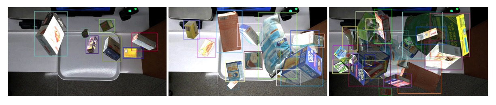

## 俯視的追獵者

[**DeepACO: A Robust Deep Learning-based Automatic Checkout System**](https://openaccess.thecvf.com/content/CVPR2022W/AICity/papers/Pham_DeepACO_A_Robust_Deep_Learning-Based_Automatic_Checkout_System_CVPRW_2022_paper.pdf)

---

這是一篇 CVPR workshop 的論文，我們一起來欣賞一下。

## 定義問題

近年來，零售業透過人工智慧與電腦視覺技術正經歷一場深刻轉型，其中**自動結帳**（Automatic Checkout, ACO）被視為最具變革性的應用場景之一。

理想中的 ACO 系統應能在顧客將商品置於結帳台的一瞬間：

> **即時辨識所有商品並準確輸出購物清單，全程中無需人為干預！**

有這種好事？

現實中，要打造這樣的系統，要面臨的挑戰數不勝數：

- **商品遮蔽與動態模糊**；
- **高度相似的商品外觀**；
- **漏檢（miss-detection）與誤分類（miss-classification）所造成的實質成本**；
- **商品種類數量龐大，且上架與汰換頻繁，難以蒐集反映真實場景的訓練影像**。

傳統方法如背景相減、SIFT、HOG 特徵與 SVM 或隨機森林等分類器，無法有效處理遮蔽與光照變化等干擾，準確率表現有限。

即便進入深度學習時代，採用 Faster R-CNN、SSD、YOLO 等系列模型雖有顯著突破，但在實務部署中仍面臨許多難解瓶頸：

- 單張圖片偵測準確不等於整段影片的商品計數精準；
- 欲強化穩定性與一致性，勢必要導入多目標追蹤（Multi-Object Tracking, MOT）技術；

然而 MOT 本身也面臨大量計算成本、即時效能與 ID 維持困難的問題，特別是在線上 tracking-by-detection 模式下。

另一方面，ACO 任務的資料需求也與一般偵測任務不同，因其高度仰賴「多物體同框」、「遮蔽嚴重」、「視角與光線變化劇烈」的實境場景，而現有資料集如：

- **RPC**：包含 8 萬張靜態與結帳場景圖片，共 200 類商品；
- **RP2K**：超過 2,000 類商品、35 萬張實體拍攝圖片，聚焦於細粒度分類；
- **AI City Challenge Checkout**：透過 3D 掃描建構合成資料，模擬實體陳列與變光場景，共產出 116,500 張圖片。

即便如此，這些資料集仍難完全覆蓋真實零售場域中不斷更新的商品樣貌。

那麼，面對這樣一個 **高遮蔽、高混淆、高更新頻率** 的極端應用場景，是否有可能打造出一個**能穩定追蹤並精準計數的全流程 ACO 系統**？

本篇論文的作者就是打算來解決這個問題。

## 解決問題

### 資料合成

工欲善其事，必先利其器。

所以必須先搞定訓練資料的問題。

對於自動結帳系統（ACO）而言，最核心的能力即是：

> **準確預測任意商品組合中，每個商品的種類與數量**。

但是，如果要完全仰賴實體結帳影像進行訓練，將面臨龐大資料規模與維護成本的雙重挑戰：商品類別眾多，更新週期短，幾乎無法涵蓋所有可能的組合與遮蔽情境。

因此，作者這裡採用一套更具實務可行性的策略：**將受控環境下的單一商品掃描圖，透過合成技術產生擬真結帳影像，進而訓練模型。**

具體流程如下圖：

<figure style={{"width": "90%"}}>

</figure>

先針對每項商品收集其「單一樣本」資料集 $S = {(I_s, M_s, y_s)}$，其中：

- $I_s$：商品的影像；
- $M_s$：對應的 binary mask；
- $y_s$：商品類別 ID。

本研究使用 2022 AI City Challenge Track 4 所提供的 `Saic` 資料集，涵蓋：

- 共 **116,500 張影像**；
- 來自 **116 個商品類別**；
- 所有商品皆由 3D 掃描取得。

透過這些 exemplar，系統可以大量生成結帳場景合成圖像 $\mathcal{G} = {g_i}$，其建構流程如下：

$$
g_i = p(N, a, s, g, c)
$$

其中參數意義如下：

- $N = {(I_n, M_n, y_n)} \subset Saic$：隨機選取的 $n$ 筆 exemplar；
- $(a, s, g)$：針對每個 exemplar 施加的旋轉角度、縮放比例與 gamma 校正等增強參數；
- $c$：遮蔽程度（clutter ratio）控制合成結果中物件重疊的最大 IoU。

完整流程為：

1. 對每個 exemplar 進行 bitwise-and 操作，根據 $M_n$ 移除背景；
2. 隨機施加資料增強（旋轉、縮放、亮度調整）；
3. 應用反向閾值操作產生遮罩；
4. 隨機將這些商品貼合至實際結帳場景影片所擷取的背景圖上；
5. 控制物件遮蔽程度不超過參數 $c$ 所定義的 IoU 閾值，避免過度重疊。

此流程能快速生成大量結帳場景樣本，模擬各種不同角度、遮蔽與複雜背景的情境。

下圖展示了三種遮蔽程度下的合成成果，證明此生成流程具備靈活性與擬真度，能有效支援 ACO 模型的訓練需求。

<figure style={{"width": "90%"}}>

<figcaption>由左到右分別是低、中、高遮蔽程度的合成結果。</figcaption>
</figure>

### 模型架構

<figure style={{"width": "90%"}}>

</figure>

DeepACO 整體設計架構如上圖，整體系統由三個主要元件組成：

1. **偵測器（Detector）**
2. **追蹤器（Tracker）**
3. **計數器（Counter）**

此外，為滿足 2022 AI City Challenge Track 4 的特殊需求，系統還整合 **手部估計模組（Hand Estimator）**，強化對顧客操作中商品的判斷能力。

### 商品偵測

DeepACO 採用彈性偵測框架，支援多種物件偵測模型（可熱插拔），只需滿足 **Batch 輸入/輸出格式**即可：

- 輸入：RGB 影像序列 $I = {I_i | t \leq i \leq t + B} \in \mathbb{R}^{B \times C \times H \times W}$；
- 輸出：偵測結果 $D = {D_i \in \mathbb{R}^{P \times F}}$，其中 $F = [x_1, y_1, x_2, y_2, \text{cls}, \text{conf}]$。

在本研究中，作者選用 **Scaled-YOLOv4-P5** 作為 baseline，其具備以下特點：

- 延續 YOLOv4 架構，融合 CSPNet 設計；
- 支援不同規模（P5, P6, P7）模型，在 MS-COCO 上最高可達 **55.5% mAP**；
- 可部署於雲端 GPU 或低功耗裝置，具備良好延展性。

訓練資料就是前一節生成的 15,642 張合成圖像，並使用 8:2 訓練測試比例微調 MS-COCO 預訓模型。

訓練設置如下：

- 資料增強：旋轉、平移、裁切（基本）；RandAugmentation、Mosaic（進階）；
- 優化器：SGD，共訓練 50 epoch，選取測試集上表現最佳的權重。

合成流程與訓練時皆應用了增強策略，形成「雙重增強」效果，有助於避免過擬合並提升模型對尺度與遮蔽的適應能力。

### 手部估計

<figure style={{"width": "80%"}}>

</figure>

為符合比賽需求，DeepACO 特別導入手部感知模組，辨識「由顧客手持的商品」，提升偵測精度與語意理解能力。此模組採用 Google MediaPipe 框架，並包含兩階段處理，如上圖：

1. **Palm Detection（掌心偵測）**
   使用 SSD 架構針對整張影像偵測掌心，優於直接估計靈活手掌，掌心具剛性、遮蔽少、易處理，且可用固定正方形錨點減少 Anchor 數量 3\~5 倍。

2. **Hand Landmark（手部關鍵點回歸）**
   在偵測到的手掌區域內估計 21 個手部節點，產出高精度 3D 關鍵點資訊，具備自遮蔽與部分遮擋下的強健性，能延續上一幀位置預測下一幀區域。

此模組與偵測器並行運行，並以雙方結果交叉比對，有效**過濾非手持商品的誤判**。使用者亦可視需求停用該模組，保有系統彈性。

### 多物件追蹤

在影片中進行穩定辨識，**追蹤**（Tracking）是一項不可或缺的關鍵步驟。

DeepACO 採用 **SORT**（Simple Online and Realtime Tracking）作為線上多目標追蹤器，將每個物件配上唯一 ID，並持續追蹤其在 ROI（Region of Interest）內的移動狀態，確保每個商品僅被辨識與計數一次。

- **SORT：輕量追蹤解法**

  考量應用場景中攝影機為俯視固定角度拍攝（即商品移動平面穩定、遮擋可控），選擇計算效率高、記憶體需求低的 SORT，相較於更重的 DeepSORT 更適合實務部署。

  SORT 核心流程如下：

  - 使用 **Kalman Filter** 進行移動預測；
  - 使用 **Hungarian Algorithm** 進行偵測結果與既有追蹤物之匹配；
  - 預測框與當前偵測框之間的匹配代價以 **IoU 距離**衡量，匹配閾值為 IoU ≥ 0.3。

  每個追蹤目標的狀態向量為 $(u, v, s, r, \dot{u}, \dot{v}, \dot{s})$：

  - $(u, v)$：物件中心點位置；
  - $s$：框面積；
  - $r$：長寬比；
  - $(\dot{u}, \dot{v}, \dot{s})$：對應的速度分量。

  透過 Kalman filter 的線性運動模型，DeepACO 能有效預測每幀中各目標位置，並維持穩定的 ID 分配。

- **狀態管理與計數邏輯**

    

    <figure style={{"width": "60%"}}>
    
    </figure>
    

  DeepACO 對原始 SORT 架構進行擴充，新增**追蹤狀態機制**，使每個追蹤物件隨時間變換其狀態，從進入 ROI 到最終被計數，整體狀態轉換邏輯見上表。

  最關鍵的轉換為：「**Counting → Counted**」的時機判定。只有在物件為**手持商品**（hand-handled）的情況下才會被納入統計。判斷方式如下：

  - 根據手部估計模組回傳之 21 個關鍵點；
  - 檢查任一關鍵點是否落在物件框（bounding box）內；
  - 採用 **ray-casting 演算法** 判斷點是否落於多邊形內部。

  若符合條件，則該物件狀態自「Counting」轉為「Counted」，準備進入下一步統計流程。

### 商品計數

為滿足 AI City Challenge 評分準則，DeepACO 設計一個簡潔有效的計數模組。

每個物件從進入 ROI 開始，其狀態持續被監控：

- 當物件首次 **完整進入 ROI**，並被標記為「Confirmed」，即紀錄對應影格編號；
- 後續當該物件進入「Counted」狀態時，以：

$$
\text{Timestamp} = \frac{\text{frame index}}{60}
$$

換算成時間（FPS 設為 60），作為該商品的最終計數時點。此計數機制不僅兼顧了準確性與即時性，也確保每個商品只被納入統計一次，避免重複或遺漏。

## 討論

為驗證 DeepACO 框架的實用性與效能，本文在 2022 AI City Challenge Track 4 所提供之測試集上進行全面評估，從準確率、延遲效能、實作架構三面向進行探討。

整個系統於以下環境中建置與測試：

- CPU：Intel Core i7-7700
- GPU：NVIDIA GeForce RTX 3090 24GB
- RAM：32GB

開發平台基於 **OpenCV、PyTorch 與 MediaPipe**，並實作兩種處理流程：

<figure style={{"width": "60%"}}>

</figure>

- **同步管線（Synchronous）**：各模組依序處理；
- **非同步管線（Asynchronous）**：每個模組由獨立執行緒處理（4 CPU threads + 1 GPU thread），並透過 queue 儲存中介結果，降低模組間阻塞。

最終比賽版本採用非同步流程，有效提升整體效能，特別是在多商品同時出現的情境下。

### 測試資料與評估指標

本研究採用 AI City Challenge 提供之五段測試影片，每段皆為固定俯視攝影機錄製，模擬顧客自然進行結帳的情境。

評估指標採用 **F1 分數**，計算方式如下：

$$
F_1 = \frac{TP}{TP + 0.5 \times (FP + FN)}
$$

- **TP**（True Positive）：正確辨識的商品；
  - 定義：類別正確、出現在 ROI 且在托盤上方時機點正確。
- **FP**（False Positive）：不該被判定為正確的辨識；
- **FN**（False Negative）：未被辨識出來的真實商品。

此指標兼顧 precision 與 recall，能更全面評估 ACO 系統的實務表現。

### 量化成果

<figure style={{"width": "60%"}}>

</figure>

在最終挑戰成績中，DeepACO 以 **F1 = 0.4745** 拿下第二名，具極強競爭力。

其中可以看到 **Recall 僅為 0.5238**，表示僅成功辨識約一半的商品。可能原因包含顧客操作方式不自然，未被視為有效「掃描」或計數時間點誤差造成對齊失敗。

即便如此，整體仍展現了在複雜場景中具體落地的潛力，驗證 DeepACO 架構的可行性。

除了準確率外，**即時處理能力**亦為本系統設計的重要考量。

作者針對以下情境進行效能測試：

- GPU：NVIDIA RTX 3090 與 RTX A6000；
- 模型：Scaled-YOLOv4-P5 / P7；
- 設定：解析度 448×448、batch size 16、queue size 1。

結果顯示採用**非同步管線平均提升約 10 FPS**，即便 queue size 僅設為 1，仍可大幅減少等待時間。整體看來，可達即時處理門檻，適合部署於實務結帳系統中。

## 結論

本文提出一套可插拔的 detect-and-track 流程，支援多種模型組合，亦透過手部感知模組提升實體操作情境下的辨識準確度。同時設計資料合成管線，大量生成多樣化結帳影像，補足真實資料不足的痛點。

在 2022 AI City Challenge Track 4 中，DeepACO 以 F1 分數 0.4783 獲得第二名，在準確率與即時效能之間取得良好平衡，平均可達 30 FPS，即具備實務部署的潛力。

對於有意投入自動結帳或零售視覺應用的工程師而言，是個很有價值的參考案例。

:::info
這篇論文看到最後，應該會讓身為讀者的你滿臉疑惑。

啊？沒有？你是不是沒認真看？💢

請回去看看那張 Benchmark 的表格，第一名的 F1 分數是 1.0 啊！在這種複雜的場景下達到 1.0，意味著所有預測全部正確，沒有任何失誤，簡直是神鬼莫測。

事實上，這 1.0 只是「公開測試集  Test A」的分數，而且該隊最後被取消資格。

相關網站請參考一下連結：

- [**2022 AI CITY CHALLENGE Track 4**](https://www.aicitychallenge.org/2022-challenge-winners/)

AI City Challenge 的規則是：只有順利完成 Final Evaluation（隱藏測試集  Test B +  執行效率評測） 並且公開程式碼／論文的隊伍才計入最終排名。
那個在 Public Leaderboard 上掛滿分的隊伍（Team 16）疑似沒交重現碼或不符開源規定，因此被官方直接剔除。

實際上的分數如下：

- Public Leaderboard：DeepACO 的  F1 約 0.478，暫列第二。
- Final Leaderboard：

  - 排名第一的 Team 55 不提交論文，最後被取消資格。
  - 排名第二的 Team 9 最後以 F1 = 0.0105 獲得第二名。

    - [**[22.07] Improving Domain Generalization by Learning without Forgetting: Application in Retail Checkout**](https://arxiv.org/pdf/2207.05422)

  - DeepACO（Team94）以 F1 = 0.0047 獲得第五名。

Final 榜單的分數完全不能看，所有隊伍跑分都掉到 0.0x。

原因是因為最終階段的資料域大翻轉：鏡頭擺位、商品組合、光線都有調整，模型若沒有足夠的泛化能力，就是直接躺在地上。此外，效率也佔有比賽權重，如果模型跑不快、分數就被壓低。

所以，看比賽的時候，記得要看清楚是 Public Leaderboard 還是 Final Leaderboard。

意義大不同啊！
:::
