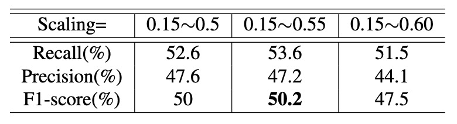
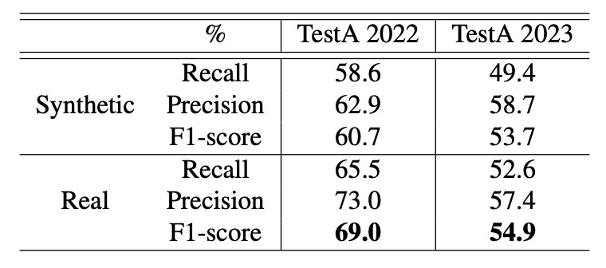
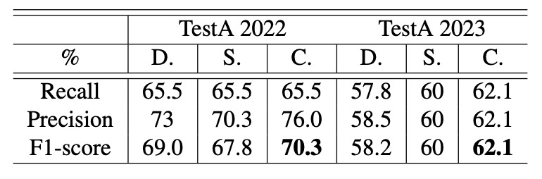
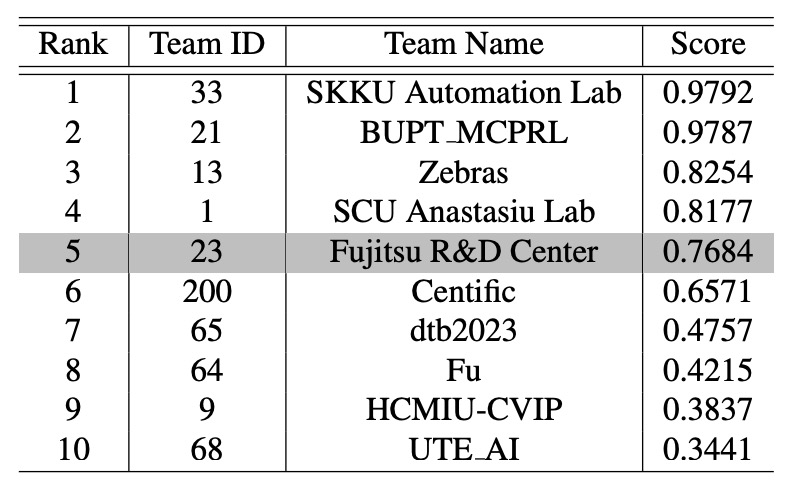

## 堅定的軌跡

[**CheckSORT: Refined Synthetic Data Combination and Optimized SORT for Automatic Retail Checkout**](https://openaccess.thecvf.com/content/CVPR2023W/AICity/papers/Shi_CheckSORT_Refined_Synthetic_Data_Combination_and_Optimized_SORT_for_Automatic_CVPRW_2023_paper.pdf)

---

還記得不久前我們看完 2022 AI CITY CHALLENGE Track 4 的 DeepACO 系統嗎？

現在這篇是 2023 AI CITY CHALLENGE 的比賽冠軍論文，我們接著看。

## 定義問題

自助結帳正逐漸成為零售場域的標配，不論是無人商店還是傳統賣場的數位轉型，都希望透過影像辨識系統，在不干預使用者流程的前提下，**快速、準確地辨識商品與數量**。

這樣的任務，一般在計算機視覺領域中，通常被形式化為一個結合「多類別商品偵測、分類與計數」的多模組系統。

乍看之下，這項任務不過就是將現有的物件偵測、追蹤與分類技術組合起來。

但實際動手操作起來，卻會發現一堆問題。

一個完整的影像式自動結帳系統，至少包括以下五個模組：

<figure style={{"width": "60%"}}>

</figure>

1. **前處理**：如何從乾淨的合成資料中產生更貼近實拍的訓練樣本？
2. **物件偵測**：如何定位商品與手部，並取得遮罩以供後續處理？
3. **物件追蹤**：如何追蹤短暫且可能重疊的商品軌跡？
4. **商品分類**：如何提升辨識率並適應視角、遮擋、光照的變化？
5. **後處理**：如何從多個 frame 的暫時結果中整合出最終結帳商品清單？

作者認為每個部分都必須精心設計，才能滿足實際落地的需求。

## 解決問題

在自動結帳的任務中，或許最困難的部分是取得具有代表性的訓練資料，這不僅涉及實地拍攝，還需要耗費人力逐格標註。

所以作者先從**合成資料優化**著手，提出一套可控式資料合成流程，生成大量多樣的合成影像。

### 合成資料優化

具體來說，參賽者會獲得每個商品的純淨合成圖與遮罩，然後自行生成背景、進行拼接，製作訓練用的合成影像。

這項過程看似單純，但這次比次的結果來看，這幾乎是決定成敗的關鍵。

因為商品與背景的合成方式，將直接決定模型表現的上限。為提升合成圖的真實性與多樣性，作者設計了一套可控式資料合成流程，其中核心是三個超參數：

- **商品數量（number of products）**
- **遮擋程度（occlusion / IoU）**
- **縮放比例（scaling size）**

這三者彼此牽動：放進太多商品會導致遮擋增加，若縮放太小又可能失真。

因此，作者允許使用者自行設定參數範圍，例如：

- 商品數：1 ～ 6 個
- 遮擋上限：IoU ≤ 0.3
- 縮放比例：0.15 ～ 0.5

透過系統性的排列組合，產生大量多樣合成資料。

經過消融實驗後，發現：

- **遮擋控制在 0.5 以下**或完全無遮擋，效果最佳；
- **商品縮放比例維持在 0.5 附近**，準確率較穩定。

除了調整參數之外，作者也對比了不同背景來源的影響。

雖然官方禁止使用外部資料，但作者仍在限制範圍內，實作了**使用實拍背景圖拼接商品**的版本，發現在多數情境下，**使用真實背景比純合成圖更具效益**。

這也順便證實了一個業界常識：

> **合成資料永遠只是次佳選擇，若能使用真實資料，總是更具價值。**

在資料的使用策略上，這些合成資料被應用於兩大模型的訓練：

1. **商品偵測（Detection）**：使用 COCO 上預訓練的 **DetectoRS** 模型進行 fine-tuning。此模型同時具備 detection 與 segmentation 能力，能同時定位商品與遮擋的手部。
2. **商品分類（Classification）**：從合成資料中額外擷取背景變化多樣的商品圖，進行分類模型訓練。

### 模型架構

CheckSORT 在架構上延續自 DeepSORT 和 StrongSORT，論文可以參考一下連結：

- [**[17.03] Simple Online and Realtime Tracking with a Deep Association Metric**](https://arxiv.org/abs/1703.07402)
- [**[22.06] StrongSORT: Make DeepSORT Great Again**](https://arxiv.org/abs/2202.13514)

作者在追蹤邏輯中導入了兩大關鍵改進：

1. **解耦式 Kalman 濾波器（Decomposed Kalman Filter）**
2. **動態特徵序列管理（Dynamic EMA Tracklet Gallery）**

### SORT 算法簡介

傳統的 SORT / DeepSORT / StrongSORT 都是採用「Tracking-by-detection」的兩階段方式，其中輸入是每一幀的物件偵測結果，輸出則是對應的商品軌跡。

追蹤器內部將每個 bounding box 初始化為一條軌跡（tracklet），並透過 **Kalman filter** 預測未來位置。軌跡根據匹配狀況維持三種狀態：

- `tentative`：剛建立的軌跡
- `confirmed`：連續多張影格被正確匹配後升級
- `deleted`：長時間無匹配則移除

每一幀處理流程如下：

1. **預測**：對當前每條 confirmed 軌跡預測 bounding box 新位置。
2. **匹配**：計算所有 detection box 與軌跡間的距離矩陣，透過匈牙利演算法進行關聯。
3. **更新**：根據匹配結果更新每條軌跡的 Kalman 狀態與內部描述子。

### 解耦式 Kalman filter

傳統 Kalman filter 將 bounding box 狀態向量表示為：

$$
\mathbf{x} = [x, y, a, h, \dot{x}, \dot{y}, \dot{a}, \dot{h}]
$$

其中：

- $(x, y)$：中心座標
- $a$：長寬比（aspect ratio）
- $h$：高度
- “$\dot{\ }$” 表導數，即變化速率

問題在於：**中心移動 $(x, y)$ 與外觀形變 $(a, h)$ 的運動模式差異極大**，如下圖所示：

<figure style={{"width": "90%"}}>

</figure>

- **橘色曲線**：商品移動時 $(x, y)$ 平穩連續；
- **紅色曲線**：商品翻轉時 $(a, h)$ 常劇烈跳動。

為此，作者提出解耦式 Kalman 濾波（Decomposed Kalman Filter, DKF），將整體狀態拆解為兩組獨立的 Kalman 運算：

- **位置向量**：

  $$
  \mathbf{p} = [x, y, \dot{x}, \dot{y}]
  $$

- **形狀向量**：

  $$
  \mathbf{b} = [a, h, \dot{a}, \dot{h}]
  $$

兩者共享下列轉移矩陣 $A$ 與觀測矩陣 $H$：

$$
A =
\begin{bmatrix}
1 & 0 & 1 & 0 \\
0 & 1 & 0 & 1 \\
0 & 0 & 1 & 0 \\
0 & 0 & 0 & 1
\end{bmatrix}, \quad
H =
\begin{bmatrix}
1 & 0 & 0 & 0 \\
0 & 1 & 0 & 0
\end{bmatrix}
$$

此外，為建構**距離矩陣**，分別計算位置與形狀的 Mahalanobis 距離如下：

- **位置距離**：

  $$
  d^{(p)}(i,j) = (\mathbf{p}_j - \hat{\mathbf{p}}_i)^\top P_i^{-1} (\mathbf{p}_j - \hat{\mathbf{p}}_i)
  $$

- **形狀距離**：

  $$
  d^{(b)}(i,j) = (\mathbf{b}_j - \hat{\mathbf{b}}_i)^\top B_i^{-1} (\mathbf{b}_j - \hat{\mathbf{b}}_i)
  $$

### 動態特徵序列

自 DeepSORT 起，軌跡匹配已結合外觀特徵，不再只依賴位置。

CheckSORT 引入改良策略：

- **StrongSORT** 使用 EMA 平滑的固定長度特徵向量；
- **CheckSORT** 採用 **動態、非連續特徵庫**，僅當新特徵與歷史特徵有足夠差異時才新增，避免重複。

定義如下：

- 每條軌跡 $i$ 擁有一組狀態（原文為：gallery）：

  $$
  E_i = \{e^t_i\}, \quad t = 1 \ldots L
  $$

- 當新特徵 $e^T_i$ 與既有 $E_i$ 差異足夠時才加入；

- 外觀距離定義為：

  $$
  d^{(a)}(i,j) = \min \{ 1 - e^T_i \cdot e^t_j \mid e^t_j \in E_j \}
  $$

最終成本矩陣結合三種信號，並透過加權調整其重要性：

$$
c(i,j) = \lambda_p \cdot d^{(p)}(i,j) + \lambda_b \cdot d^{(b)}(i,j) + \lambda_a \cdot d^{(a)}(i,j)
$$

這使得匈牙利演算法能在綜合考量位置、形狀、外觀三者的基礎上，達成最適匹配。

### 後處理優化

即使前述匹配結果已具高品質，CheckSORT 最後仍進行一輪「軌跡校正」，處理下列三種常見誤差情況：

1. 軌跡過短或屬於背景類別 → **刪除**
2. 軌跡中間斷裂超過 0.5 秒 → **拆分**為兩條
3. 多條屬於同一類別、時間差小於 3 秒 → **合併**

不過這個部分已經算是經驗法則，並非論文的核心貢獻。

下圖顯示後處理前後的辨識差異：

<figure style={{"width": "60%"}}>

</figure>

## 討論

作者發現，**AI CITY CHALLENGE 2023** 的第 4 軌任務與前一年略有差異：2023 年的任務要求預測商品在影片中「首次出現的影格」，而 2022 年僅需預測「出現的秒數」。

雖然作者希望能直接在 2023 年的測試集上驗證演算法，但因資料集未提供 ground truth，最後改以手動標註 _TestA 2022_ 與 _TestA 2023_ 中商品的出現時間（以秒計），作為替代評估基準。

評估方式延續 2022 年規則，採用 **F1‑score** 作為準則，其中：

- **TP（True Positive）**：成功在感興趣區域正確辨識物件；
- **FN（False Negative）**：未能正確辨識的標註物件。

此外，大會提供了 **116,500 張合成影像**，以及 **116 個 3D 商品模型**。

### 合成資料的影響

<figure style={{"width": "60%"}}>

<figcaption>在不同 IoU 下，CheckSORT 在 _TestA 2022_ 的表現</figcaption>
</figure>

<figure style={{"width": "60%"}}>

<figcaption>在不同 IoU 下，CheckSORT 在 _TestA 2023_ 的表現</figcaption>
</figure>

作者設計了控制變因實驗，探討兩個超參數對效能的影響：一是 **IoU 的上限**，另一是 **縮放比例範圍**。在固定縮放範圍為 0.15∼0.5 的條件下，作者觀察不同 IoU 上限下的辨識效果，如上表。

實驗顯示：**IoU 上限越大，整體效能越好**。這代表生成的訓練資料中商品間如果存在更多遮擋，將有助於模型在複雜場景中進行多物件辨識與追蹤。

接著，作者將 IoU 上限固定為 0.1，觀察不同縮放範圍對效能的影響，如下表：

<figure style={{"width": "60%"}}>

<figcaption>在不同縮放範圍下，CheckSORT 在 _TestA 2022_ 的表現</figcaption>
</figure>

<figure style={{"width": "60%"}}>

<figcaption>在不同縮放範圍下，CheckSORT 在 _TestA 2023_ 的表現</figcaption>
</figure>

實驗指出：**縮放約落在 0.55 時，可獲得最佳效能**。

- 若縮放比例太大，將導致樣本數不足；
- 若比例太小，則與實際應用情境不符，影響泛化能力。

### 合成與真實背景比較

根據前述最佳參數組合，作者進一步評估背景樣式對模型的影響。

實驗設定使用「合成背景」與「真實背景」兩種配置，並於 _TestA 2022_ 與 _2023_ 資料集進行測試，結果如下表所示：

<figure style={{"width": "60%"}}>

<figcaption>在 IoU ≤ 0.5、縮放範圍 0.4∼0.8 下的表現</figcaption>
</figure>

<figure style={{"width": "60%"}}>

<figcaption>在 IoU ≤ 0.5、縮放範圍 0.3∼0.75 下的表現</figcaption>
</figure>

作者指出：**無論測試資料集或參數配置，使用真實背景皆能提升辨識效果**，特別是在「IoU ≤ 0.5、縮放範圍 0.4∼0.8」的情況下，真實背景可帶來約 **8% 的效能提升**。

### CheckSORT 成效分析

<figure style={{"width": "60%"}}>

<figcaption>在 IoU ≤ 0.5、縮放範圍 0.3∼0.75 下的比較</figcaption>
</figure>

<figure style={{"width": "60%"}}>

<figcaption>在 IoU ≤ 0.5、縮放範圍 0.4∼0.8 下的比較</figcaption>
</figure>

最後，作者比較了三種追蹤器在不同情境下的效能表現：**DeepSORT**、**StrongSORT** 以及作者提出的 **CheckSORT**。

結果顯示，**CheckSORT 在各種設定下皆優於其他方法**，展現良好的穩定性與泛化能力。

根據目前公開的排行榜，CheckSORT 在官方 TestA 評估中位居 **第 5 名**。

<figure style={{"width": "60%"}}>

</figure>

## 結論

最後的結果我們都已經知道了。

**CheckSORT 在 2023 AI CITY CHALLENGE Track 4 中奪得冠軍。**

這項成果凸顯出，自動結帳任務中最大的挑戰，並非單純提升追蹤或辨識的準確率，而是如何有效**縮小訓練資料與實際測試環境之間的差距（domain gap）**。在真實世界中，光線變化、遮擋情況、擺放角度等因素錯綜複雜，使得模型在泛化能力上面臨極大考驗。

這篇論文正是從這個核心問題出發，提出兩大解法：

- 一方面，作者設計了**合成資料優化流程**，透過調控 IoU 上限與縮放參數，生成更多具代表性的訓練樣本；
- 另一方面，作者提出針對商品結帳場景，在濾波層級上解耦位置與形狀資訊，使追蹤在旋轉、翻轉、遮擋等狀態下依然穩定。

這些改進不僅提升了模型在各種複雜情境下的辨識率，也為自動結帳系統的實際應用提供了更堅實的基礎。

:::info
有興趣的讀者可以從這個連結過去看一下：

- [**AI City Challenge 2023 Track 4 Leaderboard**](https://www.aicitychallenge.org/2023-challenge-winners/)

  

  :::
