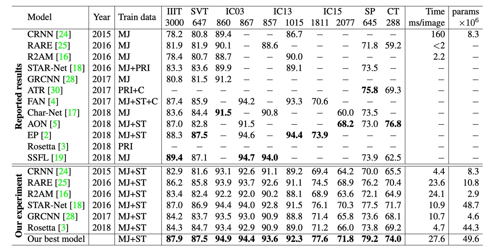
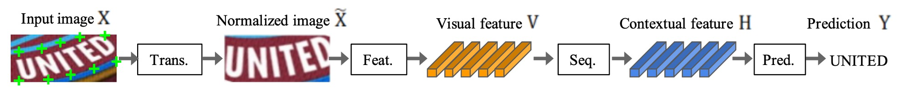

# [19.04] WWWSTR

## 資料與模型分析

[**What Is Wrong With Scene Text Recognition Model Comparisons? Dataset and Model Analysis**](https://arxiv.org/abs/1904.01906v4)

---

這篇是 Clova AI 發表的論文，其中沒有提出新技術，而是對現有的演算法和資料集進行了一個全面的分析和不同模組間的排列組合，藉此探索潛在的最優解。

## 資料集分析

不同研究採用了不同的數據集組合進行訓練，這可能會導致性能提升的原因不清楚，無法確定是因為提出的新模型貢獻？還是因為使用了更好的或更大的數據集？

這樣的數據集不一致性會影響結果的公正性。

### 訓練資料集

由於標注場景文字圖像的成本高，難以獲得充足的標注資料，大多數 STR 模型選擇使用合成數據集進行訓練。

以下介紹兩個在 STR 研究中常用的合成數據集：

- **MJSynth（MJ）**

  - [**Synthetic Word Dataset**](https://www.robots.ox.ac.uk/~vgg/data/text/)

    

    <figure style={{ "width": "60%"}}>
    
    </figure>
    

  MJSynth 是專為 STR 設計的合成數據集，包含 890 萬個單詞框圖像。其生成過程包括：字體渲染、邊框與陰影渲染、背景上色、字體與背景的合成、應用透視變形、與真實圖像混合、以及添加噪音。

- **SynthText（ST）**

  - [**SynthText in the Wild Dataset**](https://www.robots.ox.ac.uk/~vgg/data/scenetext/)

    

    <figure style={{ "width": "60%"}}>
    
    </figure>
    

  SynthText 原本是為場景文字檢測設計的合成數據集，但也被用於 STR 研究。研究人員通過裁剪單詞框來使用此數據集進行 STR 訓練。裁剪後的 SynthText 數據集包含約 550 萬張訓練數據。

### 測試資料集

不同版本的基準數據集存在一定程度的差異。

例如：在 IC03 中，7 個樣本的差異可能導致 0.8% 的性能差距，這在比較先前研究的結果時是一個巨大的差距。

而在 IC13 和 IC15 中的樣本數差距甚至比 IC03 更大。

七個真實場景的 STR 數據集廣泛用於訓練後的模型評估，這些數據集根據文字的難度和幾何布局可分為「規則數據集」和「不規則數據集」：

- **規則數據集**：包含水平排列且字元之間間距均勻的文字圖像，這類數據集相對容易處理：

    

    <figure style={{ "width": "60%"}}>
    
    </figure>
    

  - **IIIT5K-Words (IIIT)**：來自 Google 圖像搜尋的數據集，包含 2,000 張訓練圖像和 3,000 張評估圖像。
  - **Street View Text (SVT)**：從 Google Street View 收集的戶外街景圖像，其中一些圖像有噪聲、模糊或低解析度，包含 257 張訓練圖像和 647 張評估圖像。
  - **ICDAR2003 (IC03)**：用於 ICDAR 2003 穩健閱讀比賽，包含 1,156 張訓練圖像和 1,110 張評估圖像。因為排除掉過短或含有非字母數字字元的詞，數據集有兩個版本（860 張和 867 張圖像）。
  - **ICDAR2013 (IC13)**：繼承了大部分 IC03 的圖像，為 ICDAR 2013 穩健閱讀比賽設立，包含 848 張訓練圖像和 1,095 張評估圖像。評估時有兩個版本，分別包含 857 張和 1,015 張圖像。

---

- **不規則數據集**：包含更具挑戰性的場景文字，如曲線、任意旋轉或扭曲的文字：

    

    <figure style={{ "width": "60%"}}>
    
    </figure>
    

  - **ICDAR2015 (IC15)**：用於 ICDAR 2015 穩健閱讀比賽，包含 4,468 張訓練圖像和 2,077 張評估圖像，圖像來自 Google Glass 佩戴者的自然移動中，因此有很多噪聲、模糊和旋轉的圖像。研究中評估版本有 1,811 張和 2,077 張圖像兩種。
  - **SVT Perspective (SP)**：從 Google Street View 收集，包含 645 張評估圖像，其中許多圖像因非正面視角而帶有透視投影。
  - **CUTE80 (CT)**：從自然場景中收集的數據集，包含 288 張裁剪後的評估圖像，許多為曲線文字圖像。

### 版本差異

根據上表資訊，不同研究使用了不同版本的基準數據集進行模型評估（特別是在 IC03、IC13 和 IC15 數據集中）。

例如在 IC03 中，7 個樣本的差異可能導致 0.8%的性能差距，這在比較先前研究的結果時是一個巨大的差距。而在 IC13 和 IC15 中的樣本數差距甚至比 IC03 更大。這些數據集版本的差異在評估模型性能時會導致顯著的誤差，這些差異需要在比較不同模型性能時予以特別注意。

:::tip
版本錯誤，抱憾終生！不可不慎！
:::

## 架構分析

STR 類似於計「物體檢測」任務與「序列預測」任務，受益於卷積神經網絡（CNN）和循環神經網絡（RNN）。

最早將 CNN 與 RNN 結合用於 STR 的模型是 CRNN，該模型透過 CNN 提取特徵，並使用 RNN 進行序列預測。之後有許多變體被提出以提升性能，並引入了不同的模組來處理字體風格和背景等複雜特徵。

部分方法甚至省略了 RNN 階段以減少推論時間。後續研究為了改進字元序列的預測，則引入了基於注意力機制的解碼器。

STR 四階段架構大致如下：

1. **轉換階段（Transformation）**：使用空間轉換網絡（STN）來標準化輸入文字圖像，以減少後續階段的負擔。
2. **特徵提取階段（Feature Extraction）**：將輸入圖像轉換為專注於字元辨識的表徵，同時抑制與字體、顏色、大小及背景無關的特徵。
3. **序列建模階段（Sequence Modeling）**：捕捉字元序列中的上下文資訊，使每個字元的預測更加準確。
4. **預測階段（Prediction）**：根據特徵提取的結果預測出最終的字元序列。

### 轉換階段

這個階段的模組將輸入圖像 X 轉換為標準化後的圖像 X'。

由於自然場景中的文字圖像形狀多樣（如彎曲、傾斜的文字），如果不經過處理直接輸入後續階段，特徵提取階段將需要學習與這些幾何變形不變的表徵。

為了減輕這種負擔，部分研究使用了薄板樣條（Thin-Plate Spline, TPS）變換，這是一種空間變換網絡（STN）的變體。TPS 通過在一組標準點之間進行平滑樣條插值來標準化文字區域。

TPS 能夠靈活處理不同比例的文字圖像，並將文字區域正規化為預定的矩形。

### 特徵提取階段

在這個階段，卷積神經網絡（CNN）將輸入圖像（X 或 X'）抽象為視覺特徵圖。

每個特徵圖的列對應於輸入圖像水平方向上的一個可區分的接收域，這些特徵用於預測每個接收域中的字元。

作者研究了三種常見的架構：VGG、RCNN 和 ResNet：

- **VGG**：由多層卷積層和少數全連接層組成。
- **RCNN**：CNN 的一種變體，能夠遞歸應用以調整接收域，依據字元形狀進行自適應處理。
- **ResNet**：透過殘差連接，緩解了訓練深層 CNN 的困難。

### 序列建模階段

特徵提取階段的輸出被重塑為特徵序列 V，即特徵圖的每一列 $v_i \in V$ 被用作序列中的一幀。

然而，這樣的序列可能缺乏上下文資訊，因此，先前的研究使用雙向長短期記憶網絡（或稱為 BiLSTM）來增強序列 $H = Seq.(V)$ 的表現，捕捉字元序列中的上下文關聯。

### 預測階段

在這個階段，從序列 $H$ 中預測字元序列 $Y = y_1, y_2, …$。

基於之前的研究，作者提供了兩種預測選項：

1. **連接主義時序分類（CTC）**：該方法可以在特徵數固定的情況下預測非固定長度的序列，並透過刪除重複字元和空白，將完整的字元序列轉換為最終輸出。
2. **基於注意力機制的序列預測（Attention-based Sequence Prediction, Attn）**：該方法自動捕捉輸入序列中的信息流，學習字元級別的語言模型來表示輸出類別之間的依賴性。

這些模組可以依需求進行選擇或調整，以適應不同的場景文字辨識應用。

## 實驗配置

如同之前提到的，資料集對 STR 模型的表現有顯著影響，為了公平比較，作者固定了訓練、驗證和評估資料集的選擇。

- **訓練數據集**：MJSynth（8.9 百萬樣本）和 SynthText（5.5 百萬樣本）組合而成的資料集，共 14.4 百萬樣本。
- **驗證數據集**：IC13、IC15、IIIT 和 SVT 的訓練集聯合作為驗證資料集。
- **訓練參數**：AdaDelta 優化器、衰減率 ρ=0.95、訓練批次大小 192、總迭代次數 300,000 次、梯度剪裁幅度 5、He 初始化方法、每 2,000 次訓練步驟後驗證模型。
- **重複資料處理**：IC03 的部分訓練資料被排除，因為其中 34 個場景圖像（包含 215 個文字框）與 IC13 的評估資料集中重複。
- **評估指標**：
  - **準確率**：針對 9 個評估資料集進行字詞預測的成功率分析。
  - **速度評估**：測量每張圖片的平均處理時間（毫秒）。
  - **記憶體評估**：計算整個 STR 模型中可訓練的浮點參數數量。
- **實驗環境**：Intel Xeon(R) E5-2630 v4 2.20GHz CPU、NVIDIA TESLA P40 GPU、252GB RAM。

## 討論

作者對不同模組組合的準確率-速度和準確率-記憶體的權衡分析。

上圖展示了所有模組組合的權衡圖，圖中包括六個先前提出的 STR 模型（以星號標示）。

### 準確率-時間權衡分析

<figure style={{ "width": "80%"}}>

</figure>

根據上表 (a)，T1 是耗時最少的模型，因為它不包含任何轉換或序列模組。

從 T1 到 T5，模組依次加入（以**粗體**顯示）：**ResNet**、**BiLSTM**、**TPS**（薄板樣條）以及**Attn**（注意力機制）。

在 T1 到 T5 的變化中，每次僅變更一個模組，框架能根據應用場景提供平滑的性能過渡，從而在性能與計算效率之間做出最小的取捨。

**ResNet、BiLSTM 和 TPS** 顯著提升準確率（69.5%→82.9%），但總體上僅引入了相對適度的速度下降（1.3 毫秒 →10.9 毫秒）。

**Attn** 的引入使準確率進一步提升了 1.1%，但效率大幅降低（27.6 毫秒），顯示其效率成本極高。

### 準確率-記憶體權衡分析

<figure style={{ "width": "80%"}}>

</figure>

根據上表 (b)，P1 是記憶體消耗最少的模型，從 P1 到 P5 逐步增加模組導致記憶體與準確率之間的權衡。

在準確率-記憶體權衡中，每次也僅變更一個模組，並逐步提升準確率，模組依次變更為：**Attn**、**TPS**、**BiLSTM** 及 **ResNet**。

與 T1 中使用的 VGG 相比，**RCNN** 在 P1-P4 中顯得更加輕量化，並提供了良好的準確率-記憶體權衡。RCNN 使用較少的獨立 CNN 層，這些層反覆應用，提供了輕量化且高效的性能。

轉換、序列和預測模組對記憶體消耗的影響不大（1.9M→7.2M 參數），但可以顯著提升準確率（75.4%→82.3%）。

**ResNet** 則在最後階段引入，使準確率增加了 1.7%，但記憶體消耗大幅增加至 49.6M 浮點參數。因此，對記憶體消耗敏感的應用可以自由選擇轉換、序列和預測模組，但應避免使用像 ResNet 這樣的高負荷特徵提取器。

### 模組分析

作者分析各個模組在準確率、速度和記憶體需求方面的表現。

- **準確率提升**：對比於規則的基準數據集，在不規則數據集上的性能提升約為兩倍。當比較準確率提升與時間使用時，模組升級順序為：**ResNet、BiLSTM、TPS、Attn**，這是從基礎組合（None-VGG-None-CTC）進行升級的最有效順序，與準確率-時間權衡前沿的升級順序（T1→T5）一致。

- **準確率-記憶體觀點**：從記憶體消耗的角度，最有效的模組升級順序是：**RCNN、Attn、TPS、BiLSTM、ResNet**，這也與準確率-記憶體權衡前沿的順序（P1→P5）一致。但是對時間和記憶體最有效的模組升級順序正好相反。

### 失敗案例分析

作者分析了所有失敗案例。

上圖展示了六種常見的失敗情況，在基準資料集中的 8,539 個範例中，有 644 張圖片（7.5%）未被任何模型正確辨識。

1. **書法字體**：

   - 某些品牌字體（如「Coca Cola」）或街道店名（如「Cafe」）的特殊字體風格仍然是挑戰。這類多樣化的字體表達要求一種新的特徵提取器，提供更具廣泛適應性的視覺特徵。
   - **未來研究方向**：或許能通過正則化來防止模型過度擬合於訓練資料集中的字體風格。

2. **垂直文本**：

   - 大多數當前的 STR 模型假設文字圖像為水平方向，因此無法有效處理垂直文本。部分模型已經嘗試利用垂直資訊，但垂直文本的處理仍然不夠完善。
   - **未來研究方向**：進一步研究可能需要涵蓋垂直文本的辨識。

3. **特殊字元**：

   - 由於當前的基準測試不評估特殊字元，現有的研究在訓練時排除了它們，導致模型將這些字元錯誤地視為字母或數字字元。
   - **未來研究方向**：建議在訓練時加入特殊字元，這樣可以將 IIIT 資料集的準確率從 87.9%提高到 90.3%。

4. **嚴重遮擋**：

   - 當前方法尚未充分利用上下文信息來克服遮擋問題。
   - **未來研究方向**：可以考慮採用更強大的語言模型，最大限度地利用上下文信息。

5. **低解析度**：

   - 現有模型沒有明確處理低解析度情況。
   - **未來研究方向**：圖像金字塔或超解析度模組可能有助於提升性能。

6. **標籤噪音**：

   - 有些失敗的範例是由於數據集中存在錯誤標籤。經檢查，所有基準數據集都包含噪音標籤。
   - **標籤噪音統計**：
     - 未考慮特殊字元的錯誤標籤比例為 1.3%。
     - 考慮特殊字元的錯誤標籤比例為 6.1%。
     - 考慮大小寫敏感性的錯誤標籤比例為 24.1%。

## 結論

本論文對場景文字辨識領域進行了深入且全面的分析，提出了一個統一的分析框架，為不同模型的性能進行了公平比較。

如果在這之前的論文你沒時間看，那至少要看這篇！

它能幫助你快速理解 2019 年文字辨識領域的現狀，並為你的研究提供清晰的方向，避免走許多彎路。
