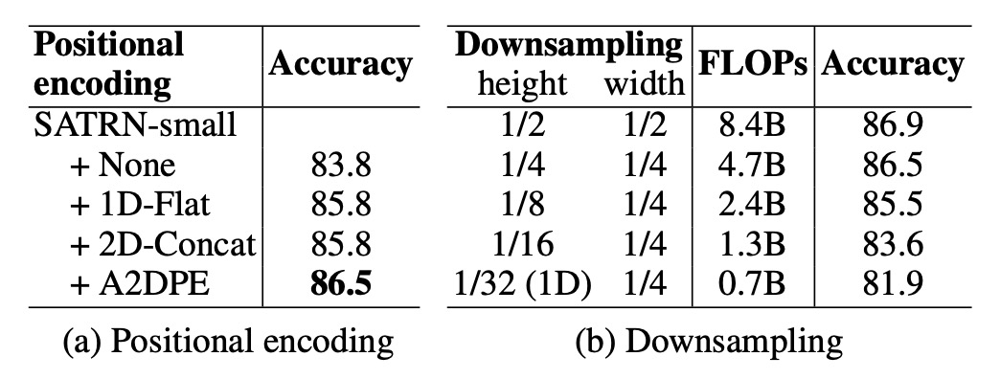

# [19.10] SATRN

## Transformer 抵達戰場

[**On Recognizing Texts of Arbitrary Shapes with 2D Self-Attention**](https://arxiv.org/abs/1910.04396)

---

Transformer 在發表後的幾年間，這陣風也陸續吹進了不同的領域。

這篇論文是 Clova AI 發表的，他們也想將 Transformer 的優勢引入 Scene Text Recognition (STR) 領域，或許能解決一些問題。

## 定義問題

任意形狀的文字仍困擾著廣大的研究者們。

雖然在過去幾年間，陸續有人提出一些解決方案，但這些方法的表現仍然不夠理想。特別是多數研究都還是基於文字水平排列的假設，這導致模型無法的泛化能力有限。

此時此刻，Transformer 已經發表了兩年多，BERT 已經在 NLP 領域大殺四方，作者想著：或許 Transformer 的注意力機制能夠幫助我們解決這個問題。

:::tip
這篇論文發表時，ViT 還沒有問世呢！
:::

## 解決問題

### 模型架構

<figure style={{"width": "70%"}}>

</figure>

作者提出了模型架構，看起來就是一個標準的 Transformer，但針對 STR 任務進行了一些改良。Transformer 的架構我們不再重複討論了，如果你對它不熟悉，可以參考：

- [**[17.06] Transformer: 新世界的起點**](../../transformers/1706-transformer/index.md)

在編碼器的部分，輸入影像首先經過淺層卷積神經網路 (CNN) 提取局部圖像模式與紋理，以減輕自注意力模組的計算負擔。此 CNN 包含兩個 $3 \times 3$ 卷積層與 $2 \times 2$ 的最大池化層，池化層的步長為 2。

自注意力模組基於 Transformer 自注意力，並使用自適應 2D 位置編碼，以處理文字的隨機排列問題。

FFN 的部分，作者提出了一個新的局部感知前饋層 (Locality-aware Feedforward Layer)，以增強對局部結構的關注，這裡改動的地方是將原生的點對點前饋層的 $1 \times 1$ 卷積層改為 $3 \times 3$ 卷積層。

解碼器的部分，從編碼器的 2D 特徵圖中提取文字序列。

解碼過程中，圖像輸入與文字輸出的跨模態在第二個多頭注意力模組中實現。解碼器的結構大部分與 Transformer 解碼器相同，主要使用多頭注意力和點對點前饋層。

:::tip
**自適應 2D 位置編碼**

原文為：Adaptive 2D Positional Encoding (A2DPE)。

作者為了解決文字隨機排列的問題，通過動態調整寬度和高度的比率來適應輸入影像的不同特徵。A2DPE 透過以下公式動態調整位置編碼：

$$
p_{hw} = \alpha(E) p_{\text{sinu}}^h + \beta(E) p_{\text{sinu}}^w
$$

其中 $p_{\text{sinu}}^h$ 和 $p_{\text{sinu}}^w$ 是正弦位置編碼，$E$ 是影像特徵，$ \alpha(E) $ 和 $ \beta(E) $ 分別由影像特徵 $E$ 通過兩層感知機 (perceptron) 計算，並利用 sigmoid 函數控制相對比率。
:::

## 討論

### 和先前方法的比較

SATRN 相較於其他 2D 特徵圖方法，在所有基準測試上表現更佳，特別是在不規則文本的基準測試中，SATRN 與第二名方法相比平均提升了 4.7 個百分點。

這個架構在處理任意形狀的文字識別上具有優勢，並且表現優於使用空間變換網絡（STN）和 2D 特徵圖的其他方法。

### 和 SAR 模型的比較

:::tip
之前我們看 SAR 模型的時候有提到後續的研究比較，就是這篇論文。

- [**[18.11] SAR: 二維注意力圖**](../1811-sar/index.md)
  :::

SATRN 與 SAR 模型在編碼器（自注意力 vs 卷積網路）與解碼器（自注意力 vs LSTM）上有顯著區別。SAR 使用 ResNet 編碼器與 LSTM 解碼器，而 SATRN 採用了自注意力編碼器與解碼器。

SATRN 相比 SAR 在提高準確度的同時，還改善了計算效率。升級 SAR 的 ResNet 編碼器至 SATRN 編碼器，準確率提升了 1.0 和 0.9 個百分點，且減少了 1200 萬參數和 5.5B FLOPs。

### 多行文本辨識

為了更具體地評估模型在不同形狀扭曲下的表現，作者從 IC13 資料集中合成了新的測試集，特別是旋轉與多行文字。

旋轉文字的部分，作者使用了從 0° 到 360° 均勻分布的旋轉進行訓練，並將輸入圖像調整為 64×64 尺寸；多行文字的部分，作者使用合成文字資料集（SynthText 與 MJSynth）進行模型訓練，並從 IC13 中手動裁剪出多行文字圖像用於測試。

在實驗中，SATRN 在所有旋轉角度下的表現都優於基準模型 FAN 和 SAR，並且在各種旋轉角度下保持穩定的性能。在多行文字辨識上，SATRN 在推理過程中能夠進行大範圍跳轉，從當前行轉移到下一行，展現了其優異的表現。

下圖展示 SATRN 解碼器在提取 2D 特徵時的注意力圖：

### 消融研究

- **自適應 2D 位置編碼 (A2DPE)**：相比不使用位置編碼、1D 位置編碼和 2D 拼接編碼，A2DPE 顯示出最佳的準確度，並且能夠動態調整長寬比以適應文本排列的多樣性，顯著提高了模型性能。
- **特徵圖高度的影響**：隨著特徵圖的尺寸縮減，運算量與準確度均下降，尤其當高度下採樣率超過 1/8 時，準確度急劇下降，這強調了在計算過程中保持 2D 特徵圖的重要性。

## 結論

SATRN 驗證了在 STR 任務中使用 Transformer 的有效性，並且在多項基準測試中都達到了新的最先進表現，平均提升 5.7 個百分點。

雖然 SATRN 提升了準確度，但自注意力層的使用導致模型在內存和運算需求上有所增加，特別是解碼器部分增加了顯著的 FLOPs 和參數量，但這顯然不是問題！

後續研究可以進一步研究如何減少模型的計算量，以應用於更多的實際應用場景。
