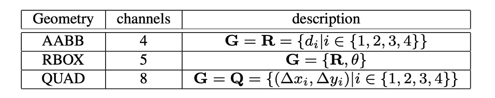
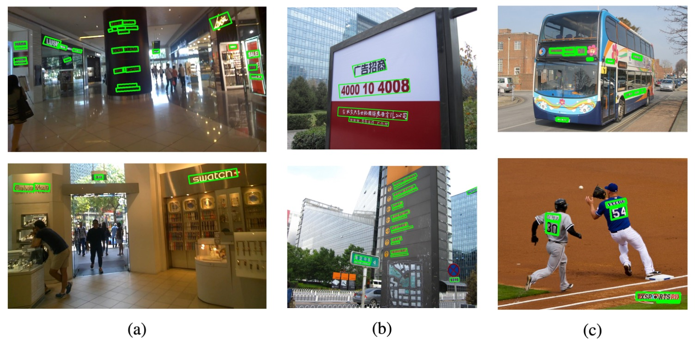

# [17.04] EAST

## 日出東方

[**EAST: An Efficient and Accurate Scene Text Detector**](https://arxiv.org/abs/1704.03155v2)

---

在全卷積網路 FCN 開始流行後，密集預測的方式解決了文字尺寸變化劇烈的問題。接著，多尺度特徵融合概念也正式走進人們的視野。FPN 論文提出了特徵金字塔網絡，將不同層次的特徵進行融合，提高了物體檢測的準確率。

既然解題的工具有了，研究者們肯定是要找個地方來用用看。

文字檢測領域也理所當然地跟上了這個潮流。

## 定義問題

作者整理了過去文獻所使用的文字檢測的方法，如上圖。

大多數的方法必須經過兩個以上的步驟，像是文字區域特徵計算、方向計算、區域合併等。又或是依賴手動設計的特徵，基於筆畫寬度和最大穩定極值區域之類的方法。

但不只是你不喜歡，作者也不喜歡這些方法。因為這些方法需要太多步驟了！不好用啊！

作者的目標就是希望能夠提出一個簡單且高效的方法。

## 解決問題

由於文字區域的大小變化很大，確定大區域文字的存在需要神經網路後期的特徵，而預測包含小區域文字的精確幾何形狀需要早期的低階資訊，因此模型需要融合多尺度的特徵。

### 模型架構

在上圖架構中，最左邊的黃色區塊，就是我們熟知的 Backbone 網路，可以隨意替換。在論文中，作者使用 VGG16 作為 Backbone 網路。

綠色區塊是特徵金字塔網絡，作者使用了 FPN 作為特徵金字塔網絡。這裡我們不再贅述 FPN 的細節，有興趣的讀者可以參考：

- [**[16.12] FPN: 金字塔架構**](../../feature-fusion/1612-fpn/index.md)

最後是檢測頭的設計。

作者使用 FPN 網路所輸出的「最大解析度」的特徵圖進行預測，分成三個部分：

1. **RBOX**：由 4 個軸對齊邊界框和 1 個旋轉角度組成，共輸出 5 個通道。其中 4 個通道分別代表像素位置到矩形的上、下、左、右四個邊的距離。
2. **QUAD**：由 4 個點組成，共輸出 8 個通道，表示四邊形的四個角頂點到像素位置的座標偏移，因為必須區分 $\Delta x$ 和 $\Delta y$，所以共輸出 8 個通道。
3. **SCORE**：輸出文字的分數，用來判斷是否為文字區域，共輸出 1 個通道。

輸出概念圖如下：

### 標籤生成

1. **四邊形的分數圖生成**

   當幾何形狀為四邊形時的情況，分數圖中的四邊形正區域設計為原四邊形的縮小版本，如上圖 (a) 所示。對於一個四邊形 $Q = \{p_i | i ∈ \{1, 2, 3, 4\} \}$，其中 $p_i = \{x_i, y_i\}$ 是按順時針順序排列的頂點。

   縮小四邊形的步驟如下：

   1. 首先計算每個頂點 $p*i$ 的參考長度 $r_i$，公式為：

      $$
      r_i = \min(D(p_i, p_{(i \mod 4)+1}), D(p_i, p_{((i+2) \mod 4)+1}))
      $$

      其中 $D(p_i, p_j)$ 是頂點之間的 L2 距離。

   2. 先縮短四邊形的兩條較長的邊，再縮短較短的邊。
   3. 對於兩對相對的邊，通過比較它們長度的均值來判斷哪一對為「較長」。
   4. 每條邊 $p_i$ 與 $p_{(i \mod\ 4)+1}$ 的縮小方式是將兩端點沿邊內縮，分別移動 $0.3r_i$ 和 $0.3r_{(i \mod 4)+1}$。

2. **幾何圖生成**

   幾何圖可以是 RBOX 或 QUAD。RBOX 的生成過程如上圖 (c-e) 所示。

   對於那些以四邊形 (QUAD) 樣式標註的數據集（例如 ICDAR 2015），作者首先生成一個最小面積的旋轉矩形來覆蓋該區域。對於每個有正分數的像素，則是計算其到文本框四個邊界的距離，並將其放入 RBOX 的 4 個通道中。

   另外一種對於 QUAD 的 Mask 標籤則是對每個有正分數的像素，其在 8 通道幾何圖中的值是該像素到四邊形 4 個頂點的座標偏移量。

### 損失函數

總損失函數可以表示為：

$$
L = L_s + λ_g L_g
$$

其中，$L_s$ 表示分數圖的損失，$L_g$ 表示幾何圖的損失，$λ_g$ 用來平衡兩者的權重。

在實驗中，設置 $λ_g = 1$。

- **分數圖的損失**

  許多先進的檢測方法使用平衡抽樣和難負樣本挖掘來解決目標物不均衡的分佈問題，這些技術雖能提升效能，但會增加非微分過程和調參負擔。為了簡化訓練過程，作者使用了類別平衡交叉熵：

  $$
  L_s = \text{balanced-xent}( \hat{Y}, Y^* )
  $$

  $$
  = -β Y^* \log \hat{Y} - (1 - β)(1 - Y^*) \log(1 - \hat{Y})
  $$

  其中，$\hat{Y}$ 是預測的分數圖，$Y^*$ 是真實標籤，$β$ 是正負樣本的平衡因子：

  $$
  β = 1 - \frac{\sum_{y^* \in Y^*} y^*}{|Y^*|}
  $$

  這種平衡交叉熵首次由 Yao 等人用於文本檢測，實際應用效果不錯。

  - [**[16.06] Scene Text Detection via Holistic, Multi-Channel Prediction**](https://arxiv.org/abs/1606.09002)

- **RBOX 損失**

  文本檢測的一個挑戰在於自然場景中文本尺寸的差異很大，直接使用 $L_1$ 或 $L_2$ 損失會使大文本區域的損失偏大。為了確保對大小文本區域都有準確的幾何預測，損失函數應該具備尺度不變性。

  因此，對於 RBOX 的 AABB 部分，作者採用 IoU 損失；

  $$
  L_{\text{AABB}} = -\log \text{IoU}( \hat{R}, R^* ) = -\log \frac{| \hat{R} \cap R^* |}{| \hat{R} \cup R^* |}
  $$

  其中，$\hat{R}$ 是預測的 AABB 幾何，$R^*$ 是真實值。

  旋轉角度的損失為：

  $$
  L_{\theta}( \hat{\theta}, \theta^* ) = 1 - \cos( \hat{\theta} - \theta^* )
  $$

  幾何圖的總損失為 AABB 和角度損失的加權總和：

  $$
  L_g = L_{\text{AABB}} + λ_{\theta} L_{\theta}
  $$

  其中，$λ_{\theta}$ 在實驗中設置為 10。

- **QUAD 損失**

  對於 QUAD，作者基於 Smooth L1 損失，並加入一個針對單詞四邊形的正規化項，其通常在一個方向上較長。

  所有四邊形座標的有序集合表示為：

  $$
  C_Q = \{x_1, y_1, x_2, y_2, ..., x_4, y_4\}
  $$

  損失函數表示為：

  $$
  L_g = L_{\text{QUAD}}( \hat{Q}, Q^* )
  $$

  $$
  = \min_{Q' \in P_{Q^*}} \sum_{c_i \in C_Q, c'_i \in C_{Q'}} \frac{\text{smooth L1}( c_i - c'_i )}{8 \times N_{Q^*}}
  $$

  其中，正規化項 $N_{Q^*}$ 是四邊形最短邊的長度：

  $$
  N_{Q^*} = \min_{i=1}^{4} D( p_i, p_{(i \mod 4)+1} )
  $$

  $P_Q$ 表示所有可能的頂點排列，因為公開數據集中四邊形的標註順序並不一致。

### 訓練策略

網絡使用 ADAM 優化器進行端到端訓練。為了加速學習，從影像中均勻抽取 512x512 的裁切區域來組成每批次大小為 24 的小批次。ADAM 的學習率從 $1 \times 10^{-3}$ 開始，每 27300 個小批次衰減為原來的十分之一，直到 $1 \times 10^{-5}$ 為止。

**訓練過程持續進行，直到性能不再提升。**

:::tip
是個不管不顧 Train 到底的策略。
:::

### 局部感知的 NMS

在進行閾值篩選後，保留下來的幾何形狀需要透過 NMS 合併。

傳統的 NMS 演算法的時間複雜度是 $O(n^2)$，其中 $n$ 是候選幾何數量，這在密集預測的情況下是不可接受的，因為在這個情境中，要面對的是成千上萬的幾何形狀。

---

假設附近像素的幾何形狀通常高度相關，作者提出「按 row 合併」的方式。

對於同一 row 的幾何形狀，迭代地將當前遇到的幾何形狀與上一個已合併的幾何形狀合併。這種改進方法在最佳情況下的運行時間複雜度為 $O(n)$。雖然最壞情況下與傳統的 NMS 相同，但只要局部性假設成立，演算法在實踐中運行速度就能滿足需求。

具體過程如以下：

- [**LA-NMS 程式碼實作**](https://github.com/foamliu/EAST/blob/master/lanms/lanms.h)

與傳統 NMS 不同，這裡採用的是「加權平均」幾何形狀，而不是「選擇」幾何形狀，這實際上起到了一種投票機制的作用。然而，為了方便理解作者在這裡仍然使用「NMS」一詞作為功能描述，因為其核心功能仍然是在合併和抑制多餘的幾何形狀。

在函數 `WEIGHTEDMERGE(g, p)` 中，兩個多邊形 $g$ 和 $p$ 的頂點座標會根據它們各自的分數進行**加權平均**。如果將合併後的多邊形稱為 $a$，那麼每個頂點的坐標 $a_i$ 都由兩個原始多邊形頂點的坐標 $g_i$ 和 $p_i$ 根據它們的分數進行加權計算，公式如下：

$$
a_i = V(g)g_i + V(p)p_i
$$

其中：

- $V(g)$ 和 $V(p)$ 分別是多邊形 $g$ 和 $p$ 的分數。
- $g_i$ 和 $p_i$ 是這兩個多邊形的第 $i$ 個頂點的坐標。
- $a_i$ 是合併後多邊形 $a$ 的第 $i$ 個頂點的坐標。

合併後多邊形 $a$ 的總分數 $V(a)$ 則是兩個原始多邊形分數的總和：

$$
V(a) = V(g) + V(p)
$$

### 基準數據集

為了比較所提出的演算法與現有方法，作者在三個公開基準數據集：ICDAR2015、COCO-Text 和 MSRA-TD500 上進行實驗。

- **ICDAR 2015**：

  - 包含 1500 張圖片，其中 1000 張用於訓練，500 張用於測試。
  - 文本區域用四邊形的四個頂點標註，對應本文中的 QUAD 幾何格式。
  - 圖像由 Google Glass 拍攝，文本可能有任意方向，並可能受到運動模糊或低解析度的影響。
  - 還使用了 ICDAR 2013 的 229 張訓練圖片。

- **COCO-Text**：

  - 當前最大的文本檢測數據集，共包含 63,686 張圖片，其中 43,686 張用於訓練，20,000 張用於測試。
  - 文本區域以軸對齊的邊界框（AABB）標註，這是 RBOX 的特例。
  - 對於此數據集，角度 $$θ$$ 被設為 0，並與 ICDAR 2015 相同的數據處理與測試方法。

- **MSRA-TD500**：
  - 包含 300 張訓練圖片和 200 張測試圖片，文本區域為任意方向，且以句子為單位標註。
  - 標註格式為 RBOX，數據集中包含英文和中文文本。
  - 因為訓練圖片數量過少，我們使用了來自 HUST-TR400 數據集的 400 張圖片進行補充訓練。

## 討論

### ICDAR 2015

單一尺度下 F-score 為 0.7820，多尺度測試後達到 0.8072，明顯超越過去的最佳方法（0.8072 vs. 0.6477）。使用 QUAD 輸出時，對比文獻[41]中的最佳方法高出 0.0924，使用 RBOX 輸出時高出 0.116。

### COCO-Text

在所有設置中，本論文的方法都是最佳表現，F-score 提升了 0.0614，Recall 提升了 0.053。

### MSRA-TD500

使用 PVANET2x 時，F-score 為 0.7608，比過去最先進的系統高出 0.0208，精度提升 0.0428。VGG16 表現較差（F-score 0.7023 vs. PVANET2x 的 0.7608），因為 MSRA-TD500 的評估要求輸出句子級別的預測，而 VGG16 的感受野較小。

### 可視化結果

## 結論

本論文設計了一個簡單且高效的文本檢測框架，通過單一神經網絡就能夠完成從整圖到文字區域的檢測，並生成精確的幾何預測。這一方法避免了多步驟的複雜處理流程，使得模型更為輕量且易於實現。

在這篇研究中，對於訓練方式的討論沒有過多著墨，因此我們無法得知這個架構的設計中，哪個組件對於最終的效果起到了關鍵作用。但從實驗結果來看，這個方法在三個基準數據集上都取得了最佳效果，證明了其在文字檢測領域的優越性。
