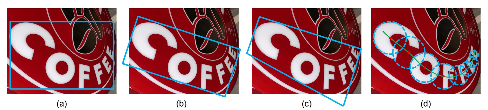
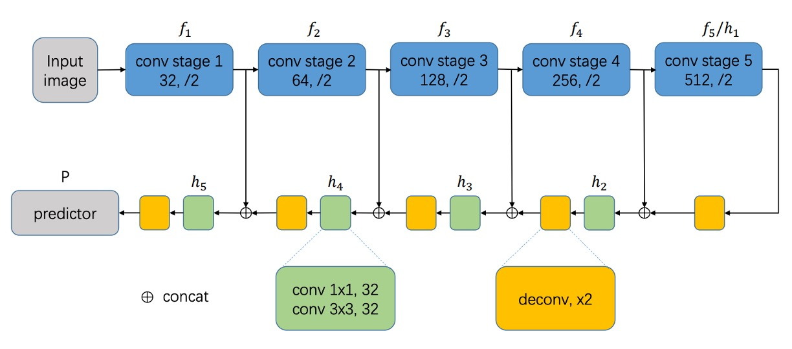
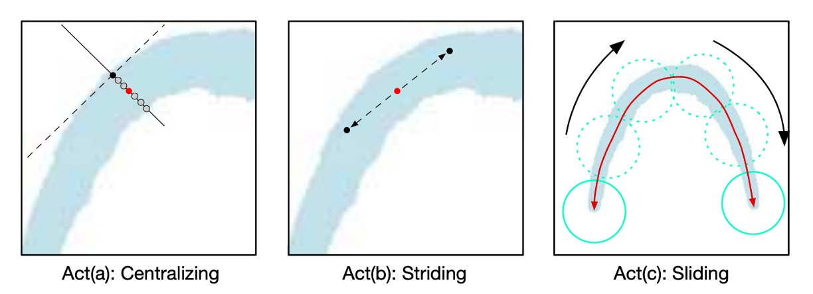
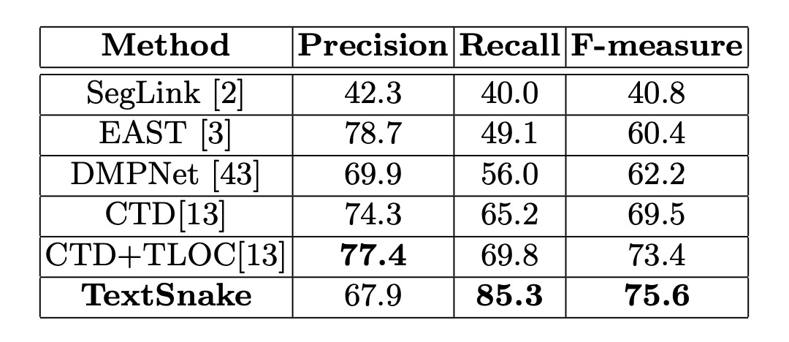
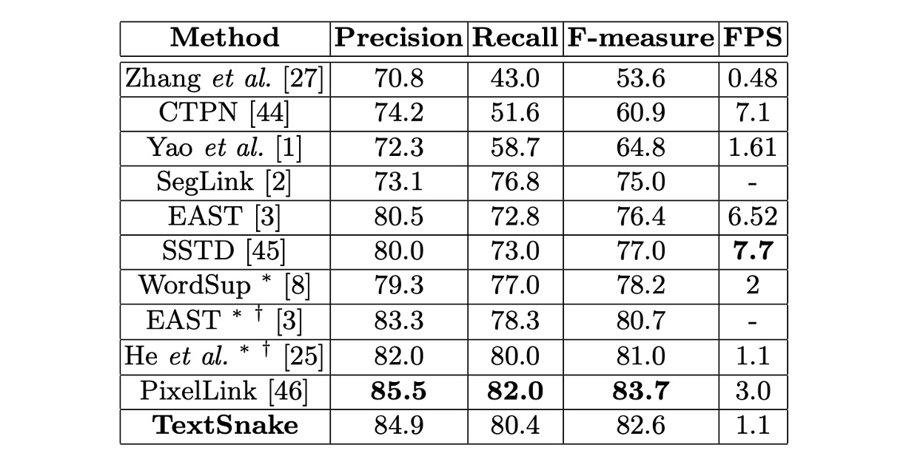

# [18.07] TextSnake

## 文字蛇

[**TextSnake: A Flexible Representation for Detecting Text of Arbitrary Shapes**](https://arxiv.org/abs/1807.01544v2)

---

我們覺得這篇論文特別有趣，這就一起來看看吧！

## 定義問題

文字的形狀千奇百怪，變化多端。

然而，大多數現有的文字偵測方法都有一個強烈的假設，即文字實例大致呈線性形狀，因此採用相對簡單的表示法（軸對齊矩形、旋轉矩形或四邊形）來描述它們。儘管這些方法在標準基準測試上取得了進展，但在處理不規則形狀的文字實例（例如彎曲文字）時可能會不足。但不論是哪一種表示方式，都無法很好地擬合文字的形狀。

為了解決這個問題，作者大膽地提出了一個圓盤式的文字檢測方式，該表示法以一系列有序的、重疊的圓盤描述文本，每個圓盤位於文本區域的中心軸並與潛在可變的半徑和方向相關聯。由於其形狀類似於蛇，因此取其名稱為 **TextSnake**。

## 解決問題

### 表示方式

TextSnake 透過一系列重疊圓盤來表示文字，這些圓盤可以靈活應對旋轉、縮放及彎曲等變化。每個圓盤位於文字的中心線，並附有半徑與方向等幾何屬性，能適應文字的旋轉、縮放及彎曲。一個文字範例 $t$ 由數個字元組成，可以視為有序的圓盤序列 $S(t)$：

$$
S(t) = \{D_0, D_1, \cdots, D_i, \cdots, D_n\}
$$

其中 $D_i$ 表示第 $i$ 個圓盤，且總共有 $n$ 個圓盤。每個圓盤 $D$ 具有幾何屬性 $D = (c, r, \theta)$，其中 $c$ 是圓盤的中心，$r$ 是圓盤的半徑，$\theta$ 是圓盤的方向。

圓盤的半徑 $r$ 定義為文字寬度的一半，方向 $\theta$ 則是中心線在中心 $c$ 附近的切線方向。文字區域 $t$ 可以通過計算序列 $S(t)$ 中所有圓盤的並集來重建。

:::tip
**特別注意**：這些圓盤並不對應於具體的文字字元，但這些幾何屬性可以用來矯正不規則形狀的文字，將其轉換為矩形、直線的圖像區域，方便文字辨識器處理。
:::

### 模型架構

模型設計的部分，一開始是個中規中矩的操作。

我們會需要先挑選一個 Backbone 網路，這邊可以選用 VGG16 或是 ResNet 之類的。然後搭配特徵融合的技巧，這邊作者選用 FPN 架構的融合概念，將不同尺度的特徵圖進行融合。

整體來說，沿用 FCN 的方式，就是使用端到端的像素預測，不配置任何 Linear 層，直接輸出像素級的預測結果。

:::tip
不是完全按照 FPN 說的來，裡面有一點小更改。但大方向是一樣的，就是向上相加融合。
:::

---

接著是預測頭的設計。

這裡選用 FPN 的最大解析度的特徵，直接預測文字的幾個幾何屬性：

1. **TCL（Text Center Line）**：文字中心線，區分是否為文字區域，共 2 個通道。
2. **TR（Text Region）**：文字區域，區分文字的範圍，共 2 個通道。
3. **Radius**：圓盤的半徑，用來描述文字的寬度，共 1 個通道。
4. **cos($\theta$) 和 sin($\theta$)**：圓盤的方向，用來描述文字的旋轉，各自使用 1 個通道，共 2 個通道。

所以輸出總共有 7 個通道，透過這幾個屬性來描述文字的形狀。把 TCL 和 TR 相乘，就可以得到文字核心的區域，並且可以區分出每個文字實例。

### 文字蛇推論

作者提出了一個「跨步演算法」（striding algorithm）來精確預測文字的形狀和路徑。

如上圖所示，首先隨機選擇一個像素作為起始點，並將其**集中**（Centralizing）。接著在兩個相反方向進行搜尋，進行**跨步**（Striding）和集中，直到到達文字的兩端。

此過程會生成兩個有序的點列表，分別代表文字實例的兩端，最終合併這兩個列表產生中心軸列表，準確描述文字的形狀。

---

這三個主要動作的詳細說來是這樣：

- **Act(a) 中心化（Centralizing）**：

  如上圖所示，給定 TCL 上的一個點，可以分別畫出切線和法線（虛線為切線，實線為法線）。利用幾何圖，找到法線與 TCL 區域的交點，交點的中點即為**集中點**。

- **Act(b) 跨步（Striding）**：

  算法向下一個點進行跨步搜尋，通過幾何圖來計算每一步的位移：

  $$\left( \frac{1}{2}r \cos\theta, \frac{1}{2}r \sin\theta \right)$$ 和 $$\left( -\frac{1}{2}r \cos\theta, -\frac{1}{2}r \sin\theta \right)$$

  若下一步超出 TCL 區域，則逐漸減少跨步長度，直到進入 TCL 區域或到達文字的末端。

- **Act(c) 滑動（Sliding）**：

  算法沿著中心軸進行迭代，並沿著中心軸畫圓。圓的半徑由幾何圖中的 $r$ 圖獲取。圓覆蓋的區域即為預測的文字實例。

作者利用幾何圖和精確描述文字路徑的 TCL，不僅能偵測文字，還能預測其形狀和路徑。跨步演算法避免了遍歷所有相關像素的低效處理，提升了模型的效率和準確性。這個推論過程結合了幾何特徵和跨步搜尋，成功地處理了文字偵測和形狀重建的問題。

### 標注生成方式

假設文字實例為「蛇形」，即不會分叉成多條路徑。對於蛇形的文字實例，其頭尾的兩條邊是平行但方向相反的。

給定一個由頂點 $\{v_0, v_1, v_2, \dots, v_n\}$ 組成的文字實例，依順時針或逆時針排列。

為每條邊 $e_{i,i+1}$ 定義一個度量值：$$M(e_{i,i+1}) = \cos\langle e_{i+1,i+2}, e_{i-1,i}\rangle$$，兩個 $M$ 值最接近 $-1$ 的邊被認為是頭尾邊，例如上圖中的 AH 和 DE。

:::tip
計算兩條邊的夾角，可以通過計算兩條邊的內積來獲得，內積的值域為 $[-1, 1]$，當兩條邊平行時，內積為 1；當兩條邊垂直時，內積為 0；當兩條邊相反時，內積為 -1。
:::

在頭尾兩條邊上，均勻取樣相同數量的錨點（anchor points），如上圖中的 ABC 和 HGF。TCL 點是對應錨點的中點。將 TCL 的兩端縮短 $\frac{1}{2} r_{end}$ 個像素，以確保 TCL 在 TR 內部，這樣有助於網路學習分離相鄰的文字實例，其中 $r_{end}$ 是 TCL 端點的半徑。為了避免 TCL 成為單點線而受噪聲影響，將 TCL 區域擴展 $\frac{1}{5} r$。

對於每個 TCL 點：

1. $ r $ 計算為該點到相應邊的距離。
2. $ \theta $ 通過在鄰域內擬合直線來計算 TCL 點的方向。

對於非 TCL 像素，將其對應的幾何屬性設為 0 以便處理。

### 損失函數

模型的總損失函數定義為：

$$
L = L_{\text{cls}} + L_{\text{reg}}
$$

其中，$L_{\text{cls}}$ 表示分類損失，$L_{\text{reg}}$ 表示回歸損失。

- **分類損失（$L_{\text{cls}}$）**：

  $L_{\text{cls}}$ 包含 TR（文字區域）和 TCL（文字中心線）的分類損失：

  $$
  L_{\text{cls}} = \lambda_1 L_{\text{tr}} + \lambda_2 L_{\text{tcl}}
  $$

  其中，$L_{\text{tr}}$ 和 $L_{\text{tcl}}$ 為 TR 和 TCL 的交叉熵損失。

  為了提升模型的效果，對 TR 損失採用了「**在線困難負樣本挖掘**」（Online Hard Negative Mining），並將負樣本與正樣本的比例控制在最多 3:1。對於 TCL 損失，只考慮 TR 區域內的像素，且不採用樣本平衡方法。

- **回歸損失（$L_{\text{reg}}$）**：

  回歸損失包括對 $r$（半徑）、$\cos\theta$ 和 $\sin\theta$ 的回歸損失：

  $$
  L_{\text{reg}} = \lambda_3 L_r + \lambda_4 L_{\sin} + \lambda_5 L_{\cos}
  $$

  回歸損失使用 Smoothed-L1 loss 計算：

  $$
  \begin{pmatrix}
  L_r \\
  L_{\cos} \\
  L_{\sin}
  \end{pmatrix} = \text{SmoothedL1} \begin{pmatrix}
  \frac{\hat{r} - r}{r} \\
  \hat{\cos\theta} - \cos\theta \\
  \hat{\sin\theta} - \sin\theta
  \end{pmatrix}
  $$

  其中，$\hat{r_b}$、$\hat{\cos\theta}$ 和 $\hat{\sin\theta}$ 是預測值，而 $r$、$\cos\theta$ 和 $\sin\theta$ 是對應的真實值。

損失函數中的權重常數 $\lambda_1, \lambda_2, \lambda_3, \lambda_4, \lambda_5$ 在實驗中都設為 1。

### 訓練資料集

1. **SynthText**：

   - 用於對模型進行預訓練。
   - 這是一個大規模數據集，包含約 80 萬張合成圖像。
   - 這些圖像由自然場景與隨機字體、大小、顏色和方向的文字混合而成，具有很高的現實感。

2. **TotalText**：

   - 特點是包含水平、多方向及彎曲文字實例。
   - 其他基準數據集中很少出現彎曲文字，但在實際環境中卻很常見。
   - 數據集包含 1255 張訓練圖像和 300 張測試圖像。

3. **CTW1500**：

   - 另一個主要由彎曲文字構成的數據集。
   - 包含 1000 張訓練圖像和 500 張測試圖像，文字實例標注為 14 個頂點的多邊形。

4. **ICDAR 2015**：

   - 圖像由 Google Glass 拍攝，未考慮定位、圖像品質和視點，包含小型、模糊、多方向的文字實例。
   - 數據集中有 1000 張訓練圖像和 500 張測試圖像，文字實例標注為單詞級的四邊形。

5. **MSRA-TD500**：

   - 這是一個多語言、任意方向和長文字行的數據集。
   - 包含 300 張訓練圖像和 200 張測試圖像，文字行標注為行級標注。
   - 由於訓練集較小，實驗中加入了 HUST-TR400 數據集的圖像作為訓練數據。
   - 在 ICDAR 2015 和 MSRA-TD500 的實驗中，根據模型輸出的文字區域擬合最小外接矩形。

## 討論

### 彎曲文字實驗結果

<figure>

<figcaption>Total-Text 實驗結果</figcaption>
</figure>

<figure>

<figcaption>CTW1500 實驗結果</figcaption>
</figure>

---

在這兩個數據集上，微調模型在大約 5000 次迭代後停止。在 Total-Text 上，門檻值 $T_{\text{tr}}$ 和 $T_{\text{tcl}}$ 分別設為 0.4 和 0.6；在 CTW1500 上，分別設為 0.4 和 0.5。

測試中，Total-Text 的所有圖像都被縮放為 512 × 512 大小，而 CTW1500 中的圖像不做縮放，因為其圖像尺寸較小（最大為 400 × 600）。

在 Total-Text 上，該方法在精度、召回率和 F 值上分別達到 82.7%、74.5%和 78.4%，顯著超越了 EAST 和 SegLink 方法。

在 CTW1500 上，該方法的精度、召回率和 F 值分別為 67.9%、85.3%和 75.6%，比 CTD+TLOC 方法高出 2.2%（75.6%對比 73.4%）。

這些結果證明了該方法能夠有效處理自然場景中的彎曲文字。

### ICDAR2015 實驗結果

微調模型在 ICDAR 2015 上於大約 30000 次迭代後停止。

測試中，所有圖像被縮放為 1280 × 768 大小，門檻值 $T_{\text{tr}}$ 和 $T_{\text{tcl}}$ 設為 0.4 和 0.9。因為 ICDAR 2015 中包含許多未標註的小文字，預測的矩形如果短邊小於 10 像素或面積小於 300，會被濾除。

在 ICDAR 2015 上的結果表明，該方法即使僅使用單尺度測試，也能超越大多數競爭對手，展示了 TextSnake 在多方向文字偵測中的通用性。

### MSRA-TD500 實驗結果

微調模型在 MSRA-TD500 上於約 10000 次迭代後停止。

測試中，所有圖像被縮放為 1280 × 768 大小，門檻值 $T_{\text{tr}}$ 和 $T_{\text{tcl}}$ 設為 0.4 和 0.6。

該方法的 F 值達到 78.3%，優於其他方法。
xt、CTW1500、ICDAR 2015 及 MSRA-TD500 上的表現均優於其他競爭方法，顯示了其在處理彎曲文字、多方向文字和長直文字行的能力。

:::tip
效果不錯，就是太慢了。
:::

### 可視化結果

## 結論

傳統方法在處理彎曲文字時，往往會失去文字的幾何細節，導致文字辨識的準確度下降。

TextSnake 的主要貢獻在於定位不規則形狀的文字，它的靈活性和幾何描述能力為後續的文字辨識提供了更精確的基礎。通過精確的曲線跟蹤和中心線定位，能夠生成更規範的文字區域，這對自然場景中進行端到端的文字辨識有極大的幫助。

在論文中，作者也展示了基於 TextSnake 的攤平結果：

未來的研究方向將聚焦於開發端到端的文字檢測與辨識系統，這是 TextSnake 的自然延伸。

若能將該模型與強大的文字辨識算法結合，不僅可以應對更多類型的場景文字，還能進一步提升辨識準確度和效率。
