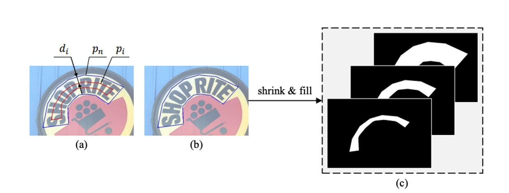
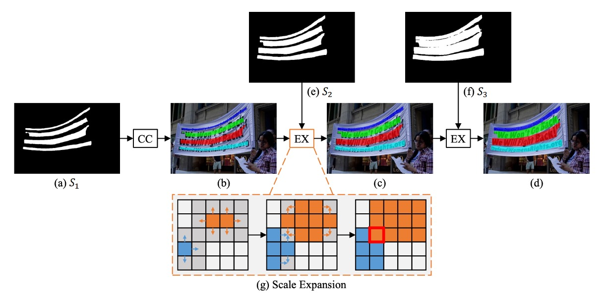
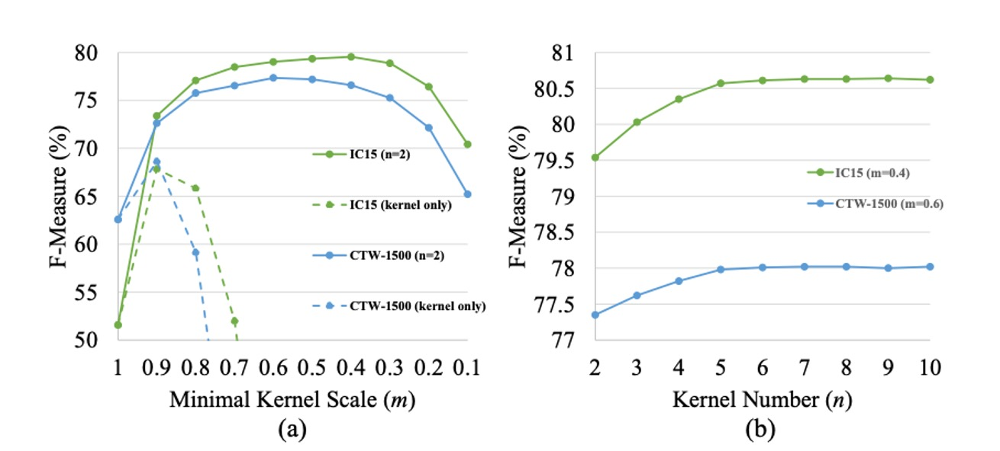
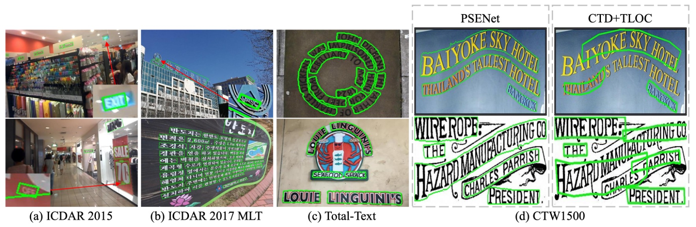

# [19.03] PSENet

## 逐步擴展策略

[**Shape Robust Text Detection with Progressive Scale Expansion Network**](https://arxiv.org/abs/1903.12473)

---

隨著卷積網路的發展逐漸成熟，各種分支的應用也逐漸增加。

其中，文字檢測是一個非常重要的應用，因為它是許多應用的基礎，例如 OCR、自動駕駛、圖像檢索等。然而，由於文字的形狀和大小變化很大，因此設計一個通用的文字檢測模型是一個具有挑戰性的問題。

## 定義問題

比較早期的發展中，物件檢測的技術是研究人員主要關注的方向，因此在文字檢測的領域中，大多數的研究工作都是基於物件檢測的技術進行的。

但物件檢測的方法在文字上確實遇到很多困難，主要有幾個因素：

1. **文字形狀變化劇烈**

   大小變化很劇烈，這其實不是問題。因為在物件檢測中，應用多尺度的特徵並找到不同尺度的物件是一個很常見的做法。問題在於文字的形狀變化很大。

   舉例來說：一個文字，這個檢測框可能是個正方形，但隨著文字的增長，檢測框會愈來愈長，長寬比也會愈來愈大。這種特性尤其在基於錨點的方法中，顯得特別困難。

   因為我們已經基於一些基本知識定義了幾個長寬比讓模型參考，但文字的形狀變化太大，難道我們要無上限的增加錨點嗎？

2. **矩形框不夠貼合**

   如上圖 (b)，文字除了長寬比變化劇烈之外，形狀通常也不是規規矩矩的樣子，像是路邊的招牌，街景中的布條等等，這些形狀可能是彎曲的、不規則的，矩形框很難貼合。

   檢測通常是為了後續的分類，當檢測形狀不夠貼合時，其實就已經失去了檢測的意義。

3. **像素分割難分難捨**

   那改成使用基於分割的方法呢？

   如上圖 (c)，基於分割的方法有一個最明顯的缺點：無法切分相鄰和重疊的文字。這是因為基於分割的方法通常是基於像素的，而文字之間的間隔通常很小，這樣的方法很難區分文字之間的邊界。

   無法區分意味著檢測失敗，顯然也是不可接受的。

為了解決上面提到的種種困難，本篇論文的作者基於分割的理念，提出了一個新的想法：不如我們就找到文字的核心，然後逐漸擴展，直到找到文字的邊界，如何？

## 解決問題

### 模型架構

模型架構非常簡單，上圖左邊就是常見的 Backbone + Neck 的 FPN 架構。

得到多尺度的特徵圖之後，接著把所有特徵圖 Concat 起來，然後經過一個預測頭，這個預測頭的目標是預測一連串的文字區塊。仔細看上圖，$S_1$ 是最小的文字區塊，$S_2$ 是 $S_1$ 的擴展，$S_3$ 是 $S_2$ 的擴展，以此類推，一直到 $S_n$。

這些監督資料是從資料集標籤中生成的，生成方式如下圖：

藍色邊框的多邊形代表原始的文字實例，對應到最大的分割標注遮罩。利用 Vatti 裁剪演算法將原始多邊形逐步縮小，得到不同尺度的多邊形 $p_i$，並將每個縮小的多邊形轉換為二元遮罩，用作分割標注的 ground truth。

給定比例尺縮放率 $r_i$，縮小的邊距 $d_i$ 可以根據以下公式計算：

$$
d_i = \frac{Area(p_n) \times (1 - r_i^2)}{Perimeter(p_n)}
$$

其中，$Area(\cdot)$ 是計算多邊形面積的函數，$Perimeter(\cdot)$ 是計算多邊形周長的函數。

比例尺縮放率 $r_i$ 定義如下：

$$
r_i = 1 - \frac{(1 - m) \times (n - i)}{n - 1}
$$

其中，$m$ 是最小比例尺縮放率，範圍在 $(0, 1]$，比例尺縮放率 $r_1, r_2, ..., r_n$ 由兩個超參數 $n$ 和 $m$ 決定，並從 $m$ 線性增加至 1。

最終通過該方法生成的 ground truth 標注圖形會對應到 PSENet 不同尺度的分割結果，使得模型能夠在多尺度上學習文字實例的分割。

### 階層式擴展

作者為了解決文字形狀變化劇烈的問題，提出了一個階層式擴展的方法。

這個方法的核心概念源自廣度優先搜索演算法 (Breadth-First Search, BFS)，其目的是逐步擴展已檢測的文字實例核心（最小核）。

- **初始階段**：如上圖，根據最小核地圖（$S_1$），辨識出 4 個不同的連通區塊，分別標示為 $c_1$、$c_2$、$c_3$、$c_4$。
- **擴展階段**：逐步將最小核擴展至 $S_2$，接著擴展至 $S_3$，最終得到的連通區塊作為文字實例的最終預測結果。

使用 BFS 從多個核像素開始，逐步將相鄰的文字像素合併。在擴展過程中，可能會出現像素衝突的情況，處理方式為「先來先合併」，即一個像素只能被一個核合併。由於擴展過程是漸進的，因此這些邊界衝突不會影響最終的檢測結果和性能。

若要實現這個演算法，可以論文中提供的參考演算法說明，如下圖：

- **輸入**: 核心區塊集 $C$，分割結果 $S_i$
- **輸出**: 擴展後的核心區塊 $E$
- **主要步驟**:
  1. 初始化空集 $T$、$P$ 和隊列 $Q$。
  2. 將每個核心區塊 $c_i$ 中的所有元素加入 $T$ 和 $P$，並將 $c_i$ 加入隊列 $Q$。
  3. 逐一取出 $Q$ 中的元素，檢查其鄰居像素，若符合條件則將鄰居像素加入 $T$、$P$ 並繼續擴展。
  4. 將擴展結果根據標籤分組，得到最終的擴展核心區塊 $E$。

### 損失函數

PSENet 的損失函數定義為：

$$
L = \lambda L_c + (1 - \lambda)L_s
$$

其中，$L_c$ 代表完整文字實例的損失，$L_s$ 代表縮小文字實例的損失，$\lambda$ 用來平衡這兩者的重要性。

由於文字實例在自然圖像中通常只佔據極小區域，若使用二元交叉熵（binary cross entropy），可能會導致網路的預測偏向於非文字區域。

為此，作者採用 Dice 係數來評估損失，其公式如下：

$$
D(S_i, G_i) = \frac{2 \sum_{x,y}(S_{i,x,y} \times G_{i,x,y})}{\sum_{x,y} S_{i,x,y}^2 + \sum_{x,y} G_{i,x,y}^2}
$$

其中，$S_{i,x,y}$ 和 $G_{i,x,y}$ 分別表示分割結果和標注圖中像素 $(x, y)$ 的值。

在訓練過程中，為了區分與文字筆劃類似的圖像模式（如柵欄或格子），使用線上困難樣本挖掘（OHEM）技術來提升$L_c$。

考慮 OHEM 提供的訓練遮罩$M$，$L_c$的公式為：

$$
L_c = 1 - D(S_n \cdot M, G_n \cdot M)
$$

由於縮小的文字實例被完整文字區域包圍，因此在計算 $L_s$ 時忽略分割結果中的「非文字區域」的像素，避免冗餘。

$L_s$的公式如下：

$$
L_s = 1 - \frac{\sum_{i=1}^{n-1} D(S_i \cdot W, G_i \cdot W)}{n - 1}
$$

其中，$W$是忽略非文字區域的遮罩，定義為：

$$
W_{x,y} =
\begin{cases}
1, & \text{If } S_{n,x,y} \geq 0.5; \\
0, & \text{Otherwise}.
\end{cases}
$$

### 訓練資料

- **CTW1500**

  CTW1500 是一個針對長曲線文字檢測的挑戰性資料集，由 Yuliang 等人建構。該資料集包含 1000 張訓練圖片和 500 張測試圖片。不同於傳統文字資料集（如 ICDAR 2015、ICDAR 2017 MLT），CTW1500 的文字實例是由 14 個點的多邊形標注，可以描述任意曲線文字的形狀。

- **Total-Text**

  Total-Text 是一個新發佈的曲線文字檢測資料集，包含水平、多方向及曲線文字實例。該基準資料集包括 1255 張訓練圖片和 300 張測試圖片。

- **ICDAR 2015**

  ICDAR 2015 是文字檢測中常用的資料集，包含 1500 張圖片，其中 1000 張用於訓練，剩下的用於測試。文字區域由四個頂點的四邊形標注。

- **ICDAR 2017 MLT**

  IC17-MLT 是一個大規模的多語言文字資料集，包括 7200 張訓練圖片、1800 張驗證圖片和 9000 張測試圖片。該資料集由來自 9 種語言的完整場景圖像組成。

### 訓練策略

使用基於 ImageNet 預訓練的 ResNet 作為主幹網路，並通過隨機梯度下降法（SGD）進行優化。

IC17-MLT 這個資料集的訓練方式跟別人不一樣：

在訓練 IC17-MLT 時，未使用任何額外數據（如 SynthText）。模型訓練時的 batch size 為 16，使用 4 張 GPU 進行 180K 次迭代。初始學習率設為 $1 \times 10^{-3}$，並在 60K 和 120K 次迭代時將學習率降低至原來的十分之一。

---

除了 IC17-MLT 之外的資料集，其他資料集的訓練策略如下：

Batch size 同樣設為 16，使用 4 張 GPU 進行 36K 次迭代。初始學習率設為 $1 \times 10^{-3}$，並在 12K 和 24K 次迭代時降低至十分之一。

接著在 IC17-MLT 資料集上微調模型，訓練迭代次數為 24K，初始學習率設為$1 \times 10^{-4}$，並在 12K 次迭代時將學習率降低至十分之一。

:::tip
論文中沒有提到對於其他資料集，是使用哪個資料集進行預訓練的，我們推斷是 SynthText。
:::

- **優化與參數設置**

  - 使用權重衰減值 $5 \times 10^{-4}$，Nesterov 動量設為 0.99，且不使用阻尼。
  - 訓練過程中，對所有資料集中 「DO NOT CARE」 的模糊文字區域忽略不計。
  - 損失函數平衡參數 $\lambda$ 設為 0.7，OHEM 的負正樣本比例設為 3。

- **資料增強策略**

  - 圖片以隨機比例 [0.5, 1.0, 2.0, 3.0] 進行縮放。
  - 圖片進行隨機水平翻轉和旋轉，範圍在正負 10 度之間。
  - 從變換後的圖片中隨機裁剪出 $640 \times 640$ 的樣本。

- **結果生成**

  - 對於四邊形文字資料集，計算最小面積矩形以提取邊界框。
  - 對於曲線文字資料集，應用 PSE 的輸出來生成最終結果。

## 討論

### 各組件設計的影響

1. **核心區塊 (Kernel) 能作為最終結果嗎？**

   答案是不能。

   核心區塊的目的是大致定位文字實例，並區分彼此相鄰的文字實例。然而，最小尺度的核心區塊無法覆蓋完整的文字區域，這對文字檢測和辨識造成了不利影響。如上圖 (a) 所示，僅使用最小尺度核心區塊作為最終結果，F-measure 在 ICDAR 2015 和 CTW1500 資料集上的表現極差。

2. **最小核心尺度的影響**

   作者透過設置核心數量 $n = 2$，並讓最小核心尺度 $m$ 從 1 變動到 0.1，來研究其對性能的影響。

   從上圖 (a)可以看出，當 $m$ 太大或太小時，測試集上的 F-measure 會下降。當 $m = 1$ 時，我們僅使用文字分割圖作為最終結果，且不使用漸進尺度擴展算法（PSE），結果顯示沒有 PSE 的基線表現不理想，因為網路無法區分彼此相鄰的文字實例。

   當 $m$ 過大時，PSENet 難以分離靠近的文字實例；而當 $m$ 過小時，PSENet 常常錯誤地將整個文字行分割為不同部分，且訓練難以收斂。

3. **核心數量的影響**

   作者通過保持最小尺度 $m$ 不變，並訓練不同核心數量 $n$ 的 PSENet 來研究其影響。作者設置 ICDAR 2015 資料集上的 $m = 0.4$，CTW1500 資料集上的 $m = 0.6$，並讓 $n$ 從 2 增加到 10。

   結果如上圖 (b) 所示，隨著 $n$ 的增加，測試集上的 F-measure 逐漸上升，並在 $n \geq 5$ 時趨於平穩。多核心的優勢在於，它們彼此相鄰時可以精確重建兩個大小差異較大的文字實例。

### 曲線文字實驗結果

為了測試曲線文字的檢測能力，作者們在 Total-Text 資料集上評估了 PSENet，這兩個資料集主要包含曲線文字。

在測試階段，將圖片的較長邊縮放至 1280，並且只使用 ResNet50 作為主幹網路。

- **CTW1500**

  

  PSENet 在 CTW1500 上超越了所有對比方法，甚至未使用外部數據。PSENet 的 F-measure 達到 82.2%，比 CTD+TLOC 高出 8.8%，比 TextSnake 高出 6.6%。

- **Total-Text**

  

  在 Total-Text 上，PSENet 的精度（84.02%）、召回率（77.96%）和 F-measure（80.87%）均優於現有方法，F-measure 提高了超過 2.47%。特別是 PSENet 在 Total-Text 上相比基線方法的 F-measure 高出超過 40%。

---

作者也展示了幾個挑戰性的結果，並將其與現有的 CTD+TLOC 方法進行視覺比較，如下圖：

### ICDAR2015 實驗結果

作者在 ICDAR 2015 (IC15) 資料集上評估了 PSENet，以測試其方向文字檢測能力。這裡僅使用 ResNet50 作為 PSENet 的主幹網路。在推理過程中，將輸入圖片的長邊縮放至 2240。

在單尺度設定下，PSENet 的 F-measure 達到 85.69%，超越了現有的最佳結果超過 3%。

### 速度分析

作者在 CTW1500 的測試集上進行實驗，對所有測試圖片進行評估並計算平均速度。輸入圖片的長邊縮放至 [1280, 960, 640] 來測試速度。所有結果均使用 PyTorch 和一張 1080Ti GPU 進行測試。

為了在速度與準確率之間取得平衡，使用了 ResNet50 和 ResNet18 作為主幹網路。

- 當輸出特徵圖的大小為輸入圖片的 1/1 時，PSENet 能夠獲得最佳性能，但由於特徵圖較大，PSE 階段的時間消耗超過了總推理時間的一半。
- 當輸出特徵圖的大小為輸入圖片的 1/4 時，PSENet 的每秒幀數（FPS）從 3.9 提升到 8.4，但性能從 82.2%略微下降至 79.9%，如表 2 所示。此時 PSE 階段的時間消耗不到總推理時間的十分之一。
- 當將圖片的長邊縮放至 640 時，FPS 進一步提升至 22，且檢測器的性能仍然保持不錯（75.6%）。

當使用 ResNet18 作為主幹網路時，PSENet 的速度幾乎達到即時處理水平（27 FPS），同時性能仍然具有競爭力。

## 結論

PSENet 的核心思想是透過逐步擴展來解決不規則形狀的場景文字問題。但不管怎麼說，最後還是需要一定的後處理來確定文字區域，這在實際應用中會增加一些計算量和複雜性。

而且逐步擴展策略依賴於初期辨識的文字核心區域。如果核心區域檢測錯誤，後續的擴展步驟會受到影響，進而影響最終的偵測結果。

總之 PSENet 在精度和速度上取得了不錯的平衡，適合用於許多實際應用場景。相對於其他基於語義分割或目標檢測的方法，PSENet 提供了一個新的思路來處理場景中難以檢測的文字，使得文字偵測領域向前邁出了一大步。
