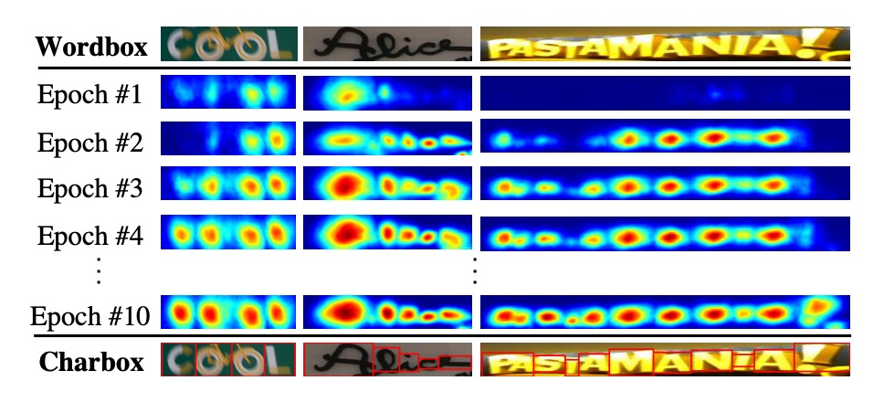
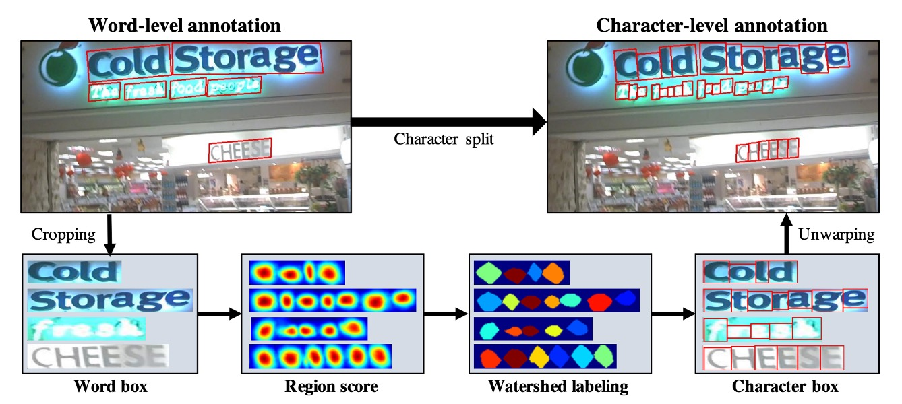
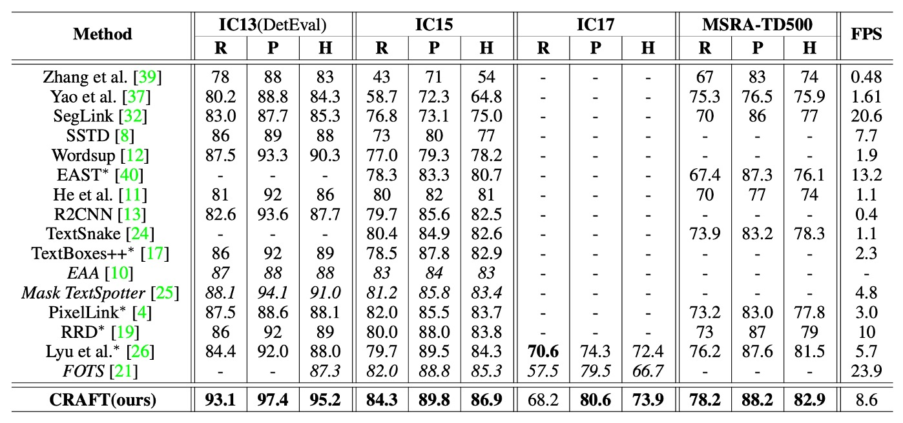
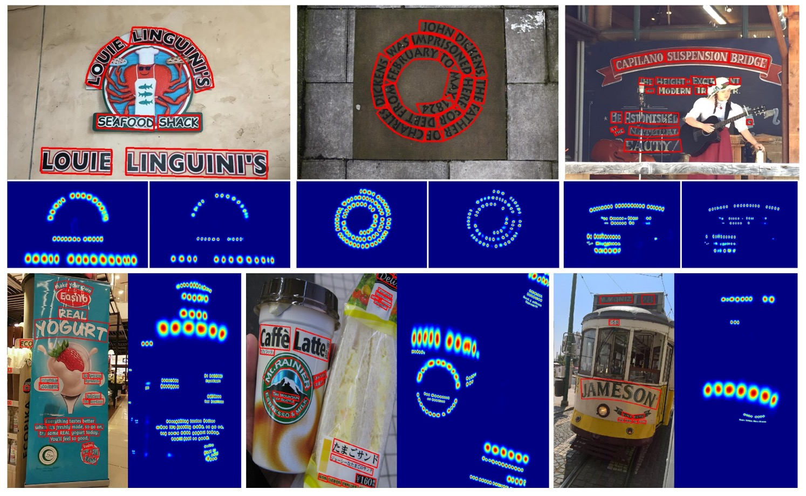

# [19.04] CRAFT

## 文字工藝

[**Character Region Awareness for Text Detection**](https://arxiv.org/abs/1904.01941)

---

今天來看一篇有名的文字檢測論文，CRAFT。

和其他文字檢測論文不同的是，這是一個基於「字元」的文字檢測方法。

## 定義問題

沒什麼人在做「字元」級的文字檢測，主要原因還是因為沒有資料。

後來有一篇論文：Wordsup，採用弱監督框架來訓練字元級的文字檢測器，但卻是採用矩形錨點來定位字元。

- [**[17.08] Wordsup: Exploiting word annotations for character based text detection**](https://arxiv.org/abs/1708.06720)

作者認為這樣的方法不夠精確，因此基於這個靈感，提出了 CRAFT。

## 解決問題

### 模型架構

模型的主架構沒什麼好說的，就是一個 Backbone + Neck 的結構。

如上圖，我們做了一點標注，紅色框起來的部分是 Backbone，這裡作者採用 VGG16。藍色框起來的部分是 Neck，這裡採用 U-Net 的形式，特徵融合的形式採用的是 Concat，而非 Add。

:::tip
在向上融合的階段，如果採用相加，那就是 FPN-like 的結構；如果採用 Concat，那就是 U-Net-like 的結構。
:::

比較不一樣的地方是這裡的 Backbone 有做到 Stage 6，可能是作者想增加模型的感受野，但基於我們的經驗，文字這種小物件，主要負責預測的都是淺層的特徵圖，所以 Stage 6 可能是為了應對資料集內的一些巨無霸文字。

最後是預測頭結構，這裡就是用最高解析度的輸出特徵圖，預測兩個通道的分數圖，分別是區域分數和連結分數。

等等，區域分數和連結分數是什麼？

這是接著要講的，請繼續看下去。

### 標籤生成

要講預測頭之前，我們必須先講標籤生成。

作者先選用了帶有字元級標注的數據集，這些標籤通常是一個 Mask，或是一個文字框。

對於每個訓練圖像，作者用於生成基於字元級的邊界框的:

1. **區域分數(region score)**：代表給定像素是字元中心的機率
2. **連結分數(affinity score)**： 代表相鄰字元之間空間的中心機率

與二值分割的標籤圖不同，作者這裡使用「高斯熱圖」來編碼字元中心的機率，高斯分布值的計算過程較為繁瑣，特別是對於透視變形的字元邊界框。為了提高效率，作者採取以下步驟生成真實標籤：

1. 準備一個**二維等向性高斯圖**。
2. 計算高斯圖區域與每個字元框之間的**透視變換**。
3. **扭曲高斯圖**使其與字元框區域對應。

連結分數的生成是通過相鄰字元框的對角線劃分為上三角形和下三角形，並以這兩個三角形的中心作為框的頂點，生成連結框。

:::tip
這種熱圖表示法常用於姿態估計等應用中，因為它在處理非剛性邊界的地區時有較高的靈活性。
:::

### 弱監督學習

接著是解決訓練資料不足的問題，這裡作者基於詞級標注以弱監督方式生成字元框。

參考上圖流程，首先看到藍色線的流動，這是帶有「字元」級標注的訓練資料圖像，訓練過程最簡單，就是將這些圖像丟進模型，然後計算損失。

接著是沒有標籤的其他圖像，這裡分成兩個部分，分別是上圖中的綠色線和紅色線。

綠色線是將圖像丟入模型，並輸出區域分數，但是問題是沒有監督的標籤。因此接著是紅色線的部分，這裡作者根據詞級標注從圖像中裁剪出單詞圖像，然後輸入模型，讓模型預測區域分數。

像是這樣：

然後使用**分水嶺算法**分割字元區域，並生成字元級邊界框。最後，將座標轉換回原始圖像，於是我們就得到了一個字元級的標籤，如下圖所示：

得到標籤資料之後，之後就回到一般的計算損失的流程。

---

對於每個詞級訓練樣本 $w$，定義信心分數 $s_{conf}(w)$ 為：

$$
s_{conf}(w) = \frac{l(w) - \min(l(w), |l(w) - l_c(w)|)}{l(w)}
$$

其中，$l(w)$ 為單詞長度，$l_c(w)$ 為預測字元的長度。

基於像素的信心地圖 $S_c(p)$ 定義為：

$$
S_c(p) = \begin{cases}
s_{conf}(w), & p \in R(w) \\
1, & \text{其他情況}
\end{cases}
$$

訓練目標函數 $L$ 定義為：

$$
L = \sum_p S_c(p) \cdot \left( \|S_r(p) - S^*_r(p)\|^2_2 + \|S_a(p) - S^*_a(p)\|^2_2 \right)
$$

其中，$S^*_r(p)$ 和 $S^*_a(p)$ 分別代表真實區域分數和連結圖，$S_r(p)$ 和 $S_a(p)$ 分別代表預測區域分數和連結分數。

隨著訓練的進行，模型可以更準確地預測字元，信心分數 $$s_{conf}(w)$$ 逐漸提高。在訓練的早期階段，對於自然圖像中的不熟悉文本，區域分數相對較低。

---

那如果遇到信心分數低於 0.5 時的情況該怎麼辦呢？

作者在論文中設定是：**忽略預測的字元邊界框，因為它們會對模型訓練產生不利影響！**

遇到這種情況下，那作者直接假設字元寬度是常數，並通過將單詞區域均勻劃分為字元級預測。雖然這種方式會生成不精確的字元邊界框，但它可以幫助模型學習未見過的文本外觀。

### 詞級邊界框

推論階段的最終輸出可以是多種形式，如詞框（word boxes）、字元框（character boxes）或多邊形（polygons）。對於像 ICDAR 這樣的資料集，評估標準是詞級的交集比。

以下簡單描述如何通過簡單而有效的後處理步驟，根據預測的區域分數 $S_r$ 和連結分數 $S_a$ 生成詞級邊界框（QuadBox）。

首先，初始化二值圖像 $M$，該圖像覆蓋整個圖像，且所有像素設為 0。

如果

$$
S_r(p) > \tau_r
$$

或

$$
S_a(p) > \tau_a
$$

則將 $M(p)$ 設為 1，$\tau_r$ 為區域閾值，$\tau_a$ 為連結閾值。

第二步，對 $M$ 執行**連通分量標記**（Connected Component Labeling, CCL）。最後，通過找到最小的旋轉矩形來包圍對應於每個標籤的連通分量，獲得 QuadBox。這裡可以使用 OpenCV 提供的 `connectedComponents` 和 `minAreaRect` 函數來實現此操作。

:::tip
CRAFT 模型不需要非極大值抑制之類的後處理方法。由於連通分量標記（CCL）已經將詞區域分割開，詞的邊界框簡單地由包圍這些區域的單一矩形定義。
:::

### 彎曲文字多邊形

為了有效處理彎曲文本，可以生成包圍整個字元區域的多邊形，詳細生成的過程如下：

1. 找到字元區域沿掃描方向的局部極大值線，並將其連接起來，形成圖中黃色的中心。
2. 為了防止最終多邊形結果不均勻，將所有局部極大值線的長度設置為相等的最大長度。
3. 將局部極大值線旋轉至垂直於中心線的方向，以反映字元的傾斜角度（紅色箭頭表示）。這些局部極大值線的端點作為多邊形的控制點候選。
4. 最後，將最外側的兩條傾斜局部極大值線沿中心線向外移動，以完全覆蓋文本區域，形成最終的控制點（綠色點）。

### 訓練資料集

- **SynthText**

  該資料集用於對模型進行預訓練。這是一個大規模數據集，包含約 80 萬張合成圖像。這些圖像由自然場景與隨機字體、大小、顏色和方向的文字混合而成，具有很高的現實感。

- **CTW1500**

  CTW1500 是一個針對長曲線文字檢測的挑戰性資料集，由 Yuliang 等人建構。該資料集包含 1000 張訓練圖片和 500 張測試圖片。不同於傳統文字資料集（如 ICDAR 2015、ICDAR 2017 MLT），CTW1500 的文字實例是由 14 個點的多邊形標注，可以描述任意曲線文字的形狀。

- **Total-Text**

  Total-Text 是一個新發佈的曲線文字檢測資料集，包含水平、多方向及曲線文字實例。該基準資料集包括 1255 張訓練圖片和 300 張測試圖片。

- **ICDAR 2013**

  ICDAR2013 是在閱讀競賽期間發布的，用於聚焦場景文字偵測，由高解析度影像組成，229 張用於訓練，233 張用於測試，包含英文文字。註釋是使用矩形框在字層級進行的。

- **ICDAR 2015**

  ICDAR 2015 是文字檢測中常用的資料集，包含 1500 張圖片，其中 1000 張用於訓練，剩下的用於測試。文字區域由四個頂點的四邊形標注。

- **MSRA-TD500**

  這是一個多語言、任意方向和長文字行的數據集。包含 300 張訓練圖像和 200 張測試圖像，文字行標注為行級標注。由於訓練集較小，實驗中加入了 HUST-TR400 數據集的圖像作為訓練數據。

- **ICDAR 2017 MLT**

  IC17-MLT 是一個大規模的多語言文字資料集，包括 7200 張訓練圖片、1800 張驗證圖片和 9000 張測試圖片。該資料集由來自 9 種語言的完整場景圖像組成。

### 訓練策略

1. 使用 **SynthText** 資料集進行初始訓練，訓練 50,000 次迭代。
2. 使用各基準資料集進行微調模型。對於這些資料集中標記為「DO NOT CARE」的文本區域，透過將 $s_{conf}(w)$ 設置為 0 來忽略這些區域的訓練。
3. 使用 **ADAM** 優化器進行所有訓練過程。
4. 微調過程中，SynthText 資料集以 1:5 的比率混合使用，確保字元區域能夠被充分分離。
5. 採用了 **Online Hard Negative Mining**，比率為 1:3。
6. 基本的數據增強技術如裁剪、旋轉和顏色變化也被應用。

---

弱監督學習的部分需要兩種類型的數據：四邊形標注和單詞長度。

符合這些條件的資料集包括 **IC13**、**IC15** 和 **IC17**。

其他資料集如 **MSRA-TD500**、**TotalText** 和 **CTW-1500** 不符合要求：

- MSRA-TD500 沒有提供抄本。
- TotalText 和 CTW-1500 僅提供多邊形註解。

---

**CRAFT** 僅在 **ICDAR** 資料集上進行訓練，並在其他資料集上進行測試，無需進行額外微調。

作者共訓練了兩個模型。第一個模型僅在 **IC15** 上訓練，用於評估 IC15 資料集。第二個模型在 **IC13** 和 **IC17** 上共同訓練，並用於評估其餘五個資料集。微調的迭代次數設定為 25,000 次，且未使用任何額外圖像進行訓練。

## 討論

### 與其他方法的比較

上表中列出了各種方法在 **ICDAR** 和 **MSRA-TD500** 資料集上的 **h-mean** 分數。為了公平地與端到端方法進行比較，文中包括了他們僅進行檢測的結果，這些數據來自於原始論文。

**CRAFT** 在所有資料集上都達到了**最先進的表現**，並且在 **IC13** 資料集上以 **8.6 FPS** 的速度運行，這得益於簡單且有效的後處理步驟。

**MSRA-TD500** 資料集的標注是按行級別進行的，標注框包括單詞之間的空格。因此，使用了後處理步驟來合併單詞框：當一個框的右側與另一個框的左側足夠接近時，這兩個框會被合併。儘管未在 **TD500** 訓練集上進行微調，**CRAFT** 仍然在該資料集上超越了所有其他方法。

### 可視化

## 結論

看這篇論文主要可以學到兩個東西：

1. **弱監督學習**：這是一個很好的方法，可以解決資料不足的問題，但需要一些特定技巧來提升模型的可靠性。文中透過信心分數的設計，有效評估模型預測的準確度，避免不精確的標注對訓練產生負面影響，這對於處理現實場景中有限標注資料的問題尤其有效。

2. **有效的後處理策略**：在文本檢測任務中，簡單且高效的後處理步驟能大幅提升模型的性能。CRAFT 的後處理步驟如連通分量標記（CCL）和旋轉矩形的使用，不僅減少了對複雜後處理方法（如非極大值抑制，NMS）的依賴，還能在多邊形生成過程中有效處理彎曲文本。

:::tip
根據我們的實務上的使用經驗，CRAFT 的速度不快但還算能忍受。就是要應用到私有資料集上比較艱難，需要花費更大的心力，因為弱監督學習的部分需要特定的標注資料和訓練方式，而且他們也沒有釋出訓練用的程式碼，這對於一般的使用者來說是一個門檻。
:::
