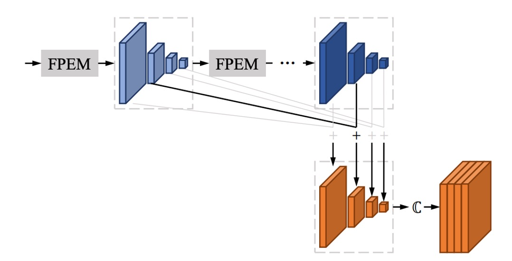
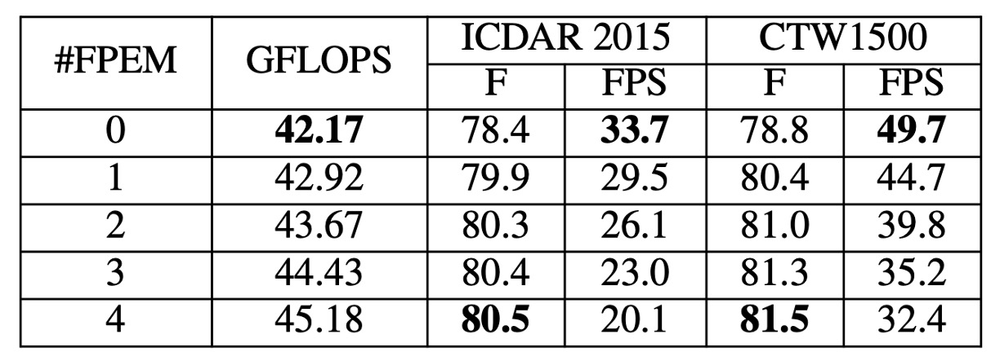
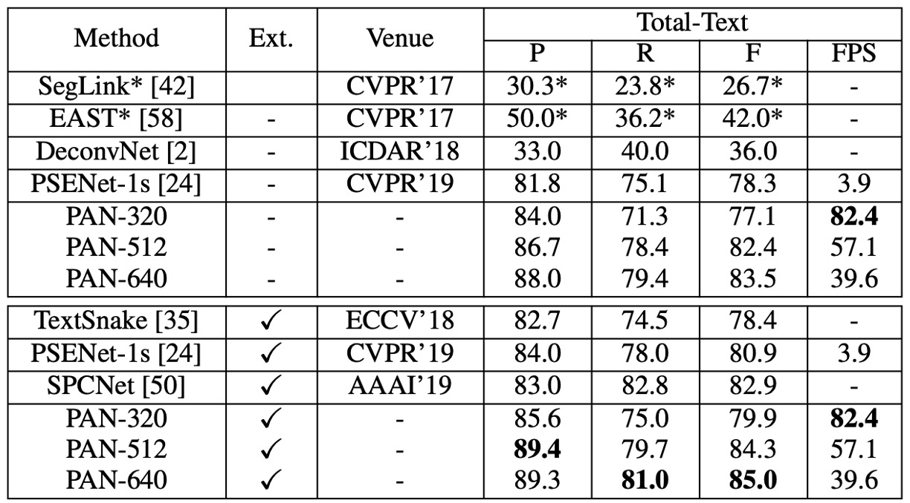

# [19.08] PAN

## 像素聚合策略

[**Efficient and Accurate Arbitrary-Shaped Text Detection with Pixel Aggregation Network**](https://arxiv.org/abs/1908.05900)

---

作者不久前才發表 PSENet，打鐵趁熱，這沒過多久再度發表 PAN。

- [**[19.03] PSENet: 逐步擴展策略**](../1903-psenet/index.md)

## 定義問題

這次的目標很簡單，就是覺得先前的模型架構太慢了。

ResNet50 和 VGG16 都要換掉，改成 ResNet18！

FPN 也要改，改成深度可分離卷積！

總之，怎樣輕量怎樣來。

## 解決問題

### 模型架構

上圖是 PAN 的模型架構，整體上看起來和 PSENet 很像，為了提升速度，作者提出了幾個改進策略。

首先是縮減特徵金字塔網絡（FPN）的參數量，但縮減後會降低特徵的表達能力，於是緊接著補上新的融合策略。

在論文中也會出現大量的縮寫，常會讓人摸不著頭緒，所以我們先記憶一下這些縮寫：

- FPEM: Feature Pyramid Enhancement Module 特徵金字塔增強模塊
- FFM: Feature Fusion Module 特徵融合模塊

以下依序來看看。

### FPEM

這個架構就是 FPN，裡面針對卷積層進行修改，把原本的卷積改成了深度可分離卷積，這樣可以減少參數量，提升速度。

在論文中，作者特別強調這是一個可以堆疊多層的模組，透過堆疊可以提升特徵的表達能力，彌補輕量主幹網絡的不足。

:::tip
堆疊多層特徵融合模組，在其他 2019 年的論文中也大多有提到，例如：NAS-FPN、BiFPN 等。
:::

### FFM

堆疊多層 FPEM 之後，會得到一大堆特徵圖。

舉例來說，在論文中一層 FPEM 會得到 4 個尺度特徵圖，每個尺度輸出的通道數為 128，四個尺度的特徵圖總共有 512 個通道。如果繼續堆疊 N 層，那麼最後會得到 512N 個通道，這樣的特徵圖對於後續的處理來說非常吃力。

作者在這裡的做法是將每一層 FPEM 的輸出特徵圖相加，如上圖所示，意思就是不管堆幾層，最後都只會有 $4 \times 128$ 個通道。

### 像素聚合策略

完成 Backbone 和 Neck 的部分之後，最後就是預測頭了。

像素聚合的目的是將文本區域中的像素正確地合併到對應的內核上，從而重建完整的文本實例。這個方法借用了聚類的概念，將文本實例視為聚類，內核為聚類中心，而文本區域的像素則是待聚類的樣本。

在訓練過程中，像素聚合透過計算聚合損失 (Aggregation Loss) 來引導文本像素向內核靠攏，同時透過區別損失 (Discrimination Loss) 來保持不同內核之間的區別。

- **(1) 聚合損失 $L_{\text{agg}}$**

  - 聚合損失 $L_{\text{agg}}$ 的目的在於使同一文本實例的像素與其內核的距離盡可能小。
  - 對於每個文本實例 $T_i$，損失函數的定義如下：

  $$
  L_{\text{agg}} = \frac{1}{N} \sum_{i=1}^{N} \frac{1}{|T_i|} \sum_{p \in T_i} \ln(D(p, K_i) + 1),
  $$

  其中 $N$ 是文本實例的總數，$T_i$ 是第 $i$ 個文本實例，$K_i$ 是其內核，$p$ 是文本實例中的像素。

  - 距離函數 $D(p, K_i)$ 的定義如下：

  $$
  D(p, K_i) = \max \left( \|F(p) - G(K_i)\| - \delta_{\text{agg}}, 0 \right)^2,
  $$

  其中 $F(p)$ 是像素 $p$ 的相似度向量，$G(K_i)$ 是內核 $K_i$ 的相似度向量，定義為：

  $$
  G(K_i) = \frac{\sum_{q \in K_i} F(q)}{|K_i|},
  $$

  $\delta_{\text{agg}}$ 是一個常數，經實驗設定為 0.5，目的是過濾掉較易分類的樣本。

- **(2) 區別損失 $L_{\text{dis}}$**

  - 區別損失 $L_{\text{dis}}$ 旨在保持不同文本實例的內核之間具有足夠的距離。
  - 區別損失的定義如下：

  $$
  L_{\text{dis}} = \frac{1}{N(N - 1)} \sum_{i=1}^{N} \sum_{\substack{j=1 \\ j \neq i}}^{N} \ln(D(K_i, K_j) + 1),
  $$

  其中 $D(K_i, K_j)$ 為兩個內核 $K_i$ 與 $K_j$ 之間的距離，定義為：

  $$
  D(K_i, K_j) = \max \left( \delta_{\text{dis}} - \|G(K_i) - G(K_j)\|, 0 \right)^2,
  $$

  $\delta_{\text{dis}}$ 是一個常數，經實驗設定為 3，以保證不同內核間的距離不小於 $\delta_{\text{dis}}$。

---

在推論階段，基於預測的相似度向量來引導文本區域中的像素合併到對應的內核。

具體步驟如下：

1. **找出內核的連通分量**：在內核分割結果中，找出連通分量，每個連通分量代表一個內核。
2. **合併鄰近的文本像素**：對於每個內核 $K_i$，將其鄰近的文本像素 $p$（4 連通方式）進行條件合併，當像素 $p$ 與內核 $K_i$ 的相似度向量歐氏距離小於某個閾值 $d$ 時，進行合併。
3. **重複合併步驟**：重複第 2 步，直到沒有符合條件的鄰近文本像素可以合併為止。

該方法透過聚合與區別損失來引導內核與文本像素之間的正確聚合，最終重建完整的文本實例。

### 損失函數

損失函數的總體形式為：

$$
L = L_{\text{tex}} + \alpha L_{\text{ker}} + \beta (L_{\text{agg}} + L_{\text{dis}}),
$$

其中：

- $L_{\text{tex}}$ 表示文本區域的損失。
- $L_{\text{ker}}$ 表示內核區域的損失。
- $L_{\text{agg}}$ 和 $L_{\text{dis}}$ 分別為聚合損失與區別損失。
- 參數 $\alpha$ 和 $\beta$ 用於平衡這些損失的重要性，在所有實驗中設定為 $\alpha = 0.5$ 和 $\beta = 0.25$。

由於文本像素和非文本像素數量極不平衡，參考過去文獻採用 Dice Loss 來監督文本區域 $P_{\text{tex}}$ 和內核區域 $P_{\text{ker}}$ 的分割結果。

內核區域的真實標籤 $G_{\text{ker}}$ 是通過對原始的真實標籤多邊形進行縮小得到，這個縮小過程比照 PSENet 的方法，按比例 $r$ 對多邊形進行縮小。

- [**[19.03] PSENet: 逐步擴展策略**](../1903-psenet/index.md)

在計算 $L_{\text{tex}}$ 時，採用線上困難樣本挖掘 (Online Hard Example Mining, OHEM) 方法來忽略簡單的非文本像素。在計算 $L_{\text{ker}}$、$L_{\text{agg}}$ 和 $L_{\text{dis}}$ 時，僅考慮真實標籤中的文本像素。

$\alpha$ 和 $\beta$ 分別控制文本區域損失、內核區域損失與聚合損失、區別損失之間的重要性權重，經實驗設定 $\alpha = 0.5$ 和 $\beta = 0.25$，以平衡不同損失項之間的相對影響。

### 訓練資料集

- **SynthText**

  該資料集用於對模型進行預訓練。這是一個大規模數據集，包含約 80 萬張合成圖像。這些圖像由自然場景與隨機字體、大小、顏色和方向的文字混合而成，具有很高的現實感。

- **CTW1500**

  CTW1500 是一個針對長曲線文字檢測的挑戰性資料集，由 Yuliang 等人建構。該資料集包含 1000 張訓練圖片和 500 張測試圖片。不同於傳統文字資料集（如 ICDAR 2015、ICDAR 2017 MLT），CTW1500 的文字實例是由 14 個點的多邊形標註，可以描述任意曲線文字的形狀。

- **Total-Text**

  Total-Text 是一個新發佈的曲線文字檢測資料集，包含水平、多方向及曲線文字實例。該基準資料集包括 1255 張訓練圖片和 300 張測試圖片。

- **ICDAR 2015**

  ICDAR 2015 是文字檢測中常用的資料集，包含 1500 張圖片，其中 1000 張用於訓練，剩下的用於測試。文字區域由四個頂點的四邊形標註。

- **MSRA-TD500**

  這是一個多語言、任意方向和長文字行的數據集。包含 300 張訓練圖像和 200 張測試圖像，文字行標注為行級標注。由於訓練集較小，實驗中加入了 HUST-TR400 數據集的圖像作為訓練數據。

### 訓練策略

PAN 使用 ResNet 或 VGG16 作為模型的骨幹，這些模型預先在 ImageNet 上進行了預訓練。

所有網路模型都使用隨機梯度下降法 (Stochastic Gradient Descent, SGD) 進行優化。在 SynthText 資料集上進行預訓練，訓練 50K 次迭代，固定學習率為 $1 \times 10^{-3}$。

在其他實驗中，我們的訓練次數為 36K 次，初始學習率為 $1 \times 10^{-3}$。權重衰減設定為 $5 \times 10^{-4}$，並使用 Nesterov 動量，動量值為 0.99。

在訓練過程中，忽略了在所有資料集中標記為 "DO NOT CARE" 的模糊文字區域。OHEM 的正負樣本比例設定為 3。訓練圖片應用了多種數據增強方法，包括隨機縮放、隨機水平翻轉、隨機旋轉和隨機裁剪。

## 討論

### 消融實驗

作者在 ICDAR 2015 和 CTW1500 資料集上進行了消融實驗，分析了 PAN 的各個模塊對性能的影響。

- **堆疊 FPEM 效果**

  

  FPEM 數量對模型效果的影響通過調整 $n_c$ 的值進行研究。從上表可以看出，隨著 $n_c$ 的增長，測試集上的 F-measure 持續上升，直到 $n_c \geq 2$ 開始趨於平穩。

  然而，儘管 FPEM 計算成本低，過多的 FPEM 會降低模型的推理速度。每增加一個，FPS 大約會減少 5。為了在性能和速度之間取得平衡，在後續實驗中將 $n_c$ 設定為 2。

- **FPEM 的有效性**

  

  在相同的實驗設定下，作者比較：

  - ResNet18 + 2 FPEMs + FFM
  - ResNet50 + PSPNet

  上表顯示，即使「ResNet18 + 2 FPEMs + FFM」是輕量化的骨幹網路，其性能幾乎與「ResNet50 + PSPNet」相當，且推理速度快 5 倍以上，模型大小僅 12.25M。

- **FFM / PA 的有效性**

  

  移除 FFM，並在最後的特徵金字塔 $F_{nc}$ 中拼接特徵圖進行最終分割。結果顯示，移除 FFM 後，F-measure 下降了 0.6%-0.8%（見上表 #1 和 #2），這表明除了深層特徵，淺層特徵對語義分割也很重要。

  在訓練階段，移除 PA 的模型 F-measure 下降了 1% 以上（見上表 #4），這表明 PA 在提升模型性能上具有顯著效果。

  將輕量化骨幹網路 ResNet18 替換為較重的骨幹網路 ResNet50 和 VGG16。結果顯示，在相同的設置下，ResNet50 和 VGG16 分別在 ICDAR 2015 上提升了超過 1%，在 CTW1500 上提升了超過 0.5%（見上表 #5 和 #6）。然而，較重的骨幹網路明顯降低了推理速度。

### 曲線文字實驗結果

- 在 **CTW1500** 上：

    <figure>
    
    <figcaption>CTW1500 實驗結果</figcaption>
    </figure>

  ***

  - **PAN-320**（輸入圖片短邊為 320），未經外部數據預訓練的情況下，F-measure 達到 **77.1%**，速度為 **84.2 FPS**。該 F-measure 超越了大多數對比方法（包括使用外部數據預訓練的方法），速度比最快的方法快 **4 倍**。
  - 當使用 SynthText 進行微調後，PAN-320 的 F-measure 提升至 **79.9%**，PAN-512 的 F-measure 超過其他所有方法至少 **1.2%**，同時仍保持接近實時的速度（**58 FPS**）。

- 在 **Total-Text** 上：

    <figure>
    
    <figcaption>Total-Text 實驗結果</figcaption>
    </figure>

  ***

  - 未經外部數據預訓練的情況下，**PAN-320** 的速度達到實時（**82.4 FPS**），F-measure 為 **77.1%**，而 **PAN-640** 的 F-measure 達到 **83.5%**，超越所有其他最先進方法（包括使用外部數據的方法） **0.6%** 以上。
  - 使用 SynthText 預訓練後，PAN-320 的 F-measure 提升至 **79.9%**，PAN-640 的最佳 F-measure 為 **85.0%**，比第二名的 SPCNet [50] 高出 **2.1%**，速度仍能保持接近 **40 FPS**。

### CTW1500 實驗結果

**PAN** 在未經外部數據預訓練的情況下，F-measure 達到 **80.4%**，速度為 **26.1 FPS**。與 EAST 相比，PAN 的 F-measure 提高了 **2.1%**，而速度則是 EAST 的 **2 倍**。

使用 SynthText 進行微調後，F-measure 提升至 **82.9%**，與 TextSnake 相當，但 PAN 的運行速度是 TextSnake 的 **25 倍**。雖然 PAN 的性能不如某些方法（如 PSENet 和 SPCNet），但 PAN 的速度至少比這些方法快 **16 倍**（**26.1 FPS**）。

### MSRA-TD500 實驗結果

當不使用外部數據時，PAN 的 F-measure 為 **78.9%**，使用外部數據後提升至 **84.1%**。與其他最先進方法相比，PAN 的性能更高，且速度更快（**30.2 FPS**）。

### 可視化結果

## 結論

PAN 在曲線文字、定向文字以及長直文字檢測方面均表現出色，無論是否使用外部數據預訓練，都能取得較高的 F-measure，並保持相對快速的運行速度。這使得 PAN 成為一個可以應用於各種場景的穩健文字檢測方法。
