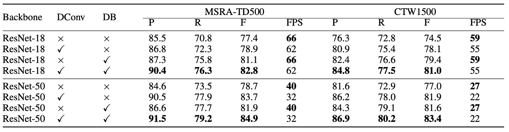
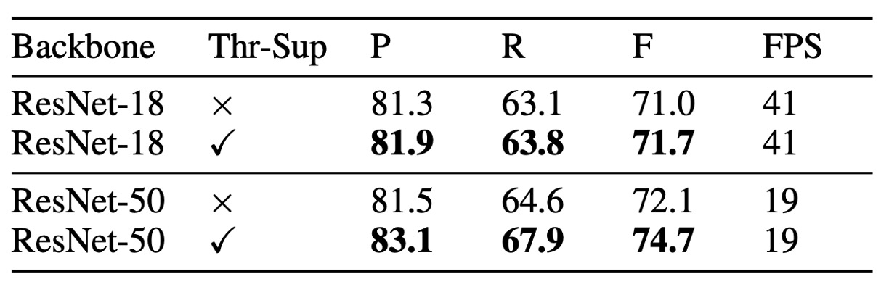
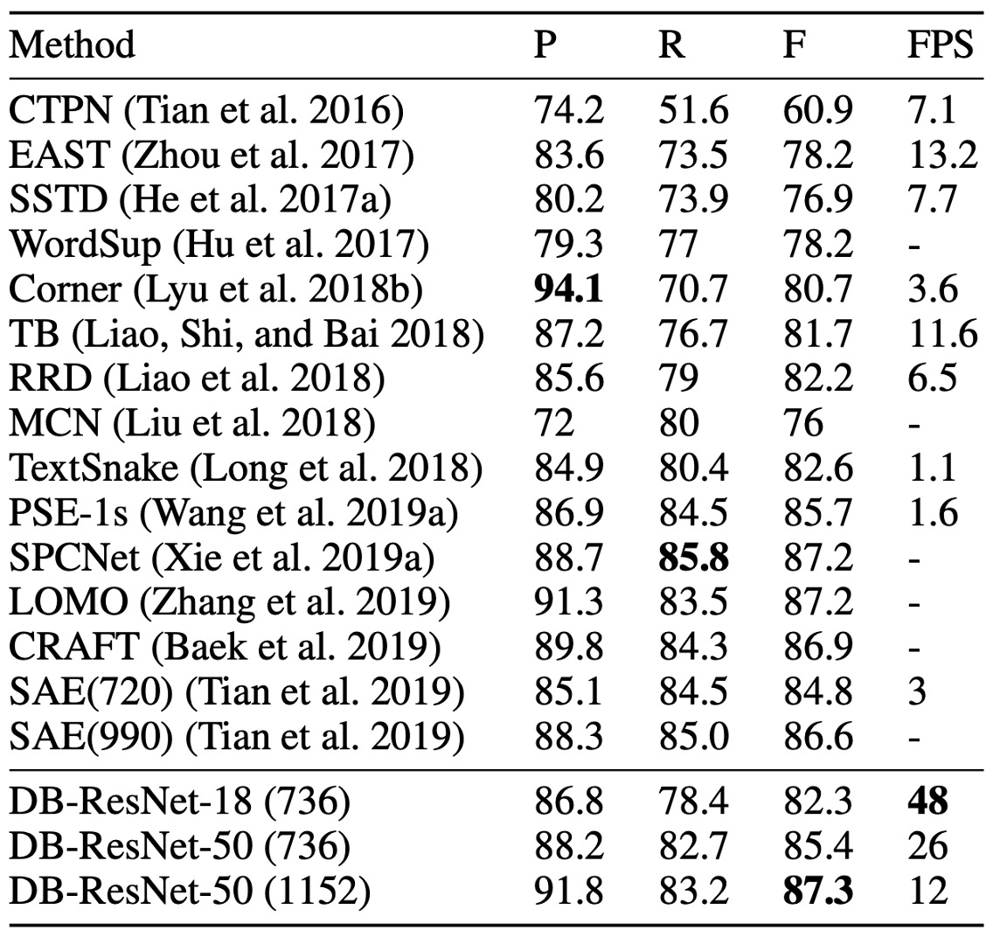

# [19.11] DBNet

## 可微分二值化函數

[**Real-time Scene Text Detection with Differentiable Binarization**](https://arxiv.org/abs/1911.08947)

---

幾篇論文看下來，我們大概也知道了在文字偵測領域，主流模型是基於分割的方法來完成。

分割，其實說穿了就是直接預測文字區域的像素值，這樣的方法有個天生的缺點：

- **無法解決重疊文字的問題。**

在基於分割的影像分類的情況下，常見的做法是給予每個類別一個獨立的通道，這樣可以解決不同類別間的重疊問題。但文字都是同樣的類別，A 區域的文字和 B 區域的文字都是文字，我們無法透過切分通道的方法來解決，解決重疊文字的問題。

真要說，也不是不行，那就是我們直接給定輸出 1000 通道，讓模型自行決定要讓哪一個文字區域落在哪一個通道上，這樣就可以解決重疊文字的問題了。

但一個通道只用來表示一個文字區域，難道不覺得太浪費了嗎？基於分割的輸出都是高解析度的影像，這麼多通道能不能順利地跑訓練都是個問題。而且話又說回來，我們怎麼知道該給多少通道呢？

基於對運算資源的浪費，這條路顯然是行不通的。

## 定義問題


一些主流的研究，對於這種問題的解決方法是：先找出文字核心，再來想辦法，如同上圖中的「藍線」的流程。

像是 PSENet，它先找出文字核心，再向外搜索擴展成文字區域；或是 PAN，它先找出文字核心，再用聚類聚合區域像素；又或是 TextSnake，它先找出文字核心，再用角度方向預測文字區域。

而這篇論文的作者認為，這樣的方法有個共同的缺點：**太慢了！**

或許我們該讓模型自己學會把不同的文字實例「切」開來，而不是搭配一個複雜的後處理。

## 解決問題

### 模型架構


架構本身不是本篇論文的重點，就我們看來，這個架構也沒有什麼特別的地方。

如上圖，根據我們的標注，紅色框起來的部分是 Backbone，在論文中用的是 ResNet-18 和 ResNet-50；綠色框起來的部分是 FPN，用來提取不同尺度的特徵。

這裡取得多尺度的特徵圖之後，將所以特徵圖放大到相同的尺度，然後使用 Concat 操作將這些特徵圖串接在一起，用於最後預測頭的輸入。

---

預測頭的部分分成兩個部分：

第一個部分用來做文字區域的像素級預測，其他文獻的做法也都也這一個分支。

第二個部分是本篇論文的重點：閾值圖的預測。

閾值圖，在論文中稱為 Threshold Map，是用來「切割」文字區域，他會被疊加在文字區域的預測結果上，用來將不同的文字區域分開。像上圖中，你會看到文字區域圖和閾值圖在後面被疊加在一起，成為最後的結果。

---

這個部分的操作在論文中可能沒有寫得這麼清楚，我們看一下程式實作：[**MhLiao/DB**](https://github.com/MhLiao/DB/blob/master/decoders/seg_detector.py)

首先是文字區域的預測分支：

```python
self.binarize = nn.Sequential(
    nn.Conv2d(inner_channels, inner_channels //
                4, 3, padding=1, bias=bias),
    BatchNorm2d(inner_channels//4),
    nn.ReLU(inplace=True),
    nn.ConvTranspose2d(inner_channels//4, inner_channels//4, 2, 2),
    BatchNorm2d(inner_channels//4),
    nn.ReLU(inplace=True),
    nn.ConvTranspose2d(inner_channels//4, 1, 2, 2),
    nn.Sigmoid())
```

看起來是輸入 FPN 的特徵圖，經過一系列的卷積、反卷積操作，最後用 `Sigmoid` 輸出 0~1 之間的值，這個值代表了文字區域的概率。

再來是閾值圖的預測分支：

```python
self.thresh = nn.Sequential(
    nn.Conv2d(in_channels, inner_channels //
                4, 3, padding=1, bias=bias),
    BatchNorm2d(inner_channels//4),
    nn.ReLU(inplace=True),
    self._init_upsample(inner_channels // 4, inner_channels//4, smooth=smooth, bias=bias),
    BatchNorm2d(inner_channels//4),
    nn.ReLU(inplace=True),
    self._init_upsample(inner_channels // 4, 1, smooth=smooth, bias=bias),
    nn.Sigmoid())
```

這裡也是輸入 FPN 的特徵圖，經過一系列的卷積、上採樣的操作，最後用 `Sigmoid` 輸出 0~1 之間的值，這個值代表了閾值圖。

最後是將文字區域圖和閾值圖相減，得到最後的結果：

:::tip
我們在程式內做了一些註解，不要跳過，這裡有一些重要的資訊。
:::

```python
def forward(self, features, gt=None, masks=None, training=False):

    # ...省略 Backbone + Neck 程式碼...

    # 計算文字區域圖
    binary = self.binarize(fuse)


    if self.training:
        result = OrderedDict(binary=binary)
    else:

        # 如果是推論模式，直接用文字區域圖回傳
        return binary

    # 如果是訓練模式
    if self.adaptive and self.training:
        if self.serial:
            fuse = torch.cat(
                    (fuse, nn.functional.interpolate(
                        binary, fuse.shape[2:])), 1)

        # 計算閾值圖
        thresh = self.thresh(fuse)

        # 二值化閾值圖
        thresh_binary = self.step_function(binary, thresh)

        # 回傳兩個結果，用於監督訓練
        result.update(thresh=thresh, thresh_binary=thresh_binary)

    return result

# 二值化函數
def step_function(self, x, y):
    return torch.reciprocal(1 + torch.exp(-self.k * (x - y)))
```

看到這邊，終於發現本篇論文的標題為何是「可微分二值化網路」了！

上面程式中的 `step_function` 就是本論文提到的二值化函數，輸入分別是文字區域圖和閾值圖，把兩者相減後，直接轉成 0 和 1 個二值化結果。

你會覺得非常眼熟：

這個 `torch.reciprocal(1 + torch.exp(-self.k * (x - y)))` ......

嘿！這不就是 Sigmoid 函數嗎！

:::tip
標準的 Sigmoid 長這樣：

$$
\sigma(x) = \frac{1}{1 + e^{-x}}
$$

:::

差別在於，這裡的 Sigmoid 函數多了一個參數 $k$，這個參數是用來控制二值化的閾值的，在論文中，這個參數設為 50。

所以其實這個函數現在變成這樣：

$$
\sigma(x) = \frac{1}{1 + e^{-50(x - y)}}
$$

如果你自己帶入數值進去算算看，當前面係數設定為 50 的時候，這個函數的圖形會變成一個非常陡峭的階梯函數，「幾乎」就是二值化函數，差別在於這個函數是可微分的。

:::tip
論文看到這邊，謎底揭曉！

作者用 `Sigmod` 函數來實現二值化，開心愉快地發表了一篇論文。
:::

### 標籤生成


這個部分的算法來自 PSENet 的啟發：

- [**[19.03] PSENet: 逐步擴展策略**](../1903-psenet/index.md)

給定一張文本圖像，每個文本區域的多邊形可由一組線段描述：

$$
G = \{S_k\}_{k=1}^{n}
$$

其中 $n$ 為頂點數，不同的數據集可能有不同的頂點數，例如 ICDAR 2015 數據集為 4 個頂點，CTW1500 數據集為 16 個頂點。

接著，正樣本區域透過使用 Vatti 裁剪算法將多邊形 $G$ 收縮為 $G_s$ 來生成。

收縮的偏移量 $D$ 由原始多邊形的周長 $L$ 和面積 $A$ 計算得到：

$$
D = \frac{A(1 - r^2)}{L}
$$

其中 $r$ 為收縮比例，經驗上設定為 0.4。

---

使用類似的過程，用來生成閾值圖的標籤。

首先，將文本多邊形 $G$ 以相同的偏移量 $D$ 擴張為 $G_d$。接著，考慮 $G_s$ 和 $G_d$ 之間的區域作為文本邊界，在此區域中，閾值圖的標籤可以通過計算到 $G$ 中最近線段的距離來生成。

### 損失函數

<div align="center">

</div>

損失函數 $L$ 可以表示為機率圖損失 $L_s$、二值圖損失 $L_b$ 和閾值圖損失 $L_t$ 的加權總和：

$$
L = L_s + \alpha \times L_b + \beta \times L_t
$$

其中 $L_s$ 是機率圖的損失，$L_b$ 是二值圖的損失。根據數值，$\alpha$ 和 $β$ 分別設為 1.0 和 10。

對於機率圖損失 $L_s$ 和二值圖損失 $L_b$，應用了二元交叉熵（BCE）損失。為了解決正負樣本數不平衡的問題，在 BCE 損失中使用了困難負樣本挖掘，通過採樣困難負樣本來平衡正負樣本比例。

具體損失計算公式如下：

$$
L_s = L_b = \sum_{i \in S_l} \left[ y_i \log x_i + (1 - y_i) \log (1 - x_i) \right]
$$

其中 $S_l$ 是經過採樣的集合，正負樣本比例為 1:3。

---

閾值圖損失 $L_t$ 是預測值與標籤在擴張文本多邊形 $G_d$ 內的 $L_1$ 距離的總和：

$$
L_t = \sum_{i \in R_d} | y_i^* - x_i^* |
$$

其中 $R_d$ 是擴張多邊形 $G_d$ 內像素的索引集合，$y_i^*$ 是閾值圖的標籤。

---

在推論階段，作者為了提高效率，使用機率圖生成邊界框，這樣可以省略閾值分支。

邊界框生成過程包括三個步驟：

1. 將機率圖或近似二值圖以固定閾值 0.2 進行二值化，得到二值圖
2. 從二值圖中獲取連通區域（收縮的文本區域）
3. 使用 Vatti 裁剪算法擴張這些收縮區域，偏移量 $D_0$ 的計算公式如下：

   $$
   D_0 = \frac{A_0 \times r_0}{L_0}
   $$

   其中 $A_0$ 是收縮多邊形的面積，$L_0$ 是收縮多邊形的周長，$r_0$ 經驗上設為 1.5。

### 訓練資料集

- **SynthText**

  該資料集用於對模型進行預訓練。這是一個大規模數據集，包含約 80 萬張合成圖像。這些圖像由自然場景與隨機字體、大小、顏色和方向的文字混合而成，具有很高的現實感。

- **CTW1500**

  CTW1500 是一個針對長曲線文字檢測的挑戰性資料集，由 Yuliang 等人建構。該資料集包含 1000 張訓練圖片和 500 張測試圖片。不同於傳統文字資料集（如 ICDAR 2015、ICDAR 2017 MLT），CTW1500 的文字實例是由 14 個點的多邊形標注，可以描述任意曲線文字的形狀。

- **Total-Text**

  Total-Text 是一個新發佈的曲線文字檢測資料集，包含水平、多方向及曲線文字實例。該基準資料集包括 1255 張訓練圖片和 300 張測試圖片。

- **ICDAR 2015**

  ICDAR 2015 是文字檢測中常用的資料集，包含 1500 張圖片，其中 1000 張用於訓練，剩下的用於測試。文字區域由四個頂點的四邊形標注。

- **MSRA-TD500**

  這是一個多語言、任意方向和長文字行的數據集。包含 300 張訓練圖像和 200 張測試圖像，文字行標注為行級標注。由於訓練集較小，實驗中加入了 HUST-TR400 數據集的圖像作為訓練數據。

- **ICDAR 2017 MLT**

  IC17-MLT 是一個大規模的多語言文字資料集，包括 7200 張訓練圖片、1800 張驗證圖片和 9000 張測試圖片。該資料集由來自 9 種語言的完整場景圖像組成。

## 討論

### 消融實驗



根據上表，使用可微分二值化技術顯著提升了兩個數據集（MSRA-TD500 和 CTW1500）上的性能。對於 ResNet-18 骨幹網路，DB 在 MSRA-TD500 數據集上提升了 3.7%，在 CTW1500 數據集上提升了 4.9%的 F 值。

可變形卷積能帶來 1.5%到 5.0%的性能提升，因為它為骨幹網路提供了靈活的感受野，且只需少量額外時間。在 CTW1500 數據集上，使用 ResNet-18 的性能提升了 3.6%，使用 ResNet-50 的性能提升了 4.9%。

---



儘管有無監督的閾值圖在外觀上相似，但加上監督後可以提升性能。上表顯示，閾值圖的監督在 MLT-2017 數據集上，對 ResNet-18 提升了 0.7%，對 ResNet-50 提升了 2.6%。

在骨幹網路的比較中，使用 ResNet-50 的檢測器性能優於 ResNet-18，但運行速度較慢。

### 曲線文字實驗結果

<figure>

<figcaption>Total-Text 實驗結果</figcaption>
</figure>

<figure>

<figcaption>CTW1500 實驗結果</figcaption>
</figure>

---

根據上表，DB 在準確率和速度上都達到了最新的領先水準。

本文方法在 Total-Text 和 CTW1500 兩個彎曲文本基準上證明了其形狀穩健性。

DB-ResNet-50 在 Total-Text 和 CTW1500 數據集上分別比之前的最佳方法提高了 1.1% 和 1.2%。此外，DB-ResNet-50 的運行速度也快於之前所有的方法，且透過使用 ResNet-18 骨幹可以進一步提升速度，僅帶來少量的性能下降。

### ICDAR 2015 實驗結果

<figure>

<figcaption>ICDAR 2015 實驗結果</figcaption>
</figure>

---

ICDAR 2015 數據集是一個包含大量小尺寸和低解析度文本實例的多方向文本數據集。

根據上表，DB-ResNet-50 (1152) 在準確性上達到了最新的最佳性能。與之前最快的方法相比，DB-ResNet-50 (736) 在準確率上超出 7.2%，且速度提升了一倍。

使用 ResNet-18 作為骨幹時，DB-ResNet-18 (736)能以 48 FPS 運行，F 值達到 82.3。

### 可視化結果


## 結論

DB 提出了一種新的可微分二值化技術，該技術可以在不需要後處理的情況下，直接從機率圖中生成二值圖。這種技術可以提高文字檢測的性能，並且在多個基準數據集上取得了最新的最佳性能。

在實務上，DB 算是很常被用來部署的模型，最主要的原因是因為它的速度快。還有就是架構簡單，好訓練！在各大 OCR 架構上都可以看到相關實作，例如 PaddleOCR、MMOCR 等，都可以看到 DB 的身影。

如同我們剛才所看到的，通篇文章最困難的地方就在於二值化函數的實現。（恩？）

最後，這個架構只是緩解了重疊文字的問題，讓可以切分的文字區域更加明顯，但本質上依然沒有解決重疊文字的問題，且讓我們繼續期待後續的研究。
