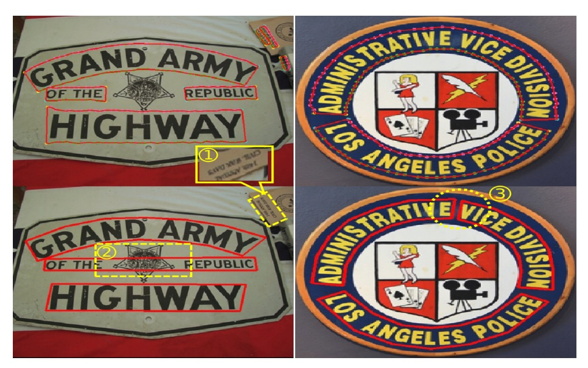

## 初探圖卷積

[**Deep Relational Reasoning Graph Network for Arbitrary Shape Text Detection**](https://arxiv.org/abs/2003.07493)

---

在 2020 年的前後，圖卷積網路（Graph Convolutional Network, GCN）大行其道。

在此時 Transformer 還沒有被廣泛應用於影像領域之前，GCN 是一個很好的選擇，它可以處理不規則的數據，並且可以捕捉到數據之間的關係。

可惜，圖卷積才正要在電腦視覺領域中開始流行，就被 Transformer 扼殺在搖籃裡。

:::tip
如果你不知道圖卷積網路是什麼，可以先去看看我們的另外一篇文章：

- [**淺談圖卷積網路**](https://docsaid.org/blog/graph-convolutional-networks/)
  :::

## 定義問題

有了新的工具，居然沒人用來解決文字檢測的問題，這顯然就是最大的問題！

於是作者決定用圖卷積網路來解決文字檢測的問題，於是就有了「第一篇」把圖卷積網路用在文字檢測上的論文。

所以整篇文章最困難的部分就是理解什麼是圖卷積網路，如果你已經掌握了這個知識，那麼這篇論文就沒有什麼難度了。

## 解決問題

### 模型架構

<figure style={{"width": "90%"}}>

</figure>

整個模型架構由非常多的元件組合而成，我們可以先大概拆成幾個部分：

1. **特徵提取器**：使用 VGG-16 作為主幹網路，並加上了 FPN（Feature Pyramid Network）。
2. **文字元件定義**：將文字實例切割成一連串有順序的、近似矩形的小片段。
3. **文字元件預測**：使用卷積操作得到文字元件預測結果。
4. **損失函數計算**：計算預測結果與真實標籤之間的損失。
5. **圖卷積網路**：將文字元件的關係表示成圖，並使用 GCN 進行推理。

### 特徵提取

<figure style={{"width": "60%"}}>

</figure>

首先，我們需要一個特徵提取器，這裡使用了 VGG-16 作為主幹網路，並加上了 FPN（Feature Pyramid Network）。

雖然在論文中說了這是 FPN，但從圖中可以看出，在結合不同層次的特徵時，採用的是拼接（concatenate）的方式，而不是 FPN 中的加法（addition），所以這個更像是 U-Net 的結構，而不是 FPN。

### 文字元件定義

<figure style={{"width": "60%"}}>

</figure>

:::tip
這裡有些名詞的對應，要搭配上圖來看。
:::

在這篇論文中，作者將完整的的文字實例（例如一行或一個詞彙的文字區域）切割成一連串有順序的、近似矩形的小片段。

藉由這些小片段，在預測中可以更細緻地描述文字的形狀、大小與方向，並最終將這些片段串連回去形成完整的文字。

每個文字元件 $D$ 以一組幾何屬性表示：

$$
D = (x, y, h, w, \cos\theta, \sin\theta)
$$

- $x, y$：該元件的中心點座標。也就是文字元件在影像中的位置。
- $h, w$：分別代表元件的高度（height）與寬度（width）。
- $\cos\theta, \sin\theta$：用來表示文字元件的方向角度（orientation）。

由於角度在數學上有週期性，使用 $\cos\theta$ 與 $\sin\theta$ 可以避免直接使用角度帶來的複雜度，同時能保證方向的平滑變化。

- **$h$ 的定義**：

  在論文中，文字元件的高度 $h$，是由上半段 $h_1$ 與下半段 $h_2$ 組合而成。

- **寬度 $w$ 與高度 $h$ 的關係**

  寬度 $w$ 是依據高度 $h$ 透過一個線性規則來取得。

  在實驗中設定了最小寬度 $w_{\min}$ 和最大寬度 $w_{\max}$。規則如下：

  $$
  w_i =
  \begin{cases}
  w_{\min}, & h_i \leq 2 \cdot w_{\min} \\
  \frac{h_i}{2}, & 2 \cdot w_{\min} < h_i < 2 \cdot w_{\max} \\
  w_{\max}, & h_i \geq 2 \cdot w_{\max}
  \end{cases}
  $$

  意義在於：

  - 當元件很矮 ($h_i$ 很小) 時，寬度被固定為一個最小值 $w_{\min}$，避免元件過於窄小難以辨識。
  - 當元件高度在一個中間範圍內時，寬度和高度成比例（$w = h/2$），讓元件外觀維持合理的比例。
  - 如果元件高度過大，則將寬度鎖定在最大值 $w_{\max}$，避免過度延伸。

  在實驗中，作者預設 $w_{\min} = 8$ 與 $w_{\max} = 24$。

---

為了清楚定義文字的朝向（例如斜體或水平）以及方便抽取「文字中心區域 (TCR)」，作者引用了 TextSnake 的方式。

:::tip
如果你對 TextSnake 的細節感興趣的話，可以參考我們的另一篇文章：

- [**[18.07] TextSnake: 文字蛇**](../1807-textsnake/index.md)
  :::

步驟如下：

1. **取得頂邊與底邊的點序列**：

   將文字區域沿其長邊方向分割成一系列的四邊形（就像把一條長文字分成多個小區段）。如此，我們會取得兩組點：

   - $P_1 = \{tp_0, tp_1, ..., tp_n\}$：對應文字上邊線（top line）的一串點。
   - $P_2 = \{bp_0, bp_1, ..., bp_n\}$：對應文字下邊線（bottom line）的一串點。

   其中 $tp_i$ 和 $bp_i$ 可以被視為對應同一個垂直切面下的上、下邊界點。

2. **決定哪條是頂線、哪條是底線**：

   有了 $P_1$ 和 $P_2$ 後，我們需要知道哪一組點是文字的上邊（top）哪一組是下邊（bottom）。

   於是這裡定義一組向量集 $V$：

   $$
   V = \{ tp_0 - bp_0, tp_1 - bp_1, \ldots, tp_n - bp_n \}
   $$

   也就是上邊線每個點對應減去下邊線的點，形成一組垂直向量。接著計算

   $$
   p = \sum_{i=0}^{n} \sin(v_i)
   $$

   其中 $v_i = tp_i - bp_i$。如果 $p \geq 0$，表示 $P_1$ 是頂線，$P_2$ 是底線；否則相反。

   這個判定方法是透過向量的方向來決定上、下邊，使得我們能確定文字區域的上下方向，進而推斷文字的傾斜方向 $\theta$。

3. **取得文字中心區域（TCR）**：

    

    <figure style={{"width": "90%"}}>
    
    </figure>
    

   在確定文字的方向後，將文字區域（Text Region, TR）「收縮」以取得較小且精準的文字中心區域（TCR）。

   我們把上面的圖放大來看，做法又可分為三個步驟：

   - 計算文字的中心線（center line），這是位於上邊線和下邊線中間的線。
   - 將中心線的兩端各縮短 $0.5w$ 個像素，避免與相鄰的文字實例過於貼近。
   - 將中心線上下方向各向外擴張 $0.3h$ 的距離，形成一個厚度稍微放大的中心帶狀區域，這就是我們要的 TCR。

   TCR 的存在可以使網路在後續判定時更容易聚焦於真正的文字核心位置，並在區分相鄰文字（例如同一行文字中接續的字）時更有彈性。

### 文字元件預測

我們已經知道作者所定義的文字元件，接著就是使用剛才經過 Backbone 和 FPN 處理過的特徵圖來預測文字元件，透過以下的卷積操作得到 CR：

$$
CR = \text{conv}_{1\times1}(\text{conv}_{3\times3}(F_{\text{share}}))
$$

這代表先對特徵圖做一個 $3\times3$ 的卷積，再接上一個 $1\times1$ 的卷積。

最終的 $CR$ 張量維度為 $(h \times w \times 8)$，其中 $h \times w$ 是特徵圖的空間大小，而最後一個維度共有 8 個通道，分別對應的是：

- 4 個通道用於分類的 logit（用來決定該像素屬於 TR / TCR 或其他類別，例如背景）。藉由對這 4 個通道做 softmax，可得到每個像素是 TR 或 TCR 的機率分布。
- 4 個通道用於迴歸（regression）輸出：包括 $h_1, h_2, \cos\theta, \sin\theta$。

在這裡的 softmax 操作是為了對每個像素進行分類，決定該像素是屬於「文字區域」或「文字中心區域」。另外，透過正規化 $\cos\theta$ 與 $\sin\theta$ 確保 $\cos^2\theta + \sin^2\theta = 1$，維持方向值的合理性。

最後，對預測結果透過設定門檻值（threshold）與在局部區域中進行 NMS（Non-Maximum Suppression）可以去除冗餘的重疊元件，得到較乾淨、精確的文字元件檢測結果。

### 損失函數計算

整體的偵測損失 $L_{\text{det}}$ 包含兩個部份：

$$
L_{\text{det}} = L_{\text{cls}} + L_{\text{reg}}
$$

- $L_{\text{cls}}$: 分類損失（classification loss），用於判定哪些像素屬於文字區域(TCR/TR)或背景。
- $L_{\text{reg}}$: 回歸損失（regression loss），用於精確預測文字的幾何屬性，如高度、方向。

---

分類損失 $L_{\text{cls}}$ 是一個交叉熵損失（cross-entropy loss）。

論文中將整個文字相關區域分為兩個範圍：

- **TR (Text Region)**：整個文字區域，包括文字的上下邊界之間的範圍。
- **TCR (Text Center Region)**：從 TR 中間縮小／調整得到的「文字中心區域」，用來更精準地定位文字核心位置，避免干擾。

定義如下：

$$
L_{\text{cls}} = L_{\text{tr}} + \lambda_1 L_{\text{tcrp}} + \lambda_2 L_{\text{tcrn}}
$$

在這裡有三個子損失：

1. $L_{\text{tr}}$：
   用於判定哪些像素屬於文字區域 TR 的分類誤差。

2. $L_{\text{tcrp}}$：
   只在 TR 裡面的像素中計算，用來確保在真正的文字區域中，能正確分辨出 TCR（文字的中心區域）。
   換句話說，$L_{\text{tcrp}}$ 專門在「確定是文字」的地方，進一步將那些像素區分為「文字中心區域」或「非中心的文字區域」。

3. $L_{\text{tcrn}}$：
   只在「非 TR」範圍的像素中計算，用來抑制 TCR 在背景區域出現的雜訊。
   簡言之，如果在背景中（沒有文字的地方）卻預測出 TCR，則會加大此項損失，強迫網路不要在背景中錯誤標記 TCR。

為了使訓練更穩定，文章中採用了 OHEM（Online Hard Example Mining）方法。OHEM 會挑選出困難的負樣本（負樣本指不屬於文字區域的像素）來計算損失，防止過多容易判定的負樣本影響訓練。作者將負與正樣本的比例設為 3:1。

實驗中，超參數設定為 $\lambda_1 = 1.0$ 與 $\lambda_2 = 0.5$，代表 $L_{\text{tcrp}}$ 和 $L_{\text{tcrn}}$ 在整體分類損失中的權重。

---

回歸損失用來讓模型學會精確地估計文字的高度、方向等屬性。

但是受限於只有在 TCR 中，我們才有明確的高度和方向資訊（TCR 算是精確落在文字中心的區域，能穩定取得文字方向及高度標註），所以回歸損失只在 TCR 範圍內計算。

定義如下：

$$
L_{\text{reg}} = L_{h} + \beta(L_{\sin} + L_{\cos})
$$

這裡包含三個部份：

1. **$L_h$：高度迴歸損失**

   用來衡量預測的高度與真實高度的差異。

   其中高度 $h$ 是由 $h_1$ 與 $h_2$ 構成的（在前面定義中已知 $h = h_1 + h_2$）。

   損失計算方式為：

   $$
   L_{h} = \frac{1}{\Omega} \sum_{i \in \Omega} \left( \log(h + 1) \sum_{k=0}^{2} \text{smoothL1}\left(\frac{\hat{h}_{ki}}{h_{ki}} - 1\right) \right)
   $$

   其中：

   - $\Omega$：TCR 中的所有正樣本集合（有對應標註的像素）。
   - $h_{ki}$：真實高度相關的參數值（$h_0, h_1, h_2$之類的索引，實際上是對高度部件的回歸）。
   - $\hat{h}_{ki}$：模型預測值。

     ***

   :::tip
   **為什麼要有 $\log(h+1)$ 這個加權項？**

   因為對於大型文字（高度較大）而言，預測誤差的影響可能更為顯著，透過 $\log(h+1)$ 給高文字高度的元件較大的權重，可以幫助模型在多種文字大小下都能維持精度。
   :::

2. **$L_{\sin}$ 與 $L_{\cos}$：方向迴歸損失**

   用來衡量預測的文字方向（以 $\sin \theta$ 和 $\cos \theta$ 表示）是否準確：

   $$
   L_{\sin} = \text{smoothL1}(\hat{\sin\theta} - \sin\theta)
   $$

   $$
   L_{\cos} = \text{smoothL1}(\hat{\cos\theta} - \cos\theta)
   $$

   使用 smooth L1 損失來減輕極值誤差的影響，使訓練更穩定。

3. **$\beta$：一個平衡因子**

   是用於控制方向損失 $L_{\sin}$ 和 $L_{\cos}$ 在整體 $L_{\text{reg}}$ 中的權重，文中設定 $\beta = 1.0$。

### 生成局部圖

<figure style={{"width": "70%"}}>

</figure>

既然作者在這篇論文中想要用圖卷積網路來解決文字檢測的問題，這就需要將文字元件之間的關係表示成圖。

由於一張影像中可能偵測出很多文字元件，如果為整張圖像產生一個巨大的圖結構（即所有節點全部相互連結）將非常低效。

實際上，每個文字元件在空間上只可能與附近的少數元件有關聯，不需要和影像中所有元件建立關係。因此，作者選擇針對每個「樞紐點（pivot）」文字元件，建立一個只含少數相鄰元件的「局部圖」，避免處理過於龐雜的全局圖。

局部圖是以某個特定的文字元件（稱作「pivot」）為中心，只考慮該點附近的其他元件，從而形成一個小型的圖結構。如此一來，圖的大小被限制在很小的範圍內，加快後續的關聯推理過程。

為了建立局部圖，作者參考了過去文獻（如下列）的做法，從已偵測出的文字元件中選擇一個元件作為「pivot」，在此 pivot 周圍，我們將尋找它的鄰居節點，形成一個局部圖 $G_p$，並將鄰居節點分為「1-hop」與「2-hop」範圍：

- 1-hop 鄰居：從 pivot 開始，找出距離（在某種相似度衡量下）最近的 8 個元件作為一階鄰居（也就是最接近 pivot 的元件）。
- 2-hop 鄰居：在 1-hop 的基礎上再往外擴張，找出 4 個較遠的元件作為二階鄰居。

:::tip
參考文獻：[**[19.03] Linkage Based Face Clustering via Graph Convolution Network**](https://arxiv.org/abs/1903.11306)
:::

根據上述邏輯，一個 pivot 的局部圖 $G_p$ 中會包含它本身的節點 $p$、8 個 1-hop 鄰居、以及 4 個 2-hop 鄰居，總共不會超過十幾個節點，這比整張影像中可能上百上千個元件要少很多。

最後，要決定哪些元件是最接近 pivot 的鄰居，需要一個「相似度」或「距離」的衡量方式。

論文中使用歐式距離的相對比例來定義相似度：

$$
E_s = 1 - \frac{D(p, v_i)}{\max(H_m, W_m)}
$$

- $D(p, v_i)$ 是 pivot $p$ 與節點 $v_i$ 之間的 L2 歐式距離（在影像坐標空間中的距離）。
- $H_m$ 與 $W_m$ 分別是整張影像的高度與寬度。

### 篩選重複樣本

在訓練中，如果同一文字實例裡面選擇的不同 pivot 所對應的局部圖過於相似（例如選 pivot 選到同一行字中的相鄰字元，結果局部圖裡面大部分節點都重複出現），這會導致模型不斷重複學習「容易的樣本」，使得訓練效率低下。

為此，作者提出一個篩選條件：

$$
G_{\text{iou}} = \frac{G_p \cap G_q}{G_p \cup G_q} < \xi
$$

其中 $G_p$ 與 $G_q$ 是同一文字實例 $T$ 中不同 pivot 所形成的兩個局部圖，它們的 1-hop 鄰居集合進行交集（$\cap$）與聯集（$\cup$）運算，以計算兩個局部圖的「重疊比例」。

如果重疊比例 $G_{\text{iou}}$ 太高（例如接近 1，代表兩個局部圖幾乎一樣），則不採用該 pivot，避免產生大量「重複、容易」的樣本。

作者在實驗中設定 $\xi = 0.75$，若重疊比例小於 0.75 才使用。這樣的策略確保訓練過程中能同時涵蓋「簡單」與「困難」樣本，提升模型的學習效率和穩定度。

### 圖卷積網路

在先前的步驟中，作者為每張影像建立了多個「局部圖 」，每個局部圖包含一個「樞紐點」及其 1-hop、2-hop 鄰居節點。透過這些局部圖，可以掌握節點間初步的連結資訊。但這些僅是粗略的連結估計。

為了更深入推斷節點間真正的連結機率，特別是在判斷樞紐節點與其 1-hop 鄰居之間的關係上，作者在此引入「圖卷積網路 (Graph Convolutional Network, GCN)」模型。

透過 GCN，可以在圖結構中逐層聚合鄰居資訊，進行更高階的關係推理。

:::tip
所以的鋪陳都是為了在這裡引入「圖卷積網路」啊！
:::

一個圖（Graph）通常以 $g(X, A)$ 表示：

- $X$：節點特徵矩陣，每一行代表一個節點的特徵向量。
- $A$：鄰接矩陣，描述節點間連接關係，如果第 $i$ 個節點與第 $j$ 個節點有邊連接，那麼 $A_{ij}=1$，否則為 0（或其他權重）。

在此，我們需要為局部圖 $G_p$（以 pivot $p$ 為中心的局部圖）建立節點特徵矩陣 $X$ 與鄰接矩陣 $A$，然後將它們輸入到圖卷積網路中進行關聯推理。

節點特徵由兩大部分組成：

1. **RROI 特徵 (RROI features)**
2. **幾何特徵 (geometric features)**

使用 RRoI-Align（RRoI 是 Rotated RoI，即考慮旋轉文字框的 RoI 標準）方法從影像特徵圖中擷取每個文字元件的特徵區塊，並將該特徵向量稱為 $F_r$。

:::tip
RRoI-Align 的細節可以參考：

- [**[17.03] Arbitrary-oriented scene text detection via rotation proposals**](https://arxiv.org/abs/1703.01086)
  :::

這些特徵主要來自影像的外觀資訊，雖然能捕捉文字區域內的紋理與形狀，但卻缺乏該文字元件在整張影像中的位置、尺度、方向等「幾何屬性 (geometric features)」。

因此，為了讓節點特徵更全面，作者在這裡直接採用 Transformer 的位置編碼，將文字元件的幾何資訊嵌入 (embedding) 到高維空間中：

$$
\varepsilon_{2i}(z) = \cos\left(\frac{z}{1000^{2i/C_{\varepsilon}}}\right), \quad i \in [0, C_{\varepsilon}/2 - 1]
$$

$$
\varepsilon_{2i+1}(z) = \sin\left(\frac{z}{1000^{2i/C_{\varepsilon}}}\right), \quad i \in [0, C_{\varepsilon}/2 - 1]
$$

對於一個文字元件有 6 個幾何屬性（如 $x, y, h, w, \cos\theta, \sin\theta$），每一個屬性都各自透過上述 embedding 轉成 $C_{\varepsilon}$ 維，因此總共為 $6 \cdot C_{\varepsilon}$ 維，記為 $F_g$。

最後，將 $F_r$（RROI 特徵）與 $F_g$（幾何特徵嵌入）串接在一起，形成節點的完整特徵向量，即 $x_q = [F_r; F_g]$。

---

完成節點特徵的準備後，接下來是建立鄰接矩陣 $A$。

為控制圖的稀疏性和運算量，作者對每個節點僅選擇距離最近的 $u$ 個鄰居，使得每個節點不會連接過多的其他節點。若節點 $n_j$ 是節點 $n_i$ 的前 $u$ 名最近鄰之一，則設定 $A_p(n_i, n_j) = 1$，否則為 0。實驗中，$u$ 被設定為 3。

如此建立的鄰接矩陣 $A \in \mathbb{R}^{N \times N}$ 定義了局部圖的拓撲結構。

---

有了節點特徵矩陣 $X$ 和鄰接矩陣 $A$ 後，作者在這裡堆疊了一層 Batch Normalization 和四層圖卷積層，每層後面接 ReLU 激活。模型透過 softmax cross-entropy loss 來訓練 1-hop 節點與 pivot 的連結預測。

在訓練階段，反向傳遞只針對 1-hop 節點的分類誤差進行，因為實際上最需要決策的是 pivot 與其最近鄰居的連結是否成立。2-hop 節點則提供輔助資訊，使圖卷積能擷取更廣闊的上下文特徵，但不會直接對 2-hop 節點的連結進行優化。

在測試階段，則是用訓練好的模型來判斷 pivot 與 1-hop 節點的連結結果，進而重建整個文字實例，我們再把剛才的圖拿出來看一下：

<figure style={{"width": "70%"}}>

</figure>

文字節點的特徵經過 GCN 的處理，最後透過 softmax 函數得到文字元件與 pivot 之間的關聯機率，得到最終的文字檢測結果。

## 討論

### 消融實驗

<figure style={{"width": "70%"}}>

</figure>

整個模型架構非常複雜，我們直接看消融實驗。

為了降低資料差異對實驗結果的影響，作者先使用 SynthText 作為預訓練資料，然後再將模型微調（fine-tune）於 Total-Text 與 CTW1500 上。至於 MSRA-TD500 資料集，因其中包含英文與中文文字，作者選擇使用 ICDAR2017-MLT 進行預訓練，再微調於 MSRA-TD500。

實驗結果如上表所示，引入關係推理網路後，各資料集的 Hmean（F-score）均有所提升：

- 在 Total-Text 上，Hmean 提升了 1.83%。
- 在 CTW1500 上，Hmean 提升了 0.78%。
- 在 MSRA-TD500 上，Hmean 提升了 4.27%。

其中，MSRA-TD500 的結果特別顯著，這表示該方法能在長文本為主的資料集取得更好的效果。此外，作者指出該方法在 CTW1500 上的提升幅度並不如其他資料集顯著，原因在於 CTW1500 的標註存在一些問題：

- CTW1500 並沒有「DO NOT CARE」的標註標準，意味著一些非常小的文字或非英文文字未被標註。這造成評估時的干擾，如下圖範例。
- 該資料集的文字行（text line）標註有時相當混亂，使得模型的判斷與標註不易對齊。

<figure style={{"width": "70%"}}>

</figure>

儘管 CTW1500 的結果較不明顯，但在其他資料集上的明顯提升證實了關係推理網路的有效性與實用性。

:::tip
這個消融實驗，是不是有點略少？

我們看到整個 GCN 模組有這麼多元件，卻在消融實驗中被視為一個整體，沒有進行更細緻的分析，實在有點可惜。
:::

### 與其他方法的比較

<figure style={{"width": "90%"}}>

</figure>

作者以 ICDAR2017-MLT 作為預訓練資料集，分別在 CTW1500 與 Total-Text 上進行微調。

如上表所示，本論文的方法（又稱 DRRG）在 Total-Text 上 Hmean 上達到 85.73%，在 CTW1500 上達到 84.45%，均優於其他先進方法。如果和 TextSnake 方法進行比較，DRRG 在 CTW1500 與 Total-Text 上的 Hmean 分別提升了 8.85% 與 6.6%。

在 MSRA-TD500 上，DRRG 的 Hmean 也達到 85.08%，優於其他方法。

### 可視化結果

<figure style={{"width": "90%"}}>

</figure>

對於彎曲不規則的文字，作者在實驗中也取得了不錯的效果。

如上圖所示，DRRG 能夠有效檢測出各種形狀的文字，並且能夠準確地標記文字的邊界。

## 結論

這篇論文的創新在於圖卷積網路的應用，將文字元件之間的關係結構化為圖形問題，利用圖卷積網路對節點與邊進行深度推理，確定真正的連結關係。進而在後處理步驟中有效整合並重組這些元件，形成完整的文字實例。

在後續的 TextBPN 架構中，我們能再次見到圖卷積網路的身影，這也證明了圖卷積網路在文字檢測任務中的有效性。

:::info
這篇論文中的圖卷積是用來找出文字節點之間的連結，而另外一篇論文則是利用圖卷積來細化文字輪廓的座標預測，有興趣的讀者可以參考：

- [**[21.07] TextBPN: 再訪圖卷積**](../2107-textbpn/index.md)
  :::

:::tip
撇開模型架構總是很複雜的問題，圖卷積真的是一個很吸引人的研究方向，它跳脫了傳統的 CNN 架構，將圖形問題的推理能力引入深度學習領域，為許多應用帶來了新的可能性。
:::
