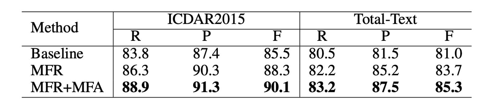

# [20.09] TextFuseNet

## 華麗融合三重奏

[**TextFuseNet: Scene Text Detection with Richer Fused Features**](https://www.ijcai.org/proceedings/2020/72)

---

這篇論文我們只有找到發表時間是 2020 年，月份不明。

因此我們去翻閱了他們的 github 專案，看到他們上傳時間是 2020 年 9 月。

- [**ying09/TextFuseNet**](https://github.com/ying09/TextFuseNet)

那應該就是了，如果我們找的資訊不對，請告訴我們。

## 定義問題

文字檢測的問題大致上已經被定調成一個分割任務。

分割任務的結果非常容易受到背景干擾，尤其在複雜的場景中，若意料之外的景物遮蓋了文字，模型的表現就會急劇下降。

為了提高模型的穩健性，這篇論文的作者同樣是從特徵融合的角度出發，他認為特徵應該要包含：

1. **字元級特徵**：文字的形狀、大小、方向等
2. **區域級特徵**：文字的上下文、背景等
3. **圖像級特徵**：整張圖像的特徵

因此他們提出了一個新的模型 TextFuseNet，這個模型可以同時提取這三種特徵，並且將他們融合在一起。

## 解決問題

### 模型架構

這個圖看上去有點複雜，我們來一步步來看，這裡共有五個部分：

1. **Backbone+Neck**: 這是標準配備了，這篇論文中採用 ResNet-50 作為骨幹網路，用 FPN 作為頸部網路。
2. **RPN**: 用來生成文字候選區域的網路，這裡採用的是 RPN + RoIAlign。
3. **Head 1**: 文字區域預測分支，這個分支輸出格式是 mask
4. **Head 2**: 字元級檢測分支，這個分支輸出格式是 bounding box
5. **Head 3**: 字元級分割分支，這個分支輸出格式是 mask

---

第一個部分沒什麼好說的，大家都熟，我們從第二個部分開始看。

:::tip
不熟的讀者可以參考我們的 [**FPN**](../../feature-fusion/1612-fpn/index.md) 系列介紹。
:::

---

第二個部分是 RPN + RoIAlign。

作者借鑒了 Mask R-CNN 和 Mask TextSpotter 的思想，使用 RPN 來生成後續檢測與遮罩分支所需的文字提議，並透過語義分割和多層特徵提取進行最終的文字檢測。

- [**[17.03] Mask R-CNN**](https://arxiv.org/abs/1703.06870)
- [**[19.08] Mask TextSpotter**](https://arxiv.org/abs/1908.08207)

RPN 的任務是根據 FPN 提取的特徵圖，生成初步的「文字候選區域」。它使用滑動視窗的方式掃描圖像，並通過卷積層來輸出「錨框（anchor boxes）」，錨框代表潛在的文字位置。對於每個候選區域，RPN 會預測是否存在文字，並進行邊界框回歸來修正位置。

經過 RPN 生成文字區域提議後，再來使用 RoIAlign 提取不同的特徵，並同時對單詞和字元進行檢測。

---

第三個部分是文字區域預測分支，是上圖中的： `Semantic Segmentation Branch`。

這個分支專門用來提取全局的語義特徵，像是整體場景的背景之類的。

當文字和背景混合或形狀不規則時，語義分割分支能夠通過捕捉全局上下文信息，提升檢測效果。這一分支的特徵來自 FPN 的輸出，通過將不同層次的特徵對齊，最後進行 1×1 卷積來對特徵進行融合。

---

第四個部分是字元級檢測分支，是上圖中的： `Detection Branch`。

這個分支負責從文字提議中檢測具體的單詞和字元。

首先，利用 RoIAlign 技術提取候選區域中的特徵，這個技術能夠對不同解析度的特徵圖進行準確對齊，避免了傳統的 RoIPooling 中的量化誤差。然後，進行分類和邊界框回歸來精確定位單詞和字元的位置。不同於傳統的只檢測單一層次（例如只檢測單詞或字元）的方式，TextFuseNet 能同時檢測單詞與字元。

:::info
RoIAlign 是 Mask R-CNN 中提出的技術，用來解決 RoIPooling 中的量化誤差問題。
:::

---

第五個部分是字元級分割分支，是上圖中的： `Mask Branch`。

遮罩分支負責對檢測到的單詞和字元進行實例分割。

這意味着它不僅要判斷出文字的位置，還要對文字的具體輪廓進行分割。這是針對形狀複雜或不規則的文字的設計。遮罩分支會從檢測分支輸出的特徵進行細粒度處理，通過多路融合技術來融合字元、單詞和全局特徵，並生成最終的遮罩。

### 多路融合架構

多路融合架構是該模型的關鍵創新點，通過將字元、單詞和全局特徵進行有效的融合，提升了檢測和分割的準確性。

1. **檢測分支中的融合**：

   在檢測分支中，TextFuseNet 首先從文字提議中提取出全局和單詞級的特徵，這些特徵來自 FPN 不同層次的特徵圖。

   對於每個文字提議，利用 RoIAlign 技術從 7×7 大小的特徵圖中提取全局和單詞級特徵，然後將這些特徵通過元素逐項相加（element-wise summation）的方式進行融合。

   融合後，通過 3×3 卷積層和 1×1 卷積層來進一步處理這些特徵，最後用於分類與邊界框回歸。

2. **遮罩分支中的融合**：

   在遮罩分支中，針對每個單詞提議，首先根據公式：

   $$
   C_i = \{c_i | \frac{b_i \cap b_j}{b_j} > T\}
   $$

   來計算字元的屬性集合，這裡 $b_i$ 和 $b_j$ 分別代表單詞和字元的邊界框，閾值 $T$ 設為 0.8。

   對每個字元進行 RoIAlign 操作，從 14×14 的特徵圖中提取字元特徵，並將這些字元級特徵進行元素逐項相加。然後，通過 3×3 卷積層和 1×1 卷積層來生成最終的字元特徵。

3. **三層特徵融合**：

   最終，通過將字元級、單詞級和全局語義特徵進行融合。

   融合方式是通過 RoIAlign 提取出對應的特徵，將它們逐項相加，然後再通過一系列卷積層進一步處理。這些特徵在經過融合和處理後，能夠生成更豐富、更具區別性的表示，用於文字的實例分割。

:::tip
我們很認真地看完這一段，然後真心覺得：

這個華麗的特徵融合方式，推論速度應該很慢吧...
:::

### 弱監督學習

每個想使用字元級檢測和分割的模型都會遇到同樣的困難：缺乏標註數據。

所以作者也像是 CRAFT 一樣，使用了弱監督學習的方式來解決這個問題，有興趣的讀者可以去看看我們之前的介紹：

- [**[19.04] CRAFT: 文字工藝**](../1904-craft/index.md)

---

首先，作者在一個提供完整字元和單詞標註的數據集上訓練 TextFuseNet，得到預訓練模型 $M$，該模型能夠同時檢測字元和單詞。

然後，將預訓練模型 $M$ 應用到只有單詞標註的數據集 $A$ 上，來檢測潛在的字元樣本。

對於數據集 $A$ 中的每張圖像，預訓練模型將生成一組字元候選樣本 $R$，具體定義如下：

$$
R = \{r_0(c_0, s_0, b_0, m_0), r_1(c_1, s_1, b_1, m_1), \cdots , r_i(c_i, s_i, b_i, m_i), \cdots \}
$$

其中，$r_i$ 表示第 $i$ 個字元候選樣本，$c_i$ 為預測的字元類別，$s_i$ 為信心分數，$b_i$ 是字元的邊界框，$m_i$ 是該字元的遮罩。

接下來，根據預測的信心分數和弱監督單詞級別的標註來篩選字元樣本，通過篩選的資料，可作為字元級別的標註，並與單詞級別的標註結合，從而能夠在訓練過程中生成更為健壯且準確的文字檢測模型。

### 訓練資料集

- **SynthText**

  該資料集用於對模型進行預訓練。這是一個大規模數據集，包含約 80 萬張合成圖像。這些圖像由自然場景與隨機字體、大小、顏色和方向的文字混合而成，具有很高的現實感。

- **CTW1500**

  CTW1500 是一個針對長曲線文字檢測的挑戰性資料集，由 Yuliang 等人建構。該資料集包含 1000 張訓練圖片和 500 張測試圖片。不同於傳統文字資料集（如 ICDAR 2015、ICDAR 2017 MLT），CTW1500 的文字實例是由 14 個點的多邊形標註，可以描述任意曲線文字的形狀。

- **Total-Text**

  Total-Text 是一個新發佈的曲線文字檢測資料集，包含水平、多方向及曲線文字實例。該基準資料集包括 1255 張訓練圖片和 300 張測試圖片。

- **ICDAR 2013**

  ICDAR2013 是在閱讀競賽期間發布的，用於聚焦場景文字偵測，由高解析度影像組成，229 張用於訓練，233 張用於測試，包含英文文字。註釋是使用矩形框在字層級進行的。

- **ICDAR 2015**

  ICDAR 2015 是文字檢測中常用的資料集，包含 1500 張圖片，其中 1000 張用於訓練，剩下的用於測試。文字區域由四個頂點的四邊形標註。

## 討論

### 消融實驗

相比於原始的 Mask R-CNN，作者在 TextFuseNet 中引入了兩個模塊來提升文字檢測的性能：

1. **多層次特徵表徵 (MFR)**：這個模塊用於提取不同層次的特徵，有助於更準確地捕捉不同尺度的文字。
2. **多路徑特徵融合架構 (MFA)**：該架構通過融合多層次的特徵，生成更豐富的特徵表徵，有助於文字檢測。

為了驗證這兩個模塊的有效性，作者對 ICDAR 2015 和 Total-Text 兩個數據集進行了消融研究。在每個數據集中，作者準備了三個不同的模型，並進行了性能比較，具體模型的設置如下：

- **Baseline**：指使用原始 Mask R-CNN 訓練的模型。
- **MFR**：指使用多層次特徵表徵（MFR）的 Mask R-CNN 模型。
- **MFR+MFA**：指完整實現 TextFuseNet，包含 MFR 和 MFA 的模型。

在這次消融研究中，骨幹網路採用了帶有 ResNet-50 的 FPN。

---

如上表所示，單獨使用 **多層次特徵表徵(MFR)** 能顯著提升精確度（Precision）和召回率（Recall）。在 ICDAR 2015 和 Total-Text 數據集上，使用 MFR 的模型相較於基線（Baseline）模型的 F 值（F-measure）均提高了超過 2%。

此外，**多層次特徵表徵(MFR)** 和 **多路徑特徵融合(MFA)** 結合使用時，能進一步提升性能。在 ICDAR 2015 數據集上，F 值比基線模型提高了 4.6%，在 Total-Text 數據集上則提高了 4.3%。這些結果驗證了，兩個模塊——多層次特徵表徵和多路徑特徵融合——都有助於提升文字檢測的性能。

這些結果表明，這兩個模塊能夠生成更豐富、更具區別性的特徵表徵，從而有助於提高文字檢測的準確性和穩健性。

### 與其他方法的比較

如上表最後兩列所示，TextFuseNet 在 CTW-1500 和 Total-Text 數據集上均達到了目前最好的性能。

在 CTW-1500 數據集上，使用 ResNet-50 作為骨幹網路的 TextFuseNet 達到了 85.4%的 F 值，比之前的最佳模型高出 1.7%。當使用 ResNet-101 作為骨幹網路時，性能進一步提升至 86.6%，超過了其他方法至少 2.9%。

在 Total-Text 數據集上，TextFuseNet 的 ResNet-50 版本已經達到了目前最好的結果，ResNet-101 版本則比其他方法高出至少 2.1%。這些實驗結果表明，TextFuseNet 在任意形狀文字檢測中能夠達到最先進的性能。

### 可視化

## 結論

這篇論文提出了 TextFuseNet，一個專為檢測任意形狀文字而設計的創新框架，通過結合字元級、單詞級和全局語義級的多層次特徵來提升檢測準確度。這種多層次的特徵融合方式確實為文字檢測帶來了更為豐富的表示能力，並在 CTW-1500 和 Total-Text 等數據集上達到了領先的檢測性能。

從實驗結果來看，TextFuseNet 在處理複雜文字形狀時展現了強大的能力，並取得了令人鼓舞的效果，這也展示了該方法的潛力。

:::tip
可惜有點慢，身為工程師的我們，在大多數的情況下，不能拿這個架構出去交作業。
:::
