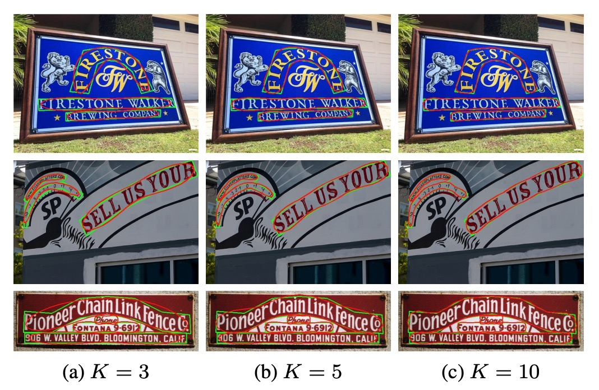

## 傅立葉的指引

[**Fourier Contour Embedding for Arbitrary-Shaped Text Detection**](https://arxiv.org/abs/2104.10442)

---

你打開這篇論文，想看點文字偵測的技術。

卻猝不及防地被傅立葉迎面撞上，兩眼一黑，倒在地上。

## 傅立葉轉換

數學家約瑟夫・傅立葉在 19 世紀初提出這套數學工具，之後在各個領域中大殺四方，威風凜凜上百年。

:::tip
每個莘莘學子對於眼前的問題感到迷茫的時候，都可以來上一句：

- **要不試試傅立葉轉換？**

可能解題的成分佔比不大，更多的是一種寄託於偉大前輩的祈禱......

萬一有用呢？
:::

傅立葉的核心思想非常簡單：

- **任何波都可以拆解為正弦波和餘弦波的疊加。**

就像拆解音樂中的每一個音符一樣，傅立葉轉換幫助我們從原本看似混亂的時間或空間信號中，找出它的頻率組成。

相關應用範圍早已超越了數學和物理的範疇，它出現在工程學、醫學、天文學，甚至現在的深度學習技術中。

但，就算我們想要「簡單地」介紹傅立葉轉換，仍然會佔用過多的篇幅，所以我們另外寫了一篇文章來介紹這個主題：

- [**淺談傅立葉轉換**](https://docsaid.org/blog/fourier-transform)

如果你還不清楚傅立葉轉換是什麼，可以先去點過去看看。

## 定義問題

多方向的扭曲文字，一直都是研究者的重點難題。

現有的方法，大多基於空間域的表示，例如每個像素的遮罩或輪廓點序列，採用的是笛卡爾坐標系或極座標系。但這些方法存在一些缺點：

- 遮罩表示需要高昂的計算成本，並且對大規模訓練數據有較高依賴。
- 輪廓點序列表示對高度彎曲的文字建模能力有限。

所以我們需要的是一種簡潔且具有良好泛化能力的文字實例表示方式。

既然空間域的問題難解，那不然我們改變一下思路，從頻域來看看？

那麼，傅立葉就決定是你了！

## 解決問題

### 傅立葉輪廓嵌入

原文為 Fourier Contour Embedding，簡稱 FCE。

FCE 使用一個複數值函數 $f : \mathbb{R} \to \mathbb{C}$ 來表示閉合的「文字輪廓」：

$$
f(t) = x(t) + iy(t),
$$

其中 $i$ 是虛數單位，$(x(t), y(t))$ 為時間 $t$ 下的空間座標。

由於 $f(t)$ 是閉合輪廓，因此 $f(t) = f(t + 1)$。

:::tip
**什麼是閉合輪廓？**

閉合輪廓是一個「曲線的起點和終點相同」的幾何形狀。

當使用一個參數化函數 $f(t)$ 來表示閉合輪廓時，參數 $t$ 通常表示曲線上的位置，範圍設定為 $t \in [0, 1]$。這裡的 $t=0$ 和 $t=1$ 對應到曲線的同一點，因此：

$$
f(0) = f(1).
$$

由於這個特性，$f(t)$ 具有週期性，滿足：

$$
f(t) = f(t + n), \quad n \in \mathbb{Z}.
$$

在本文中，$t$ 被視為時間，隨著時間 $t$ 的變化，點沿著閉合輪廓移動，因此當 $t$ 增加到超過 1 時，曲線重新回到起點，形成一個週期運動。

:::

透過傅立葉逆變換 (Inverse Fourier Transformation, IFT)，$f(t)$ 可表達為：

$$
f(t) = \sum_{k=-\infty}^{+\infty} c_k e^{2\pi i k t},
$$

其中 $c_k$ 是複數值傅立葉係數，表示頻率 $k$ 的初始狀態。

每個 $c_k e^{2\pi i k t}$ 表示一個特定頻率的圓周運動。

- **低頻**：負責輪廓的整體形狀。
- **高頻**：負責輪廓的細節。

本論文的實驗結果顯示：僅保留前 $K = 5$ 個最低頻成分即可取得良好的輪廓近似，形成傅立葉簽名向量（Fourier signature vector）。

在實際應用中，文字輪廓的函數形式未知，因此需將函數 $f(t)$ 離散化為 $N$ 個點：

$$
\{f\left(\frac{n}{N}\right)\}, \quad n = 1, \dots, N.
$$

傅立葉係數 $c_k$ 可透過傅立葉變換計算：

$$
c_k = \frac{1}{N} \sum_{n=1}^N f\left(\frac{n}{N}\right) e^{-2\pi i k \frac{n}{N}},
$$

其中 $c_k = u_k + i v_k$，$u_k$ 為實部，$v_k$ 為虛部。

當 $k = 0$ 時表示輪廓的中心位置：

$$
c_0 = u_0 + iv_0 = \frac{1}{N} \sum_n f\left(\frac{n}{N}\right),
$$

最終的傅立葉簽名向量為：

$$
[u_{-K}, v_{-K}, \dots, u_0, v_0, \dots, u_K, v_K].
$$

### FCE 採樣流程

<figure style={{"width": "90%"}}>

</figure>

由於不同數據集的輪廓點數量不同，例如 CTW1500 有 14 點，Total-Text 有 4 至 8 點。

作者通過重採樣統一格式，在輪廓上等距選取固定數量的點（實驗中為 $N=400$）。

為了保證簽名向量的穩定性，對重採樣過程進行以下限制：

- **起始點**：設定為輪廓中心水平線與輪廓的最右交點。
- **採樣方向**：沿順時針方向進行。
- **均勻速度**：相鄰採樣點間距相等。

### 模型架構

<figure style={{"width": "90%"}}>

</figure>

先撇開看不懂傅立葉的問題，這篇論文的設計其實非常簡單明瞭。

基於 FCE 的無錨文字檢測網路，作者命名為：FCENet。

FCENet 採用 ResNet50（搭配可變形卷積 DCN）作為主幹，並以 FPN（特徵金字塔網路）擷取多尺度特徵。其特徵圖 $P_3$、$P_4$ 和 $P_5$ 分別負責小、中、大尺度文字。

這個部分使用的方法和之前的作品差不多，我們這裡不再贅述。

預測頭部分為兩個分支：

1. **分類分支**

   上圖中的上半部，Classfication Branch，又分成兩個子分支：

   - 每像素的文字區域 (Text Region, TR) 遮罩預測。
   - 文字中心區域 (Text Center Region, TCR) 遮罩預測，這個分支是為了提升邊界附近的預測品質。

2. **回歸分支**

   這個就是本論文的核心目標了：這裡要預測每個像素的傅立葉簽名向量。

   在上一章節提到的計算傅立葉簽名向量，目的就是為了要在這裡提供訓練目標。

   模型預測結果會透過傅立葉逆變換 (IFT) 重建檢測結果，如下圖：

   

    <figure style={{"width": "70%"}}>
    
    </figure>
    

## 損失函數

總損失為：

$$
L = L_\text{cls} + \lambda L_\text{reg},
$$

其中 $\lambda=1$。

分類損失 $L_\text{cls}$ 和回歸損失 $L_\text{reg}$ 分別如下：

1. **分類損失**

   $$L_\text{cls} = L_\text{tr} + L_\text{tcr}$$

   其中 $L_\text{tr}$ 和 $L_\text{tcr}$ 為文字區域與中心區域的交叉熵損失，負樣本與正樣本比例為 3:1（使用 OHEM）。

2. **回歸損失**

   為了直接優化空間域內的檢測品質，而非傅立葉簽名向量間的距離，設計損失為：

   $$
   L_\text{reg} = \frac{1}{N'} \sum_{i \in T} \sum_{n=1}^{N'} w_i l_1\left(F^{-1}\left(\frac{n}{N'}, c_i\right), F^{-1}\left(\frac{n}{N'}, \hat{c}_i\right)\right),
   $$

   其中：

   - $l_1$ 為 $ \text{smooth L1}$ 損失。
   - $F^{-1}$ 為傅立葉逆變換。
   - $T$ 為文字區域像素集合。
   - $c_i$ 和 $\hat{c}_i$ 分別為真實與預測的傅立葉簽名向量。
   - $w_i$ 為權重，中心區域內像素 $w_i=1$，否則 $w_i=0.5$。
   - 採樣點數 $N'=50$，避免過擬合。

   ***

   :::tip
   注意到這個細節，作者不是直接算傅立葉簽名向量的距離，而是將其轉換回空間域，才去計算空間域內的損失。

   **為什麼？**

   因為傅立葉簽名向量表示的是輪廓在頻域中的特徵，而非直接的空間域幾何形狀。如果我們直接計算簽名向量的差異可能無法準確反映輪廓在空間中的形狀差異。

   假設某個低頻分量略有誤差，這可能導致輪廓整體位置偏移，但傅立葉簽名向量的差異仍然很小。

   反之，高頻分量的誤差可能只影響輪廓的細微細節，但可能對簽名向量的距離造成較大的影響。

   作者應該已經做過相關的實驗，才會做這樣的設計。
   :::

### 訓練數據集

- **1. CTW1500**

  - 包含中英文文字，並以**文本行（text-line）級別標註**。
  - 數據量：1000 張訓練圖片，500 張測試圖片。

- **2. Total-Text**

  - 包含多場景數據，包括類似文字的背景干擾及低對比度文字。
  - 標註為**單詞級別的多邊形**。
  - 數據量：1255 張訓練圖片，300 張測試圖片。

- **3. ICDAR2015**
  - 針對多方向街景文字設計的數據集，**單詞級別標註**由四個頂點表示。
  - 數據量：1000 張訓練圖片，500 張測試圖片。

## 討論

### FCE 評估

<figure style={{"width": "70%"}}>

</figure>

理論上，任何閉合且連續的輪廓都能通過增加 FCE 的傅立葉階數 $K$ 獲得更好的擬合。

根據上圖的結果，僅需小的 $K$ 即可對大部分任意形狀的文字輪廓進行滿意的擬合，這說明了 FCE 的強大表徵能力。

將 FCE 與近期最新的任意形狀文字檢測方法 **TextRay** 進行比較，如下圖：

<figure style={{"width": "70%"}}>

</figure>

對於高曲率文字，**TextRay** 無法精確擬合真實輪廓，顯示出其在建模高曲率文字方面的局限性。相較之下，FCE 在擬合這類文字輪廓時表現出了高度的準確性。

從效率方面來看，FCE 僅使用 22 維參數即可描述文字輪廓。TextRay 則使用 44 維參數，為 FCE 的 2 倍，但效果不及 FCE。因此 FCE 在參數效率和擬合效果上有明顯的優勢。

### 消融實驗

<figure style={{"width": "70%"}}>

</figure>

為了驗證 FCENet 各個組件的有效性，作者在 CTW1500 和 Total-Text 數據集上進行了消融實驗，結論如下：

- **文字中心區域 (TCR) 損失**：分類分支的 TCR 損失顯著提升了檢測性能。
- **回歸損失**：回歸分支中的新設計損失能有效優化重建的文字輪廓，對性能有顯著提升。

:::tip
這個回歸損失的提升效果非常明顯，直接證明了傅立葉簽名向量的有效性，是本論文的一大亮點。
:::

### 泛化能力

<figure style={{"width": "70%"}}>

</figure>

為了驗證 FCE 的泛化能力，作者在 CTW1500 數據集上進行縮減訓練數據的實驗。將訓練數據減少至原數量的 50% 和 25%，和其他方法（如 DRRG、TextRay、ABCNet）進行比較。

結果顯示，其他方法的性能大幅下降，而 FCENet 的準確率、召回率和 F 值仍保持良好，尤其是準確率始終超過 80%，表現非常穩定。

:::tip
相關論文可以參考：

- [**[20.02] ABCNet**](https://arxiv.org/abs/2002.10200)
- [**[20.03] DRRG**](https://arxiv.org/abs/2003.07493)
- [**[20.08] TextRay**](https://arxiv.org/abs/2008.04851)
  :::

### 和其他方法的比較

- **Ext: 代表使用額外訓練數據**
- **†: 代表簡化版本 FCENet†，不含 DCN**

---

在 CTW1500 和 Total-Text 數據集上，FCENet 與其他最新方法進行了比較，結果如下：

- **精度 (P) 和 F 值 (F)**：FCENet 取得最佳表現。
- **召回率 (R)**：達到具有競爭力的結果。

在 ICDAR2015 數據集上，FCENet 在無額外設置的情況下仍取得了競爭性的結果。

FCENet 的網路架構簡單，後處理（IFT 和 NMS）高效，實現容易且具有實用性，即使使用不含 DCN 的 ResNet50 作為主幹網路（與 ABCNet 相同配置），FCENet 仍然在多個數據集上取得競爭性表現。

:::tip
這一段其實也側面說明了 DCN 是個強大的運算子，能夠有效提升模型的性能。
:::

### 高度曲線文字

最後，作者在 CTW1500 數據集上構建了一個高曲率文字子集，用於評估模型在高曲率文字上的檢測能力。

結果如上圖，FCENet 在高曲率文字的檢測準確性和精度上均表現優異，進一步提升了對不規則文字實例的表徵能力。

## 結論

傅立葉的優雅無庸置疑。

本文提出的傅立葉輪廓嵌入方法，能精準表徵任意形狀的文字輪廓，尤其在高曲率文字的擬合上表現卓越。FCENet 通過預測傅立葉簽名向量並進行逆變換來重建文字輪廓，省去繁瑣的後處理步驟，在準確性和實用性之間達到平衡，特別適合複雜輪廓和曲線文字的檢測。

傅立葉方法不僅是數學工具，更是解決實際問題的有力手段。透過 FCE 和 FCENet，作者為任意形狀文字檢測提供了高效實用的解決方案，並為未來的文字形狀建模拓展了可能性。
