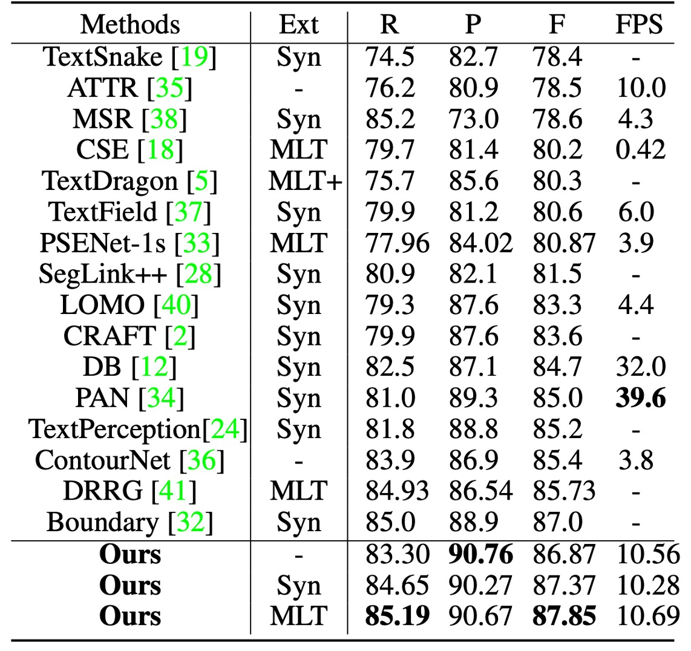
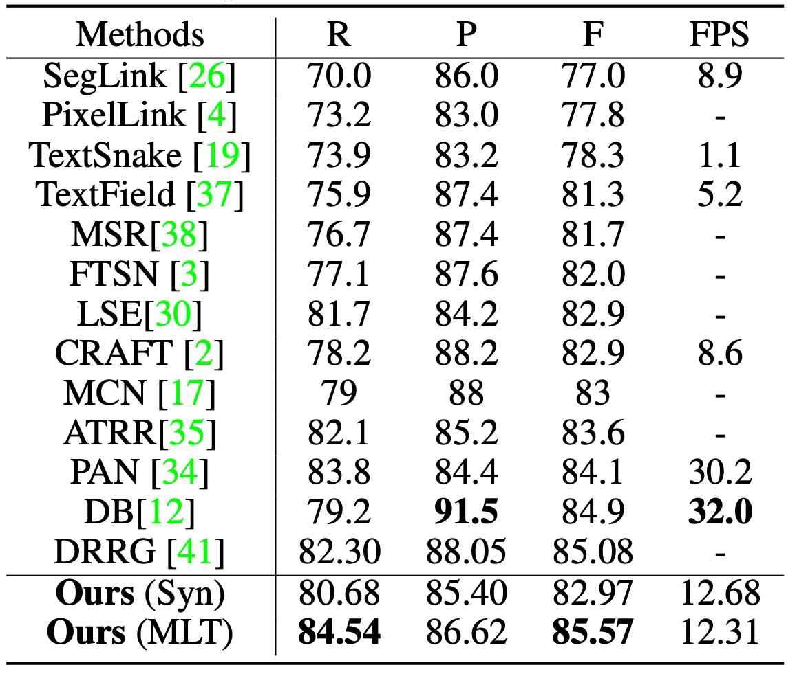
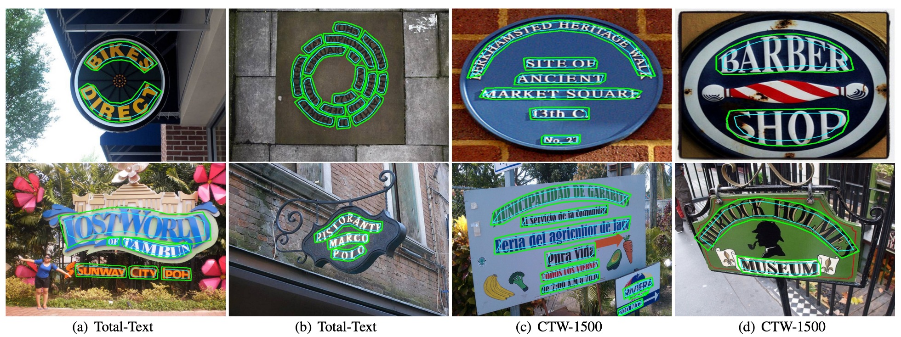

## 再訪圖卷積

[**Adaptive Boundary Proposal Network for Arbitrary Shape Text Detection**](https://arxiv.org/abs/2107.12664)

---

這篇論文引入了幾個概念，來解決文字偵測的問題。

第一個是 LSTM，用來補捉文字邊界的序列資料；另外一個是 GCN，也是圖卷積網路，用來細化文字邊界的特徵。這兩個概念都展開來講都可以講個三天三夜，但是我們想讀者們應該都已經很熟悉這些概念了。

所以我們直接開始吧。

:::tip
如果你對圖卷積不了解，可以參考我們之前的文章：

- [**淺談圖卷積網路**](https://docsaid.org/blog/graph-convolutional-networks)
  :::

## 定義問題

我們也陸續看過幾個文字偵測的方法了，大多數的方法為了解決文字區域交疊的問題，解題方向都是先找「文字核心」，然後基於文字核心向外部擴展，找到文字邊界。

這些方法大多都很慢，就論文中的原話，叫做：「複雜且低效」！

為了改善這些問題，作者提出了一種用於任意形狀文本檢測的新型自適應邊界提議網路，它可以學習直接為任意形狀文本生成準確的邊界，而無需任何後處理。

## 解決問題

### 模型架構

這個架構乍看之下有點複雜，我們分幾個部分來看。

### Backbone + Neck

<figure style={{"width": "70%"}}>

</figure>

基礎特徵圖的提取是基本的操作，這裡的 Backbone 使用的是 ResNet-50，Neck 的部分使用 Concat 的方式進行特徵融合，算是 U-Net-like 的架構。

最後 Neck 的輸出是 $32$ 個通道，尺寸和輸入圖一致的特徵圖。

### 邊界提議生成

<figure style={{"width": "70%"}}>

</figure>

邊界提議生成（Boundary Proposal Generation），由多層膨脹卷積構成，包含兩層 $3 \times 3$ 的卷積層（不同的膨脹率）和一層 $1 \times 1$ 的卷積層。

這些卷積層使用從主幹網路提取的共享特徵來生成三種輸出：分類圖、距離場圖和方向場圖。

1. **分類圖：** 這和其他文字檢測方法一樣，是一個二元分類的圖，每個像素表示是否屬於文字的分類置信度（二元分類：文字/非文字）。
2. **方向場圖：**

   方向場圖 $V$ 為一個二維單位向量 $(\vec{x}, \vec{y})$，表示每個文字像素指向其最近邊界像素的方向。對於每個文字實例 $T$ 內的像素 $p$，會找到其最近的邊界像素 $B_p$，並計算從 $p$ 到 $B_p$ 的單位向量 $V_{gt}(p)$，其公式如下：

   $$
   V_{gt}(p) =
   \begin{cases}
   \frac{\overrightarrow{B_p p}}{\|\overrightarrow{B_p p}\|}, & p \in T \\
   (0, 0), & p \notin T
   \end{cases}
   $$

   其中 $$\|\overrightarrow{B_p p}\|$$ 代表 $$B_p$$ 與文字像素 $$p$$ 之間的距離。

3. **距離場圖：**

   距離場圖 $D$ 是一個歸一化的距離圖，用來表示文字像素 $p$ 到最近邊界像素 $B_p$ 的歸一化距離。其公式為：

   $$
   D_{gt}(p) =
   \begin{cases}
   \frac{\|\overrightarrow{B_p p}\|}{L}, & p \in T \\
   0, & p \notin T
   \end{cases}
   $$

   其中 $L$ 代表文字實例 $T$ 的尺度，定義為：

   $$
   L = \max(D_{gt}(p)), p \in T
   $$

<figure style={{"width": "70%"}}>

</figure>

根據距離場圖 $D$，可以通過固定的閾值 $th_d$ 來生成候選邊界提議，但這些提議可能包含誤檢。因此，會根據分類圖計算每個候選邊界提議的平均置信度，並使用閾值 $th_s$ 去除一些置信度低的提議。

這些步驟和公式共同構成了邊界提議生成過程，能有效檢測文字區域並處理相鄰文字實例間的邊界問題。

### 自適應邊界變形

自適應邊界變形（Adaptive Boundary Deformation）模型的想法來自於過去的研究論文：

- [**[18.03] Efficient Interactive Annotation of Segmentation Datasets with Polygon-RNN++**](https://arxiv.org/abs/1803.09693)
- [**[19.03] Fast Interactive Object Annotation with Curve-GCN**](https://arxiv.org/abs/1903.06874)
- [**[20.01] Deep Snake for Real-Time Instance Segmentation**](https://arxiv.org/abs/2001.01629)

這些論文的詳細介紹我們之後再寫其他文章來講，這邊我們直接使用已知的結論：

透過這些方法，模型可以得到每個文字實例的邊界控制點，基於 CNN 特徵輸入，並進行逐頂點的偏移預測。每個邊界提議會從中均勻取樣 N 個控制點，這些控制點形成一個封閉的多邊形，兼顧拓撲上下文與序列上下文。

對於每個控制點 $cp_i = [x_i, y_i]^T$，會生成特徵向量 $f_i$。

這些特徵是從 CNN 主幹網路獲得的 32 維共享特徵 $F_s$ 和 4 維先驗特徵 $F_p$（如像素分類、距離場、方向場）組合而成。

具體公式為：

$$
f_i = \text{concat}\{F_s(x_i, y_i), F_p(x_i, y_i)\}
$$

---

得到控制點的預測後，接著要細化邊界提議。

這裡引入 GCN 和 RNN 來進行邊界變形，如下圖所示：

<figure style={{"width": "50%"}}>

</figure>

編碼器結合了 GCN 和 RNN，用於充分利用邊界的拓撲與序列上下文，其公式為：

$$
X' = \text{RNN}(X) \oplus \text{GCN}(X) \oplus \text{Conv1x1}(X)
$$

其中，RNN 由一層隱藏大小為 128 的 BiLSTM 組成。

---

GCN 包含四層啟動函數為 ReLU 的圖卷積層，圖卷積層的公式如下：

$$
X_g = \text{ReLU}((X \oplus GX)W)
$$

其中，$G = D^{-1/2} \tilde{A} D^{-1/2}$，$\tilde{A} = A + I_N$，$A$為局部圖的鄰接矩陣，$I_N$為單位矩陣，$D$為對角矩陣。

GCN 中的每個控制點與其四個鄰居相連，透過此種方式處理控制點間的上下文關係。

---

除了上面兩個分支之後，還有一個 $1 \times 1$ 卷積層形成殘差連接，共三個分支進行特徵融合。

所有特徵以拼接（Concat）後，輸入到解碼器中，解碼器的輸出為控制點的偏移量。

為了獲得更精確的文字邊界，會執行多次迭代的邊界變形。這些步驟使得模型能夠通過多次迭代變形，逐步細化初始的邊界提議，最終達到精確的文字檢測效果。

:::tip
在這裡，RNN 被用來處理序列；GCN 被用來處理鄰近節點資訊流動。

依照我們經驗，在 2021 年的時刻，這些事情都可以用 Transformer 來做，這可能會是之後的改進方向。
:::

### 訓練資料集

- **SynthText**

  該資料集用於對模型進行預訓練。這是一個大規模數據集，包含約 80 萬張合成圖像。這些圖像由自然場景與隨機字體、大小、顏色和方向的文字混合而成，具有很高的現實感。

- **CTW1500**

  CTW1500 是一個針對長曲線文字檢測的挑戰性資料集，由 Yuliang 等人建構。該資料集包含 1000 張訓練圖片和 500 張測試圖片。不同於傳統文字資料集（如 ICDAR 2015、ICDAR 2017 MLT），CTW1500 的文字實例是由 14 個點的多邊形標註，可以描述任意曲線文字的形狀。

- **Total-Text**

  Total-Text 是一個新發佈的曲線文字檢測資料集，包含水平、多方向及曲線文字實例。該基準資料集包括 1255 張訓練圖片和 300 張測試圖片。

- **MSRA-TD500**

  這是一個多語言、任意方向和長文字行的數據集。包含 300 張訓練圖像和 200 張測試圖像，文字行標註為行級標註。由於訓練集較小，實驗中加入了 HUST-TR400 數據集的圖像作為訓練數據。

- **ICDAR 2017 MLT**

  IC17-MLT 是一個大規模的多語言文字資料集，包括 7200 張訓練圖片、1800 張驗證圖片和 9000 張測試圖片。該資料集由來自 9 種語言的完整場景圖像組成。

## 討論

### 消融實驗

為驗證自適應變形模型的有效性，作者在 Total-Text 與 CTW-1500 數據集做了幾個消融實驗。

1. **自適應變形模型的有效性：**

    

   <figure style={{"width": "90%"}}>
   
   </figure>
   

   使用四種不同的編碼器進行比較：全連接網路（FC）與 Conv1x1、RNN、循環卷積（Circular Convolution）、圖卷積網路（GCN）。

   根據上表，自適應變形模型在兩個數據集上都取得了最佳性能，相比 RNN 在 Total-Text 上 F-measure 提升了 0.94%，相比 GCN 提升了 0.85%。而且自適應變形模型並未明顯增加檢測時間。

2. **控制點數量（N）的影響：**

    

    <figure style={{"width": "70%"}}>
    
    </figure>
    

   作者研究了不同控制點數量對檢測性能的影響，控制點數量設定為 12 到 32，間隔為 4。

   從上圖可以看出，當控制點數過大或過小時，F-measure 會下降。特別是控制點數過少時，檢測邊界無法正確覆蓋整個文字區域，導致性能大幅下降。當控制點數量約為 20 時，模型在 Total-Text 與 CTW-1500 數據集上取得最佳檢測性能。因此，實驗中控制點數量固定為 20。

3. **迭代次數的影響：**

   

   <figure style={{"width": "90%"}}>
   
   </figure>
   

   作者比較了不同推理迭代次數的模型性能。根據上表，隨著迭代次數的增加，檢測性能逐漸提升，但推理速度逐漸降低。當迭代次數從 2 增加到 3 時，檢測性能的提升不再明顯。綜合速度與性能的平衡，實驗中迭代次數設置為 3 次。

4. **先驗信息的影響：**

   

   <figure style={{"width": "90%"}}>
   
   </figure>
   

   作者在 Total-Text 數據集上進行消融實驗，驗證不同先驗信息（如分類圖、距離場和方向場）的重要性。根據上表，僅使用分類圖時，檢測性能不理想。當加入距離場和方向場後，性能顯著提升，F-measure 分別提高了 5.45%和 1.55%。

### 曲線文字實驗結果

<figure style={{"width": "70%"}}>

<figcaption>Total-Text 實驗結果</figcaption>
</figure>

<figure style={{"width": "70%"}}>

<figcaption>Total-Text 實驗結果</figcaption>
</figure>

---

測試時，圖像的短邊縮放至 640，長邊限制在 1024 像素內。用於獲取候選邊界提議的距離場閾值 $th_d$ 固定為 0.3。

在 Total-Text 上測試時的分類閾值 $th_s$ 設定為 0.825。

根據上表，使用 SynthText 預訓練時，TextBPN 在 F-measure 上達到了 87.37%；使用 MLT17 預訓練時，F-measure 提高至 87.85%。相較其他方法，TextBPN 在 F-measure 上顯著優於其他技術

在 CTW-1500 上測試時，分類閾值 $th_s$ 設定為 0.8。

TextBPN 在精度（87.81%）與 F-measure（85.0%）上均取得了優異表現。尤其是與 TextSnake 和 DB 方法相比，TextBPN 的 F-measure 分別提高了 9.4%和 1.6%。

### MSRA-TD500 實驗結果

<figure style={{"width": "70%"}}>

</figure>

在 MSRA-TD500 上測試時，分類閾值 $th_s$ 設定為 0.925。

TextBPN 能成功檢測任意方向與大小的長文字行，並且在 F-measure 上達到了 85.57%，超越了其他技術，如 DB 和 DRRG 等。

### 可視化結果

<figure style={{"width": "90%"}}>

</figure>

## 結論

引入 GCN 和 RNN 在文字檢測的領域中確實是個很新穎的策略。

實驗結果證明，該方法在 Total-Text、CTW-1500 等具有挑戰性的數據集上取得了顯著的性能提升，特別是在處理不規則和曲線文字方面，展現了優異的表現。

未來的研究若能在保持檢測精度的同時，進一步提升其推理速度與應用靈活性，將使該方法在更廣泛的場景中展現出更大的實用性。

:::tip
其實你可以看出來分類閾值 $th_s$ 在評估資料集上佔有很重要的地位，這個部分有很大的討論空間。如果調錯參數就會造成模型表現大幅下降，這就工程師的角度看來，可能會造成許多困擾。
:::
