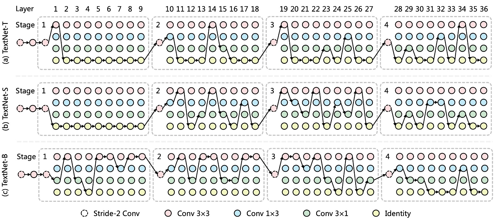
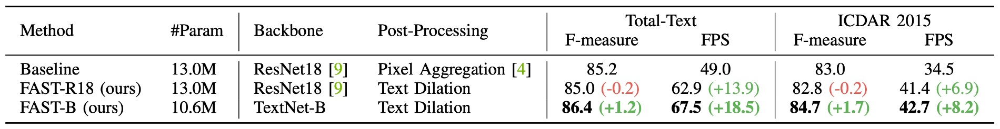
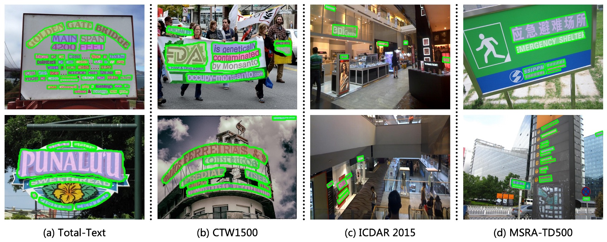

# [21.11] FAST

## 放箭若流星趕月

[**FAST: Faster Arbitrarily-Shaped Text Detector with Minimalist Kernel Representation**](https://arxiv.org/abs/2111.02394)

---

每個作者都要嘲諷一次前作的低效設計，但又屢屢提出的架構只改善了一點點。

這次似乎不太一樣，這篇論文新設計了基礎架構，優化後處理方式，整體效能上有了巨大的提升。推論速度與預測精度的權衡良好，在往後幾年間都是一個很好的基準。

## 定義問題

作者認為現有的文字檢測方式的「後處理」流程大有問題。

如上圖所示，目前有名的檢測方法，其「後處理」佔整體時間的 30% 左右。而且這些方法的後處理都基於 CPU 上運作，很難與 GPU 的資源並行，導致明顯的效能瓶頸。

這個肯定要改！

---

另一方面，目前流行的檢測方法中， Backbone 的設計大多基於現有的圖像分類網絡，再搭配 FPN 或 U-Net 進行特徵融合。

由於文字的形狀多樣，而且通常很長一條，這樣的設計可能不適合。

所以 Backbone 也要一起改！

## 解決問題

### 模型架構

首先，作者捨棄大多數主流的 Backbone + Neck 的架構。

重新搭建了一個 Backbone 架構，取名為 `TextNet`，這個架構的來源我們等一下再說。

雖然捨棄了 Neck，但還是得進行特徵融合。這裡作者直接使用 Backbone 所輸出的多尺度特徵圖，在最後進行拼接（concatenate）。

### 極簡文字表示法

預測頭的部分，輸入特徵圖就是剛才提到的多尺度特徵圖，輸出是一個文字核心圖，僅由一個通道組成。

極簡文字表示法，Minimalist Kernel Representation（MKR），是作者提出的一種文字核心表示法。

過去的研究是透過收縮公式來得到文字核心，而這裡作者使用「侵蝕」操作來得到文字核心。得到文字核心圖之後，接著是「連通區域標記」，這個概念來自於以下這篇論文：

- [**[19.08] Optimized Block-Based Algorithms to Label Connected Components on GPUs**](https://www.researchgate.net/publication/335183975_Optimized_Block-Based_Algorithms_to_Label_Connected_Components_on_GPUs)

這是直接實作 cuda 程式碼，讓 GPU 進行「連通區域標記」的運算。

相關實作在 FAST 的 [**GitHub**](https://github.com/czczup/FAST) 上可以找到： [**ccl_cuda.cu**](https://github.com/czczup/FAST/tree/main/models/post_processing/ccl)

演算法的實作邏輯如下：

在推論階段，輸出文字實例前會先經過連通區域標記，接著使用 `max_pool2d` 來完成文字膨脹的功能。

也因為是使用 `max_pool2d`，所以在文字膨脹的過程中，重疊的部分會優先分配給連通區域編號較大的部分。

### 標注生成策略

為了要監督模型，我們需要生成標注。

這裡作者使用 `Erode` 操作進行標注生成。由於最後輸出階段，會使用 `Dilate` 操作進行文字膨脹，所以在生成標注資料時，只需要將數據集中的文字標注進行 `Erode` 操作即可。

### TextNet

最後是 Backbone 的設計方式。

作者依據 ProxylessNAS 的設計，構建了一個專為文字偵測的架構搜尋主幹網路。

- [**[18.12] Proxylessnas: Direct neural architecture search on target task and hardware**](https://arxiv.org/abs/1812.00332)

每一個網路階段包含一個步長為 2 的卷積層與多個可搜尋區塊，如上圖所示。

步長為 2 的 3x3 卷積層用於下採樣特徵圖，而每個可搜尋區塊由一組候選操作構成，經過架構搜尋後選擇最合適的操作作為最終的操作。

為追求極限速度，作者使用可重參數化卷積作為候選操作，並在推理過程中將其合併為單一分支的卷積操作。其中，作者設計了一個層級候選操作集，定義為：

- $\text{conv 3x3}$
- $\text{conv 1x3}$
- $\text{conv 3x1}$
- $\text{identity}$

由於 $1 \times 3$ 和 $3 \times 1$ 卷積具有非對稱核和方向性結構先驗，這些操作有助於捕捉極端長寬比及旋轉的文字線特徵。此外，identity 操作表示跳過該層，用以控制網路深度與推理速度。

:::tip
這可能是比較少人注意到的地方，根據論文描述：

實際上進入搜索階段的架構網路是 `RepConvLayer`，而不是一般的卷積層。

這個實作寫在 [**BreadcrumbsFAST/models/utils/nas_utils.py#RepConvLayer**](https://github.com/czczup/FAST/blob/6bdfd251f04f800b5b20117444eee10a770862ad/models/utils/nas_utils.py#L603C7-L603C19)

這個卷積層如果你輸入的是 kernel_size=[3, 3]，那你會得到一個完整的重參數分支結構。如果你輸入 kernel_size=[3, 1]，那你就得到固定方向的結構，依此類推。

所以儘管這裡的搜索架構找的目標是這個 kernel_size 的設定，可選用的操作有 `3x3`、`3x1`、`1x3`、`Identity`。但不管架構怎麼搜，裡面的操作核心都是 `RepConvLayer`，最後在推論時候都會進行「重參數化」。

如果你不知道「重參數化」是什麼，可以參考我們之前寫的文章：

- [**[21.01] RepVGG: 讓 VGG 再次偉大**](../../reparameterization/2101-repvgg/index.md)

:::

### 損失函數

FAST 模型的損失函數可以表述為：

$$
L = L_{ker} + \alpha L_{tex}
$$

其中 $L_{ker}$ 和 $L_{tex}$ 分別代表文字核心區域和文字區域的損失。

依據常見的做法，作者使用 Dice 損失來監督網路訓練，因此，$L_{ker}$ 和 $L_{tex}$ 可以分別表示為：

$$
L_{ker} = 1 - \frac{2 \sum_{x,y} P_{ker}(x, y) G_{ker}(x, y)}{\sum_{x,y} P_{ker}(x, y)^2 + \sum_{x,y} G_{ker}(x, y)^2}
$$

$$
L_{tex} = 1 - \frac{2 \sum_{x,y} P_{tex}(x, y) G_{tex}(x, y)}{\sum_{x,y} P_{tex}(x, y)^2 + \sum_{x,y} G_{tex}(x, y)^2}
$$

其中，$P(x, y)$ 和 $G(x, y)$ 分別代表預測值和真實值在位置 $(x, y)$的值。

此外，作者在 $L_{tex}$ 中應用了**在線困難樣本挖掘**（OHEM），用於忽略簡單的非文字區域。

$\alpha$ 用於平衡 $L_{ker}$ 和 $L_{tex}$ 的重要性，並且在實驗中設定為 0.5。

### 訓練資料集

- **CTW1500**

  CTW1500 是一個針對長曲線文字檢測的挑戰性資料集，由 Yuliang 等人建構。該資料集包含 1000 張訓練圖片和 500 張測試圖片。不同於傳統文字資料集（如 ICDAR 2015、ICDAR 2017 MLT），CTW1500 的文字實例是由 14 個點的多邊形標注，可以描述任意曲線文字的形狀。

- **Total-Text**

  Total-Text 是一個新發佈的曲線文字檢測資料集，包含水平、多方向及曲線文字實例。該基準資料集包括 1255 張訓練圖片和 300 張測試圖片。

- **MSRA-TD500**

  這是一個多語言、任意方向和長文字行的數據集。包含 300 張訓練圖像和 200 張測試圖像，文字行標注為行級標注。由於訓練集較小，實驗中加入了 HUST-TR400 數據集的圖像作為訓練數據。

- **ICDAR 2015**

  ICDAR 2015 是文字檢測中常用的資料集，包含 1500 張圖片，其中 1000 張用於訓練，剩下的用於測試。文字區域由四個頂點的四邊形標注。

- **ICDAR 2017 MLT**

  IC17-MLT 是一個大規模的多語言文字資料集，包括 7200 張訓練圖片、1800 張驗證圖片和 9000 張測試圖片。該資料集由來自 9 種語言的完整場景圖像組成。

## 討論

### NAS 搜索架構

如上圖，作者繪製了 TextNet-T/S/B 的搜尋架構，觀察到以下幾個現象：

- **非對稱卷積**是 TextNet 的主要操作，有助於以較高的準確性與效率偵測文字行。
- **TextNet-T 與 TextNet-S**在較深層的階段（stage-3 和 stage-4）堆疊更多卷積層，而**TextNet-B**則傾向於在較淺層階段（stage-1 和 stage-2）進行堆疊。

這說明了 TextNet 在三種特定的速度限制（即 100、80 和 60 FPS）下的堆疊規則不同，並顯示手工設計網路的常見策略（即在 stage-3 堆疊大多數層）可能對於實時文字偵測來說並非最優。

### 消融實驗

- **提議組件比較**

  

  如上表所示，作者要比較提議組件的效果，像是在 PAN 架構中使用的是 `Pixel Aggregation`，而本論文中作者提出的 `Text Dilation`。

  為了公平比較，所有模型都在 IC17-MLT 上進行預訓練，並在 Total-Text 或 ICDAR 2015 上進行微調。

  與使用 ResNet18 和基於 CPU 的後處理 Pixel Aggregation 的基線相比，**FAST-R18**將後處理替換為 GPU 平行化的文字擴張操作，實現了更高的效率且檢測性能相當。

  此外，將 ResNet18 主幹網路替換為**TextNet-B**，進一步提升了性能和效率，同時減少了參數數量。

- **收縮核心**

  

  在此實驗中，作者基於**FAST-R18**模型研究了擴張尺寸 $s$（等於侵蝕尺寸）的效果。

  這裡將 Total-Text 與 ICDAR 2015 數據集中的圖像短邊縮放至 640 與 736 像素。

  根據上表，當擴張尺寸過小時，兩個數據集上的 F 值均下降。經驗上，作者將擴張尺寸$s$預設為 9。

  若短邊尺寸 $S$ 改變，擴張尺寸 $s$ 應按比例更新以獲得最佳性能：

  $$
  s_{\text{new}} = \text{Round}\left(\frac{S_{\text{new}} \times s_{\text{default}}}{S_{\text{default}}}\right)
  $$

  其中，$\text{Round}(·)$ 為取整函數。例如，依照上述公式計算，當短邊固定為 800 像素而非 640 像素時，擴張尺寸 $s$ 應該要設為 11。

### 曲線文字實驗結果

<figure>

<figcaption>Total-Text 實驗結果</figcaption>
</figure>

---

在 Total-Text 數據集上，**FAST-T-448**以 152.8 FPS 的速度達到了 81.6%的 F 值，超越了所有先前的方法。**FAST-S-512**在 F 值上超越了實時文字偵測器 DB++-R18，高出 1.6%（84.9% vs. 83.3%），且速度快了 2.4 倍。

與 PAN++ 相比，**FAST-B-640**速度快 29.2 FPS，F 值提高了 1.1%（86.4% vs. 85.3%）。

當輸入解析度增大時，**FAST-B-800**達到 87.5%的最佳 F 值，超越了所有實時檢測方法至少 1.5%，同時仍保持快速推理速度（46.0 FPS）。

---

<figure>

<figcaption>CTW1500 實驗結果</figcaption>
</figure>

---

**FAST-T-512**的推理速度為 129.1 FPS，比之前的方法快至少 2.3 倍，且 F 值仍具有競爭力（81.5%）。

FAST 最佳 F 值為 84.2%，略高於 DB++-R18（84.2% vs. 83.9%），且我們的方法速度更快（66.5 FPS vs. 40.0 FPS）。

### ICDAR2015 實驗結果

<figure>

<figcaption>ICDAR2015 實驗結果</figcaption>
</figure>

---

從上表可以看出，最快的模型**FAST-T-736**達到 60.9 FPS，並維持了 81.7%的競爭性 F 值。

與 PAN++ 相比，**FAST-B-896**的 F 值提高了 3.2%（86.3% vs. 83.1%），且效率更高（31.8 FPS vs. 28.2 FPS）。

由於 ICDAR 2015 包含許多小文字行，先前的方法通常使用高解析度圖像來確保檢測性能。

在此設定下，**FAST-B-1280**達到 87.1%的 F 值，與 DB-R50 和 DB++-R50 相當（87.1% vs. 87.3%）。此外，與 PSENet 相比，該模型在 F 值上提高了 1.4%（87.1% vs. 85.7%），且速度快了 9.8 倍。

### MSRA-TD500 實驗結果

<figure>

<figcaption>MSRA-TD500 實驗結果</figcaption>
</figure>

---

根據上表，在 MSRA-TD500 數據集上，**FAST-T-736**以 137.2 FPS 的速度達到了 84.5%的 F 值，效率優於所有先前的實時檢測器。

FAST 的速度是 PAN 的 4.5 倍、DB-R18 的 2.2 倍，且保持較高的檢測 F 值。此外，**FAST-S-736**以 72.0 FPS 達到 86.4%的 F 值，超越了 DB++-R18，高出 1.3%（86.4% vs. 85.1%），且速度快了 17 FPS（72.0 FPS vs. 55.0 FPS）。

**FAST-B-736**的 F 值為 87.3%，略高於 DB++-R50，但效率顯著更高（56.8 FPS vs. 29.0 FPS）。

### 綜合比較

最後，作者基於 Total-Text 資料集，將 FAST 與其他先進的文字檢測方法進行了綜合比較。

這裡的內容跟前面討論的差不多，就留給讀者自行閱讀。

:::tip
我們覺得這個部分就是作者為了更好地秀肌肉給大家看，方便大家對比。
:::

### 可視化結果

## 結論

FAST 的核心貢獻包含兩個關鍵設計：**極簡文字核心表示法（MKR）**和**基於 GPU 的文字擴張後處理技術**。這些設計使得模型可以完全在 GPU 上運行，大幅提高了推理速度，這對於實時應用具有極大價值。

此外，作者設計了一個專為文字偵測任務量身打造的搜尋空間和回報函數，並通過自動搜尋技術找到了適合該任務的高效主幹網路系列（TextNet）。這使得 FAST 能在多個具有挑戰性的數據集上表現出色，同時也在推理速度上有顯著提升。

這種在性能與速度間的最佳折衷，使得 FAST 在真實世界的應用中具有很高的潛力。

:::tip
在實際應用上，TextNet 主幹網路大概會被我們抽換成更大規模的預訓練模型。而檢測頭的部分對我們來說，才是最常被我們用來部署的方法之一。

快又有效！
:::
