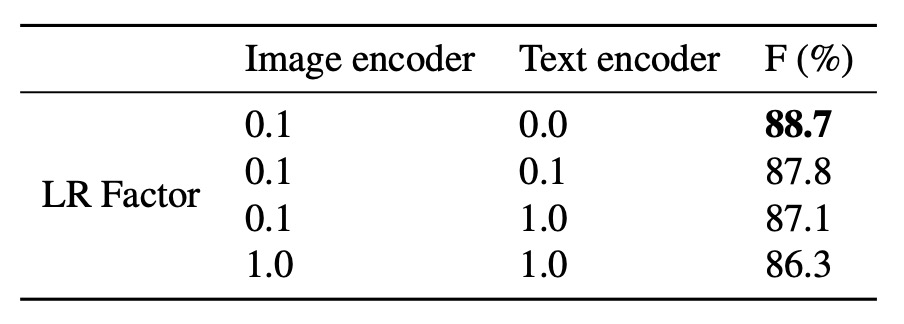
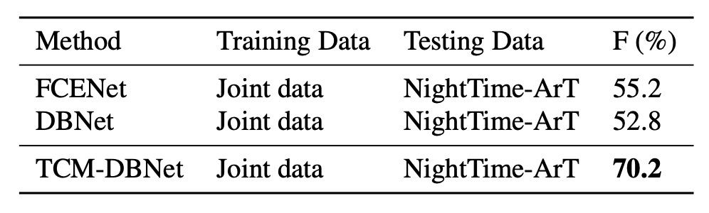
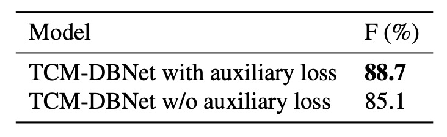

## 幾家歡樂幾家愁

[**Turning a CLIP Model into a Scene Text Detector**](https://arxiv.org/abs/2302.14338)

---

對比學習的足跡，已經在許多領域中留下了深刻的印象。

文字偵測的研究者們，也理所當然地想來共襄盛舉。

## 定義問題

多模態的應用非常熱門，尤其在 CLIP 模型開源之後，那個簡單的概念讓研究者們趨之若鶩。

大家都想方設法地要把預訓練的模型應用在自己的領域上，好搭上最新的潮流。

等一下！你說你還不知道什麼是 CLIP？

:::tip
我們已經讀過了 CLIP，還沒接觸過的讀者可以參考我們之前的文章：

- [**[21.03] CLIP: 打碎次元的屏障**](../../multimodality/2103-clip/index.md)
  :::

### CLIP

這一章節已經重複好幾次了，我們再次簡單介紹一下 CLIP。

下圖就是 CLIP 架構：

假設我們有一組圖像-文字對，其中一對可能是一張狗的圖片和文字「一隻可愛的小狗」。

在一個訓練批次中，CLIP 會接收到多個這樣的對。圖像編碼器可能透過 ResNet 或 ViT 來處理圖像，獲取圖像特徵，而文本編碼器可能透過 Transformer 來處理文本，獲取文字特徵。

然後，模型會比較這些特徵，以確保正確配對的圖像和文字（例如：狗的圖像和「一隻可愛的小狗」的文字）之間的餘弦相似度最大，而錯誤配對的圖像和文字（ 例如：狗的圖像和「一個蘋果」的文字）之間的餘弦相似度最小。

最後，使用 4 億組圖像文本對，進行訓練。

### 多模態神經元

在 CLIP 發表後不久，OpenAI 針對 CLIP 模型進行了一些研究，發現了一些有趣的現象。

:::info
論文原文在這裡：

- [**[21.03] Multimodal Neurons in Artificial Neural Networks**](https://distill.pub/2021/multimodal-neurons/)

這篇文章主要讓人們更了解多模態模型的內心世界，並激發研究者的思考，我們非常推薦讀者閱讀！
:::

在這篇論文中指出 CLIP 的神經元有著專業的分工模式，像是有負責處理情緒的神經元或是處理地理位置的神經元。

跟文字比較相關的是下面這張圖，我們一起來看看：

<figure style={{"width": "90%"}}>

</figure>

最左邊的是原始的圖像輸入，模型對此沒有表現出什麼差錯，都可以正確的認出圖片所對應的內容。

但從第二張圖開始，就有趣了。

後續的輸入中，上面疊加了文字干擾，例如一張「ipad」或「pizza」的文字區塊，然後我們驚訝的發現：

- **模型居然就這樣被帶偏了！**

當有文字出現在圖片中的時候，模型會優先去辨識文字，而不是圖片，這非常反直覺！

:::tip
直覺上，我們認為文字的區塊非常少，僅僅占了圖像的「一點點」像素值，模型應該不會被這麼少的區域影響吧？
:::

### 所以我們應該要？

OpenAI 的研究者們認為這個一個嚴重的問題，因為這表示 CLIP 模型對於文字的敏感度過高，在終端應用中可能會受到有心人的攻擊。

惡意行為可以透過文字的干擾，來影響模型的辨識結果，最後導向錯誤（但對攻擊者有利）的結果。因此對於 OpenAI 來說，他們要克服的問題就是文字攻擊，避免讓文字輕易地影響到最終的圖像辨識結果。

但對於文字偵測的研究者來說：

- **這個不是 Bug 啊，這是 Feature 啊！**

原來 CLIP 是個天生親和文字的模型，這不論是對文字偵測和辨識領域都是天大的好消息！

所以我們不只要用，還要狠狠地用！

## 解決問題

要有效地使用 CLIP 的預訓練知識，在過去的文獻中已經有許多研究，比較著名的是 CoOp。

:::tip
這裡有兩篇連續的論文，不知道 CoOp 的讀者可以參考：

- [**[21.09] CoOp: 搖曳的呢喃**](../../model-tuning/2109-coop/index.md)
- [**[22.03] CoCoOp: 先看過影像再說**](../../model-tuning/2203-cocoop/index.md)

:::

簡單來說，就是把影像輸入 CLIP 的影像分支，得到影像特徵；接著把提示文字輸入 CLIP 的文字分支，得到文字特徵。透過這種方式來轉移 CLIP 的知識，進而應用在文字偵測的任務上。

影像分支沒什麼好動手腳的，因為影像就是影像，不太能做什麼改變；但文字分支就可以大作文章了，剛才提到的知識轉移的任務，就是透過文字分支來完成的。

在剛才提到的 CoCoOp 的研究中，研究者將影像特徵用來產出文字分支的提示，透過自適應的 Prompt learning 的方式來提升文字分支的表現，這個技巧在後續研究中得到廣泛的應用。

在這篇文章中，作者也是基於這個技巧，提出了一個提取 CLIP 知識的模型架構。

### 模型架構

<figure style={{"width": "90%"}}>

</figure>

這個模型的架構作者將其命名為 TCM，看起來有點複雜，我們一步一步來看看：

首先作者使用 CLIP 的預訓練 ResNet50 作為影像編碼器，將輸入影像 $I_0 \in \mathbb{R}^{H \times W \times 3}$ 映射為嵌入向量 $I \in \mathbb{R}^{\tilde{H} \times \tilde{W} \times C}$，其中：

$$
\tilde{H} = \frac{H}{s}, \quad \tilde{W} = \frac{W}{s}, \quad C = 1024, \quad s = 32
$$

公式表示如下：

$$
I = \text{ImageEncoder}(I_0)
$$

:::tip
上述公式只是在描述影像輸入 ResNet 經過五次降採樣的過程，如果這裡的數學描述對你來說有困難，那可能得先了解一下 CNN 的基礎知識。
:::

### 語言提示生成器

就是上圖中的 `Language Prompt Generator`。

在上一步驟中，我們已經得到影像特徵。

接著就是要調動文字分支的知識，這裡基於 CoOp 的啟發，在文字編碼器的輸入中加入可學習提示 $\{c_1, \dots, c_n\}$，用於增強文字嵌入的遷移能力，公式如下：

$$
t_\text{in} = [c_1, \dots, c_n, t_\text{in}^0] \in \mathbb{R}^{(n+1) \times D}
$$

語言提示生成器基於剛才得到的影像特徵 $I$，生成提示 $cc$，公式如下：

$$
cc = \text{LN}(\sigma(\text{LN}(\bar{I})W_1 + b_1))W_2 + b_2 \in \mathbb{R}^D
$$

其中 $W_1 \in \mathbb{R}^{C \times C}, W_2 \in \mathbb{R}^{C \times D}, b_1 \in \mathbb{R}^C, b_2 \in \mathbb{R}^D$。

:::tip
這個數學式的閱讀方式是：

1. 將 $I$ 通過一個線性變換 $W_1$，然後加上偏置 $b_1$，再通過 LN 和 Sigmoid 函數；
2. 再將結果通過另一個線性變換 $W_2$，再加上偏置 $b_2$，最後得到提示 $cc$。
   :::

### 文字編碼器

論文中使用凍結的 CLIP 預訓練文字編碼器，並設置預定義提示為「Text」。

文字編碼器將預設的單類別提示嵌入到連續向量空間，公式如下：

$$
t_\text{in}^0 = \text{WordEmbedding}(\text{Text}) \in \mathbb{R}^D
$$

其中 $D = 512$。

最終結合提示和文字嵌入，得到最終的文字嵌入 $t_\text{out}$：

$$
t_\text{out} = \text{TextEncoder}(t_\text{in}) \in \mathbb{R}^C
$$

### 視覺提示生成器

要看上圖中的 `Visual Prompt` 部分。

這裡使用 Transformer 的交叉注意力機制，學習視覺提示 $\tilde{I}$，傳遞從影像層級到文字實例層級的信息，公式如下：

$$
\tilde{I} = \text{TDec}(Q = I, K = t_\text{out}, V = t_\text{out}) \in \mathbb{R}^{\tilde{H} \times \tilde{W} \times C}
$$

影像嵌入經提示調整為：

$$
\hat{I} = I + \tilde{I}
$$

這個步驟完成後，會得到上圖中的 `Locality Embeddings`。

:::tip
查詢主體是影像特徵 $I$，而鍵和值都是文字特徵 $t_\text{out}$，這樣的設計是為了讓影像特徵能夠「感知」並「融合」到文字的提示。
:::

### 實例-語言匹配

將文字嵌入 $t_\text{out}$ 與調整後的影像嵌入 $\hat{I}$ 進行點積並經 Sigmoid 激活，生成二元分割圖 $P$：

$$
P = \text{sigmoid}\left(\frac{\hat{I} t_\text{out}^\top}{\tau}\right) \in \mathbb{R}^{\tilde{H} \times \tilde{W} \times 1}
$$

分割圖與真值 $y_{ij}$ 的二元交叉熵損失（BCE Loss）為：

$$
L_\text{aux} = \sum_{i=1}^{\tilde{H}} \sum_{j=1}^{\tilde{W}} \left[y_{ij} \log(P_{ij}) + (1-y_{ij}) \log(1-P_{ij})\right]
$$

總損失函數為：

$$
L_\text{total} = L_\text{det} + \lambda L_\text{aux}
$$

其中 $\lambda = 1$，$L_\text{det}$ 為依據檢測方法的損失。

在推理階段，檢測頭的輸出即為最終結果。

### 訓練策略

使用流行的文字檢測方法進行實驗，包括 **DBNet (DB)**、**PAN** 和 **FCENet (FCE)**。為保持設置一致性，檢測器在 **SynthText** 和真實數據集上進行訓練。除非另有說明，骨幹使用 CLIP 的預訓練影像編碼器 ResNet50。

視覺提示生成器包含 3 層 Transformer 解碼器，使用 4 個注意力頭，Transformer 寬度為 256，前饋隱藏層維度設為 1024。檢測頭使用 DBNet、PAN 和 FCENet 的相應檢測頭來預測最終結果。

評估指標使用交集比聯集（IoU）來判斷模型是否正確檢測出文字區域，並計算精度、召回率和 F 值進行比較。為確保公平比較，訓練和測試時，所有數據集中標記為「do not care」或「###」的區域將被忽略。

## 討論

### 與現有方法結合

<figure style={{"width": "80%"}}>

</figure>

作者在一開始就將 TCM 定義為一個插件式的模型，可以與現有的文字檢測方法結合使用。上表是在 IC15、TD 和 CTW 數據集上報告了將 TCM 與三種文字檢測方法結合的結果：

- **F 值提升**：TCM 分別比原始 FCENet、PAN 和 DBNet 在 IC15 數據集上的 F 值高出 +0.9%、+1.7% 和 +1.9%。TD 和 CTW 數據集也有類似的穩定性能提升。
- **推理速度**：在 IC15、TD 和 CTW 數據集上，結合 PAN、FCENet 和 DBNet 的 TCM 分別達到 18 FPS、8.4 FPS 和 10 FPS，保持了檢測器的高效率。

:::tip
我們認為這個推理速度的影響還是很明顯的，論文中說「保持」了高效率，可能過於樂觀了。
:::

### 預訓練 CLIP Backbone

<figure style={{"width": "80%"}}>

</figure>

首先測試僅將 DBNet 的原始骨幹網路替換為 CLIP 的預訓練影像編碼器 ResNet50，以量化骨幹網路對性能的影響。上表中，`CR50` 表示使用 CLIP 的影像分支，而 `R50` 表示使用 DBNet 的原始骨幹網路。

結果顯示，僅使用 CLIP 的原始預訓練模型並不足以充分利用 CLIP 的視覺-語言知識，效果和原本的 DBNet 骨幹網路差異不大。

:::tip
不能無腦用 CLIP。
:::

### 模型組件的有效性

<figure style={{"width": "70%"}}>

</figure>

我們先理解一下上表的各種縮寫意義：

- **BSL**: DBNet Baseline，DBNet 基線。
- **PP**: Predefined Prompt，預定義提示。
- **LP**: Learnable Prompt，可學習提示。
- **LG**: Language Prompt Generator，語言提示生成器。
- **VG**: Visual Prompt Generator，視覺提示生成器。
- **TCM**: 完整的模型配置。

---

使用預定義提示時（上表第二行），性能在四個數據集（IC15、TD、TT、CTW）上均有小幅提升，分別比基線方法高出 0.05%、0.2%、0.04% 和 0.1%。

將可學習提示與預定義提示結合使用時（上表第三行），顯示可學習提示可以帶來一致的性能提升。

:::tip
可學習提示的數量是可以自由設置的，這裡測試了 4, 18, 32 等不同數量的提示，結果顯示提示數量越多，性能越好。
:::

與數量設置為 4 相比，當數量為 32 時，各數據集上的性能顯著提高。這可能是因為更多的可學習提示可以更好地引導預訓練文字編碼器的知識，對文字檢測更有幫助。為了簡化後續實驗，默認可學習提示數量設置為 4。

---

作者也評估了語言提示生成器的性能（上表第七行）。

在語言提示生成器的幫助下，TCM 在四個數據集上的性能進一步提高，尤其是在 ICDAR2015 上的表現，表明語言提示生成器生成的條件線索能夠確保在不同數據集類型上的更好泛化能力。

---

結合視覺提示生成器與其他組件時，F 值在四個數據集上均比基線更高，其中在 IC15 和 TD 數據集上的提升尤為顯著，分別為 1.7% 和 2.0%。

這一明顯的互補現象是由於視覺提示生成器可以從文本特徵中傳播細粒度的視覺語義信息。

此外，視覺提示生成器生成的提示局部影像嵌入能引導模型獲得更準確的文字實例級別視覺表徵，增強了實例-語言匹配能力，並生成有助於下游檢測頭的精確分割圖。

### VG 和 LG 對泛化性能的消融實驗

如果將 TCM 中的視覺提示生成器（VG）和語言提示生成器（LG）移除，會導致泛化性能顯著下降，進一步證明了 VG 和 LG 的有效性。

### 凍結編碼器實驗

<figure style={{"width": "70%"}}>

</figure>

一般來說，使用 CLIP 時，為了保持原本模型的知識，我們會凍結文字編碼器，只訓練影像編碼器。這裡作者對影像編碼器和文字編碼器的學習率因子進行了調整，研究了凍結編碼器質量對性能的影響。

結果顯示，使用較低學習率並凍結文字編碼器可以獲得最佳模型性能。

### 增加訓練數據

為了進一步探討 TCM 是否能學習到僅通過增加數據難以獲得的額外知識，作者進行了以下實驗：

- **訓練數據**：使用包含 IC13、IC15、TD、CTW、TT 和 MLT17 在內的大規模公共數據集（共計 13,784 張影像）訓練模型。
- **測試數據**：在從 ArT 精心收集的夜間數據（326 張影像）上測試模型。夜間樣本示例如下圖所示。
  

實驗結果如下表：

<figure style={{"width": "70%"}}>

</figure>

即使增加了大量訓練數據，現有方法在應對與訓練集分佈明顯不同的夜間數據時仍顯示出局限性。TCM 在此情況下仍表現穩健，展現出不可替代的泛化能力。

### 增加參數量

<figure style={{"width": "70%"}}>

</figure>

為了公平比較，作者增加了 DBNet 的參數量，將骨幹替換為更大的 ResNet，並在 TD500 數據集上進行實驗：

TCM-DBNet 相較於參數量和計算開銷更大的 DBNet，性能更優。該結果表明，TCM 在場景文字檢測任務中具有更高效的性能。

### 輔助損失的影響

<figure style={{"width": "70%"}}>

</figure>

最後作者比較了在 TD500 數據集上使用和不使用輔助損失的結果：

結果顯示使用輔助損失的模型性能更高。輔助損失通過對實例-語言匹配得分圖施加約束，有助於提升模型的訓練效果。

### 跨數據集泛化

<figure style={{"width": "70%"}}>

</figure>

作者測試了 TCM 在不同數據集上的泛化能力，上表是真實數據集之間的遷移實驗結果，顯示 TCM 在不同數據集上的性能均優於基線方法。

## 結論

大家都想用 CLIP 來強化自己的模型，這篇論文就是一個很好的例子。

本文提出了 TCM 方法，可在無需預訓練的情況下，直接從 CLIP 模型中挖掘先驗知識並應用於場景文字檢測，可以說是建立了一個新的文字檢測範式。

雖然在現階段的實驗中，TCM 的性能提升並不是很明顯，但是從跨數據集泛化的實驗結果來看，說明預訓練多模態的模型，可以提供更廣泛的知識，有助於提升模型的泛化能力。

整體來看，TCM 為之後的研究提供了一個很好的思路和探索方向。
