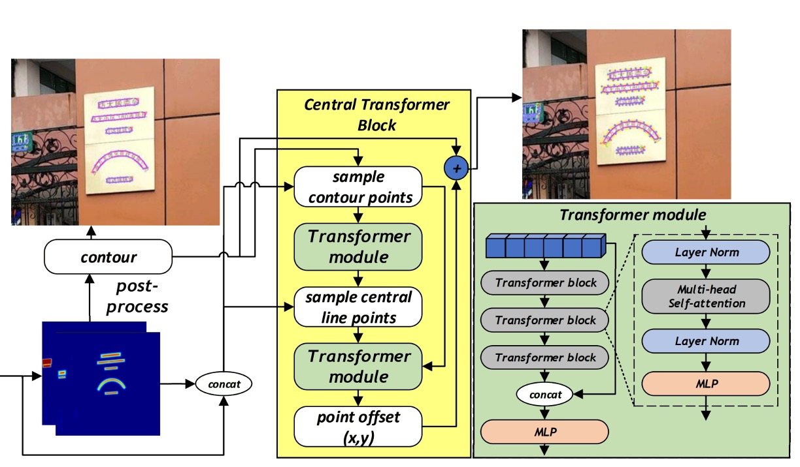
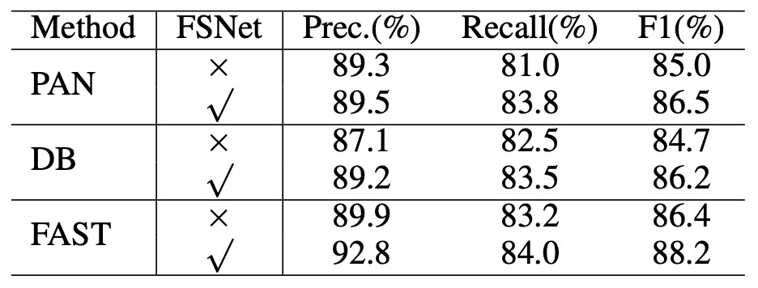
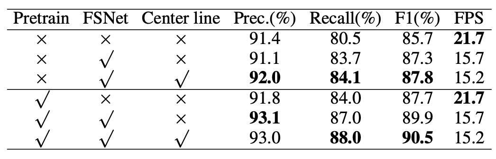
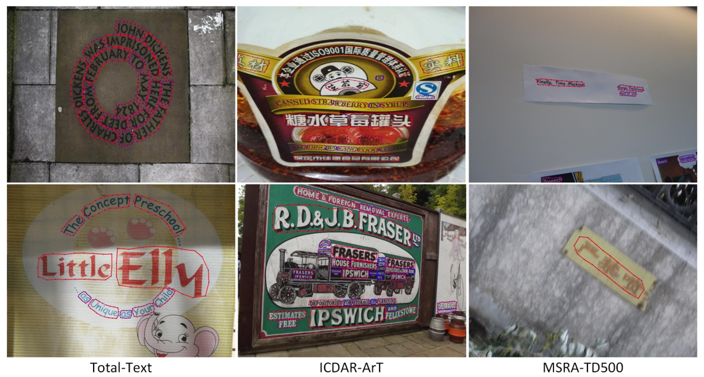

## 多尺度洗牌網路

[**MixNet: Toward Accurate Detection of Challenging Scene Text in the Wild**](https://arxiv.org/abs/2308.12817)

---

隨著驗證資料集表現愈來愈接近飽和，研究者們決勝關鍵就落在最後文字控制點的精準度上。

而背景雜訊，可能是個不得不想辦法解決的問題。

## 定義問題

在自然場景中偵測文本時，文本區塊往往以任意形狀與方向出現，且在小且彎曲的文字實例中，傳統以卷積神經網路為基礎的偵測方法易受到區域性雜訊與影像品質變化的干擾，而無法穩定且精準地擷取文字的全域幾何分佈特性。

作者認為這裡的問題在於現有方法集中處理局部影像特徵，忽略了整體文本幾何分佈的全球資訊，因此在面對小而彎曲的文字、受光照或背景雜訊干擾時，偵測的穩健度明顯降低。

此外，在一些常用的骨幹網路（如 ResNet、VGG、HRNet）中，提供高解析度特徵時，容易受雜訊影響而難以萃取出清晰、易於後續輪廓估測的資訊，特別對小型文字實例特別不友善。

因此，如何「兼顧高低解析度特徵間的互通性」，以減輕高解析度特徵受到雜訊干擾的負面影響，就是作者所要解決的核心問題。

## 解決問題

### 模型架構

<figure style={{"width": "90%"}}>

</figure>

首先要解決特徵互通性的問題，由於多數 CNN 架構過度仰賴局部卷積運算，缺乏有效的跨尺度特徵交流管道，因而難以充分利用低解析度特徵所帶來的雜訊抑制能力。

在這篇論文中，作者直接提出了一個新的網路結構，結合 Backbone 和 Neck 兩個部分，讓高、低解析度特徵彼此交織，共同產生更穩健、精細且能抵抗雜訊干擾的表徵，稱為「Feature Shuffle Network」，簡稱 FSNet。

另外一個部分是基於 FSNet 所產出的特徵，進行下一步的文字實例的控制點細化，這部分稱為「Central Transformer Block」。

我們先看 FSNet 的結構。

### 特徵洗牌網路

<figure style={{"width": "80%"}}>

</figure>

這個結構乍看之下有點複雜，但其實是一個簡單的概念，我們畫個框來看：

- **紅色框的部分**：這裡對應了 Backbone 網路的特徵提取部分，裡面包含了多個階段的降採樣過程。
- **藍色框的部分**：這裡對應了 Neck 網路的特徵提取部分，特徵洗牌的部分在這裡實作。

方法是將每一分辨率的特徵通道切割後，重新混合、上/下採樣，最後再拼接（concatenate）成新的特徵。

透過此種混合與重組，模型能更有效率地汲取各尺度特徵的優勢，產生對小型、彎曲以及低品質文字更具辨識度的特徵，詳細操作如下圖：

<figure style={{"width": "40%"}}>

</figure>

在 FSNet 中，共設計了兩個洗牌層（Shuffle layer），第一個洗牌層接收兩個尺度的輸入特徵，而第二個洗牌層則接收三個尺度的輸入特徵。

以第二個洗牌層為例，假設我們有三組輸入特徵 $F_1, F_2, F_3$ ，其中 $F_i$ 表示第 $i$ 個解析度的特徵。洗牌層將每組特徵的通道數切分成三等份，即 $F_i$ 切分為 $F_{i1}, F_{i2}, F_{i3}$ 三部分。

接下來，根據每一部分所對應的解析度索引，將 $F_{i1}, F_{i2}, F_{i3}$ 分別上採樣或下採樣到統一大小。最後，再將來自不同解析度且經過不同倍率重製的特徵部分拼接為新的特徵表示。

如此一來，原本單一解析度的特徵就被「洗牌」成混合多個解析度訊息的新特徵。

:::tip
很像是之前我們看過的 ShuffleNet：

- [**[17.07] ShuffleNet: 通道洗牌網路**](../../lightweight/1707-shufflenet/index.md)

    

    <figure style={{"width": "80%"}}>
    
    </figure>
    

如果你還有印象，在 ShuffleNet 中，先經過「組卷積」後，對於每個組的特徵圖通道進行洗牌。在這裡的 MixNet 則是改成了對不同解析度的特徵圖進行洗牌，設計理念是非常相似的。
:::

### Central Transformer Block

<figure style={{"width": "70%"}}>

</figure>

我們把剛才的架構圖切割一下，把 CTBlock 的部分拉出來看，簡單梳理一下 CTBlock 的運作流程：

1. **輪廓線控制點（Contour points）**:

   一開始 CTBlock 首先透過 FSNet 所生成的熱力圖（heatmap），取得每個文本實例的粗略邊界。接著，沿著該邊界等距採樣 N 個點（實驗中 N=20）作為文字輪廓代表點。這些點的圖像特徵與對應的熱力圖值一同組成一個特徵序列，並輸入至第一個 Transformer 模組中。

2. **中心線控制點（Central points）**:

   經過第一個 Transformer 模組後，即可得到描述該文字區域之中心線的特徵點序列（中心線的點數量為固定 C=10）。同樣地，這些中心線點對應的圖像特徵與熱力圖將組成另一組特徵序列。

3. **Transformer Encoder-Decoder**:

   CTBlock 中所使用的 Transformer 採用 encoder-decoder 架構，其中 Encoder 包含多層 transformer block，每個 block 內有多頭自注意力機制（multi-head self-attention）與 MLP，使特徵序列能透過全域的注意力機制學習文字輪廓與中心線點的整體幾何分佈。 Decoder 由簡單的 MLP 組成，根據 encoder 所提取的特徵，預測出對每一輪廓點位的頂點偏移量（vertex offset），從而產生更精準的最終文字輪廓。

輪廓線和中心線的對應如下圖：

<figure style={{"width": "90%"}}>

</figure>

:::tip
請注意，這裡的 Transformer 輸出是「Offset」，而不是直接的輪廓點位置，這樣的設計可以讓模型更容易學習到輪廓點的微小變化，並且更容易擴展到不同形狀的文字。

所以在上圖中，你會看到模型輸出還必須和原始的輪廓點進行相加，才能得到最終的輪廓點位置。
:::

### 實作細節

- **Backbone:** FSNet
- **預訓練:** 在 SynthText 數據集上訓練模型 5 個 epochs，使用 Adam 優化器，學習率固定為 0.001
- **微調:** 在 Total-Text、ArT 及其他數據集上訓練模型 600 個 epochs
- **訓練環境:** Python3、PyTorch 1.10.2、RTX-3090 GPU
- **輸入影像大小:** 640 × 640
- **數據增強:** 隨機旋轉（−30° 至 30°）、隨機裁剪、隨機翻轉、顏色抖動（color jittering）

## 討論

### FSNet 的有效性

這篇論文的主軸就是 FSNet，當然得先來看看 FSNet 到底有沒有效果。

<figure style={{"width": "90%"}}>

</figure>

作者首先將文本依尺寸區分為小、中、大三類，並比較 FSNet 與其他常用骨幹網路（例如 ResNet50）在無雜訊資料集下的偵測表現。

結果顯示，FSNet 能在偵測「小型與中型」文本時取得顯著提升。此改進主要歸功於 FSNet 架構中高、低解析度特徵的交換機制，減少了高解析度特徵受雜訊干擾的問題，使得模型更容易捕捉小型文字的輪廓與形狀特徵。

此外，為了驗證 FSNet 對雜訊的抵抗能力，作者在測試資料中加入特定比例的脈衝雜訊（impulse noise），並比較 FSNet 與 ResNet50 在無雜訊、5% 雜訊、10% 雜訊三種情境下的偵測效能。

雖然雜訊使得所有模型的表現都下降，但 FSNet 仍顯示出更好的穩健性。在無雜訊情況下，FSNet 的 F1-score 較 ResNet50 高出 2.1%，而在 5% 與 10% 雜訊比例下，其增幅更達 4.5% 與 6.0%。

最後是通用性的提升，作者將 FSNet 作為骨幹網路套用在已有的文本偵測方法中，包括 DB、PAN 以及 FAST 等架構，結果如下表：

<figure style={{"width": "60%"}}>

</figure>

將這些方法原有的骨幹網路替換為 FSNet 後，DB 與 PAN 的 F1-score 均提升約 1.5%，FAST 則提升約 1.8%。此結果顯示 FSNet 不僅能獨立增進辨識能力，也能作為骨幹網路有效地增強多種現有方法的偵測性能。

:::tip
上面提到的其他網路架構，如果你有興趣的話，可以參考我們之前的文章：

- [**[19.08] PAN: 像素聚合策略**](../1908-pan/index.md)
- [**[19.11] DBNet: 可微分二值化函數**](../1911-dbnet/index.md)
- [**[21.11] FAST: 放箭若流星趕月**](../2111-fast/index.md)
  :::

### 消融實驗

<figure style={{"width": "60%"}}>

</figure>

接著，作者要驗證每個設計的有效性，這裡我們看到了一個消融實驗的結果，這裡使用了 Total-Text 數據集，和 ResNet50 作為基線模型進行比較。

結果顯示，FSNet 能在 F1-score 上取得 2.1% 的提升，而在 CTBlock 中引入中心線特徵後，又進一步提升了 0.5%。

### 與其他方法的比較

<figure style={{"width": "60%"}}>

</figure>

上表是針對多方向文字檢測，MSRA-TD500 數據集的比較結果，可以看到 MixNet 在 F1-score 上取得了 89.4% 的表現，比其他方法提升了 2.1%。證實了該方法在多語言、多方向文字檢測情境下的優異表現。

<figure style={{"width": "60%"}}>

</figure>

再來是針對任意形狀文字檢測，Total-Text 的比較結果，如上表。

MixNet 在 Total-Text 上達到 90.5% 的 F1-score，比 TextFuseNet 提升了 1.5%。

### 可視化結果

<figure style={{"width": "90%"}}>

</figure>

## 結論

本論文提出的 MixNet 架構，以 FSNet 與 CTBlock 模組為核心，僅成功解決了傳統多尺度特徵融合過程中高解析度特徵易受雜訊干擾的問題，同時亦大幅提升對於小型、彎曲及低品質文字的偵測準確度。

實驗結果也證實了 FSNet 可輕易整合至不同架構中，並有效改善其整體偵測性能。

:::tip
這篇論文的實作不算困難，但加入 FSNet 後，推論速度約減慢 30%，我們在應用時仍須考量速度與精度的平衡。
:::
