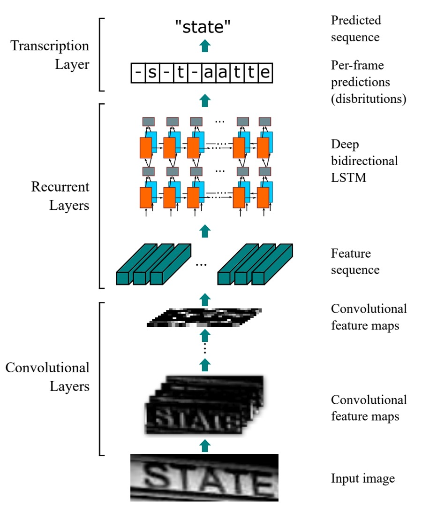

## 我全都要！

[**An End-to-End Trainable Neural Network for Image-based Sequence Recognition and Its Application to Scene Text Recognition**](https://ieeexplore.ieee.org/document/7801919)

---

OCR 是個古老的學科，但在深度學習的推動下，它又變得熱門起來。

## 定義問題

隨著深度學習的普及，OCR（光學字元辨識）領域迎來了新的發展機遇。與傳統的基於手工設計特徵的分類方法相比，基於 CNN（卷積神經網路）的 OCR 方法表現出更高的性能和更強的泛化能力。

這其中最重要的優勢之一是 CNN 能夠自動從圖像中學習特徵，無需人工設計和挑選特徵，這不僅節省了大量的人力成本，還能減少計算資源的消耗。

然而，文字辨識中的一個關鍵問題仍然存在：**如何有效地進行分類**？

對於最後的文字分類，有幾個主流的方法，我們先跟隔壁的 **CHAR** 借一張圖片來看看：

- [**[14.06] Synthetic Data and Artificial Neural Networks for Natural Scene Text Recognition**](https://arxiv.org/abs/1406.2227v4)

  

### 1. 定義詞典

Dictionary Encoding，這是最簡單和直接的方法，也稱為詞典編碼。在這種方法中，系統會先定義一個詞典，這個詞典包含了所有可能的標籤（通常是詞或詞組）。當系統處理一張圖片時，辨識出的文字會被分類到詞典中的某個詞條。簡單來說，模型的任務是從一個預定的詞列表中選擇出最合適的詞。

當圖像中的文字不在詞典中時，這種方法會失效，模型無法辨識出詞典外的內容。這對於處理詞典外的隨機字元串（例如隨機生成的密碼、電話號碼等）來說，效果不佳。

另外，如果需要處理的詞典非常大（例如幾十萬個詞條），系統的效率會受到嚴重影響，且詞典的擴展性較差。

### 2. 字元序列編碼

Character Sequence Encoding，字元序列編碼是另一種常見的分類方法，與詞典編碼不同，它不依賴於一個預定義的詞典，而是將文字直接分類到一個字元序列中。這意味著，系統不需要知道具體的詞，而是依據圖像中的每個字元進行分類，最終構建出一個完整的字元序列來表示圖像中的文字。

字元序列編碼比詞典編碼更具挑戰，因為模型需要學習每個字元的特徵，並能夠準確地將字元組合成完整的序列，這對於模型的能力要求更高。由於字元序列間存在依賴關係，模型需要具備良好的上下文理解能力，否則可能會產生錯誤的字元組合。

### 3. N-gram 編碼

Bag-of-N-gram Encoding，N-gram 編碼是一種折衷的解決方案，它將圖片中的文字分類為 N-gram 序列，這種方法可以理解為一種詞和字元的混合方法。

N-gram 是由 N 個字元組成的序列，N 可以是 2（即 bi-gram），也可以是 3（即 tri-gram），甚至是更長的序列。這種編碼方法不僅能夠辨識單個字元，也能辨識字元組合，從而更好地捕捉上下文信息。

隨著 N 的增加，N-gram 組合的數量會急劇上升，這會導致計算成本增高，特別是在處理長文本序列時，效率可能會降低。對於某些詞彙，N-gram 可能無法準確捕捉到整體詞彙的語義，尤其是在 N 值較小的情況下，辨識的精度可能不如詞典編碼或字元序列編碼。

---

綜合以上，作者希望一個優秀的模型可以滿足幾個訴求：

1. **端到端訓練**：不需要預處理或分步驟操作，直接從圖像中學習特徵。
2. **卷積特徵**：使用從訓練圖像中學習到的卷積特徵，而非手工設計的特徵。
3. **無需字元級標註**：不需要字元級標註來訓練模型，直接從圖像中學習文字序列。
4. **無限制**：不受限於特定詞典，能夠處理任意文字序列。
5. **模型規模小**：模型存儲空間小，運行效率高。

看起來是有點貪心了，我們來看看作者是怎麼做的。

## 解決問題

### 模型架構

<div align="center">
<figure style={{"width": "70%"}}>

</figure>
</div>

CRNN 模型由三個部分組成，我們搭配上圖來看：

### 卷積網路層

從上圖中的最底層開始看，也就是 Convolutional Layers 的部分，這個部分就是我們熟悉的卷積神經網路，用來提取圖像特徵。

這裡假設我們輸入帶有文字的圖片尺寸為 `32x128`，以每個「column」來看，這就是一個長度為 128 的序列，而每個「row」就是一個 3 x 32 維的特徵向量。（假設是 RGB 圖片）

這裡其實有一種選擇是：「直接將原圖送進序列模型」。

但這樣可能會讓模型過於複雜，當序列長度過長時，模型會難以訓練。所以這裡作者選擇先將圖片經過卷積網路提取特徵，再將特徵送進序列模型。

不過使用卷積網路又會遇到另一個問題：模型會丟失大量的序列資訊。

還是用剛才的例子，如果我們輸入帶有文字圖片尺寸是 `32x128`，經過一些常見的 Backbone，大多會經過 5 次降採樣過程，最後的特徵圖尺寸會變成 `1x4`。

這顯然不是我們想要的，可以用來預測的資訊太少了！

所以這裡作者對卷積網路做了一些修改，做法也很簡單：就是將 `MaxPooling` 的操作改一下：原本是 `kernel=2, stride=2`，改成 `kernel=(2, 1), stride=(2, 1)`。

這樣的話，特徵圖的寬度就不會變，只會降低高度，也就是說，當我們輸入 `32x128` 的圖片，經過 5 次降採樣後，特徵圖的尺寸會變成 `1x128`。

:::tip
在實作中，考慮到序列寬度可能過大，作者在論文中的配置是對寬度做 2 次降採樣，對高度做 4 次降採樣。

<div align="center">
<figure style={{"width": "70%"}}>

</figure>
</div>
:::

### 遞歸神經網路層

接著是中間的 Recurrent Layers。

剛才已經把輸入文字圖像轉換成序列資料，接下來就是要將這些資料送進序列模型中，在這裡作者選用 BiLSTM 來處理這個序列。

LSTM 是一種改進的 RNN（循環神經網路），主要改進傳統 RNN 的長期依賴問題。RNN 會隨著時間步長的增加，難以記住之前的資訊，特別是序列中的長距離依賴。LSTM 通過使用「記憶單元」和「門機制」（如輸入門、遺忘門和輸出門）來控制資訊的流動，從而在長時間的序列中保持重要資訊並丟棄不重要的內容，這使得它能夠更好地處理長序列數據。

BiLSTM 結合了 LSTM 和雙向網路的優點。它使用兩個 LSTM 層來處理數據，一個從前向後（從序列的頭到尾）處理，另一個則從後向前（從序列的尾到頭）處理。這樣每個時間步的信息都包含了來自兩個方向的上下文。對於像語言模型、語音辨識或機器翻譯等任務，BiLSTM 能夠更好地捕捉整體的語境，從而提高模型的預測準確性。

<div align="center">
<figure style={{"width": "70%"}}>

</figure>
</div>

回到剛才的問題，經過圖像 CNN 提取特徵後，這個序列的長度就是圖片的寬度，每個時序點可以視為對應原圖中的一個區塊（如下圖），每個時序點的「感受野」取決於卷積網路的設計。

<div align="center">
<figure style={{"width": "50%"}}>

</figure>
</div>

把上面的特徵序列送進 BiLSTM，就可以得到一個更高級的特徵表示，這樣就可以用來預測圖片中的文字了。

### 未對齊的序列標註

也就是上圖的 Transcription Layer。

如同我們一開始講的，字元級的標註是一個很費力的工作。

因此為了解決字元對齊序列的問題，在本文中，作者引入 CTC（Connectionist Temporal Classification）技術來預測文字序列。

- [**[06.06] Connectionist temporal classification: labelling unsegmented sequence data with recurrent neural networks**](https://dl.acm.org/doi/abs/10.1145/1143844.1143891)

CTC 是一種專門用來處理未對齊的序列標註問題的技術，它針對逐幀預測 $y = \{y_1, ..., y_T\}$ 條件下的標籤序列 $l$，忽略每個標籤所在的位置，這使得它特別適合應用於語音辨識、手寫文字辨識等序列數據。

與傳統的序列模型不同，CTC 不需要準確對應每個時間步與具體的字元位置，這大大簡化了訓練過程。

假定輸入為序列 $y = \{y_1, ..., y_T\}$，其中 $T$ 為序列長度。每個 $y_t \in \mathbb{R}^{|L'|}$ 是標籤集合 $L' = L \cup \{\text{blank}\}$ 上的機率分佈，$L$ 包含任務中的所有標籤（如英文字母），而 "blank" 表示空白標籤。這個「空白標籤」用來表示某個時間步不輸出字元，這對於處理不規則的序列長度很有用。

由於模型的逐幀預測可能會在多個時間步上預測出相同的字元或者空白標籤，CTC 使用一個映射函數 $B$ 來將這些冗餘部分移除，得到最終的標籤序列。具體操作是先移除重複的字元，然後移除 `blank` 標籤。

例如，模型對單詞 "hello" 的逐幀輸出可能是這樣的：

```
--hh-e-l-ll-oo--
```

在這裡，`-` 代表 `blank` 標籤，重複的字元會被合併，而 `blank` 會被移除。經過映射函數 $B$ 的處理後，這個序列會變為：

```
hello
```

CTC 的特點在於，它能夠處理這些冗餘信息，並將輸出序列映射為更簡短的標籤序列。

在 CTC 中，對於給定的逐幀預測 $y = \{y_1, ..., y_T\}$，我們想計算某個標籤序列 $l$ 的條件機率。由於存在許多不同的逐幀序列 $\pi$ 可以被映射到同一個標籤序列 $l$，CTC 通過將所有這些可能的 $\pi$ 的機率相加來得到最終的標籤序列 $l$ 的機率：

$$
p(l | y) = \sum_{\pi : B(\pi) = l} p(\pi | y),
$$

其中每個逐幀序列 $\pi$ 的機率定義為：

$$
p(\pi | y) = \prod_{t=1}^{T} y^t_{\pi_t},
$$

這表示在每個時間步 $t$，模型輸出為標籤 $\pi_t$ 的機率。

:::tip
為了幫助理解，我們舉一個處理 "cat" 這個單詞的例子。

假設輸入是一段語音，模型每個時間步的預測結果如下表：

| 時間步 | c   | a   | t   | blank |
| ------ | --- | --- | --- | ----- |
| 1      | 0.6 | 0.1 | 0.1 | 0.2   |
| 2      | 0.1 | 0.7 | 0.1 | 0.1   |
| 3      | 0.1 | 0.2 | 0.6 | 0.1   |
| 4      | 0.2 | 0.2 | 0.2 | 0.4   |

在每個時間步，模型會對每個標籤（包括空白標籤 `blank`）做出機率預測。例如，第一個時間步對應的是標籤 `c` 的機率較高，第四個時間步的 `blank` 機率較高。

在這種情況下，可能有多種不同的逐幀預測序列可以映射到最終的標籤序列 "cat"，比如：

- 序列 $\text{c--a-t}$ 可以映射到 "cat"；
- 序列 $\text{-c-a--t}$ 也可以映射到 "cat"。

CTC 會將所有可能的逐幀預測序列的機率相加，最終得到標籤序列 "cat" 的總機率。訓練過程中，模型的目標是最小化正確標籤序列 "cat" 的負對數似然，這樣隨著訓練的進行，模型將更傾向於輸出更準確的逐幀預測。

透過這樣的方式，CTC 可以在不明確標記每個時間步所對應字元的情況下，依然能夠有效地學習並預測正確的標籤序列。
:::

### 訓練策略

作者使用 Jaderberg 等人釋出的合成數據集作為場景文字辨識的訓練數據：

- [**Text Recognition Data**](https://www.robots.ox.ac.uk/~vgg/data/text/)：該資料集包含 800 萬張訓練圖像及其對應的標註文字。這些圖像由合成引擎生成，逼真度很高。

模型僅用此合成數據訓練一次，並直接在所有真實世界測試資料集上進行測試，無需對這些資料集進行微調。

網路配置細節如下：

- 卷積層的架構基於 VGG 架構，並進行了調整以適應英文字辨識。
- 在第 3 和第 4 個最大池化層中，採用了 $w=1, h=2$ 的長方形池化視窗，而不是傳統的正方形視窗。
- 在第 5 和第 6 個卷積層後分別插入了兩個批量正規化層，這顯著加速了訓練過程。
- 使用 ADADELTA 演算法進行訓練，並將參數 $\rho$ 設定為 0.9。訓練時，所有圖像被縮放至 $100 \times 32$ 以加速訓練過程。
- 測試圖像的高度縮放至 32，寬度則與高度按比例縮放，但至少為 100 像素。

### 評估指標

作者使用了四個常用的場景文字辨識基準數據集來評估模型的性能，分別是：

1. **ICDAR 2003 (IC03)**

   - 測試集包含 251 張場景圖像，這些圖像中帶有標記的文字邊界框。
   - 為了與先前的工作進行公平比較，通常會忽略包含非字母數字字符或少於三個字符的文字圖像。經過過濾後，最終得到 860 張裁剪的文字圖像作為測試集。
   - 每張測試圖像都配有一個包含 50 個單詞的詞彙表（詞典）。此外，還有一個**完整詞典**，是將所有圖像的詞彙表合併而成，用於評估。

2. **ICDAR 2013 (IC13)**

   - 測試集繼承並修正了 IC03 的部分數據，最終包含 1,015 張裁剪的文字圖像，並提供了精確的標註。
   - 與 IC03 不同，IC13 沒有提供詞彙表，因此評估時不使用詞典輔助（即無詞典設定）。

3. **IIIT 5K-Word (IIIT5k)**

   - 測試集包含 3,000 張從網路上收集的裁剪文字圖像，涵蓋了更廣泛的字體和語言變化。
   - 每張圖像都附帶了兩個詞彙表：一個包含 50 個單詞的小詞典和一個包含 1,000 個單詞的大詞典，用於詞典輔助的評估。

4. **Street View Text (SVT)**

   - 測試集由 249 張來自 Google 街景的場景圖像組成，從中裁剪出 647 張文字圖像。
   - 每個文字圖像都配有一個包含 50 個單詞的詞彙表，用於詞典輔助的評估。

## 討論

### 模型多方位比較

<div align="center">
<figure style={{"width": "70%"}}>

</figure>
</div>

為了更全面地展示 CRNN 相對於其他方法的優勢，作者提供了上述表格：

- **E2E Train**：是否支持端到端訓練，不需要預處理或分步驟操作。
- **Conv Ftrs**：是否使用從訓練圖像中學習到的卷積特徵，而非手工設計的特徵。
- **CharGT-Free**：是否需要字元級標註來訓練模型。
- **Unconstrained**：是否受限於特定詞典，無法處理詞典外的單詞或隨機序列。
- **Model Size**：模型的存儲空間大小。

從表格看來，CRNN 在多個方面都具有優勢，例如它支持端到端訓練、不需要字元級標註、不受限於特定詞典、模型規模小等。

### 與過去方法比較


上表展示了 CRNN 模型在四個公共數據集上的辨識準確率，並與最新的深度學習模型進行了比較。

在受限詞典（constrained lexicon）情況下，CRNN 在大多數基準上優於其他方法，並且平均超越了中提出的最佳文字辨識模型。在 IIIT5k 和 SVT 數據集上表現尤為突出。

CRNN 不依賴於預定的詞典，因此它可以辨識隨機字元串（例如電話號碼）、句子以及其他類型的文字（如中文），這使得 CRNN 在所有測試數據集上均表現出競爭力。

在無詞典（unconstrained lexicon）情況下，CRNN 在 SVT 數據集上取得最佳表現。

:::tip
這個時候的論文都還習慣用作者名稱來陳列表格，非常不方便查找，有興趣的讀者可以自行查閱原文。
:::

### 廣義拓展

<div align="center">
<figure style={{"width": "70%"}}>

</figure>
</div>

誰說只有文字才有 OCR？

CRNN 不僅可以用於文字辨識，還可以應用於其他領域，例如光學音樂辨識問題（OMR）。

以往的 OMR 方法通常需要圖像預處理（如二值化）、五線譜檢測和單獨的音符辨識。作者將 OMR 轉化為序列辨識問題，使用 CRNN 直接從圖像預測音符序列。

- **為簡化起見，這裡僅辨識音高，忽略和弦，並假設所有樂譜均為 C 大調。**

為了準備 CRNN 所需的訓練數據，作者收集了 2650 張來自 musescore 網站的圖像：

- [**https://musescore.com/sheetmusic**](https://musescore.com/sheetmusic)

每張圖像包含 3 到 20 個音符片段，且手動標註了這些圖像中的音高序列，並使用旋轉、縮放、添加噪聲等數據增強技術，將訓練樣本擴充至 265k 張。

為了進行比較，作者評估了兩個商業 OMR 引擎：[**Capella Scan**](https://www.capella-software.com/us/index.cfm/products/capella-scan/info-capella-scan/) 和 [**PhotoScore**](https://www.avid.com/sibelius)。


如上表，CRNN 在所有數據集上均顯著優於這兩個商業系統。

Capella Scan 和 PhotoScore 系統在 「Clean」 數據集上的表現相對較好，但在合成數據和真實世界數據上的表現顯著下降。

主要原因是這些系統依賴於強健的二值化來檢測五線譜和音符，而在合成數據和真實場景中，由於光照條件不佳、噪聲干擾和背景雜亂，二值化步驟經常失敗。相比之下，CRNN 使用的卷積特徵對噪聲和變形具有高度穩健性。

此外，CRNN 的循環層可以利用樂譜中的上下文信息，每個音符的辨識不僅依賴於它本身，還可以參考鄰近的音符。例如，透過比較音符的垂直位置，某些音符可以被更準確地辨識。

## 結論

我們再回頭看一下一開始作者的訴求：

1. **端到端訓練**：不需要預處理或分步驟操作，直接從圖像中學習特徵。
2. **卷積特徵**：使用從訓練圖像中學習到的卷積特徵，而非手工設計的特徵。
3. **無需字元級標註**：不需要字元級標註來訓練模型，直接從圖像中學習文字序列。
4. **無限制**：不受限於特定詞典，能夠處理任意文字序列。
5. **模型規模小**：模型存儲空間小，運行效率高。

這些 CRNN 都辦到了，如此經典的作品，每個做 OCR 的人都值得一讀。
