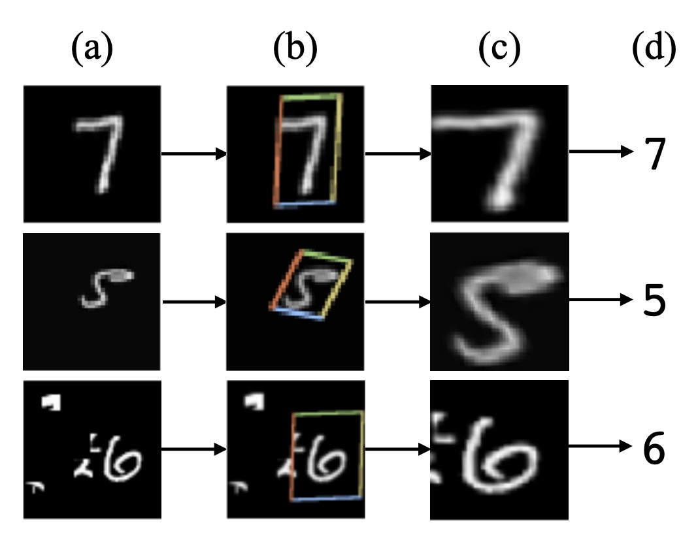
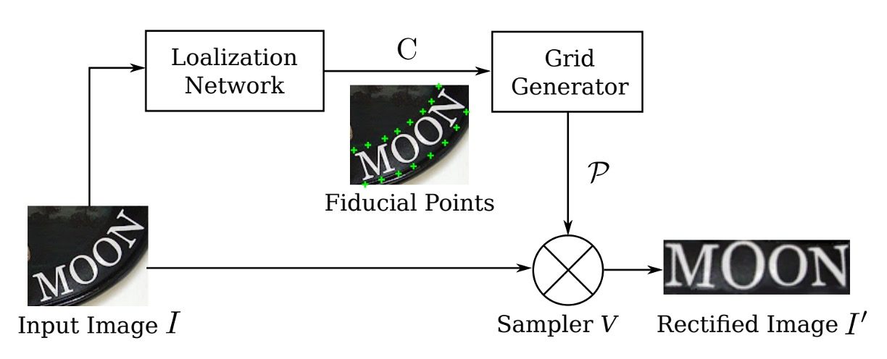
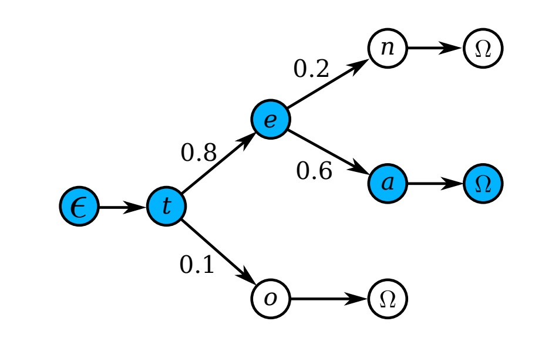
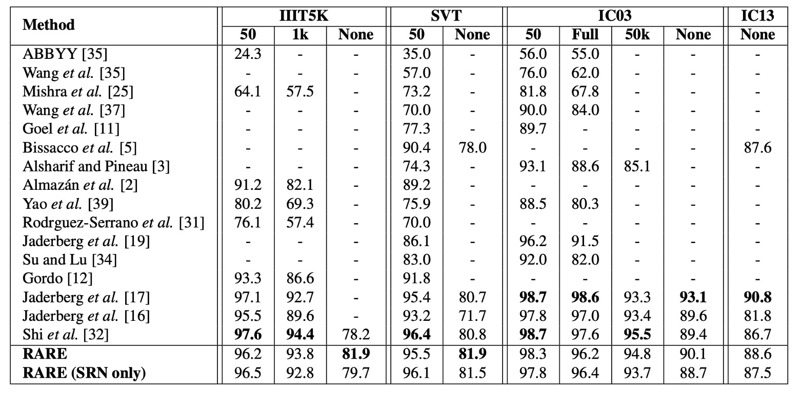

## 全自動校正

[**Robust Scene Text Recognition with Automatic Rectification**](https://openaccess.thecvf.com/content_cvpr_2016/papers/Shi_Robust_Scene_Text_CVPR_2016_paper.pdf)

---

CRNN 提出後解決了大部分的問題，但對於不規則的文字辨識仍然力有未逮。

## 定義問題

自然場景中的文字辨識遠比印刷文字困難得多。在辨識階段的文字常會有劇烈地變形、扭曲、遮蔽、模糊等問題。

而作者在這篇文章中，主要想解決的是變形和扭曲的問題。仔細回想一下，前一陣子不是有一個有名的 STN 的模型嗎？

- [**[15.06] Spatial Transformer Networks**](https://arxiv.org/abs/1506.02025)

    

    <figure style={{ "width": "50%"}}>
    
    </figure>
    

或許我們可以設計一個具有自動校正功能的模型？

## 解決問題

### 空間轉換網路

為了緩解不規則文字的辨識問題，自動校正功能要放在辨識模組的前面。

這裡作者引入空間變換網路（Spatial Transformer Network, STN）來校正輸入影像。

STN 的主要目的是將輸入影像 $I$ 轉換為校正後的影像 $I'$，並透過預測的 TPS（Thin Plate Spline）轉換進行校正。該網路會透過一個定位網路（Localization Network）預測一組基準點，然後利用這些基準點計算 TPS 轉換參數，生成影像上的取樣網格，最後利用取樣網格來從輸入影像生成校正後的影像 $I'$。

### 定位網路

定位網路負責定位 $K$ 個基準點，其輸出是這些基準點的 $x$、$y$ 座標，記作：

$$
C = [c_1, \dots, c_K] \in \mathbb{R}^{2 \times K}, c_k = [x_k, y_k]^\top
$$

座標系統的中心點設在影像中央，座標值範圍在 $[-1, 1]$。

該網路使用卷積神經網路進行迴歸學習座標位置，輸出層包含 $2K$ 個節點，並使用 tanh 作為激活函數以確保輸出值落在 $(-1, 1)$ 範圍內。

網路的訓練由 STN 的其他部分反向傳播的梯度完全監督，不需要人工標註基準點座標。

### 網格生成器

作者先定義一組「基本」基準點，如上圖，然後通過定位網路預測的基準點 $C$ 來調整這些基本基準點，得到新的基準點 $C^\prime$。

網格生成器估計 TPS 變換參數，並產生採樣網格，這裡的 TPS 轉換的參數由一個矩陣 $T \in \mathbb{R}^{2 \times (K+3)}$ 表示，該矩陣的計算公式為：

$$
T = \left( \Delta_{C^\prime}^{-1}
\begin{bmatrix}
C^\top \\
0^{3 \times 2}
\end{bmatrix}
\right)^\top
$$

其中 $\Delta_{C^\prime} \in \mathbb{R}^{(K+3) \times (K+3)}$ 是一個由基準點 $C^\prime$ 決定的矩陣，因此它是一個常數矩陣。

$\Delta_{C^\prime}$的具體形式為：

$$
\Delta_{C^\prime} =
\begin{bmatrix}
1 & (C^\prime)^{\top} & R \\
0 & 0 & 1^{1 \times K} \\
0 & 0 & C^\prime
\end{bmatrix}
$$

其中 $R$ 矩陣的第 $i$ 行第 $j$ 列的元素 $r_{i,j}$ 定義為：

$$
r_{i,j} = d_{i,j}^2 \ln d_{i,j}^2,
$$

而 $d_{i,j}$ 則表示第 $i$ 個和第 $j$ 個基準點 $c^\prime_i$ 與 $c^\prime_j$ 之間的歐幾里得距離。

校正後的影像 $I'$ 上的像素網格表示為 $P' = \{p'_i\}_{i=1, \dots, N}$，其中 $p'_i = [x'_i, y'_i]^{\top}$ 為第 $i$ 個像素的 $x$、$y$ 座標，$N$ 是影像中的像素數。

對於每個在 $I'$ 上的像素點 $p'_i$，可以通過以下的轉換找到對應於輸入影像 $I$ 上的像素點 $p_i = [x_i, y_i]^{\top}$：

1. 首先計算 $p'_i$ 與基準點的距離：

   $$
   r'_{i,k} = d_{i,k}^2 \ln d_{i,k}^2,
   $$

   其中 $d_{i,k}$ 是 $p'_i$ 與第 $k$ 個基準點 $c^\prime_k$ 的歐幾里得距離。

2. 然後構造增廣向量 $\hat{p}'_i$：

   $$
   \hat{p}'_i = \left[ 1, x'_i, y'_i, r'_{i,1}, \dots, r'_{i,K} \right]^{\top}.
   $$

3. 最後，通過以下矩陣運算將其轉換為輸入影像上的點 $p_i$：

   $$
   p_i = T \hat{p}'_i.
   $$

通過對校正影像 $I'$ 中的所有像素點進行以上運算，可以生成一個輸入影像$I$上的像素網格 $P = \{p_i\}_{i=1, \dots, N}$。

由於矩陣 $T$ 的計算以及點 $p_i$ 的轉換都是可微分的，因此網格生成器能夠反向傳播梯度，用於模型的訓練。

:::tip
上面這段是論文的原話，如果你看不懂，那我們扔掉所有數學：

假設我們有一張不規則的影像（可能是因為拍攝角度或其他原因導致的扭曲），我們想把它「拉平」或「校正」，讓影像中的內容變得規整，以便後續的辨識工作更容易進行。

首先，我們在影像上選定一些「基準點」，這些點可以被視作影像中重要的參考位置，像是角落或邊緣。接著，我們計算這些基準點之間的關係，這裡用了「歐幾里得距離」。根據這些距離，我們可以推導出影像中每一個像素點應該如何移動或調整，才能讓整個影像變得平整。

這個「拉平」過程中，我們不只是隨便地移動影像中的每一個點，而是有一套規則和計算方法來確保校正後的影像仍然保持整體一致性和自然感。

這就是上面提到的矩陣 $T$ 和那些距離公式在做的事情。
:::

### 取樣器

取樣器（Sampler）透過雙線性插值從輸入影像的像素值生成校正後的影像 $I'$。

校正後影像 $I'$ 中的每個像素 $p'_i$ 的值是從輸入影像 $I$ 中相應的 $p_i$ 附近的像素進行雙線性插值計算得到的。

這一過程同樣是可微分的，允許整個模型的誤差，取樣後的結果像下圖這樣：

<figure style={{ "width": "70%"}}>

</figure>

### 編碼器-解碼器

<figure style={{ "width": "70%"}}>

</figure>

完成影像的自動校正後，接著就回到我們熟悉的辨識流程了。

首先是編碼器（Encoder），這裡使用的是 CRNN 模型，就是使用一個 Backbone 網路將輸入影像轉換成序列特徵，接著輸入 BiLSTM 網路進行時序建模。

接著是解碼器（Decoder），在原本 CRNN 模型中，使用 CTC 演算法進行文字解碼，在這篇論文中作者換了一個比較簡單的方法：使用 GRU 進行解碼。

:::tip
GRU 和 LSTM 是類似的架構，參數量相對較少，因此訓練速度會快一些。
:::

解碼器的部分，作者在解碼時搭配了注意力機制，在每個時間步驟 $t$，解碼器會計算出一個注意力權重向量 $\alpha_t \in \mathbb{R}^L$，其中 $L$ 是輸入序列的長度。

注意力權重的計算公式如下：

$$
\alpha_t = \text{Attend}(s_{t-1}, \alpha_{t-1}, h)
$$

其中：

- $s_{t-1}$ 是上一時間步 GRU 單元的隱狀態。
- $\alpha_{t-1}$ 是上一時間步的注意力權重向量。
- $h$ 是編碼器對輸入序列的表示。

此 Attend 函數根據解碼器的上一隱狀態 $s_{t-1}$ 和先前的注意力權重 $\alpha_{t-1}$，來計算當前的注意力權重向量 $\alpha_t$。這個向量的每個元素都是非負數，且所有元素的總和等於 1，代表了輸入序列中每個元素對當前解碼步驟的重要性。

計算出 $\alpha_t$ 後，模型會生成一個稱為 Glimpse 向量的 $g_t$，這個向量是對輸入序列的編碼表示 $h$ 的加權總和。

其計算公式為：

$$
g_t = \sum_{i=1}^{L} \alpha_{ti} h_i
$$

其中：

- $\alpha_{ti}$ 是注意力權重向量 $\alpha_t$ 的第 $i$ 個元素。
- $h_i$ 是輸入序列中第 $i$ 個元素的編碼表示。

Glimpse 向量 $g_t$ 是輸入序列中模型當前關注部分的加權總和。

由於 $\alpha_t$ 是一個機率分佈（所有元素為非負數，且總和為 1），因此 $g_t$ 是輸入序列特徵的加權組合，使解碼器能夠根據當前解碼步驟，聚焦於輸入序列中的不同部分。

在計算出 Glimpse 向量 $g_t$ 後，解碼器會利用 GRU 的遞迴公式來更新隱狀態 $s_t$：

$$
s_t = \text{GRU}(l_{t-1}, g_t, s_{t-1})
$$

其中：

- $l_{t-1}$ 是上一時間步的標籤。
- 在訓練過程中，這是實際的標籤。
- 在測試過程中，這是上一時間步預測出的標籤 $\hat{l}_{t-1}$。
- $g_t$ 是由注意力機制計算出的 Glimpse 向量，表示模型當前關注的輸入信息。
- $s_{t-1}$ 是 GRU 在上一時間步的隱狀態。

GRU 單元會根據前一步的標籤 $l_{t-1}$、當前的 Glimpse 向量 $g_t$，以及前一步的隱狀態 $s_{t-1}$ 來更新當前的隱狀態 $s_t$，從而編碼當前步驟的輸出與輸入信息的關聯。

在每個時間步驟中，解碼器會根據更新後的隱狀態 $s_t$ 來預測下一個輸出字元。輸出 $\hat{y}_t$ 是一個對所有可能字元的機率分佈，其中包含一個特殊的「序列結束」符號（EOS），當模型預測到 EOS 時，序列生成過程即告結束。

### 字典輔助辨識

最後的輸出結果可能會有一些錯誤，這裡作者使用了一個字典來幫助辨識，在最後作者會比較有使用字典和沒有使用字典的效果。

當測試影像與一個字典相關聯時，模型會選擇條件後驗概率最高的詞：

$$
l^* = \arg \max_l \log \prod_{t=1}^{|l|} p(l_t | I; \theta).
$$

當字典非常大時（例如包含 50k 以上詞彙的 Hunspell 字典），逐一檢查所有詞的計算成本很高，因此作者採用了前綴樹來進行高效的近似搜索，如下圖：

<figure style={{ "width": "70%"}}>

</figure>

每個節點代表一個字元，從根節點到葉節點的路徑表示一個詞。

測試時，從根節點開始，每一步根據模型輸出的分佈選擇後驗概率最高的子節點，直到達到葉節點，對應的路徑就是預測詞。

由於樹的深度是字典中最長詞的長度，這種方法比逐一搜尋的計算量要小得多。

### 模型訓練

作者使用 Jaderberg 等人釋出的合成數據集作為場景文字辨識的訓練數據：

- [**Text Recognition Data**](https://www.robots.ox.ac.uk/~vgg/data/text/)：該資料集包含 800 萬張訓練圖像及其對應的標註文字。這些圖像由合成引擎生成，逼真度很高。

除此之外，沒有使用其他額外數據。

訓練批次大小設為 64，影像尺寸在訓練和測試中都調整為 $100 \times 32$。STN 的輸出大小也是$100 \times 32$。模型訓練速度約為每秒處理 160 個樣本，經過 3 個訓練週期後，在 2 天內收斂。

### 評估指標

作者使用了四個常用的場景文字辨識基準數據集來評估模型的性能，分別是：

1. **ICDAR 2003 (IC03)**

   - 測試集包含 251 張場景圖像，這些圖像中帶有標記的文字邊界框。
   - 為了與先前的工作進行公平比較，通常會忽略包含非字母數字字元或少於三個字元的文字圖像。經過過濾後，最終得到 860 張裁剪的文字圖像作為測試集。
   - 每張測試圖像都配有一個包含 50 個單詞的詞彙表（詞典）。此外，還有一個**完整詞典**，是將所有圖像的詞彙表合併而成，用於評估。

2. **ICDAR 2013 (IC13)**

   - 測試集繼承並修正了 IC03 的部分數據，最終包含 1,015 張裁剪的文字圖像，並提供了精確的標註。
   - 與 IC03 不同，IC13 沒有提供詞彙表，因此評估時不使用詞典輔助（即無詞典設定）。

3. **IIIT 5K-Word (IIIT5k)**

   - 測試集包含 3,000 張從網路上收集的裁剪文字圖像，涵蓋了更廣泛的字體和語言變化。
   - 每張圖像都附帶了兩個詞彙表：一個包含 50 個單詞的小詞典和一個包含 1,000 個單詞的大詞典，用於詞典輔助的評估。

4. **Street View Text (SVT)**

   - 測試集由 249 張來自 Google 街景的場景圖像組成，從中裁剪出 647 張文字圖像。
   - 每個文字圖像都配有一個包含 50 個單詞的詞彙表，用於詞典輔助的評估。

## 討論

### 與其他方法比較

上表顯示了模型在各基準數據集上的結果，並與其他方法進行比較，在「無詞典輔助」的辨識任務中，模型的表現優於所有對比方法。

在 IIIT5K 數據集上，RARE 比 CRNN【32】提升了近 4 個百分點，顯示了顯著的性能改進。這是因為 IIIT5K 包含大量不規則文本，特別是曲線文字，而 RARE 在處理不規則文本方面具有優勢。

儘管在部分數據集上模型落後於【17】的模型，RARE 能夠辨識隨機字串（如電話號碼），而【17】的模型只能辨識其 90k 字典內的單詞。

在有詞典輔助的辨識任務中，RARE 在 IIIT5K、SVT 和 IC03 數據集上達到了與【17】相當的準確率，並且僅稍微低於 CRNN，這表明 RARE 在有詞典輔助的情況下同樣具有很強的競爭力。

:::tip
在那個時候的論文還不流行給自己的理論或方法取名字，因此我們常會看見這種以作者名字為代號的命名方式，例如上表中的【17】就是指代 Jaderberg 等人的論文：

- [**[14.12] Reading text in the wild with convolutional neural networks**](https://arxiv.org/abs/1412.1842)
  :::

## 結論

這篇論文主要解決了不規則文字辨識的問題，通過引入一個可微分的空間變換網路（STN）模組，來自動校正不規則文字，實現端到端的訓練，並在多個基準數據集上取得了不錯的效果。

作者也在實驗中指出模型在「特別彎曲」的文字上表現不佳，原因可能是因為在訓練資料中缺少對應的資料樣態，這也是未來可以改進的方向。

<figure style={{ "width": "70%"}}>

</figure>

:::tip
大概在 2020 年左右，我們有嘗試過部署這個模型，但在轉換 ONNX 的過程中遇到諸多困難，主要是當時 ONNX 不支援 `grid_sample` 或 `affine_grid_generator` 這些操作。

後來我們就沒有再關心這個模型了，如果你有部署成功的經驗，歡迎分享給我們。
:::
