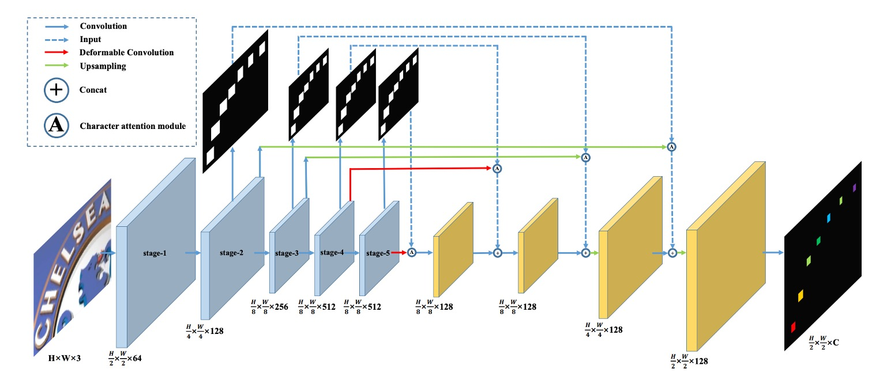

## 引入新的維度

[**Scene Text Recognition from Two-Dimensional Perspective**](https://cdn.aaai.org/ojs/4895/4895-13-7961-1-10-20190709.pdf)

---

CRNN 和後續的改進研究在場景文字辨識領域在近幾年佔據了主導地位，想要創新並不容易。

這篇論文的作者選擇撇開過去的研究，從二維的角度重新思考場景文字辨識的問題。

## 定義問題

過去的研究，像是 CRNN 等，都選擇把輸入影像壓縮成一維的時序資料，這樣的做法在規則文字的辨識上效果不錯，但對於高度彎曲的文字則是存在一定的困難。

如上圖，在左圖 (a) 中是一張包含了高度彎曲文字的影像，如果我們把圖像壓縮成一維的時序資料，你可以觀察到每個時序會引入大量的背景雜訊（因為文字彎曲的關係），這樣的背景雜訊會對文字辨識造成干擾。

此外，由於文字彎曲，每個時序（Column）可能會同時涵蓋多個文字，這樣表示模型必須從疊加的文字特徵中找出正確的文字，這顯然不是一件容易的事。

作者認為，將影像壓縮成一維時序資料的做法，對於高度彎曲的文字辨識並不適用，因此提出了一個新的方法：

- **將影像保持二維的形式，並在二維的空間中進行文字辨識。**

引入新的維度還帶來更多的好處：就是不需要考慮時序的資訊了！

我們可以完成使用卷積網路來完成整個辨識過程。

## 解決問題

### 模型架構

作者提出的模型架構如上圖。

這裡引入 FCN 的概念，利用全卷積網路的概念，我們可以預先定義幾個文字類別，模型會對輸入影像的每個像素點進行分類，這樣一來，就將文字辨識的問題轉換成一個「像素級的分類問題」。

上圖中的「藍色」區塊，作者選用 VGG 作為 Backbone，取出 1/2, 1/4, 1/8 的特徵圖。

跟著「藍色」區塊向上看，這些特徵圖用來預測文字區域圖，每個解析度都會有對應的預測結果，這個分支會在訓練時進行監督。

得到預測結果後，就是「文字區域注意力」圖，接著作者把這張圖乘上原始的特徵圖，就能得到「加權後」的文字區域特徵。

加權的算法為：

$$
F_o = F_i \otimes (1 + A)
$$

這裡的 $F_o$ 是加權後的特徵圖，$F_i$ 是原始的特徵圖，$A$ 是文字區域注意力圖。

這些特徵圖一路進行上採樣，最後輸出 C 個通道的文字特徵圖。

這裡的 C 個通道，就是我們預先定義的文字類別數量。

:::tip
上圖中的紅色線條表示這裡使用「可變形卷積」取代了原本的卷積操作，作者預期這樣可以更好地捕捉文字的特徵。

下圖中，左圖是一般卷積的感受野，右圖是可變形卷積的感受野，可以看到可變形卷積的感受野有更大的彈性，能夠更精確的鎖定文字特徵。

:::

### 訓練資料設計

製作訓練資料分為幾個步驟，作者首先準備帶有「字元級」標註的訓練資料，然後根據這些標註繪製成文字區域二值圖，也就是上圖的 (b)。

設 $b = (x_{min}, y_{min}, x_{max}, y_{max})$ 為原始的文字邊界框，這可以表示為覆蓋文字的最小軸對齊矩形框。

實際的文字區域標註 $g = (x^g_{min}, y^g_{min}, x^g_{max}, y^g_{max})$ 可以依照以下公式計算：

$$
w = x_{max} - x_{min}
$$

$$
h = y_{max} - y_{min}
$$

$$
x^g_{min} = \frac{x_{min} + x_{max} - w \times r}{2}
$$

$$
y^g_{min} = \frac{y_{min} + y_{max} - h \times r}{2}
$$

$$
x^g_{max} = \frac{x_{min} + x_{max} + w \times r}{2}
$$

$$
y^g_{max} = \frac{y_{min} + y_{max} + h \times r}{2}
$$

其中，$r$ 為文字區域的縮放比例。

這裡縮小文字區域的原因是：若不縮小，鄰近的文字區域容易互相重疊，縮小的過程可以減少文字形成的難度。

在具體實作中，作者將 $r$ 設為 0.5 用於注意力監督，並設為 0.25 用於最終輸出監督。

### 損失函數

損失函數是字元預測損失函數 $L_p$ 和字元注意力損失函數 $L_a$ 的加權總和：

$$
L = L_p + \alpha \sum_{s=2}^{5} L^s_a
$$

其中，$s$ 代表階段的索引，$\alpha$ 經驗上設為 1.0。

CA-FCN 的最終輸出形狀為 $H/2 \times W/2 \times C$，其中 $H$ 和 $W$ 分別是輸入圖片的高度和寬度，$C$ 是包含字元類別和背景在內的類別數。

假設 $X_{i,j,c}$ 是輸出圖中的一個元素，$i \in \{1, ..., H/2\}$，$j \in \{1, ..., W/2\}$，$c \in \{0, 1, ..., C-1\}$；$Y_{i,j} \in \{0, 1, ..., C-1\}$ 表示對應的類別標籤。

預測損失可以按照以下公式計算：

$$
L_p = - \frac{4}{H \times W} \sum_{i=1}^{H/2} \sum_{j=1}^{W/2} W_{i,j} \left( \sum_{c=0}^{C-1} (Y_{i,j} == c) \log\left(\frac{e^{X_{i,j,c}}}{\sum_{k=0}^{C-1} e^{X_{i,j,k}}}\right) \right),
$$

其中，$W_{i,j}$ 是每個像素對應的權重。

假設 $N = H/2 \times W/2$ 且 $N_{neg}$ 為背景像素的數量，權重可以依照以下方式計算：

$$
W_{i,j} =
\begin{cases}
\frac{N_{neg}}{N - N_{neg}} & \text{If} \ Y_{i,j} > 0, \\
1 & \text{Otherwise}
\end{cases}
$$

---

字元注意力損失函數是一個二元交叉熵損失函數，將所有字元標籤視為 1，背景標籤視為 0：

$$
L^s_a = - \frac{4}{H_s \times W_s} \sum_{i=1}^{H_s/2} \sum_{j=1}^{W_s/2} \left( \sum_{c=0}^{1} (Y_{i,j} == c) \log\left(\frac{e^{X_{i,j,c}}}{\sum_{k=0}^{1} e^{X_{i,j,k}}}\right) \right),
$$

其中，$H_s$ 和 $W_s$ 分別是對應階段 $s$ 中特徵圖的高度和寬度。

:::tip
看完上面的數學式，你可能有點頭痛。

但這其實只是把 Cross Entropy 損失函數完整的寫一次，然後用在每個像素上，所以有把他們加起來取平均。

比較需要注意的地方是在計算 $L_p$ 時有一個前後景權重的區分，這是為了讓模型更專注於文字區域的預測，不要受到大量背景像素的干擾。
:::

### 字詞生成模組

如上圖，字詞生成模組將 CA-FCN 預測出的精確二維字元圖轉換為字元序列。

- 首先，作者將字元預測圖轉換為二元圖，利用閾值來提取對應的字元區域
- 接著，計算每個區域在 $C$ 個類別中的平均值，並將平均值最大的類別指派給該區域
- 最後，我們透過從左到右的順序排列這些區域來形成單詞。

通過這種方式，可以同時生成單詞和每個字元的位置。

字詞生成模組假設單詞大致上是從左到右排列的，但在某些情況下可能無法適用，如果有必要，可以在 CA-FCN 中插入一個可學習的元件。

字詞生成模組結構簡單但有效，僅有一個超參數（形成二元圖的閾值），該閾值在所有實驗中均設為 240/255。

### 評估指標

作者使用了四個常用的場景文字辨識基準數據集來評估模型的性能，分別是：

1. **ICDAR 2003 (IC03)**

   - 測試集包含 251 張場景圖像，這些圖像中帶有標記的文字邊界框。
   - 為了與先前的工作進行公平比較，通常會忽略包含非字母數字字符或少於三個字符的文字圖像。經過過濾後，最終得到 860 張裁剪的文字圖像作為測試集。
   - 每張測試圖像都配有一個包含 50 個單詞的詞彙表（詞典）。此外，還有一個**完整詞典**，是將所有圖像的詞彙表合併而成，用於評估。

2. **ICDAR 2013 (IC13)**

   - 測試集繼承並修正了 IC03 的部分數據，最終包含 1,015 張裁剪的文字圖像，並提供了精確的標註。
   - 與 IC03 不同，IC13 沒有提供詞彙表，因此評估時不使用詞典輔助（即無詞典設定）。

3. **IIIT 5K-Word (IIIT5k)**

   - 測試集包含 3,000 張從網路上收集的裁剪文字圖像，涵蓋了更廣泛的字體和語言變化。
   - 每張圖像都附帶了兩個詞彙表：一個包含 50 個單詞的小詞典和一個包含 1,000 個單詞的大詞典，用於詞典輔助的評估。

4. **Street View Text (SVT)**

   - 測試集由 249 張來自 Google 街景的場景圖像組成，從中裁剪出 647 張文字圖像。
   - 每個文字圖像都配有一個包含 50 個單詞的詞彙表，用於詞典輔助的評估。

5. **CUTE**

   - 測試集包含 288 張圖像，其中有大量的彎曲文字，沒有提供詞彙表。

### 訓練策略

由於 CA-FCN 是全卷積架構，因此對於輸入圖片的大小沒有任何限制。

作者採用多尺度訓練，使模型具有更強的穩健性，輸入圖片會隨機調整為：

- $32 \times 128$
- $48 \times 192$
- $64 \times 256$

此外，訓練過程中也使用了數據增強技術，包括隨機旋轉、色相、亮度、對比度和模糊處理，其中旋轉角度介於 $[-15^\circ, 15^\circ]$ 之間。

其他參數如下：

- 使用 Adam 優化器來進行訓練，初始學習率設為 $10^{-4}$。
- 學習率會在第 3 週期降到 $10^{-5}$，在第 4 週期降到 $10^{-6}$。
- 模型總共訓練約 5 個週期。
- 字元類別數設為 38，包含 26 個字母、10 個數字、1 個特殊字元（代表字母和數字以外的字元），以及 1 個背景類別。

在測試階段，圖片會被調整為 $H_t \times W_t$ 的大小，其中 $H_t$ 固定為 64，而 $W_t$ 依照以下公式計算：

$$
W_t =
\begin{cases}
W \times \frac{H_t}{H} & \text{If} \ W/H > 4, \\
256 & \text{Otherwise}
\end{cases}
$$

其中，$H$ 和 $W$ 是原始圖片的高度和寬度。

## 討論

### 和其他方法的比較

CA-FCN 在多個基準測試中表現出色，達到了最先進的性能。

- 在 **IIIT 資料集**（無詞典）中，比之前的最優方法提升了 **3.7%**。
- 在不規則文字資料集 **CUTE** 中，獲得了 **3.1%** 的提升。（沒有使用額外曲線文字訓練數據）
- 在 **SVT** 和 **IC13** 等其他資料集中，也獲得了相當的良好結果。

為了與 (Cheng et al. 2017) 進行公平比較，作者使用了 SynthText 演算法生成了 **400 萬張合成圖像**，並使用與 Synth90k 相同的詞典進行訓練。經過額外數據的微調後，CA-FCN 在 **SVT** 上超越了 (Cheng et al. 2017)。

(Bai et al. 2018) 在常規文字辨識上取得了不錯的成績，但由於其一維視角，可能無法處理像 **CUTE** 這樣的複雜、不規則文字。我們的方法不僅在大多數基準測試上超越了 (Bai et al. 2018)，尤其是在 IIIT 和 CUTE 上有明顯優勢。

:::tip
比較表格只寫作者和年份，其實非常難閱讀！

但這個年代的論文流行這樣寫，所以我們只能將就看一下，感興趣的讀者可以去查找原論文的表格。
:::

### 可視化結果

作者在論文中展示了 CA-FCN 的可視化結果，上圖是用在 IIIT 和 CUTE80 數據集上的結果。

## 結論

CA-FCN 採用二維模型來處理文字辨識問題，通過在每個像素位置進行字符分類，演算法能夠有效辨識規則和不規則的文字。

實驗結果顯示，該模型在處理常規和不規則文字的數據集上均超越了現有的方法，展現了其在多種場景下的強大性能。

:::tip
實務上，我們很難部署這個模型，因為中文字類別接近十萬，這意味著最後的預測分支尺寸會非常大。

訓練和推論都需要大量的計算資源，使用上可能得斟酌一下。
:::
