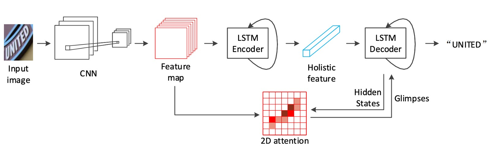
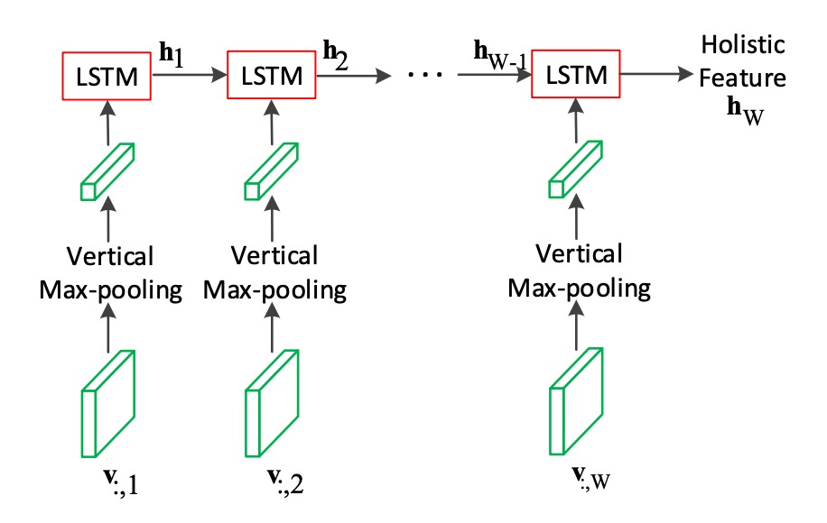
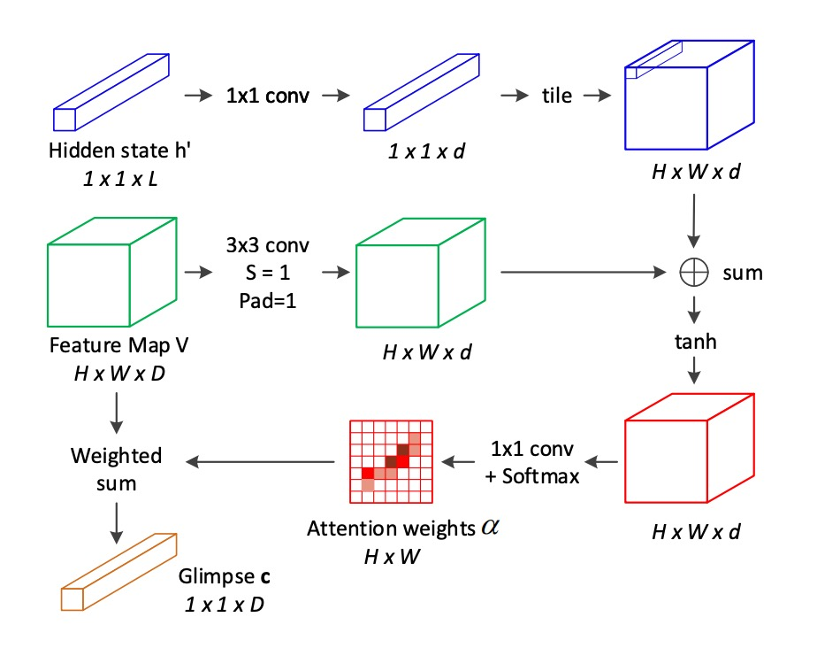
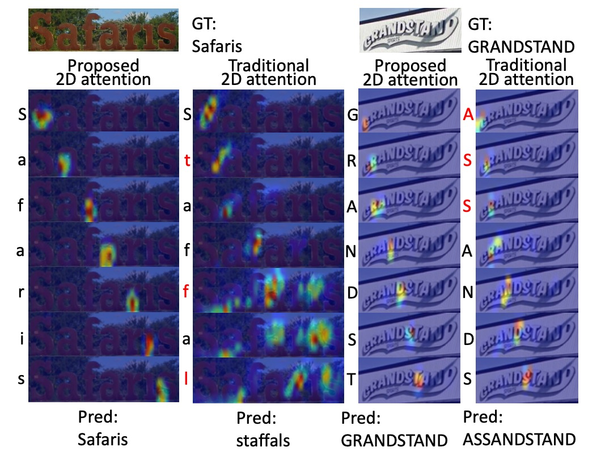

# [18.11] SAR

## 二維注意力圖

[**Show, Attend and Read: A Simple and Strong Baseline for Irregular Text Recognition**](https://arxiv.org/abs/1811.00751)

---

大幅度的彎曲文字帶給辨識模型相當大的困難，在過去雖然已經有一些方法開始嘗試解決這個問題，像是使用 STN 網路來進行幾何校正等，但效果有限。

## 定義問題

回顧一下之前的解題方式，在面對不規則文字辨識的問題時，大概可以分為三個方向：

1. **使用校正算法**：比較有代表性的方法像是 RARE，他們透過 STN 網路來進行幾何校正，但扭曲嚴重的文字仍然難以處理。

   - [**[16.03] RARE: 全自動校正**](../1603-rare/index.md)

2. **使用注意力**：在解碼文字的時候讓模型可以選擇局部的 2D 特徵，但在訓練時需要給予字元的監督資訊，訓練資料型態較為受限。

   - [**[17.11] AON: Towards Arbitrarily-Oriented Text Recognition**](https://arxiv.org/pdf/1711.04226)

3. **多方向編碼**：這個方法是從四個方向上對任意方向的文字進行編碼，但架構設計比較複雜。

   - [**[17.08] Learning to Read Irregular Text with Attention Mechanisms**](https://www.ijcai.org/proceedings/2017/0458.pdf)

---

看了一圈，作者還是喜歡簡單的方法。

回到基於注意力的編碼器-解碼器的框架，作者基於 ResNet 和 LSTM 的架構，搭配客製化的二維注意力模組來解決不規則文字辨識的問題。

## 解決問題

### 模型架構

如上架構圖，在 Backbone 的部分作者選用 ResNet-31 作為特徵提取器。由於後續會直接使用 2D 的特徵圖，所以這裡不需要像是 RCNN 這樣，使用長寬不一致的降採樣方式。

:::tip
之前的研究大多使用 VGG。
:::

### 編碼器

<figure style={{ "width": "85%"}}>

</figure>

得到特徵圖之後，首先使用 LSTM 對影像進行編碼。

我們也都知道 LSTM 是用來處理一維的序列資料，因此這裡作者對特徵圖的「高度」取最大池化，壓縮成一維的序列資料，再輸入到 LSTM 中。

這裡的 LSTM 帶有兩層，每層有 512 個隱藏單元，從圖中來看，這是一個單向的 LSTM。

### 解碼器

<figure style={{ "width": "85%"}}>

</figure>

解碼器的部分還是 LSTM。

如上圖所示，這裡就是作者所提出的主要貢獻點：如果我們把「2D convolution feature map V」的部分拿掉，那就是一個基本的 LSTM 解碼器。

這裡解碼器的輸入不單純只有來自編碼器的輸出特徵，而是在每個解碼的階段不斷地回到注意力圖中計算注意力權重，來選擇編碼器的特徵。

這裡的 LSTM 也是兩層，每層 512 個隱藏單元。編碼器和解碼器的參數各自獨立，沒有共享。在訓練的時候是使用 Teacher Forcing 的方式，而在推論的時候會改成使用前一個時間點的預測結果。

:::tip
**Teacher Forcing**

當模型在某一時間步生成下一個輸出時，不是依賴模型前一步的預測來決定下一步的輸入，而是使用真實的輸出標籤（ground truth） 作為下一步的輸入。

如果我們在模型在訓練初期錯誤地生成某些輸出時，如果將這些錯誤的預測繼續作為後續步驟的輸入，模型很可能會進一步產生更多的錯誤。而 Teacher Forcing 可以減少這種累積誤差。

缺點是如果模型過於依賴 Teacher Forcing，可能在推理階段因為缺少正確的參考輸入而導致性能下降。為了緩解這個問題，可以逐步減少 Teacher Forcing 的使用，讓模型在訓練過程中逐漸學會依賴自己的預測進行生成。
:::

### 2D 注意力圖

<figure style={{ "width": "70%"}}>

</figure>

為了彌補傳統 2D 注意力機制的不足，作者提出了一種新的針對 2D 空間關係的注意力機制：

對於每個位置 $(i, j)$，在計算其注意力權重時，將 **相鄰位置** 的資訊納入考量。這些相鄰位置來自於位置 $(i, j)$ 的 **八鄰域**。

注意力的分數 $e_{ij}$ 由下列公式計算：

$$
e_{ij} = \tanh(W_v v_{ij} + \sum_{p,q \in N_{ij}} \tilde{W}_{p-i, q-j} \cdot v_{pq} + W_h h'_t)
$$

其中：

- $v_{ij}$ 是位置 $(i, j)$ 的局部特徵向量。
- $N_{ij}$ 表示位置 $(i, j)$ 周圍的八鄰域。
- $h'_t$ 是解碼器 LSTM 在時間步 $t$ 的隱藏狀態，作為注意力引導訊號。
- $W_v, W_h$ 和 $\tilde{W}$ 是需要學習的線性轉換矩陣。

使用 softmax 函數計算注意力權重 $\alpha_{ij}$：

$$
\alpha_{ij} = \text{softmax}(w_e^T \cdot e_{ij})
$$

計算當前時間步 $t$ 的注意力加權和（glimpse）$g_t$：

$$
g_t = \sum_{i,j} \alpha_{ij} v_{ij}, \quad i = 1, \ldots, H, \quad j = 1, \ldots, W
$$

其中 $H$ 和 $W$ 分別是特徵圖的高度和寬度。

相較於傳統的注意力機制，這裡**增加了一項八鄰域的加權和項** ，用來考慮鄰近位置的影響。這樣的改進使得模型能夠捕捉到局部特徵之間的空間關係。

:::tip
看完這段，你可能會被一堆公式震懾到，但這其實只是對特徵圖做一次卷積運算，然後算一下 Softmax，最後再做一次加權和。

所以你可以看一下為什麼上面寫的是「八鄰域」？因為卷積核的大小是 $3 \times 3$，所以每個位置都會考慮到周圍的八個位置。
:::

## 討論

### 與其他方法的比較

對於不規則文字數據集（如 **IC15**、**SVTP**、**CT80** 和 **COCO-T**），SAR 的表現**顯著優於**其他方法。

- 在 **SVTP-None** 上，準確率提高了 **7.5%**（從 78.9% 提升至 86.4%）。
- 在 **CT80** 上，準確率提高了 **10.1%**（從 79.5% 提升至 89.6%）。

同時，SAR 在**規則文字數據集**（如 **IIIT5K**、**SVT** 和 **IC13**）上仍達到了**最先進的性能**。

當**無詞彙表**時，我們的方法優勢更加顯著，特別是在 **IIIT5K** 和 **SVTP** 中。這表明，該方法在現實情況下（通常**無詞彙表**提供時）仍具有很高的實用性。

### 可視化展示

作者將 SAR 的 2D 注意力模型和傳統 2D 注意力模型的比較。

解碼後的字元顯示在對應注意力熱圖的左側，錯誤的字元標記為紅色，可以看出 SAR 模型更準確的定位和更好的辨識結果。

## 結論

SAR 展現了該模型在規則與不規則文字辨識任務中的卓越性能。同時，它也為未來的改進提供了多個可能的方向，特別是在加速訓練過程和更好地處理複雜文字結構上有很大的發展潛力。

後續有幾篇研究以 SAR 作為基礎比較對象，我們之後再接著聊。
