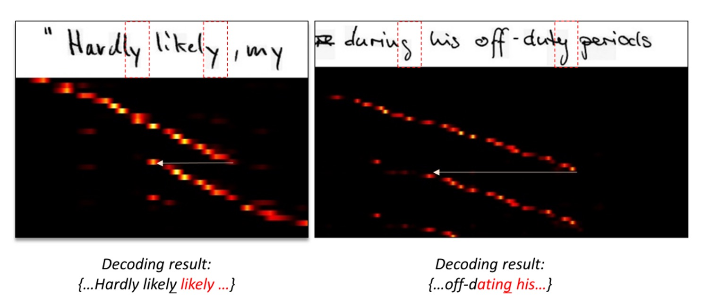
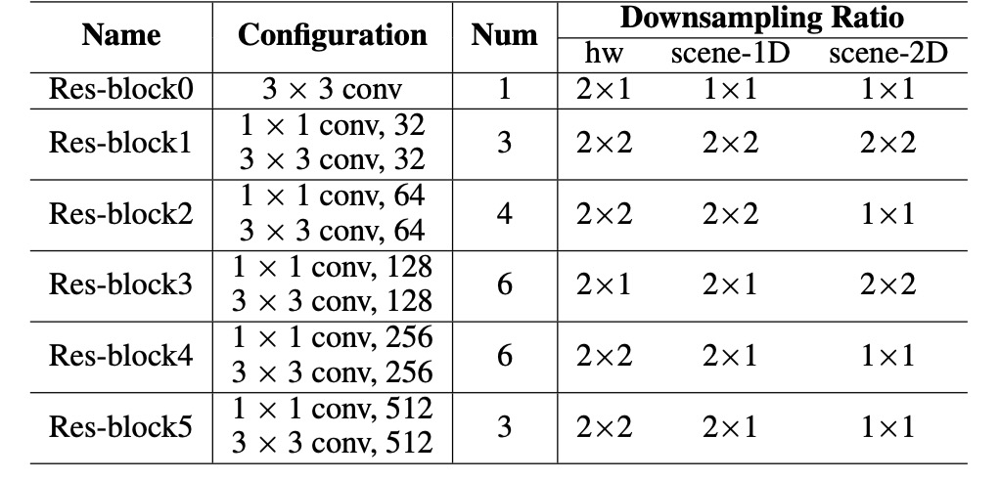
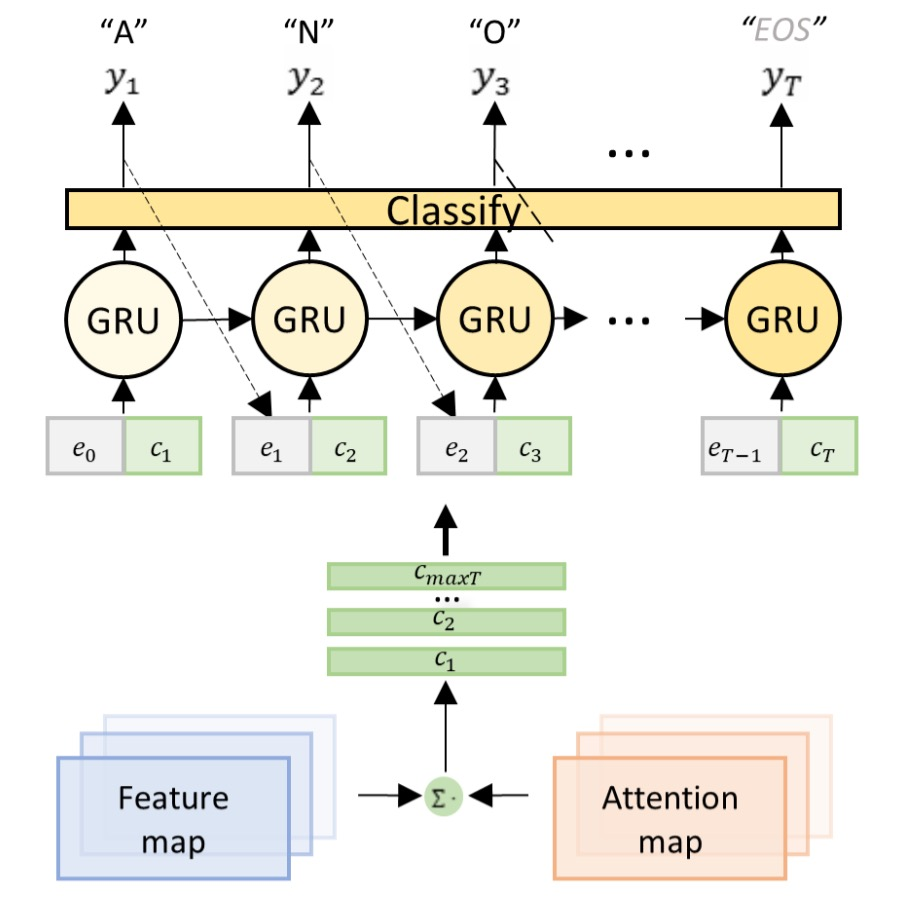

# [19.12] DAN

## 不准在一起

[**Decoupled Attention Network for Text Recognition**](https://arxiv.org/abs/1912.10205)

---

早期的研究中，大多使用 CTC 算法來作為最後輸出的解碼器，而近年來則是流行用帶有注意力圖的結構。原因也很簡單：效果通常比較好！

因此，幫模型加個注意力圖幾乎現在 STR 領域內的標準備配。

## 定義問題

可是注意力圖，不準啊！

### 注意力遺失

作者梳理了過去的研究，發現注意力圖的設計是基於特徵圖的，而不是基於文字的。

什麼意思？請看下圖：

在圖中，上面是原始輸入圖像，下面是對應的注意力圖。

注意力圖的閱讀方式比較特別，他帶有序列資訊，最左上角是第一個字，最右下角是最後一個字。一個好的注意力分佈應該是一組呈現對角線的亮點，表示每個字都有對應的注意力區域。

回到上面的圖，我們可以看到注意力圖的分佈並不是對角線，而是在某個區域上，突然跳到另一個區域。這表示模型在這個時間點上沒有對應到正確的文字。

就作者分析，這是因為注意力圖的設計是基於特徵圖的，按照上圖中的例子：「ly」 這個詞，在不同序列點上的特徵圖可能是相似的，因此序列模型就「迷失」了。

### 輸出耦合

我們需要注意力圖，目的是為了要幫助模型對齊文字與圖像。

但對齊操作如果和解碼操作綁在一起，這表示在學習的過程中，匹配對齊的結果一定會受到解碼器的輸出結果所影響。不可避免的導致錯誤累積和傳播。

---

所以，對齊操作和解碼操作，你們不准在一起！

作者如是說。

## 解決問題

### 模型架構

為了解決耦合的問題，作者提出了 DAN 架構，如上圖。

這個架構的想法非常簡單，就是為了注意力而單獨設計一個分支，讓這個分支來預測文字的位置。我們分階段來看這個架構：

### 特徵提取

這個部分是一個 CNN 網絡，用來提取圖像的特徵，沒什麼好說的。

作者採用與前人研究類似的 CNN 特徵編碼器，而不是用標準的 ResNet，參數配置如下：

<figure style={{"width": "70%"}}>

</figure>

將輸入影像 $x$（尺寸 $H \times W$）編碼成特徵圖 $F$：

$$
F = F(x), \quad F \in \mathbb{R}^{C \times H/r_h \times W/r_w}
$$

其中，$C$ 是輸出通道數，$r_h$ 和 $r_w$ 為高度和寬度的降採樣比例。

### 對齊模組

卷積對齊模組，Convolutional Alignment Module，後續簡稱 CAM。

CAM 從特徵編碼器獲取多尺度視覺特徵，並通過階層降採樣卷積層進行處理。受到 FCN 的啟發，CAM 進行逐通道的注意力運算，每個通道代表一個類別的熱圖。

CAM 的結構包含 $L$ 層，在上採樣（作者使用反卷積）階段，每個輸出特徵與卷積階段的對應特徵圖相加，最終通過 sigmoid 函數和逐通道歸一化產生注意力圖：

$$
A = \{ \alpha_1, \alpha_2, \dots, \alpha_{\text{maxT}} \}
$$

這個 $maxT$ 就是解碼器的最大時序長度，每張注意力圖的尺寸為 $H/r_h \times W/r_w$。

在最後輸入解碼器的時候，每個時序都有一個對應的特徵圖，這個特徵圖就是對應原圖的文字區域。

:::tip
如果你對這個步驟感到疑惑，那就用 FPN 去理解它就好。

- [**[16.12] FPN: 金字塔架構**](../../feature-fusion/1612-fpn/index.md)
  :::

### 解耦式解碼模組

<figure style={{"width": "70%"}}>

</figure>

傳統的注意力解碼器會同時進行對齊和辨識，而 DAN 的解碼器僅進行辨識。

解碼器以編碼後的特徵圖和注意力圖作為輸入，計算時間步驟 $t$ 的上下文向量 $c_t$：

$$
c_t = \sum_{x=1}^{W/r_w} \sum_{y=1}^{H/r_h} \alpha_{t, x, y} F_{x, y}
$$

分類器在時間步驟 $t$ 生成輸出 $y_t$：

$$
y_t = w h_t + b
$$

其中，$h_t$ 是 GRU 的隱藏狀態：

$$
h_t = \text{GRU}((e_{t-1}, c_t), h_{t-1})
$$

$e_t$ 為前一解碼結果 $y_t$ 的嵌入向量。

DAN 的損失函數為：

$$
\text{Loss} = -\sum_{t=1}^{T} \log P(g_t | I, \theta)
$$

其中，$\theta$ 為 DAN 中的所有可訓練參數，$g_t$ 為步驟 $t$ 的真實標籤。

:::tip
**CAM 的靈活性與 1D/2D 辨識模式**

通過控制降採樣比例 $r_h$ 和改變 CAM 的步距，DAN 可以在 1D 和 2D 模式之間切換：

- 當 $H/r_h = 1$ 時，DAN 成為 **1D 辨識器**，適用於長而規律的文字辨識。
- 當 $H/r_h > 1$ 時，DAN 成為 **2D 辨識器**，適合不規則文字的場景辨識。
  :::

### 手寫文字辨識訓練策略

選用兩個驗證用的數據集：

1. **IAM 手寫資料集（IAM Dataset）**

   - 基於 LOB 語料庫的手寫英文文字。
   - **訓練集**：747 份文件（6,482 行）
   - **驗證集**：116 份文件（976 行）
   - **測試集**：336 份文件（2,915 行）

2. **RIMES 手寫資料集（RIMES Dataset）**
   - 包含手寫法文信件。
   - **訓練集**：1,500 段落（11,333 行）
   - **測試集**：100 段落（778 行）

在兩個資料集中，使用整行文字的訓練集，並採用開源資料增強工具進行訓練。

將輸入影像的高度正規化為 192，寬度依照原始比例縮放（最大至 2048）。為了將特徵圖降為 1D，在特徵編碼器的末端添加了一個尺寸為 $3 \times 1$ 的卷積層。

將 $maxT$ 設為 150，以涵蓋最長的文字行。所有 CAM 的卷積層（除了最後一層）設置為 128 個通道，以處理最長的文字長度。

測試時使用六種預定策略裁剪影像，例如 {10,10} 表示裁剪掉上方和下方各 10 行。將所有裁剪結果與原始影像進行辨識，平均輸出機率計算分數，並選擇最高分數的結果作為最終結果。

性能指標使用 **字元錯誤率（CER%）** 和 **單詞錯誤率（WER%）** 作為評估指標：

$$
\text{CER / WER} = \frac{\text{編輯距離}}{\text{標準答案中的字元數 / 單詞數}}
$$

編輯距離計算辨識結果與真實標籤之間的差異。

實驗過程中未使用任何語言模型或詞典，確保模型性能的純粹性。

### 場景文字辨識訓練策略

選用七個常見的場景文字資料集：

1. **規則場景文字資料集**：

   - **IIIT5K-Words**：來自網路，共有 3,000 張裁剪後的單字影像。
   - **Street View Text (SVT)**：來自 Google Street View，共 647 張單字影像。
   - **ICDAR 2003 (IC03)**：包含 251 張標注有文字框的場景影像，總計 867 張裁剪影像。
   - **ICDAR 2013 (IC13)**：基於 IC03 擴展而來，共 1,015 張裁剪影像，無詞典輔助。

2. **不規則場景文字資料集**：
   - **SVT-Perspective (SVT-P)**：來自 Google Street View 的側視角影像，共 639 張裁剪影像。
   - **CUTE80**：專注於曲線文字，包含 80 張高解析度自然場景影像，共 288 張裁剪影像。
   - **ICDAR 2015 (IC15)**：包含 2,077 張裁剪影像，其中大部分為模糊且多方向的影像。

---

訓練資料使用兩組合成文字資料集進行訓練 ModelSynth 和 SynthText。輸入影像大小高度設為 32，寬度根據原始比例縮放（最大至 128）。

其他模型參數設定：

- $maxT = 25$，表示最大輸出步驟為 25。
- CAM 的深度 $L = 8$，除了最後一層外，其餘層的通道數設為 64。
- 使用 **bi-directional decoder** 進行最終預測。
- 採用 **ADADELTA** 進行優化，初始學習率為 1.0，第三輪後降為 0.1。

## 討論

### 手寫文字辨識性能

<figure style={{"width": "70%"}}>

</figure>

- **IAM 資料集**：

  - **DAN 在 CER 上優於**先前的 SOTA 模型，**提升 1.5%**。
  - **WER**：雖然 (Bhunia et al., 2019) 的模型在 WER 上表現較佳，但他們的模型需要裁剪後的單字影像，而 **DAN** 能直接辨識整行文字，顯示出更大的應用彈性。

- **RIMES 資料集**：
  - **CER**：比 SOTA 差 0.2%。
  - **WER**：相對於 SOTA，有 **3.7% 的誤差減少**（相對誤差減少 29%）。
  - DAN 在 WER 上的顯著改進說明其**更強的語意學習能力**，特別有助於處理長文字的辨識。

### 消融實驗

<figure style={{"width": "70%"}}>

</figure>

根據實驗結果，「不同的輸出長度」不會顯著影響效能，並且額外通道所需的運算資源可以忽略不計。只要設定的輸出長度合理（長於文字本身），DAN 的性能不會受到影響。

<figure style={{"width": "80%"}}>

</figure>

隨著深度 L 的減少，DAN 的性能「顯著下降」，表明 CAM 需要足夠的深度來達到良好的對齊效果。要成功對齊一個字元，CAM 的感受野（receptive field）必須足夠大，以覆蓋該字元及其相鄰區域的特徵。

### 對齊錯誤分析

<figure style={{"width": "85%"}}>

</figure>

分析方式為找出具有最大注意力分數的區域作為「注意力中心」。

若當前的注意力中心位於上一個中心的「左側」，記錄為一次錯誤對齊。將測試樣本根據文字長度分為五組：[0, 30)、[30, 40)、[40, 50)、[50, 60)、[60, 70)，每組包含超過 100 個樣本。每組的錯誤對齊數據加總後，計算每張影像的平均錯誤對齊次數（MM/img）。

結果分析 CER 改進與錯誤對齊消除的趨勢幾乎一致，說明 DAN 的效能提升來自於「減少了錯誤對齊」。

下圖顯示了 DAN 消除錯誤對齊的範例，最上層是輸入影像，中間是基於傳統注意力機制的對齊結果，最下層是 DAN 的對齊結果。

<figure style={{"width": "80%"}}>

</figure>

### 辨識錯誤分析

<figure style={{"width": "80%"}}>

</figure>

作者展示了 DAN 的錯誤範例，如上圖：

1. **(a)**：字元「e」被錯誤辨識為「p」，原因是手寫風格讓兩者難以區分。即使對人類而言，若無上下文也難以判斷。
2. **(b)**：由於兩個單詞之間的距離過近，導致辨識器忽略了空格符號。
3. **(c)**：一些雜訊紋理被 DAN 錯誤辨識為文字。

DAN 在這些錯誤案例中仍展現出比傳統注意力機制更強的強健性，在雜訊干擾的情況下，傳統注意力容易出現不可預測的錯誤，因為對齊操作被干擾。而 DAN 即使產生額外結果，也能保持對齊的穩定性。

### 場景文字辨識性能

- **規則場景文字辨識**：

  - 在 **IIIT5K** 和 **IC03** 上，DAN 達到**最新的 SOTA 性能**。
  - 在 **SVT** 和 **IC13** 上，DAN 與 SOTA 模型表現相近，略有差距。
  - **DAN-1D** 在 IC03 和 IC13 上表現更佳，因為這些資料集的影像**乾淨且規則**。

- **不規則場景文字辨識**：
  - DAN-2D 在 **SVT-P** 和 **CUTE80** 上達到 SOTA 性能，並且在 2D 模型中表現最佳。

### 穩健性研究

作者在 **IIIT5K** 和 **IC13** 資料集上進行擾動測試，並將 DAN 與 **CA-FCN** 比較。

上表中作者使用了多種不同的擾動策略：

1. **IIIT-p**：將影像垂直和水平各填充 10% 的高度和寬度。
2. **IIIT-r-p**：
   - 隨機放大影像的四個頂點（最大至 20%）。
   - 使用邊界像素填充成四邊形影像，並轉回對齊的矩形影像。
3. **IC13-ex**：在裁剪前將文字框擴展 10%。
4. **IC13-r-ex**：隨機將文字框放大（最大 20%），並裁剪為矩形影像。

從結果可以看出 DAN 在大多數情況下表現比 CA-FCN 更穩定，藉此證明了 DAN 的強健性。

## 結論

作者從一開始就明確的指出了注意力圖的問題，並提出了解耦式的解決方案。

DAN 在文字辨識任務中展現了其獨特的價值，憑藉其靈活性、穩健性及高性能，成為解決對齊錯誤的一個有效工具。雖然 DAN 在面對紋理相近的雜訊時仍有改善空間，但其簡單的架構和無需詞典的設計，讓它在各類文字辨識任務中都能達到良好的效果。

:::tip
如果今天要解碼（$maxT$）的長度非常長，解耦式的注意力圖可能會消耗非常多的資源，這時候就需要考慮一下模型的效能問題。但大部分的應用場景，$maxT$ 通常不會太長，所以問題不大。
:::
