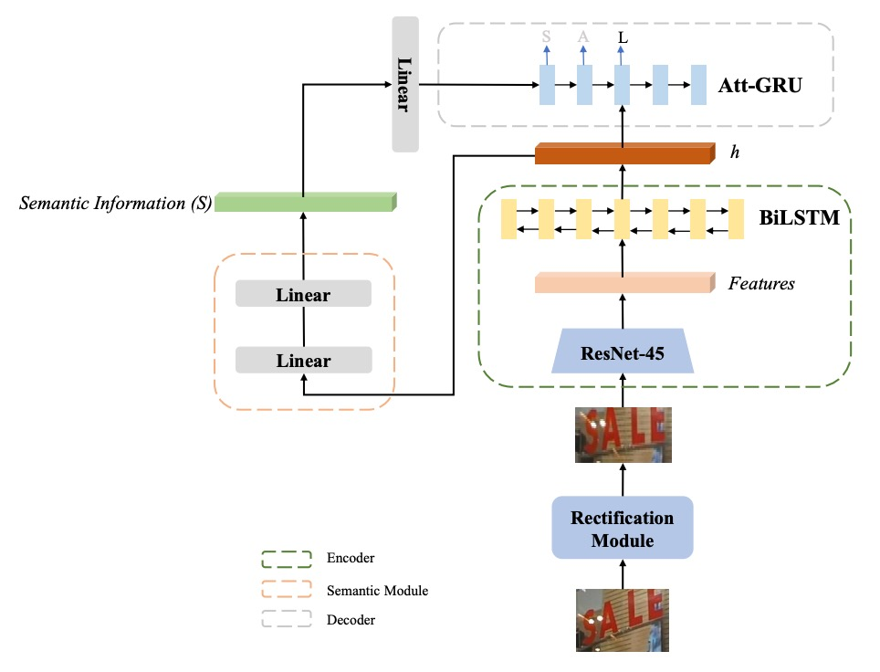
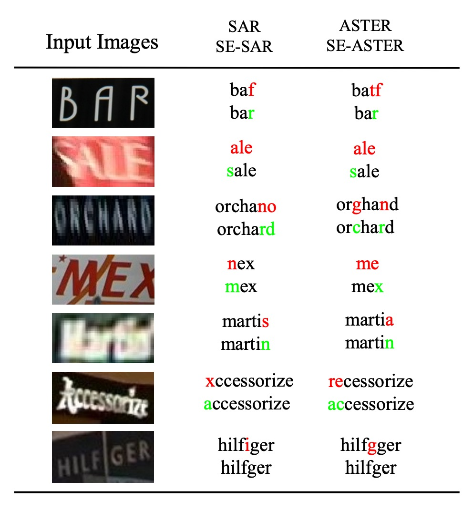

# [20.05] SEED

## 語言的種子

[**SEED: Semantics Enhanced Encoder-Decoder Framework for Scene Text Recognition**](https://arxiv.org/abs/2005.10977)

---

基於視覺特徵的模型，好像已經遇到了瓶頸。

那有沒有機會可以融入更多的語言資訊呢？

## 定義問題

受到 NLP 的啟發，許多 STR 的研究開始使用注意力機制來解決問題。

對於規則文本，使用基於卷積神經網路（CNN）及遞迴神經網路（RNN）的編碼器，並結合注意力機制的解碼器進行逐步字元預測；而對於不規則文本，則使用多方向編碼和 2D 注意力方法來處理。

那麼...

既然都已經抄了 NLP 的架構，那為什麼不再多抄一點呢？

語言模型的「語言」，不就是個很好的線索嗎？

本篇論文的作者透過引入額外「語意資訊」作為全局參考，以輔助解碼過程。算是在 STR 領域中，非常早期的探索多模態可行性的研究。

## 解決問題

### 模型架構

<figure style={{"width": "70%"}}>

</figure>

作者以 ASTER 為基礎，提出「增強語意的 ASTER (SE-ASTER)」方法，如上圖。

- [**[18.06] ASTER: An Attentional Scene Text Recognizer with Flexible Rectification**](https://ieeexplore.ieee.org/document/8395027)

SE-ASTER 包含四個模組：

1. **校正模組**：用於校正不規則文字影像；
2. **編碼器**：用來提取豐富的視覺特徵；
3. **語意模組**：從視覺特徵中預測語意資訊；
4. **解碼器**：輸出最終的辨識結果。

首先，圖像輸入校正模組，以淺層 CNN 預測控制點，然後使用薄板樣條 (Thin-plate Splines, TPS) 對圖像進行校正。

:::tip
TPS 校正的部分可以參考我們之前的文章：

- [**[16.03] RARE: 全自動校正**](../1603-rare/index.md)
  :::

接著，校正後的圖像將輸入編碼器生成視覺特徵。

編碼器包含一個 45 層的 ResNet CNN 和一個 256 隱藏單元的 BiLSTM 網絡，輸出為特徵序列 $h = (h_1, \dots, h_L)$，其形狀為 $L \times C$，其中 $L$ 是 CNN 最後一層特徵圖的寬度，$C$ 為特徵維度。

這個輸出特徵序列 $h$ 有兩個用途：

- 其一：提供語意模組預測語意資訊
- 其二：作為解碼器的輸入。

為了預測語意資訊，作者將特徵序列展平成一維特徵向量 $I$，其維度為 $K$。

語意資訊 $S$ 透過以下兩個線性函數計算：

$$
S = W_2\sigma(W_1I + b_1) + b_2
$$

其中 $W_1, W_2, b_1, b_2$ 為可訓練的權重，$\sigma$ 為 ReLU 激活函數，語意資訊會以預訓練的 FastText 模型提供的詞嵌入作為監督信號。

:::tip
作者有嘗試使用編碼器中 BiLSTM 的最終隱藏狀態 $h_L$ 來預測語意資訊，但效果較差。

推測原因可能是由於語意預測需要更大的特徵上下文，使用 BiLSTM 的輸出更為合適。
:::

### 預訓練語言模型

語言模型的部分，作者選擇使用 FastText 作為預訓練語言模型（基於 skip-gram）。

- [**[16.07] Enriching Word Vectors with Subword Information**](https://arxiv.org/abs/1607.04606)

假設 $T = \{w_{i-l}, \dots, w_{i+l}\}$ 為文字語料中的一句話，其中 $l$ 表示句子的長度，在 skip-gram 模型中，一個單字 $w_i$ 以一個嵌入向量 $v_i$ 表示，並被輸入至一個簡單的前饋神經網絡，其目標是預測上下文：

$$
C_i = \{w_{i-l}, \dots, w_{i-1}, w_{i+1}, \dots, w_{i+l}\}
$$

在訓練過程中，該嵌入向量 $v_i$ 被同步優化，使得一個單字的最終嵌入向量接近於語意相似的單字。FastText 進一步嵌入子詞並使用這些子詞來生成單字 $w_i$ 的最終嵌入。

舉例來說，若 $l_{\text{min}} = 2$、$l_{\text{max}} = 4$ 且單字為「where」，則其子詞集合為 $\{$wh, he, er, re, whe, her, ere, wher, here$\}$。該單字的表示即為所有子詞嵌入向量與該單字嵌入向量的組合。

因此，FastText 模型能夠解決「詞彙外」(Out of Vocabulary) 問題。

:::tip
在 2020 年的時刻，為什麼不用 RoBERTa 或 BERT 呢？
:::

---

圖像特徵經過語言模型的監督後，會作為最後解碼器的初始化輸入，這個步驟非常關鍵，在消融實驗中，如果沒有把語意資訊融入解碼器，模型的性能沒有明顯提升。

### 損失函數

訓練時，作者在語意模組與解碼器模組同時加入監督訊號，SE-ASTER 以端對端方式訓練。

損失函數如下：

$$
L = L_{\text{rec}} + \lambda L_{\text{sem}}
$$

其中，$L_{\text{rec}}$ 為標準交叉熵損失 (cross-entropy loss)，衡量預測概率與真實標籤之間的差異。

$L_{\text{sem}}$ 為語意資訊的餘弦嵌入損失 (cosine embedding loss)：

$$
L_{\text{sem}} = 1 - \cos(S, \text{em})
$$

其中，$S$ 為預測的語意資訊，$\text{em}$ 為預訓練 FastText 模型的詞嵌入。目的比較預測的語意資訊與從預訓練 FastText 模型中取得的轉錄標籤詞嵌入之間的相似度。

$\lambda$為平衡損失的超參數，此處設定為 1。

:::tip
作者表示這裡只用簡單的餘弦損失函數而非對比損失是為了加快訓練速度。
:::

### 實作細節

預訓練的 FastText 模型使用官方提供的模型，該模型以 Common Crawl 和 Wikipedia 數據集進行訓練。模型能辨識共 97 個符號，包括數字、大寫字母、小寫字母、32 個標點符號、序列結束符號、填充符號及未知符號。

輸入影像的大小調整為 64 × 256，不保持比例。優化目標函數時採用 ADADELTA 演算法。

在無任何預訓練和數據增強的情況下，模型在 SynthText 和 Synth90K 數據集上訓練 6 個 epoch，批量大小設定為 512，學習率初始設定為 1.0，並在第 4 個 epoch 衰減至 0.1，第 5 個 epoch 衰減至 0.01。模型使用一張 NVIDIA M40 顯卡進行訓練。

推論時，輸入影像的大小與訓練階段一致。在 GRU 解碼時使用 beam search，保留累積分數最高的 $k$ 個候選結果，在所有實驗中 $k$ 設定為 5。

## 討論

### 與最新方法的比較

<figure style={{"width": "80%"}}>

</figure>

作者將所提出的方法與先前的最先進方法在多個基準數據集上進行比較，結果如上表。

在不使用詞彙且僅有單詞級標註的情境下，SE-ASTER 在 6 個基準數據集中取得了 2 個最佳結果和 3 個次佳結果。與其他方法相比，所提出的方法在低品質數據集（如 IC15 和 SVTP）上表現出色。

SE-ASTER 在 IC15 上提升了 3.9%（從 76.1%提升至 80.0%），在 SVTP 上提升了 2.9%（從 78.5%提升至 81.4%），相較於 ASTER 有顯著提升。此外，即使 SE-ASTER 基於較弱的骨幹網絡且不使用字元級標註，其在 SVTP 和 IC15 上也分別超越了最先進的 ScRN 0.6%和 1.3%。

### 可視化結果

<figure style={{"width": "70%"}}>

</figure>

作者對一些低品質影像進行可視化，包括模糊或遮擋的情況，部分範例如上圖。

可以看到，SE-ASTER 在處理低品質影像方面具備穩健性，作者認為語意資訊能為解碼器提供有效的全局特徵，從而對影像中的干擾具有抵抗力。

:::tip
上圖中的 SE-SAR 是把相同架構套用在 SAR 論文的架構上，結果同樣顯示出融合語言模型的優勢。這篇論文可以參考我們之前的文章：

- [**[18.11] SAR: 二維注意力圖**](../1811-sar/index.md)
  :::

## 結論

語言模型的引入，為 STR 領域帶來了新的思路，SE-ASTER 在多個基準數據集上取得了不錯的效果，對於低品質影像具有穩健性。

在後續的 STR 研究中，語言模型的搭配成為一個主要趨勢，先不論使用語言模型可能帶來的副作用，就現況來說，仍然是一個新興且值得探討的方向。
