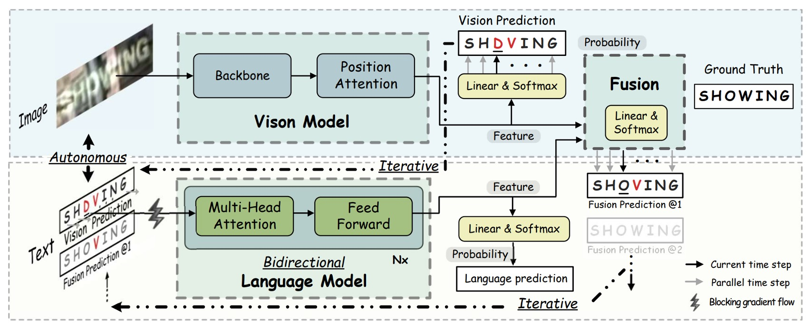
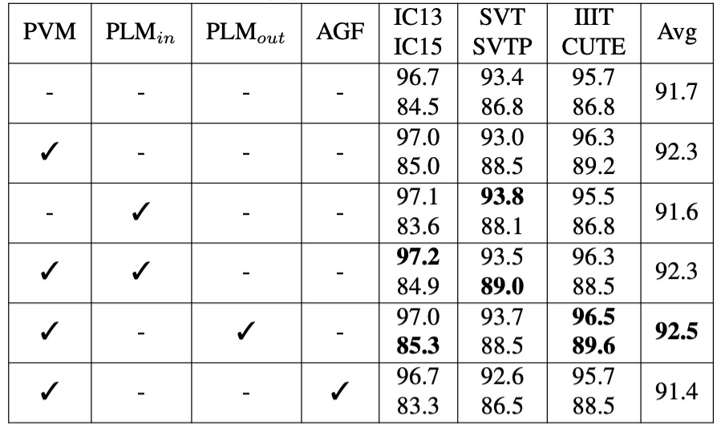

## 要不再想想？

[**Read Like Humans: Autonomous, Bidirectional and Iterative Language Modeling for Scene Text Recognition**](https://arxiv.org/abs/2103.06495)

---

視覺的辨識似乎已經走到了盡頭，人們開始思考如何讓模型更像人類一樣去理解和讀取文字。

## 定義問題

過去許多研究都是透過視覺的特徵進來文字辨識，但只要遇到模糊、遮蔽或是變形的文字，模型就會出現困難。因為視覺上的特徵已經受到破壞，模型無法從中找到文字的特徵。

為了解決這個問題，人們開始嘗試引入語言模型來幫助模型理解文字。

舉例來說，我們可能看到一個模糊的文字：APP？E，這時候我們可以透過語言模型來幫助我們理解這個文字應該是 `APPLE`。

目前人類的閱讀行為被認為具有：

1. **自主性（Autonomous）**：視覺和語言可以獨立學習，語言可以幫助視覺理解文字。
2. **雙向性（Bidirectional）**：不清楚的文字，可以從上下文推測，找到答案。
3. **迭代性（Iterative）**：人們可以多次推理和修正，提高預測的準確度。

本篇論文的作者認為，既然人類可以這樣做，那麼模型也應該可以！

1. **自主性（Autonomous）**：使用視覺模型和語言模型，獨立建模文字的視覺和語言特徵。
2. **雙向性（Bidirectional）**：作者提出「雙向填字網路」任務，透過上下文來學習。
3. **迭代性（Iterative）**：透過迭代的方式，不斷修正文字的預測。

想法有了，具體細節也有了，那麼就剩下實驗證明有效性了！

## 解決問題

作者提出了一個新的模型架構：**ABINet**，用來解決文字辨識的問題。

首先我們來看視覺模型的部分。

### 視覺模型

<figure style={{"width": "70%"}}>

</figure>

視覺模型像是之前常見的網路架構，使用 ResNet 進行特徵提取，將圖像 $x$ 轉換為特徵表示：

$$
F_b = \tau(R(x)) \in \mathbb{R}^{\frac{H}{4} \times \frac{W}{4} \times C}
$$

其中，$H$ 與 $W$ 為圖像尺寸，$C$ 為特徵維度。

視覺特徵 $F_b$ 被轉換為字母機率，並且進行並行轉錄：

$$
F_v = \text{softmax}\left(\frac{QK^T}{\sqrt{C}}\right)V
$$

**$Q \in \mathbb{R}^{T \times C}$**，表示字元序列的位置編碼（positional encodings），是字母順序的編碼矩陣，用來指引模型理解每個字元在序列中的位置。具體來說，$T$ 為字元序列的長度，代表要處理的字元數量；$C$ 是特徵的維度，用於表示每個位置的特徵空間。

**$K = G(F_b) \in \mathbb{R}^{\frac{HW}{16} \times C}$**，是通過函數 $G(\cdot)$ 對特徵 $F_b$ 進行處理後得到的「鍵」（key），並用於與查詢 $Q$ 進行對齊。

其中，$F_b$ 是圖像特徵輸出，$H$ 和 $W$ 分別為圖像的高與寬。為了實現 $K$ 的計算，$G(\cdot)$ 的具體實現方式為一個小型的 U-Net（mini U-Net）結構，該結構將視覺特徵降維，以獲得與字元序列長度相匹配的鍵特徵。

經過處理後，$K$ 的尺寸為 $\frac{HW}{16} \times C$，這是為了在空間上與字元順序位置編碼保持一致性。

**$V = H(F_b) \in \mathbb{R}^{\frac{HW}{16} \times C}$**，表示「值」（value），由 $H(\cdot)$ 對 $F_b$ 進行映射得到。在這裡，$H(\cdot)$ 採用的是恒等映射（identity mapping），即直接將 $F_b$ 的特徵傳遞過來，不進行額外的變換。這使得 $V$的 尺寸同樣為 $\frac{HW}{16} \times C$，並與 $K$ 保持相同的特徵空間和空間解析度。

:::tip
簡單來說，就是透過位置查詢，將圖像特徵轉換為對應字元的預測機率，使得模型能夠根據字元的順序位置信息和圖像特徵進行精確的辨識。
:::

### 語言模型

視覺模型我們看完了，然後作者繼續串接語言模型，這裡有幾個重要的策略：

1. **自主策略（Autonomous Strategy）**：

   如上圖，語言模型被視為獨立的拼寫修正模型，以字元的概率向量為輸入，輸出期望字元的概率分布。這樣的設計使得語言模型能夠從未標註的文本中獨立訓練，並且使模型更具解釋性和單位化，同時也能夠替換和靈活操作語言模型。

   為了確保語言模型的獨立性，作者提出了阻斷輸入向量的梯度流（BGF），這樣可以防止視覺模型的梯度流進入語言模型，從而保證語言模型的獨立性。

   這個策略的好處是可以引入自然語言處理（NLP）的技術，這裡可以隨意抽換成其他預訓練語言模型來提升效能。

2. **雙向策略（Bidirectional Strategy）**：

    

    <figure style={{"width": "60%"}}>
    
    </figure>
    

   語言模型的條件概率分為雙向和單向表示，分別為 $P(y_i | y_n, \dots, y_{i+1}, y_{i-1}, \dots, y_1)$ 和 $P(y_i | y_{i-1}, \dots, y_1)$。因此雙向模型能提供更豐富的語意資訊。

   像是 BERT 的遮罩語言模型（Masked Language Model, MLM），用 `[MASK]` 替換掉需要預測的字元 $y_i$。但直接使用 MLM 效率極低，因為對每個字串都需重複 $n$ 次遮罩操作來逐一預測字元。為提高效率，作者提出了雙向填字網路（BCN），用以取代需多次遮罩的 MLM，具更高的效率。

   BCN 採用傳統 Transformer 的 Decoder 架構，但有些地方不同：BCN 將字元向量直接輸入多頭注意力模組，而非輸入網路的第一層。為防止字元「看到自己」，多頭注意力模組中的注意力遮罩進行了特別設計，以避免字元間的信息洩露。

   在 BCN 的多頭注意力塊中，遮罩矩陣 $M$ 的構造如下：

   $$
   M_{ij} =
   \begin{cases}
     0, & i \neq j \\
     -\infty, & i = j
   \end{cases}
   $$

   $K_i = V_i = P(y_i) W_l$，其中 $P(y_i) \in \mathbb{R}^c$ 表示字元 $y_i$ 的機率分布，$W_l \in \mathbb{R}^{c \times C}$ 為線性映射矩陣。

   多頭注意力的計算公式為：

   $$
   F_{\text{mha}} = \text{softmax}\left(\frac{QK^T}{\sqrt{C}} + M\right)V
   $$

   在此，$Q \in \mathbb{R}^{T \times C}$表示第一層字元序列的位置編碼，而在後續層中則為上一層的輸出結果。$K, V \in \mathbb{R}^{T \times C}$ 則來自字元機率 $P(y_i)$ 的線性映射。

   BCN 通過設置類似填字（cloze）的注意力遮罩，能夠有效地學習更強的雙向表示，相較於單向模型更能捕捉語意的完整性。

   :::tip
   這裡有幾個重點：

   1. 使用解碼器，但不用因果遮罩（causal mask），採用平行解碼。
   2. 不用 `[MASK]` 遮罩，而是直接用對角線為 $-\infty$ 的遮罩矩陣，提高模型效率。
      :::

3. **迭代策略（Iterative Strategy）**：

   作者提出了迭代修正（Iterative Correction）的策略，來解決 Transformer 的並行預測中，來自視覺模型的噪聲輸入會降低預測信心的問題。在第一輪，$y_{i_1}$ 為視覺模型的概率預測；在後續迭代中，$y_{i \geq 2}$ 來自前次融合模型的預測。

   :::tip
   就是用多層 Transformer 的意思，作者稱這個為「迭代」修正。
   :::

4. **融合（Fusion）**

   視覺模型訓練於圖像數據，而語言模型則訓練於文本數據，這兩者本質上是不同模態的信息。因此，為了讓視覺特徵與語言特徵相互對齊，融合過程需要一種機制來將這兩種模態的特徵進行結合。為實現最終的融合，作者使用了一種「門控機制」（gated mechanism），這一方法可以有效地平衡兩種模態特徵的影響，並決定最終的輸出特徵。

   首先，對視覺特徵 $F_v$ 和語言特徵 $F_l$ 進行拼接（concatenate），並通過一個線性映射矩陣 $W_f \in \mathbb{R}^{2C \times C}$ 將拼接後的特徵壓縮至與 $F_v$ 和 $F_l$ 相同的維度。

   門控向量$G$由以下公式計算得到：

   $$
   G = \sigma([F_v, F_l] W_f)
   $$

   其中，$\sigma$ 表示 Sigmoid 函數，用於將門控向量 $G$ 的值限制在 $[0, 1]$ 之間。這樣 $G$ 可以用來控制視覺特徵與語言特徵在最終輸出中的權重。

   最終的融合特徵 $F_f$ 通過門控機制將 $F_v$ 與 $F_l$ 加權組合得到：

   $$
   F_f = G \odot F_v + (1 - G) \odot F_l
   $$

   在此，$\odot$ 表示元素相乘（element-wise multiplication）。$G$ 控制了 $F_v$ 和 $F_l$ 的加權比例。例如，當 $G$ 接近 1 時，視覺特徵 $F_v$ 的影響更大；反之，當 $G$ 接近 0 時，語言特徵 $F_l$ 的影響更大。

5. **監督學習**

   ABINet 的訓練採用端到端的多任務目標函數，通過結合視覺特徵、語言特徵及融合特徵的損失來進行模型優化。

   具體的目標函數為：

   $$
   L = \lambda_v L_v + \frac{\lambda_l}{M} \sum_{i=1}^{M} L_l^i + \frac{1}{M} \sum_{i=1}^{M} L_f^i
   $$

   其中：

   - **$L_v$**：視覺特徵 $F_v$ 的交叉熵損失。
   - **$L_l$**：語言特徵 $F_l$ 的交叉熵損失。
   - **$L_f$**：融合特徵 $F_f$ 的交叉熵損失。
   - **$L_l^i$** 和 **$L_f^i$**：分別表示在第 $i$ 次迭代中的語言特徵損失與融合特徵損失。
   - **$\lambda_v$** 和 **$\lambda_l$**：權衡係數，用於調整各個損失項的影響，確保視覺與語言特徵在訓練中的貢獻平衡。

### 實作細節

- **訓練資料集**：使用兩個合成資料集 MJSynth (MJ)和 SynthText (ST)進行模型訓練。
- **測試資料集**：包括六個標準基準資料集：ICDAR 2013 (IC13)、ICDAR 2015 (IC15)、IIIT 5K-Words (IIIT)、Street View Text (SVT)、Street View Text-Perspective (SVTP) 和 CUTE80 (CUTE)。
- **半監督方法的無標記資料**：使用 Uber-Text 資料集（移除標籤）來評估半監督學習的效果。
- **模型設置**：模型維度 $C$ 設為 512，BCN 包含 4 層，每層有 8 個注意力頭。平衡因子 $\lambda_v$ 和 $\lambda_l$ 皆設為 1。
- **影像預處理**：將影像縮放至 32×128，並進行資料增強（如幾何轉換、影像品質降低、顏色抖動等）。
- **訓練環境**：使用 4 個 NVIDIA 1080Ti 顯卡，批次大小為 384。優化器採用 ADAM，初始學習率為 1e-4，並在第 6 個 epoch 後衰減至 1e-5。

## 討論

### 與其他方法的比較

<figure style={{"width": "85%"}}>

</figure>

為了進行嚴格的公平比較，作者重現了 SOTA 算法 SRN，使其與 ABINet 共享相同的實驗配置。兩個重現版本的 SRN 分別使用不同的視覺模型（VM），且做了以下改進，包括替換 VM、移除多尺度訓練的副作用、應用學習率衰減等。相較於原始報告的 SRN 性能有所提升。

- **ABINet-SV 與 SRN-SV 的比較**：ABINet-SV 在多個資料集上優於 SRN-SV。
- **ABINet-LV 的表現**：當搭配更強的 VM 時，ABINet-LV 也顯示出優越的表現。

ABINet 在 MJ 和 ST 訓練的情況下，尤其在 SVT、SVTP 和 IC15 這些資料集上表現突出。這些資料集中含有大量的低品質影像（如噪聲和模糊影像），對於視覺模型來說辨識具有挑戰性，但 ABINet 藉由語言信息的補充顯著提升了辨識效果。

ABINet 能夠成功辨識不規則字體和非標準排版的文字，這主要得益於語言信息對視覺特徵的重要補充作用。即便沒有影像校正，ABINet 也能在 CUTE 資料集中取得次佳表現，顯示出在不規則文本上的良好辨識能力。

### 消融實驗-視覺模型

<figure style={{"width": "80%"}}>

</figure>

這裡主要比較了不同的特徵抽取和序列建模方法。

比起常見的平行注意力方法，作者所提出的「位置注意力」在表示鍵值向量方面更具表現力。

此外，升級視覺模型能顯著提高準確性，但代價是增加了參數和計算成本。或是可以通過在特徵抽取中使用位置注意力，以及在序列建模中使用更深層的 Transformer 來升級 VM。

### 消融實驗-語言模型

<figure style={{"width": "80%"}}>

</figure>

- **PVM**：表示在 MJ 和 ST 數據集上以監督學習的方式預訓練視覺模型（VM）。
- **$\text{PLM}_{in}$**：表示在 MJ 和 ST 數據集上，以自我監督學習的方式預訓練語言模型（LM）。
- **$\text{PLM}_{out}$**：表示在 WikiText-103 數據集上，以自我監督學習的方式預訓練語言模型。
- **AGF（允許梯度流動）**：表示允許在視覺模型和語言模型之間進行梯度流動。

---

在監督學習的情境下預訓練 VM（PVM）可以平均提升準確率 0.6%-0.7%，顯示出視覺模型的預訓練能有效增強模型在視覺辨識上的表現。

$\text{PLM}_{in}$ 的效果較小，這可能是由於這些數據集的文本數據在多樣性和語言結構上的不足，無法提供足夠豐富的語言信息。

$\text{PLM}_{out}$ 的效果更佳，因為這個大型語料庫能夠顯著提升 LM 對文字上下文的理解能力，即便在高準確度的模型中仍能進一步提升性能。

啟用 AGF 會使模型平均準確率下降 0.9%，並導致訓練損失迅速下降到較低值，表明語言模型在訓練過程中可能出現過擬合。因此阻斷梯度流動可以讓語言模型獨立學習語言特徵，有助於模型的泛化性能。

### 消融實驗-雙向策略

<figure style={{"width": "80%"}}>

</figure>

由於 BCN 是一種基於 Transformer 的變體，因此與其相似的 SRN 進行了比較。

為確保公平性，實驗在相同條件下進行，唯一區別在於所使用的網路結構。作者使用 SV 和 LV 作為視覺模型（VM）來驗證 BCN 在不同準確性水平下的效果。

- **BCN vs. SRN-U**：BCN 與 SRN 的單向版本（SRN-U）在參數數量和推理速度上相近，但 BCN 在不同的視覺模型下均具有競爭優勢，表現出更高的準確性。
- **BCN vs. 雙向 SRN**：相較於雙向集成的 SRN，BCN 在 IC15 和 CUTE 等具挑戰性的資料集上表現更佳。此外，配備 BCN 的 ABINet 在速度上比 SRN 快 20%-25%，對於大規模任務具有實際應用價值。

### 可視化分析

<figure style={{"width": "80%"}}>

</figure>

為理解 BCN 在 ABINet 中的工作方式，作者透過上圖展示了「today」一詞的前五大預測概率。

- 當輸入為「-oday」或「tod-y」時，BCN 能高置信度地預測出「t」和「a」，並對最終的融合預測有正面貢獻。
- 對於錯誤字符「l」和「o」，BCN 的信心較低，且對最終預測的影響較小。
- 若存在多個錯誤字符，則 BCN 難以恢復正確文本，因為缺乏足夠的上下文支持。

## 結論

本篇論文在文字辨識模型中引入了語言模型的分支。透過自主、雙向和迭代的設計，ABINet 能夠有效地提升文字辨識的準確性和泛化性。實驗結果表明，ABINet 在多個基準資料集上均取得了優異的表現，並且在不規則文本和低品質影像上具有顯著的優勢。

:::tip
這其實和早期的文字辨識模型類似，在過去文字辨識模型輸出結果後，會經過一個「字典」進行最相近的文字匹配，只是後來在 CRNN 之後就愈來愈少有人這樣做。因為「字典」沒有辦法和模型一起訓練，而且受限於字典規模的大小，使文字輸出的多樣性受限。

繞了一圈，現在又回到了這樣的設計，不過這次是透過語言模型來幫助模型理解文字。

語言模型可以一起訓練，這是個顯著的優點，但是在過去使用「字典」的方式一樣，語言模型的訓練資料也是有限的，對於一些沒有語義的文字，例如車牌、文件流水號等，語言模型可能無法幫助模型理解。此外，對於一些帶有雙關或諧音的文字，可能會因為語言模型而導致誤判。

雖然融入語言模型有這些缺點，但這仍然是個非常重要的嘗試，在往後幾年間，文字辨識的領域有大量地研究都圍繞著語言模型展開，我們之後繼續關注這個領域的發展。
:::
