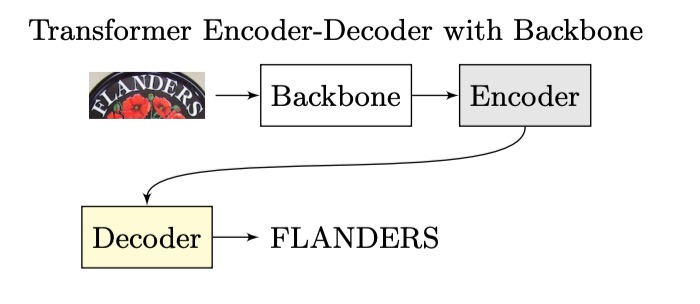
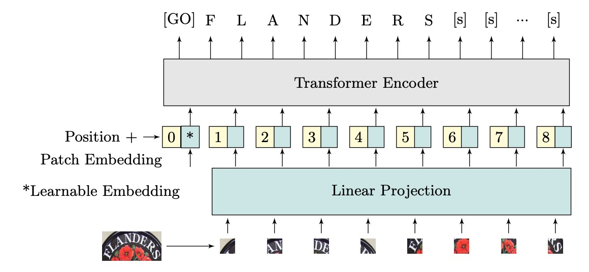
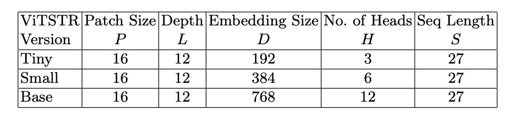
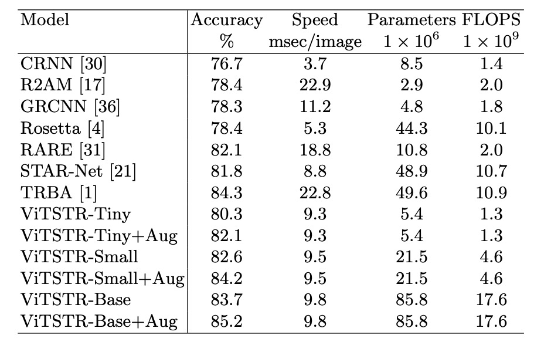

# [21.05] ViTSTR

## 編碼器就好

[**Vision Transformer for Fast and Efficient Scene Text Recognition**](https://arxiv.org/abs/2105.08582)

---

ViT 架構已經廣為人知，但 STR 領域似乎還缺少了一個標誌性的用法。

## 定義問題

我們回過頭看一下經典的 STR 架構，大概是長這樣：

<figure style={{"width": "60%"}}>

</figure>

輸入一張影像，經過 CNN 提取特徵，然後進入 LSTM 進行序列解碼，最後經過一個預測模組來得到最終的預測結果。

當 Transformer 的架構提出後，研究者們開始將這個架構應用在這個領域，整體架構就演進成這樣：

<figure style={{"width": "60%"}}>

</figure>

編碼器的部分可能是一個 CNN，也可能是一個 Transformer，或其他算法都可以，但解碼器就一致地換成 Transformer decoder。

因為不管我們要不要用自回歸的方式做推論，至少在訓練的時候是可以平行拓展，不需要等待前一個時間點的結果，就效率來說要提升不少。

而作者認為既然都已經用了 Transformer 了，為什麼不直接在編碼後直接輸出結果呢？

看看隔壁棚的 ViT，它不就是這樣做的嗎？

- [**[20.10] ViT: 新世界拓荒者**](../../vision-transformers/2010-vit/index.md)

我們只需要把架構改成這樣：

<figure style={{"width": "60%"}}>

</figure>

這樣改可以少掉一個 decoder，減少參數量，也不需要考慮自回歸的問題，是不是又快又好？

好不好還是得靠實驗來驗證。

## 解決問題

### 模型架構

作者提出了 ViTSTR，一個基於 ViT 的 STR 模型。主要差異在於預測頭部。ViT 用於單物件分類，而 ViTSTR 則用於辨識多個字元，需考慮正確的字元順序與長度。

輸入的圖像維度為 $x \in \mathbb{R}^{H \times W \times C}$，其中 $H$ 和 $W$ 為圖像高度和寬度，$C$ 為通道數。圖像被重新塑形為一個由平坦化 2D 覆蓋區域組成的序列 $x_p \in \mathbb{R}^{N \times P^2C}$，覆蓋區域的維度為 $P \times P$，序列長度為 $N$。

平坦化後的圖像區域被轉換為維度為 $D$ 的嵌入，這是通過線性投影實現的，並用可學習的類別嵌入（即 $\text{[GO]}$ token）和位置編碼相加形成輸入編碼器的向量。

ViTSTR 使用可學習的位置編碼，並在輸出時，提取與文字序列長度相對應的特徵向量，加上兩個標記 token，分別是表示文本開始的 $\text{[GO]}$ 和結束的 $[s]$ token。

:::tip
它就是 ViT。

具體計算細節，和 Transformer 的架構一樣都沒改，在此略過。
:::

### 模型訓練配置

作者共使用三種不同的模型配置如上表，分別是 ViTSTR-Tiny、ViTSTR-Small 和 ViTSTR-Base。這三種模型的編碼器都是相同的，只是編碼器的深度和維度不同。

訓練配置參數如下：

作者重做了幾個強大的基準模型，包括：CRNN、R2AM、GCRNN、Rosetta、RARE、STAR-Net 和 TRBA，以便和 ViTSTR 進行公平的比較。

每個模型至少訓練 5 次，使用不同的隨機種子，並保存測試資料集上表現最好的權重，以獲得平均評估分數。

ViTSTR 使用 DeiT 的預訓練權重，同時將輸入圖像的大小調整為 $224 \times 224$，以符合 DeiT 預訓練模型的維度要求，訓練時沒有凍結任何參數。

:::tip
一般來說，文字辨識的輸入圖尺寸大多為 $32 \times 100$，這裡作者使用 $224 \times 224$ 的圖像尺寸，感覺是有點浪費的。
:::

## 討論

### 和其他模型的比較

訓練時搭配 RandAugment 影像增強方式，包括反轉、彎曲、模糊、噪聲、扭曲、旋轉、拉伸、壓縮、透視和縮小，如下圖：

在比較中，作者也同步比較了增強和未增強的效果：

在 ViTSTR-Tiny 上，準確率提升了 1.8%；在 ViTSTR-Small 上，提升了 1.6%；而在 ViTSTR-Base 上，提升了 1.5%。

在不規則資料集上，準確率的提升最為顯著：

| 資料集     | ViTSTR-Tiny (%) | ViTSTR-Small (%) | ViTSTR-Base (%) |
| ---------- | --------------- | ---------------- | --------------- |
| CT         | +9.2            | +6.6             | +6.6            |
| SVTP       | +3.8            | +3.3             | +1.8            |
| IC15 1,811 | +2.7            | +2.6             | +1.7            |
| IC15 2,077 | +2.5            | +2.2             | +1.5            |

### 效能損耗

在場景文本辨識模型中，每當加入一個新階段，雖然準確率會提升，但速度變慢且計算需求增加。例如，從 RARE 模型升級到 TRBA，準確率提高了 2.2%，但需要增加 3880 萬個參數，並使每張圖片的處理時間減慢 4 毫秒。

當將 CTC 階段替換為 Attention（如從 STAR-Net 升級到 TRBA），計算時間從每張圖片 8.8 毫秒增加到 22.8 毫秒，準確率只提升 2.5%。事實上，將 CTC 換成 Attention 會比加入 BiLSTM 或 TPS 等階段導致更顯著的速度減慢，超過 10 倍。

在 ViTSTR 模型中，從 tiny 版本升級到 small 版本時，嵌入大小和多頭數量需要增加，但無需增加額外的階段。這樣的升級提升了 2.3% 的準確率，代價是增加 1610 萬個參數。

從 tiny 版本升級到 base 版本時，準確率增加了 3.4%，但參數數量增加了 8040 萬。

儘管參數數量增加，ViTSTR 的處理速度幾乎不變。這是因為編碼器中的 MLP 和 MSA 層依然使用相同的平行計算操作（如張量內積、softmax 和加法），只增加了張量的維度，因此每張圖片的處理時間僅增加 0.2 到 0.3 毫秒。

與多階段 STR 模型不同，新增模塊通常需要額外的順序層進行前向傳播，這無法平行處理，導致顯著的效能損耗。相比之下，ViTSTR 的升級僅涉及維度增加，效能損耗較小。

## 結論

ViTSTR 是一種簡單的單階段模型架構，強調準確性、速度和運算要求之間的平衡。透過針對 STR 的資料增強，ViTSTR 可以顯著提高準確性，尤其是對於不規則資料集。當擴大規模時，ViTSTR 保持在平衡精度、速度和計算要求的前沿。

:::tip
如果不是基於 DeiT 的預訓練權重，把特徵圖的尺寸調整為 $32 \times 100$，從頭開始訓練，不知道效果會如何？

等哪天有空再來試試看吧。
:::
