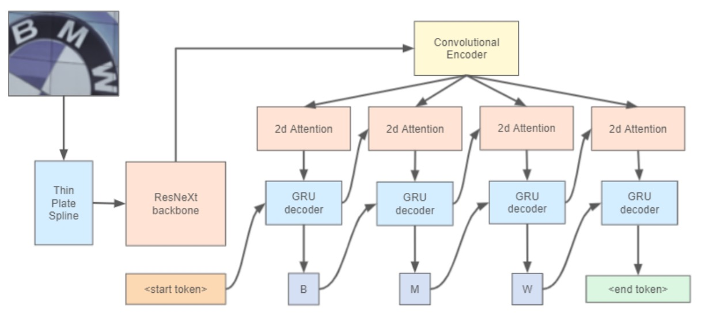
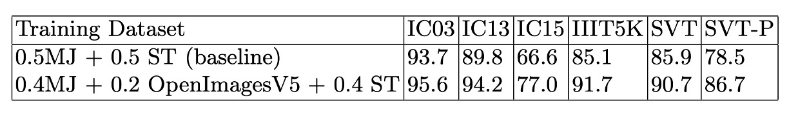

# [21.07] YATR

## 假的真不了

[**Why You Should Try the Real Data for the Scene Text Recognition**](https://arxiv.org/abs/2107.13938)

---

在 STR 領域，絕大多數的模型都是從合成資料開始的。

標準的做法是先使用合成資料進行預訓練，接著可以選擇直接在驗證資料集上進行評估。或是用小規模的真實資料進行微調後再進行評估。

## 定義問題

我們都不會否認真實資料的重要性，因為合成資料必須基於某些特定的生成規則，可能是選擇某些字型，噪音的添加，或是背景的選擇。

凡有規則必有例外，這些例外可能是合成資料無法涵蓋的，這些例外可能會對模型的泛化能力造成影響。而且對於真實世界來說，合成資料才是例外，真實資料才是規則。

用例外來擬合規則，然後跟你說這種模型有很好的泛化能力，你敢信？

這篇論文的作者認為合成資料和真實資料互相結合才是最好的訓練資料。

## 解決問題

### 模型架構

<figure style={{"width": "80%"}}>

</figure>

作者架構參考了 WWWSTR 的方法：

- [**[19.04] WWWSTR: 資料與模型分析**](../1904-wwwstr/index.md)

但不再將最後兩個階段分開，文字辨識的最後階段包含序列建模與最終預測。

影像校正部分使用 ASTER 中的 Thin Plate Spline (TPS) 技術：

- [**[18.06] ASTER: An Attentional Scene Text Recognizer with Flexible Rectification**](https://ieeexplore.ieee.org/document/8395027)

TPS 的空間變換機制分為三部分：

1. **定位網路**：首先對輸入影像生成空間變換參數。
2. **網格生成器**：根據預測參數生成一組取樣網格點，用以標示輸入影像應被取樣的位置，產生變換後的輸出。
3. **取樣器**：利用網格和輸入影像生成最終的輸出影像。

TPS 設計的優勢在於不需要逐字母的標註，因此可以在多種文字辨識架構中直接使用，且其參數可透過端到端方式學習。

Backbone 的部分採用 ResNeXt-101，這是 ResNet 的變種，具有更好的表現力。

最後是文字辨識頭，使用二維注意力圖搭配 GRU 作為解碼器。

:::tip
顯然地，這篇論文沒有在架構上有什麼創新，主要是要討論訓練資料的問題。
:::

## 討論

### 真實資料的重要性

<figure style={{"width": "80%"}}>

</figure>

作者使用了合成資料集和真實資料集進行訓練，所有實驗在相同條件下進行：ResNeXt-101 作為主幹網路，不區分大小寫的訓練和測試模式，並且本次實驗沒有使用 TPS 模組。

結果如上表，我們可以發現僅使用合成資料集無法訓練出穩健的文字辨識模型。如果只使用真實資料集進行訓練，整體辨識準確率會下降。作者認為可能原因是因為真實資料集更具挑戰性，因此模型應使用更長的訓練週期進行訓練。

最好的實驗表現是 MJSynth + OpenImagesV5，這也是作者提出的最佳訓練資料組合。

### 拿 ViTSTR 試試看

為了驗證真實資料的重要性，作者使用了 ViTSTR 進行實驗，ViTSTR 是一種基於 Transformer 的文字辨識模型。

這篇文章我們也有提到，可以參考：

- [**[21.05] ViTSTR: 編碼器就好**](../2105-vitstr/index.md)

作者使用了合成資料集和真實資料集進行訓練，結果如下表：

<figure style={{"width": "80%"}}>

</figure>

從實驗結果可以看到，使用真實資料集進行訓練的 ViTSTR 模型在所有指標上都有顯著提升，在每個驗證資料集上大約都提升了 5% 的準確率。在原始的 ViTSTR 的論文中，作者已經使用了大量的影像增強技術，但顯然這些技術無法彌補真實資料的缺失。

## 結論

使用合成資料搭配真實資料，可以提升文字辨識模型的泛化能力。

你可能認為這是一個常識，不需要再另外寫一篇論文來證明。但我們並無法得知：「到底影響有多大？」

以後如果有人再問你：「為什麼要用真實資料？具體差距是多少？」，我們認為這篇論文可以直接用來回答這個問題。
