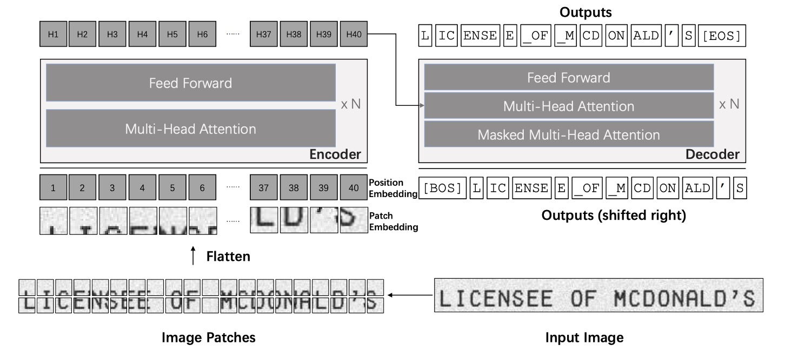
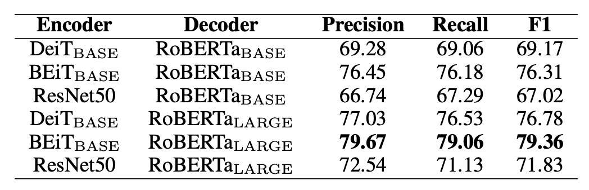
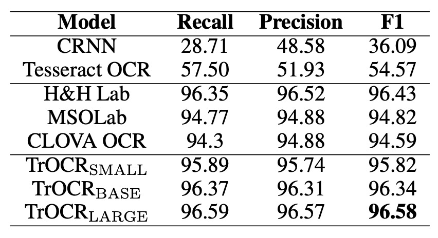

# [21.09] TrOCR

## 預訓練就是正義

[**TrOCR: Transformer-based Optical Character Recognition with Pre-trained Models**](https://arxiv.org/abs/2109.10282)

---

這是一篇簡單明瞭的論文，如果你是剛接觸這個領域的開發者，不妨從這篇論文開始。

## 定義問題

大部分現有方法仍然以 CNN 作為主幹，並透過加入 Transformer 的自注意力機制來提升文字圖像的理解能力。為了提高辨識準確度，通常會在解碼器中加入連接時序分類（CTC）和外部語言模型。

這些方法雖然取得一定成效，但多數現有模型的網路參數由頭訓練，未充分利用大規模預訓練的 CV（計算機視覺）和 NLP（自然語言處理）模型。

因此，這篇論文的作者以身作則，告訴我們應該如何使用預訓練模型來完成 OCR 任務。

:::tip
許多實驗顯示從頭開始訓練的模型效果更好，因此有一派學者認為在 OCR 領域使用預訓練模型不會帶來顯著的改進。
:::

## 解決問題

### 模型架構

<figure style={{"width": "90%"}}>

</figure>

TrOCR 模型由圖像和文本 Transformer 兩部分組成。

:::tip
這裡的架構非常原生態，我們不打算對基礎的 Transformer 架構進行解釋，如果你對 Transformer 架構不熟悉，可以參考我們之前的文章：

- [**[17.06] Transformer: 新世界的起點**](../../transformers/1706-transformer/index.md)
- [**[20.10] ViT: 新世界拓荒者**](../../vision-transformers/2010-vit/index.md)
  :::

和傳統文字辨識模型不同，作者在這裡不使用 CNN 主幹，而是處理遵循 ViT 的方式，將輸入圖像調整為 $384 \times 384$ 並分割成 $16 \times 16$ 的小塊，然後輸入圖像編碼器。在這邊的編碼器和解碼器皆基於標準 Transformer 架構，輸出經過處理的 wordpiece 單位作為辨識出的文字。

在訓練過程中，圖像編碼器從 ViT 風格的預訓練模型初始化，可以是 ViT 或是 DeiT。同樣地解碼器則可以利用 BERT 風格的預訓練模型進行初始化，例如 BERT 或是 RoBERTa。

:::tip
所以這裡有幾個重點，我們劃記一下：

1. **我們不須煩惱該使用什麼架構，用 ViT 和 BERT 預訓練模型就對了。**
2. **輸出格式不是一般的字元，而是用 wordpiece 單位作為輸出。**

如果上面提到的這些預訓練模型你不熟悉的話，可以參考我們之前讀過的文章：

- [**[18.10] BERT: 十二層編碼器**](../../transformers/1810-bert/index.md)
- [**[19.07] RoBERTa: 訓練 BERT 的說明書**](../../transformers/1907-roberta/index.md)
- [**[20.12] DeiT: 蒸餾後更香醇**](../../vision-transformers/2012-deit/index.md)
- [**[21.06] BEiT: 離散編碼預訓練**](../../vision-transformers/2106-beit/index.md)
  :::

### 訓練策略

- **第一階段**

  預訓練第一階段，從公開的 PDF 檔中隨機抽樣 200 萬頁文件，將這些 PDF 轉換為頁面圖像，並提取每行文字生成 684M 條文字行圖像。由於這些 PDF 是「數位生成」，確保了文本圖像的清晰度。

- **第二階段**

  使用開源的文字生成器 TRDG 和 5,427 種手寫字體合成手寫文字行圖像，文本內容則來自隨機抓取的 Wikipedia 頁面。此階段手寫文字數據集包含 17.9M 條文字行，其中也包含 IIIT-HWS 數據集。

  此外，作者額外收集了約 53K 張收據圖像，使用商用 OCR 引擎辨識其文字，並根據文字位置裁切並正規化圖像。

  最後使用 TRDG 生成約 100 萬條帶有收據字體和內建字體的印刷文字行圖像，最終印刷數據集共包含 3.3M 條文字行。

  如果是場景文字的話，則第二階段使用 MJSynth 和 SynthText 數據集，合計約 16M 張文字圖像。

  :::tip
  TRDG 是一個開源的文字圖像生成器，可用於為 OCR 模型訓練創建合成文字圖像。

  相關資源在這裡：[**TextRecognitionDataGenerator**](https://github.com/Belval/TextRecognitionDataGenerator)
  :::

### 參數設定

TrOCR 的影像分支使用 DeiT 和 BEiT 模型，文本分支使用 RoBERTa 模型。

其中 DeiT 模型由 `timm` 套件提供代碼和預訓練模型；BEiT 和 MiniLM 模型則來自 UniLM 官方庫；RoBERTa 模型來自 Fairseq 的 GitHub 資源頁。

:::tip
timm 是非常知名的 PyTorch 模型庫，提供了許多預訓練模型的實現。

相關資源在這裡：[**pytorch-image-models**](https://github.com/huggingface/pytorch-image-models)
:::

訓練時使用 32 顆 V100 GPU 進行預訓練，8 顆 V100 GPU 進行微調。所有模型的批量大小設為 2,048，學習率設為 $5 \times 10^{-5}$。

最後是一些細節參數：

- **解析度與切片大小**：DeiT 和 BEiT 編碼器使用 $384 \times 384$ 的圖像解析度，切片大小為 $16 \times 16$。
- **編碼器結構**：
  - $\text{DeiT}_{\text{SMALL}}$: 12 層，384 維隱藏層，6 個注意力頭。
  - $\text{DeiT}_{\text{BASE}}$ 和 $\text{BEiT}_{\text{BASE}}$: 12 層，768 維隱藏層，12 個注意力頭。
  - $\text{BEiT}_{\text{LARGE}}$: 24 層，1024 維隱藏層，16 個注意力頭。
- **解碼器結構**：
  - 小型解碼器：6 層，256 維隱藏層，8 個注意力頭。
  - 基礎解碼器：512 維隱藏層。
  - 大型解碼器：12 層，1024 維隱藏層，16 個注意力頭。

## 討論

### 編碼器與解碼器組合

既然我們有一堆編碼器和解碼器可以選擇，那麼哪一組合最好呢？

作者在這邊做了一些實驗，比較了不同編碼器和解碼器的組合，實驗基於 SROIE 資料集，結果如下表：

<figure style={{"width": "80%"}}>

</figure>

編碼器方面，測試了 DeiT、BEiT 及 ResNet-50；解碼器方面使用 RoBERTa。

結果顯示 BEiT 編碼器在三種編碼器中表現最佳，而 RoBERTa$_{\text{LARGE}}$ 解碼器也展現了最佳性能，表明在視覺任務上預訓練的模型可提升文字辨識性能。

根據這個結果，作者選用三種主要設定進行後續實驗：

- **TrOCR$_{\text{SMALL}}$**：包含 DeiT$_{\text{SMALL}}$ 編碼器和 MiniLM 解碼器（62M 參數）。
- **TrOCR$_{\text{BASE}}$**：包含 BEiT$_{\text{BASE}}$ 編碼器和 RoBERTa$_{\text{LARGE}}$ 解碼器（334M 參數）。
- **TrOCR$_{\text{LARGE}}$**：包含 BEiT$_{\text{LARGE}}$ 編碼器和 RoBERTa$_{\text{LARGE}}$ 解碼器（558M 參數）。

### SROIE 性能比較

<figure style={{"width": "70%"}}>

</figure>

上表展示了 TrOCR 模型與 SROIE 數據集上的 SOTA 模型的比較結果。

在語言建模上，MSO Lab 和 CLOVA OCR 使用 LSTM 層，H&H Lab 使用 GRU 層，而 TrOCR 模型則使用純注意力機制的 Transformer 解碼器。

TrOCR 模型在此任務上超越了現有 SOTA 模型，且無需任何複雜的前處理或後處理步驟。

### IAM 性能比較

<figure style={{"width": "95%"}}>

</figure>

上表展示了 TrOCR 模型與 IAM 手寫數據庫上的現有方法的比較結果。

根據結果，使用 CTC 解碼器的模型在此任務上表現良好，且外部語言模型（LM）顯著降低了字元錯誤率（CER）。比較 TrOCR 與其他方法，說明 Transformer 解碼器比 CTC 解碼器更具競爭力，且能在無需外部 LM 的情況下進行語言建模。

### STR 性能比較

<figure style={{"width": "95%"}}>

</figure>

TrOCR 模型在僅用合成數據進行微調，及使用合成數據與基準數據集（IC13、IC15、IIIT5K、SVT 訓練集）共同進行微調的情況下的性能，並與現有主流和最新的 SOTA 方法進行比較。

TrOCR 模型在八項實驗中取得了五項新 SOTA 結果，其餘結果也達到了相當的表現。

:::info
在 IIIT5K 數據集上，TrOCR 模型表現不佳。

作者針對這個情況進行分析，發現一些場景文字樣本圖像中包含符號，但真實標注數據中並未包含這些符號，這與預訓練數據中的標注規範（保留符號）不一致，導致模型傾向於處理符號。
:::

## 結論

TrOCR 和過去許多研究不同的地方是：預訓練模型的使用。

作者充分地利用預訓練模型的優勢，避免了傳統 CNN 架構的依賴，減少了模型的複雜性，並提升了計算效率。實驗結果表明，僅憑簡單的編碼器-解碼器架構，TrOCR 即能在多種 OCR 任務上獲得最新技術水準，展示了預訓練 Transformer 模型在 OCR 應用中的潛力與有效性。
